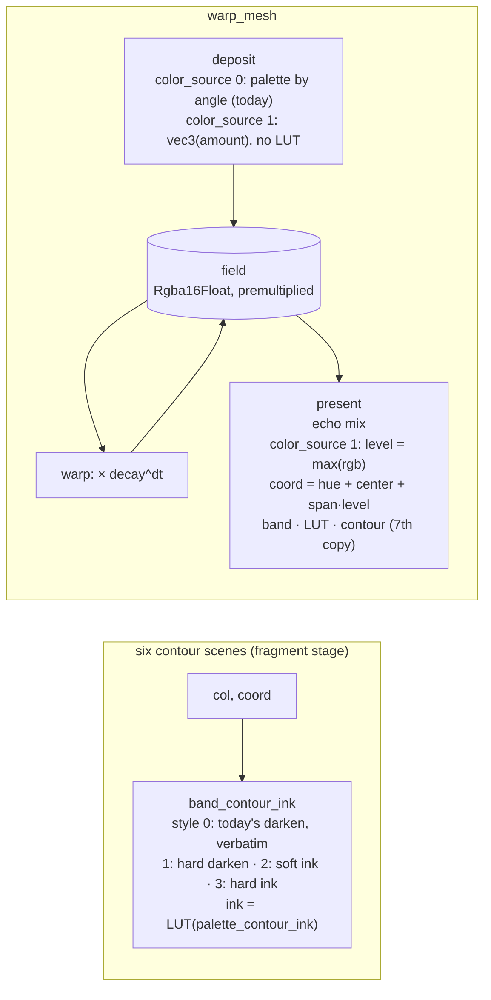

# 0184 — Limited ink: a contour that is an ink, and a warp field that bands

> **Status:** done (2026-09-17) — four phases landed (`277d7e1`, `80426fb`, `9627131`, `d575f65`,
> `a31fc17`), close review round 1 **no blockers, no majors, one minor, one nit**. Verified against
> the tree: the drift guard scans for its contour sites instead of listing them, style 0 is today's
> arithmetic at all six, the level path bands where the deposit angle cannot, and the full workspace
> suite is green unblessed.
> **Created:** 2026-09-14
> **Owner skill(s):** `dev`, `human`
> **Related ADRs:** [0197](../../adrs/0197-the-contour-can-be-an-ink-and-the-warp-field-can-be-coloured-by-its-level.md) (accepted),
> [0133](../../adrs/0133-the-band-contour-fires-where-the-ink-changes.md),
> [0138](../../adrs/0138-limited-ink-is-a-supported-palette-class-defined-at-the-draw-seam.md),
> [0078](../../adrs/0078-banding-is-a-palette-coordinate-operation.md),
> [0105](../../adrs/0105-the-mark-roster-becomes-a-fullscreen-distance-field.md)
> **Closes:** design-backlog 0140, design-backlog 0146

## TL;DR

A limited-ink look has two walls today. The band contour can only be a soft darkening toward black,
so on `shape_contourmono` it takes the frame from 9 distinct colours to 684. And `warp_mesh` colours
its light at deposit time, before the feedback loop, so `palette_steps` cannot band the structure
the loop builds. This plan does both halves of ADR-0197. First, the contour gains a Structural
`palette_contour_style` (soft or hard, black or ink) and a `palette_contour_ink` coordinate on all
six scenes where it is live. Second, `warp_mesh` gains a Structural `color_source`: at `1`, the
deposit writes uncoloured light and the present pass colours the field by its own accumulated level.
Both default to today's arithmetic, and nothing blesses. The first visible change is a hard red key
on `shape_contourmono` that adds no colour the frame did not already have. The second is a mono
`warp_mesh` world whose decay contours band into a ladder marching outward.

## Context & problem

The two backlog entries and ADR-0197's Context carry the measurements. What shapes the phases:

- **The contour is six copies, and the drift test watches four.** `fn band_contour` is
  byte-identical in `fragment_field.rs`, `reaction_diffusion.rs`, `shape_field.rs`,
  `warp_mesh/shaders.rs`, `analytic_field/shader.rs` and `cellular/shader.rs` (checked 2026-09-14).
  `the_contour_reaches_the_fragment_sites_and_not_the_vertex_one` in `core/src/render/palette.rs`
  iterates only the first four, which is ADR-0133's Outcome recurring. This plan changes the
  function's signature, so the drift test has to cover every copy before the change, or the change
  can drift on arrival.
- **Every contour site packs its palette controls differently.** `fragment_field` puts the contour in
  `params.d.w`, `analytic_field` in `c.w`, `cellular` in `b.y`, `reaction_diffusion` in `d.y`, and
  `warp_mesh`'s deposit in `d.z` with `d.w` unused. Two more floats per site means a free slot where
  one exists and an appended `vec4` where one does not. Each is a WGSL struct, a Rust POD and a
  `min_binding_size`.
- **The reader is already behind the tree.** `docs/preset-palettes.md`'s scoping table lists
  `palette_contour` as live on four scenes and omits `analytic_field` and `cellular`, which both
  carry it. `palette.rs`'s module docs say contours reach "the fragment field and reaction-diffusion".
  The docs phase repairs both, because it rewrites the same table.
- **There is already a plateau-palette harness.** `core/tests/palette_contour.rs` builds one-run,
  two-run and smooth palettes on `fragment_field` and counts darkened pixels. The contour's new
  behaviour is asserted by extending it, not by building a second one.
- **The field's working level is not known.** `color_span` is declared `0..1`. Whether a full
  palette cycle fits in that span depends on how high the accumulated level typically sits under a
  preset's `deposit` and `decay`, and nothing has measured that. Phase 2 measures it before the look
  gate judges anything.

## Decision

Take ADR-0197 as written. We rejected a hard contour without an ink (the look that raised backlog
0140 wants its key in the palette's red), an ink derived from the two adjacent bands (a darker
neighbour on a two-ink boundary draws nothing visible), composing the two warp colour paths
(every intermediate is a mixture of inks, and a coloured deposit makes the level hue-dependent), and
a second level texture beside the coloured field (twice the field for a composition already
rejected).

## Architecture diagram



## Implementation phases

### Phase 1 — The contour copies are all watched, then the contour learns a style and an ink

- **Owner skill:** dev
- **What:**
  - **First, as its own commit inside the phase:** extend
    `the_contour_reaches_the_fragment_sites_and_not_the_vertex_one` (and
    `every_wgsl_sample_site_carries_the_same_banding_expression`, if it also skips a `band_coord` copy)
    to every scene that carries the function, `analytic_field/shader.rs` and `cellular/shader.rs`
    included. The test must pass on the unchanged tree.
  - **Then:** the canonical WGSL becomes `band_contour_ink(col, t, steps, amount, style, ink_t,
    lut_a, lut_b, lut_samp, mix_ab) -> vec3<f32>`, per ADR-0197 Decision 1, at all six sites in one
    commit. The early-out and the equality test stay first, ahead of every sample. The style-0 arm
    returns `col * (1.0 - clamp(amount, 0.0, 1.0) * (1.0 - smoothstep(0.0, w, d)))`, today's
    expression. `palette_contour_style` (Structural, `0`..`3`, rounded and decoded on the CPU like
    `echo_orient`) and `palette_contour_ink` (Modal, `0`..`1`) join `common::PaletteParams`, the
    `PALETTE_PARAMS` test roster, the source-text roster in `core/tests/preset.rs`, and the `PARAMS`
    of exactly the six contour scenes. Each site's uniform gains the two values. `palette.rs`'s module
    docs name the six scenes and the four styles.
  - The generated reference and the editor schemas regenerate in the same commit
    (`RLX_UPDATE_PARAM_REFERENCE=1`, `RLX_UPDATE_PRESET_SCHEMA=1`), never hand-edited.
- **Files touched:** `core/src/render/palette.rs` (canonical WGSL const, drift tests, module docs,
  CPU `band_contour_style` decode beside `band_contour`); `core/src/render/scenes/common.rs`;
  `fragment_field.rs`, `reaction_diffusion.rs`, `shape_field.rs`, `warp_mesh/{shaders,encode,mod}.rs`,
  `analytic_field/{shader,mod}.rs`, `cellular/{shader,mod}.rs` (WGSL copy, call site, uniform slot,
  `PARAMS`); `core/tests/preset.rs` (roster); `core/tests/palette_contour.rs` (new assertions);
  `presets/README.md` generated params block; `presets/schema/*.schema.json`, `.taplo.toml`.
- **Done when:**
  - **Every copy is watched.** The drift test names every file under `core/src/render/scenes/` whose
    source contains `fn band_contour_ink`, and no such file is outside its list. That is checked by a
    scan in the test, not by a hand-kept count, so a seventh site cannot be missed the way two were.
  - **Style 0 is today, at every site.** The golden, sanity, reactivity, animation and distinctness
    suites pass with **nothing blessed**, including `fixtures/composite_symmetry.toml` (`0.4`) and
    `fixtures/shape_field.toml` (`0.7`), the two baselines that render a non-zero contour. The
    existing `palette_contour.rs` tests pass unchanged.
  - **A hard contour adds no colour at full strength.** On `palette_contour.rs`'s two-run plateau
    probe at `palette_contour = 1.0`, the set of distinct RGB values in the style-1 capture is a
    subset of the set in the same probe's `palette_contour = 0` capture plus pure black. The style-0
    capture of the same probe has values outside that set, which is the non-vacuity.
  - **A hard contour draws where the soft one does and nowhere else.** The pixels a style-1 capture
    darkens relative to contour-off are a non-empty subset of the pixels the style-0 capture darkens.
    Inside a single plateau run, style 1 still darkens nothing (ADR-0133's rule holds for every
    style).
  - **An ink contour draws in the palette's colour.** On a three-run plateau probe (two inks plus a
    third, distinct ink that also renders as its own run), style 3 at `palette_contour = 1.0` with
    `palette_contour_ink` at the third ink's coordinate changes every pixel style 0 would darken to
    exactly the code value the third ink's own run renders at in the same capture, and changes no
    other pixel. With `palette_mix = 1` against a B palette carrying a different ink at that
    coordinate, the line takes the B ink's code value instead.
  - **The scoping holds.** Setting `palette_contour_style` on a scene outside the six
    (`attractor`, say) produces the unknown-parameter warning, not a silent no-op. This is the trap
    `palette_contour` itself has, and the new names do not inherit it.
  - `core/tests/preset_schema.rs` passes against the regenerated schemas.
  - Recorded, not asserted: the backlog-0140 reading repeated on `shape_contourmono` at 640x360,
    fully driven. Report distinct colours at `palette_contour_style` 0, 1 and 3 with the shipped
    `palette_contour = 1.0`, beside the entry's 9 and 684, with the adapter named.

### Phase 2 — `warp_mesh` colours by its own level

- **Owner skill:** dev
- **What:** `color_source` (Structural, `0`..`1`, rounded) joins `warp_mesh`'s `PARAMS` and is packed
  into the deposit uniform and the present uniform. At `1`, the deposit returns
  `vec4(vec3(amount), clamp(amount, 0, 1))`, with no LUT sample. The present pass gains the two LUTs
  and the LUT sampler in its bind group. After the echo mix, it computes
  `level = max(c.r, c.g, c.b)` and `coord = base + color_span * level` (`base` being
  `hue + color_center`, as the deposit packs today), bands it, samples A/B, applies `saturation` and
  `band_contour_ink` (a seventh copy, which Phase 1's scan picks up without an edit), and writes
  `ink * coverage` with today's coverage alpha. At `0`, both passes take today's arm through a branch
  on the uniform, and every sample in the present pass stays `textureSampleLevel`.
- **Files touched:** `core/src/render/scenes/warp_mesh/shaders.rs` (`DEPOSIT_SHADER`,
  `PRESENT_SHADER`, `DepositUniform`, `PresentUniform`); `warp_mesh/encode.rs` (packing);
  `warp_mesh/resources.rs` (present bind group layout and both bind groups gain the LUT views and
  sampler the deposit already owns); `warp_mesh/mod.rs` (`PARAMS`, field); a new
  `core/tests/fixtures/warp_mesh_ladder.toml` (a mono plateau palette, `color_source = 1`, a steady
  central deposit, a small outward zoom, a decay slow enough to leave several rungs); tests in
  `core/tests/warp_mesh.rs`; the generated reference and schemas, regenerated.
- **Done when:**
  - **Mode 0 is today.** Every `warp_mesh` golden (`warp_mesh`, `warp_mesh_shader`,
    `warp_mesh_quantize`, `warp_mesh_lit_backdrop`, `warp_mesh_milk`, `warp_mesh_stroke`, and the
    three `composite_warp_*`) passes with nothing blessed.
  - **The level is measured before it is judged.** A test on the ladder fixture (named
    `#[ignore]`d measurement or printed output, per ADR-0071) reports the distribution of
    `max(rgb)` over pixels with coverage above one half, at 640x360 after warm-up: median and p95,
    with the adapter named. The log records whether a full palette cycle fits inside
    `color_span <= 1` at that working level. If it does not, the phase stops with the reading, and
    the repair (a documented gain on the level, per ADR-0197's Negative) goes back to `architect`
    before Phase 5.
  - **The field bands.** Along a ray from the deposit centre to the frame edge on the ladder
    fixture's capture, every pixel whose coverage is 1 is exactly one of the palette's ink code
    values, and the ray crosses between inks at least three times. The same capture at
    `color_source = 0`, same palette and steps, has pixels on that ray that are none of the inks,
    which is backlog 0146's smear and the non-vacuity.
  - **The echo colours once.** With `echo_alpha = 0.5` on the fixture, every pixel whose coverage is
    1 is still exactly one of the palette's inks. The level is mixed first and coloured after, so no
    blend of two inks can appear. At `color_source = 0` the same echo produces blended values, which
    is the non-vacuity.
  - Motion (whether the rungs march outward) is judged at Phase 4, not asserted here. A steady
    deposit under a steady zoom converges to a stationary radial profile, so whether the ladder moves
    is a property of an authored, pulsed deposit and not of the mechanism.
  - **A converted preset is untouched.** `warp_mesh_milk` and `warp_mesh_shader` pass unblessed.
    Nothing in `milkconv/` emits `color_source`.
  - Recorded, not asserted (ADR-0071): the frame-time cost of `color_source = 1` against `0` on the
    ladder fixture at 1920x1080, contour off and on, interleaved in one process, with the adapter
    named.

### Phase 3 — The palette reader says what a contour can be and where the warp field takes its colour

- **Owner skill:** dev
- **What:** The hand-written palette docs catch up with both halves and with the scoping drift they
  already carried.
- **Files touched:** `docs/preset-palettes.md` (the `palette_contour` rows of the parameter table;
  `## Hard bands` gains the four styles, the ink coordinate, and the warning that a hard line
  aliases on a smooth palette; `### The scene scoping` table gains `analytic_field` and `cellular` and
  names the two new parameters' reach; a short section on `warp_mesh`'s `color_source` placed beside
  the `shape_field` coordinate section, naming the level, the wrap past `1 / color_span` and the
  fading fringe); `presets/README.md` (the hand-written `warp_mesh` prose that says the palette is
  laid down by angle); `docs/presets.md` only if it restates the contour's colour.
- **Done when:**
  - The scoping table matches the tree: every scene with a `band_contour_ink` copy is marked live for
    all three contour parameters, and no other scene is.
  - No reader document touched says the contour is only a darkening, or that `warp_mesh`'s palette
    coordinate is only its deposit angle.
  - `node scripts/check-doc-links.mjs`, `node scripts/check-reader-prose.mjs` and
    `node scripts/toc.mjs --check` exit 0. A new heading moves the contents block through `toc.mjs`,
    never by hand.

### Phase 4 — The look gate: a hard key on the mono print, and a ladder world

- **Owner skill:** human
- **What:** A `preset-author` session, in the Plan 0121 Phase 6 shape, proves the surface on content.
  `shape_contourmono` is re-authored onto whichever contour style the author judges right, and its
  header's ADR-0133 paragraph is replaced by what the style now does. A new mono `warp_mesh` world is
  authored on `color_source = 1` as the op-art ladder backlog 0146 asked for. Both land under
  ADR-0081 if the author approves them, or are recorded as rejected with the reason.
- **Files touched:** `presets/shape_contourmono.toml`; one new `presets/warp_*.toml` (the author names
  it); nothing in engine code.
- **Done when:**
  - The author records a verdict on `shape_contourmono` at the chosen style: whether the key reads as
    a drawn ink edge and the frame reads as a limited-ink print. The distinct-colour reading at
    640x360 goes in the log beside Phase 1's.
  - The author records a verdict on the ladder world: whether its bands read as decay contours
    marching outward. It includes the fringe question ADR-0197 leaves to this gate, whether the fading
    outer rungs read as the ladder dissolving or as shading.
  - Any preset that lands passes the five behavioural gates, and its `drive` and `rate` readings are
    in the log against family neighbours.
  - **If the fringe reads as shading**, the verdict goes back to `architect` as a named finding (a
    coverage threshold in level mode is the obvious candidate), and ADR-0197 is accepted at close
    with that recorded rather than silently tuned around.

## Data shapes

```wgsl
// illustrative — not the final text
fn band_contour_ink(col: vec3<f32>, t: f32, steps: f32, amount: f32, style: f32, ink_t: f32,
                    lut_a: texture_2d<f32>, lut_b: texture_2d<f32>, lut_samp: sampler,
                    mix_ab: f32) -> vec3<f32> {
    let f = t * steps;
    let w = max(fwidth(f), 1e-5);
    if (steps < 1.5 || amount <= 0.0) { return col; }
    // ...ADR-0133's lo/hi equality test, unchanged; equal -> return col...
    let d = min(fract(f), 1.0 - fract(f));
    if (style < 0.5) {
        return col * (1.0 - clamp(amount, 0.0, 1.0) * (1.0 - smoothstep(0.0, w, d)));
    }
    // `style` arrives rounded to 0..3 from the CPU, so the comparisons are exact.
    let hard = style == 1.0 || style == 3.0;
    let cover = select(1.0 - smoothstep(0.0, w, d), f32(d < w), hard);
    let ink_lut = mix(
        textureSampleLevel(lut_a, lut_samp, vec2<f32>(ink_t, 0.5), 0.0).rgb,
        textureSampleLevel(lut_b, lut_samp, vec2<f32>(ink_t, 0.5), 0.0).rgb,
        clamp(mix_ab, 0.0, 1.0)
    );
    let ink = select(vec3<f32>(0.0), ink_lut, style >= 2.0);
    return mix(col, ink, clamp(amount, 0.0, 1.0) * cover);
}
```

## Risks & open questions

- **A shader compiler contracts the style-0 arm differently from the old `col * band_contour(...)`
  call.** The expression is textually the same product, but it moves from a returned scalar to an
  inline product, and an FMA contraction could move a code value. The golden tolerance absorbs
  rasterizer-scale drift. A moved golden is still a stop to name, not a re-bless.
- **Uniform growth on six scenes collides with a live lane.** Plan 0175 touches no scene uniform, so
  there is no collision with the current roster, but any plan that re-lays out one of these six
  uniforms must sequence against Phase 1.
- **The level's working range may make `color_span` too small.** Phase 2 measures it and stops if so.
  That is priced, not hedged.
- **Level mode reads the draw layer's light too.** A native preset with waveforms or shapes in its
  draw layer contributes coloured light, and `max(rgb)` counts it at its intensity. No native preset
  ships a draw layer, but the docs phase says what happens.
- **Composite remaps after level colouring make non-ink values** (`brighten`'s square root,
  `solarize`). That is an author's choice on a flag, and it is stated rather than prevented.

## What this plan does NOT do

- **It does not change where the contour fires.** ADR-0133's equality rule is untouched for every
  style.
- **It does not give contours to the vertex-stage or CPU-sampled scenes** (attractor, swarm, emitter,
  line scenes). ADR-0078's scoping stands.
- **It does not anti-alias a hard contour** or add a line-width parameter. The hard footprint is the
  soft one's.
- **It does not compose the two `warp_mesh` colour paths**, and it does not add a second field
  texture.
- **It does not touch `milkconv/`** or a converted preset's colours.
- **It does not retune any shipped preset other than through Phase 4's authored session.**

## Implementation log

> Written by `dev` — one row per phase as that phase's commit lands, and the close block after the
> last one. **The phases above are the contract; everything here is what happened.**
> **Observations, never conclusions:** this says where to look, architect decides how it went.
> No per-criterion pass list, no self-assessment, no narrative — but a deviation from the plan or
> an unmet done-when is always disclosed. Stays shorter than `## Implementation phases` above.

**Lane:** `C:\Users\Igor Konovalov\WORK\rlx-plan-0184` on branch
`plan-0184-a-contour-that-is-an-ink-and-a-warp-field-that-bands`

| phase | owner | state | commit |
|---|---|---|---|
| 1 — The contour copies are all watched, then the contour learns a style and an ink | dev | done | `277d7e1` (the watch), `80426fb` (the style and ink) |
| 2 — `warp_mesh` colours by its own level | dev | done | `9627131` |
| 3 — The palette reader says what a contour can be and where the warp field takes its colour | dev | done | `d575f65` |
| 4 — The look gate: a hard key on the mono print, and a ladder world | human | done | committed with this row |

### Notes

**Phase 1 — two done-when subset claims are asserted in the opposite direction, and one of them as
a bound.** Both concern the same 8-bit fact.

- *"The pixels a style-1 capture darkens relative to contour-off are a non-empty subset of the
  pixels the style-0 capture darkens."* The two styles share the footprint `d < w`, but the soft
  ramp's outermost sliver darkens by **less than one code value** and so is invisible to any
  differential, while the step paints it at full strength. The hard set is therefore the soft set
  plus that fringe, not a subset of it. `a_hard_contour_draws_where_the_soft_one_does_and_barely_wider`
  asserts containment the other way (every pixel the soft line darkens, the hard one darkens) plus
  `hard <= 1.5 * soft` on the counts. Measured at the fixture: the ratio is far inside that.
- *"...changes every pixel style 0 would darken ... and changes no other pixel."* On a palette whose
  inks already include the ink, the line is **invisible where it is laid over its own run** — at the
  ink2/ink3 boundary only the ink2 side moves, which is the property the style exists for.
  `an_ink_contour_draws_in_the_palettes_own_colour` asserts the equivalent claim that survives that:
  the line's whole footprint (taken from a style-1 capture, which is visible against every ink)
  renders **exactly** the ink's own code value, and nothing outside the footprint changes.

**Phase 1 — two paths in `Files touched` do not exist under those names.** `core/tests/preset.rs`
and `core/tests/palette_contour.rs` are `core/tests/suite/preset.rs` and
`core/tests/suite/palette_contour.rs`; both were edited there. `.taplo.toml` did not regenerate — no
new filename family.

**Phase 1 — `core/tests/suite/preset.rs`'s `STRUCTURAL` roster gained six rows**, one per contour
scene, beyond the `PALETTE_BLOCK` roster the plan names. ADR-0180 rule 2's gate is a second,
hand-kept statement of every `ParamKind::Structural` declaration and it is red without them.

**Phase 1 — packing.** Free adjacent slots took the pair on `fragment_field` (`e.zw`) and
`reaction_diffusion` (`d.zw`); `shape_field`, `analytic_field`, `cellular` and `warp_mesh`'s deposit
each gained one appended `vec4`, because none of the four had a free *pair* and splitting one control
across two unrelated slots is the packing the plan's own Context complains about.

**Phase 1, recorded not asserted — the backlog-0140 reading.** `shape_contourmono`'s params and
palette rendered from a scratch file through `shot`, 640x360, 120 frames, stimulus
`bass=1,mid=1,treb=1,onset=1,bar=1,novelty=1,beat=1`, `palette_contour = 1.0` throughout. Adapter
**AMD Radeon(TM) Graphics (Dx12, IntegratedGpu), driver 30.0.13002.1001**, debug profile, floor tier.

| `palette_contour_style` | distinct colours | share at the reddest value (`#d63131`) |
|---|---|---|
| `0` (shipped) | 677 | 4.63 % |
| `1` hard black | **9** | 4.57 % |
| `3` hard ink at `palette_contour_ink = 0.955` | **9** | 11.70 % |

The entry's own figures were 9 with the contour off and 684 at `1.0`; the 677 here is the same
reading on a stimulus and frame count that were not recorded with it. The `0` row is not the
contour-off frame — it is the shipped preset.

**Phase 2 — the level measurement lives in the crate, not beside the suite.** The field is reachable
only from a `#[cfg(test)]` accessor inside `rlx-core`, so
`the_level_the_field_works_at` is an `#[ignore]`d printed report in
`core/src/render/scenes/warp_mesh/tests.rs`. It restates the fixture's constants and
`the_level_probe_matches_the_ladder_fixture` holds the two together by parsing the fixture's own
bindings. The behavioural assertions are in `core/tests/suite/warp_mesh.rs` (the plan writes
`core/tests/warp_mesh.rs`) and the cost reading is a new `core/tests/warp_level_cost.rs`, beside the
five other `*_cost` binaries.

**Phase 2 — the reading.** `warp_mesh_ladder.toml` at 640x360, 240 frames, over texels with coverage
above one half. Adapter **AMD Radeon(TM) Graphics (Dx12, IntegratedGpu), driver 30.0.13002.1001**,
debug. `max(rgb)`: p05 **1.0859**, median **1.9033**, p95 **3.2305** — a range of **2.1445**, so a
full palette cycle fits inside `color_span = 1` and the phase does not stop.

**Phase 2 — the non-vacuity for *the field bands* is the ray's crossing count, not a stray count.**
The done-when asks for pixels on the ray at `color_source = 0` that are none of the inks; on this
fixture there are **none anywhere in the frame** (measured: 1614 pixels match exactly one ink, 7602
match several because they are black or clipped, 0 match none). A purely radial resample of a radial
sector pattern does not blend two sectors above the 8-bit floor. What the ray does show is the
sharper version of the same claim, and it is backlog 0146's own words: the level path crosses
between inks **10** times along the ray and the deposit-angle path **0** times, because the angle
coordinate is constant along a ray. Both figures are printed; the stray count is printed beside them.

**Phase 2 — `echo_zoom` had to move for the echo assertion to mean anything.** The echo samples
`(uv - 0.5) / echo_zoom + 0.5`, so at the default `1.0` it reads the pixel it is already on and
`mix(c, c, alpha)` is the identity. The test sets `echo_alpha = 0.5` **and** `echo_zoom = 1.6`.

**Phase 2 — the ladder fixture renders at `brightness = 0.25`.** At `color_source = 0` the field
holds the level multiplied into the ink and reaches about four, and the tonemap's shoulder was
compressing the three brightest inks onto one byte — which made the smear the suite compares against
invisible rather than absent. In level mode the present writes `ink * coverage`, which never exceeds
one, so this only dims the picture.

**Phase 2, recorded not asserted — the cost.** `warp_mesh_ladder.toml` at 1920x1080, 100 frames of
slope, best of 3, interleaved in one process, same adapter, debug.

| `color_source` | `palette_contour` | ms/frame | share of 16.67 ms | vs the angle path, contour off |
|---|---|---|---|---|
| 0 | 0 | 1.715 | 10.3 % | — |
| 0 | 1 | 1.778 | 10.7 % | +0.063 |
| 1 | 0 | 1.695 | 10.2 % | −0.020 |
| 1 | 1 | 1.796 | 10.8 % | +0.081 |

**Phase 2 — `milkconv/` and `core/src/milk/` contain no `color_source`**, checked by grep over the
tree.

**Phase 3 — `presets/README.md`'s own hard-bands section was repaired too**, beyond the `warp_mesh`
prose the plan names. Its bullet said contours reach *"`fragment_field` and `reaction_diffusion`"*,
the same drift `docs/preset-palettes.md` carried, and its parameter table described only the
darkening. `docs/presets.md` was read and left alone: it never restates the contour's colour.

**Phase 3 — `docs/preset-palettes.md` carries no contents block**, so `toc.mjs` rewrote nothing for
its two new `###` headings; `presets/README.md`'s block is `depth=3` and gained no heading.

### Phase 4 — the look gate

Taken 2026-09-17 in the `preset-author` lane, at 640x360 unless a line says otherwise, on the same
adapter Phases 1 and 2 recorded. Both presets land under ADR-0081; `architect` curates the set.

**`shape_contourmono` moves to `palette_contour_style = "1"` — the hard black key.** All four styles
were rendered at the shipped `palette_contour = "1.0"` and the distinct-colour reading reproduces
Phase 1's exactly, which is the first thing worth recording: 677 at style 0, **9** at style 1, 924 at
style 2, **9** at style 3.

- **The verdict on the key:** at style 1 it reads as a drawn ink edge. The soft style's line carried a
  grey shoulder at every white/black boundary, which is what the world's own header objected to; the
  step removes it, and the frame reads as a woodcut with registration rather than a softened one.
- **Style 3 was rendered and rejected, on composition rather than on ink count.** Drawn at
  `palette_contour_ink = "0.955"` it also measures 9 colours and it makes a striking frame, but it
  lays a red line at every run boundary: red goes 4.57 % -> **11.70 %** of the frame and the accent
  band stops being distinguishable from the key. Recorded in the preset's header as a rejected
  alternative, not as a tuning note.
- **The amount table was re-measured under the hard style**, since the shipped one was taken on the
  soft one: 17 distinct colours at `0.25`, 18 at `0.5`, **9** at `1.0`. The argument for full strength
  is now exact rather than a trade — at `1.0` the line's value is pure black, an ink the palette
  already holds, so the key costs nothing.

**The new world is `presets/warp_ladder.toml`, "Ladder"** — `color_source = "1"`, a centred deposit,
six palette runs at `color_span = "0.085"`, twelve bands. Its bands **are** the decay contours
backlog 0146 asked for, and they march outward.

- **The verdict on the ladder:** the rungs read as decay contours, and the world is the op-art print
  the entry wanted. What it is **not** is a limited-ink one, which is the finding below.
- **ADR-0197's fringe question, answered: the fade reads as shading, not as dissolving — and at
  `palette_steps = "0"` it is not a fringe at all but the whole frame.** The present writes
  `ink * coverage` and coverage is a continuum, so a two-ink palette measures **851** exact colours.
  What recovers most of it is `palette_steps`: quantizing the palette coordinate quantizes the level
  the coverage is computed from, and the same frame at twelve bands measures **60**. The preset ships
  at twelve for that reason, and its header states the count rather than claiming an ink class.
  **A coverage threshold in level mode — the candidate ADR-0197 names — is the shape this points at**,
  and it is `architect`'s to weigh, not something to tune around.
- **`palette_contour` is inert on this world, for a mechanical reason worth recording.** It draws at a
  *band* edge, so at `palette_steps = "0"` there is no edge to draw at: 851 colours with the key at
  full strength and 851 without it, measured both ways. With the twelve bands on it does bite (60 ->
  56 colours, about a tenth of the frame turning true black), and it is still off — on a duotone the
  key falls inside the black rung it would mark. A palette's own flat runs are not band edges.
- **The horizon was run, because the filmstrip forced the question.** Over the first seconds the
  ladder adds rungs steadily, which looks like a world winding itself tighter. Five simulated minutes
  at 96x96: coverage 0.408 -> 0.619 and `peak/mean` 2.467 -> 1.629, both flat to within one part in a
  hundred across the last three rows, against a static control at `delta 0.0000, monotone 0.00`. The
  first two minutes are the leaky integrator filling; the verdict is in the preset's header.
- **Readings against family neighbours.** Contour Mono `drive` **0.366**, `rate` **0.0041**, in a
  `shape_field` family spanning 0.125-0.444 and 0.0035-0.0165 — mid-family, so the key changed the
  look without moving the behaviour. Ladder `drive` **0.560**, `rate` **0.0345**, against a
  `warp_mesh` family spanning 0.058-0.117 and 0.0015-0.0032: a 5x and 10x outlier, recorded rather
  than tuned away. Its neighbours are slow fluid worlds, and the report's own note applies — motion
  inside a static repeating structure reads calmer than the number suggests.

**The gate that authorizes the two presets:** `cargo nextest run -p rlx-core` through the conductor's
lock, **1496 passed, 0 failed, 7 skipped**, nothing blessed and the worktree clean afterwards. The
first run of it failed on one test and that is the deviation below.

**Deviation from the phase's `Files touched`, disclosed:** it names the two presets and "nothing in
engine code", but a preset that ships needs a `CARDS` entry in `scripts/docs-shots.mjs` and a
committed render, or `hygiene::every_shipped_preset_has_a_gallery_card` fails — and it did, on the
first run of the suite. The two cards were rendered **by hand at the manifest's own settings**
(`--signal dynamic:110 --frame-at 300 --size 640x360 --tier rich`) rather than by re-running the
script over the whole gallery, which would have rewritten about a hundred PNGs with rasterizer drift.
`shape_contourmono`'s card is re-rendered because its look changed.

### Close triggers

- **`presets/` touched:** yes. Phases 1-3 touched **no** `.toml` preset; **Phase 4 adds
  `presets/warp_ladder.toml` and re-authors `presets/shape_contourmono.toml`** onto the hard style,
  both under ADR-0081, with two gallery cards and a `CARDS` entry beside them.
  `presets/README.md` moved three ways — its generated params block regenerated for the three new
  `ParamSpec`s, its hand-written `warp_mesh` prose, and its hand-written hard-bands section — and
  `presets/preset.schema.json` plus seven files under `presets/schema/` are regenerated output.
- **Plan header `Closes:`** design-backlog 0140, design-backlog 0146.
- **What shipped:** a feature. Three new preset parameters (`palette_contour_style`,
  `palette_contour_ink` on six scenes; `color_source` on `warp_mesh`), all three defaulting to the
  arithmetic that shipped before them.
- **Operator docs touched:** `docs/preset-palettes.md` and `presets/README.md`.
  `docs/specs/player-schema.json` is generated and moved with the schema export.
- **Backlog probes (`node scripts/check-backlog-claims.mjs`):** exit 0 — 75 stated reductions hold
  across 33 live entries, 2 unprobeable, 36 advisory path-moved rows.
- **Full suite:** owed to the conductor's pre-review gate (ADR-0207). Run per phase instead:
  `cargo nextest run --workspace -P fast` (1693 passed, 305 skipped) plus the five deferred suites
  this plan's blast radius calls for — `golden`, `sanity`, `reactivity`, `animation`, `distinctness`
  — at both Phase 1 and Phase 2, **372 passed, 3 skipped, nothing blessed** each time.
- **Outstanding `human` phases:** none. Phase 4 was taken 2026-09-17 and its two verdicts are above:
  `shape_contourmono` ships on the hard black key, the ladder world ships and is **not** a
  limited-ink print. ADR-0197's fringe question is answered against it — the fade reads as shading —
  so the ADR is accepted at close **with that recorded**, per the phase's own stop condition, and the
  coverage-threshold candidate goes back to `architect` as a named finding rather than being tuned
  around.

## Close review

> Mode 4, conductor mode (ADR-0205), round 1, 2026-09-17. Written by a fresh session handed the plan
> and the lane and nothing an implementer wrote. Reviewed at branch tip `b1fa0fc0`, before the close's
> own repair, merge and bookkeeping.

**Verdict: Plan 0184 landed cleanly — no blockers, no majors, one minor and one nit.** Both halves of
ADR-0197 are in the tree, both default to the arithmetic that shipped before them, the drift guard
now *scans* for its sites instead of listing them, and the two behavioural claims the plan could not
assert as written are asserted in the shape that survives the 8-bit floor, with the deviation
disclosed in the log. The full workspace suite is green on this tree.

### Evidence this review ran on

- **Full suite.** `node tools/conductor/with-lock.mjs suite -- cargo nextest run --workspace`
  printed, in place of a run:

  ```
  with-lock: skipped cargo nextest run --workspace: tree 30dadcc is green in the suite
  ledger, run by gate 0184-pre-review at 2026-09-17T15:06:08.511Z:
  1999 tests run: 1999 passed (5 slow), 7 skipped
  ```

  That is ADR-0207's ledger record, written by the process that saw the exit code, and it is this
  lens's full-suite evidence. `dev`'s `**Full suite:**` bullet says it is owed to the conductor's
  `pre-review` gate; in conductor mode that is correct, not a missing run.
- **`RUSTDOCFLAGS="-D warnings" cargo doc --workspace --no-deps`** — green, all six crates.
- **`node scripts/check-doc-links.mjs`** — OK, 482 tracked files.
- **`node scripts/check-reader-prose.mjs`** — OK, 16 documents, 0 bare citations.
- **`node scripts/toc.mjs --check`** — OK, 7 blocks, 607 rows, current.
- **`node scripts/check-index-rows.mjs`** — OK, 0 over cap, 0 misshaped.
- **`node scripts/check-comment-hygiene.mjs`** — OK, 290 tracked sources, 0 escapes in use.
- **`node scripts/check-backlog-claims.mjs`** — exit 0, 80 reductions across 34 live entries, 2
  unprobeable, 36 advisory path-moved rows.
- **`node scripts/check-translations.mjs`** — exit 0, 5 stamped; **the advisory is empty — no
  translated source has moved past its stamp.** This plan touched no English source with a Russian
  copy.
- **The site route ceiling, priced by hand** (ADR-0166's gate needs a built site and runs only in
  `pages.yml`, after the push). Replicating `split-document.mjs`'s chunking on the two documents this
  plan grew: `docs/preset-palettes.md` 71,649 B → 19 routes, largest 16,947 B (`## Hard bands`);
  `presets/README.md` 336,255 B → 69 routes, largest 22,935 B. Both are clear of the 30,000-byte
  ceiling, so the push will not turn `pages.yml` red.

### Lens 1 — alignment with the plan and ADR-0197

**Phases, owners, commits.** Four phases, each with a single in-vocabulary `**Owner skill:**` tag
(`dev` ×3, `human` ×1). All four landed, in order: Phase 1 `277d7e1` + `80426fb`, Phase 2 `9627131`,
Phase 3 `d575f65`, Phase 4 `a31fc17`. `b014a23a` is a repair commit from an earlier attempt at this
close that parked `merge_conflict` (the cause is now backlog 0249 and 0250); its four prose repairs
are in the tree and were re-read here as part of the review, not taken on trust.

**Phase 1, the done-when this plan exists to make un-missable.** *"The drift test names every file
under `core/src/render/scenes/` whose source contains `fn band_contour_ink`, and no such file is
outside its list."* — **met, and met by construction.** `core/src/render/palette.rs`'s
`scene_files_containing` walks the directory at test time and `source_of` *panics naming the file to
add* when the scan turns up a path `SCENE_SOURCES` has no `include_str!` for. The membership side
cannot be satisfied by remembering, which is exactly the failure ADR-0133's Outcome recorded twice.
The floors (`>= 6` contour carriers, `>= 7` `band_coord` carriers) catch a *removal*, and the
`particles/shaders.rs` exclusion is asserted against the scan's own output rather than against a
separate `contains`.

**The two done-when claims that could not be asserted as written are disclosed, and the replacements
are the stronger claims.** The log's first Notes entry says so; reading the tests confirms both
readings:

- *"the pixels a style-1 capture darkens … are a non-empty subset of the pixels the style-0 capture
  darkens"* is false by one sliver — the soft ramp's outermost pixel darkens by less than one code
  value, so no differential sees it, while the step paints it at full strength.
  `a_hard_contour_draws_where_the_soft_one_does_and_barely_wider` asserts containment the other way
  plus `hard <= 1.5 * soft` on the counts, and re-asserts ADR-0133's rule for the hard style as an
  **exact byte identity** on a one-run palette. The bound is a dimensionless ratio of two counts of
  the same kind (ADR-0074), argued from the fringe being a fraction of the line's width — a property,
  not a frozen number.
- *"changes every pixel style 0 would darken … and changes no other pixel"* is false where the ink is
  laid over its own run, which is the property the style exists for.
  `an_ink_contour_draws_in_the_palettes_own_colour` takes the footprint from a **style-1** capture
  (visible against every ink) and asserts the ink capture equals a flat-ink capture of the same probe
  **byte for byte** on it, and changes nothing outside it. The A/B half repeats it through
  `palette_mix = 1` against a different third ink, with a guard that palette B's ink does not render
  palette A's bytes — so the crossfade half cannot pass without moving.

`a_hard_contour_adds_no_colour_the_frame_did_not_have` carries its own non-vacuity twice: the hard
line must darken something, and the *soft* line must invent colours the contour-off frame lacks, or
the hard line's not doing so says nothing.

**The scoping done-when** is asserted in both directions
(`the_contour_style_and_ink_are_unknown_off_the_six_scenes`): the two names warn on `attractor`
**and** are silent on `fragment_field`, so the test cannot pass for a name the engine has never heard
of. That is the trap `palette_contour` itself carries and the plan said the new names must not
inherit.

**Phase 2.** `color_source` is `ParamKind::Structural`, rounded by `warp_mesh/mod.rs::colour_source`
and clamped, with the same argument `echo_orient` carries and an entry in
`core/tests/suite/preset.rs`'s rounding roster. The deposit's level arm writes `vec3(1.0)` and the
shared tail multiplies by `amount`, so the field receives `vec4(vec3(amount), clamp(amount, 0, 1))` —
the plan's text exactly. The present block is inserted **after** the echo and **before**
`brightness`/`gamma`/the composite remaps, reads `level = max(c.r, max(c.g, c.b))`, bands
`hue + color_center + color_span * level`, samples A/B, applies `band_contour_ink` (the seventh copy,
which Phase 1's scan picks up with no edit) and `saturation`, and writes `ink * coverage` with today's
alpha. Every sample it adds is `textureSampleLevel`. Both branches are on a **uniform**, which is what
keeps the `fwidth` inside `band_contour_ink` in uniform control flow.

`core/tests/suite/warp_mesh.rs`'s new block is the strongest test in the plan, and its premise is
worth naming: **in level mode the field's evolution does not depend on the palette at all**, so "this
pixel is one of the palette's inks" is checkable *exactly* — against a capture of the same fixture
with that ink end to end, through the tonemap and the position-dependent dither. Both
`the_level_bands_the_field_where_the_deposit_angle_smears_it` and
`the_echo_mixes_levels_and_the_result_is_coloured_once` rest on it, and each carries a deposit-angle
control.

**The Phase 2 non-vacuity substitution is right, and the log discloses it.** The done-when asked for
stray non-ink pixels on the deposit-angle ray; there are none anywhere in that frame, because a purely
radial resample of a radial sector pattern blends nothing above the 8-bit floor. What the test asserts
instead is sharper and is backlog 0146's own sentence: the level path crosses between inks **10**
times along a ray and the angle path **0**, *because the angle coordinate is constant along a ray*.
The `angle_crossings == 0` assertion is a property of the coordinate's geometry, not a measurement,
and the stray count is printed beside it.

**Phase 2's stop condition did not fire, and the reading is real.** `the_level_the_field_works_at` is
an `#[ignore]`d printed report inside the crate (the field is reachable only from a `#[cfg(test)]`
accessor), and `the_level_probe_matches_the_ladder_fixture` parses the fixture's own bindings to hold
the two together — which is the right repair for a probe that has to restate constants. p05 1.0859 /
median 1.9033 / p95 3.2305, a range of 2.1445, so a full cycle fits inside `color_span = 1`.
`core/tests/warp_level_cost.rs` is ADR-0071-shaped throughout: no threshold, the adapter and profile
printed, a hardware-only skip with a notice, four interleaved rungs, and a non-vacuity assertion that
it measured four different positive things. It also matches `binary(/_cost$/)`, so it inherits Plan
0174's isolation without an edit, and it uses `mod common` rather than pasting the ADR-0016 skip.

**Phase 3** met all three done-whens. The scoping table now marks exactly the six carriers, the two
traps are stated in opposite directions (`palette_contour` inert and silent; the two new names unknown
and warning), and the limited-ink mixer table's `palette_contour` row now names the hard styles as its
own escape rather than only `"0"`. `docs/presets.md` was read and correctly left alone — it never
restates the contour's colour.

**Phase 4's verdicts are recorded with their measurements**, including the one that goes against the
plan's own hope: the ladder is the op-art world backlog 0146 asked for and is **not** a limited-ink
print (851 exact colours from two inks at `palette_steps = 0`, 60 at twelve), and ADR-0197's fringe
question is answered *fade reads as shading*. The phase's stop condition — route it to `architect` as
a named finding rather than tune around it — is honoured. The `CARDS`/gallery-render deviation from
`Files touched` is disclosed, and the two cards were rendered at the manifest's own settings rather
than by re-running the whole gallery, which is the correct call.

### Lens 2 — layering, coupling, real-time safety

Nothing to report. No platform or audio-source type entered `core/`; no raw GPU call escaped the wgpu
layer; the C ABI and the control protocol are untouched in shape (`docs/specs/player-schema.json` is
generated output and moved with the three new `ParamSpec`s, which is the schema following the engine
rather than the protocol widening). The two new CPU-side helpers (`palette::band_contour_style`,
`warp_mesh::colour_source`) are total pure functions with non-finite fallbacks, on the uniform-upload
path, allocating nothing. The present bind group grew by three entries built once per
`Resources::build`; the LUT textures are written with `queue.write_texture` into stable views, so the
present bind group cannot go stale on a palette change, and a resize rebuilds the whole `Resources`
including both. `min_binding_size` on the present uniform is derived from `size_of::<PresentUniform>()`,
so the three appended `vec4`s cannot drift from the layout.

### Lens 3 — docs, bookkeeping, release

- **Operator docs swept correctly.** `docs/preset-palettes.md` (the parameter table, `## Hard bands`'
  new style section with its anti-aliasing warning, the scoping table, and a new `color_source`
  section) and `presets/README.md` (generated params block, the hand-written `warp_mesh` prose, and
  its own hard-bands table and scoping paragraph — the latter two beyond what the plan named, and both
  were carrying the same drift). Generated regions were regenerated, not hand-edited:
  `presets/preset.schema.json`, seven files under `presets/schema/`, and `docs/specs/player-schema.json`
  all move with the `ParamSpec`s, and `core/tests/suite/preset_schema.rs` is green.
- **`.taplo.toml` correctly did not regenerate** — no new filename family.
- **`docs/preset-guide.md`, `docs/preset-tuning-walkthrough.md`, `docs/testing.md`,
  `docs/capturing.md`, `docs/configuration.md`, `docs/running.md`, `docs/developing.md`** — checked
  and owed nothing. No system look changed, no harness contract moved, no flag or key moved. The site
  gallery is globbed from `docs/images/gallery/presets/`, so `warp_ladder` joins it and its family
  count moves without an edit.
- **Version bump owed: `minor`.** Three new preset parameters, all defaulting to the arithmetic that
  shipped before them. `main` moved to 0.129.0 while this lane was open, so the bump is computed
  against that rather than against the branch's base.

### Lens 4 — correctness and determinism

- No `fwidth` or aspect is taken from an internal grid; the level coordinate is a scalar and the
  contour's footprint is a screen-space derivative as it was before (ADR-0037 clean).
- No wall-clock read entered analysis. `warp_level_cost.rs` times deliberately and says so, with the
  `clippy::disallowed_methods` escape carrying a reason.
- No new `unwrap`/`expect` on a hot path. Every one added is in `#[cfg(test)]` or a test binary.
- **The numeric assertions are properties.** `hard <= 1.5 * soft` is a ratio of two like quantities
  with a mechanism behind it; `angle_crossings == 0` is a geometric identity; every ink comparison is
  an **exact byte equality against a capture taken in the same process at the same size**, which is
  the strongest available form and needs no tolerance. Nothing added a frozen number asserted
  universally, and the two frame-time tables are in the log with the adapter, driver and profile
  named.
- **The configuration-coincidence question.** The one place two sources could agree here is the
  contour footprint: styles 0 and 1 share `d < w`, and on a *smooth* palette both would be visible and
  hard to tell apart. The tests use plateau palettes with the transitions placed on band **edges**
  (`PLATEAU_STEPS = 20` puts centres at `0.025 + 0.05k`, and `three_runs`' transitions sit at
  `0.34/0.36` and `0.64/0.66`), which is the configuration where the two disagree — the hard line
  resolves to one flat value and the soft one does not. That is probed, and probed in both directions.

### Lens 5 — design integrity

The contour stayed one function written six times, and the guard against that being a lie got strictly
stronger. The seventh copy — the present pass's — is the first on a coordinate that is a *feedback
level* rather than a field evaluated in closed form, and the comment says so. `color_source` is a
branch on a uniform inside one pipeline rather than a second pipeline with a second layout, which is
the decision that keeps `warp_mesh`'s creation order (ADR-0058's hazard) intact. No seam widened: the
`Scene` trait, the C ABI and the OSC vocabulary are untouched.

### Findings

**minor — `docs/plans/done/0184-…md`, the `## Implementation log` outweighs the contract it reports
on.** The log runs 213 lines against `## Implementation phases`' 150. Nothing gates that property,
which is why the lens states it. **Left open deliberately, and not repaired:** the excess is almost
entirely Phase 4's look-gate record and Phases 1-2's recorded-not-asserted measurement tables, and the
only repair available to a close is deleting measurements the close exists to preserve. Trimming it is
the owner's call, not a mechanical one. Recorded so the next plan's log is written shorter rather than
this one's cut.

**nit — `presets/shape_contourmono.toml`, a mechanism claim its own table contradicts.** *"Below 1.0
it is a darkened grey, one new value per ink run it crosses."* The palette has five runs and three
inks, and the table two lines below measures 9 → **17** at `contour 0.25` and **18** at `0.5` — eight
and nine new values. Whatever produces them, it is not one per run, and a future author sizing
`amount` from that sentence would predict 14. **Fixed in `a3d2be38`**: the count is dropped and the
qualitative fact the measurements do support is kept.

### Curation — the preset set

**What landed earns its place.** `warp_ladder` is the sixth `warp_mesh` preset and the only one on
`color_source = 1`; nothing in the family converges on it, because nothing else in the engine bands a
feedback level. Its `drive` **0.560** / `rate` **0.0345** are a 5x and 10x outlier against a
`warp_mesh` family spanning 0.058-0.117 and 0.0015-0.0032 — recorded rather than tuned away, and the
reading is honest: its neighbours are slow fluid worlds and this one is a marching structure, which
the report's own note says reads calmer than the number. `shape_contourmono` is a retune, not an
addition, and it moves *toward* the brief it was written to (9 exact colours restored, the red accent
held to one ring by rejecting style 3). Its header records the rejection as a rejected alternative
rather than as a tuning note, which is the right shape.

**What the plan made stale**, from the full grep over `presets/*.toml` for `ADR-00NN` / `Plan 00NN` /
`design-backlog 00NN` / `backlog 00NN`:

- `presets/fragment_driftmono.toml` — carried a paragraph declaring backlog 0140 open and the contour
  *"always a darkening toward black … and always soft"*. **Already repaired** on this branch
  (`b014a23a`); the decision to keep the contour off stands on its other half, which the same
  paragraph states.
- `presets/shape_contourmono.toml` — re-authored by Phase 4. **Clear.**
- `presets/fragment_tiledmono.toml` — `palette_contour = 0` because *"its band edge is a SMOOTHSTEP"*.
  Unaffected by the style: no ink change, no line, at any style. **Clear.**
- `presets/shape_heartmono.toml` — *"only ADR-0133 makes that safe"*, contour on. **Clear.**
- **One pre-existing dangling pointer, not this plan's doing and not repaired here:**
  `presets/fragment_drostemono.toml` says *"Twenty bands in five runs, no contour - see the header"*
  and the header says nothing about the contour. It reads on `main` exactly as it reads here. Named so
  the next `preset-author` pass on the mono cohort has it.

### Findings an earlier close attempt raised and resolved

That attempt parked `merge_conflict` before writing a verdict, so its four prose repairs are recorded
here rather than in a round of their own. All four were re-read against the tree in this round.

- minor — `presets/fragment_driftmono.toml`: a paragraph declaring design-backlog 0140 still open and
  the contour always soft and always a darkening toward black, which this plan falsified. **Fixed in
  `b014a23a`.**
- minor — `presets/warp_ladder.toml`: the `zoom` comment inverted the resample direction. **Fixed in
  `b014a23a`**, and the engine-side cause is now backlog 0249.
- minor — `presets/warp_ladder.toml`: a claim of six exact colours, contradicted twice by the same
  header (two inks in six runs, and a shipped frame measuring 60). **Fixed in `b014a23a`.**
- minor — `presets/shape_contourmono.toml`: a before/after sentence putting 4.57 % against 4.69 %, two
  figures from different unrecorded stimuli. **Fixed in `b014a23a`.**

## Followups (after this lands)
