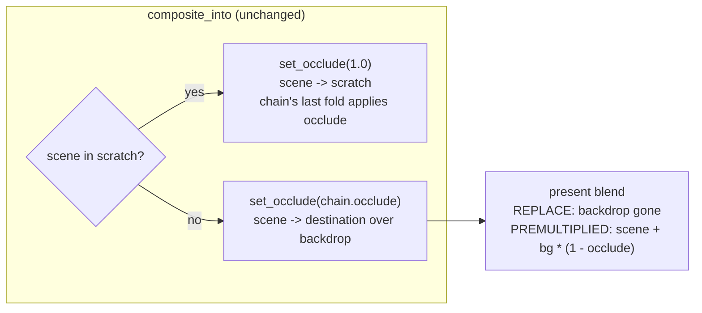

# 0185 — A fullscreen field lets the sky through with no post stage

> **Status:** done 2026-09-15. Phases `87dee5a` (1) and `2e4fe7a` (2). Conductor-run Mode 4, round 1:
> **no blockers, no majors, one minor (fixed at the close), one nit.** Verified by the review: the full
> workspace suite (1933 passed, 6 skipped, no baseline changed) and `cargo doc` with warnings denied,
> before and after merging `main`. Version 0.123.1.
> **Created:** 2026-09-14
> **Owner skill(s):** `dev`
> **Related ADRs:** [0201](../../adrs/0201-a-fullscreen-scene-presents-premultiplied-over-the-backdrop.md) (accepted),
> [0026](../../adrs/0026-full-composite-coverage-fullscreen-scenes.md), [0056](../../adrs/0056-additive-scenes-emit-premultiplied-alpha.md),
> [0085](../../adrs/0085-how-much-a-scene-occludes-the-backdrop-is-one-number.md)
> **Closes:** design-backlog 0206

## TL;DR

`occlude = 0` is documented as "lets the sky through everywhere". On a fullscreen field with no
`[post]` stage it lets nothing through, because the field's pipeline blends with `REPLACE` and
overwrites the backdrop before `occlude` is read. The defect is wider than the backlog entry says:
**four** scenes have it, `fragment_field`, `analytic_field`, `shape_field` and `shape_collage`. This
plan gives all four the `PREMULTIPLIED_ALPHA_BLENDING` present that `reaction_diffusion`,
`cellular`, the attractor and `warp_mesh` already use. The renderer already hands a scene a literal
`occlude = 1` whenever a stage owns the seam, and at alpha 1 a premultiplied blend is exactly a
replace. So every frame that renders correctly today renders byte-identically after the change, and
only the broken path changes.

## Context & problem

`composite_into` (`core/src/render/composite.rs`) already decides who owns the backdrop seam. When
the chain routes the scene into a scratch (a stage is active, or an `over` layer is live), the scene
gets `set_occlude(1.0)` and the chain's last fold applies `occlude`. When the chain is empty, the
scene draws straight onto the backdrop and gets `set_occlude(chain.occlude())`, so the scene owns the
seam. `Scene::set_occlude`'s doc spells out that split.

The scenes' side of that contract is their present blend. It has to turn alpha into
`scene + bg * (1 - alpha)`, which is `PREMULTIPLIED_ALPHA_BLENDING`. Four fullscreen scenes write
`occlude` into their alpha (each shader comment says so), but their pipeline is built with
`wgpu::BlendState::REPLACE`:

| Scene | Pipeline built at | Alpha written |
|---|---|---|
| `fragment_field` | `core/src/render/scenes/fragment_field.rs`, `parts.finish(.., REPLACE, "fragment-field")` | `params.d.y` = occlude |
| `analytic_field` | `core/src/render/scenes/analytic_field/mod.rs`, `REPLACE, "analytic-field"` | occlude |
| `shape_field` | `core/src/render/scenes/shape_field.rs`, `REPLACE, "shape-field"` | `params.d.x` = occlude |
| `shape_collage` | `core/src/render/scenes/shape_collage.rs`, `REPLACE` | `params.d.x` = occlude |

Under `REPLACE` the alpha is written into the target and never read. Nothing downstream composites
the target's alpha on the no-stage path. The tonemap passes it through.

Backlog 0206 found this on `fragment_field` and `analytic_field`. The parity test
`occlude_behaves_as_it_does_on_fragment_field` (`core/tests/analytic_field.rs`) pins the two
systems together **including on the broken path**: its doc says "Both draw with a replacing blend, so
the sky under them does not show at either end". The entry frames the fix as "a chain question". It
is not. The chain has already answered, through the value it hands `set_occlude`. The scene just
cannot act on the answer.

`Scene::set_occlude`'s own doc is also wrong. It lists "reaction-diffusion, attractor, fragment
field" as the scenes that present premultiplied, and `fragment_field` does not.

**Which shipped presets move: none.** Six presets bind `occlude`. Four are on scenes that already
present premultiplied or additively (`attractor_lorenzknot`, `lsystem_icecrystal`,
`spectrum_radialbloom`, `swarm_murmuration`). The two on affected scenes, `fragment_etchingplate`
and `shape_strataheart`, both bind `occlude = "1.0"`. Every other preset takes the default, `1.0`.

**Why the change is exact at `occlude = 1`.** The composite target is `Rgba16Float`. Premultiplied
blending computes `src.rgb * 1 + dst.rgb * (1 - src.a)`. With `src.a` exactly `1.0` the destination
factor is exactly `0.0`, and `dst.rgb * 0.0` is `0.0` for a finite backdrop. The colour result is
`src.rgb`, which is what `REPLACE` writes. The alpha result is `1 + dst.a * 0`, which is `1.0` and
also what `REPLACE` writes. On the scratch path the renderer hands `1.0` unconditionally, so that
path is unchanged too.

## Decision

`fragment_field`, `analytic_field`, `shape_field` and `shape_collage` build their present pipeline
with `wgpu::BlendState::PREMULTIPLIED_ALPHA_BLENDING`, the same blend as the other scenes that
present over the backdrop (ADR-0026). No change to the chain, `composite_into` or `set_occlude`'s
routing.

We rejected three alternatives:

- **The chain selects the scene's blend state.** A pipeline's blend is fixed at construction, so
  this means two pipelines per scene, or a dynamic seam on the `Scene` trait. It buys nothing: the
  chain already passes its decision as `occlude = 1` on the scratch path, and premultiplied blending
  is exact there.
- **The field always renders into an offscreen, and the chain composites it.** That adds a target
  and a pass to the no-stage path, which is the cheapest path the engine has and exists precisely to
  avoid them.
- **Document `[post]` as a precondition of `occlude`.** It leaves an engine-wide parameter that
  does nothing on the simplest preset an author can write, and a parity test pinning the defect.

## Architecture diagram

## Implementation phases

### Phase 1 — The four fields present premultiplied, and the test says so

- **Owner skill:** dev
- **What:** Change the blend in the four constructors. Replace the parity test with one that asserts
  the documented behaviour on **both** paths for **all four** systems: at `occlude = 1` lighting the
  sky moves nothing, and at `occlude = 0` it raises the frame. Keep the existing `occlude_reading`
  helper and its thresholds. Correct `Scene::set_occlude`'s doc list and the stale "this fullscreen
  field is opaque, so it covers the backdrop" comment in `fragment_field.rs`'s `render`.
- **Files touched:** `core/src/render/scenes/fragment_field.rs`,
  `core/src/render/scenes/analytic_field/mod.rs`, `core/src/render/scenes/shape_field.rs`,
  `core/src/render/scenes/shape_collage.rs`, `core/src/render/scenes/mod.rs` (the `set_occlude` doc),
  `core/tests/analytic_field.rs`.
- **Done when:**
  - **The no-stage path adds at `occlude = 0`, on every one of the four systems.** Assert it
    outright: `adds(reading)` (raised fraction above the helper's 0.3) and `covers(reading)` (moved
    under 0.05 at `occlude = 1`), with no stage bound. This fails on the tree before the phase for all
    four, and the log records that.
  - **The stage-active path is unchanged.** The same two assertions pass with `trails` bound, as
    they do today.
  - **The test's doc no longer says the fields replace.** It states the property: the seam belongs
    to the scene with no stage and to the chain with one, and `occlude` means the same on both.
  - **Byte-identical where `occlude = 1`.** `cargo nextest run --workspace` moves **no golden**. The
    arithmetic above makes the blend exact at alpha 1, so any moved baseline is a stop. Name it in
    the log rather than blessing it. It would mean a present that reaches the backdrop with alpha
    below 1 somewhere this plan did not find.
  - The per-preset sweeps pass without retuning.

### Phase 2 — The reader says what the parameter does

- **Owner skill:** dev
- **What:** Check the `occlude` prose against the new behaviour and correct any sentence that
  hedges on a `[post]` stage or names a replacing field. The places to read are `presets/README.md`'s
  "Backdrop occlusion" section (hand-written, outside the generated params block),
  `docs/preset-palettes.md`'s table of what a darkening layer covers per system, and the `occlude`
  mention in `docs/presets.md`. If nothing hedges, the phase is a no-op and the log says so.
- **Files touched:** the three documents above, only if a sentence is wrong.
- **Done when:**
  - `node scripts/check-reader-prose.mjs`, `node scripts/check-doc-links.mjs` and
    `node scripts/toc.mjs --check` exit 0.
  - The generated params reference and `presets/schema/` are **not** regenerated. The `occlude`
    `ParamSpec` doc ("0 lets the sky through everywhere") was already correct, and is now also true.

## Risks & open questions

- **The destination alpha changes where `occlude < 1` with no stage.** Under `REPLACE` the target
  held alpha `occlude`. Under the new blend it holds `occlude + dst.a * (1 - occlude)`, which is `1`
  over the backdrop's opaque clear. The tonemap passes alpha through to the surface. An opaque swap
  chain ignores it. A capture readback or the `--stream` path could see it, so check whether either
  reads alpha. If one does, the new value (opaque) is the correct one for a composited frame.
- **A `[layer]` with `join = "under"` on one of these systems draws after the main scene into the
  same target.** At its default `occlude = 1` that is still an exact replace, unchanged. At
  `occlude = 0` it now adds over the main scene, which is what `occlude` means. No shipped preset
  does this.
- **DX12 WARP pipeline identity (ADR-0058).** That collision was about identical bind-group
  layouts, and this change touches no layout. It is listed because `fragment_field` splits its
  groups specifically to dodge it.
- **Backlog probes.** 0206's probes (`occlude` present in `fragment_field.rs`, the parity test's
  name present in `analytic_field.rs`) go red if the test is renamed. That is delivery, not decay.
  `dev` reports it and leaves the entry for the close.

## What this plan does NOT do

- **It does not change `composite_into`, the post chain, or how `occlude` is routed.**
- **It does not touch scenes that already present premultiplied or additively.**
- **It does not add an `occlude` binding to any preset**, and no preset is retuned.
- **It does not address cross-scene occlusion** (backlog 0069). That is about what is in front of
  what, not how a scene resolves against the backdrop.

## Implementation log

> Written by `dev` — one row per phase as that phase's commit lands, and the close block after the
> last one. **The phases above are the contract; everything here is what happened.**
> **Observations, never conclusions:** this says where to look, architect decides how it went.
> No per-criterion pass list, no self-assessment, no narrative — but a deviation from the plan or
> an unmet done-when is always disclosed. Stays shorter than `## Implementation phases` above.

**Lane:** `plan-0185-a-fullscreen-field-lets-the-sky-through-with-no-post-stage`, worktree `C:\Users\Igor Konovalov\WORK\rlx-plan-0185`

| phase | owner | state | commit |
|---|---|---|---|
| 1 — The four fields present premultiplied, and the test says so | dev | done | 87dee5a |
| 2 — The reader says what the parameter does | dev | done | 2e4fe7a |

### Notes

- Phase 1: the parity test is renamed to `occlude_lets_the_sky_through_on_every_fullscreen_field`,
  so backlog 0206's name probe goes red (see Risks). With the four blends put back to `REPLACE` the
  new test fails on the no-stage path only, all four systems reading `(0.0, 0.0)`; the stage-active
  path reads `(0.0, 1.0)` on all four both before and after.
- Phase 1: capture metrics (`core/src/render/metrics.rs`) ignore alpha; no alpha read found in the
  capture or stream code.
- Phase 2: `presets/README.md` only. The empty-chain list under "Backdrop occlusion" named
  `fragment_field` alone of the fields; it now names all four plus cellular and warp mesh. The
  curved-band essay's "`fragment_field` hides it completely" is qualified to the default
  `occlude = 1`. `docs/preset-palettes.md` and `docs/presets.md` are unchanged.
- Noticed, not acted on: `presets/README.md` "Backdrop occlusion" still says "No shipped preset binds
  `occlude` today"; the plan's Context counts six that do.

### Close triggers

- **`presets/` touched:** yes, `presets/README.md` prose only (2e4fe7a); no `.toml` changed.
- **Plan header `Closes:`** design-backlog 0206.
- **What shipped:** fix (four scene present blends, 87dee5a) plus reader docs (2e4fe7a).
- **Operator docs touched:** `presets/README.md` (Backdrop occlusion; curved band).
- **Backlog probes (`node scripts/check-backlog-claims.mjs`):** exit 1, one broken:
  0206 `present: occlude_behaves_as_it_does_on_fragment_field in: core/tests/analytic_field.rs`
  (the test was renamed in 87dee5a).
- **Full suite:** `cargo nextest run --workspace --no-fail-fast` under the suite lock, over the tree
  both phases committed, exit 0: 1933 passed (4 slow), 6 skipped; `git status` showed no changed
  baseline after it.
- **Outstanding `human` phases:** none.

## Close review

Conductor-run Mode 4 (ADR-0205), round 1, 2026-09-15, in the lane at `b5fbb7b`, then closed on the
branch after `git merge main`. Recorded here in full because no reader was in the room.

**Earlier rounds:** none. This was the first round, so no finding was raised and resolved by a fix
round.

**Verdict: Plan 0185 landed cleanly. No blockers, no majors, one minor, one nit.**

The range reviewed is `505c6a2..b5fbb7b`: `87dee5a` (Phase 1), `2e4fe7a` (Phase 2) and `b5fbb7b`
(the log's close block).

### Lens 1: alignment with the plan and ADR-0201

- **Both phases carry one in-vocabulary owner tag** (`dev`). The log is present, names the lane,
  maps each phase to its commit, and is shorter than `## Implementation phases`.
- **Phase 1 did what it says.** The four constructors named in the plan's table
  (`fragment_field.rs:329`, `analytic_field/mod.rs:570`, `shape_field.rs:864`,
  `shape_collage.rs:1074`) now build with `PREMULTIPLIED_ALPHA_BLENDING`. Each scene's shader returns
  `occlude` as its alpha (`fragment_field` `params.d.y`, `analytic_field` `params.c.y` packed from
  `self.occlude` at `mod.rs:710`, `shape_field` and `shape_collage` `params.d.x`). No other change to
  `composite_into`, the chain or the `Scene` trait.
- **The four is the whole set.** Every scene that implements `set_occlude` was checked:
  `reaction_diffusion.rs:622`, `cellular/mod.rs:891`, `particles/resources.rs:584` (the attractor)
  and `warp_mesh/resources.rs:446,552` already present premultiplied, and the remaining `REPLACE`
  constants under `core/src/render/scenes/` are internal simulation or decay passes, not presents.
- **The test was read, not trusted.** `occlude_lets_the_sky_through_on_every_fullscreen_field`
  (`core/tests/analytic_field.rs:314`) runs all four systems on both paths (`trails` bound, and no
  stage) through the unchanged `occlude_reading` helper, and asserts outright `moved < 0.05` at
  `occlude = 1` and `raised > 0.3` at `occlude = 0` for every one of the eight readings, collecting
  failures so a red run names every system. That is the done-when's wording exactly. The old parity
  assertion, which held both systems to each other including on the broken path, is gone. The
  test's doc states the property (the seam belongs to the scene with no stage and to the chain with
  one; `occlude` means the same on both) and no longer says the fields replace. The log records the
  bite: with the four blends put back to `REPLACE` the no-stage path reads `(0.0, 0.0)` on all four.
- **Byte-identical at `occlude = 1`.** The plan's arithmetic holds for any target format, not only
  `Rgba16Float`: a source alpha of exactly `1.0` (also exactly representable in unorm) gives a
  destination factor of exactly zero. The full suite below moved no golden and left no changed
  baseline in `git status`.
- **Phase 2** touched `presets/README.md` only; the log says `docs/preset-palettes.md` and
  `docs/presets.md` needed nothing, and on reading them that is right. Their `[layer]` coverage
  tables describe a layer slot, which the chain composites, and are unaffected.
- **ADR-0201 was not reversed or falsified** by the implementation. It is accepted at this close
  with no `Outcome`.
- **Full suite, run by this review:** see the gate section below.

### Lens 2: layering, coupling, real-time safety

Nothing to report. The change is four blend constants, two doc comments and one test. No platform
type, no audio-path code, no C ABI or control-protocol change, no new `unwrap` on a render path.

### Lens 3: doc freshness and bookkeeping

- `Scene::set_occlude`'s doc (`core/src/render/scenes/mod.rs:657`) now lists the scenes that
  present premultiplied correctly and states the formula.
- `presets/README.md`'s empty-chain paragraph names all eight premultiplied scenes and says
  `occlude = 0` lets the sky through with or without a post stage; the curved-band essay is qualified
  to the default `occlude = 1`.
- The generated params reference and `presets/schema/` were not regenerated, as the plan required.
- Backlog 0206's `present:` probe for the old test name is red, which the plan's Risks predicted as
  delivery. The entry is archived at this close.
- A version bump is owed: the plan fixed an engine defect with a visible effect on a preset surface.

### Lens 4: correctness and determinism

- The destination alpha on the direct path now reads the composited value instead of `occlude`. The
  log reports that the capture metrics ignore alpha and that no capture or stream path reads it; the
  tonemap passes it through to an opaque swap chain. No finding.
- The test renders at 64x64. A blend factor is independent of target size and aspect, so the
  development configuration hides nothing here.
- No new numeric threshold: the test reuses the helper's `0.05` and `0.3`, which are dimensionless
  fractions of the frame rather than frozen measurements.

### Lens 5: design integrity

The decision stays where ADR-0201 put it: the chain's routing is expressed as the `occlude` value it
hands the scene, and no new method reached the `Scene` trait. No finding.

### Findings

**minor**

1. **`presets/README.md:3011` still says "No shipped preset binds `occlude` today."** Six do
   (`attractor_lorenzknot`, `fragment_etchingplate`, `lsystem_icecrystal`, `shape_strataheart`,
   `spectrum_radialbloom`, `swarm_murmuration`), as the plan's own Context counts. The sentence sits
   in the section Phase 2 edited and predates this plan; `dev` noticed it and left it, correctly, as
   outside the phase's scope. A reader told that no preset uses the knob has no example to open.
   Fix: correct the sentence in the close commit's operator-doc sweep. **Fixed at this close.**

**nit**

1. **`core/src/render/scenes/fragment_field.rs:218` opens the shader's alpha comment with "Alpha
   1.0:"** while the line returns `params.d.y`, which is `occlude`. The rest of the comment says so,
   and since this plan the scene's blend reads that alpha, so the lead-in now contradicts the
   behaviour the plan made real. Fix: drop "1.0" the next time `dev` is in the file; not worth a
   code commit from a docs close.

### Gate

- **On the lane as the implementer left it (`b5fbb7b`):** `cargo nextest run --workspace
  --no-fail-fast` under the suite lock, **1933 passed (4 slow), 6 skipped, 629.8 s**, exit 0,
  matching the log's `**Full suite:**` bullet; `git status` clean after it, so no baseline was
  rewritten. `RUSTDOCFLAGS="-D warnings" cargo doc --workspace --no-deps` clean. `cargo fmt --check`
  clean. `check-doc-links`, `check-comment-hygiene` and `check-reader-prose` exit 0.
  `check-backlog-claims` exits 1 on exactly the one probe the plan predicts (0206's old test name).
- **After `git merge main`** (`main` at `3381990`; the merge brings conductor tooling and docs only,
  no Rust and no presets): `cargo fmt --check` and `cargo clippy --workspace --all-targets -- -D
  warnings` clean; `cargo nextest run --workspace --no-fail-fast` under the suite lock **1933
  passed (4 slow), 6 skipped, 654.2 s**, exit 0; `cargo doc` with warnings denied clean.

### Close bookkeeping

ADR-0201 accepted and both indexes refreshed; backlog 0206 archived with a ledger row, and
`check-backlog-claims` exits 0 after it. Preset curation: no `.toml` moved, and no shipped preset
names ADR-0201, Plan 0185 or backlog 0206 as a workaround. Version 0.123.1 (patch), with the studio's
two copies following it. The studio's `version.test.ts` was not run: this worktree has no
`studio/node_modules`.

## Followups (after this lands)
