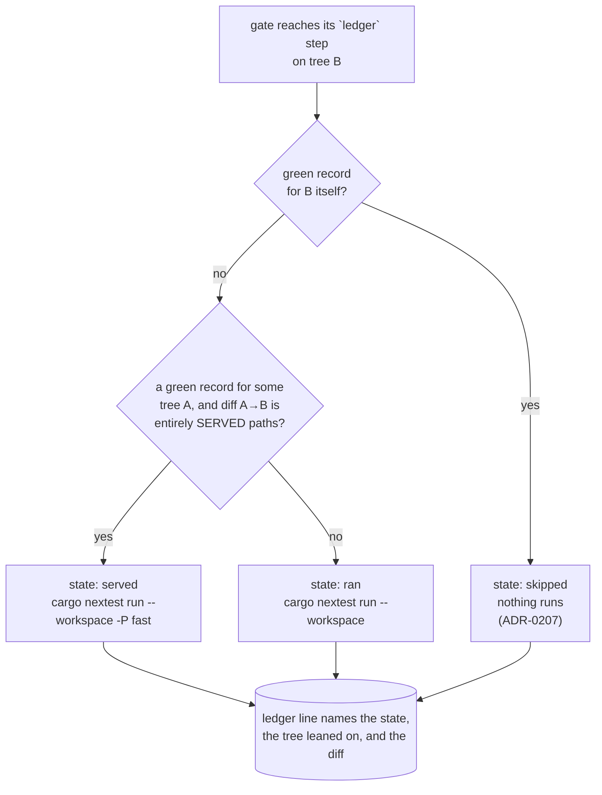

# 0191 — A green tree is not tested four times

> **Status:** done (2026-09-16) — three phases in `55b1520`, `19ef1d6`, `2204110`, two review nits
> repaired in `0e4f6bc`. Close review round 1: **no blockers, no majors, one minor, two nits.** The
> gate's suite step is a three-state tier, a served run never becomes a green record, and the run
> terminal and digest count the tiers apart. ADR-0211 accepted. Version: none (tooling).
> **Created:** 2026-09-16
> **Owner skill(s):** dev
> **Related ADRs:** [0211](../../adrs/0211-a-green-suite-record-serves-a-later-tree-when-no-deferred-suite-can-read-the-diff.md) (proposed),
> [0207](../../adrs/0207-a-suite-run-the-conductor-observed-green-is-not-run-again-on-the-same-tree.md),
> [0156](../../adrs/0156-the-per-phase-gate-is-scoped-and-the-suite-is-owed-once-per-plan.md),
> [0157](../../adrs/0157-the-preset-sweeps-split-per-preset-and-the-phase-tier-samples-a-declared-representative.md)
> **Closes:** design-backlog 0227 - the skip half only; the cheaper-suite half is backlog 0239.
> Archived to the Promoted table on approval ([ADR-0206](../../adrs/0206-a-promoted-backlog-entry-leaves-the-live-file.md)).
> **Runnable under the conductor:** yes, deliberately. No phase touches `.claude/`, a spec or a lane's
> `## Conductor mode`, so nothing here parks `claude_dir` ([ADR-0210](../../adrs/0210-a-claude-repair-is-the-owners-and-a-session-that-needs-one-parks-with-the-edit.md)),
> and no phase is owned by `human`.

## TL;DR

The conductor's gate stops running the full workspace suite on a tree whose diff from an
already-green tree cannot reach any of the nine suites `-P fast` defers. It runs `-P fast` there
instead — never nothing — so the floor stays exactly what CI runs on every push. A clean plan pays the
737-second suite once instead of two to four times.

## Context & problem

[ADR-0207](../../adrs/0207-a-suite-run-the-conductor-observed-green-is-not-run-again-on-the-same-tree.md)
keyed the ledger on the whole tree, so every stage whose tree moved pays the full suite again.
Measured on 2026-09-15:

| Plan | Sessions | Full suites | Where |
|---|---|---|---|
| 0175 | 24 min | **58 min** | `pre-review` 11.2, red `post-close` 10.8, `post-close` 11.4, `remerge` 12.3 |
| 0177 | 64 min | 24.5 min | `pre-review` 10.9, close tip 13.6 |

0177 met ADR-0207's bound of two and still spent a quarter of its wall clock there. 0175's `remerge`
fired because `main` moved under a waiting close — by a commit touching only `tools/conductor/`.

What separates those trees is rarely code: the close's prose repairs, the plan's move to `done/`, the
indexes, the version bump, and `git merge main`. [backlog 0227](../../design-backlog-archive.md) is the entry,
and [ADR-0211](../../adrs/0211-a-green-suite-record-serves-a-later-tree-when-no-deferred-suite-can-read-the-diff.md)
is the decision: **serve a green record forward when the diff is entirely declared paths, and run
`-P fast` in the full suite's place.**

Two things make that safe rather than optimistic, and both are worth restating because the plan's
done-whens lean on them. `-P fast` and the full suite differ by exactly the nine suites named once in
`.config/nextest.toml`'s `fast` profile. And nothing is skipped outright — `hygiene.rs`, `preset.rs`
and every `CARGO_PKG_VERSION` reader are inside `-P fast`, which is what CI runs.

## Decision

Implement ADR-0211 in `tools/conductor/` and nowhere else, in three `dev` phases: the ledger learns to
serve a record forward, the gate turns its one suite step into the three-state tier, and the run
terminal, digest and README report which state happened.

**The scope bound is a design constraint, not an accident.** A session's own wrapped suite keeps
ADR-0207's exact-tree lookup untouched, so `with-lock.mjs`'s contract, `docs/specs/`, and the three
lanes' `## Conductor mode` sections do not change — which is what keeps this plan free of a `.claude/`
phase and therefore runnable under the conductor it speeds up.

## Architecture diagram

## Implementation phases

### Phase 1 — The ledger can serve a green record forward
- **Owner skill:** dev
- **What:** `lib/ledger.mjs` gains the served-path predicate and the forward lookup. `greenRecord` is
  unchanged and keeps its exact-tree meaning; the new `servingRecord(path, tree, cwd)` is consulted
  only when `greenRecord` returns null.
  - `SERVED_PATHS` is the allowlist ADR-0211 declares, as data in one exported constant: `docs/`,
    `.claude/`, `tools/`, `site/`, `studio/`, `packaging/`, `renders/`, any `*.md`, and
    `Cargo.toml` / `Cargo.lock` under the version-line rule below.
  - `servesDiff(paths, cwd, a, b)` is true when **every** changed path is served. `Cargo.toml` and
    `Cargo.lock` are served only when `git diff a b -- <file>` changes nothing but a `version = "x.y.z"`
    line; any other hunk in either file is unserved.
  - The lookup walks the ledger newest-first and takes the first green record whose tree still
    resolves in this worktree (`git cat-file -e`) and whose diff serves. A record whose tree `git` can
    no longer resolve is skipped rather than fatal.
- **Files touched:** `tools/conductor/lib/ledger.mjs`, `tools/conductor/test/ledger.test.mjs`.
- **Done when:**
  - An unserved path anywhere in the diff refuses the record, asserted one case per unserved class:
    a `.rs`, a `.wgsl`, a `presets/*.toml`, a `core/tests/goldens/*.png`, `.config/nextest.toml`, and
    a path under a directory nobody listed.
  - A diff of only served paths is served, asserted over the shape a real close produces: a plan file
    moved into `docs/plans/done/`, two index edits, a `tools/conductor/` edit and a `*.md`.
  - `Cargo.toml` and `Cargo.lock` carrying only a version-line change are served; the same two files
    carrying any other hunk are not, each its own case.
  - A ledger whose only green record names a tree this worktree cannot resolve returns null rather
    than throwing.
  - `greenRecord`'s own behaviour is unchanged: its existing cases still pass untouched.

### Phase 2 — The gate's suite step is a three-state tier
- **Owner skill:** dev
- **What:** `lib/gate.mjs`'s `ledger: true` step resolves to one of ADR-0211's three states. `skipped`
  is today's path. `served` runs `cargo nextest run --workspace -P fast` in the full suite's place,
  under the same suite lock, with its output logged under `state/gates/` like any other command.
  `ran` is today's full run.
  - A served run **records nothing as a full-suite green**: the ledger line is a distinct shape
    (`served: true`, naming the tree leaned on), so no later lookup can mistake a `-P fast` pass for a
    full-suite record. This is the single most important property in the phase.
  - A red `-P fast` on a served tree fails the gate exactly as a red full suite does, with the same
    `failingTests` extraction.
- **Files touched:** `tools/conductor/lib/gate.mjs`, `tools/conductor/lib/ledger.mjs` (the served
  record's writer), `tools/conductor/test/gate.test.mjs`, `tools/conductor/test/ledger.test.mjs`.
- **Done when:**
  - A gate on a tree with an exact green record runs no suite command at all — unchanged from today,
    asserted so the tier did not disturb it.
  - A gate on a tree whose diff from a green tree is entirely served paths runs exactly
    `cargo nextest run --workspace -P fast`, and the argument vector is asserted verbatim.
  - A gate on a tree whose diff touches one `.rs` runs exactly `cargo nextest run --workspace`.
  - **A served run's ledger line never serves a later lookup**: after a served gate, a fresh lookup on
    that same tree returns null, so the next stage does not chain one `-P fast` off another.
  - A red `-P fast` on a served tree returns `ok: false` with its failing tests named, and writes its
    log under `state/gates/`.
  - The suite lock is taken for a served run as it is for a full one, asserted from the lock log.

### Phase 3 — The report says which tier ran, and why
- **Owner skill:** dev
- **What:** the operator can tell the three states apart without reading the ledger by hand.
  - `lib/live.mjs` prints the served state as its own line naming the tier and the tree it leaned on,
    beside the existing `skipped` and `tests` lines.
  - `lib/digest.mjs`'s per-run totals count served runs separately from full ones, so the saving is
    visible as a number rather than inferred from the wall clock.
  - `tools/conductor/README.md` documents the three states in *How it stays safe*, including the
    allowlist direction and why a served run never becomes a green record.
- **Files touched:** `tools/conductor/lib/live.mjs`, `lib/digest.mjs`, `test/live.test.mjs`,
  `test/digest.test.mjs`, `tools/conductor/README.md`.
- **Done when:**
  - A lane scenario whose close tip is a served tree prints a line naming the tier and the leaned-on
    tree, and that line is ASCII like every other (Plan 0190 Phase 6's assertion covers it).
  - The digest's Totals reports full and served suite counts separately for the run.
  - Regenerating the digest from one state twice still yields the same bytes.
  - `README.md` names all three states and the direction of the allowlist.

## Risks & open questions

- **The served list is the whole safety surface, and no test can assert what a suite reads at
  runtime.** Phase 1 asserts that each unserved class refuses a record, which is the strongest
  mechanical check available; it does not prove that nothing under `tools/` is read by a deferred
  suite. ADR-0211 records this as the price and is why the list is short.
- **`-P fast` is not free and needs a GPU.** The saving is the difference between the tiers, not the
  whole 737 s. The plan does not predict a figure — the measurement belongs in ADR-0211's `Outcome` at
  the close, taken from the first plans that run under it.
- **The first evidence is a real run, which is not a phase here.** Both lanes are filled as of
  2026-09-16 and the conductor is stood down until 0180 lands, so the figure arrives when it arrives.
- **A served record chaining off another** would silently degrade the gate to `-P fast` forever. Phase
  2's fourth done-when is the guard, and it is the one to read first in review.

## What this plan does NOT do

- **It does not make the suite itself cheaper.** `reactivity`, `animation` and `sanity` are 54 % of
  7378 test-seconds and grow with every shipped preset; sharing one headless renderer per binary, or
  sampling at the gate and covering the library nightly, is ADR-0211's Alternative A and is
  [backlog 0239](../../design-backlog.md). This plan stops a green tree being tested four times; it does not touch what one test
  costs.
- **It does not change what a session runs.** `with-lock.mjs` keeps ADR-0207's exact-tree lookup, so
  the `dev` and `architect` lanes' `## Conductor mode` instructions stay true as written and no
  `.claude/` file is touched.
- **It does not adopt backlog 0227's operator rule.** *Nothing is committed to `main` while a closed
  plan waits* is retired by ADR-0211 rather than implemented: a tools-only commit is now a served
  diff.
- **It does not touch `-P fast`'s own membership.** ADR-0156 and ADR-0157 define that set in
  `.config/nextest.toml`, and this plan reads it rather than editing it.

## Implementation log

> Written by `dev` — one row per phase as that phase's commit lands, and the close block after the
> last one. **The phases above are the contract; everything here is what happened.**
> **Observations, never conclusions:** this says where to look, architect decides how it went.

**Lane:** `C:\Users\Igor Konovalov\WORK\rlx-plan-0191` on branch
`plan-0191-a-green-tree-is-not-tested-four-times`

| phase | owner | state | commit |
|---|---|---|---|
| 1 — The ledger can serve a green record forward | dev | done | `55b1520` |
| 2 — The gate's suite step is a three-state tier | dev | done | `19ef1d6` |
| 3 — The report says which tier ran, and why | dev | done | `2204110` |

### Notes

- Phase 3 touched three files past its list, all in `2204110`: `lib/lane.mjs`, which wires the gate's
  served callback into the run terminal — without it the phase's first done-when has nothing to
  assert — `test/lane-scenario.mjs`, which gained the `servedClose` spec flag that the same
  done-when's "lane scenario whose close tip is a served tree" needs, and `test/lane.test.mjs`, which
  holds that scenario's assertions. The lane scratch repository also gained a tracked `Cargo.toml`,
  since a version-line bump needs a file already in the green tree.
- Phase 2's last done-when asks that the suite lock be asserted "from the lock log". The gate takes
  its locks through `lib/locks.mjs`, which writes no log — `RLX_LOCK_LOG` is written only by
  `with-lock.mjs`'s command wrapper, which the gate does not use. Asserted instead from the lock
  **file**: the served stand-in reads `<lockDir>/suite.lock` while it runs and records the holder's
  `what`, so the assertion is that the lock was held during the served run (`19ef1d6`,
  `test/gate.test.mjs`).
- Phase 2 retargeted the existing test "a one-byte change to a tracked doc makes the next gate run
  the suite" to a tracked `.rs` file, and renamed it accordingly: under ADR-0211 a one-byte change to
  a doc is exactly the served case, so the test as written asserted the behaviour this plan replaces.
- The version-line rule matches a **three-part** semver, so `version = "0.20"` under a dependency
  table is not one. ADR-0211 writes the rule as `version = "x.y.z"`; a two-part requirement matching
  it would have served a dependency bump.

### Close triggers

- **`presets/` touched:** no
- **Plan header `Closes:`** design-backlog 0227, the skip half only (the cheaper-suite half is
  backlog 0239, and this plan does not touch it)
- **What shipped:** no shipped artifact changed — every file is under `tools/conductor/` plus this
  plan; a behaviour change to the conductor's own gate
- **Operator docs touched:** `tools/conductor/README.md` (*How it stays safe*, three new bullets, and
  *The gate*). No row of Mode 4's operator-doc sweep table outside it; no generated file regenerated
- **Backlog probes (`node scripts/check-backlog-claims.mjs`):** exit 0 — 53 stated reductions hold
  across 26 live entries, 2 unprobeable (0069, 0079); 30 advisory moved-path notices, which the
  script excludes from its exit code
- **Full suite:** owed to the conductor's pre-review gate (ADR-0207). Run instead:
  `node --test tools/conductor/test/*.test.mjs` — exit 0, 323 tests, 323 pass, 0 fail — plus
  `check-doc-links.mjs`, `toc.mjs --check`, `check-index-rows.mjs`, `check-comment-hygiene.mjs`
  and `check-reader-prose.mjs`, all exit 0. No Rust, C++ or preset file is touched by any phase
- **Outstanding `human` phases:** none

## Close review

**2026-09-16, Mode 4, conductor mode, round 1. No blockers, no majors, one minor, two nits.**
Written by a fresh headless session handed the plan and the lane and nothing an implementer wrote
(ADR-0205). Scope: `55b1520`, `19ef1d6`, `2204110` and the close block `d21eaca` — 14 files,
+667/-182, all of it `tools/conductor/` plus this plan. The 140 deleted lines the branch diff shows
in `docs/design-backlog.md` are two entries `main` gained after the branch point (0240, 0241), not
anything this branch removed.

### Alignment

Every phase landed as its own commit, each carrying a single in-vocabulary `**Owner skill:**` tag
(`dev`, three times), and the log's phase-to-commit table matches `git show --stat` for all three.
The log is 54 lines against the plan's 72-line `## Implementation phases`, so the report does not
outweigh the contract.

**Full suite.** `node with-lock.mjs suite -- cargo nextest run --workspace` in the lane printed a
ledger record instead of running: *tree `904b2d8` is green in the suite ledger, run by
`gate 0191-pre-review` at 2026-09-16T13:32:00.136Z: 1952 tests run: 1952 passed (5 slow),
6 skipped*. `HEAD^{tree}` of the reviewed tip is `904b2d8b…` and the worktree was clean, so that
record names this exact tree (ADR-0207) and is this lens's evidence. Because the gate stops at its
first red and `cargo nextest` is its second-to-last step, the same record also evidences the node
gates, the conductor's own `node --test`, `fmt` and `clippy` on that tree. `cargo doc` runs after
`nextest`, is not covered by it, and was run on the close tip below.

Every test the plan named exists and asserts what the done-when claims, read rather than counted.
Phase 1's six unserved classes are one loop with a per-class message, each asserted alone and beside
served paths, and the same test asserts from `SERVED_PATHS` itself that none of `core/`,
`standalone/`, `presets/`, `milkconv/`, `rlx-ring/`, `.config/`, `.github/` is on the list — the
allowlist's direction asserted as data rather than by example. The `Cargo.toml` / `Cargo.lock` cases
build two real git trees and diff them, so `versionLineOnly` runs through the command it actually
uses. Phase 2's fourth done-when, the one the Risks section says to read first, is asserted three
ways in `gate.test.mjs` — `greenRecord` on the served tree is null, the next stage's served line
names the full-suite tree rather than the served one, and a ledger holding only the served line
serves nothing — and again from the writer's side in `ledger.test.mjs`. The served argument vector
is asserted verbatim off `defaultGate()`, not off the stand-in, so a change to the real step's `cmd`
breaks it.

Two deviations, both disclosed and both correct. Phase 2's lock assertion reads the lock **file**
rather than a lock log, because `lib/locks.mjs` writes none — and the resulting `deepEqual` on both
runs' holders is stronger than the done-when asked for. And Phase 2 retargeted the existing
one-byte-doc test onto a tracked `.rs` file, because under ADR-0211 a one-byte doc change is exactly
the served case; retargeting rather than deleting keeps the `ran` state covered.

No ADR decision was reversed. `greenRecord` is byte-identical (`ledger.mjs`'s diff is insertions
only) and `with-lock.mjs` is untouched, so ADR-0207's exact-tree lookup and the three lanes'
`## Conductor mode` instructions stand as written, and no `.claude/` file is touched.

### Layering, correctness, design

Node only, entirely under `tools/conductor/`: no Rust, no C++, no C ABI, no control protocol, no
audio callback, no GPU code — the source-agnostic, real-time and grid-aspect rules have nothing to
bite on. The one new coupling, `lib/lane.mjs` importing `servedNotice`, keeps the notice's text with
the record it describes. The tier is confined to the one step carrying `ledger: true`, and
`ledger.test.mjs` holds `defaultGate()` to marking exactly the step whose vector `isFullSuite`
accepts, so the `-P fast` append cannot reach `clippy` or `cargo doc` by a later edit.

The refusals hold. A dirty worktree names no tree, so both lookups return null and the full suite
runs. The exact tree is excluded as its own candidate, with the reason in the comment — its diff is
empty, so a tree whose latest full run was red would otherwise serve itself down to `-P fast`; that
is the sharpest edge in the change and it is both guarded and asserted. One decision per tree,
newest-first, so a later red disqualifies a tree and a later green re-qualifies it. A served line
cannot be read back through either lookup, and the two guards (`cmd` and `served`) are independent.
`--no-renames` makes a rename a delete plus an add, so both sides must be served. A path `git`
quotes starts with `"`, matches no served prefix, and falls through to the full suite — the safe
direction.

The claim the design rests on was checked against the tree: of the files under `core/tests/` naming
`docs/`, `tools/`, `site/`, `studio/`, `packaging/` or `renders/`, all three (`hygiene.rs`,
`preset.rs`, `preset_schema.rs`) are in the `suite` binary, which `-P fast` runs; none of the nine
deferred binaries reads a served path. What a test reads at runtime stays unassertable, as ADR-0211
records. No numeric assertion in the diff is a frozen measurement.

### Findings

- **minor — `tools/conductor/lib/ledger.mjs:94`, the version-line rule is positional, not
  sectional.** `VERSION_LINE` matches any `version = "x.y.z"` at column 0 in `Cargo.toml`, not only
  the one under `[workspace.package]`. A dependency written in table form
  (`[workspace.dependencies.wgpu]` followed by `version = "27.0.1"`) and edited **in place** yields a
  diff whose every line matches, so the tree is served and the nine GPU suites do not run on a
  dependency change. Latent rather than live: no `Cargo.toml` here uses that form, and a registry
  bump re-arms the suite through `Cargo.lock`'s `checksum` line. **Left open** — the repair is code
  (anchor the rule to the `[workspace.package]` section, or to the hunk's preceding section header),
  which a close may not write.
- **nit — `tools/conductor/test/ledger.test.mjs:182`, the comment named a case the fixture does not
  test.** *"A two-part requirement under a dependency table is the trap the three-part pattern
  closes"* sat above a fixture whose requirement is `0.20.1` — three parts, which the pattern
  matches — and the case passes only because the *added* table header line is unserved, as the
  assertion's own message says. **Repaired in `0e4f6bc`**: the comment now says what refuses the
  case and names the in-place edit that would be served.
- **nit — this plan's Phase 3 note undercounted by one.** `2204110` also changed
  `test/lane.test.mjs`, which Phase 3's file list does not name and which holds the phase's first
  done-when. **Repaired in `0e4f6bc`.**

No earlier round raised a finding: this is round 1, and it is the closing round.

### Bookkeeping

ADR-0211 accepted, with no `Outcome`: the saving is measured from the first plans that run under it,
and the conductor runs `main`'s copy of `tools/conductor/`, so the feature is not live until this
branch fast-forwards. `presets/` untouched, so no curation sweep. Backlog 0227's archived body takes
its `CLOSED` marker and its row moves from `### Promoted` to `### Closed`; the cheaper-suite half
stays open as 0239. **Version: none (tooling)** — nothing shipped changed, the same call 0189 and
0190 took, so `v0.125.0` stays the declared version and `check-release-tag.mjs` passes on this tip.
