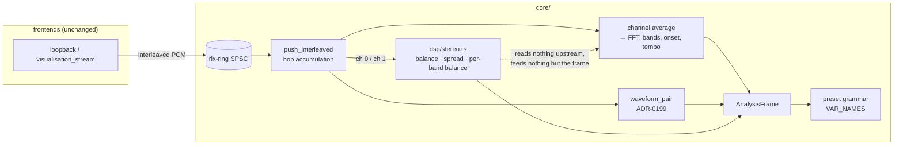

# 0194 — The analysis gains a stereo field

> **Status:** done — all six phases landed (`c99b4d10`, `565e74d0`, `1b090d38`, `2fa92fef`,
> `ca724847`, `b33d8ceb`); close review round 1 found **no blockers, no majors, six minors and one
> nit**, three of which this close repaired (`9c2b9037`). Verified against the finished tree: the
> full workspace suite green in the ledger (2025 passed, 7 skipped), `fmt`/`clippy`/`cargo doc`
> clean, every node gate green, and the bit-identity contract read assertion by assertion.
> **Created:** 2026-09-18
> **Owner skill(s):** dev, human
> **Related ADRs:** [0215](../../adrs/0215-the-analyzer-publishes-an-absolute-stereo-field.md)

## TL;DR

The analyzer starts publishing where the sound is, not just how loud it is. `AnalysisFrame` gains
five absolute quantities — whole-mix `balance` and `spread`, and per-band `bass_balance`,
`mid_balance`, `treb_balance` — computed from channels 0 and 1 of the interleaved frames that
already reach it, never levelled against a running peak, and reachable from any preset expression by
those names. The first visible result is `shot --signal pan:-0.8 --report` printing a `balance` of
`-0.800` where today no stimulus in the repository can produce a non-zero one. Nothing crosses the C
ABI, and every field of `AnalysisFrame` that exists today reads bit-identically afterwards.

## Context & problem

Stereo arrives and is discarded. The intakes deliver real device channels, the ring carries them
unchanged, and then `Analyzer::push_interleaved` (`core/src/dsp/mod.rs`) averages every frame to
mono before anything spectral runs. `bass`, `mid`, `treb`, `onset`, `beat`, `bar`, `bpm`, `bin()`
and the `spectrum` array are all that average. A hard-panned hi-hat contributes half its level and
nothing knows which side it was on.

ADR-0199 already added `waveform_pair` — channels 0 and 1 as two traces, levelled by one divisor so
the L/R ratio survives — but only for the converted MilkDrop corpus: its sole consumer is
`core/src/milk/` feeding `warp_mesh`'s `wave_mode` figures, `wave_mode` is a `MilkOutput` rather
than a `ParamSpec`, and **no shipped preset sets it**. So stereo exists in the engine with no reach
into preset content and nothing shipped exercising it.

Two constraints came out of the interview and shape everything below. **Compatibility is
non-negotiable**: 113 presets ship, stereo is an optional addition, and no existing preset may
render differently. And **the quantities are absolute, never levelled** — `balance = 0` must mean
genuinely centred on every track, because a normalized position amplifies a mono track's noise floor
into a confident wandering pan that an author cannot distinguish from real stereo.

There is also a blind spot that has to be closed first. Every `--signal` kind builds a mono buffer
and `interleave`s it into both channels (`core/src/signal.rs`), so the two channels are bit-identical
in every synthetic test in the repository. Under the current harness a working stereo implementation
and a broken one produce the same output.

## Decision

We implement ADR-0215: an absolute stereo field on `AnalysisFrame`, computed in a new
`core/src/dsp/stereo.rs` that no pre-existing field reads, published to the expression grammar as
five new names, and reported by `shot --report` so an author can see the real ranges. We rejected
levelling the field like the bands (a normalizer cannot represent the absence of stereo information,
and the failure is invisible from inside a preset), whole-mix scalars alone (the expressive half is
per-band, and the 350x cost headroom does not justify the cut), and building the goniometer figure
and the placement param in the same plan (scene geometry designed before anyone has watched these
numbers move on real music). The harness gains stereo stimuli in Phase 1, before anything depends on
them.

## Architecture diagram



## Implementation phases

### Phase 1 — The harness learns stereo, and the whole-mix field lands

- **Owner skill:** dev
- **What:** Per-channel synthesis plus `balance` and `spread`, end to end, so the first commit
  produces a number nothing in the repository could produce before.
- **Files touched:** `core/src/signal.rs`, `core/src/dsp/stereo.rs` (new), `core/src/dsp/mod.rs`,
  `standalone/src/shot/args.rs`, `standalone/src/shot/report.rs`, tests beside each.
- **The stimuli.** `--signal pan:<p>`, `p` in `-1..=1`: the existing broadband `chord` source with
  per-channel gains `L = (1 - p) / (1 + |p|)` and `R = (1 + p) / (1 + |p|)`. Both channels carry the
  same waveform, so the RMS ratio gives `balance = p` **exactly** and the correlation is 1; the
  `1 + |p|` divisor keeps the peak inside `±1`. `--signal wide:<seed>`: independent seeded noise per
  channel, from two streams derived from `seed`, deterministic per ADR-0071 and spec 0002.
- **The quantities.** Per hop, from channels 0 and 1: `balance = (rms_r - rms_l) / (rms_r + rms_l)`
  in `-1..=1`; `spread = (1 - corr) / 2` in `0..=1` from the normalized correlation
  `Σ(l·r) / sqrt(Σl² · Σr²)`. Both read exactly `0` when the hop's larger channel RMS is below
  `gain::WAVE_FLOOR` (`1e-3`), rather than dividing noise by noise. A one-channel stream fills
  channel 1 from channel 0, exactly as `waveform_pair` does, so both read `0`.
- **Done when:**
  - `shot --signal pan:-0.8 --report` prints a mean `balance` within `1e-3` of `-0.800` and a mean
    `spread` within `1e-4` of `0.000`. Both are exact properties of the construction, not fitted
    numbers: the channels are one waveform at two gains, so the RMS ratio is algebraically `p` and
    the correlation is algebraically 1; the tolerances are f32 accumulation over a 512-sample hop.
  - `shot --signal wide:1 --report` prints a mean `spread` within `0.05` of `0.500` and a mean
    `balance` within `0.01` of `0.000`. Derived, not guessed: the correlation of two independent
    noise sequences over a 512-sample hop has standard deviation ≈ `1/√512` ≈ `0.044`, so per-hop
    `spread` has ≈ `0.022`, and the 4.0 s clip is 375 hops, putting the standard deviation of the
    mean near `0.0011`. Both tolerances are more than nine of those.
  - **Every pre-existing `--signal` kind prints `balance 0.000` and `spread 0.000`.** This is the
    evidence that the harness was blind, and it must stay true — those kinds are mono duplicated
    into both channels by construction.
  - A unit test constructs a polarity-inverted pair (`r = -l`) directly and asserts `spread` reads
    within `1e-4` of `1.000`, the far landmark the CLI kinds cannot reach.
  - A silent buffer and a one-channel stream each read exactly `0.0` for both, with no NaN.

### Phase 2 — The isolation guarantee

- **Owner skill:** dev
- **What:** The test that turns "stereo is an optional addition" from an intention into an
  assertion.
- **Files touched:** `core/tests/dsp.rs` (or the suite file its siblings live in).
- **Done when:** for a stereo stimulus `S` with differing channels, and the stimulus `M` whose two
  channels both carry `S`'s per-frame channel average, **every field of `AnalysisFrame` that existed
  before this plan reads bit-identically across the whole hop sequence** — the `spectrum` array, the
  `waveform` trace and its gain, the `waveform_pair` and its gain, all four `*_raw` levels, the
  normalized bands, `onset`, `beat`, `bpm`, and every counter and phase — while `balance` differs.
  The assertion names the fields by construction (destructure the frame, so a field added later
  fails to compile rather than silently escaping the guarantee) and compares bits, not an epsilon.
- **Note:** this is the compatibility contract, and it is stronger than a golden of the previous
  build because it stays true for every field added after today. The rendering half is covered by
  the golden suite being unchanged, which the full run at plan end reports.

### Phase 3 — Per-band balance, and the measurement that chooses its mechanism

- **Owner skill:** dev
- **What:** `bass_balance`, `mid_balance`, `treb_balance`, by the exact mechanism if it is
  affordable.
- **Files touched:** `core/src/dsp/stereo.rs`, `core/src/dsp/mod.rs`, `core/src/dsp/fft.rs` (per
  channel), `core/src/signal.rs`, `standalone/src/shot/args.rs`.
- **The rule, not a judgement call.** Measure per-hop analysis cost by the same method that produced
  `docs/nfr.md`'s 31.5 µs figure, on the machine you are on, and name that machine (ADR-0071).
  **If running the spectrum per channel keeps per-hop cost under 110 µs — 1 % of the ~11 ms the NFR
  allocates — that is the implementation**, and `<band>_balance` is `bands.split()` run per channel
  so the band edges are by construction the ones `bass`/`mid`/`treb` already use. Otherwise
  implement per-channel bandpass energy in the time domain and record the measurement and the
  approximation in the log; ADR-0215 then takes a dated `Outcome`. The expected outcome is the first
  branch — the baseline is 31.5 µs and a second spectrum lands near 63 µs — so the second branch
  arriving is itself worth a line in the log.
- **The discriminating stimulus.** `--signal split:<p>`: an 80 Hz sine on both channels at equal
  gain, plus an 8 kHz tone at the Phase 1 gains for `p`. Bass centred, treble panned — the case a
  whole-mix scalar cannot express.
- **Done when:**
  - `shot --signal split:-0.7 --report` prints `bass_balance` within `0.01` of `0.000` and
    `treb_balance` within `0.01` of `-0.700`. The tolerance is `0.01` rather than Phase 1's `1e-3`
    because the bands are separated by windowed spectral analysis with real leakage, not by algebra.
  - On the same clip the whole-mix `balance` is **strictly between** the two — `|balance| < 0.700`
    and `|balance| > 0.000` — which is the property that says per-band is measuring something
    whole-mix cannot. Stated as an ordering, because its exact value depends on the relative energy
    of the two tones and no number here would be earned.
  - `shot --signal pan:-0.8 --report`, whose source is broadband, prints all three `*_balance`
    within `0.01` of `-0.800`: a pan applied to everything reads as a pan in every band.
  - A band whose energy is below `gain::WAVE_FLOOR` reads exactly `0.0`, not a ratio of noise.
  - The measured per-hop cost, the chosen branch and the machine are in the implementation log.

### Phase 4 — The five names reach the grammar

- **Owner skill:** dev
- **What:** `balance`, `spread`, `bass_balance`, `mid_balance`, `treb_balance` become expression
  variables.
- **Files touched:** `core/src/preset/expr.rs` (`VAR_NAMES`, `VAR_COUNT`, the positional
  assertions), the `Variables` wiring, `core/src/preset/schema/export.rs` if the roster walk needs
  it, regenerated `presets/schema/*.schema.json` and `.taplo.toml`.
- **Done when:**
  - A preset binding `brightness = "0.5 + balance * 0.4"` loads, evaluates per frame, and moves with
    a `pan:` stimulus.
  - The generated schema's `variables` roster lists all five, with no hand edit —
    `RLX_UPDATE_PRESET_SCHEMA=1` regenerated them and `core/tests/suite/preset_schema.rs` is green
    against the committed files.
  - The reserved `[latch]` placeholder slots and `index` still occupy the positions their assertions
    claim after the insertion, and `_latchN` is still unreachable by name.
  - **No shipped preset's `[latch]` name collides with one of the five.** Check it and say so; if
    one does, that is a finding for the log and a content-lane rename, not a silent shadow.

### Phase 5 — The documents that make an absolute quantity usable

- **Owner skill:** dev
- **What:** the sweep, which for this plan is load-bearing rather than tidy-up: an absolute quantity
  with an undocumented real-world range is a quantity authors will misuse.
- **Files touched:** `docs/presets.md` (the variable table — the three landmarks of `spread`, the
  mono-reads-zero behaviour, the `[smoothing]`-is-yours note), `docs/capturing.md` (the three new
  `--signal` kinds and the report rows), `docs/specs/0002-ring-determinism.md` (the determinism list
  gains the five, as it gained the pair), `docs/nfr.md` (the per-hop cost figure moves),
  `docs/on-device-validation.md` (the Phase 6 row), `presets/README.md` if it carries a variable
  roster.
- **Done when:** `node scripts/check-doc-links.mjs`, `node scripts/toc.mjs --check` and
  `node scripts/check-reader-prose.mjs` are green, and `docs/presets.md` states what a mono source
  reads and why.

### Phase 6 — Hear it

- **Owner skill:** human
- **What:** the thing no synthetic stimulus can settle — whether `balance` tracks what a person
  hears on real music.
- **Done when:** with the standalone capturing loopback and a preset bound to `balance`, a track
  with obvious stereo movement moves the picture the way it sounds, a mono or near-mono track sits
  visibly still, and the observed real-world range of `balance` and `spread` on a few tracks is
  written back into `docs/presets.md` so authors calibrate against it instead of guessing.

## Data shapes

```rust
// illustrative — not the final interface
pub struct AnalysisFrame {
    // ... every existing field, unchanged and untouched by the below ...

    /// Where the mix sits, -1 (hard left) .. +1 (hard right), 0 centred.
    /// Absolute: never levelled against a running peak, and exactly 0 below
    /// `gain::WAVE_FLOOR` or on a one-channel stream.
    pub balance: f32,
    /// How decorrelated the two channels are: 0 identical, 0.5 fully
    /// decorrelated, 1 polarity-inverted.
    pub spread: f32,
    /// The same ratio taken per band, over the band edges `bass`/`mid`/`treb`
    /// already use.
    pub bass_balance: f32,
    pub mid_balance: f32,
    pub treb_balance: f32,
}
```

`AnalysisFrame` is `Copy` and already ~2.4 kB because of the 512-float waveform; five more floats is
20 bytes and does not change that calculus. Nothing here crosses the C ABI — `AnalysisFrame` is not
part of that surface (ADR-0199), so `core-cabi/`, `rlx-ring/`, the capture backends and the foobar
shim are untouched by this plan.

## Risks & open questions

- **An absolute quantity reads dead on most material.** Real music sits well inside `±0.3` of
  centre, so a preset binding `balance` directly to a large move will look static and the author
  will suspect the engine. The `--report` rows and Phase 6's measured ranges are the whole
  mitigation, and they are documentation, not a mechanism. If it proves genuinely unusable the
  answer is a levelled twin in a later ADR, never a silent change of meaning here.
- **A mono source reads `0` forever** — a mono file in foobar, a mono capture device, or any of the
  pre-existing `--signal` kinds. A preset leaning on stereo has a silent failure mode on ordinary
  input. Documented in Phase 5; there is nothing to fix.
- **Surround content is invisible.** Channels 0 and 1 only, consistent with ADR-0199. A 5.1 stream's
  rear and centre do not reach `balance` and nothing reports the drop.
- **A `[latch]` name could shadow one of the five.** Phase 4 checks the shipped set explicitly.
  `presets/collage_mono.toml` is known to carry a `[latch]` block; it is not known whether any
  name collides.
- **The measurement is machine-specific** (ADR-0071). Phase 3 names its machine, and the branch rule
  is written so `dev` follows a rule rather than a judgement made mid-session.
- **`core/src/dsp/` is already in the hot-path guard's scan set** (`core/tests/suite/hygiene.rs`), so
  a new `stereo.rs` inherits the `unwrap`/`expect` pragma requirement by construction — but the
  divisions in it are the hazard the guard does not cover. Every one is floored, not guarded by an
  `if` that could be reordered away.
- **Open:** whether per-band `spread` is wanted. Deliberately not built (ADR-0215 Neutral); it is
  the same machinery and a later plan adds it cheaply, but three more names for a look nobody has
  named yet is not a trade to make now.

## What this plan does NOT do

- **No drawable stereo figure.** A native x-y goniometer over `waveform_pair` is deferred to a
  follow-up plan under ADR-0215, to be designed after these numbers have been watched on real music.
- **No stereo placement term.** The scene-level "position the figure by the stereo field" param is
  deferred with it, and when built it is opt-in and defaults to inert — it is the one item in this
  design that cannot be additive by construction.
- **No per-band `spread`**, no levelled twin of any quantity.
- **No preset content.** Enriching the shipped set with stereo bindings is `preset-author`'s work,
  after this lands and after Phase 6 says what the real ranges are. This plan ships the capability
  and zero looks using it.
- **No C ABI change, no control-protocol change, no converted-corpus change.** `wave_mode` and the
  MilkDrop runtime are untouched.

## Implementation log

**Lane:** `plan-0194-the-analysis-gains-a-stereo-field` in `C:\Users\Igor Konovalov\WORK\rlx-plan-0194`

| phase | owner | state | commit |
|---|---|---|---|
| 1 — The harness learns stereo, and the whole-mix field lands | dev | done | c99b4d10 |
| 2 — The isolation guarantee | dev | done | 565e74d0 |
| 3 — Per-band balance, and the measurement that chooses its mechanism | dev | done | 1b090d38 |
| 4 — The five names reach the grammar | dev | done | 2fa92fef |
| 5 — The documents that make an absolute quantity usable | dev | done | ca724847 |
| 6 — Hear it | human | done | b33d8ceb |

### Notes

- **Phase 1 deviation — `pan:`'s source is seeded broadband noise, not `chord`.** The phase calls
  `chord` broadband; it is three sines at 220/277/330 Hz, so the treble band carries nothing but
  leakage and Phase 3's *"all three `*_balance` within 0.01 of -0.800"* could not hold under it.
  Every Phase 1 property is a property of **one waveform at two gains** rather than of the waveform
  — the RMS ratio is algebraically `p` and the correlation is algebraically 1 — so the substitution
  costs none of them, and the measured table reads `balance` min/mean/max `-0.800` with `spread`
  flat `0.000`.
- **Phase 1 deviation — the new rows print from the band-levels table, and `--report` does not take
  a `--signal`.** The done-when's literal command `shot --signal pan:-0.8 --report` exits with
  `--signal/--audio needs --out <path>`: `--signal` selects the filmstrip path regardless of
  `--report`, and `--report` synthesizes no clip of its own. The rows land where ADR-0215 decision
  point 2 says — *"beside the band rows it already prints"*, which is `print_band_levels` — and the
  verified invocation is `shot --signal pan:-0.8 --out <file>`. That printer lives in
  `standalone/examples/shot.rs`, one file outside the phase's list; `BandLevels` and its
  measurement are in `standalone/src/shot/args.rs` as listed, and the assertions are there rather
  than on the CLI's text.
- **Phase 1 — three files outside the phase's list changed because `AnalysisFrame` gained fields**:
  `core/tests/dsp.rs`, `core/tests/suite/preset.rs` and `standalone/src/shot/report/tests.rs` each
  destructure or construct the frame exhaustively **on purpose**, so that a new field stops them
  compiling. Each was extended to carry the new fields, which is the compile break working.
- **Phase 2 deviation — `waveform_pair` and `waveform_pair_gain` are excluded from the bit-identity
  assertion, and no implementation could include them.** The pair *is* channels 0 and 1 (ADR-0199):
  for a stimulus `S` whose channels differ it carries two different traces, and for `M` it carries
  one trace twice, so `S` and `M` cannot agree on it whatever this plan does. It predates the plan,
  nothing added here feeds it, and the mono path ADR-0215's title speaks for does not include it.
  The exclusion is asserted in the other direction in the same test — the pair **must** differ, or
  the test fails — so it names what the pair is rather than leaving a place for a regression to
  hide. Every other field the phase enumerates is compared bit-for-bit, through an exhaustive
  destructure, over both a correlated stereo stimulus and a decorrelated one.
- **Phase 3 measurement — 51.8 µs per hop, so the exact mechanism is the implementation.** Measured
  by the method behind `docs/nfr.md`'s figure — `one_hop_analyzes_well_under_the_hop_interval`, in
  release, 1000 hops — on the reference machine (`x86_64-pc-windows-msvc`), both readings taken in
  this session on the same tree so they are comparable with each other rather than with a remembered
  number:

  | | per-hop analysis | % of the ~11 ms allocation |
  |---|---|---|
  | before the per-channel spectra (whole-mix field already landed) | **34.5 µs** | 0.32 % |
  | after | **51.8 µs** | 0.49 % |

  The rule's threshold is 110 µs, so this is the **first branch**: `<band>_balance` is
  `bands.split()` run per channel, over the band edges `bass`/`mid`/`treb` already use, and
  ADR-0215 takes no `Outcome`. The same-session baseline reads 34.5 µs where `docs/nfr.md` records
  31.5 — that gap is machine and day, not a regression, which is why both numbers here come from one
  session. What kept the cost this low is that the per-channel pass runs the **short** window only:
  the band split reads the short window's linear magnitudes, so the 8192-point long window stays
  single (`fft::ShortSpectrum`).
- **Phase 4 — no shipped `[latch]` name collides with any of the five.** The whole shipped set
  declares exactly **one** latch name, `recut`, in `collage_mono.toml`, `collage_nocturne.toml` and
  `collage_suprematist.toml`; `presets/pending/` declares none. Nothing to rename.
- **Phase 6 — both judgements pass, and the measurement corrects two sentences the docs already
  carried.** Run on the dev box with the standalone on loopback, against two throwaway probes kept
  out of the repository: a bare readout (`pan_x` = `balance`, `pan_y` = `spread`, trail `0.955`, so
  a phrase paints a cloud whose width is the movement and whose height is the width of the mix) and
  `star_corona` re-bound so `balance` walks a two-sided palette and `spread` opens the figure. The
  owner's verdict on both questions was yes: a track with obvious stereo movement moves the picture
  the way it sounds, and a mono source sits visibly still. The ranges were taken through `--audio`
  on three 60 s clips of commercial tracks (a 2025 electronic score, a 1992 piano record, a 1991
  rock record) plus a mono downmix of the first as a control, ~5 100 hops each:

  | clip | `balance` min/mean/max | `spread` min/mean/max |
  |---|---|---|
  | electronic, 2025 | -0.390 / 0.024 / 0.409 | 0.001 / 0.156 / 0.925 |
  | piano, 1992 | -0.536 / 0.001 / 0.617 | 0.006 / 0.174 / 0.836 |
  | rock, 1991 | -0.510 / -0.018 / 0.430 | 0.034 / 0.327 / 0.832 |
  | the electronic clip, downmixed to mono | 0.000 / 0.000 / 0.000 | 0.000 / 0.000 / 0.000 |

  The mono control reading exactly `0` on all five is the first evidence of that property from
  material rather than from construction. Two written sentences did not survive the measurement and
  were corrected in `docs/presets.md`: *"real music sits well inside ±0.3"* describes the **mean**,
  which lands within `0.03` of centre, while single hops reach `±0.4`..`±0.6` — the excursions are
  what a binding must be gained for — and *"a wide stereo mix hovers near `0.5`"* is wrong, since
  `spread` averages `0.16`..`0.33` on wide material and only touches `0.8`+ in moments. The third
  reading is new: a hard pan carries **no** `spread`, one waveform at two gains being perfectly
  correlated, so the two quantities are independent and a preset that gates colour on `spread`
  hides `balance` exactly where it is largest. The probes are readouts, not looks, and nothing from
  them ships — preset content using the field remains `preset-author`'s work.
- **Phase 4 — the five names cost one regenerated file, `docs/specs/player-schema.json`.** The
  per-system schemas under `presets/schema/` and `.taplo.toml` did not move: the grammar roster is
  in the player-schema document alone, and the per-system files describe parameters rather than
  variables.

### Close triggers

- **`presets/` touched:** `presets/README.md` only — the hand-written variable roster in it, not
  the generated parameter block and no preset content. No `.toml` under `presets/` was added,
  removed or edited.
- **Plan header `Closes:`** none
- **What shipped:** a feature — five new `AnalysisFrame` fields, five new grammar names, three new
  `--signal` kinds and five new `--report` rows. No C ABI, control-protocol or converted-corpus
  change; no preset content.
- **Operator docs touched:** `docs/presets.md`, `docs/capturing.md`, `docs/nfr.md`,
  `docs/specs/0002-ring-determinism.md`, `docs/on-device-validation.md`, `presets/README.md`, and
  the regenerated `docs/specs/player-schema.json`.
- **Backlog probes (`node scripts/check-backlog-claims.mjs`):** exit 0 — *"102 stated reductions
  still hold across all 40 live entries (3 unprobeable)"*. The advisory half lists 47 moved paths,
  two of which this plan moved (`core/src/dsp/mod.rs` and `core/src/dsp/fft.rs`, both under entry
  0032); it is never part of the exit code.
- **Full suite:** owed to the conductor's pre-review gate (ADR-0207). `-P fast` ran green at
  Phase 4's tree — 1720 passed, 311 skipped, 414.8 s — and every phase ran its own done-when
  checks; the workspace run itself is the gate's.
- **Outstanding `human` phases:** none. Phase 6 — *Hear it* — was run on 2026-09-19 with the owner
  present; both judgements pass, the measured ranges are in `docs/presets.md`, and the row in
  `docs/on-device-validation.md` is ticked with the run record.

## Close review

Round 1, 2026-09-19, conductor mode (ADR-0205), fresh session handed the plan and the lane and
nothing an implementer wrote. Range `c99b4d10..768e6516`, eight commits.

**Verdict: no blockers, no majors, six minors and one nit.** The stereo field is built the way
ADR-0215 decided it: absolute, computed in a module nothing upstream reads, held to a bit-identity
contract that is a property rather than a golden, and reachable from the grammar. Every finding is a
documentation or coverage gap around a correct implementation; none changes a rendered frame.

### Evidence

- **Full suite.** The wrapped `cargo nextest run --workspace` printed the ledger record rather than
  re-running (ADR-0207): *"skipped cargo nextest run --workspace: tree cb27c71 is green in the suite
  ledger, run by gate 0194-pre-review at 2026-09-19T09:45:22.983Z: 2025 tests run: 2025 passed
  (9 slow), 7 skipped"*. That is the full workspace run against this tree — the nine GPU suites and
  the un-sampled preset sweeps, which the per-phase `-P fast` tier does not carry. The log's
  `Full suite:` bullet correctly cites it as owed to the pre-review gate.
- `cargo fmt --all -- --check`, `cargo clippy --workspace --all-targets -- -D warnings` and
  `cargo doc --workspace --no-deps` under `-D warnings` — all clean.
- `check-doc-links`, `toc --check`, `check-reader-prose`, `check-index-rows`,
  `check-comment-hygiene`, `check-system-counts` — all green.
- `check-backlog-claims` — exit 0, 102 reductions across 40 live entries, 3 unprobeable. The
  advisory's 48 moved paths include two this plan moved, both under entry 0032, whose claim is about
  module size and is untouched by an addition.
- `check-translations` — exit 0, 5 stamped. One advisory row, `packaging/foobar/READ-ME-FIRST.ru.md`
  stamped `f2b0048b` against a source at `d6e275e6`; it is not this plan's, and no document this
  plan touched carries a translation.

### Lens 1 — alignment

Six phases, six commits, every one carrying a single in-vocabulary `**Owner skill:**`. The log is
present, shorter than the `## Implementation phases` section it reports on, and its four deviations
are each real and each argued. `pan:`'s substitution of seeded noise for `chord` costs none of
Phase 1's properties, because every one of them is a property of *one waveform at two gains* rather
than of the waveform — and `chord`, three sines below 350 Hz, could not have satisfied Phase 3's
all-three-bands done-when. `--report` genuinely does not take a `--signal`: `print_band_levels` is
called unconditionally from the filmstrip path, and the rows land beside the band rows exactly as
ADR-0215 decision point 2 says. `waveform_pair`'s exclusion from the bit-identity assertion is
sound *and* is asserted in the other direction in the same test, so it states what the pair is
rather than leaving a place to hide. Phase 3's 51.8 µs against the rule's 110 µs takes the first
branch, and the same-session 34.5 µs baseline is exactly what ADR-0071 asks for.

Tests opened and read rather than trusted. `the_stereo_field_leaves_every_field_that_predates_it_bit_identical`
destructures the frame exhaustively, compares `to_bits()`, runs two stimuli that move different
quantities, and carries two counter-assertions — so it cannot pass against an analyzer that never
looked at the channels. `every_pre_stereo_signal_kind_reads_no_stereo_field_at_all` asserts exact
zeroes across min/mean/max for all five fields over all seven older kinds, which is the harness's
blindness stated as the property it is. `a_band_split_stimulus_reads_its_pan_in_the_band_it_was_applied_to`
carries the whole-mix ordering as an ordering, then the broadband counter-case without which it
would pass against an implementation that only ever moved the treble.
`a_binding_on_balance_moves_with_a_panned_stimulus` drives the real analyzer and evaluates through
`Variables::from_frame` — the renderer's own path — and pins the centred case to `0.5` exactly. The
`[latch]` collision check was verified independently: the shipped set declares one latch name,
`recut`, in the three `collage_*` presets, and `presets/pending/` declares none.

No ADR decision was reversed. `core-cabi/`, `rlx-ring/`, `plugin-foobar/` and the capture backends
have an empty diff over the whole range, as ADR-0215 requires.

### Lens 2 — layering, coupling, real-time safety

`stereo.rs` imports `super::gain::WAVE_FLOOR` and nothing else; no platform, audio-source or GPU
type enters `core/` anywhere in the range. Nothing on the analysis path allocates: `ShortSpectrum`
holds its taper, transform buffer, scratch and magnitudes from construction, `StereoField::measure`
is three accumulators over one pass, and both per-channel windows are allocated in `Analyzer::new`.
The hot-path panic pragma is present with all five lints, and `core/src/dsp/` is already in the
guard's scan set. The divisions the plan's risk section flagged are floored rather than guarded by a
reorderable `if`, so both are total. Determinism holds: no clock is read, `pan` fixes its own seed
and `wide` derives two streams from its argument. No seam widened — no `Scene` change, no OSC
address, no `extern "C"` function.

### Lens 3 — docs and bookkeeping

The operator sweep is unusually complete: the variable table and a section on what absolute costs in
`docs/presets.md`, the three kinds and the widened level table in `docs/capturing.md`, the cost
figure with its whole history in `docs/nfr.md`, the determinism spec, the ticked Phase 6 row in
`docs/on-device-validation.md`, `presets/README.md`'s roster (19 to 24, which is right), and the
regenerated `docs/specs/player-schema.json`. `presets/schema/*.schema.json` and `.taplo.toml`
correctly did not move — verified: they carry no variable roster. Three places naming the same facts
were not swept; they are findings 3, 5 and 6.

### Lens 4 — correctness and determinism

Boundary validation unchanged. A one-channel stream fills channel 1 from channel 0 at the intake, so
the field reads `0` without a second code path. No `aspect` appears anywhere in the range. Every new
tolerance states a property and derives itself — `1e-3`/`1e-4` from f32 accumulation against an
algebraic answer, `wide`'s bounds from `1/sqrt(512)` carried through 375 hops, Phase 3's `0.01` from
spectral leakage rather than algebra — and the one measurement in the plan names its machine and its
method in two places. The two-sources-that-agree question was asked and produced finding 4.

### Lens 5 — design integrity

Dependency direction unchanged, no god module, and the OCP shape is right: the per-band field is
`bands.split()` run per channel rather than a second set of band edges, so a future edge change
moves both by construction. The new `STEREO_SLOT_BASE + 5 <= VERTEX_SLOT_BASE` compile-time
assertion means a later insertion cannot silently overlap, and `INDEX_SLOT` stays derived.

### Findings

- **minor 1 — `docs/specs/0002-ring-determinism.md`: the per-band balances do carry history.** The
  spec said the whole field *"carr[ies] no history at all, so each is a pure function of its own
  hop"*. True of `balance` and `spread`, which read the hop pair; the three per-band balances read
  the `WINDOW_SIZE` sliding window, four hops at `HOP_SIZE = 512`. A reader writing the obvious
  conformance test against a living contract would watch it fail on a correct analyzer.
  **Repaired in `9c2b9037`** — the clause now says what all five actually share, the absence of a
  divisor.
- **minor 2 — `docs/capturing.md`: `pan:<p>` does not read `spread` `0` at `p = ±1`.** At the
  endpoints one gain is exactly `0`, one channel is exactly silent, and the floored denominator
  makes `corr = 0`, so `pan:1` reads `spread 0.500`. The behaviour is deliberate and argued in
  `stereo.rs`; the table was wrong, and `pan:1` is in the harness's own roster. There is a
  discontinuity worth stating too: at `p = 0.999` the quiet channel is a scaled copy, correlates
  exactly, and reads `0`. **Repaired in `9c2b9037`** — the endpoints carry their own paragraph.
- **minor 3 — `standalone/examples/shot.rs`: `--usage` still lists six `--signal` kinds.** The error
  path learned `pan|wide|split`; the help text did not. An author reading `--usage` concludes the
  harness cannot synthesize stereo — the blindness ADR-0215 records as worth more than the feature.
  **Left open:** a help string is program output, which ADR-0209 does not let a close repair.
- **minor 4 — `core/src/dsp/fft.rs`: `ShortSpectrum` duplicates the short spectral path, and nothing
  holds the two together.** It reimplements `SpectrumAnalyzer`'s taper, its `4.0 / WINDOW_SIZE`
  normalizer and its `MAG_BINS` output, and its doc comment states the coupling as a fact with no
  test behind it. Nothing can catch a drift: a mono-duplicated source reads `0` whatever the scale
  is, and on a stereo source the scale cancels out of the ratio — so the only observable consequence
  is that `ratio`'s `WAVE_FLOOR` cutoff trips at the wrong loudness, silently changing which bands
  are reported as having no position. The repository already treats this hazard as worth a test one
  level up, where the short and long windows' `4/N` norms are pinned against each other.
  **Left open:** a test is code.
- **minor 5 — `.claude/skills/preset-author/SKILL.md`: the variable roster is missing the five
  names.** The content lane would compose a stereo look, fail to find `balance` in its own roster,
  and route a feedback note for a capability that shipped today. The repair is to insert the five
  after `bar_phase` and before `index`, plus one sentence saying they are the only absolute ones.
  **Left open:** the CLI refuses a write under `.claude/` to a headless session (ADR-0210).
- **minor 6 — `.claude/skills/preset-author/references/render-loop.md`: the `--signal` kind list
  stops at `dynamic:<bpm>`.** Same class, one file over: the lane judges a stereo-bound draft under
  `click:120`, reads a correct flat `0.000`, and concludes the binding is dead. **Left open**, same
  reason.
- **nit 7 — `core/src/dsp/stereo.rs`: the comment's condition is "exactly silent", not "under the
  floor".** The floored denominator only engages at exactly zero; a channel merely below the floor
  is a scaled copy and correlates. Whoever next moves that guard would move it wrongly.
  **Repaired in `9c2b9037`.**

Three things looked at and not raised as findings. The stereo field is not `--set`-able, which the
plan scoped deliberately and the docs route around. `signal::split` sits outside the
purity/headroom loop that covers `pan` and `wide`, though its peak is `0.3 + 0.6` by construction
and finiteness is covered elsewhere. And `WAVE_FLOOR`, a time-domain amplitude, is applied to a band
mean in `ratio` — which is what the plan specified, and whose consequence is documented rather than
hidden.

### Bookkeeping at this close

Version **minor** — a feature plan. ADR-0215 accepted with no `Outcome`, since Phase 3 took the
first branch its own rule anticipated. No `Closes:` in the header and no live backlog entry
discharged. `presets/` touched only in `README.md`, no `.toml` moved, so there is no set to curate
and — this plan having fixed no engine defect — no preset header now dodging something lifted.

## Followups (after this lands)

- The goniometer figure and the placement term — a follow-up plan under ADR-0215.
- Per-band `spread`, if a look ever asks for it.
- `.claude/skills/preset-author/SKILL.md` carries a variable roster, and
  `.claude/skills/preset-author/references/render-loop.md` a `--signal` kind list, both of which
  this plan makes incomplete. (`references/grammar.md`, named here before the close, carries
  neither.) They are facts that follow the tree, but a headless session cannot write under
  `.claude/` (ADR-0210), so the close raised them as findings 5 and 6 with their replacement text
  and left them for the owner.
- The stereo stimuli make ADR-0199's `waveform_pair` testable for the first time. Nothing in this
  plan asserts against it; a cheap follow-up could.
