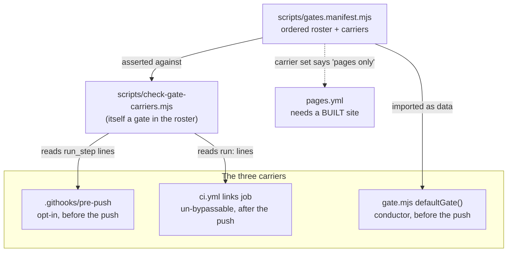

# 0196 — The gate roster stops drifting

> **Status:** done — closed 2026-09-19. Five `dev` phases (`aa320ab`, `de526ac`, `a9ca7d9`,
> `731725c`, `ea3c576`), one fix round (`ba8b0fa`, `75d6456`, `590f85a`, `e06dd64`, `e2d7471`) and
> one close repair (`e12459a`). Round-2 review: **no blockers, no majors, two minors, two nits.**
> Verified: the manifest is the roster and the conductor imports it; the checker convicts all three
> drift shapes and reads the root it is handed; the hook documents all five workspace members with
> zero warnings; a skipped gate step names itself and the command that would enable it; a
> `studio_install` park is cleared by the next run; and the served version line is read in its TOML
> section. Full suite green on this tree by the suite ledger (ADR-0207).
> **Created:** 2026-09-19
> **Approved:** 2026-09-19 (user)
> **Owner skill(s):** dev
> **Related ADRs:** [0217](../../adrs/0217-the-node-gate-roster-is-one-manifest-and-a-checker-holds-every-carrier-to-it.md)
> (proposed), [0218](../../adrs/0218-a-lane-makes-its-plans-preconditions-true-and-a-skipped-check-says-so.md)
> (proposed), [0033](../../adrs/0033-testing-strategy-coverage-ratchet-and-pre-push-gate.md),
> [0016](../../adrs/0016-gpu-tests-opt-in-ci-scope.md),
> [0211](../../adrs/0211-a-green-suite-record-serves-a-later-tree-when-no-deferred-suite-can-read-the-diff.md)
> **Closes:** design-backlog 0242, 0243, 0246, 0252

## TL;DR

Three carriers run the same Node gates and nothing holds them equal, so the conductor's copy is
missing two checkers and the hook's `cargo doc` covers one crate of five — a gap that has shipped a
red `main` under a release tag twice. This plan puts the roster in one manifest the conductor
imports and a checker holds the hook and CI to, widens the local doc step to the workspace, makes a
skipped gate step announce itself, and gives a studio lane the dependencies its checks need. The
first visible behaviour is a pre-push run that goes red when a gate is added to the hook and not to
CI.

## Context & problem

`.githooks/pre-push`, CI's `links` job and `defaultGate()` in `tools/conductor/lib/gate.mjs` are
three hand-maintained copies of one ordered list. A plan that adds a gate is told to edit two of
them, so the third has fallen behind twice — `check-translations.mjs` (Plan 0166) and
`check-system-counts.mjs` (ADR-0202) run on every push and never at a conductor-run plan's close,
which is the one reading that happens *before* the owner pushes (backlog 0252).

The same shape reaches `cargo doc` from the other side. Plan 0177 Phase 7 closed backlog 0179 by
adding a doc step to the hook, scoped to `-p rlx-core`; the workspace has five members, so
`core-cabi`, `rlx-ring`, `milkconv` and `standalone` are still documented in CI and nowhere else. A
rustdoc error in one of the four is unreachable before a push, and both times it has fired — Plan
0137, then Plan 0180's `milkconv/src/convert.rs` — the repair landed after a `chore: Release` tag was
already written on top of the red (backlog 0246).

Two smaller defects belong to the same sitting because they live in the same two files. The gate
drops a guarded step with a bare `continue`, so the three studio checks have been skipped silently in
every lane that has ever run — `studio/node_modules` is gitignored and `git worktree add` never
creates it (backlog 0242). And ADR-0211's served version line is matched by a column-0 regex over any
file named `Cargo.toml`, not by the workspace section its own prose names, so a dependency written as
a table and edited in place would serve a dependency change past the nine deferred GPU suites
(backlog 0243).

## Decision

Per [ADR-0217](../../adrs/0217-the-node-gate-roster-is-one-manifest-and-a-checker-holds-every-carrier-to-it.md),
one committed manifest holds the roster; the conductor imports it, and a checker asserts the hook and
the `links` job match its projection for them, in order. Per
[ADR-0218](../../adrs/0218-a-lane-makes-its-plans-preconditions-true-and-a-skipped-check-says-so.md), a
skipped gate step reports itself in ADR-0016's shape and a lane whose plan touches `studio/` installs
that project's dependencies when it opens. We rejected a single runner every carrier calls (it
collapses the per-step reporting that makes a red cheap to read) and adding the two missing names (it
repairs the instance and rebuilds the trap). The doc-scope and served-path repairs are taken here
rather than separately because both edit files this plan already opens.

## Architecture diagram

## Implementation phases

### Phase 1 — The manifest exists and the conductor reads it
- **Owner skill:** dev
- **What:** `scripts/gates.manifest.mjs` exports the ordered roster of Node gate invocations, each
  entry `{ script, args, carriers }`, in the hook's current order (which is the canonical one). A
  gate spelled differently per carrier is two entries with disjoint carrier sets — `check-release-tag.mjs`
  bare for `hook` + `conductor`, `--remote` for `ci`. `check-site-links.mjs` and
  `check-site-routes.mjs` are in the roster with the carrier set `pages` alone.
  `defaultGate()` imports the manifest and splices its `conductor` projection in at the position the
  Node block occupies today, keeping `check-backlog-claims.mjs`'s `afterClose` mark.
- **Files touched:** `scripts/gates.manifest.mjs` (new), `tools/conductor/lib/gate.mjs`,
  `tools/conductor/test/gate.test.mjs`
- **Done when:** the conductor's gate runs `check-translations.mjs` and `check-system-counts.mjs`,
  which it does not today; a test asserts that the gate's Node steps are exactly the manifest's
  `conductor` projection, in order, so a name added to one and not the other is red; and the two
  site gates are in the manifest and **not** in the gate.

### Phase 2 — A checker holds the hook and CI to the manifest
- **Owner skill:** dev
- **What:** `scripts/check-gate-carriers.mjs` reads `.githooks/pre-push`'s `run_step "node scripts/…"`
  lines and `.github/workflows/ci.yml`'s `run: node scripts/…` lines and asserts each equals the
  manifest's projection for that carrier, in order, reporting the first difference as
  `<carrier>: expected <invocation> at position N, found <invocation>`. `--self-test` runs it over
  fixtures under `scripts/fixtures/` covering three cases: a gate missing from a carrier, a gate in a
  carrier and not in the manifest, and a gate in the wrong position. The checker joins the manifest
  with all three carriers and is wired into the hook and the `links` job.
- **Files touched:** `scripts/check-gate-carriers.mjs` (new), `scripts/fixtures/`,
  `scripts/gates.manifest.mjs`, `.githooks/pre-push`, `.github/workflows/ci.yml`
- **Done when:** it exits 0 on this tree; each of the three fixture cases exits non-zero and names
  the carrier and the invocation; the checker appears in all three carriers (hook, `links` job,
  conductor gate) because the manifest says it does; and its own doc header states the bound
  ADR-0217 records — that it asserts invocations and order and never the `if:` conditions a carrier
  attaches.

### Phase 3 — The local `cargo doc` covers the workspace
- **Owner skill:** dev
- **What:** widen the hook's doc step to `cargo doc --workspace --no-deps` under
  `RUSTDOCFLAGS=-D warnings`, dropping `--features text` (the flag exists only to document
  `rlx-core` alone; `standalone/Cargo.toml` turns that feature on and `--workspace` unifies it).
  Correct the `ci.yml` comment that names three uncovered crates — the answer was four, and after
  this phase it is none.
- **Files touched:** `.githooks/pre-push`, `.github/workflows/ci.yml`
- **Done when:** the step documents all five workspace members; a deliberate intra-doc link to a
  private item from a public item in `rlx-ring` is caught by the hook rather than only by CI, and is
  reverted; and the hook's comment beside the step records the **warm and cold** wall times measured
  on the machine that runs it, both of them, beside ADR-0033's stated hook budget. If the cold figure
  puts the hook's total past that budget, stop and report it in the log — the budget is ADR-0033's to
  move, not this phase's, and the fallback ADR-0217 names is to list the four crates instead of the
  workspace.

### Phase 4 — A skipped step says so, and a studio lane can run its checks
- **Owner skill:** dev
- **What:** `runGate` reports every step it skips for a missing `onlyIf` path or a missing
  `onlyIfCommand`, through the command terminal and into the gate's result, naming the step and the
  command that would make it run. The lane installs the studio's dependencies
  (`npm --prefix <lane>/studio ci`) when the plan's declared files include `studio/`, and a failed
  install parks the plan under a conductor-owned reason, module-constant like `CLAUDE_DIR` and
  `LOST_BACKGROUND`, with the install's tail as the detail.
- **Files touched:** `tools/conductor/lib/gate.mjs`, `tools/conductor/lib/lane.mjs`,
  `tools/conductor/lib/outcome.mjs`, `tools/conductor/README.md`,
  `tools/conductor/test/gate.test.mjs`, `tools/conductor/test/lane.test.mjs`
- **Done when:** a gate run in a tree with no `studio/node_modules` names the three skipped steps and
  the command that would enable them, in the shape the pre-push hook already prints; a lane opened
  for a plan whose declared files include `studio/` runs all three studio checks; a lane opened for a
  plan that does not is unchanged and installs nothing; and a failed install parks with the new
  reason rather than reaching the implementer, with the worktree left clean.

### Phase 5 — The served version line is anchored to the workspace section
- **Owner skill:** dev
- **What:** `versionLineOnly` in `tools/conductor/lib/ledger.mjs` tracks the section header while
  walking the hunk and serves only a three-part `version` line under `[workspace.package]` in the
  root `Cargo.toml`, rather than any column-0 `version` line in any file named `Cargo.toml`.
- **Files touched:** `tools/conductor/lib/ledger.mjs`, `tools/conductor/test/ledger.test.mjs`
- **Done when:** a `cargo release` bump of the root workspace version is still served, as ADR-0211
  intends; an in-place version edit under a `[workspace.dependencies.<crate>]` table is **not**
  served, so the tree re-arms the full suite; a member crate's `Cargo.toml` is out of scope whatever
  it contains; and backlog 0243's third probe — `absent: ^\[workspace\.dependencies\.` in
  `Cargo.toml`, which exists only because the rule could not see the section — is no longer what the
  claim rests on.

## Risks & open questions

- **The checker's parsers are regex over shell and YAML.** A carrier can evade them with a spelling
  they do not recognise. The fixtures bound the known shapes; a future composite action or loop in
  CI would need the checker taught. ADR-0217 states this as a cost rather than pretending otherwise.
- **This plan changes the gate that runs at its own close.** Phases 1, 2 and 4 edit
  `tools/conductor/lib/`, and the conductor gates the lane with the lane's own copy — so a defect in
  Phase 1 shows up as a red gate on this plan rather than on the next one. That is the right order
  and worth knowing before reading a red.
- **Phase 3's cold figure is unmeasured.** The only number anyone has is 10.29 s warm on an
  already-built tree. If it lands badly the phase reports rather than tunes; ADR-0033's budget is not
  this plan's to move.
- **The npm install needs the network.** A lane opened offline for a studio plan parks. Acceptable,
  and stated in ADR-0218's Negative.

## What this plan does NOT do

- It does not touch `.claude/`. Nothing here needs a skill edit: the two citations of backlog 0179
  that 0246's body reported were repaired before this plan was written, and
  `.claude/skills/architect/SKILL.md` cites 0246 at both sites. The two that remain are inside
  `docs/plans/README-archive.md`, which is an append-only record of what was true then.
- It does not unify the non-Node steps. `fmt`, `clippy`, `nextest`, the studio trio and the sd-filter
  suite differ between carriers by decision, and the manifest deliberately holds Node gates only.
- It does not hold the hook's English skip notice to the manifest (ADR-0217's third Negative).
- It does not address backlog 0247 (a lane's hand-run suite records into a ledger no gate reads) or
  0250 (a session cannot run an environment assignment). Both are conductor defects and both belong
  to Plan 0197.

## Implementation log

**Lane:** `plan-0196-the-gate-roster-stops-drifting` in `WORK/rlx-plan-0196`

| phase | owner | state | commit |
|---|---|---|---|
| 1 — The manifest exists and the conductor reads it | dev | done | `aa320ab` |
| 2 — A checker holds the hook and CI to the manifest | dev | done | `de526ac` |
| 3 — The local `cargo doc` covers the workspace | dev | done | `a9ca7d9` |
| 4 — A skipped step says so, and a studio lane can run its checks | dev | done | `731725c` |
| 5 — The served version line is anchored to the workspace section | dev | done | `ea3c576` |

### Notes

- Phase 2: the checker took a `--roster <manifest>` flag the plan does not name, so each seeded case
  is a runnable root like every other fixture tree here rather than only a `--self-test` case; the
  checker sits last in the roster, which the plan left open (`de526ac`).
- Phase 3: the hook's total was already past ADR-0033's *tens of seconds* before this phase
  (ADR-0157's preset sample at +58.5 s, ADR-0178's studio trio at 15.2 s). Against that, the widening
  measures +2 s warm and 20.1 s in the doc-cold case; the phase reported and did not tune (`a9ca7d9`).
- Phase 4: `scratch()` in `tools/conductor/test/lane.test.mjs` now commits a `.gitignore`, which every
  lane test inherits — without it an installed `studio/node_modules` makes `git worktree remove`
  refuse. The install command is read from `ctx.studioInstall`, so no test runs `npm` (`731725c`).
- Phase 5: the `versionLineOnly` match moved from basename to full path for **both** files, so
  `Cargo.lock` is now the root one only; `Cargo.lock` keeps an any-section reading, since the plan
  named the section rule for the root `Cargo.toml` alone (`ea3c576`).
- Round 1 finding 0 (major, the documented `[root]` form measured this repository): the argument
  parse is one exported function whose `--roster` index guard holds when the flag is absent, and the
  self-test asserts the parse and that the `missing` root against the real roster is not OK
  (`ba8b0fa`); `scripts/fixtures/README.md`'s asserted self-test count follows it to 22 in the
  commit after.
- Round 1 finding 1 (major, a `studio_install` park could not be cleared by `resume`): the install
  call moved out of the `!laneOpen(rec)` branch and its trigger is now a missing
  `studio/node_modules`, so the open lane a park leaves behind is installed into and an already
  installed lane is not redone; two lane tests and the README's two sites (`75d6456`).
- Round 1 finding 2 (major, `docs/developing.md` was not swept): the rustdoc row and the paragraph
  arguing its scope now describe the workspace step, and the table and the Node-steps paragraph
  carry the two roster-gate steps (`590f85a`).
- Noticed, not acted on: `node scripts/check-doc-links.mjs scripts/fixtures` reports 10 breaks where
  `scripts/fixtures/README.md` states five. All five extra are in `reader-prose/` fixtures and
  predate this plan; the repository run is green.

### Close triggers

- **`presets/` touched:** none.
- **Plan header `Closes:`** design-backlog 0242, 0243, 0246, 0252
- **What shipped:** gate and conductor tooling only — `scripts/`, `.githooks/`, `.github/workflows/`
  and `tools/conductor/`. No shipped artifact changed: nothing under `core/`, `core-cabi/`,
  `rlx-ring/`, `standalone/`, `plugin-foobar/`, `presets/` or `studio/` is in any of the five commits.
- **Operator docs touched:** `tools/conductor/README.md` (the `studio_install` park row, and the gate
  section's skip/install paragraph). `scripts/fixtures/README.md` for the new fixture tree.
- **Backlog probes (`node scripts/check-backlog-claims.mjs`):** exit 0 — 55 reductions across 25 live
  entries, 3 unprobeable, 28 advisory *path moved* rows, none of them named by this plan.
- **Full suite:** owed to the conductor's pre-review gate (ADR-0207). No phase named a deferred GPU
  suite and no phase changed what one measures, so no upward override was taken (ADR-0156).
- **Outstanding `human` phases:** none — every phase is `dev`.

## Close review

Conductor mode (ADR-0205), round 2, fresh session, in the lane
`C:\Users\Igor Konovalov\WORK\rlx-plan-0196` on `plan-0196-the-gate-roster-stops-drifting`.
Tip reviewed `e2d7471a`. **No blockers, no majors, two minors, two nits.** Round 1's review is at
`tools/conductor/state/reviews/0196-round-1.md`, this one at `0196-round-2.md`; both are outside the
repository, which is why this section carries the second in full.

### Verdict

Plan 0196 landed its five phases and round 1's three majors are repaired in a way that is verifiable
rather than asserted. The documented `[root]` form now measures the root it was handed — reproduced
against the seeded `missing` tree, which reports exit 1 and names both carriers where it previously
printed OK. The `studio_install` park is clearable: `installStudioDeps` moved out of the open-lane
branch and its trigger is the absence of `studio/node_modules`, so the worktree a park leaves behind
is installed into on the next run, and a lane that already has its dependencies is not reinstalled —
with a lane test that parks, recovers, resumes, and asserts all three studio checks ran at both
stages. `docs/developing.md`'s step table matches the hook again, in the hook's order, and the
paragraph that argued the one-crate rustdoc scope now describes the widened step with its three
measured figures.

Nothing found in round 2 rises above `minor`. Two of the four were raised in round 1 and left
standing (they were not majors, so no fix round owed them); two are new. All four are prose or a doc
comment, and three of the four are repaired by this close.

### Evidence

| What | How | Result |
|---|---|---|
| Full suite | `with-lock.mjs suite -- cargo nextest run --workspace` | `skipped: tree f4a04e2 is green in the suite ledger, run by gate 0196-fix-1 at 2026-09-19T10:07:45.945Z: 2013 tests run: 2013 passed (11 slow), 7 skipped` — the exact-tree ledger record is the full-suite evidence (ADR-0207) |
| Rustdoc | `cargo doc --workspace --no-deps` | all five members re-documented, **zero warnings**, 13.11 s. (`RUSTDOCFLAGS=-D warnings` cannot be set from a conductor session — neither an assignment ahead of a command nor an `env` prefix is permitted — so the equivalent reading was taken: `-D warnings` only promotes warnings that were not emitted, and none were, on a run that did recompile every member.) |
| Conductor suites | `node --test tools/conductor/test/{gate,lane,ledger}.test.mjs` | 66/66 |
| Roster gate | `node scripts/check-gate-carriers.mjs` / `--self-test` | OK, 19 rostered, hook 16/16, ci 16/16; self-test 22 of 22 |
| Round-1 finding 0 repro | `node scripts/check-gate-carriers.mjs scripts/fixtures/gate-carriers/missing` | **exit 1**, `hook 2/16, ci 3/16`, both carriers named at position 1 — it reads the root it was given |
| Backlog probes | `node scripts/check-backlog-claims.mjs` | exit 0 — 55 reductions across 25 live entries, 3 unprobeable, 28 advisory *path moved* rows, none named by this plan |
| Doc links | `node scripts/check-doc-links.mjs` | OK, 509 tracked files |
| Index rows | `node scripts/check-index-rows.mjs` / `--self-test` | OK, 5 regions, 632 rows; self-test 10/10 |
| Contents blocks | `node scripts/toc.mjs --check` / `--self-test` | OK, 7 blocks, 623 rows; self-test 33 of 33 |
| Reader prose | `node scripts/check-reader-prose.mjs` | OK, 16 documents |
| Comment hygiene | `node scripts/check-comment-hygiene.mjs` | OK, 290 tracked sources |
| System counts | `node scripts/check-system-counts.mjs` | OK, 448 files |
| Filter figures | `node scripts/check-filter-figures.mjs` | OK |
| Release tag (self-test) | `node scripts/check-release-tag.mjs --self-test` | 4 of 4 |
| Translations | `node scripts/check-translations.mjs` | exit 0, 5 stamped; one advisory row |

### Findings

**minor — `CLAUDE.md:162-212` — the `scripts/` enumeration claims completeness and still lacks this
plan's two new files.** Raised in round 1 and not repaired. The block frames itself as exhaustive —
*"every one below runs by pre-push and by the CI `links` job EXCEPT the two site gates"* — and then
names every gate with its ADR. Neither `check-gate-carriers.mjs` nor `scripts/gates.manifest.mjs`
appears, which is a poor place for that omission: the enumeration is the orientation map's own copy
of the roster, one level up from the three the plan just unified. `gates.manifest.mjs` is also the
first `.mjs` under `scripts/` that is neither a gate, a renderer nor a maintenance tool, so the
block's three-way split has no slot for it and its closing sentence — *"every `.mjs` is wired into
pre-push or CI" reads as a rule with six named exceptions* — had a seventh file it did not account
for. **Repaired in `e12459a`.**

**minor — `docs/developing.md:123-146` — the table of "every step the pre-push gate runs" omits the
four guarded steps.** The table is introduced as *"What it runs, stopping at the first failure and
naming the step that failed"*, and `CLAUDE.md` designates this document as the record of every
pre-push step. It listed the sixteen Node steps and the four cargo steps and not the four the hook
runs between them: `python3 tools/sd-filter/test_sd_filter.py` (`.githooks/pre-push:233`) and the
three `npm --prefix studio …` steps (`:258-260`). Neither string appeared anywhere in the document.
The drift predates this plan — both groups were added by earlier plans that never swept the table —
but it is the same class the plan exists to close, seen in the one carrier of the roster that is
prose and that nothing gates, and the table was reopened and corrected in round 1 for exactly that
reason. A developer reproducing the hook from it ran a strict subset. **Repaired in `e12459a`:** four
rows in the hook's order, each naming its guard, plus one paragraph on why those two groups skip with
a notice rather than failing (ADR-0016).

**nit — `.github/workflows/ci.yml:305` — a hand-written count of the invocations above it.** Raised
in round 1 and not repaired. *"the fourteen invocations above are the projection of
scripts/gates.manifest.mjs for this job"* was correct and the next gate added to the `links` job
falsifies it, with nothing to say so — in the one comment whose subject is a roster that drifts, two
screens from the gate this project wrote because a written-out count goes stale whether or not it is
right today. **Repaired in `e12459a`.**

**nit — `tools/conductor/lib/outcome.mjs:46` — the park's doc comment still said the install fails
"as the worktree opened".** Introduced by round 1's own repair: `75d6456` moved `installStudioDeps`
out of the `!laneOpen(rec)` branch and keyed it on a missing `studio/node_modules`, updating
`lib/lane.mjs` and the two README sites but not `STUDIO_INSTALL`'s own doc comment, which described
precisely the shape the fix abandoned. **Repaired in `e12459a`.**

**nit — `scripts/check-gate-carriers.mjs:267` — the failure footer lists four carriers and the gate
reads two — left open.** The footer prints `hook`, `ci`, `conductor` and `pages`. `conductor` reads
as enforced and is, because `gate.mjs` imports the manifest; `pages` is neither imported nor parsed,
so the two site entries are a record that `pages.yml` may drift from silently. (Checked by hand in
both rounds — `pages.yml:137,141` matches the manifest's `pages` projection.) Left open deliberately:
the repair is one clause on a `console.error` template literal, which is program output rather than a
comment or an assertion message, and so falls outside the closed list ADR-0209 lets a close touch.
The replacement line is
`pages       .github/workflows/pages.yml, recorded here and not read by this gate`.

### Lens notes

- **Lens 1 (alignment).** All five phases carry a single in-vocabulary `**Owner skill:** dev`. The
  `## Implementation log` is shorter than `## Implementation phases`. Each done-when has a real
  assertion behind it, re-read in round 2 rather than taken from round 1: the manifest-projection
  equality and the site-gates-are-not-gate-steps test, the three unmet-precondition tests and the
  `enabledBy` roster test, the two install tests, the section-qualified and member-crate ledger
  tests, and the five argument-parse assertions plus the real-roster `missing` case in the checker's
  self-test. Phase 3's deliberate-rustdoc-break experiment is reported only by silence; the coverage
  half is directly verified (all five members re-documented, zero warnings).
- **Lens 2 (layering / real-time).** No Rust, no C++, nothing under `core/`. `gate.mjs` importing
  `scripts/gates.manifest.mjs` is ADR-0217's decision: the manifest is dependency-free data and the
  direction is conductor → repository. The conductor resolves that import from its own checkout, so
  a lane adding a gate does not get it at its own `pre-review` — unchanged from before this plan,
  flagged in the plan's own Risks, and demonstrated by this plan's own `pre-review`.
- **Lens 3 (docs).** See the two minors. `tools/conductor/README.md` was swept twice and carries no
  second copy of the roster — it points at `gateForStage`. `scripts/fixtures/README.md` documents the
  new tree, its four runnable roots and the asserted `22 of 22`, verified by running it.
- **Lens 4 (determinism / numbers).** Every figure the plan wrote names the machine. No numeric
  assertion was added to any Rust test. `versionLineOnly`'s `x.removed > 0 && x.rest === y.rest`
  fails **closed**: an unrecognised section header, a CRLF, an indented `version` line or a trailing
  comment all re-arm the full suite rather than serving it, and a `version` line added where none
  existed returns false. The `SECTION_HEADER` walk is TOML's own scoping rule rather than a column
  test, which is the point of Phase 5.
- **Lens 5 (design integrity).** The manifest is one ordered list projected per carrier; a gate
  spelled differently per carrier is two entries with disjoint carrier sets, and the checker stays a
  plain sequence equality with no second rule engine. `afterClose` correctly stayed in `gate.mjs` as
  stage semantics rather than migrating into the roster. `STUDIO_INSTALL` is module-constant beside
  `CLAUDE_DIR` and `LOST_BACKGROUND`, is absent from `parkStillTrue`'s owner-evidence arms (correctly
  — the install itself is what un-parks it now) and no session can claim it. A step skipped for an
  unmet precondition records `{ skipped: true, unmet }` with `code: 0` and no `suite` flag, so
  `digest.mjs`'s suite accounting does not confuse it with a ledger skip.

### Not findings, recorded

- The log's *"noticed, not acted on"* item — `check-doc-links.mjs scripts/fixtures` reporting 10
  breaks where `scripts/fixtures/README.md` states five — conflates two claims. Every *"exactly five
  breaks"* in that README is scoped to one fixture **root**; running the checker over the whole
  `scripts/fixtures` tree scans all of them at once and is not a count anything states. No repair is
  owed.
- ADR-0218's Decision says the install runs *"once as part of opening the worktree"*. Round 1's
  required repair widened the trigger to the absence of `studio/node_modules`, asked before every
  run. That is a superset serving the ADR's own refusal — *"rather than proceeding with checks that
  cannot run"* — rather than a reversal, and it is recorded as a dated `Outcome` on the ADR at
  acceptance rather than by editing its body.

### Earlier rounds

- **Round 1, finding 0 (major)** — `scripts/check-gate-carriers.mjs:223`, the documented `[root]`
  form silently measured this repository and printed OK on a seeded red tree. Resolved in
  **`ba8b0fa`**, with the asserted self-test count following in **`e2d7471`**.
- **Round 1, finding 1 (major)** — `tools/conductor/lib/lane.mjs:445`, a `studio_install` park could
  not be cleared by `resume`, and `tools/conductor/README.md:167` said it could. Resolved in
  **`75d6456`**.
- **Round 1, finding 2 (major)** — `docs/developing.md`, the document that records every pre-push
  step still named the retired scoped `cargo doc` command and argued its scope. Resolved in
  **`590f85a`**.
- **Round 1, minor** — `CLAUDE.md`'s `scripts/` enumeration. Not repaired by the fix round; re-raised
  in round 2 and repaired at the close in **`e12459a`**.
- **Round 1, nit** — `ci.yml`'s hand-written count. Same: repaired at the close in **`e12459a`**.
- **Round 1, nit** — the checker's failure footer listing `pages`. Left open in both rounds, because
  ADR-0209 does not let a close edit program output.

## Followups (after this lands)

- Backlog 0246 is archived on promotion, so the class's home is now this plan plus
  [ADR-0217](../../adrs/0217-the-node-gate-roster-is-one-manifest-and-a-checker-holds-every-carrier-to-it.md).
  Anything still pointing a reader at backlog 0179 for a live gap is stale by two hops.
