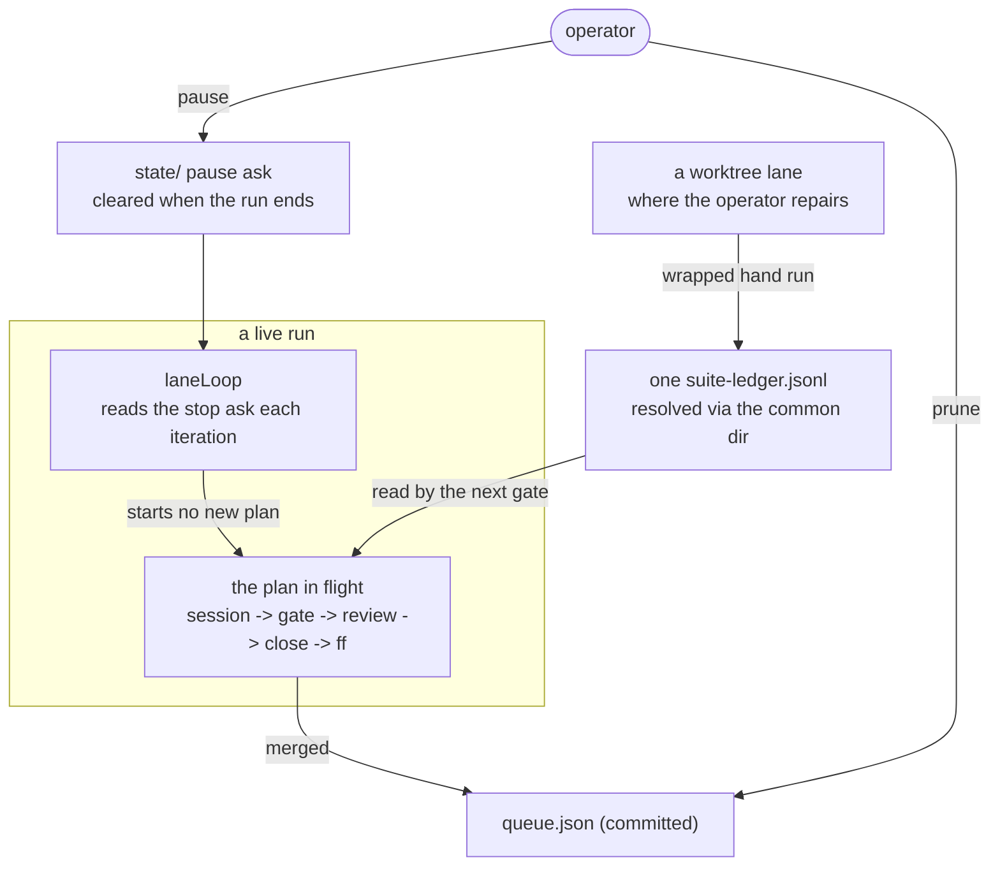

# 0197 — The conductor becomes operable

> **Status:** done — four phases landed in `1928b879`, `4625a537`, `3ee9a776` and `3619c8bb`; round 1
> raised one major and two minors, repaired in `4bf9163f`, `68e4acbd` and `7a35b07d`; round 2 closed
> it with **no blockers, no majors, one minor and one nit**, on a green full suite (2025 passed) and a
> green `fmt` + `clippy` + `cargo doc --workspace`.
> **Created:** 2026-09-19
> **Approved:** 2026-09-19 (user)
> **Owner skill(s):** dev
> **Related ADRs:** [0219](../../adrs/0219-the-conductor-can-be-asked-to-finish-and-stop-and-the-ask-does-not-outlive-the-run.md)
> (proposed), [0220](../../adrs/0220-the-committed-queue-stands-alone-and-a-merged-plan-is-skipped-with-a-notice.md)
> (proposed), [0205](../../adrs/0205-an-approved-plan-runs-under-a-conductor-and-every-judgement-it-cannot-make-parks-the-plan.md),
> [0207](../../adrs/0207-a-suite-run-the-conductor-observed-green-is-not-run-again-on-the-same-tree.md)
> **Closes:** design-backlog 0240, 0247, 0250, 0253

## TL;DR

Four things the operator does around a run are done by hand today: timing an `abort` with a
stopwatch to stop after the plan in flight, pruning a queue nothing prunes, re-running a suite the
conductor cannot see because the wrapper wrote it into a lane's own ledger, and resolving a
regeneration a session is not allowed to run. This plan adds `pause`, makes the committed queue
stand alone and adds `prune`, resolves the suite ledger per repository rather than per worktree, and
lets a session run the two documented `RLX_UPDATE_*` regenerations. The first visible behaviour is
`conductor.mjs pause` printing the plan it will finish and then ending the run.

## Context & problem

**Stopping.** `abort` kills the conductor and every session under it, and an in-flight step re-runs
next time. It is the only stop there is, and the ask an operator actually makes is *"finish the plan
in flight, then stop"*. On 2026-09-18 that was done three times in one day by watching
`state/conductor.json` in a loop and aborting inside the gap between a merge and the next session
(backlog 0253).

**The queue.** `queue.json` is committed and accumulate-only; a merged plan stays listed and is
tolerated by a special case keyed on `state/conductor.json`, which is gitignored. `validateQueue` has
no `done/` fallback, so on any clone or after a wiped `state/` every merged plan still listed is a
fatal preflight error and the run refuses to start. It has never fired because the queue was pruned
by hand twice, and nothing records that as something anyone must keep doing (backlog 0240).

**The ledger.** `tools/conductor/README.md` promises that a suite run by hand through the wrapper
counts and the next gate on that tree will not run it again. `suiteLedger()` resolves to
`join(selfDir, "state", "suite-ledger.jsonl")` — beside the copy of the script that was invoked — and
`state/` is gitignored, so a run inside a lane writes the lane's own file, which is the one place no
gate reads. The park table sends the operator *into the lane* for every reason it lists, so the
affordance works where a repair does not happen and fails where it does. Observed 2026-09-17 settling
Plan 0178's park: a green 640 s suite in `WORK/rlx-plan-0178`, and a `pre-review` gate that will run
it again (backlog 0247).

**Environment assignments.** `settings.conductor.json` allows commands by prefix, so
`RLX_UPDATE_PRESET_SCHEMA=1 cargo nextest run …` matches no rule and is denied. Two repairs the
project documents are therefore unreachable from inside a session, and both have been met: Plan
0184's close parked `merge_conflict` on a generated file it had correctly diagnosed and could not
regenerate, and any phase that renames a parameter meets the same wall (backlog 0250).

## Decision

Per [ADR-0219](../../adrs/0219-the-conductor-can-be-asked-to-finish-and-stop-and-the-ask-does-not-outlive-the-run.md),
`pause` is an ask the lane loop reads where it already reads its stop request, at plan granularity,
cleared when the run ends. Per
[ADR-0220](../../adrs/0220-the-committed-queue-stands-alone-and-a-merged-plan-is-skipped-with-a-notice.md),
`validateQueue` gains the `done/` fallback `merged()` already has and reports the skip as a notice,
and `prune` gives the accumulate-only file a carrier. The ledger resolves through the repository's
common directory so there is **one ledger per repository**: we rejected teaching the gate to read a
lane's ledger too, because a second lookup path means two files that can disagree about the same
tree, and the value of the record is that there is one answer. The allowlist admits the two
documented `RLX_UPDATE_*` spellings **by name**, because a rule for the shape `VAR=value <allowed
command>` would admit every variable including the ones that change what a build does.

## Architecture diagram



## Implementation phases

### Phase 1 — `pause`: finish the plan in flight, then stop
- **Owner skill:** dev
- **What:** `conductor.mjs pause` records the ask in the state directory; `laneLoop` reads it beside
  `stopRequested()` and starts no further plan; the run ends with a recorded reason naming the pause
  rather than an exhausted queue. `pause` prints the plan and step in flight and how long that step
  has been running; `pause --off` clears the ask while the run is still live; a `run` that finds an
  ask left behind by a dead conductor treats it as absent.
- **Files touched:** `tools/conductor/conductor.mjs`, `tools/conductor/lib/lane.mjs`,
  `tools/conductor/lib/state.mjs`, `tools/conductor/README.md`,
  `tools/conductor/test/lane.test.mjs`, `tools/conductor/test/cli.test.mjs`
- **Done when:** with a two-plan lane and the first plan in flight, `pause` prints what it is waiting
  for and the second plan never starts, while the first runs through its close and fast-forward and
  the run ends normally; `pause --off` before the first plan ends lets the second start; the run
  record says the lane stopped because it was paused, distinguishably from `--once` and from an empty
  queue; and a `run` started with a stale ask file and no live conductor runs normally.

### Phase 2 — The queue stands alone, and `prune` keeps it tidy
- **Owner skill:** dev
- **What:** `validateQueue` treats a queued plan found under `docs/plans/done/` as merged — the
  fallback `merged()` already has — and reports it as a notice naming the plan and the file instead
  of a fatal error. `conductor.mjs prune` rewrites `queue.json` with those plans dropped, prints each
  one, and changes nothing else about the file.
- **Files touched:** `tools/conductor/lib/queue.mjs`, `tools/conductor/conductor.mjs`,
  `tools/conductor/README.md`, `tools/conductor/test/queue.test.mjs`,
  `tools/conductor/test/cli.test.mjs`
- **Done when:** backlog 0240's demonstration reverses — `validateQueue` over a lane listing a plan
  under `done/`, with **empty** merged sets, returns no errors and one notice naming that plan; a
  queued number with no plan file at all is still a fatal error; `prune` on a queue holding a merged
  plan removes exactly that entry and leaves every other lane list byte-identical; and `prune` on an
  already-tidy queue rewrites nothing.

### Phase 3 — One suite ledger per repository, not per worktree
- **Owner skill:** dev
- **What:** `suiteLedger()` resolves the ledger beside the repository's common directory
  (`git rev-parse --git-common-dir`) so a wrapped run in any worktree records where the conductor
  reads. `RLX_SUITE_LEDGER` still wins. A bare or relocated `.git` that the derivation cannot resolve
  falls back to today's behaviour and says so, in ADR-0016's shape.
- **Files touched:** `tools/conductor/with-lock.mjs`, `tools/conductor/README.md`,
  `tools/conductor/test/with-lock.test.mjs`
- **Done when:** a wrapped `cargo nextest run --workspace` started inside a lane writes its record to
  the main checkout's `state/suite-ledger.jsonl`, and a gate run from the main checkout on that same
  tree skips the suite and prints the `hand` record; the same run started in the main checkout writes
  to the same file it does today; the test covers `selfDir` and `cwd` in **different** worktrees,
  which is the case the current test does not exercise; and an unresolvable common dir is a notice
  rather than a silent change of destination.

### Phase 4 — A session can run the two documented regenerations
- **Owner skill:** dev
- **What:** `settings.conductor.json` admits `RLX_UPDATE_PRESET_SCHEMA=1 cargo *` and
  `RLX_UPDATE_PARAM_REFERENCE=1 cargo *` by name, in both shell spellings the sessions use, with a
  case in `test/settings.test.mjs` like every other rule. `tools/conductor/README.md` states that the
  rule is a list of named variables rather than a pattern, and `docs/developing.md`'s commands stay
  the ones a session runs.
- **Files touched:** `tools/conductor/settings.conductor.json`,
  `tools/conductor/test/settings.test.mjs`, `tools/conductor/README.md`
- **Done when:** the two documented regeneration commands are allowed under the session allowlist and
  a third variable in the same shape (`RLX_ANYTHING_ELSE=1 cargo …`) is still denied; the test
  asserts both, against the model it already carries; and the README says which variables are named
  and why the rule is not a shape.

## Risks & open questions

- **The allowlist is asserted against a *model* of the CLI's matcher** (backlog 0241, still live),
  and the first unattended run falsified that model once. Phase 4's new cases inherit that: a green
  `settings.test.mjs` says the rule is right under the model, not that the CLI admits it. The first
  conductor session that needs a regeneration is the real evidence, and the plan's log should record
  what happened the first time one runs.
- **Phase 3 changes where a record lands.** A ledger line written before this lands and a line
  written after resolve to different files, so a tree green in the old location will be re-run once.
  That is one suite, once, and it is cheaper than a migration.
- **Phase 1's ask is polled state.** ADR-0219's Negative names the stale-file case; the done-when
  covers it, and nothing else in the conductor reads that file.
- **This plan edits the conductor while the conductor runs it.** The running process uses the main
  checkout's copy and the lane's gate uses the lane's, so Phase 1's and 2's defects surface on this
  plan's own gate. That is the right order, and worth knowing before reading a red.

## What this plan does NOT do

- It does not touch `.claude/`. Nothing here needs a skill edit; the README is the conductor's own.
- It does not take backlog 0236 (the `.claude/` park reads only a phase's declared `Files touched`),
  0237 (a deletion whose path the shell expands escapes the lane's deny rules) or 0241 (the allowlist
  is asserted against a model of the CLI's matcher). All three stay live. 0237 is the closest miss —
  it edits the same file as Phase 4 — and it is left out because its three shapes are undecided and
  the narrowest of them is a real restriction on what a session may delete.
- It does not let the conductor resolve a generated-file conflict itself (backlog 0250's third
  shape). Phase 4 makes the command runnable; deciding which paths are regenerate-don't-merge is a
  separate design.
- It does not touch the gate roster, `cargo doc`'s scope or the served-path rule — those are
  [Plan 0196](../0196-the-gate-roster-stops-drifting.md), which edits some of the same files. **The two
  plans must not run in the same lane at the same time:** both edit `tools/conductor/lib/gate.mjs`
  (0196 Phases 1 and 4, this plan none), `lib/lane.mjs` (0196 Phase 4, this plan Phase 1) and
  `tools/conductor/README.md`. Run them in one lane, in either order.

## Implementation log

**Lane:** `WORK/rlx-plan-0197` on `plan-0197-the-conductor-becomes-operable`

| phase | owner | state | commit |
|---|---|---|---|
| 1 — `pause`: finish the plan in flight, then stop | dev | done | 1928b879 |
| 2 — The queue stands alone, and `prune` keeps it tidy | dev | done | 4625a537 |
| 3 — One suite ledger per repository, not per worktree | dev | done | 3ee9a776 |
| 4 — A session can run the two documented regenerations | dev | done | 3619c8bb |

### Notes

- Phase 4 admits each variable in **two** spellings, not the one the phase names: `RLX_UPDATE_*=1
  cargo *` and `RLX_UPDATE_*=1 node *` (3619c8bb). `.claude/hooks/conductor-suite-lock.js` denies the
  bare form of both documented commands in a conductor session — it reads the assignment prefix and
  still sees the `cargo nextest` / `cargo test` behind it — so the `cargo` rule alone leaves the
  regeneration unreachable from the place the phase exists to reach it from.
- Phase 4's risk asks what happens the first time a session actually runs one of the two
  regenerations. None ran in this session; nothing to record yet.
- **Round 1 finding 0 (major), `pickNext` picks a merged plan** — `4bf9163f`: the picker asks
  `merged()` about the plan itself, not only about its `after` deps, so a queue entry for a plan
  under `done/` is skipped with no state record beside it. The new `cli.test.mjs` case drives `run`
  over that configuration and asserts no lane opens for it.
- **Round 1 finding 1 (minor), `recordNotStarted`'s reason list** — `68e4acbd`: `paused` added.
- **Round 1 finding 2 (minor), `pruneQueue`'s header** — `7a35b07d`: it now states contents and
  order preserved and the file rewritten in the canonical spelling, not that nothing else moves.

### Close triggers

- **`presets/` touched:** none.
- **Plan header `Closes:`** design-backlog 0240, 0247, 0250, 0253
- **What shipped:** feature, in `tools/conductor/` only — `pause`, `prune`, the queue's `done/`
  fallback, the per-repository suite ledger and four allowlist rules. Nothing under `core/`,
  `standalone/`, `plugin-foobar/`, `studio/`, `presets/` or `packaging/` moved, so no release
  artifact changed.
- **Operator docs touched:** `tools/conductor/README.md` — the `pause` row and paragraph (Phase 1),
  the queue's setup step and the `prune` row (Phase 2), the hand-suite paragraph (Phase 3), and the
  allowlist bullet in *How it stays safe* (Phase 4). No file under `docs/` other than this plan.
- **Backlog probes (`node scripts/check-backlog-claims.mjs`):** exit 0 — 59 reductions across 26 live
  entries, 4 unprobeable. Advisory only: 30 moved paths, of which this plan moved two —
  0237 (`tools/conductor/settings.conductor.json`) and 0241
  (`tools/conductor/test/settings.test.mjs`). The four entries this plan closes left the live file at
  approval (ADR-0206) and are **Promoted** rows in
  [`docs/design-backlog-archive.md`](../../design-backlog-archive.md); their probes no longer run.
- **Full suite:** not run here — owed to the conductor's pre-review gate (ADR-0207). No phase named a
  deferred GPU suite, so no upward override ran at an earlier phase.
  `node --test "tools/conductor/test/*.test.mjs"`: 361 tests, 361 pass, 0 fail.
- **Outstanding `human` phases:** none; every phase is `dev`.

## Close review

Round 2, 2026-09-19, conductor mode, fresh session. Range `1928b879..66c676b1` against `main`.
Round 1's review is at `tools/conductor/state/reviews/0197-round-1.md`; this one at
`0197-round-2.md`. A conductor-run close has no reader in the room, so the review is committed here
in full.

### Verdict

Round 1's major is genuinely closed, and closed at the place ADR-0220 says the two predicates meet
rather than at a symptom: `pickNext` now asks `merged()` about the plan itself before it reads the
state record, and the new `cli.test.mjs` case drives `run` — not `check` — over the exact
configuration ADR-0220 exists to enable (the committed queue, an empty `state/`, the merged plan
committed under `done/`) and asserts that no record, no worktree and no session appear for it. The
two minors were repaired as text, and both repairs say what is actually guaranteed rather than
restating the claim in softer words. Nothing new of consequence: two prose facts in this plan's own
close block had gone stale, both repaired here.

**no blockers, no majors, one minor, one nit.**

### Findings

#### minor — the close block said four backlog entries are live that are not

`docs/plans/0197-the-conductor-becomes-operable.md:225`. Fixed in `66c676b1`.

The **Backlog probes** bullet ended *"The four entries this plan closes are still live."* They are
not. 0240, 0247, 0250 and 0253 left `docs/design-backlog.md` when the plan was approved, per
[ADR-0206](../../adrs/0206-a-promoted-backlog-entry-leaves-the-live-file.md), and sit in
`docs/design-backlog-archive.md` — bodies at lines 14748, 15141, 15270 and 15442, ledger rows at 328,
334, 336 and 339, each marked **Promoted**. `grep` over the live file finds no occurrence of any of
the four numbers.

The bullet sits directly under the `check-backlog-claims.mjs` reading, whose subject *is* the live
file, so "still live" reads as "in the live file" — and that is the one reading the close acts on.
A close that trusts it goes to `design-backlog.md` for step 3c and finds nothing to archive, which is
the same accumulation ADR-0206 and the close's step 3c were both written to stop. It also
under-described what the close owes: for a promoted entry the probes no longer run at all (the gate
reads only the live file), so the evidence is the archived body read against the tree, not a green
exit code.

#### nit — the conductor suite's test count moved in the fix round

`docs/plans/0197-the-conductor-becomes-operable.md:228`. Fixed in `66c676b1`.

**Full suite:** recorded `node --test "tools/conductor/test/*.test.mjs"`: *360 tests, 360 pass, 0
fail*, which was true at `fe15f98c`. `4bf9163f` added the *"a run with no state of its own starts no
plan already under done/"* case, so the number is now **361**. Re-run at the review: 361 tests, 361
pass, 0 fail, 60.3 s.

### Lens 1 — alignment with the plan and the ADRs

**The implementation log** names the lane, maps all four phases to their commits, carries three
fix-round notes naming each repaired finding and its commit, and is 47 lines against
`## Implementation phases`' 61 — shorter than the contract it reports on, as required. Its notes are
read, not taken: Phase 4's *"admits each variable in two spellings, not the one the phase names"* is
verified against `settings.conductor.json:40-43` and against `.claude/hooks/conductor-suite-lock.js`,
which does strip a `VAR=value` prefix before matching, so the `cargo` rule alone would indeed leave
the regeneration unreachable from the only place the phase exists to reach it from. Phase 4's own
risk is still recorded as unresolved because no session ran a regeneration here — the honest entry
rather than a claim.

**Owner tags.** Four phases, each exactly one `**Owner skill:** dev`. In vocabulary. No `human` phase
outstanding.

**The round-1 repairs, read against the tree rather than against the log:**

- **Finding 0 (major) — `4bf9163f`.** `lib/lane.mjs:176` is now `if (merged(ctx, plan)) continue;`,
  placed **before** the status read, with a four-line comment naming the configuration that made the
  default `"queued"` wrong and citing ADR-0220. That is the one condition `validateQueue` reports as
  a notice, so the two predicates now genuinely read the same two sources in the same order, which is
  the Consequence the ADR claimed and the tree did not support last round. The test is the part that
  matters: `cli.test.mjs` *"a run with no state of its own starts no plan already under done/"*
  asserts `conductor.json` does not exist before the run, drives `run --lane a`, and then asserts
  three separate things — the notice is printed, `state.plans["0090"]` is `undefined` (so no record,
  no worktree, no session), and `notStarted` is empty (so a merged plan is not owed a reason either).
  The plan behind it still merges, which is what stops the fix from being "skip the whole lane".
  The two adjacent readers were checked for the same defect: `recordNotStarted` (`lane.mjs:216`)
  already filtered on `merged()`, and `blocked()` (`:155`) returns `false` for a merged plan, so the
  picker was the only caller that asked the state record alone.
- **Finding 1 (minor) — `68e4acbd`.** `lane.mjs:211` now enumerates ``(`worktree cap`, `--once`,
  `paused`, `stopped`)``, which is the complete set of values `recordNotStarted`'s `stopped` argument
  takes at its four call sites, and `paused` is what `digest.mjs:442` prints verbatim.
- **Finding 2 (minor) — `7a35b07d`.** `queue.mjs:134-139` no longer promises *"Nothing else about the
  file moves"*. It states the two things that are true by construction — every other lane list and
  the whole `plans` map keep contents and order — and then states the one that is not: *"The caller
  re-serializes the result whole, so what lands on disk is the canonical two-space spelling rather
  than the byte-for-byte file that was read."* That is the correct repair for a doc comment whose
  defect was the promise rather than the behaviour, and it names the caller's role rather than
  pretending `pruneQueue` controls the bytes.

**Phase by phase, against the done-whens** (re-derived, not carried over):

- **Phase 1 (`pause`).** The ask is read once per lane iteration at `lane.mjs:240`, beside
  `stopRequested`, which is what fixes the granularity at the plan. `cli.test.mjs` writes the ask from
  a *gate child process* mid-run — genuinely another process, mid-plan — and asserts the plan in
  flight merges, the second never starts, `run.paused.lanes` is `["a"]`, `notStarted` is
  `[{0102, a, paused}]`, the ask file is gone afterwards, and the terminal says it ended paused. The
  `--off` case uses an `afterClose` gate step so the cancel lands between the ask and the lane's next
  look, which is the only window where the clause means anything. `pause` with no live conductor
  exits 1 and is asserted to write **nothing** — the right paranoia for a file a loop polls. The
  stale-ask case has its own test and its own printed line. Every clause of the done-when has an
  assertion behind it.
- **Phase 2 (the queue stands alone, `prune`).** `queue.test.mjs` runs the validator with **both** an
  empty and a populated started-set and gets no errors and exactly one notice either way — backlog
  0240's demonstration reversed at its own coordinates — and a queued number with no plan file at all
  is still fatal with no notice. `prune` drops exactly one entry, leaves a non-list lane value alone,
  leaves the `plans` map alone, is refused while a pid file is live, reports a malformed queue, and
  rewrites nothing when tidy (asserted by writing a *compact* queue and reading the same bytes back —
  the assertion that can actually tell "no write" from "rewrote identically"). With the picker fix,
  the phase's blind spot from round 1 is covered.
- **Phase 3 (one ledger per repository).** Still the strongest phase. `conductorDirInMainCheckout`
  derives the main checkout from the common directory and **proves** it by asking that directory for
  its own common directory back, refuses a `.git` whose basename says it is not a checkout's, and
  returns `selfDir` untouched in the main-checkout case so the ledger is never reached by two
  spellings of one path. The test builds a real `git worktree` with a conductor directory of its own,
  so `selfDir` and `cwd` are in **different** worktrees — the case the plan singled out — and asserts
  the positive (the record is in the main checkout's ledger), the negative (the lane's own ledger is
  empty), and the consequence (the conductor's next gate from the main checkout skips the suite on
  that tree and prints the `hand` record). The unresolvable case is built with a real
  `--separate-git-dir` repository and gets ADR-0016's shape: destination unchanged, one stderr line,
  and it still records. The other end of the contract was checked too: `lane.mjs:61` resolves the
  gate's ledger as `join(ctx.stateDir, "suite-ledger.jsonl")` and the conductor runs from the main
  checkout, so the two derivations name the same file — the property is closed at both ends, not just
  the new one.
- **Phase 4 (the two regenerations).** Four rules, by name, value pinned. The model asserts both
  documented commands — `docs/developing.md:65` and `presets/README.md:432`, checked, both `cargo` —
  in the bare and the lock-wrapped spelling, and three negatives that each pin a different property:
  `RLX_ANYTHING_ELSE=1` (the rule is a list, not a shape), `CARGO_TARGET_DIR=` (the variable class the
  ADR-level argument is about) and `RLX_UPDATE_PRESET_SCHEMA=0` (the value is part of the rule). The
  PowerShell `$env:X = '1'; …` case is written down as refused rather than left implicit. The plan's
  own risk stands unchanged and is correctly recorded: this is green against a *model* of the CLI's
  matcher (backlog 0241), not against the CLI.

**ADRs.** ADR-0219 and ADR-0220 were both `proposed` and are this close's to accept. Read in full
against the tree: every clause of 0219's Decision is implemented (ask in the state directory, no
further plan, the plan in flight runs to its merge or park, the reason in the record, the terminal
line, cleared at the end of the run, `--off`, and the print of plan + step + elapsed), and 0220's
Decision likewise. 0220's Consequence *"the two predicates agree"* — the one claim the tree did not
support at round 1 — is now true, and it was made true in code rather than by rewording an
append-only ADR, which is the correct direction. ADR-0207's ledger contract is strengthened, not
widened: one lookup path, with the rejected "teach the gate to read the lane's ledger too" recorded
in this plan's Decision.

**The `Full suite:` bullet.** The log says it is owed to the conductor's `pre-review` gate per
ADR-0207. In conductor mode that is correct and not a missing run; it was verified independently by a
real run, below.

### Lens 2 — layering, coupling, real-time safety

Nothing under `core/`, `standalone/`, `plugin-foobar/`, `studio/`, `presets/` or `packaging/` moved.
No audio callback, no wgpu, no C ABI, no OSC address is in the diff; specs 0001 and 0003 are
untouched, and no release artifact changed. The conductor's own layering holds: `state.mjs` owns the
pause file and both `conductor.mjs` and `lane.mjs` reach it only through
`pauseAsk`/`askPause`/`clearPause`; `queue.mjs` gained `readQueue`/`pruneQueue` beside the existing
validator instead of a second reader elsewhere. The ask is a file of its own rather than a field of
`conductor.json`, with the reason written where it is written — two processes, one of which rewrites
that record whole.

The fix round added no coupling. `merged()` was already imported and already used twice in that file;
the new call is the third, and it reaches nothing new.

`with-lock.mjs` shells `git` up to three more times per invocation, only when `RLX_SUITE_LEDGER` is
unset (the conductor's own path always sets it), at the top of a run about to spend minutes in
`nextest`. Not a hot path.

### Lens 3 — docs and bookkeeping

`tools/conductor/README.md` is this plan's operator doc and carries all four changes: the `pause` and
`prune` command rows, the `pause` paragraph, the queue's *stands alone* paragraph in the setup step,
the one-ledger-per-repository paragraph beside the existing hand-suite text, and the allowlist bullet
in *How it stays safe*. Spot-checked and true: the history page does print a `notStarted` reason
verbatim (`lib/digest.mjs:442`); `prune` is refused while a pid file is live and does print the file
to commit; and the fallback really does print one stderr line rather than changing destination
silently. `docs/developing.md:281-285` shows three conductor commands as a taster with no claim of
completeness and correctly did not move. The two regeneration commands in `docs/developing.md` and
`presets/README.md` are the ones a session now runs unchanged — the phase was written to reach them,
not to change them, so no `docs/` file other than this plan moved. That is right.

`presets/` untouched, so step 3b does not fire — no preset workaround grep is owed.

Gates re-run in the lane at the review, all green: `check-doc-links` (514 files),
`check-index-rows` (3 files, 637 rows, 0 over cap), `check-comment-hygiene` (291 sources, 0 escapes),
`toc --check` (7 blocks, 626 rows, current), `check-reader-prose` (16 documents, 0 bare citations),
`check-system-counts` (449 files), `check-backlog-claims` (exit 0 — 59 reductions across 26 live
entries, 4 unprobeable), `check-translations` (exit 0, 5 stamped).

**The translation advisory, read:** one row — `packaging/foobar/READ-ME-FIRST.ru.md`, stamped
`f2b0048b`, source at `d6e275e6db` (2026-09-18). It is not this plan's doing — nothing under
`packaging/` is in this diff — and it is the **first** close to report it, so ADR-0185's
three-closes-running signal is not reached. A reading, not a repair: route the Russian, do not edit it
at a close.

**Version.** This plan shipped features — `pause`, `prune`, the queue's `done/` fallback, the
per-repository ledger and four allowlist rules — so **minor** is the honest level under ADR-0005, even
though the feature is tooling and no release artifact changed. `tools/conductor/` is versioned with
the workspace like everything else. The studio's two copies follow.

### Lens 4 — correctness and determinism

No DSP, no geometry, no `aspect`, no numeric assertion added or moved. The determinism questions that
apply here are paths and polled state:

- **Two names for one path.** `gitCommonDir` returns the real path *uncased* and casing is applied
  only at comparison, through `samePath` — so the value joined into a ledger path is no longer
  lower-cased on Windows, which the old code did and which would have produced a second name for one
  file the moment the derived directory was used for anything but comparison. The
  `conductorDirInMainCheckout` trap note closes the other half by returning `selfDir` untouched.
- **The configuration where two sources agree.** In the main checkout `selfDir` and the derived
  directory name the same file, so no test run there can say which the code used. The new test is
  written where they disagree and asserts the negative as well as the positive. That is this lens's
  question, answered.
- **Polled state.** The ask is read once per lane iteration and nowhere else; an unreadable ask still
  counts as an ask, with the reason written down; the stale ask is cleared at `run` **before** the pid
  file is written, so no window exists in which a dead run's ask governs a live one. `clearPause` runs
  in the normal exit path and in the interrupt handler; an `abort` that kills the tree leaves the file
  for the next `run` to clear, which is the tested case.
- **The default that was wrong.** Round 1's major was exactly the shape this lens asks for — a value
  sourced from two places that agree on the one configuration we run (`state/` present) and disagree
  on the one we never run (`state/` absent). The repair is the condition; the test is written in the
  configuration where they disagree.

Every new filesystem read is inside a `try`; `clearPause` uses `rmSync(..., { force: true })`.

### Lens 5 — design integrity

The three extension seams are untouched. Within the conductor, Phase 2 remains a small **OCP**
improvement — the validator derives from the repository what its caller used to hand it — and the
defect that came with that collapse is now repaired at the collapse point rather than patched around.
`prune` as a command rather than a ceremony is the correct application of this project's own record
(ADR-0220 Alternative A cites the backlog-archive step failing three sweeps running). `pause` adds one
predicate to a loop that already reads one, with no new control over how a plan runs — the seam
ADR-0219 said it would reuse.

### The full suite

Run in this lane, in the foreground, through the wrapper, as
`node "…/Ritmolux/tools/conductor/with-lock.mjs" suite -- cargo nextest run --workspace`.

The wrapper did **not** find this tree in the ledger, so it ran the suite rather than citing a record.
The only record for tree `b187d5d8` is a `served: true` `-P fast` line from `gate 0197-fix-1`, which
by construction neither lookup can read back as a full-suite green (ADR-0211) — so this is a real
full run on the finished tree, goldens and full preset sweeps included:

```
Starting 2025 tests across 39 binaries (7 tests skipped)
     Summary [ 723.749s] 2025 tests run: 2025 passed (8 slow), 7 skipped
with-lock: "suite" waited 89.7s, held 725.3s
```

Exit 0.

`RUSTDOCFLAGS="-D warnings" cargo doc --workspace --no-deps`: green over all five crates. No Rust
moved on this branch, so this checks that the branch disturbed nothing rather than checking new
documentation. `cargo fmt --all --check`: clean. `cargo clippy --workspace --all-targets -- -D
warnings`: clean.

`node --test "tools/conductor/test/*.test.mjs"`: **361 tests, 361 pass, 0 fail** — the suite where all
of this plan's own code lives.

### Findings an earlier round raised and a fix round resolved

- **Round 1, major** — `pickNext` picks a merged plan once the fatal error is gone
  (`tools/conductor/lib/queue.mjs:93` with `lib/lane.mjs:169`). Resolved in **`4bf9163f`**.
- **Round 1, minor** — `recordNotStarted`'s doc comment does not list the reason Phase 1 added
  (`tools/conductor/lib/lane.mjs:206`). Resolved in **`68e4acbd`**.
- **Round 1, minor** — the `prune` doc comment promises more than `pruneQueue` is tested for
  (`tools/conductor/lib/queue.mjs:140`). Resolved in **`7a35b07d`**.

## Followups (after this lands)

- Backlog 0237's deny rules would land naturally beside Phase 4's allowlist cases, once its three
  shapes are decided.
