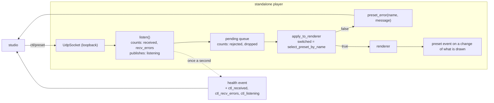

# 0198 — The control path stops failing quietly

> **Status:** done — closed 2026-09-19 at **v0.137.0**. Phases 1-5 landed as `d2117b3c`,
> `5bf159f4`, `f7e13b9d`, `7a00199d` and `5e706521`. Mode 4 review (conductor round 1):
> **no blockers, no majors, three minors, two nits.** Verified against the tree: the listener's
> three readings and the refused-selection `preset_error` ship with assertions that say what each
> done-when says, spec 0003 and `docs/configuration.md` carry the widened contract, the studio reads
> the fields three-valued, and the full workspace suite is green on the closed tree.
> [ADR-0221](../../adrs/0221-the-control-path-reports-what-it-did-not-do.md) accepted with an
> `Outcome`. Phase 4 named a candidate rather than a cause, so backlog 0219 and 0220 stay live.
> **Created:** 2026-09-19
> **Approved:** 2026-09-19 (user)
> **Owner skill(s):** dev, studio-builder
> **Related ADRs:** [0221](../../adrs/0221-the-control-path-reports-what-it-did-not-do.md) (accepted),
> [0176](../../adrs/0176-the-player-is-driven-over-osc-control-in-and-reports-on-its-standard-streams.md),
> [0193](../../adrs/0193-a-test-that-reads-the-clock-runs-alone.md)
> **Takes:** design-backlog 0219 and 0220 — the **observability half** of each. Both entries stay
> live with a dated bullet naming the half, until the cause is named.

## TL;DR

Two intermittent control-path failures have been reproduced and neither can be diagnosed, because
the listener reports what it did and nothing about what it did not: a swallowed receive error looks
like an idle socket, and a `ctl/preset` the renderer declines to select produces no event at all.
This plan counts what the listener receives and fails to receive, publishes whether it is still
listening, reports a refused selection as a `preset_error`, and then runs the reproduction again
with those readings in hand. The first visible behaviour is a studio that says *why* a preset click
did nothing.

## Context & problem

`a_preset_datagram_selects_by_name` failed 3 times in 79 back-to-back loaded runs on 2026-09-14, and
again once in a conductor gate on 2026-09-15, costing a park, a resume and an 11.4-minute re-run.
Its report is as complete as the current surface allows — *"nothing reached the listener within 5s
… listener counters: rejected 0, dropped 0"* — and it still cannot say whether the listener thread
was alive or whether `recv_from` was failing, because `listen` swallows every receive error with a
bare `continue` and counts nothing (backlog 0219).

`every_system_is_reported_by_the_key_the_schema_labels_its_roster_with` stalled twice in the same 79
runs, both times at ask 9 of 14, `emitter`. The child kept drawing at 30 fps and answered the ping
sent behind the ask; no `roster`, `preset` or `preset_error` followed in two minutes. Four candidates
remain undistinguished, and one of them — `select_preset_by_name` returning `false` — is silent by
construction: `apply_to_renderer` records `applied.switched` and nothing reports a `false` (backlog
0220).

The gate does not retry a red (ADR-0193), so while these are open every full suite carries that
chance; and the same listener is what the studio's library click goes through.

## Decision

Per [ADR-0221](../../adrs/0221-the-control-path-reports-what-it-did-not-do.md), the listener counts
received datagrams and non-timeout receive errors and publishes whether it is still listening, as
additive `health` fields; a refused selection is reported as a `preset_error` naming what was asked
for. We rejected logging the receive error (a failing socket floods a show machine) and
test-only instrumentation (both failures live in the shipped binary, and the studio needs the same
signal). The plan then re-runs the reproduction **with a stop condition**: if the load that produced
three failures in 79 runs produces none with the counters in place, the plan records the readings and
stops rather than inventing a fix for a defect it has not seen.

## Architecture diagram

## Implementation phases

### Phase 1 — The listener counts what it receives and what it fails to receive
- **Owner skill:** dev
- **What:** `listen` counts every datagram received and, separately, every receive error that is not
  the ordinary read timeout; the listener publishes whether it is still running, so a stopped thread
  is distinguishable from a quiet one. `Control` exposes all three, beside `rejected`, `dropped` and
  `refused`.
- **Files touched:** `standalone/src/control.rs`
- **Would break real-time if:** the counters were anything but relaxed atomics on the listener
  thread — no lock, no allocation, no I/O in the receive loop, and nothing new on the audio path,
  which this file does not touch at all.
- **Done when:** a bound `Control` that has received one datagram reports one received; a listener
  whose socket is closed under it reports a non-timeout receive error and stops reporting itself as
  listening; a listener that has only timed out reports zero errors and is still listening; and the
  ordinary timeout path adds nothing to either counter, at any rate of timeouts.

### Phase 2 — A refused selection is reported
- **Owner skill:** dev
- **What:** a `ctl/preset` whose `select_preset_by_name` returns `false` emits a `preset_error`
  carrying the asked-for name and a message saying the selection did not take. The three new listener
  readings join the `health` event as additive fields under the same protocol version. Spec 0003
  records both, including the note that `preset_error`'s `file` now also carries a name that may not
  be a file.
- **Files touched:** `standalone/src/show.rs`, `standalone/src/control.rs`,
  `docs/specs/0003-studio-control-protocol.md`, `docs/configuration.md`
- **Done when:** a `ctl/preset` naming a preset that is not in the roster produces one
  `preset_error` naming it, where today it produces nothing; a `ctl/preset` naming one that is in the
  roster produces none; `health` carries the three new fields every second and an older consumer
  reading only the documented fields is unaffected; and spec 0003's roster table and invariants say
  what each new field means.

### Phase 3 — The two tests read the new evidence
- **Owner skill:** dev
- **What:** the delivery failure in `control_loopback.rs` and the walk failure in `stream_show.rs`
  print the new readings — received, receive errors, still listening — beside the counters they
  already print, so a failure states which of the candidates it was. The `Ask::ping` doc comment's
  overclaim, corrected in backlog 0220's own body on 2026-09-14 and still in the source, is
  corrected: a `pong` proves the *ping* was drained, not the ask in front of it.
- **Files touched:** `standalone/tests/control_loopback.rs`, `standalone/tests/stream_show.rs`
- **Done when:** a deliberately broken listener makes each of the two tests fail with a report that
  names which reading convicted it; a passing run prints nothing new; and no test asserts a timing
  figure that is not a property (ADR-0071) — the new readings are counts and liveness, not durations.

### Phase 4 — The reproduction runs again, with a stop condition
- **Owner skill:** dev
- **What:** re-run the 2026-09-14 reproduction — the `stream_show` and `control_loopback` binaries
  back to back under a second nextest process driving `golden`, `attractor` and
  `reaction_diffusion` — enough times to expect the observed rate, and record every failure's
  readings in the implementation log.
- **Files touched:** none necessarily; a committed runner only if the phase finds one worth keeping.
- **Done when:** one of two outcomes is recorded, and which one it was is stated plainly in the log.
  **Either** a failure reproduces and its readings name the candidate — a lost datagram (received
  did not move), a dead listener (listening is false), a failing socket (receive errors moved) or a
  refused selection (a `preset_error` now appears) — in which case the log names it and the fix is a
  **new plan**, because the repair for each candidate is a different piece of work. **Or** the load
  produces no failure in at least as many runs as the original observation, in which case the log
  records the run count and the readings, both entries stay live with that evidence, and the plan
  stops here. Inventing a fix for an unobserved cause is not an outcome of this plan.

### Phase 5 — The studio carries the new readings
- **Owner skill:** studio-builder
- **What:** the studio's shared protocol types accept the three new `health` fields, and a player
  that reports it has stopped listening is surfaced where the operator already looks for the
  connection's state rather than left to be inferred from clicks that do nothing.
- **Files touched:** `studio/shared/protocol.ts`, the studio's status surface and their tests
- **Done when:** the studio parses a `health` event carrying the new fields and one without them,
  without error; a player reporting that it is no longer listening is visibly distinguishable in the
  studio from one that is idle; and the studio's own tests cover both events.

## Risks & open questions

- **Phase 4 may find nothing.** That is an outcome, not a failure, and the phase's done-when says so
  explicitly. The instrumentation still ships and the next occurrence — in a conductor gate, or on a
  user's machine — reports itself.
- **The counters cannot name a datagram** (ADR-0221's first Negative). If the readings say "received
  did not move", that convicts the send-to-queue path and still does not say where the datagram went;
  the next plan may need per-datagram sequencing, which is a protocol change.
- **Phase 5 needs `studio/node_modules` in the lane.** Under the conductor that is exactly backlog
  0242, which [Plan 0196](0196-the-gate-roster-stops-drifting.md) Phase 4 repairs. Run this plan
  after 0196, or the operator installs in the lane by hand before Phase 5.
- **`health` is emitted once a second for the life of a run**, so the new fields are a permanent cost
  on the contract. Additive under the same `v`, per spec 0003's own rule.

## What this plan does NOT do

- It does not fix either failure. It buys the evidence that says which failure it is — see Phase 4's
  stop condition, and the `**Takes:**` header, which is why neither entry is in a `Closes:` line.
- It does not add per-datagram sequencing, retries on the control path, or a liveness address on the
  protocol. A retry would bury a flake, which ADR-0193 forbids for exactly this defect.
- It does not touch the audio thread, the ring or the analyzer — spec 0003's invariant, and nothing
  here goes near them.

## Implementation log

**Lane:** `plan-0198-the-control-path-stops-failing-quietly` in
`C:\Users\Igor Konovalov\WORK\rlx-plan-0198`

| phase | owner | state | commit |
|---|---|---|---|
| 1 — The listener counts what it receives | dev | done | d2117b3c |
| 2 — A refused selection is reported | dev | done | 5bf159f4 |
| 3 — The two tests read the new evidence | dev | done | f7e13b9d |
| 4 — The reproduction runs again, with a stop condition | dev | done | 7a00199d |
| 5 — The studio carries the new readings | studio-builder | done | 5e706521 |

### Notes

- **Phase 1 deviates from ADR-0221's Neutral point in one respect, to satisfy the phase's own
  done-when.** The ADR says the receive loop "still continues on a failed receive"; the done-when
  requires that a listener whose socket is closed under it "stops reporting itself as listening",
  which a loop that never leaves cannot do. The listener therefore counts the failure and continues,
  and leaves only after `RECV_ERROR_BUDGET` = 64 failures **with no datagram and no read timeout
  between any two of them** — a run any transient refusal breaks and a gone socket reaches in
  microseconds. A test asserts each half. It also ends the unbounded spin the bare `continue` left
  on a dead socket.
- **Phase 1 adds a private `Receive` trait over the one `recv_from` call**, with `UdpSocket` as the
  only shipped implementation. The socket is moved into the listener thread and no handle to it
  survives outside, so the failure policy above has no test at all without a receiver a test can
  script.
- **`Control::listening` is set true at `bind`, before the thread runs**, rather than only at the
  top of `listen`: a caller reading it between the spawn and the thread's first instruction would
  otherwise be told the listener had gone.
- **Phase 2 touched two files the phase's `Files touched` does not list.**
  `standalone/src/events.rs` holds the `Event::Health` variant, so the three new fields cannot be
  added anywhere else; `standalone/tests/stream_show.rs` holds the only harness that spawns the
  player and reads its event stream, which is where the phase's *"produces one `preset_error`
  naming it … produces none"* is a claim rather than an inference — `Events` writes to standard
  error and offers nothing to read back, so the in-process seam can only assert the decision
  (`Applied::unresolved_preset`), which it does in `control.rs`.
- **Phase 2 also rewrote one doc comment in `control.rs` that Phase 1 left**, because
  `scripts/check-comment-hygiene.mjs` reads `no longer` as plan-relative narration; the sentence
  now states the same fact as a property.
- **Phase 3's *"a deliberately broken listener makes each of the two tests fail with a report that
  names which reading convicted it"* is asserted over the readings a break leaves, not over a
  broken listener.** Neither test can break one: `control_loopback.rs` sends to a socket owned by a
  thread it does not hold a handle to, and `stream_show.rs` drives a separate process. Each file
  therefore grew a pure function from readings to a one-sentence verdict — `verdict` over a live
  `Control`, `listener_verdict` over two `health` lines — and a test that drives each of the four
  candidates plus the two cases neither covers (a listener that failed its way out of the loop, and
  no `health` line at all). The failure paths call the same function, so what a failing run prints
  is what those tests assert.
- **Phase 5 makes the three `health` fields optional in the studio's schema**, where spec 0003's
  roster table declares them like every other field: the phase's done-when requires a line without
  them to parse, and a required field would drop that whole line — its frame times and preview
  totals with it. The surface therefore reads three values, not two — listening, stopped, and a
  player that does not say — and only an explicit `false` raises the alarm.
- **Phase 5's parse test landed in `studio/electron/player/events.test.ts`**, which the phase's
  `Files touched` names only as "their tests": that file holds the reader every event line is
  validated by, and the two `health` lines are fixtures of the shape `standalone/src/events.rs`
  writes.

#### Phase 4 — what the reproduction recorded

**Outcome: the first of the two. A failure reproduced, twice, and both times the readings named the
same candidate — a lost datagram, `received` did not move.** Per the phase's own done-when the fix
is a new plan, and this plan stops here.

**The run.** 19 runs on 2026-09-19, each one `cargo nextest run -p standalone -E 'binary(stream_show)
+ binary(control_loopback)' --no-fail-fast`, back to back, beside a second `cargo nextest run
-p rlx-core -E 'binary(golden) + binary(attractor) + binary(reaction_diffusion)'` looping for the
whole period. Driven from a scratch runner under `target/`, **not committed**: the two commands
above are the whole of it, and a new `.mjs` under `scripts/` would be one nothing runs. 2 of the 19
failed — a higher rate than the 3-in-79 of 2026-09-14, and the load here was heavier, with the
player's own `health` reporting 4.1 fps and a p99 frame time of 6.4 s during the first failure.

**Run 19 — `a_preset_datagram_selects_by_name` (backlog 0219).** The report, verbatim from the new
surface:

> `received +0 since the send, recv_errors 0, listening true, rejected 0, dropped 0`
> `verdict: RECEIVED did not move, RECV_ERRORS did not move and LISTENING is true: the listener was
> reading a healthy socket and no datagram reached it, so the loss is in front of the socket`

`send_to` returned `Ok`, the listener thread was in its receive loop, the socket reported no failure,
and `recv_from` was never handed the datagram in the 10 s the test then waited. Three of the four
candidates ADR-0221 names are excluded by that line; the fourth is what is left.

**Run 2 — `every_system_is_reported_by_the_key_the_schema_labels_its_roster_with` (backlog 0220).**
Stalled at ask 2 of 14, `swarm`. `ctl_received` read 4 and stayed 4 across the three `health` lines
covering the 120 s the test waited, with `ctl_recv_errors 0` and `ctl_listening true`; the
`ctl/ping` sent **behind** the `ctl/preset` was answered. Five datagrams had been sent by then
(`hold`, ask 1's preset, ask 1's ping, ask 2's preset, ask 2's ping) and the pong proves the last of
them arrived and was drained — so four of five reached the socket and one did not. **No
`preset_error` appeared**, which retires `select_preset_by_name` returning `false` as a candidate
for this failure: that arm now reports itself and did not. The reading is the same as run 19's, one
step less tightly: the report says `no health line preceded the ask, so ctl_received (4) has no
baseline` — `Lines::wait_for` clears its record, and ask 1 resolved before a `health` line landed in
it.

**What is now excluded for both**, by evidence rather than by argument: a dead listener thread
(`ctl_listening` was true throughout), a failing socket (`ctl_recv_errors` stayed 0), a decoder
refusal or a full queue (`ctl_rejected` and `ctl_dropped` stayed 0), and — for the walk — a refused
selection (no `preset_error`). What remains is the datagram not arriving at `recv_from` at all,
which is ADR-0221's first Negative in the plan's Risks: the counters convict the path in front of
the socket and cannot say where inside it the datagram went.

### Close triggers

- **`presets/` touched:** none — no file under `presets/` is in this branch's diff.
- **Plan header `Closes:`** none — see `**Takes:**`; backlog 0219 and 0220 stay live, each with a
  dated bullet naming the half this plan took and whatever Phase 4 recorded.
- **What shipped:** feature — three listener readings and a refused-selection `preset_error` on the
  player's event stream (`standalone/src/control.rs`, `events.rs`, `show.rs`), and the studio
  surface that reads them (`studio/shared/protocol.ts`, `studio/renderer/components/Footer.tsx`).
- **Operator docs touched:** `docs/configuration.md` (the `health` line's fields) and
  `docs/specs/0003-studio-control-protocol.md` (the `health` roster row, and two invariants — the
  listener readings and the refused selection). No other operator doc moved.
- **Backlog probes (`node scripts/check-backlog-claims.mjs`):** exit 1, 1 broken —
  `docs/design-backlog.md:1462 -> 0219 present: let Ok\(\(len, _from\)\) = socket\.recv_from\(&mut
  buf\) else \{ in: standalone/src/control.rs`, which Phase 1 replaced. Advisory: 28 moved paths,
  among them 0219's `standalone/tests/control_loopback.rs` and 0220's `standalone/src/show.rs` and
  `standalone/tests/stream_show.rs`, all three touched by this plan.
- **Full suite:** owed to the conductor's pre-review gate (ADR-0207). The studio gate ran at the
  tip of Phase 5: `npm run typecheck` and `npm run lint` clean, `npm test` 282 passed across 30
  files, 0 failed, 0 skipped.
- **Outstanding `human` phases:** none — the plan declares none.

## Close review

> Mode 4, conductor round 1 (ADR-0205), 2026-09-19. A fresh session handed the plan and the lane and
> nothing an implementer wrote. Round 1 was the only round: it carried no blocker and no major, so
> it closed. Full text below; the review file is
> `tools/conductor/state/reviews/0198-round-1.md`, which is gitignored runtime record.

### Verdict

**No blockers, no majors, three minors and two nits.** Every phase is in the tree with the commit
the log names, every done-when has an assertion behind it that says what the done-when says, and the
two deviations the log discloses — the listener's failure budget and Phase 3's pure verdict
functions — are both forced by the plan's own done-whens rather than convenient. The instrumentation
is additive, spec 0003 records it, and the studio reads it three-valued rather than folding "does not
say" into "stopped". The findings are about the edges of the new diagnostic, not about whether it
works.

### Lens 1 — alignment with the plan and ADR-0221

Five phases declared, five landed, each as its own commit and in order, each carrying exactly one
in-vocabulary `**Owner skill:**` tag (`dev` x4, `studio-builder` x1) with the two lanes' runs
contiguous. The two files touched beyond a phase's declared list — `standalone/src/events.rs` in
Phase 2 and `studio/electron/player/events.test.ts` in Phase 5 — are both disclosed in the log and
both correct.

Done-whens, opened and read rather than taken on the log's word:

- *One datagram is one `received`* — `a_delivered_datagram_is_counted_as_received` binds a real
  `Control`, sends one datagram, waits on the queue rather than on the count (the comment says why:
  `received` rises before the record, so waiting on the count would race it) and asserts all four
  facts including the drain.
- *A broken socket is an error and stops the liveness* —
  `a_failing_receive_is_counted_and_ends_the_listener` asserts `recv_errors == RECV_ERROR_BUDGET`,
  `received == 0`, `!listening` **and** `!stop`, that last one being what makes it a statement about
  the socket rather than about shutdown.
- *The timeout path counts nothing at any rate* —
  `the_timeout_path_counts_nothing_and_stays_listening` runs both `WouldBlock` and `TimedOut` ten
  thousand times, far past the 64 budget, and checks liveness mid-run from a second thread.
  `a_transient_failure_does_not_end_the_listener` holds the other half. Together they are the
  property the deviation note claims.
- *A refused `ctl/preset` produces exactly one `preset_error` naming it, an accepted one none* —
  asserted in `stream_show.rs` with a **count**, not mere presence, and separately that the preset
  which landed raised none. The in-process half,
  `a_refused_preset_selection_carries_the_name_back_out`, covers all three arms including the one the
  done-when does not name: a frame carrying no `ctl/preset` at all.
- *`health` carries the three fields and an older consumer is unaffected* — the new test asserts the
  three new fragments **and** the exact rendered text of six older ones, which is the additivity
  claim rather than a paraphrase of it, with `"ctl_listening":false` pinned as a JSON boolean.
- *A broken listener names the reading that convicts it* — satisfied over the readings a break
  leaves rather than over a broken listener, which the log discloses and which is forced: neither
  test can break a socket it does not hold. The failure paths call the same `verdict` /
  `listener_verdict` the tests assert over, so the substitution is sound.
- *No test asserts a timing figure that is not a property* — confirmed; every new assertion is over a
  count, a boolean or a substring (ADR-0071).
- *Phase 4* — one of the two outcomes is recorded and named plainly, the readings transcribed
  verbatim, the run described precisely enough to repeat. No runner committed, which the phase
  permits.
- *Phase 5* — both `health` shapes parse in one push with the older line keeping its `fps`, and the
  three-valued distinction is held in four cases including the one that matters most: a player that
  bound no socket at all must not raise the alarm.

**Full suite (ADR-0207).** The wrapper did not re-run it; it printed the ledger record, which is
this lens's evidence: `tree 357348c is green in the suite ledger, run by gate 0198-pre-review at
2026-09-19T18:36:03.015Z: 2034 tests run: 2034 passed (12 slow), 7 skipped`. `git rev-parse
HEAD^{tree}` on the reviewed tip was that same tree, so the record covers it, and the log's
`**Full suite:** owed to the conductor's pre-review gate` is correct in this mode rather than a
missing run. `RUSTDOCFLAGS="-D warnings" cargo doc --workspace --no-deps` is clean on the same tree.

### Lens 2 — layering, coupling, real-time safety

`core/` is not in the diff at all, so the source-agnostic rule is not in play. Nothing added is
reachable from the audio callback. The receive loop still allocates nothing: a stack buffer, two
relaxed `fetch_add`s, a relaxed `AtomicBool` behind an RAII guard, and the one pre-existing
uncontended mutex. The relaxed ordering is justified in the field's own doc comment and is true of
every consumer in the tree. The `Listening` guard is the right shape — a pair of stores would leave
the flag true on an unwind — and `bind` setting it true before the spawn closes the window a caller
would otherwise read as a dead listener; both are commented. The C ABI is untouched. The control
protocol widened, and widened in the open: three additive `health` fields under the same `v` plus one
new `preset_error` case, with spec 0003's roster table, two new invariants and one amended WHEN/THEN
carrying it and ADR-0221 behind it. No studio-side shim: the studio reads what the player sends, and
`controlReading` is a pure function exported beside its component rather than logic smuggled into
JSX. `apply_to_renderer` keeps the decision and hands it out rather than reaching for the event
stream, which is what lets the seam be asserted in process.

### Lens 3 — docs, diagrams, release bookkeeping

Spec 0003 and `docs/configuration.md` both updated, accurately and in both halves. No other operator
doc is owed: the new arm and the new fields exist only on the `--events` stream, and no hotkey, menu
row, console line, CLI flag, config key or preset surface moved. `presets/` untouched, so no
curation sweep and no stale-workaround grep — this plan fixed no engine defect to be stale against.
`check-doc-links`, `check-index-rows`, `toc --check`, `check-comment-hygiene`, `check-reader-prose`,
`check-system-counts` and `check-translations` all green. The translation advisory carries one row,
`packaging/foobar/READ-ME-FIRST.ru.md` against a source that has moved to `d6e275e6db`; it is
unrelated to this plan and is not a second consecutive stale close for that page. The backlog probes
exit 1 on one break, 0219's `present:` naming the swallowed `recv_from` that Phase 1 removed — a
probe written to go red **on delivery**, so the break is the entry's own success, repaired at this
close. Version bump owed and taken: **minor**, a feature plan.

### Lens 4 — correctness and determinism

Boundary validation unchanged; no DSP, no wall-clock in analysis, no unseeded randomness. The one
clock read added is a delivery deadline in a test that already carries its
`clippy::disallowed_methods` escape with a stated reason. No `unwrap()` or `expect()` added on any
per-frame or per-datagram path. No aspect ratio in the diff. No frozen numeric assertion:
`RECV_ERROR_BUDGET` is asserted against the constant itself rather than against `64` written out, so
the test states the property.

**The "two sources that agree on the configuration we develop at" question is asked and answered
well in one place, and finds a gap in another.** "There is no listener" is derivable from both
`hello`'s `control: null` and `health`'s `ctl_listening: false`, and the two agree everywhere this
project runs. The studio does not collapse them: `controlReading` reads `hello.control` first, and a
test pins exactly the configuration where the two would disagree in meaning. That is this lens's
habit, done unprompted. The receive loop is where the same question finds something — see M2.

### Lens 5 — design integrity

Dependency direction unchanged. Of the three seams, the C ABI and the `Scene` trait are untouched
and the control protocol widened by the prescribed route — an ADR and a spec edit in the same range.
`report_health` reads six one-word accessors off `Control` rather than reaching into `Shared`, and
the rewrite to a uniform `control.map_or(0, Control::rejected)` shape is strictly better on that
axis. Adding a reading cost one field, one accessor, one line and one column, with no branch
anywhere learning about it. The private `Receive` trait is one method with one shipped
implementation and does not leak into `Control`'s public surface, so the shipped API is unchanged by
the test seam. No new hot-path directory, so Plan 0002's guard scan set needs no extension.

### Findings

**M1 (minor) — `standalone/tests/control_loopback.rs:186`: the `received` baseline is taken after
the send, so the verdict can say "no datagram reached it" about one that did.** `expect_delivery`
reads `let before = control.received();` as its first statement, but every caller sends first. The
listener runs on a thread the test does not schedule, so a datagram counted between `send_to`
returning and that read is invisible to `arrived = received().saturating_sub(before)` — while the
field's doc comment says "since the **send**" and the panic prints "received +N since the send".
Under the concurrent load this test flakes under, a preemption in that window plus a record that
then fails (the poisoned-mutex branch counts a `dropped`) makes `verdict` return *"RECEIVED did not
move ... the loss is in front of the socket"*, naming the one candidate that is excluded. The
printed line above it still shows the contradicting `dropped`, so the evidence is recoverable, but
the sentence is wrong. Phase 4's own record is not invalidated: run 19 reported `rejected 0,
dropped 0` beside `received +0`, which rules out the arrived-then-lost path the stale baseline could
hide. Fix: take the baseline before the send, as the sibling already does — `Ask::now` captures
`health_before` ahead of `socket.send_to`. **Left open**; it is code, not prose.

**M2 (minor) — `standalone/src/control.rs:556`: on Windows an over-long datagram now counts as a
receive error, and sixty-four of them end the listener, against spec 0003's own invariant.** The new
`Err(_)` arm counts every non-timeout receive failure and leaves after `RECV_ERROR_BUDGET`
consecutive ones. On Windows a `recvfrom` whose datagram exceeds the buffer fails with `WSAEMSGSIZE`
rather than truncating, so a datagram over `RECV_BUF` takes that arm; on Unix it truncates, the
decoder refuses the fragment, and `ctl_rejected` rises as the spec says. Spec 0003 reads *"WHEN a
truncated, **over-long** or mistyped datagram arrives THEN it is refused and counted, the queue is
unchanged, and the run continues"* — on Windows it is now counted as `ctl_recv_errors`, and a
sustained burst ends the listener for the rest of the run. Nothing probes it on either platform:
`a_malformed_datagram_is_counted_and_moves_nothing` sends two mistyped datagrams and no over-long
one, so the word "over-long" in the invariant has no test behind it. The likelier consequence than
the burst is the diagnostic: one over-long datagram moves `ctl_recv_errors`, and `verdict` then
reports *"the socket is failing receives"* when the socket is healthy and someone sent junk. Not a
major — nothing in this system emits an over-long datagram, the pre-existing bare `continue` was
already non-conforming for this input on Windows, and the new failure at least reports itself
through `ctl_listening: false` where before it was silent. Fix: give the platform's message-size
error its own arm as a refusal, and give the spec's "over-long" clause a test. **Left open**; the
followup plan Phase 4 calls for should carry it.

**M3 (minor) — `docs/adrs/0221-the-control-path-reports-what-it-did-not-do.md`: the ADR's body is
falsified in two places by the implementation it authorised.** The second Negative says *"Two more
fields on `health`, forever"*; three shipped, as the ADR's own Decision one section above requires.
The Neutral says *"the loop still continues on a failed receive, because there is nothing else it
can do"*; the implementation counts, continues, and leaves after `RECV_ERROR_BUDGET` consecutive
failures — which Phase 1's done-when **required**, so the plan and the ADR disagreed before a line
was written and the plan won. Accepted at this close with a dated `Outcome` recording both, per the
ADR-0054 and ADR-0074 precedent, rather than by editing an accepted body. **Repaired at the close.**

**N1 (nit) — `standalone/tests/control_loopback.rs:210`: the delivery report mixes a delta and two
per-process totals without saying so.** `received` prints as `+N since the send` while `rejected`
and `dropped` print bare, and those two are totals across every datagram the test sent before this
one — which is the stated reason `arrived` is a delta, not carried into its neighbours. In every
recorded failure both are 0, so nothing has been misread yet. One word each would fix it. **Left
open** rather than repaired here, because the test named
`each_broken_listener_is_named_by_the_reading_that_convicts_it` asserts over `verdict`'s text, and a
close does not touch what a test asserts.

**N2 (nit) — this log outweighs the contract it reports on.** 123 lines of `## Implementation log`
against 69 lines of `## Implementation phases`. Forty-three of those are `#### Phase 4 — what the
reproduction recorded`, which the phase's own done-when commissions into the log, so this is the
rule meeting a plan that deliberately made the log a deliverable; even discounting it the log is
marginally over. **Left open**: trimming it would delete the evidence Phase 4 was run to produce,
and that evidence is the input to the followup plan.

### Findings from earlier rounds

None — round 1 was the only round.

## Followups (after this lands)

- Whatever Phase 4 names, as its own plan. Phase 4 named a **lost datagram in front of the socket**
  in both reproductions, which is the one candidate the counters cannot localise further; the next
  plan is the one that decides whether per-datagram sequencing is worth the protocol change
  ADR-0221's first Negative declined to make. **M2 above belongs to that plan too.**
