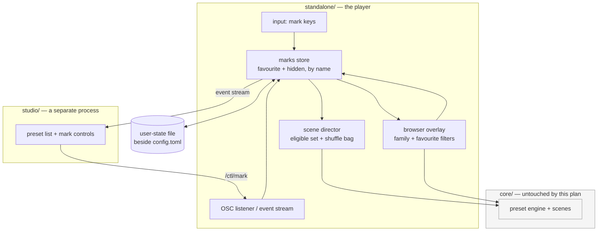

# 0205 — The library becomes navigable

> **Status:** done — closed 2026-09-20. Six phases in six commits (`c3ed56cb`, `eaeca3bc`,
> `74b1e5c5`, `fe2b682f`, `5220ce99`, `e5f95955`); Mode 4 round 1: **no blockers, no majors, six
> minors**, four repaired in `68aa54b8`. Verified: the full workspace suite green in the conductor's
> ledger (2069 passed, 7 skipped), `cargo doc -D warnings`, `fmt`, `clippy --workspace
> --all-targets`, the studio's typecheck/lint/tests, and the Node gate roster.
> **Created:** 2026-09-19
> **Approved:** 2026-09-19 (user)
> **Amended:** 2026-09-19 — four navigation affordances added after a second UX pass, all in the
> owner's answer: a previous-preset key (Phase 2), and number-key jumps, a dwell countdown and
> A/B compare as a new Phase 4. The thumbnail browser was considered and deliberately left to its
> own plan, after this one — see `## Followups`.
> **Owner skill(s):** dev, studio-builder
> **Related ADRs:** [0228](../../adrs/0228-a-preset-mark-is-user-state-keyed-by-name-in-its-own-file.md)
> (accepted), [0229](../../adrs/0229-the-studio-marks-a-preset-over-the-control-protocol.md)
> (accepted), [0176](../../adrs/0176-the-player-is-driven-over-osc-control-in-and-reports-on-its-standard-streams.md),
> [0022](../../adrs/0022-build-time-preset-embedding.md), [0027](../../adrs/0027-scene-rotation-constant-default-calmer-cadence.md)

## TL;DR

The shipped set is 114 presets and the app offers one flat roster to walk it. This plan adds two
marks — **favourite** and **hidden** — persisted by preset name in the standalone's own user state,
then spends them: auto-rotate can draw from favourites alone, hidden presets stop appearing, the
browser filters by family and by favourite, and rotation stops repeating itself. Four navigation
affordances ride along: stepping **backwards**, jumping to a favourite by **number**, seeing
**when** the next rotation lands, and **A/B** flipping between two presets to compare them. The
studio gets the same marks over the control protocol. The first visible behaviour is marking a
preset with one
key and finding it still marked after a restart.

## Context & problem

**The roster outgrew the way it is presented.** [`docs/running.md`](../../running.md) describes the
browser accurately — as many columns as the window fits, arrows walking and wrapping, type to
filter, `Enter` to select — and that design was sized for a library a fraction of the current one.
At 114 presets across fourteen filename families, finding a specific look means remembering its
name well enough to type it, and finding *a good one* means pressing `Space` until something lands.

**Auto-rotate draws from everything, including what you never want to see.** `[rotate]`'s policy
([ADR-0027](../../adrs/0027-scene-rotation-constant-default-calmer-cadence.md)) is a dwell window and
a track-change nudge; the *set* it draws from is the whole library, with no way to narrow it and no
memory of what it just showed.

**There is no way to record an opinion.** This is the half that reaches past navigation:
[backlog 0256](../../design-backlog.md) records that nothing in this repository asks whether a shipped
preset is any good, that the `distinctness` report covers nine of fourteen families, and that the
route to a curation mechanism runs through a human verdict *first*. A `hidden` mark made in passing
is that verdict, captured when it forms.

**What is already decided, and is therefore not this plan's to revisit.** Preset identity is the
**name** — [spec 0001](../../specs/0001-c-abi.md) settled that for persisted choices. The shipped set
is embedded and read-only ([ADR-0022](../../adrs/0022-build-time-preset-embedding.md)), so a mark
cannot live in a `.toml`. And the studio is a separate process that reaches the player only over
the control protocol
([ADR-0176](../../adrs/0176-the-player-is-driven-over-osc-control-in-and-reports-on-its-standard-streams.md)).
The two ADRs beside this plan turn those into a shape.

## Decision

We will add **two name-keyed marks in the standalone's own user-state file**
([ADR-0228](../../adrs/0228-a-preset-mark-is-user-state-keyed-by-name-in-its-own-file.md)), spend them
in the director and the browser, and expose them to the studio through **one new control message**
([ADR-0229](../../adrs/0229-the-studio-marks-a-preset-over-the-control-protocol.md)) with the player
as the only writer.

Rejected during the interview: marks in the preset file (the shipped set is read-only, and a
personal opinion is not content that ships); marks in `config.toml` (a second writer on the
settings menu's file, for tidiness alone); marks keyed by index (spec 0001 already refused it); a
1–5 rating (it asks for a judgement that mostly does not exist, and every threshold on it becomes a
constant to defend); and the studio reading the marks file directly (two writers, and the exact
shim [ADR-0177](../../adrs/0177-a-fourth-skill-lane-builds-the-studio.md) forbids).

**`hidden` is not retirement.** A hidden preset still ships, still passes the gates, still appears
in `shot --presets presets --report`. Deleting the file at cohort cadence is
[ADR-0089](../../adrs/0089-the-library-renews-by-replacement-cohorts.md)'s business and stays there.

## Architecture diagram



The player is the only thing that touches the file — that edge exists once, and ADR-0229 is the
reason.

## Implementation phases

Phases 1–5 are `dev` and run contiguously; phase 6 is `studio-builder` and hands off per
[ADR-0188](../../adrs/0188-the-two-implementer-lanes-hand-off-automatically.md).

### Phase 1 — The marks store, and one key that proves it

- **Owner skill:** dev
- **What:** The name-keyed store, its file, and a binding that marks the preset on screen. A
  walking skeleton that is useful the moment it lands.
- **Files touched:** a new `standalone/src/marks.rs`, `standalone/src/input.rs`,
  `standalone/src/config.rs` (path resolution beside `config.toml`), `docs/configuration.md`,
  `docs/running.md`.
- **Done when:** marking the current preset favourite, restarting the app, and finding it still
  favourite. The store round-trips through the file; a file that is absent, empty or malformed
  yields empty mark sets and a diagnostic line rather than a failure to start, because user state
  that can refuse to launch the app is worse than user state that is lost. A mark on a name no
  longer in the library is retained and inert (ADR-0228's stated cost — it is not pruned).

### Phase 2 — Rotation spends the marks

- **Owner skill:** dev
- **What:** The director draws from an eligible set rather than the whole library, and stops
  repeating itself.
- **Files touched:** `standalone/src/director.rs`, `standalone/src/director/tests.rs`,
  `standalone/src/config.rs` (a `[rotate]` source key), `docs/configuration.md`,
  `docs/running.md`.
- **Done when:** three behaviours hold, each stated as a property rather than a threshold:
  - **Hidden presets never appear in auto-rotate**, in either rotation source.
  - **Favourites-only is a hard filter with a fallback**: with the source set to favourites,
    rotation draws only from favourites; when the favourite set is empty it draws from the whole
    eligible set instead. It never holds one preset forever, because a mode that looks identical to
    a hang is a mode nobody can debug from the window.
  - **Auto-rotate does not repeat while unseen presets remain.** A shuffled traversal of the
    eligible set, reshuffled when exhausted, with the constraint that a preset never ends one cycle
    and begins the next. Note this is deliberately *not* a remembered-history window: a window
    needs a length somebody has to defend, and the permutation property needs no constant at all.
    The eligible set changes underfoot when a mark is toggled mid-show, so the traversal must
    tolerate its set growing and shrinking between draws.
  - **The roster can be stepped backwards from the keyboard.** `console::previous_index` already
    exists and is tested; it is reachable only from the console's clickable transport strip, so
    overshooting a good preset with `Space` means walking the whole library to return. Give it a
    key. Under the shuffled traversal above, "previous" means *the preset actually shown before
    this one*, not an index one lower — the two stopped being the same thing the moment rotation
    stopped being sequential, and the traversal is what has to answer it.

### Phase 3 — The browser narrows

- **Owner skill:** dev
- **What:** The four browser improvements, all in the existing overlay.
- **Files touched:** `standalone/src/overlay.rs`, `standalone/src/overlay/tests.rs`,
  `docs/running.md`.
- **Done when:** the browser can be narrowed to **one family** and to **favourites only**, each
  toggling independently of the type-to-filter text; every row **names its system**; hidden presets
  are absent from the default view and reachable through an explicit "show hidden" state, because a
  mark you cannot find again is a mark you cannot undo. Marking works on the highlighted row, not
  only on the preset being rendered.
  - **The binding constraint, which is the real design question here.** Letters are consumed as
    filter characters while the browser is open — `docs/running.md` already records this for `s` —
    and the app binds **no modifier combinations anywhere today**, so `Ctrl`-anything is new input
    plumbing rather than a free choice. The plan's proposal is **`F1` favourite, `F2` hide**,
    working identically inside and outside the browser: function keys are never filter input, `F3`
    is already a toggle so the row is established, and no modifier handling is needed. `F1` is
    conventionally help and there is no help screen to collide with. **`dev` may counter-propose**
    — what is not negotiable is that the same key works in both contexts.

### Phase 4 — The keys and the HUD carry it

- **Owner skill:** dev
- **What:** Three affordances that spend Phase 1–2's state from the keyboard and the HUD, and one
  that makes two presets comparable.
- **Files touched:** `standalone/src/input.rs`, `standalone/src/hud.rs`,
  `standalone/src/director.rs`, `docs/running.md`, `docs/configuration.md`.
- **Done when:**
  - **A number key lands on a favourite.** `1`–`9` select the first nine favourites in the
    browser's own order, so the mapping is the one the eye already learned rather than a second
    hidden ordering. Fewer than nine favourites means the unfilled keys do nothing — never wrap,
    because a key that means a different preset depending on how many are marked is worse than a
    key that means nothing. Digits are filter characters while the browser is open, exactly as
    letters are; the binding applies outside it.
  - **The HUD says when the next rotation lands**, whenever auto-rotate is on, and says nothing
    when it is off. The console already names *what* comes next and the show window names neither,
    which is the asymmetry this closes. It follows the existing `[hud]` precedent — a settings row
    and a `config.toml` key, off-switchable like `preset_name` and `now_playing`.
  - **A/B compare flips between two presets.** One key stashes the preset on screen as the B side;
    pressing it again swaps the two, so a look can be held against another without hunting for it.
    The flip **dissolves like any other change** — `docs/running.md` already fixes the behaviour
    for a switch arriving mid-dissolve (*"finishes the one in flight and starts the new one, so you
    always land where you asked"*), so a fast flip is defined rather than novel, and this phase
    does not invent a second transition path for it. The B side is session state and is not
    persisted: it is a comparison, not a mark.
  - **The HUD shows whether the current preset is marked.** Marking is worthless if you cannot see
    what is marked without opening the browser.

### Phase 5 — The protocol carries a mark

- **Owner skill:** dev
- **What:** The player side of ADR-0229 — a `/ctl/mark` control message and marks on the event
  stream.
- **Files touched:** `standalone/src/osc.rs` (or its module), `standalone/src/control.rs`,
  `docs/specs/0003-studio-control-protocol.md`, `docs/configuration.md`.
- **Done when:** a `/ctl/mark` datagram naming a preset, a mark and a state applies exactly as the
  hotkey does and persists identically; the player reports the mark sets on its event stream on
  connect **and** whenever they change, including changes it made itself from a hotkey — the studio
  must learn about a mark it did not set, which is ADR-0229's stated cost and the thing a
  request/reply shape would miss. A mark naming an unknown preset is refused with a reported
  reason rather than silently stored, matching the observability direction
  [Plan 0198](0198-the-control-path-stops-failing-quietly.md) takes for the rest of the control
  path. The spec is updated in this phase, not at the close — it is the contract, and
  `studio-builder` reads it next.

### Phase 6 — The studio marks and filters

- **Owner skill:** studio-builder
- **What:** The studio side — mark controls and a favourites filter on its preset list.
- **Files touched:** `studio/` (renderer components, the shared protocol types, its tests).
- **Done when:** a preset can be marked from the studio and the mark appears in the player's own
  HUD and browser without a restart; a mark made in the player appears in the studio without one;
  and the studio's preset list can be narrowed to favourites. **The studio opens no marks file** —
  ADR-0229 — and a studio with no player attached shows no marks rather than an empty set, because
  those are different states and only one of them is true.

## Data shapes

```rust
// illustrative — not the final interface

/// The whole of the user's opinion about the library. Keyed by preset NAME,
/// because an index is snapshot-scoped (spec 0001) and the set is embedded
/// read-only (ADR-0022).
pub struct Marks {
    favourite: BTreeSet<String>,
    hidden: BTreeSet<String>,
}

/// Where auto-rotate draws from. `Hidden` is excluded from both.
pub enum RotateSource {
    All,
    Favourites,  // falls back to All when the favourite set is empty
}
```

## Risks & open questions

- **The binding collision is the most likely thing to need rework.** Phase 3 states the constraint
  and proposes `F1`/`F2`; if `dev` finds a reason both keys are wrong, the requirement (one key,
  both contexts, no new modifier plumbing) is what must survive, not the choice.
- **The keymap is filling up, and Phase 4 fills it further.** This plan adds marking, a previous
  step, nine number keys and an A/B flip to a map that already binds `Space`, `A`, `Tab`, `S`, `C`,
  `F`, `D`, `Esc`, `F3`, `[` and `]`. Every one of them competes with the browser's type-to-filter,
  which consumes letters and digits alike. If Phase 4 cannot find keys that satisfy Phase 3's rule
  — one binding, both contexts, no new modifier plumbing — then that rule is what needs revisiting
  in the open, not the bindings quietly split into two sets.
- **The shuffle bag meets a mutable set.** Toggling `hidden` on the preset currently showing, or
  favouriting mid-cycle, changes the traversal's universe between draws. The property in Phase 2 is
  stated to hold across that, which is the part most likely to be got subtly wrong and least likely
  to be noticed.
- **`hidden` could be used to paper over a broken preset.** The mark makes an ugly preset
  invisible without fixing or retiring it, which is exactly its purpose and also exactly how a
  known-bad preset survives a curation pass. Mitigated only by ADR-0228's rule that the gates never
  read marks, so nothing red can be hidden green — and by the `hidden` set being read as evidence
  rather than as a conclusion.
- **Phase 5 widens a spec that was minimal on purpose.** ADR-0229 names this cost. The open
  question it leaves: if a second library-state message is ever wanted, is that a pattern or a
  smell? Not this plan's to answer, but the second one should trigger the question.
- **Nothing here prunes marks for deleted presets**, by decision. If the file becomes unwieldy that
  is a followup, not a phase.

## What this plan does NOT do

- **It does not retire, delete or curate any preset.** `hidden` is a view, not a verdict on what
  ships; [ADR-0089](../../adrs/0089-the-library-renews-by-replacement-cohorts.md) owns retirement.
- **It does not build backlog 0256's curation mechanism.** It builds the instrument that produces
  that entry's step-2 evidence, which the entry explicitly says must come first.
- **It does not touch `core` or the C ABI**, so the foobar component keeps rotating the whole set.
  Marks in the component are a separate ADR if ever wanted.
- **It does not add tags, ratings, playlists or sorting.** Two marks and two filters; a richer
  taxonomy is a different plan with a different interview.
- **It does not put pictures in the browser.** The thumbnail browser was weighed in this plan's
  second UX pass and routed to its own plan, because where a thumbnail lives — embedded against
  [NFR §4](../../nfr.md#4-size-and-dependencies)'s soft cap, or generated on first run with a
  staleness rule — is a decision with a real rejected alternative and belongs in an ADR of its
  own. See `## Followups`.
- **It does not change `[rotate]`'s dwell policy.** ADR-0027's cadence stands; only the set it
  draws from changes.
- **It does not add a help screen**, despite taking `F1`.

## Implementation log

> Written by the lane, one row per phase as its commit lands, plus the close block after the last.
> **The phases above are the contract; everything here is what happened.**

**Lane:** `plan-0205-the-library-becomes-navigable` in `C:\Users\Igor Konovalov\WORK\rlx-plan-0205`

| phase | owner | state | commit |
|---|---|---|---|
| 1 — The marks store, and one key that proves it | dev | done | c3ed56cb |
| 2 — Rotation spends the marks | dev | done | eaeca3bc |
| 3 — The browser narrows | dev | done | 74b1e5c5 |
| 4 — The keys and the HUD carry it | dev | done | fe2b682f |
| 5 — The protocol carries a mark | dev | done | 5220ce99 |
| 6 — The studio marks and filters | studio-builder | done | e5f95955 |

### Notes

- **Phase 1 touched files outside its list.** `standalone/src/marks.rs` is a **library** module for
  the reason `config` is — its round trip through a file is what the done-when asks for, and that is
  where such a test runs — and `resolve_marks_path` sits in it rather than in `config.rs`, next to
  the `APP_DIR_NAME` join it mirrors. `show.rs` owns the marks rather than the window's state,
  because Phase 2 spends them in the director and Phase 5 reports them on the event stream;
  `app_state.rs` and `stream.rs` moved only to pass the path into `Show::start`.
- **A file that is absent or empty is silent**; only one that exists and cannot be parsed prints a
  line. The done-when lists all three as yielding "empty mark sets and a diagnostic line", but an
  empty file parses to empty sets with nothing to report and an absent file is the ordinary first
  run, so a line there is permanent noise. All three are asserted not to stop the launch
  (`an_unusable_file_yields_empty_sets_rather_than_a_failure`). Phase 1 binds `F1` only; `F2` waits
  for Phase 3, where hidden presets become findable — a mark that cannot be found cannot be undone.
- **Phase 2 retired `console::next_up` and rewrote the two tests that read it** (`console.rs`,
  `console/tests.rs`, outside the phase's file list). That function *was* the "which preset does a
  rotation take" rule — the roster's successor — and the shuffled traversal replaces it, so leaving
  it would have left the console naming a preset the rotation was not about to take. Its claim is
  now `the_announced_preset_is_the_one_the_next_draw_takes` in `director/tests.rs`, and
  `the_staged_name_is_the_one_the_rotation_then_takes` still drives a real director against the set.
- **`prev` is one behaviour across three surfaces**, not two: `Backspace`, the console strip's
  `< prev` and `ctl/transport prev` all walk the trail of presets actually shown, falling back to
  `console::previous_index` when the trail is empty. Spec 0003 still described that row as "cut to
  the roster's predecessor"; the correction rides in Phase 5, which owns the spec.
- **Rotation now selects by name rather than by index** (`Show::rotate`), which is what ADR-0228's
  name-keyed identity requires of anything the marks filter. Consequence: two presets sharing a
  display name are one entry to the traversal and the second copy is unreachable from rotation.
  `rlx_core::preset::drift` already reports a contested display name, and nothing shipped has one.
- Reach beyond `director.rs` / `config.rs`: `show.rs` (the traversal's owner), `app_state.rs` and
  `input.rs` (the `Trail` split and the `Backspace` binding), `hud.rs` (the staging line reads the
  peek) and `stream.rs` (the headless path rotates through it too, so ADR-0181's invariant holds).
- **Phase 3 took the plan's proposed bindings and added three of its own.** `F1` favourite and `F2`
  hide work identically inside and outside the browser, exactly as proposed; the three narrowings
  needed keys under the same constraint, so they are `F4` favourites only, `F5` family, `F6` show
  hidden — browser-only, since none means anything outside it.
- **"Every row names its system" is drawn as the system's family** — the filename prefix
  `SystemKind::family()` returns — not the canonical key, which runs to eighteen characters
  (`reaction_diffusion`) and would need a column four wider than the name's. The family is the same
  identity in a form that fits, and the `F5` filter and the filename already use that token.
- The column budget moved with it: `NAME_CHARS` 24 -> 18 and the column 26 -> 32 characters, four
  columns at 1920x1080 against the previous five — still more than the 116-preset roster needs at 32
  rows a column. One shipped name is longer than 18 and now truncates; see `## Close review`.
- Reach beyond `overlay.rs` / `overlay/tests.rs`: the browser needs a **family per roster entry**,
  which nothing held, so `preset_dir.rs` returns the families of the set it installs and `show.rs`
  keeps them beside the roster, falling back to the embedded set's when a load installed nothing.
  `app_state.rs` builds the rows, `input.rs` decodes the three keys, `hud.rs` draws the row and the
  header. No core change: `SystemKind::family()` was already public.
- **The countdown reports the hard cap, not the nudged one.** `Director::remaining_secs` answers
  `max_dwell - dwell`, so a drop or a track boundary can land the change sooner than the line says.
  The alternative — counting down to this frame's nudged cap — is a function of the audio arriving
  now, so it would jump under the operator's eye and still be wrong on the next frame.
- The `[hud]` row and key are `Next in` / `next_rotation`, following the phase's stated precedent;
  that put a fourteenth row in the settings menu (`settings.rs`, `settings/tests.rs`, and the two
  other `SettingsView` literals in `console/tests.rs` and `stream.rs`) — beyond the file list, but
  what "a settings row and a `config.toml` key" means.
- **A/B is `B`, and the number keys are the top row and the numpad both.** `B` is an
  outside-the-browser binding like `S`, `C`, `F` and `D`, which is the phase's own rule for the
  digits. `0` is deliberately not a tenth slot.
- **`/ctl/mark` carries `s name`, `s mark`, `i state`** — a state rather than a press, deduplicated
  per `(preset, mark)` pair in the listener's queue like a parameter value. Any non-zero integer
  reads as "on"; refusing `-1` would be the decoder inventing a rule the type does not carry.
- **A refused mark reuses `preset_error`**, the shape ADR-0221 already fixed for a refused
  `ctl/preset`: `file` holds the asked-for name and is not a path, `line`/`col`/`param` are `null`.
  A second event for one refusal arm would widen the roster for no fact a parent reads differently.
- **Phase 5 also corrected spec 0003's `prev` row**, which still said "cut to the roster's
  predecessor"; the invariant now states the trail and its roster-predecessor fallback. The `marks`
  event is emitted **after** the startup `roster`, since a parent joins the two by name, and on every
  change whoever made it — hotkey and wire both run through `Show::set_mark`, the one writer.
- **Phase 6 reached past the library view into the event state and the action layer**:
  `shared/protocol.ts` (the `marks` event, the `mark` action and its address),
  `electron/player/osc.ts` (its three arguments), `hooks/usePlayerEvents.ts` (the `marks` field),
  `hooks/usePlayer.ts` (`setMark`), and `App.tsx`/`views/Editor.tsx`, which carry the marks to the
  library tab. Nothing in main changed: `ControlSender` and the `player:ctl` handler are generic over
  `CtlAction`. `renderer/views/Editor.test.tsx`'s props gained `marks: undefined`, also outside the
  file list; the prop is required and that test predates it.
- **A hidden preset keeps its row in the studio's list**, unlike the player's browser, where Phase 3
  put it behind `F6`: the studio is the editing surface and the mark is undone from the row that set
  it, so the row is dimmed rather than removed. Only the favourites narrowing hides anything here.
- `marks` is `undefined` until a `marks` line arrives, and the list then shows **no mark controls and
  no filter** rather than an unmarked library. ADR-0229's unsolicited half is asserted by replacing
  the component's `marks` with no click in between, not by driving a live player.

### Close triggers

- **`presets/` touched:** no — no preset file added, edited or removed, `presets/README.md` untouched.
- **Plan header `Closes:`** none
- **What shipped:** feature — two preset marks and everything that spends them, in the standalone and
  the studio. `core/`, `core-cabi/`, `rlx-ring/`, `plugin-foobar/` and `presets/` are byte-unchanged,
  so the C ABI does not move and the foobar component keeps rotating the whole set.
- **Operator docs touched:** [`docs/running.md`](../../running.md) (the six new keys, marking, the three
  narrowings, the A/B hold, the corner's marks and countdown),
  [`docs/configuration.md`](../../configuration.md) (the `marks.toml` section, `[rotate] source`,
  `[hud] next_rotation`, and the complete-file block both keys ride in) and
  [spec 0003](../../specs/0003-studio-control-protocol.md) (the `ctl/mark` and `marks` rows, six
  invariants, two scenarios, a provenance entry and the corrected `prev` invariant).
- **Backlog probes (`node scripts/check-backlog-claims.mjs`):** exit 0 — *43 stated reductions still
  hold across all 20 live entries (4 unprobeable)*, re-run after Phase 6. The advisory lists
  `standalone/src/show.rs` as moved past entry 0220's stamp, which is this plan's own edits.
- **Full suite:** owed to the conductor's pre-review gate (ADR-0207). Phases 1–5 each ran
  `cargo nextest run -p standalone -P fast` green (455 tests at Phase 5) with `fmt` and
  `clippy --workspace --all-targets -- -D warnings` clean; Phase 6 touched no Rust and ran the
  studio's `typecheck`, `lint` and `test` (31 files, 294 tests) green. `check-doc-links`,
  `check-comment-hygiene`, `check-index-rows`, `check-system-counts`, `check-reader-prose`,
  `check-gate-carriers`, `check-backlog-claims` and `toc --check` were run by hand and are green.
- **Outstanding `human` phases:** none; Phase 6 was a separate `studio-builder` run over this lane.

## Close review

> Mode 4, conductor mode (ADR-0205), round 1, 2026-09-20. Written by a separate session handed the
> plan and the lane and nothing an implementer wrote. Full text at
> `tools/conductor/state/reviews/0205-round-1.md`.

**Verdict: no blockers, no majors, six minors.** All six phases are present, each as its own commit,
each tagged with a single in-vocabulary `**Owner skill:**`. `core/`, `core-cabi/`, `rlx-ring/`,
`plugin-foobar/` and `presets/` are byte-unchanged over the whole range, so the C ABI did not move
and no audio-source or platform type went near the core. The one seam widened — spec 0003 — was
widened under ADR-0229, with the spec updated in the phase that owns it rather than at the close.

### What was run

| Gate | Result |
|---|---|
| `with-lock suite -- cargo nextest run --workspace` | `skipped ... tree 11ef8e8 is green in the suite ledger, run by gate 0205-pre-review at 2026-09-20T07:53:18.537Z: 2069 tests run: 2069 passed (13 slow), 7 skipped` (ADR-0207) |
| `RUSTDOCFLAGS="-D warnings" cargo doc --workspace --no-deps` | clean |
| `cargo fmt --all --check` + `cargo clippy --workspace --all-targets -- -D warnings` | clean |
| `npm --prefix studio run typecheck` / `lint` / `test` | clean; 31 files, 294 tests |
| `check-doc-links`, `check-index-rows`, `check-comment-hygiene`, `check-system-counts`, `check-reader-prose`, `toc --check`, `check-gate-carriers` | all OK |
| `check-backlog-claims` | OK — 43 reductions across 20 live entries (4 unprobeable) |
| `check-translations` | OK — 5 stamped; advisory below |

The suite line is the ledger record written by the process that saw the exit code, and it is lens 1's
evidence in place of a re-run. The log's `Full suite: owed to the conductor's pre-review gate` is
correct in this mode, not a missing run.

### Lens 1 — alignment

Read against the diff rather than against the log. Phase 1's round trip is asserted through the file
rather than through the type, and the absent/empty/malformed property in all three shapes. Phase 2's
`eligible_names` and `Traversal` read no clock, and the no-repeat-while-unseen and no-preset-across-a-
cycle-boundary halves are asserted over five seeds; the set-changing-between-draws case the plan
called most likely to be got subtly wrong has its own test. Retiring `console::next_up` was correct
rather than scope creep: it *was* the "which preset does a rotation take" rule. Phase 3's four
narrowings are independent and cumulative, each asserted, and the drawn row is held to `COL_CHARS`.
Phase 4's nine slots, both number rows, no wrap, and the countdown's two off-switches are asserted.
Phase 5's decoder refuses an unknown mark word rather than coercing it, the queue deduplicates per
`(preset, mark)` pair under `MARK_SLOTS`, and the `marks` line carries both sets whole with both keys
present when empty. Phase 6 asserts all three of ADR-0229's claims, including the unsolicited half.
No ADR decision was silently reversed: ADR-0228's "the gates never read marks" holds by construction,
and ADR-0229's single writer is `Show::set_mark`, which the hotkey, the browser and the wire all
reach.

### Lens 2 — layering, coupling, real-time safety

Core untouched; the browser's family column needed no core edit because `SystemKind::family()` was
already public. Nothing new runs on the audio callback; the marks file is written from the input path
at keypress rate, on the same footing as `save_config`, and the per-frame wire path is bounded by
`MARK_SLOTS` with the copy taken out of the listener before the applier runs. C ABI unmoved. The
protocol grew by one message and one event, both in spec 0003 with invariants and scenarios. No
studio-side shim: `Library.tsx` opens no file and renders only what the player reported. `Traversal`
beside `Director` rather than inside it is the right cut — one is a pure seeded function of the
library and the marks, the other reads the audio.

### Lens 3 — docs and release bookkeeping

`docs/running.md`, `docs/configuration.md` and spec 0003 were swept in the phases that changed what
they describe, and the sweep is complete for what this plan touched. `presets/` was not touched, so
step 3b's curation sweep has no trigger and the work-around grep is empty. **Translation advisory:**
`docs/running.ru.md` is stamped `b3015078` while its source is at `fe2b682f25` — this plan's own
Phase 4 moved it, so the Russian lacks the six new keys, the marking section and the countdown;
`packaging/foobar/READ-ME-FIRST.ru.md` is stale from an earlier plan. Both are readings routed to the
content lane, not repairs. Version bump owed: **minor**, this being a feature plan.

### Lens 4 — correctness and determinism

The traversal reads no clock and no dependency. `Traversal::pick` guards its modulus and answers
`None` on an empty pool; `fit` counts characters and is asserted against a multi-byte name; no new
`unwrap`/`expect` outside tests. `/ctl/mark` is validated once at the decoder and again at the
applier against the roster, with the non-zero-is-on rule stated and asserted for `1`, `-1` and `42`.
No new numeric assertion is a frozen measurement. The one place two sources could agree only on the
development configuration is the family column, where `show.families()` and the renderer's roster can
disagree after a reload that installed nothing — and `Show::reload` probes exactly that by comparing
lengths and re-deriving from the embedded set, with `browse_rows` falling back to an empty family
rather than a guess.

### Lens 5 — design integrity

Dependencies still point inward. The `Scene` trait and the C ABI are untouched; the control protocol
grew under an ADR with the spec updated in the same phase. No god module — Phase 2 *removed* a
responsibility from `console.rs` — and the new state is split by the question it answers: `Marks`
owns the opinion, `Traversal` the order, `OverlayState` the view. No new hot-path directory, so Plan
0002's guard scan set needs no extension.

### Findings

| # | severity | where | what | disposition |
|---|---|---|---|---|
| 1 | minor | `standalone/src/overlay.rs:50` | `NAME_CHARS`' doc claims the longest shipped preset name is 18 and that truncation never fires on the embedded set; `presets/star_mandala_bordered.toml` ships `Star Mandala Bordered` at 21, which now draws as `Star Mandala Bo...`. Phase 3 narrowed the budget from 24, where it fitted. The same claim was repeated in `fit`'s doc and in `a_name_is_only_shortened_past_the_column_budget`'s docstring, and nothing asserts it against the shipped roster. | comment text repaired in `68aa54b8`; whether the budget should be 21 is a code change and stays open |
| 2 | minor | `standalone/src/show.rs:600` | The mark applier has no test. Phase 5's done-when has two behavioural halves the tree does not assert — that a `/ctl/mark` applies exactly as the hotkey does, and that a mark naming an unknown preset is refused with a reported reason. The decoder, the queue, the event line and the studio's sender are each tested; the loop in `apply_control_rest` that checks the name, calls `set_mark` and emits `UNMARKABLE_PRESET` is covered by nothing. `show.rs` already carries a test module with a `show()` fixture, so the gap is cheap to close. | open — test logic is outside what a close may repair |
| 3 | minor | `standalone/src/show.rs:286` | A mark arriving over the wire skips the two refreshes the hotkey path performs. `AppState::toggle_mark` follows a mark with `refresh_upcoming` and `browse.on_roster_changed`; `Show::set_mark`, which `/ctl/mark` reaches directly, does neither. So the console's `next up` can go on naming a preset the studio just hid, and a browser left open can keep a highlight pointing at no visible row. Display-only: `Traversal::draw` re-`peek`s against the live set, `Enter` answers `Close` rather than selecting, and both self-correct at the next draw or keypress. | open — code |
| 4 | minor | `standalone/src/app_state.rs:1267` | `step_previous`'s doc called the roster-predecessor fallback "the whole of a run that has not switched". The trail also empties when it has been walked all the way back, and the fallback fires there too. Spec 0003's `prev` invariant states the case without claiming it is the only one, so only this comment overstated. | comment text repaired in `68aa54b8` |
| 5 | minor | `standalone/src/show.rs:167` | The comment said the traversal's seed distinguishes two machines with different libraries. It is `renderer.preset_names().count()` read **before** the reload installs the per-user or `RLX_PRESET_DIR` library — the embedded count, one number per build — so every launch of a build replays one order. `Traversal::new`'s doc repeated it. The determinism is defensible; the justification was not what the code does. | comment text repaired in `68aa54b8`; changing the seed is a code decision and stays open |
| 6 | minor | `docs/plans/0205-…:301` | `## Implementation log` ran 148 lines against `## Implementation phases`'s 122. The report is not allowed to outweigh the contract, and nothing gates it. | condensed in `68aa54b8`, every distinct claim kept |

No finding from an earlier round: this was round 1.

## Followups (after this lands)

- **The thumbnail browser — its own plan and ADR, sequenced after this one.** It is the thing that
  actually fixes picking a look out of a list of identifiers, and it shares the browser overlay
  with Phase 3, so it cannot run beside this plan. The design question it opens: thumbnails
  embedded at build time beside the presets ([ADR-0022](../../adrs/0022-build-time-preset-embedding.md))
  and charged against [NFR §4](../../nfr.md#4-size-and-dependencies)'s 10,000,000 B soft cap — which
  that document notes *"has never been measured against what the exe actually contains"* — or
  rendered on first run and cached, which trades binary size for a first-launch cost and a rule
  for when a thumbnail has gone stale. `scripts/docs-shots.mjs` already renders gallery cards, so
  the capture half exists.
- Read the accumulated `hidden` set as [backlog 0256](../../design-backlog.md)'s step-2 evidence, once
  there has been enough ordinary use for it to mean something.
- Pruning marks for names no longer in any library, if the file becomes unwieldy.
- Marks in the foobar component, if ever wanted — a C ABI question and its own ADR.
