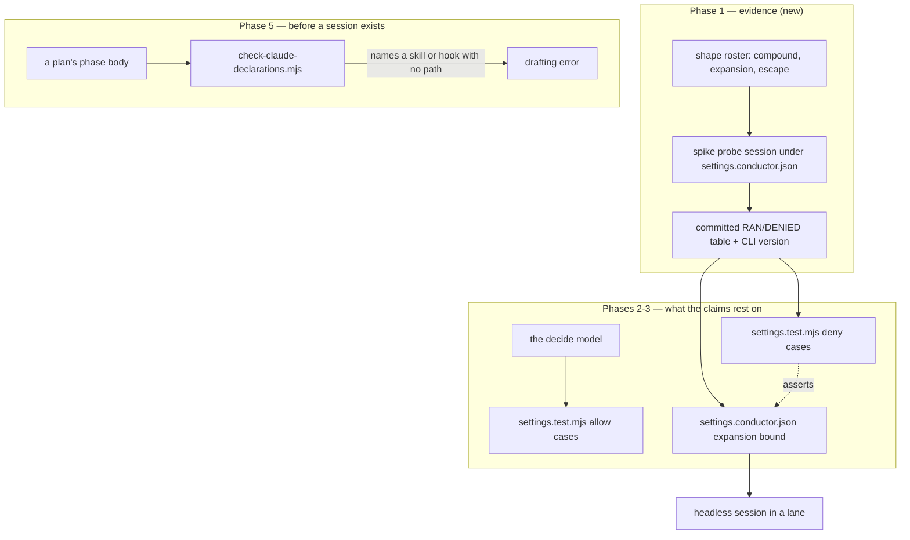

# 0208 — The conductor's safety claims get their evidence

> **Status:** done — closed 2026-09-27 by a conductor-run close. Phases 1-5 in 0075c675, 95d86c89,
> 3afa3de4, 25eea723, 2d9af125; three review rounds, round 3 clean with one minor (the `Remove-Item`
> half is modelled, owed to a Windows probe run) and one nit (fixed). Version: none (repository
> tooling). ADR-0233 accepted with an `Outcome`.
> **Created:** 2026-09-19
> **Approved:** 2026-09-19 (user) — approved and deliberately NOT in `tools/conductor/queue.json`.
> Superseded 2026-09-27: Phase 5 and all three review rounds ran under the conductor.
> **Owner skill(s):** dev
> **Related ADRs:** [0233](../../adrs/0233-a-session-allowlist-safety-claim-is-asserted-against-a-transcript.md)
> (accepted), [0208](../../adrs/0208-a-patch-cli-update-runs-with-a-warning-and-every-session-proves-the-hooks-ran.md),
> [0210](../../adrs/0210-a-claude-repair-is-the-owners-and-a-session-that-needs-one-parks-with-the-edit.md),
> [0071](../../adrs/0071-a-numeric-test-contract-states-a-property-or-names-its-machine.md)
> **Closes:** design-backlog 0236, 0237, 0241

## TL;DR

`tools/conductor/README.md` promises that *"a path that leaves the lane is refused, whatever it is
for"*, the rules enforce that only for a path a session writes out, and the test asserting it is a
self-declared model of the CLI that the first unattended run falsified on a case it states. This plan
probes the real matcher, moves every deny case onto the recorded transcript, bounds the shell
expansions the rules miss, and makes an undeclared `.claude/` edit a drafting error instead of a late
park. The first visible behaviour is a committed table saying what the CLI actually did with
`rm -rf $HOME/.cargo`.

## Context & problem

**The unbounded rule.** [Plan 0190](0190-the-conductor-survives-a-run-nobody-is-watching.md)
Phase 2 allowed `Bash(rm *)` and `PowerShell(Remove-Item *)` and bounded them with deny rules for the
four ways a *written* path leaves the worktree: `..`, `~`, a leading `/`, a drive letter. A path the
shell *produces* matches none of them, so all three of these are allowed today (backlog 0237):

```
rm -rf $HOME/.cargo
rm -rf "$(git rev-parse --show-toplevel)/../rlx-plan-0180"
Remove-Item -Recurse $env:USERPROFILE\WORK
```

The blast radius of the first is the machine rather than the repository, which is the argument against
accepting the gap rather than for it.

**The floor under it is known to be wrong.** `tools/conductor/test/settings.test.mjs` decides every
case through a `decide()` it implements, and its header says so: *"It is a model of the CLI, not the
CLI."* It asserts that `cd studio && npm run typecheck` is denied. In step `0191-01-implement` on
2026-09-16, under this exact settings file on CLI 2.1.273, **26 shell calls carried a `cd` and 22
ran** — the four denials correlating with `/tmp` and with `sed` / `head` rather than with `cd`. What
the real rule is has not been established (backlog 0241). So the deny cases — the ones whose failure
costs a directory rather than a turn — are asserted against a model already falsified on a shape it
states outright.

**And the one park that exists to fail early can still fail late.**
[ADR-0210](../../adrs/0210-a-claude-repair-is-the-owners-and-a-session-that-needs-one-parks-with-the-edit.md)
parks a plan in front of a phase whose files include a `.claude/` path, because the CLI refuses a
headless session an `Edit` there. `claudePaths` reads the phase's `**Files touched:**` bullet for a
literal path, so the guarantee is only as strong as a plan's prose — and the plan that built the
mechanism is its own counterexample: Plan 0190 Phase 9 edited three `.claude/skills/*/SKILL.md` files
and named them as *"the three conductor-mode sections"*, a true sentence with no path in it. Under the
conductor that phase would have run, hit the denial, and parked `check_red` on its own done-when
(backlog 0236).

All three are the same failure at different levels: a claim about what the harness refuses, asserted
against something other than the harness.

## Decision

Per [ADR-0233](../../adrs/0233-a-session-allowlist-safety-claim-is-asserted-against-a-transcript.md),
**a claim that the allowlist refuses something is asserted against a recorded transcript of the real
CLI, and a claim that it permits something may stay a model** — because being wrong about an allow case
costs one visible turn and being wrong about a deny case is unbounded and silent. `spike/probe.mjs`
already runs sessions under `settings.conductor.json` and records what happened, so the first phase is
a probe and every later phase is decided from what it recorded. For the `.claude/` park we take
backlog 0236's first shape — a gate at drafting time rather than a wider parser — because a phase body
that describes a skill file without naming it is a drafting error, and no scan of that body can find a
path that is not written in it.

We rejected widening `decide()` to model whatever the matcher turns out to do (the next divergence
would be as silent as this one), allowlisting only scratch roots instead of the deletion verbs
(backlog 0231 records legitimate deletions outside `target/`), and accepting the gap.

## Architecture diagram



## Implementation phases

### Phase 1 — the matcher gets a transcript
- **Owner skill:** dev
- **What:** A probe session attempts a fixed roster of shapes under `settings.conductor.json` and its
  RAN/DENIED verdict per shape is committed beside the CLI version it was taken on.
- **Files touched:** `tools/conductor/spike/` (a new probe script beside `probe.mjs`, and its recorded
  table in `tools/conductor/spike/README.md`).
- **Roster, at minimum:** a bare `cd`; `cd <lane> && <allowed verb>`; `cd /tmp && <allowed verb>`;
  `<allowed verb> | sed`; `rm -rf $HOME/.cargo`; `rm -rf "$(git rev-parse --show-toplevel)/.."`;
  `Remove-Item -Recurse $env:USERPROFILE\WORK`; and one of each of the four literal escapes the rules
  already deny, as the control that the file is in force at all.
- **Done when:** `tools/conductor/spike/README.md` carries a table naming each shape and what the CLI
  did with it, on a named CLI version, and the four literal-escape controls read DENIED — without which
  the run proves nothing. The table states in one line whether `cd <lane> && ...` ran, which is the
  question `settings.test.mjs` asserts the opposite of.

### Phase 2 — the deny cases move onto the transcript
- **Owner skill:** dev
- **What:** `settings.test.mjs` keeps `decide()` for allow cases and asserts every deny case the probe
  covers against the recorded outcome instead of the model; its header stops claiming what it cannot
  see.
- **Files touched:** `tools/conductor/test/settings.test.mjs`.
- **Done when:** a deny case whose recorded outcome is RAN is a **red** test rather than a green one —
  demonstrated by the compound `cd` cases, which the transcript from Phase 1 either confirms or
  contradicts. If it contradicts them, they are corrected to what was observed and the correction is
  what this phase ships. The allow cases still run through `decide()` and the header says which half
  rests on which.

### Phase 3 — the deletion bound reaches an expanded path
- **Owner skill:** dev
- **What:** Deny rules that bound a path the shell produces, in the shape Phase 1's transcript shows
  actually bites.
- **Files touched:** `tools/conductor/settings.conductor.json`,
  `tools/conductor/test/settings.test.mjs`.
- **Done when:** `rm -rf $HOME/.cargo` and `Remove-Item -Recurse $env:USERPROFILE\WORK` are refused
  **under the real CLI**, shown by re-running Phase 1's probe and recording the new verdict beside the
  old one; and a literal in-lane deletion a session legitimately makes — `rm -rf target/debug` — still
  runs, so the bound did not buy safety by refusing correct work. ADR-0233's Alternative D is the
  likely shape and **the transcript decides**: if denying the expansion syntax does not bite, the shape
  that does is what ships and the ADR gains an `Outcome` rather than being obeyed.

### Phase 4 — the prose stops promising more than the rules enforce
- **Owner skill:** dev
- **What:** `README.md`'s guarantee is rewritten to the bound Phase 3 actually enforces, and the
  prompt's unenforceable rule is resolved in whichever direction Phase 1 showed.
- **Files touched:** `tools/conductor/README.md`, `tools/conductor/prompts/implement.md`.
- **Done when:** the README states the bound in terms a reader can check against the rules, and cites
  the transcript for the part that is measured. And the prompt's *"Shell calls run one command per
  call ... No `cd`"* is either dropped — if Phase 1 showed `cd <lane> && ...` is safe, in which case it
  is noise the sessions correctly ignored 22 times — or kept with the reason it exists. Compound rates
  across the 15 recorded sessions run 12 % to 89 % and 0191's 81 % sits inside that spread, so "the
  rule changed behaviour" is not available as the reason.

### Phase 5 — an undeclared `.claude/` edit is a drafting error
- **Owner skill:** dev
- **What:** A gate that refuses a plan whose phase body names a skill, a hook, `settings.json` or a
  conductor-mode section while its `**Files touched:**` bullet carries no `.claude/` path.
- **Files touched:** a new `scripts/check-claude-declarations.mjs`, `scripts/gates.manifest.mjs`,
  `.githooks/pre-push`, `.github/workflows/ci.yml`, `scripts/fixtures/`.
- **Done when:** the gate fails on a seeded fixture in Plan 0190 Phase 9's exact shape — a phase body
  saying *"the three conductor-mode sections"* with no path in `Files touched` — and passes on the same
  phase once the paths are declared. It joins `gates.manifest.mjs` with the three checkout carriers, so
  `check-gate-carriers.mjs` holds all three to it; and it carries `--self-test`, as every gate in that
  roster does. `node scripts/check-claude-declarations.mjs` exits 0 over the plans in `docs/plans/` and
  `docs/plans/done/` as they stand, or the plans it convicts are named for the architect rather than
  edited by this phase.

## Risks & open questions

- **Phase 1 may show the matcher does something neither backlog entry guessed**, which would make
  Phase 3's shape and possibly ADR-0233's Alternative D wrong. That is the plan working: Phase 1 is
  allowed to supersede the ADR, and the ADR says so.
- **A probe session costs money and a turn budget**, and it is the cheapest thing here by a wide
  margin. If the probe cannot be made to attempt a denied shape without the session abandoning the
  step, record that as the finding — a shape the harness will not let a session even try is evidence
  about the harness.
- **Phase 3 can over-refuse.** A bound on `$` in a deletion command is crude, and a session that
  legitimately writes `rm -rf "$SCRATCH"` is refused. The done-when checks the one legitimate shape we
  know of; others surface as denied commands in a lane's log, which is the recoverable direction.
- **Phase 5's gate reads prose and will have false positives.** A phase that mentions `.claude/` in
  passing is not touching it. The fixture-driven done-when is the floor; the escape hatch is the one
  every gate here has, a named allow comment, and the gate is worth nothing if it is noisy enough to be
  bypassed.
- **The transcript is a measurement and goes stale on the next CLI.** ADR-0071's rule applies: the
  table names its version. Nothing gates re-running it, and ADR-0208's version check is the nearest
  trigger.
- **This plan edits the file the running conductor reads.** It is approved unqueued for that reason —
  see "What this plan does NOT do".

## What this plan does NOT do

- **It does not run under the conductor.** Phases 3 and 4 edit `settings.conductor.json` and the
  prompts, which are what a conductor session is started with, and Phase 5 edits the gate roster every
  carrier runs. This plan is approved and left **out of `queue.json`** deliberately; it is taken in an
  interactive session, or queued only after the current lanes drain.
- **It does not settle whether a session should be allowed `rm` at all.** The verb stays allowed and
  bounded, per Plan 0190 Phase 2's brief.
- **It does not touch `Monitor`, backgrounding, or the suite lock** — ADR-0205 and ADR-0207's hooks are
  a different surface and are not implicated by any of the three entries.
- **It does not make an undeclared `.claude/` phase runnable.** ADR-0210's park stands; Phase 5 moves
  the failure from a session to a drafting gate and buys nothing else.

## Implementation log

> Written by `dev` — one row per phase as that phase's commit lands, and the close block after the
> last one. **The phases above are the contract; everything here is what happened.**

**Lane:** `plan-0208-the-conductors-safety-claims-get-their-evidence`, worktree `/home/igor/Work/rlx-plan-0208` (an interactive session, not the conductor)

| phase | owner | state | commit |
|---|---|---|---|
| 1 — the matcher gets a transcript | dev | done | 0075c675 |
| 2 — the deny cases move onto the transcript | dev | done | 95d86c89 |
| 3 — the deletion bound reaches an expanded path | dev | done | 3afa3de4 |
| 4 — the prose stops promising more than the rules enforce | dev | done | 25eea723 |
| 5 — an undeclared `.claude/` edit is a drafting error | dev | done | 2d9af125 |

### Notes

- Phase 3 shipped ADR-0233 Alternative D's `$` rules (`Bash(rm *$*)`, `PowerShell(Remove-Item *$*)`)
  plus `` Bash(rm *`*) ``, which the probe showed was needed for the backtick shape. It left out
  D's `rm *%*`: `%VAR%` is `cmd.exe` syntax, and neither tool expands it. The PowerShell rule is not
  probed, because the tool exists only on Windows.
- Phase 4 kept the prompt's `No cd` with its reason rather than dropping it. On 2.1.282 a `cd` to the
  session's own lane never reached the matcher, and every other `cd` was refused, which costs a turn.
  The same sentence without the reason is also in `prompts/fix.md`, `review.md` and `merge.md`, which
  are outside this phase's file list and were left alone.
- Phase 5 ran under the conductor, not in an interactive session as the header and the `Lane:` line say.
- Phase 5's gate reads only the plans in `docs/plans/` for its exit code. A plan in `docs/plans/done/`
  is listed as an advisory. Read that way, the repository run exits 0 and the advisory holds 14
  phases across 11 closed plans, Plan 0190 Phase 9 among them. `node scripts/check-claude-declarations.mjs`
  prints the list. No plan was edited.
- A phase is convicted by a path under `.claude/`, by `SKILL.md`, or by a skill, a conductor-mode
  section or `settings.json` behind a definite determiner (*the*, *its*, *each*, ...). It is also
  convicted by a `.claude/hooks/` file name or by `PreToolUse`. Quoted text and a bare `.claude/`
  are not read. Without those two exclusions, this plan's own Phase 5 would have been convicted.
- Review round 1, finding 0 (major): a recorded refusal now also asserts `decide()` refuses it, so a
  deleted deny rule turns red; the stale comments of finding 3 went with it. c006772b. Checked by
  deleting `Bash(rm *..*)`: two cases red, then `git restore`.
- Review round 1, finding 1 (major): `Bash(rm * /*)` and `PowerShell(Remove-Item * /*)` with refused
  cases, modelled and not probed; the README sentence of finding 2 was rewritten in the same commit.
  6c53d90a.
- Review round 2, finding 0 (major): quoted absolute-path deny rules for `rm` and `Remove-Item`
  (`*"/*`, `*'/*`), refused cases marked not probed, an allowed `rm -rf "target/debug"`, and the
  README names the shape as modelled. aa55b438. The test run was `node --test tools/conductor/test/`.
- Review round 2, finding 1 (minor): `declared` uses the path rule's pattern, with a bare-`.claude/`
  fixture phase; self-test 12 of 12. 5d86abb5.
- Review round 2, finding 2 (minor): `docs/developing.md` gains the two gate rows, `CLAUDE.md` the
  gate's clause. 410db891.

### Close triggers

- **`presets/` touched:** no
- **Plan header `Closes:`** design-backlog 0236, 0237, 0241
- **What shipped:** feature (repository tooling: a matcher probe under `tools/conductor/spike/`,
  deny rules in `tools/conductor/settings.conductor.json` and their test, and a new Node gate
  `scripts/check-claude-declarations.mjs` on the roster). Nothing in a shipped artifact.
- **Operator docs touched:** `tools/conductor/README.md`, `tools/conductor/spike/README.md`,
  `tools/conductor/prompts/implement.md`, `scripts/fixtures/README.md`
- **Backlog probes (`node scripts/check-backlog-claims.mjs`):** exit 0. 47 reductions hold across
  23 live entries, 4 unprobeable.
- **Full suite:** owed to the conductor's pre-review gate (ADR-0207)
- **Outstanding `human` phases:** none

## Close review

### Round 3 (the clean verdict this close ran on)

**Graded at:** `0366c9443297b86a4d311652e3a4d4f387bd021e` (tree `a0867fb6`), lane
`/home/igor/Work/rlx-plan-0208`, branch `plan-0208-the-conductors-safety-claims-get-their-evidence`
(already carries `main`).

**Verdict:** the round-2 major and both round-2 code/prose minors are resolved correctly. **No
blockers, no majors, 1 minor, 1 nit.** Both remaining items are carried over from round 2, and both
are things the close records rather than code. The plan is ready to close.

#### Evidence

- **Full suite (lens 1):** served from the ledger, not re-run. The wrapper printed
  `with-lock: skipped cargo nextest run --workspace: tree a0867fb is green in the suite ledger, run by
  gate 0208-fix-2 at 2026-09-26T22:30:23.986Z: 1858 tests run: 1858 passed (5 slow), 7 skipped`.
  `git rev-parse --short HEAD^{tree}` is `a0867fb6`, so the record covers the tip graded here.
- `RUSTDOCFLAGS="-D warnings" cargo doc --workspace --no-deps`: green.
- `node --test tools/conductor/test/`: 469 tests, 467 pass, 0 fail, 2 skipped (Windows-only).
- `node scripts/check-claude-declarations.mjs --self-test`: 12 of 12.
- `node scripts/check-claude-declarations.mjs`: OK over 229 plans. The advisory lists 14 phases in
  closed plans, Plan 0190 Phase 9 among them, and no exit code.
- `node scripts/check-gate-carriers.mjs`: OK, 22 rostered, hook 19/19, ci 19/19.
- `node scripts/check-doc-links.mjs` (568 files), `check-index-rows.mjs`, `toc.mjs --check`,
  `check-system-counts.mjs`: all OK.
- `node scripts/check-backlog-claims.mjs`: exit 0, 47 reductions across 23 live entries, 4
  unprobeable.
- `git status --short` is empty at the end. The tree is as I found it.

#### Round-2 findings, re-graded

| round 2 | resolved in | verdict |
|---|---|---|
| major 1: a quoted absolute path passes the deletion bound | aa55b438 | **Resolved.** `settings.conductor.json:82-83,93-94` add `Bash(rm *"/*)`, `Bash(rm *'/*)` and the two `Remove-Item` twins. Under `ruleRegex` (`settings.test.mjs:74`), `*` matches the empty string, so a quoted first argument (`rm "/etc"`) is covered as well as `rm -rf "/etc"`. The refused cases at `settings.test.mjs:268-269,286-287` say `not probed`, and `rm -rf "target/debug"` is an allowed case at 270, which shows the rules do not refuse a quoted relative path. `README.md:402-403,416-417` name the shape and list it as modelled. |
| minor 1: `declared` accepts a bare `.claude/` | 5d86abb5 | **Resolved.** `check-claude-declarations.mjs:156` uses `/\.claude\/[\w*][\w.*/-]*/`. Its character class is a subset of `claudePaths()`'s (`tools/conductor/lib/plan.mjs:179`), so every phase the gate treats as declared is a phase the conductor parks in front of. The disagreement the finding named is gone. Fixture Phase 10 covers the bare form, and the self-test asserts it by count. |
| minor 2: `docs/developing.md` and `CLAUDE.md` omit the gate | 410db891 | **Resolved.** `docs/developing.md:218-219` add the two rows in hook order, and `CLAUDE.md`'s `scripts/` block carries the clause. |
| minor 3: the `Remove-Item` half of Phase 3 is unprobed | — | **Open by nature.** Carried as minor 1 below. |
| nit 1: the stale `Approved:` line | — | **Open.** Carried as nit 1 below. |

#### Lens 1 — alignment

The phase mapping is unchanged: phases 1 to 5 map to 0075c675, 95d86c89, 3afa3de4, 25eea723 and
2d9af125. Each phase has one `Owner skill: dev`. The log adds three round-2 notes, each naming its
commit, and it is still shorter than the phases section. Each done-when was graded in rounds 1 and 2.
The fix round changed only the deletion rules, the gate's `declared` test and prose, and none of them
reopens a done-when.

#### Findings

##### minor

1. **`tools/conductor/test/settings.test.mjs:285`: the `Remove-Item` half of Phase 3's done-when is
   modelled, not observed.**
   - **What:** Phase 3 requires `Remove-Item -Recurse $env:USERPROFILE\WORK` to be refused "under the
     real CLI". The PowerShell tool exists only on Windows, and the probe ran on Linux.
   - **Status:** the README, the log and the cases all say so openly. The four new quoted
     `Remove-Item` rules are in the same position.
   - **Repair (close):** record it in `## Close review` as owed to a Windows probe run, and in
     ADR-0233's `Outcome`.

##### nit

1. **`docs/plans/0208-the-conductors-safety-claims-get-their-evidence.md:5`: the `Approved:` line
   still says "deliberately NOT in `tools/conductor/queue.json`".** Phase 5 and all three review
   rounds ran under the conductor, and the log's notes say so.
   - **Repair (close):** add a dated note when `Status:` flips.

#### Lenses 2, 4 and 5

The fix round changed no Rust, C++ or `core/` code. It made no audio-path, C ABI or control-protocol
change, and it added no numeric assertion. The new deny rules belong to the existing `rm` and
`Remove-Item` families, and the roster test requires each rule to have a case. They also refuse a
command whose quoted relative segment is followed by `/`, such as `rm -rf "build"/x`. That is
over-refusal, which the plan's Risks section accepts as the recoverable direction.

#### Bookkeeping owed at the close

- **ADR-0233:** flip from `proposed` to `accepted` with a dated `Outcome`. The bound that shipped
  differs from Alternative D:
  - it adds `` Bash(rm *`*) ``;
  - it drops `rm *%*`;
  - it adds the any-position and quoted absolute-path rules, which are modelled.

  `Remove-Item` is modelled only, and nothing triggers a probe re-run when the CLI version moves.
- **Backlog 0236, 0237 and 0241:** append `CLOSED` and move each from `### Promoted` to `### Closed`.
  0237's gap (the quoted form included) is now bounded.
- **`## Close review` section:** add it with this review and one line per earlier finding:
  - round 1: 0 and 3 in c006772, 1 and 2 in 6c53d90;
  - round 2: 0 in aa55b43, 1 in 5d86abb, 2 in 410db89.
- **Version bump:** this is repository tooling, and no shipped artifact changed. Choose none or patch
  deliberately.
- **Translation advisory:** re-read it at the close.

### What the close did with round 3

- **Minor 1 stays open**, owed to a Windows probe run: the `Remove-Item` rules, including the quoted
  twins, are modelled and not observed. It is recorded in ADR-0233's `Outcome` and in backlog 0237's
  `CLOSED` marker. It changes no file the close may repair.
- **Nit 1 fixed** in 2d3df840: the `Approved:` line carries a dated note.
- **Version: none.** The plan changed the conductor's settings and tests and added a Node gate. No
  shipped artifact moved, which is the same call Plans 0226 and 0229 made for conductor tooling.
- **Upstream CI** read green at the close (run 36272565363 on `main` at 3e476de).
- **Translation advisory:** `docs/how-it-works.ru.md`, `docs/running.ru.md` and
  `packaging/foobar/READ-ME-FIRST.ru.md` have sources that moved past their stamps. This plan moved
  none of those sources.

### Earlier rounds, resolved by fix rounds

- Round 1, finding 0 (major, a deleted deny rule stayed green): fixed in c006772.
- Round 1, finding 1 (major, a leading `/` in a later argument passed the bound): fixed in 6c53d90.
- Round 1, finding 2 (minor, the README sentence overstated the bound): fixed in 6c53d90.
- Round 1, finding 3 (minor, stale comments in `settings.test.mjs`): fixed in c006772.
- Round 2, finding 0 (major, a quoted absolute path passed the deletion bound): fixed in aa55b43.
- Round 2, finding 1 (minor, `declared` accepted a bare `.claude/`): fixed in 5d86abb.
- Round 2, finding 2 (minor, `docs/developing.md` and `CLAUDE.md` omitted the gate): fixed in 410db89.

## Followups (after this lands)

- Re-running the Phase 1 probe on a CLI version bump has no carrier. ADR-0208 verifies the version
  table; nothing says the matcher transcript is owed a re-run.
