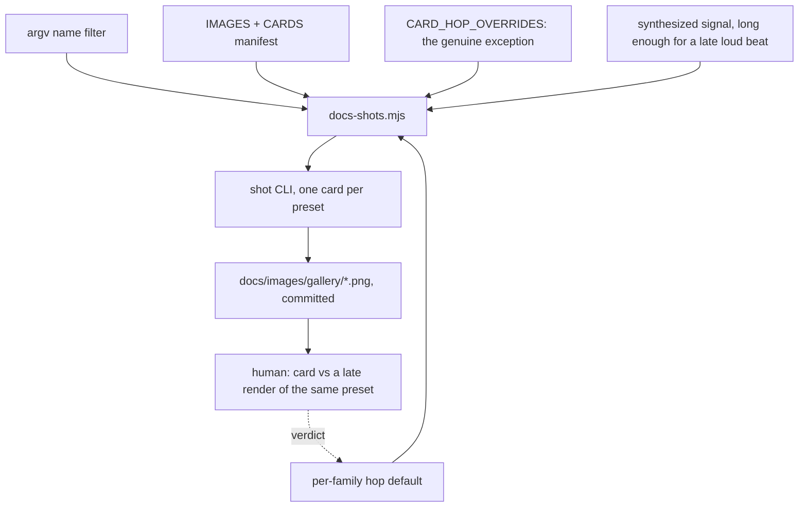

# 0210 — The gallery card shows the world it names

> **Status:** done — closed 2026-09-22. Phases `655fa6a3`, `36e254ef`, six family image commits
> `13838683`..`cb59cc92`, Phase 4 `314cd962`. Conductor close review round 1: no blockers, no
> majors, four minors (two repaired). Full suite green on the reviewed tree (ledger record,
> 1767 passed). Version 0.142.0.
> **Created:** 2026-09-19
> **Approved:** 2026-09-19 (user) — approved and deliberately NOT in `tools/conductor/queue.json`
> **Owner skill(s):** dev, human
> **Related ADRs:** [0235](../../adrs/0235-a-gallery-cards-hop-is-chosen-per-family-and-the-signal-outlasts-it.md)
> (accepted 2026-09-22), [0099](../../adrs/0099-the-show-length-horizon-is-a-spot-check-and-it-splits-in-two.md),
> [0071](../../adrs/0071-a-numeric-test-contract-states-a-property-or-names-its-machine.md)
> **Closes:** design-backlog 0254, 0255

## TL;DR

Every gallery card is captured at hop 300 — about 3.5 s of scene time — which is before a feedback
world exists at all: `warp_tracery`'s card shows seven separate lobes where the preset's own name is the
rosette they merge into thirty seconds later. This plan gives `docs-shots.mjs` a name filter so one card
can be re-rendered at all, then makes the hop a per-family default over a signal long enough that a late
hop is still a loud one. The first visible behaviour is
`node scripts/docs-shots.mjs warp_tracery` rendering exactly one card.

## Context & problem

**The card is the one picture most readers ever see of a preset**, and for the accumulating share of the
library it is taken before the world is there. `scripts/docs-shots.mjs` renders at `--frame-at 300`
unless the preset is in `CARD_HOP_OVERRIDES`, a roster holding four presets, all `swarm_*`, all at
hop 374. So the mechanism for *"this world needs longer"* exists, was used once, for one family, and
nothing generalized it (backlog 0254).

**A feedback field is not developed at 3.5 s and cannot be.** `warp_ladder`'s header records its own
horizon — coverage 0.408 at the 30 s row against 0.619 at 300 s, still filling for its first two
minutes. `warp_tracery`'s committed card, rendered 2026-09-18 at hop 300, shows the contours closed
around each of seven lobes; the same file at 30 s shows them merged into the rosette. Both pictures are
true and only one is the look. It is not one family: trails, a `[feedback]` table,
reaction-diffusion and the particle worlds all accumulate, and
[ADR-0099](../../adrs/0099-the-show-length-horizon-is-a-spot-check-and-it-splits-in-two.md) already names
that set for a different purpose.

**Raising the constant for everyone is the wrong repair, and the script says why.** Hop 300 is argued
in its own header: it is the last hop of the loudest beat, and a later hop lands in the two-beat rest
`dynamic_groove` takes next. That is why the four swarm overrides at 374 are described as the exception
rather than the better default.

**And re-rendering one card is currently done by hand.** The runner reads no arguments and loops the
whole manifest. A full run is not available in practice — the script's header records that renders are
not byte-reproducible across machines, so it produces a diff over roughly a hundred unrelated images
recording driver drift. So the alternative is retyping that entry's settings on the command line, which
is what happened on 2026-09-18 for `warp_tracery`: `--signal dynamic:110 --frame-at 300 --size 640x360
--tier rich`, read out of the manifest and copied. Correct only as long as whoever copies it copies all
five, and nothing would notice a card rendered at the wrong size or tier — the test beside it checks the
PNG exists and deliberately not that it is current (backlog 0255).

That last point is why it comes first here: the fix for 0254 is a re-render of a family's cards, and
0254 says in its own words that it is *"cheapest to take alongside any other edit to the manifest"*.

## Decision

Per [ADR-0235](../../adrs/0235-a-gallery-cards-hop-is-chosen-per-family-and-the-signal-outlasts-it.md),
**a card's hop is a per-family default and the synthesized signal is long enough that a late hop is
still a loud one.** Both halves are required: a later hop on today's signal captures a lull, and a longer
signal with one global hop captures the non-accumulating presets later for no benefit. The per-preset
override roster stays for the genuine exception. **A re-rendered card is judged by a person against a
late render of the same preset**, because a coverage statistic says a field is still filling and does not
say which frame is the look.

The name filter lands first, since without it every later phase re-renders the whole gallery.

We rejected raising the hop for everyone (it trades a card taken too early for one taken in
`dynamic_groove`'s rest), extending the per-preset roster as presets land (that is what exists, and the
family it was built for is not the one that needed it most), and gating freshness on a coverage statistic
(it answers a different question than the card does).

## Architecture diagram

## Implementation phases

### Phase 1 — the renderer takes a name
- **Owner skill:** dev
- **What:** `docs-shots.mjs` accepts one or more name arguments and renders only the manifest entries
  whose `presetFile` or `out` matches, leaving every other committed still untouched.
- **Files touched:** `scripts/docs-shots.mjs`.
- **Done when:** `node scripts/docs-shots.mjs warp_tracery` rewrites that one PNG and `git status` shows
  exactly one modified file; a name matching nothing exits non-zero and prints the names it knows rather
  than silently rendering nothing; and a bare `node scripts/docs-shots.mjs` still renders the whole
  manifest, since that is what the existing instructions say to run. The settings still come from the
  manifest and are not re-enterable on the command line — the point is that the five settings stay in the
  one place they are written down. `scripts/tuple-sheets.mjs` already takes an argument, so match its
  shape rather than inventing one.

### Phase 2 — the accumulating set is named, and the hop follows the family
- **Owner skill:** dev
- **What:** A per-family hop default beside the per-preset override roster, and the signal extended so
  the later hop still lands on a loud beat.
- **Files touched:** `scripts/docs-shots.mjs`, `standalone/src/shot/args.rs`, and the CLI's two
  reader documents (`docs/configuration.md`, `docs/capturing.md`).

> **Amended 2026-09-20, and this phase is why the plan parked.** The clip is
> `SIGNAL_SECS: f32 = 4.0` in `standalone/src/shot/args.rs` — at 48 kHz on a 512-sample hop, **375
> analysis hops**, so hop 374 (the existing swarm override) is already the last one the clip has,
> and `--frame-at 375` does not clamp but fails the run through `check_hops`. The accumulating
> families' horizons are **tens of seconds** — backlog 0254 records `warp_ladder` still filling at
> the 30 s row, hop ~2812 — so *every* hop this clip can offer is inside the first four seconds and
> the second half of this phase is unreachable from the script alone. The plan's own exclusion
> *"It does not change `shot`"* forbade the one file where it is reachable, so both could not hold.
>
> **The amendment: `shot` gains a `--signal-secs` flag, and `SIGNAL_SECS` becomes its default.**
> Additive by construction — every existing caller omits the flag and gets 4.0, so no committed
> capture, golden or test moves by a byte, and that byte-identity is the done-when below rather
> than an expectation.
>
> **Rejected: raising `SIGNAL_SECS` itself.** One constant, no new surface — and it silently
> relengthens every synthesized capture in the repository, including the ones tests pin. The blast
> radius is every `--signal` caller rather than the four or five cards that need the longer clip,
> and the failure mode is a golden that moves for a reason nobody connects to this plan.
- **Done when:** the accumulating families — the feedback and trail-driven set ADR-0099 already
  enumerates for the horizon question — resolve to a hop past their development horizon, and the
  non-accumulating families still resolve to 300. The signal's own structure is what makes the late hop
  loud: state in the script's header which beat the new hop lands on, the way the existing header states
  it for 300, so the next reader can check the claim rather than trust it. A per-preset entry in
  `CARD_HOP_OVERRIDES` still wins over its family's default.
- **Done when (the flag, added 2026-09-20):** `--signal-secs` takes a positive finite number of
  seconds and every `--signal` kind is synthesized at that length; **omitting it is byte-identical
  to today** — show that by re-rendering one non-accumulating card with no flag and diffing it
  against the committed PNG, on the machine that committed it, rather than by asserting it; and
  `check_hops` still refuses a `--frame-at` past the end of the *new* length, with its message
  naming that length rather than 375.
- **Stop condition:** if the accumulating families' horizons turn out to need a clip so long that a
  card costs more than a minute to render, **stop and say so in the log** rather than shipping a
  render nobody will re-run. A card that is too expensive to regenerate is the freshness problem
  this plan exists to reduce, arriving by a different door.

### Phase 3 — the affected cards are re-rendered as sets
- **Owner skill:** dev
- **What:** Re-render every card whose hop moved, one family at a time, on one machine.
- **Files touched:** `docs/images/gallery/presets/*.png` — **corrected 2026-09-20**, from
  `docs/images/gallery/*.png`. That spelling names the **one-per-system** set, which this plan never
  meant: every other sentence here says *card*, and a card is
  `docs/images/gallery/presets/<preset>.png`. The per-system entries also carry hand-written hops
  with their own judgement comments in the manifest, so a family default reaching them would
  overwrite a deliberate choice with a generic one.
- **Done when:** each family's cards are re-rendered in one run on one machine and one commit per family,
  with the machine and adapter named in the commit body
  ([ADR-0071](../../adrs/0071-a-numeric-test-contract-states-a-property-or-names-its-machine.md)) — because
  the renders are not byte-reproducible and a mixed-machine set is a diff nobody can read. No card whose
  hop did not move is rewritten, which Phase 1 is what makes possible.

### Phase 4 — a person says whether the cards are now the look
- **Owner skill:** human
- Taken as a `preset-author` session: judging a picture is that lane's work. The tag stays the bare
  `human` the conductor's parser accepts — it reads the owner line to the end of the line, so a
  parenthetical after the word makes the phase ownerless and refuses the whole queue.
- **What:** Compare each re-rendered card against a late render of the same preset and say whether the
  card is now the world the preset is named for.
- **Files touched:** none, or `scripts/docs-shots.mjs`'s family hops if the verdict moves one.
- **Done when:** every re-rendered family has a recorded verdict — *the card is now the look*, *still too
  early*, or *now too late* — against a render of the same preset at a hop well past the card's. A *still
  too early* verdict sends the family's hop back to Phase 2 and Phase 3 re-runs for it; a *now too late*
  verdict is the signal that ADR-0235's arithmetic on that family is wrong and the ADR gains an
  `Outcome`. `warp_tracery` is the named case the entry was raised on, so it is judged explicitly.

## Risks & open questions

- **Twelve of thirty-three re-rendered manifest entries came back byte-different, and nobody knows
  why** (recorded 2026-09-20 from the bounded run that checked Phase 1). `hero`,
  `walkthrough/step-5` and ten of the one-per-system gallery images differed from their committed
  PNGs on this machine, while the other twenty-one — `warp_tracery`'s card among them — were
  byte-identical. All were restored; the lane carries no image change. **Phase 3 has to survive
  this**: if a third of the set is already unstable against its own committed bytes, "one family per
  run per machine, named in the commit body" is doing more work than it looks, and a Phase 3 diff
  will contain cards whose hop did not move. Whether the cause is driver drift, a different binary
  or preset content that has since moved is **not established**, and establishing it is not this
  plan's — it is the kind of thing that becomes a backlog entry with a probe.
- **Phase 2's "past their development horizon" is not a number yet, and deliberately.** The horizon
  differs per family — `warp_ladder`'s field fills for two minutes — and a single late hop for the whole
  accumulating set may be right or may be four different numbers. Phase 2 picks from the signal's
  structure and Phase 4 judges; if the picks turn out to need per-preset entries after all, that is
  ADR-0235's Alternative B winning and it is recorded as an `Outcome` rather than quietly done.
- **Extending the signal changes what every card sees, not only the late ones.** If the extension alters
  the beat grid before hop 300, the non-accumulating cards move too and Phase 3 becomes the whole
  gallery — the thing this plan is trying to avoid. Extend by appending rather than by re-timing, and
  check one unchanged card renders identically on the same machine before Phase 3.
- **A long capture costs time per card.** The accumulating families are a minority of the library, and
  the cost lands only on them.
- **Nothing will notice this decaying again.** `every_shipped_preset_has_a_gallery_card` stays an
  existence check, so a family added later with no hop entry inherits the default silently. ADR-0235's
  Negative says so and this plan does not fix it;
  [Plan 0209](../0209-a-system-joins-the-instruments-by-existing.md)'s derived-roster shape is what would.

## What this plan does NOT do

- **It does not make the card gate check freshness.** The existence check stays; a card captured at
  settings the manifest does not name is still invisible to it. Phase 1 removes the *reason* anyone
  hand-renders, which is the cheap half of that problem.
- **It does not re-render the gallery.** Only cards whose hop moved.
- **It does not touch the two renderers that are not stills** — `docs-clip.mjs`'s demo clip and social
  preview are out of scope.
- **It does not change the tier, or any preset.** A card that is wrong because the preset is wrong
  is a content finding, not this plan's.
- **It changes `shot` in exactly one additive way** (amended 2026-09-20). This bullet read *"It does
  not change `shot`"* and that exclusion is what parked Phase 2: the clip length lives in
  `standalone/src/shot/args.rs` and nowhere else, so the plan forbade the only file its own
  done-when could be satisfied from. The narrowed exclusion is that **no existing behaviour moves** —
  a new optional flag, the old constant as its default, no other `shot` surface touched, and no
  committed capture different by a byte.

## Implementation log

> Written by `dev` — one row per phase as that phase's commit lands, and the close block after the
> last one. **The phases above are the contract; everything here is what happened.**

**Lane:** `plan-0210-the-gallery-card-shows-the-world-it-names`, worktree
`C:\Users\Igor Konovalov\WORK\rlx-plan-0210`.

| phase | owner | state | commit |
|---|---|---|---|
| 1 — the renderer takes a name | dev | done | `655fa6a3` |
| 2 — the accumulating set is named, and the hop follows the family | dev | done | `36e254ef` |
| 3 — the affected cards are re-rendered as sets | dev | done | `13838683` `4ae649b2` `9e47296f` `4d4365d6` `2102267c`, and the warp set committed with this row |
| 4 — a person says whether the cards are now the look | human | done — every family *the card is now the look* | committed with this row |

### Notes

**Phase 2 touched a file its `Files touched:` does not name, and did not touch one it does.**

- **`standalone/examples/shot.rs`** carries the `--signal-secs` parse arm, its `Args` field, its
  "needs `--signal`" rejection and its usage line. The amendment's flag cannot exist without it —
  `standalone/src/shot/args.rs` holds the parser and the synthesis (`parse_signal_secs`,
  `synth_signal_secs`) but nothing in that crate reads a command line.
- **`docs/configuration.md`** was left alone. It documents *the app's* flags — "every command-line
  flag ... the standalone application reads" — and `standalone/tests/suite/configuration_doc.rs`
  holds it in step with `ritmolux --help`, which `--signal-secs` is not in. The flag is documented
  in `docs/capturing.md`, which is `shot`'s reader document and where `shot_cli.rs`'s own drift
  gate points.

**The swarm family now renders at two hops, and nothing in this phase resolves that.** The
per-preset roster wins over the family default, as the done-when requires, so `swarm_braid`,
`swarm_drift`, `swarm_shatter` and `swarm_stipple` stay at hop 374 while `swarm_murmuration` — the
one swarm world the roster never named — resolves to the family's 2828. Both hops sit at the same
position in the phrase's quiet bar, six phrases apart, so the difference is development time and
not lighting. Retiring the four entries into the family row would have emptied
`CARD_HOP_OVERRIDES`, which the same done-when asks to stay demonstrable.

**The byte-identity done-when was shown by rendering, not asserted.**
`node scripts/docs-shots.mjs analytic_echoplate` re-rendered a non-accumulating card with no
`--signal-secs` on the command line and left `git status` carrying no image change.

**Phase 3 re-rendered 45 cards in six runs, and every changed file was a card whose hop moved.**
20 attractor, 5 cellular, 5 emitter, 7 reaction, 1 swarm, 7 warp; `git status` was read after each
family's run and carried that family's cards and nothing else. **The instability the Phase 1 note
below records did not appear** — but that is not evidence against it: nothing rendered here was
expected to come back byte-identical, so a card that drifted and a card that moved for its hop are
indistinguishable in this set.

**Seven cards were named to the runner by their full `out` path rather than by preset stem**, and
that is not cosmetic. `attractor_leviathan`, `cellular_ember_life`, `cellular_spiral_bloom`,
`cellular_tide_bugs`, `emitter_perseids`, `reaction_verdigris` and `warp_wellhead` are each also the
preset behind a one-per-system or teaching image, whose hop did **not** move; Phase 1's matcher
reads `presetFile` as an alias, so the bare stem would have re-rendered those too.

**Attractor's twenty cards exceeded the ten-minute ceiling this session can hold a foreground
command for**, and the harness moved the run to the background rather than the run being split. It
completed, exit 0, all twenty written in the one run the phase asks for.

**Measured per card at hop 2754, 640x360, Rich, on the box named in each commit body** (ADR-0071):
`warp_tracery` 5.1 s, `attractor_walkknot` 11.1 s, `reaction_verdigris` 11.8 s,
`attractor_valentine` 20.4 s. The phase's stop condition is a card costing more than a minute; the
slowest measured is a third of that, so it was not reached.

**An observation from Phase 1**, from the bounded bare run used to check it:
of the first 33 manifest entries re-rendered on this machine, **12 came back with bytes different
from the committed PNG** (`hero`, `walkthrough/step-5`, and ten of the one-per-system gallery
images) while the other 21, `warp_tracery`'s card among them, were byte-identical. All were restored
with `git restore -- docs/images`; the lane carries no image change. Whether that is driver drift,
a different binary, or preset content that moved since those files were written is not something
this session established.

**Phase 4: every re-rendered family is *the card is now the look*, so no hop goes back to Phase 2
and ADR-0235 gains no `Outcome`.** Taken 2026-09-22 in the `preset-author` lane on the owner's
behalf, not by the owner. The same machine rendered the cards, and a local re-render of
`warp_tracery` at its card settings came back byte-identical to the committed PNG. Each late render
keeps the card's command line and changes only `--frame-at`, moved a whole number of phrases
(409.09 hops) so it lands at the same point in the phrase, with `--signal-secs` set to
`ceil((H+1)*512/48000)`:

| family | late hops read | verdict | reason |
|---|---|---|---|
| attractor (20) | 4390, 6027 | the card is now the look | density and fill match both late renders; what still changes is the walk's figure, not development |
| cellular (5) | 4390 | the card is now the look | texture, scale and coverage match; only the arrangement differs |
| emitter (5) | 4390 | the card is now the look | the population is steady by about 3.5 s, so the hop bought nothing visible and cost nothing |
| reaction (7) | 4390, 10936 | the card is now the look | the largest gain: hop 300 showed seeds and sparse rings, the card shows the settled field |
| swarm (1) | 4464 | the card is now the look | `swarm_murmuration` was a uniform carpet at hop 300; at 2828 it has the late render's sheets and gaps |
| warp (7) | 4390, 10936 | the card is now the look | structure matches both late renders; only palette, glow and ring phase differ |

**`warp_tracery`**, the named case: hop 300 showed seven separate lobes. The card shows the
seven-petal rosette around a hollow centre ring, and hops 4390 and 10936 show the same rosette.
The world does not develop past the card.

**One card is not the look, and a family hop would not fix it.** `attractor_thomasgallery` cycles
rather than settles. Across hops 2345, 2754 (the card), 3163, 3572, 3981 and 4390 it reads clean
knot, dissolved blob, bigger blob, messy knot, twisted knot, clean knot. The card lands on the
dissolved part of the cycle. A `CARD_HOP_OVERRIDES` entry at 2345 would need no longer clip, and is
left as a followup rather than done here: it is a per-preset choice, the thing ADR-0235 declined to
make the default. `attractor_torusknot`, `attractor_walkdejong` and `attractor_walkthomas` also
landed mid-walk on a less characteristic figure, while `attractor_valentine`'s late render is worse
than its card. Walk timing is luck of the frame at any hop. `emitter_perseids` still bunches its
fan to the right, which the roster already records as content work.

### Close triggers

- **`presets/` touched:** no. No preset file, pending or shipped, was read or written by any phase.
- **Plan header `Closes:`** design-backlog 0254, 0255
- **What shipped:** a feature. `shot` gains `--signal-secs`, `scripts/docs-shots.mjs` resolves a
  card's hop per family, and 45 committed gallery cards across six families now show a developed
  world. No existing `shot` behaviour moves: the flag's default is the constant it replaces, and a
  card whose hop did not move re-renders from the same command line, byte for byte.
- **Operator docs touched:** `docs/capturing.md` — the flag table gains `--signal-secs`, and
  *A full-size frame under real audio* gains *A late hop photographs a world that is still
  assembling*, carrying the phrase arithmetic, the worked command and the per-card cost.
  `docs/configuration.md` is in Phase 2's `Files touched:` and was deliberately not edited — see
  the Notes above.
- **Backlog probes (`node scripts/check-backlog-claims.mjs`):** exit 0 — *"43 stated reductions
  still hold across all 20 live entries (4 unprobeable)"*. 30 advisory rows for probed paths that
  moved, none of them this plan's.
- **Full suite:** owed to the conductor's pre-review gate (ADR-0207). The last narrowed run on this
  tree, at Phase 2, was `cargo nextest run --workspace -P fast` — 1688 passed, 86 skipped, exit 0.
  Phase 3 changed only committed PNGs.
- **Outstanding `human` phases:** none. Phase 4 was taken 2026-09-22 in the `preset-author` lane
  on the owner's behalf; its verdicts are in the Notes above.

## Close review

> Conductor close review, round 1 (2026-09-22), in a fresh session (ADR-0205). No earlier round.

**Verdict: Plan 0210 landed as amended; no blockers, no majors, four minors (two repaired at the close).**

Reviewed in the lane over `main..314cd962`. The phase commits are `655fa6a3` (Phase 1),
`4b33f25c` + `81c78c0f` (the park and the amendment), `36e254ef` (Phase 2), `13838683`, `4ae649b2`,
`9e47296f`, `4d4365d6`, `2102267c` and `cb59cc92` (Phase 3, one per family), and `19848867` +
`314cd962` (the close block and Phase 4).

### Evidence

- **Full suite.** The wrapped `cargo nextest run --workspace` printed
  `with-lock: skipped cargo nextest run --workspace: tree 25fd0e5 is green in the suite ledger, run by
  gate 0210-pre-review at 2026-09-22T08:06:58.992Z: 1767 tests run: 1767 passed (30 slow), 7 skipped`.
  `git rev-parse HEAD^{tree}` on the reviewed tip is `25fd0e5f…`, so the record covers this tree.
- **Backlog probes.** `node scripts/check-backlog-claims.mjs` exits 0: 43 reductions across 20 live
  entries, 4 unprobeable. It prints 30 moved-path advisory rows, none of them on this plan's paths.
- **Translations.** `node scripts/check-translations.mjs` exits 0. The advisory names two
  translations whose English source has moved since their stamp: `docs/running.ru.md` and
  `packaging/foobar/READ-ME-FIRST.ru.md`. This plan moved neither source.
- `fmt`, `clippy`, `cargo doc -D warnings` and the full suite run again on the close tip, after the
  merge with `main`.

### Lens 1 — alignment

- **Phase 1.** Names are matched **exactly** against `out`, `presetFile` and both of their stems,
  with backslashes folded. An unknown name exits 1 before the first render and lists the names the
  manifest knows. No argument renders the whole manifest. The code meets all three done-whens.
  Exact matching is the right call: `attractor_clifford` is a prefix of
  `attractor_cliffordgallery`, so a substring match would render both.
- **Phase 2 (as amended).** `CARD_FAMILY_HOPS` sends attractor, cellular, emitter, reaction and warp
  to hop 2754, swarm to 2828, and every other family to 300. `CARD_HOP_OVERRIDES` still wins over
  the family. The header says which beat each hop lands on, and the arithmetic holds: a phrase is
  8 x 26,182 = 209,456 samples, 153,600 + 6 x 209,456 = 1,410,336, and 1,410,336 / 512 = 2754.56.
  `parse_signal_secs` rejects zero, negative, NaN and inf, and `synth_signal` is now
  `synth_signal_secs(spec, SIGNAL_SECS)`. I read the three tests. Their assertions match the
  done-whens, including `"only 2812 analysis hops"` for the refusal at the new length. The
  byte-identity done-when was shown by rendering, as the plan asked. **I checked the claim that a
  longer clip appends rather than re-times against the generators themselves.** `dynamic_groove`
  soft-clips each sample with no clip-wide normalization, and the other kinds draw from a seeded
  stream or evaluate at `t`, so every shorter clip is a prefix of the longer one. Capture walks the
  clip hop by hop, so an early hop cannot depend on the clip's length. The Notes explain why
  `standalone/examples/shot.rs` was edited and `docs/configuration.md` was not, and both reasons
  are correct.
- **Phase 3.** 45 cards changed (20 + 5 + 5 + 7 + 1 + 7), all under
  `docs/images/gallery/presets/`, with one commit per family. The diff contains no one-per-system
  image and no card whose hop did not move.
- **Phase 4 (`human`).** A `preset-author` session took it on the owner's behalf, which the phase
  allows. Every family has a recorded verdict, and `warp_tracery` is judged by name.
- Every phase carries exactly one in-vocabulary `**Owner skill:**` tag.

### Lenses 2-5

The plan changed nothing in `core/`. The new flag belongs to `shot`, a development example, and
touches no audio callback, no C ABI surface and no control-protocol message. The synthesis is still
a pure function of its arguments. 375 and 2812 are exact integer arithmetic, not measurements.
`docs/capturing.md` names the machine its timing figures came from (ADR-0071). The family grain is
ADR-0235's decision, implemented as written, with one gap (finding 3).

### Findings

#### minor

1. **`docs/capturing.md:720` — the late-hop subsection was inserted inside
   `### A full-size frame under real audio`.** That left the section's two closing paragraphs about
   `--frame-at` under the wrong heading. **Repaired at the close:** the paragraphs now sit above the
   subsection again.
2. **This plan, Phase 4's note — it says `attractor_thomasgallery`'s card is "left as a followup",
   but the `## Followups` section did not name it.** **Repaired at the close:** a Followups bullet
   now carries it.
3. **`scripts/docs-shots.mjs:224` — the family is read from the preset-name prefix.** A preset that
   carries its own `[feedback]` table inside a system not in the list still resolves to hop 300, and
   `fragment_whorl` and `curve_ionwake` both do. ADR-0235 names "its feedback configuration" as
   part of what accumulates, and nobody has compared these two cards against a late render. Left
   open for the content lane.
4. **This plan — the `## Implementation log` (about 120 lines) is longer than
   `## Implementation phases` (about 85).** Left open: trimming another lane's record is not a
   close repair.

## Followups (after this lands)

- The site's gallery page reads these PNGs. If a re-render changes a card's aspect or framing enough to
  disturb that layout, it is a `site/` question rather than a renderer one.
- `attractor_thomasgallery`'s card lands on the dissolved part of a cycle the world never settles
  out of (Phase 4's note). A `CARD_HOP_OVERRIDES` entry at hop 2345 reaches the clean knot inside the
  same 30 s clip; it is a per-preset choice, so it is the owner's or the content lane's to take, not
  a family default's.
