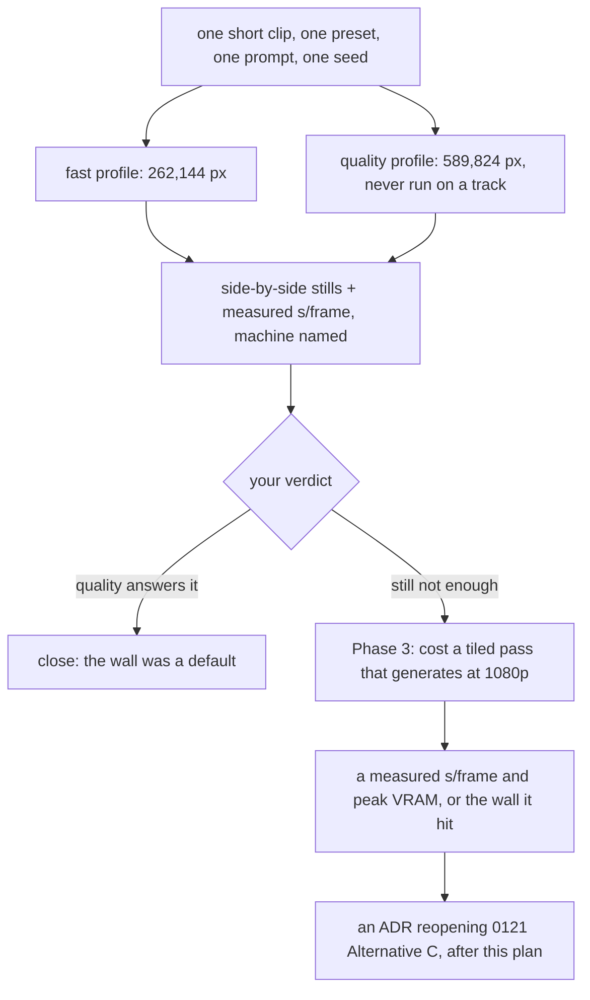

# 0211 — The diffused frame's resolution is measured before it is designed

> **Status:** done - closed 2026-09-27 by a conductor-run close. Phase 1 `2be319f4`, Phase 2 `06e20dec` (the owner's verdict: `quality` answers it), Phase 3 not run by the plan's own terms. Round 1 review: no blockers, no majors, three minors (two fixed at the close). Version: none. Backlog 0125 archived; its residue is backlog 0262.
> **Created:** 2026-09-19
> **Approved:** 2026-09-19 (user) — phases 1-2 run interactively on main; queued in tools/conductor/queue.json 2026-09-27 for its review and close only
> **Owner skill(s):** dev, human
> **Related ADRs:** [0121](../../adrs/0121-the-diffusion-filter-is-an-offline-stage-with-profiles-and-it-interpolates-its-own-stride.md),
> [0071](../../adrs/0071-a-numeric-test-contract-states-a-property-or-names-its-machine.md),
> [0122](../../adrs/0122-a-sidecar-tool-documents-itself-in-one-place.md)
> **Takes:** design-backlog 0125. The entry stays live until Phase 2's verdict, which is what decides
> whether anything further is owed.

## TL;DR

You watched a full-track diffused render and asked for higher resolution. The clip that drew that verdict
was rendered at the `fast` profile — 262,144 px, 680x384, upscaled to 1080p — and the shipping `quality`
profile is 2.25x those pixels and **has never been rendered on a real track**. So this plan measures
before it designs: render the same clip at both budgets, put the stills side by side, and let you say
whether `quality` already answers the ask. Only if it does not does anyone cost the option nobody has
costed. The first deliverable is a pair of pictures, not a design.

## Context & problem

**The ask.** At [Plan 0106](0106-the-frame-stream-passes-through-a-diffusion-model.md)'s Phase 6 human gate on
2026-08-25, on a full-track render of `star_rosewindow`: *"it would obviously be great if resolution
would be higher"* (backlog 0125).

**The cheap first move has not been made.** That clip was rendered at `fast` — a 262,144 px budget,
680x384 at 16:9, resampled to 1920x1080, so every output pixel is inferred. The shipping `quality`
profile is 1024x576, **2.25x the pixels**, and nothing has ever run it end to end on a track. An unknown
and possibly large share of the complaint is therefore a profile choice rather than a wall, and no design
is worth writing until that share is known.

**What is genuinely walled, and why "raise the budget" is not the answer either:**

- **SD1.5 duplicates or mirrors content above roughly 768²** — its native-resolution artefact, named in
  Plan 0106 Phase 1's traps. The budget does not scale smoothly into it.
- **SDXL plus ControlNet is about 7.5 GB against an 8 GB card**, and the spike already peaks at 5.68 GB
  with two ControlNets loaded. Offloading fixes the memory and ruins throughput over thousands of frames,
  which Phase 1 also measured.
- **Cost scales with pixels.** Phase 2b measured 2.721 s/frame at 589,824 px against roughly a third of
  that at 262,144. A 4-minute track at `quality` already measures about 5.9 h *before* the 1.406x scope
  correction Plan 0106 Phase 7d applies to that figure.

**And there is a decision in the way.**
[ADR-0121](../../adrs/0121-the-diffusion-filter-is-an-offline-stage-with-profiles-and-it-interpolates-its-own-stride.md)'s
Alternative C is *diffuse at a smaller budget and upscale*, measured as the cheaper route and **rejected
by you in that design interview**, on the ground that generated detail is worth its price against
inferred detail. This verdict does not obviously overturn that — the ask is for *more* detail and an
upscaler infers rather than generates — but the rejection was made before anyone had watched five minutes
of output. The option neither the ADR nor the plan has costed is a tiled or multi-pass approach that
*generates* at higher resolution.

## Decision

**Measure first, and let the measurement close the plan if it can.** Phase 1 renders one short clip at
both budgets with everything else held identical and puts the stills side by side with their measured
cost. Phase 2 is your verdict, and **it is allowed to end the plan**: if `quality` answers the ask, what
was filed as a wall was a profile default, and the remaining work is a documentation and default change
rather than a design. Only a "still not enough" verdict reaches Phase 3, which costs the one route nobody
has priced — a tiled pass that generates rather than infers.

**No ADR is written ahead of the verdict.** Reopening ADR-0121's Alternative C is a real decision with a
recorded rejection behind it, and it cannot be argued honestly from a clip nobody has rendered. The ADR
is owed after Phase 3, and Phase 2 may mean it is never owed at all.

## Architecture diagram

## Implementation phases

### Phase 1 — the pair nobody has rendered
- **Owner skill:** dev
- **What:** Render the same short clip through the sidecar at both profiles, everything else held
  identical, and record both the stills and the cost.
- **Files touched:** none in the sidecar — this is a run, and its output is the plan's own
  `## Implementation log` plus the two stills under `target/` (uncommitted, like the other judging
  sheets).
- **Done when:** a matched pair exists at 262,144 px and 589,824 px from **one build, one machine, one
  seed, one prompt and one preset**, minutes apart, so the two are comparable to each other rather than
  to a cross-build figure — the discipline
  [ADR-0071](../../adrs/0071-a-numeric-test-contract-states-a-property-or-names-its-machine.md) and
  Plan 0147 Phase 6 both apply. The measured s/frame at each budget is recorded beside the machine and
  GPU that produced it, and the log states the extrapolated cost of a 4-minute track at each. Use
  `star_rosewindow`, the preset the verdict was given on. A clip long enough to judge and short enough to
  render twice — the log names its length rather than this plan guessing it.

### Phase 2 — the verdict
- **Owner skill:** human
- **What:** You read the pair and say whether `quality` answers the ask.
- **Files touched:** the plan's `## Implementation log`.
- **Done when:** the log carries one of three recorded verdicts. **`quality` answers it** — the plan
  closes here, and the followup is which profile should be the documented default given the cost.
  **`quality` helps and is not enough** — Phase 3 runs, with the residual named as concretely as the
  pictures allow. **`quality` changes nothing visible** — Phase 3 runs, and the finding that 2.25x the
  pixels is invisible at this scale is itself the most useful thing in the plan, because it says the
  budget is not the lever. **This phase may end the plan, and that is a success rather than an
  abandonment.**

### Phase 3 — the uncosted route gets a number
- **Owner skill:** dev
- **What:** Cost a tiled or multi-pass pass that *generates* at 1920x1080 rather than upscaling into it,
  against the two walls Plan 0106 Phase 1 measured.
- **Files touched:** `tools/sd-filter/` (a spike, not a shipped profile), and the plan's log.
- **Done when:** the log carries a measured s/frame and a measured peak VRAM for a tiled pass at
  1920x1080 on the named machine, **or** a statement of which wall it hit and at what value — the
  SD1.5 duplication artefact above roughly 768² per tile, or the 8 GB card against a working set the
  spike already takes to 5.68 GB. A number or a named wall both satisfy this phase; what does not is an
  opinion about whether tiling would work. Extrapolate the 4-minute track cost and say it plainly, since
  a route that triples an already 5.9 h render is a different proposition from one that does not.

## Risks & open questions

- **Phase 2 may close the plan, and Phase 3's work then never happens.** That is the design. The risk
  worth naming is the opposite one: treating Phase 1 as a formality and going straight to tiling, which
  is how a 5.9 h/track route gets built to solve a default.
- **A tiled pass may not preserve the geometry ControlNet is holding.** Tile seams in a moving image are
  their own artefact, and a seam that swims across a track is worse than a soft upscale. Phase 3 measures
  cost and VRAM; whether the *picture* survives tiling is a look judgement that would need its own
  rendered pair, and if Phase 3 shows the cost is viable that pair is the next thing owed.
- **Nothing here is gated and nothing here ships.** `tools/sd-filter/` is creator tooling outside the
  workspace, so no suite covers any of it and the cost figures live in exactly one page, which
  `check-filter-figures.mjs` holds them to. **Any figure this plan publishes goes on that page or
  nowhere** — a second copy is what that gate exists to prevent.
- **The runs are long and the loop is slow.** Every phase here is an overnight-scale render on one
  machine, which is why the plan is ordered to spend the cheapest one first.
- **`quality` has never run end to end**, so Phase 1 may find it does not — a crash, a VRAM ceiling, a
  stride interaction. That is a finding and it belongs in the log rather than being worked around.

## What this plan does NOT do

- **It does not add variety across a track.** That is backlog 0126 and
  [Plan 0212](0212-the-diffused-render-gains-a-timeline.md), and 0126 says why they must not be folded
  together: *"one is a pixel budget against a VRAM wall, the other is a timeline the pipeline does not
  have."*
- **It does not reopen ADR-0121's Alternative C.** It produces the evidence that decision needs. The ADR
  comes after Phase 3, in its own session.
- **It does not change the shipped default profile.** If Phase 2 says `quality` answers the ask, moving
  the default is a followup with a cost argument attached, not a silent edit.
- **It does not add an upscaler.** An upscaler infers, the ask is for generated detail, and Alternative C
  was rejected on exactly that ground.
- **It does not touch the engine, `shot`, or any release artefact.**

## Implementation log

> Written by `dev` — one row per phase as that phase's commit lands, and the close block after the
> last one. **The phases above are the contract; everything here is what happened.**

**Lane:** `main` directly (an interactive session; the sidecar needs the CUDA `.venv`, which a conductor session cannot run)

| phase | owner | state | commit |
|---|---|---|---|
| 1 — the pair nobody has rendered | dev | done | 2be319f4 |
| 2 — the verdict | human | done | committed with this row |
| 3 — the uncosted route gets a number | dev | done - not run: Phase 2 closed the plan | committed with this row |

### Notes

- **Phase 1 readings, 2026-09-27.** The clip is 24 s of *Yes, I Know* (0:30-0:54, the owner's
  choice of track), 48 kHz, 720 frames at `--fps 30 --size 1920x1080 --tier rich`, preset
  `presets/star_rosewindow.toml`, prompt *"a stained glass cathedral rose window"*, seed 1234.
  Both runs used one `shot` release build (the 0212 lane's, at `c1fe3eae`), the root `.venv`
  (torch `2.6.0+cu124`), and one machine: the Arch box, RTX 3080 Laptop 8 GB, driver 610.57.04.
  They ran back to back, `fast` from 23:38 and `quality` from 23:45, and nothing else used the GPU.
  Figures are the sidecar's own wall-clock line, which includes model load and colour conversion.

  | profile | diffused at | stride | feedback | s per emitted frame | diffusion call | peak VRAM | 4-min track (7 200 frames) |
  |---|---|---|---|---|---|---|---|
  | `fast` | 680x384 (261 120 px) | 3 | 0.4 | 0.554 | 1.252 s | 3.81 GiB | about 66 min |
  | `quality` | 1024x576 (589 824 px) | 1 | 0.6 | 3.065 | 2.854 s | 4.88 GiB | about 6.1 h |

  **The two profiles differ in stride and feedback as well as in pixels**, so the pair is not a
  pure resolution comparison: `quality` diffuses every frame where `fast` diffuses every third, and
  the two compose the same moment differently. Everything else in the expanded flag line is the same.
  `quality` ran end to end with no crash and no VRAM ceiling. Stills are under
  `target/p0211/` (uncommitted): `pair_t{4,12,20}.png` put the two whole frames side by side,
  `crop_t{4,12,20}.png` put 640x540 centre crops at 1:1 side by side, `fast` on the left. The clips
  are `fast.mp4` and `quality.mp4` beside them.

- **Phase 2 verdict, 2026-09-27 (owner):** *"quality are fine"*: **`quality` answers it.** Per the
  phase's own done-when the plan closes here and Phase 3 does not run. What stays open is the
  followup below: which profile `docs/diffusion-filter.md` documents as the default, given that
  `quality` measured about 5.5x `fast`'s time per frame on this clip.

### Close triggers

- **`presets/` touched:** no
- **Plan header `Closes:`** none — see `**Takes:**`; backlog 0125 stays live until Phase 2's verdict
- **What shipped:** docs-chore-only: a measurement and a verdict, no code
- **Operator docs touched:** none
- **Backlog probes (`node scripts/check-backlog-claims.mjs`):** exit 0; 47 stated reductions hold across 23 live entries, 4 unprobeable
- **Full suite:** not run: no code, test or preset changed. Owed to the conductor's pre-review gate if it runs one
- **Outstanding `human` phases:** none

## Close review

The conductor-run review of round 1 follows in full, as written to its review path, with its
headings moved down two levels to sit under this one. No earlier round exists, so no finding was
resolved by a fix round.

**At the close (2026-09-27):** minors 1 and 2 were repaired in `7af1efc5`. Backlog 0125 moved to the
archive with a `CLOSED` marker and a `### Closed` ledger row, and its residue was filed live as
backlog 0262, which also carries the cost-table disagreement the review noted. The `Approved:` line now
names the queue entry. Minor 3 (the log outweighs the phases) needs no repair and has none. The
upstream CI read green: run 36297464014 on `main` at `4ffed87`. Version: none. The plan is
docs/chore-only, a measurement and a verdict with no code.

### Plan 0211 — Mode 4 review, round 1

Graded at tip `55e414057be238aef44532cf862e4f77409d647b` on branch
`plan-0211-the-diffused-frames-resolution-is-measured-before-it-is-designed`.

**Verdict: Plan 0211 landed cleanly. No blockers, no majors, three minors.** The plan did what it
said it would: it measured the pair before designing anything, and the owner's Phase 2 verdict
(*"quality are fine"*) ended it by the plan's own terms, so Phase 3 correctly never ran.

#### What was checked

- **Commits.** The lane carries nothing beyond `main`. The plan's work is four commits already on
  `main`: `2be319f4` (Phase 1 readings), `06e20dec` (Phase 2 verdict + close block), `4ffed870`
  (queue entry) and `55e41405` (status line). Every one touches only the plan or
  `tools/conductor/queue.json`. No code, test, preset, schema or operator doc changed.
- **Owner tags.** All three phases carry one in-vocabulary `**Owner skill:**` (`dev`, `human`, `dev`).
  No `Blocks merge:` field anywhere.
- **Phase 1 done-when, against the log.** One `shot` build (`c1fe3eae`), one machine (the Arch box, an
  RTX 3080 Laptop 8 GB, driver 610.57.04), one `.venv`/torch, seed 1234, one prompt, preset
  `star_rosewindow`. The runs went back to back (23:38 and 23:45). The clip length is named (24 s,
  720 frames). s/frame is recorded at both budgets beside the machine, and so is the 4-minute
  extrapolation. I checked the arithmetic: 0.554 x 7200 = 3,989 s, about 66 min; 3.065 x 7200 =
  22,068 s, about 6.1 h; the ratio is 5.53x, which the log rounds to "about 5.5x". The `fast` row
  reports 261,120 px, which is what the 262,144 budget actually yields at 680x384. That is correct and
  better than repeating the budget. The log also discloses that the two profiles differ in stride and
  feedback as well as pixels, so the pair is not a pure resolution comparison. That is honest, and the
  profile table in `docs/diffusion-filter.md:109-116` confirms it (`--stride 1/3`, `--feedback 0.6/0.4`).
- **Phase 2.** The log records one of the three allowed verdicts, verbatim and dated: *`quality`
  answers it*.
- **Phase 3.** It was not run and says why. That is the plan's designed outcome ("This phase may end
  the plan, and that is a success").
- **ADR discipline.** No ADR was written and none is owed. The plan says the ADR reopening ADR-0121
  Alternative C comes only after Phase 3, and Phase 3 did not run. ADR-0121 stands unreopened.
- **Figures discipline (ADR-0122, `check-filter-figures.mjs`).** The new figures live only in the
  plan log. That file is a dated record, which the gate deliberately exempts
  (`scripts/check-filter-figures.mjs:110`). No second copy appeared in a reader doc.
- **Lenses 2, 4 and 5** (layering, real-time safety, determinism, seams) have nothing to grade,
  because no source changed.
- **Full suite.** Run in this session through the lock wrapper, as exactly
  `node ".../with-lock.mjs" suite -- cargo nextest run --workspace`. It ran rather than skipping:
  `Summary [ 538.853s] 1858 tests run: 1858 passed (14 slow), 7 skipped`;
  `with-lock: "suite" waited 0.0s, held 539.4s`. The log's `Full suite:` bullet deferred this run to
  the conductor, which is correct in conductor mode.
- **Rustdoc.** `RUSTDOCFLAGS="-D warnings" cargo doc --workspace --no-deps` passed with no warnings.
- **Tree.** Clean before and after. Nothing was committed.

#### Findings

##### minor

1. **`docs/design-backlog.md:1161` — backlog 0125 is live with a bullet the verdict has now
   answered.** The entry's `PARTLY TAKEN` bullet says it *"stays live because the verdict is what
   decides whether anything is owed"*. The verdict is in: `quality` answers it, so what was filed as a
   wall was a profile default. The close block's `Closes: none` could let the close ceremony skip
   step 3c. Left as it is, the live file keeps an entry whose question is settled, and the one real
   residue has no live carrier once the plan moves to `done/`: which profile
   `docs/diffusion-filter.md` documents as the default, given the measured 5.5x cost. **Fix at close
   (Markdown, close-repairable):**
   - Append a dated `CLOSED 2026-09-27 by Plan 0211's Phase 2 verdict` bullet to 0125.
   - Move the body verbatim to `docs/design-backlog-archive.md` with a `### Closed` row.
   - Remove its contents row, and re-run `toc.mjs` and `check-backlog-claims.mjs`.
   - File the residue as a new live entry, or state in the close notes that the plan's
     `## Followups` is its only carrier.

   One thing worth putting into that residue: the canonical page's `What it costs` table
   (`docs/diffusion-filter.md:138-139`) was measured on Windows with `attractor_leviathan` and reads
   7.781 s per emitted frame at `quality`. This plan measured 3.065 s on the same GPU model on Linux
   with `star_rosewindow`. Both are honest, machine-named measurements, but a reader choosing a
   default from that page sees roughly 2.5x the cost this box just measured.
2. **`docs/plans/0211-the-diffused-frames-resolution-is-measured-before-it-is-designed.md:5` — the
   header's `Approved:` line is stale.** It reads *"approved and deliberately NOT in
   `tools/conductor/queue.json`"*, but `4ffed870` queued the plan there for this review and close.
   **Fix at close (close-repairable):** replace the line with
   `> **Approved:** 2026-09-19 (user) — phases 1-2 run interactively on main; queued in tools/conductor/queue.json 2026-09-27 for its review and close only`.
3. **The `## Implementation log` outweighs `## Implementation phases`: 3,180 bytes against 2,900
   bytes.** Lens 1 makes this a minor. It is mitigated: Phase 1's `Files touched` names the log as
   the phase's output, and most of the excess is the measurement table that the done-when asks for.
   **No repair is expected.** This entry records it rather than excusing it.

#### Bookkeeping owed at the close

- **Version bump: none.** The plan is docs/chore-only (a measurement and a verdict, no code), and
  ADR-0005's "none" is the deliberate call here.
- **No paired ADR** to accept.
- **Operator docs:** no sweep owed. Nothing a user observes changed, and moving the default profile
  is explicitly out of scope.
- **`presets/` not touched:** step 3b is not triggered.
- **Steps 1-1e, 3, 3d as usual:**
  - Flip `Status:` to `done` and `git mv` the plan to `docs/plans/done/`.
  - Re-point the inbound link at `docs/design-backlog.md:1161` (or at its archived copy) and the
    plan's outbound `../adrs/` and `done/` links. Also its sibling link to Plan 0212, which becomes
    `../0212-...` if 0212 is still active.
  - Run `check-doc-links.mjs`, `check-backlog-claims.mjs`, `check-index-rows.mjs`,
    `check-translations.mjs` and `toc.mjs`.
  - Refresh `docs/plans/README.md`, with the archive write-up first.
- **Close review section:** this review goes into the plan's `## Close review`. No earlier rounds
  exist.

## Followups (after this lands)

- If Phase 2 says `quality` answers the ask, which profile is the documented default — and what
  `docs/diffusion-filter.md` says the cost of that default is — is the remaining question. It did,
  and the question is live as backlog 0262.
- If Phase 3 shows tiling is affordable, whether the picture survives the seams is the next rendered
  pair, and the ADR reopening ADR-0121 Alternative C follows it.
