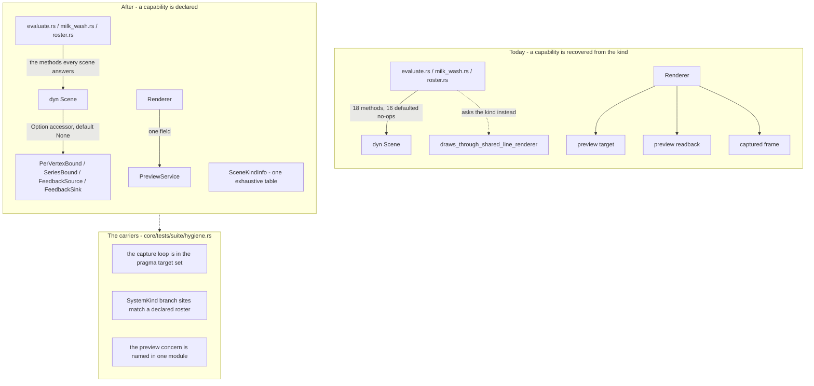

# 0215 — The wide seams narrow, and a guard holds them

> **Status:** done — closed 2026-09-23 under the conductor (ADR-0205). Six phase commits,
> `2faed625` … `a8eab67d`, plus the close block `d83eb601` and the close's own prose repair
> `9b469223`. Mode 4 round 1: **no blockers, no majors**, three minors and two nits — the two
> repairable ones fixed in `9b469223`. Verified: all three parts of ADR-0238 implemented, the three
> new guards each demonstrated failing as well as green, the full suite green on the reviewed tree
> (ADR-0207 ledger, `1801 passed, 7 skipped`), and no preset, frame, C ABI symbol, protocol message
> or config key in the range.
> **Created:** 2026-09-20
> **Owner skill(s):** dev
> **Related ADRs:** [ADR-0238](../../adrs/0238-a-scene-declares-a-capability-and-the-engine-stops-enumerating-kinds.md) (accepted)

## TL;DR

Three abstractions carry more than their callers use, and nothing holds any of them to a shape. The
`Scene` trait has six methods with one implementor each and two with no production caller at all;
`Renderer` owns the preview concern as three loose fields among its own; and the shell's real-time
capture loop — the single most timing-critical loop in the project — sits outside the panic-denial
guard that covers every hot path in `core/`. This plan narrows all three and **gates each one**, so
the narrowing is a property the tree keeps rather than a state it passed through. Nothing a user sees
changes: the acceptance for the whole plan is that the golden suite does not move.

## Context & problem

A standing architectural review on 2026-09-20 swept the tree against layering, real-time safety,
coupling, determinism and design integrity. The mechanical rules came back clean and, more to the
point, **gated** — the core is free of platform and audio-source types, the C ABI's functions match
[spec 0001](../../specs/0001-c-abi.md) exactly, `Expr::eval` allocates nothing, there are no train-wreck
reaches across boundaries, and every direct dependency is exact-pinned with a written justification.
What the sweep found was not rule-breaking. It was **three places where size accumulated without a
carrier**, which is the same failure this repository has already documented at the documentation
layer ([ADR-0116](../../adrs/0116-an-index-row-is-a-pointer-and-a-gate-holds-it-to-one.md)) and at the
comment layer
([ADR-0127](../../adrs/0127-a-comment-carries-the-mechanism-and-the-decision-record-stays-in-docs.md)).

**The `Scene` seam.** Eighteen methods, sixteen defaulted. Six have exactly one implementor across
the fourteen systems; two of those six — `sample_budget`, `active_sample_count` — are reached only by
test assertions. Because a default body cannot answer *whether* a scene has a capability, callers
that need to know branch on `SystemKind` outside the trait instead.
[ADR-0238](../../adrs/0238-a-scene-declares-a-capability-and-the-engine-stops-enumerating-kinds.md)
carries the decision and the one constraint that shapes it: `shares_resources` is asked of a roster
preset whose scene may never have been constructed, so it cannot become a trait method.

**`Renderer`.** Twenty-four fields and roughly sixty-seven public methods across four `impl Renderer`
blocks in four files. The multi-file split is organizational, not architectural: all four blocks
reach the same fields, so nothing is encapsulated behind anything. Four of those fields — the preview
target, its readback, its captured frame, and the secondary present target that borrows the first —
serve one concern, and only the capture path uses it. The frame path is **not** implicated: the
preview take-and-restore lives in `render()`, not in `draw_frame`.

**The capture loop.** `core/tests/suite/hygiene.rs`'s hot-path pragma guard targets `dsp/`,
`render/`, `diag/`, `audio.rs`, `preset/expr.rs`, `milk/`, `core-cabi/src` and `rlx-ring/src`. It does
not target `standalone/src/capture_win.rs` or `capture_mac.rs`, which is where the actual real-time
thread runs. That code is exemplary today — the loop preallocates its silence chunk, takes no lock,
logs nothing and drops on full, all of it documented. **The gap is that nothing holds it there.** The
review's own rule is that a new hot-path module joins the guard; this is the oldest hot-path module
in the shell and it never did.

### Every measurement in this plan is dated evidence, not a contract

Sixteen approved plans sit ahead of this one, and three land on exactly this code:
**[0206](0206-the-browser-shows-the-look.md)** adds another consumer to the preview surface,
**[0209](0209-a-system-joins-the-instruments-by-existing.md)** derives a roster from `SystemKind`,
and **[0203](0203-the-figure-gains-the-levers-it-was-measured-to-lack.md)** touches scene params. Every
count, file list and call-site table in this plan and in ADR-0238 was read on **2026-09-20** and will
be wrong by the time the plan runs.

**`dev` re-derives each list at the phase that needs it and implements against what is there** — the
tables are evidence that a shape exists, never the shape to restore. Accordingly **no done-when below
names a number**: each states a property that holds at any size. A phase whose re-derivation
contradicts this plan's evidence is a finding for the log, not a reason to stop.

## Decision

Take the three findings in one plan, smallest and most safety-critical first, and give each a guard
in the phase that follows it. We rejected splitting the capture-guard fix into its own jump-the-queue
plan (the owner chose a single plan) and rejected landing the refactors without new guards, because
this repository's record is that a convention with no carrier regrows — the two prior instances are
cited above. For the `Scene` seam we took capability traits over documenting the union, over `Any`
downcasting and over a hand-rolled capability record; ADR-0238 carries those. For `Renderer` we take
**the preview concern only** and leave the diagnostics/overlay/text host alone: preview is
self-contained, off the frame path, and Plan 0206 having grown it makes the extraction worth more
rather than less.

## Architecture diagram



## Implementation phases

### Phase 1 — The real-time capture loop joins the pragma guard

- **Owner skill:** dev
- **What:** Split the shell's capture code so the real-time loop is a module of its own carrying the
  panic-denial pragma verbatim, add that module to the hygiene guard's target set, and correct the
  guard's own stale instruction.
- **Files touched:** `standalone/src/capture_win.rs`, `standalone/src/capture_mac.rs` (plus the module
  each gains), `core/tests/suite/hygiene.rs`.
- **Why a split and not a file-level pragma:** the setup half legitimately allocates, formats and
  writes to stderr, and carries an init-time `expect` on the thread spawn. A file-level pragma over
  both halves would have to be escaped where setup lives, and an allow-riddled file satisfies the
  guard's grep-able sentinel without meaning anything — the precise failure the guard's own doc
  comment warns about for moved-out test modules. Extraction is also what this project already did
  for `rlx-ring`.
- **Done when:**
  - The real-time loop — the code that runs between stream start and stop — lives in a module that
    carries the pragma block verbatim, and **deleting that block from it makes
    `hot_path_modules_carry_the_panic_pragma` fail.** That failure is the phase's evidence; establish
    it by trying it, not by reasoning about it.
  - The setup half — endpoint enumeration, COM activation, format negotiation, the friendly-name
    read — is in a module the guard does not target, and its existing `expect`, `eprintln!` and
    `format!` calls are unchanged. No behaviour moves in this phase.
  - Both platform arms are covered, or the arm that is not covered is named in the log with the
    reason. The macOS arm is not built on the reference machine; a compile-checked split there is
    acceptable and should be disclosed as exactly that.
  - `hygiene.rs`'s `PRAGMA_SENTINEL` doc comment names the same set the test's target list names. It
    omits `core/src/milk/` today, which *is* in the target list — and that comment is the instruction
    a developer reads when adding a module.

### Phase 2 — Two methods leave the `Scene` trait

- **Owner skill:** dev
- **What:** Remove `sample_budget` and `active_sample_count` from `Scene`; make them inherent on the
  particles scene and let the tests reach that type directly.
- **Files touched:** `core/src/render/scenes/mod.rs`, `core/src/render/scenes/particles/mod.rs`,
  `core/src/render/tests.rs`, the scene tests that assert them.
- **Done when:**
  - Neither name is a member of `Scene`.
  - The assertions that covered them cover the same values through the concrete scene, with the same
    claims — a budget resolved larger on the render path than in a window, and an active count that
    tracks it. The tests get narrower, not weaker.
  - **No production call site changes, because there are none.** If `dev`'s re-derivation finds a
    production caller that did not exist on 2026-09-20, that is a finding for the log and the method
    stays on the trait behind a capability accessor instead, per Phase 3's pattern.

### Phase 3 — Four capabilities become four traits

- **Owner skill:** dev
- **What:** Implement ADR-0238 parts 1 and 3 — per-vertex binding, series binding, feedback source and
  feedback sink become narrow traits reached through `Option` accessors on `Scene`; the render-side
  static kind facts consolidate into one exhaustive table.
- **Files touched:** `core/src/render/scenes/mod.rs`, `core/src/render/scenes/warp_mesh/mod.rs`,
  `core/src/render/scenes/particles/mod.rs`, `core/src/render/scenes/lines/spectrum.rs`,
  `core/src/render/evaluate.rs`, `core/src/render/milk_wash.rs`, `core/src/render/roster.rs`,
  `core/src/render/transition.rs`.
- **Done when:**
  - Each of the four capabilities is a trait implemented **only** by the scenes that have it, and a
    scene that lacks one returns `None` from the accessor rather than inheriting a no-op body.
  - **A capability asked of a scene that lacks it is observable at the call site.** A test drives a
    binding at a scene without the matching capability and asserts the caller saw the absence — not
    that nothing happened. This is the behavioural half of ADR-0238 and the reason the accessor
    default is `None` rather than a stub.
  - `draws_through_shared_line_renderer` is a field of the consolidated table, still exhaustive, still
    in `render/`. `shares_resources` keeps its current signature over two `SystemKind`s and
    `Transition::pair_shares_resources` is unchanged — **the question is asked of a roster preset that
    may have no scene, and no accessor on a live scene can answer it.**
  - `set_feedback` call sites on receivers that are *not* scenes — the post chain, the stage — are
    untouched. Only the `dyn Scene` sites move.
  - The golden suite does not move.

### Phase 4 — A new kind-branch has to declare itself

- **Owner skill:** dev
- **What:** A hygiene guard asserting that the functions under `core/src/render/` which match
  exhaustively on `SystemKind` are exactly a roster declared in the guard, each with a one-line
  reason.
- **Files touched:** `core/tests/suite/hygiene.rs`.
- **Shape:** the same shape as the guard that holds a frame delta's finiteness check to one place and
  the one that holds `disallowed_methods` exemptions to a named list — a declared roster, not a cap.
- **Done when:**
  - Adding an exhaustive `SystemKind` match under `core/src/render/` fails the guard until its
    function is declared with a reason; removing a declared one that no longer exists also fails.
    Both directions are established, not only the committed-green state.
  - The roster as committed names the sites that exist **on the tree at that moment**, each with the
    reason it is not the consolidated table. It is written from a re-derivation, not from this plan.
  - The guard reads whole files rather than two adjacent lines. The precedent is
    [ADR-0202](../../adrs/0202-a-written-count-of-the-systems-is-refused-by-a-gate.md), whose surviving
    instance was an assertion message.

### Phase 5 — The preview concern gets an owner

- **Owner skill:** dev
- **What:** Extract the preview target, its readback and its captured frame into one type that
  `Renderer` holds as a single field, absorbing whatever surface Plan 0206 added.
- **Files touched:** `core/src/render/mod.rs`, `core/src/render/preview_readback.rs`,
  `core/src/render/preview.rs`, `core/src/render/capture_api.rs`.
- **Done when:**
  - `Renderer` reaches the preview concern through exactly one field. The accessors that opened,
    closed, sized and drained it delegate rather than touching three fields each.
  - `render()`'s per-frame sequence is unchanged in effect: the target is taken for the draw, the copy
    to the swapchain is recorded, and the readback rides the same submission and takes the previous
    frame's map without waiting. **The goldens are the evidence, and they do not move.**
  - The secondary present target still receives the preview when one is open, and the borrow it takes
    goes through the new owner rather than a sibling field.
  - `draw_frame` is not modified. If the re-derivation finds the frame path now implicated — Plan 0206
    is the plausible cause — that is a finding for the log and a scope question for the close, not a
    silent widening.

### Phase 6 — The preview concern stays owned

- **Owner skill:** dev
- **What:** A hygiene guard asserting the preview concern is named in one module.
- **Files touched:** `core/tests/suite/hygiene.rs`.
- **Done when:** reintroducing a second preview-owning field on `Renderer` fails the guard, established
  by trying it. The guard expresses ownership — the identifiers naming the readback and the captured
  frame resolve in one module — rather than counting fields, so it survives the concern growing.

## Data shapes

```rust
// illustrative — not the final interface

// ADR-0238 part 1. One per capability actually reached through `dyn Scene`.
// The default is `None`, so a scene without the capability says so.
pub(crate) trait Scene {
    fn as_per_vertex_bound(&mut self) -> Option<&mut dyn PerVertexBound> { None }
    fn as_series_bound(&mut self) -> Option<&mut dyn SeriesBound> { None }
    fn as_feedback_source(&self) -> Option<&dyn FeedbackSource> { None }
    fn as_feedback_sink(&mut self) -> Option<&mut dyn FeedbackSink> { None }
    // ...the methods every scene answers stay as they are.
}

// ADR-0238 part 3. The render-side static facts about a kind, in one table.
// Exhaustive, in `render/`, extended by a field rather than by a new match.
pub(crate) struct SceneKindInfo {
    pub shares_line_renderer: bool,
}

// Phase 5. `Renderer` holds one of these where it held three fields.
pub(crate) struct PreviewService {
    target: Option<preview::PreviewTarget>,
    readback: Option<preview_readback::PreviewReadback>,
    frame: Option<CaptureImage>,
}
```

## Risks & open questions

- **The tree will have moved, and Phase 5 is where that bites hardest.** Plan 0206 adds a
  thumbnail-render consumer to the preview surface. The mitigation is stated above as a rule rather
  than a hope: every list here is dated evidence, `dev` re-derives, and a contradiction is a log entry.
  If 0206 landed the thumbnail path as a *fourth* preview field, Phase 5 absorbs it; if it landed it
  with an owner of its own already, Phase 5 shrinks to joining the two and the log says so.
- **`set_per_vertex` is the closest of the four capabilities to a hot path.** It is per-binding, not
  per-vertex, so an accessor hop should not be measurable — but that is an assumption, not a
  measurement. If a frame-cost reading moves on the warp-mesh presets, this is the first cause to
  look at, and the fallback is to keep that one method on the trait and record the exception.
- **The `None` arm is a new path.** A caller that writes `let _ = scene.as_feedback_sink()` has
  reproduced the old silent default with more words and passed every test. Phase 3's observability
  done-when is the only thing standing against that, which is why it is a test and not a review note.
- **The macOS capture arm is not built on the reference machine.** Phase 1 can compile-check it and no
  more. Disclose that rather than implying it was exercised; nothing in
  `docs/on-device-validation.md` is owed a new reading, because no behaviour changes.
- **A guard can pass vacuously.** All three new guards are demonstrated failing, not only observed
  green. The hygiene file's own history — a moved-out test module satisfying a `deny` check with an
  `allow` — is why this is written into three separate done-whens.
- **Open question for the close, not for `dev`:** whether the consolidated `SceneKindInfo` table
  should eventually absorb the factory itself. Not in scope here; it would make a fifteenth system a
  single-site edit, and it is a bigger change than this plan earns.

## What this plan does NOT do

- **It does not touch `AppState`.** Forty-five methods over five subsystems, with the data already
  clustered into sub-structs and the behaviour still flat, is a real finding and is not in scope.
- **It does not restructure `run()`**, which mixes roughly a dozen print-and-exit CLI modes with the
  application bootstrap while `cli.rs` already owns flag parsing.
- **It does not shorten `from_toml_str` or the schema exporter's `document`.** Both are load-time, so
  the cost is reviewability rather than frame time; `from_toml_str` being the preset boundary
  validator is what makes it the more interesting of the two.
- **It does not touch the diagnostics, overlay or text host on `Renderer`**, the second extraction the
  review named. Preview only.
- **It does not change the C ABI, the control protocol, the audio callback's behaviour, any preset, or
  any rendered frame.** The pragma moves; the loop does not. The golden suite not moving is the
  plan-level acceptance, and a moved golden is a defect in this plan rather than a new baseline.
- **It does not move `RLX_ABI_VERSION`.** Nothing in the `extern "C"` surface changes.

## Implementation log

> Written by `dev` as the phases land. **The phases above are the contract; this is what happened.**

**Lane:** `plan-0215-the-wide-seams-narrow-and-a-guard-holds-them` in `/home/igor/Work/rlx-plan-0215`

| phase | owner | state | commit |
|---|---|---|---|
| 1 — The real-time capture loop joins the pragma guard | dev | done | 2faed625 |
| 2 — Two methods leave the `Scene` trait | dev | done | c330e18f |
| 3 — Four capabilities become four traits | dev | done | 2a6bdbcf |
| 4 — A new kind-branch has to declare itself | dev | done | 673fced7 |
| 5 — The preview concern gets an owner | dev | done | fdac6e6e |
| 6 — The preview concern stays owned | dev | done | a8eab67d |

### Notes

**Phase 1 — three arms, and two of them unbuilt.** The tree also carries
`standalone/src/capture_linux.rs` (ADR-0131), whose `read_loop` is the real-time thread on the
reference machine, so all three backends were split and the guard targets all three `capture_*/`
directories. Only the Linux arm was built, linted and tested; the Windows and macOS splits are
mechanical moves reviewed by reading and compiled on no host, and the macOS one moved the whole
`define_class!` block, so the ObjC thunk sits inside the guarded module.
**Three slicing sites were rewritten to satisfy the pragma** — `push_silence`'s `&silence[..n]`;
`read_loop`'s `&mut bytes[carry..filled]` and `&samples[..drained.samples]`; `interleave_planar`'s
two indexes plus `handle_audio`'s `&buffers[0]`, `&planes[..plane_count]` and
`&state.scratch[..written]` — each now `get`/`get_mut` with an early return. Every bound is
unreachable at the sizes the callers establish, so behaviour is unchanged on every reachable input,
but this is a code change inside the moved loops rather than a pure move.
`standalone/src/capture_frames.rs` stays out of the guard set: `drain_whole_frames` is called from
the Linux loop and indexes freely, but is a pure helper outside `capture_*/` and the file list.

**Phase 2 — no production caller, and a named factory arm.** The re-derivation found only the two
assertions in `render/scenes/mod.rs`'s test module and a forwarding method on the test-only
`Observed<T>`, gone with the trait method. The tests read the budget off a scene the factory built,
so reaching the concrete type meant the attractor arm of `create` had to be callable alone:
`create_attractor` is that arm verbatim, live/offline ceiling choice included, and the factory calls
it too. ADR-0195 still names `Scene::sample_budget` in prose (line 145) — a dated record, left be.

**Phase 3 — one behavioural change and one accidental guard.** The per-vertex `None` arm changes
what runs, not what is drawn: the old default was a no-op, so a `[per_vertex]` table on a scene
without vertices was evaluated into the renderer's scratch and discarded, and the caller now ends
the walk instead. No frame moves — nothing read those values — and the full suite is the evidence.
One file outside the list, `core/tests/suite/preset.rs`: `declared_params_match_set_param` located a
scene's param roster with `text.find("fn set_param")`, which matched `fn set_param_series` once the
spectrum scene's `impl SeriesBound` landed above its `impl Scene`, and then parsed no arms; it now
searches `fn set_param(`, and that guard was accidentally correct. `Observed<T>` lost three
forwarding methods: it hands out borrows from behind a `RefCell`, which an `as_*` accessor cannot
do, so it takes the `None` default for all four capabilities — its doc's reason for
`mirror_overflow` — and neither scene it observes has any. The ceiling exception was not needed:
`set_per_vertex` goes through an accessor like the rest, and no golden moved.

**Phase 4 — three rows, both directions, and one non-`std` name.** The roster holds `kind_info`,
`create` and the test module's `expected_scene_name`, re-derived on 2026-09-23; nothing else under
`core/src/render/` matches exhaustively on `SystemKind` (`bare_system_extras` has a wildcard arm,
`shares_resources` reads the table). Both directions were established by trying them: a temporary
fourteen-arm `probe_kind_fact` and a temporary stale `probe_row`, both reverted. The guard reaches
for `rlx_core::preset::SystemKind::ALL`, the first non-`std` name in `hygiene.rs`, whose header now
says why the crate under test is not the dependency its std-only claim was about; the alternative,
a hand-written variant list inside the guard, is the staleness ADR-0202 is about.

**Phase 5 — three preview fields, not four.** Plan 0206 has not landed, so `Renderer` carried
`preview`, `preview_readback` and `preview_frame` exactly as the plan's evidence described and the
risk section's thumbnail consumer does not exist; `PreviewService` lives in `render/preview.rs`.
`draw_frame`'s destructuring changed, which is the one line of it that had to: it names `Renderer`'s
fields exhaustively, so three `preview*: _` bindings became one. Nothing else in it moved and the
goldens did not. One test reached into the readback's tap:
`the_declared_pixel_order_is_the_one_the_frames_carry` read
`renderer.preview_readback.tap.texture().format()` and now asks the owner through a `#[cfg(test)]`
`readback_tap_format`; every public preview entry point on `Renderer` keeps its name and signature.
One full-suite run was red on a flake — `standalone::stream_show
a_headless_run_emits_the_roster_the_preset_and_a_preset_error`, which spawns the player and reads
its stdout — then passed alone and on a second full run (`1799 passed, 7 skipped`).

**Phase 6 — struct bodies, a named exemption, and two gates nobody was running.**
`the_preview_concern_is_named_in_one_module` walks every `.rs` file under `core/src/render/`, enters
each `struct` body and collects the fields whose name contains `preview` or whose type names
`Preview*` or `CaptureImage`. Fields in `render/preview.rs` need no row; every other one must be in
`PREVIEW_FIELDS_ELSEWHERE`, and a row naming a field that is not there fails too. Bodies rather than
lines is what separates a field from the parameters and struct literals that spell
`preview: &PreviewTarget` identically — `aux_target.rs` and `preview_readback.rs` both carry one.
The roster, re-derived on 2026-09-23, holds `mod.rs`'s `preview` (`Renderer`'s one door),
`preview_readback.rs`'s `tap` (ADR-0187) and `capture_api.rs`'s `images` — the last being the
headless capture's result set, in the roster because `CaptureImage` had to be a watched type for the
guard to catch a frame slot named something generic. Both directions were established by trying them
(a temporary `probe_last_shot: Option<CaptureImage>` and a temporary stale row, both reverted), and
a third assertion — that the owner still holds a `PreviewReadback` and a `CaptureImage` field —
stops the guard passing on a tree where the concern had been deleted outright. Three files outside
the list repair earlier phases: `cargo doc -D warnings` failed
on two intra-doc links to the `pub(super)` `PreviewService` (`render/preview.rs`'s header,
`preview_readback.rs`'s `impl Renderer` doc), now plain code spans; and `check-comment-hygiene.mjs`
reported four plan-relative narrations — in `render/evaluate.rs`, `render/preview.rs`,
`tests/suite/hygiene.rs` and this phase — all restated as properties, none escaped. Neither gate is
in a phase's `Done when`, which is how both survived the commits that introduced them; only `fmt`,
`clippy` and the test suites ran per phase. Finally, `PreviewService::target` is dead code in a
`-p rlx-core` build — its only caller, `present_aux`, is `#[cfg(feature = "text")]` and the accessor
is not — so no workspace-wide build sees it and it is left alone as a Phase 5 file.

### Close triggers

- **`presets/` touched:** no file under `presets/` is in the range's diff.
- **Plan header `Closes:`** none
- **What shipped:** no feature and no fix — six commits of internal refactor and three new hygiene
  guards, plus the repairs above. The range touches `core/src/render/`, `core/tests/suite/` and
  `standalone/src/capture_*`, and changes no preset, rendered frame, C ABI symbol, control-protocol
  message, flag, env var or `config.toml` key.
- **Operator docs touched:** none. Nothing under `docs/` moved but this plan.
- **Backlog probes (`node scripts/check-backlog-claims.mjs`):** exit 0 — *46 stated reductions still
  hold across all 21 live entries (4 unprobeable)*. Thirty advisory rows report probed paths that
  moved since their entry was stamped; three name paths this range touched (`0154` on
  `standalone/src/capture_win.rs`, `0021` and `0092` on `core/src`).
- **Full suite:** owed to the conductor's pre-review gate (ADR-0207). The last run inside the range
  was Phase 5's `cargo nextest run --workspace` — `1799 passed, 7 skipped`. Phase 6 ran the `-P fast`
  tier (`1722 passed (1 slow), 86 skipped`) plus `cargo fmt --all --check`, `cargo clippy
  --workspace --all-targets -- -D warnings`, `cargo doc --workspace --no-deps` under
  `RUSTDOCFLAGS="-D warnings"`, `check-comment-hygiene.mjs` and `check-system-counts.mjs`, all
  exit 0.
- **Outstanding `human` phases:** none

## Close review

> Mode 4 round 1, 2026-09-23, run as a separate headless session under the conductor (ADR-0205) with
> the plan and the lane and nothing an implementer wrote. Reproduced in full from
> `tools/conductor/state/reviews/0215-round-1.md`; a conductor-run close has no reader in the room,
> so this section is the evidence of what was checked. No earlier round: nothing was raised before
> this one.

**Verdict: Plan 0215 landed cleanly — no blockers, no majors, three minors and two nits.** All six
phases are present, each carries a single in-vocabulary `**Owner skill:** dev` tag, all three parts
of ADR-0238 are implemented, and the three new guards are each demonstrated failing rather than only
observed green. Nothing a user sees changed: no preset, no C ABI symbol, no control-protocol
message, no flag or config key is in the diff, and the golden suite did not move.

### Evidence run in the review sitting

| check | result |
|---|---|
| `node .../with-lock.mjs suite -- cargo nextest run --workspace` | `with-lock: skipped cargo nextest run --workspace: tree 44ac80c is green in the suite ledger, run by gate 0215-pre-review at 2026-09-23T21:06:48.015Z: 1801 tests run: 1801 passed (5 slow), 7 skipped` (ADR-0207 ledger record — lens 1's full-suite evidence) |
| `RUSTDOCFLAGS="-D warnings" cargo doc --workspace --no-deps` | exit 0 |
| `cargo fmt --all --check` | exit 0 |
| `cargo clippy --workspace --all-targets -- -D warnings` | exit 0 |
| `node scripts/check-doc-links.mjs` | OK, 553 tracked files |
| `node scripts/check-backlog-claims.mjs` | OK — 46 reductions across 21 live entries (4 unprobeable); 30 advisory moved-path rows |
| `node scripts/check-index-rows.mjs` | OK, 0 over cap, 0 misshaped |
| `node scripts/check-translations.mjs` | OK, 5 stamped; 3 advisory stale rows |
| `node scripts/toc.mjs --check` | OK, 7 blocks, 646 rows |
| `node scripts/check-comment-hygiene.mjs` | OK, 0 escapes |
| `node scripts/check-system-counts.mjs` | OK |

The log's `Full suite:` says it is owed to the conductor's `pre-review` gate. In conductor mode that
is correct, and the ledger record above is the run.

### Lens 1 — alignment with the plan and ADR-0238

The `## Implementation log` maps all six phases to commits and is claims, not evidence; every
paragraph below is read off the tree.

- **Phase 1.** Three backends were split, not the two the plan named — `capture_linux/` as well,
  which is the arm that actually runs on the reference machine. Each `rt.rs` carries the pragma
  block verbatim and the guard's target list holds all three backend directories. The guard is
  **not vacuous**: `hot_path_modules_carry_the_panic_pragma` asserts `target.exists()` for every
  entry before scanning and `collect_rs_files` panics on a missing directory, and the sentinel test
  is a plain `text.contains(PRAGMA_SENTINEL)` — deleting the block from any scanned file fails it.
  The setup halves keep their `expect`, `eprintln!` and `format!` calls unchanged. The three
  slicing rewrites (`push_silence`, `read_loop`, `interleave_planar` + `handle_audio`) are each
  unreachable at the sizes their callers establish, so behaviour on every reachable input is
  unchanged; see nit 1 for the one place where the new arm differs from its neighbour in what it
  reports. The Windows and macOS arms were not compiled anywhere, which the log discloses; both
  moves were read here and no leftover reference survives — `Duration`, `SampleProducer`,
  `AUDCLNT_BUFFERFLAGS_SILENT`, `AUDCLNT_E_DEVICE_INVALIDATED`, `POLL_INTERVAL` and
  `SILENCE_CHUNK_SAMPLES` are all absent from `capture_win.rs` and present in `capture_win/rt.rs`.
  The fourth done-when — the `PRAGMA_SENTINEL` doc naming the same set the target list names — is
  met for `core/src/milk/`, which it now carries, and was missed for the capture arms; that is
  minor 1.
- **Phase 2.** Neither `sample_budget` nor `active_sample_count` is a member of `Scene`. Both are
  inherent `#[cfg(test)]` methods on `AttractorScene`. The two assertions
  (`the_render_path_resolves_a_larger_budget_than_a_window_does`,
  `a_trace_preset_draws_its_anchor_count_at_1080p`) make the same claims — a budget resolved larger
  on the render path than in a window, and an active count that tracks it — through the concrete
  scene, and they read it off a scene built by `create_attractor`, which is the factory's own arm
  verbatim rather than a restatement of the ceiling law under test. `Observed<T>` lost the
  forwarding method with it. No production caller existed, as the plan expected.
- **Phase 3.** `PerVertexBound`, `SeriesBound`, `FeedbackSource` (`#[cfg(test)]`) and `FeedbackSink`
  are four traits implemented only by `WarpMeshScene`, `SpectrumScene`, `WarpMeshScene` and
  `AttractorScene` respectively; every other scene inherits the `None` accessor. The behavioural
  done-when is met by a real test rather than a review note:
  `a_binding_at_a_scene_without_the_capability_is_answered_at_the_call_site` drives `apply_series`
  and `apply_per_vertex` at a stub declaring neither capability and asserts the two absences are
  answered **differently** — the series lands as element 0 through `set_param`, the per-vertex table
  is never evaluated, evidenced by pre-filled scratch that comes back untouched. That is the
  assertion that would catch a `let _ = scene.as_feedback_sink()` caller, which is the risk the plan
  named. `shares_resources` keeps its signature over two `SystemKind`s and now reads `kind_info`;
  `transition.rs` is not in the diff at all, so `Transition::pair_shares_resources` is unchanged as
  required. The non-scene `set_feedback` sinks are untouched — `live.chain.set_feedback(preset
  .feedback)` in `roster.rs` is byte-identical. `SceneKindInfo` is one exhaustive table with no
  wildcard arm, in `render/`, carrying `shares_line_renderer` as a field. The `preset.rs` repair
  (`find("fn set_param(")`) is a real finding about a guard that was accidentally correct, correctly
  fixed and correctly disclosed.
- **Phase 4.** `every_exhaustive_system_kind_match_is_declared` reads whole files, derives its
  variant roster from `SystemKind::ALL` through `Debug` rather than a hand-written list, and
  attributes a match to the most recent `fn` line. Both directions are asserted: an undeclared site
  fails, and a declared row that no longer matches fails. Arm-versus-array-element is told by the
  `=>` the variant group ends in, which is what stops it convicting the test that enumerates
  independent pairs. The roster's three rows (`kind_info`, `create`, `expected_scene_name`) match
  what the tree holds under `core/src/render/`.
- **Phase 5.** `Renderer` reaches the preview through exactly one field,
  `preview: preview::PreviewService`. Every accessor delegates; none touches two resources directly.
  The per-frame sequence in `render()` is unchanged in effect — take, draw, record the copy, restore,
  `step_readback` before the submission, `arm_readback` after it — and `capture_at_clock` records
  the same order. `draw_frame` is modified only in its exhaustive destructuring, where three
  `preview*: _` bindings became one. `present_aux` takes the secondary present target's borrow
  through `self.preview.target()` rather than a sibling field. `set_adapter`'s reconstruction is
  equivalent: the old code kept a `preview_size` it never used except as an `is_some()`, and the new
  code keeps the boolean.
- **Phase 6.** `the_preview_concern_is_named_in_one_module` walks struct **bodies** at brace depth 1
  under `core/src/render/`, so a parameter list, a struct literal, a `let` binding, a doc comment
  and a commented-out struct are all excluded — each of those five shapes is asserted excluded in
  `the_preview_ownership_guard_reads_fields_not_parameters`, which also asserts the regrown
  three-field `Renderer` is caught. The guard additionally asserts the owner still holds a
  `PreviewReadback` field and a `CaptureImage` field, which is what stops it passing on a tree where
  the concern was deleted outright — the vacuous green the plan's risk section named. The roster's
  three rows are each present in the tree.

Phase tags: all six read `**Owner skill:** dev`, single and in-vocabulary. ADR-0238's three parts are
all implemented, and its one shaping constraint is respected: the `shares_resources` question stays a
kind fact because it is asked of a roster preset whose scene may never exist.

### Lens 2 — layering, coupling, real-time safety

- **Source-agnostic core.** Nothing platform-specific entered `core/`. The whole capture change is
  in `standalone/`, and the new traits name only `wgpu` and crate-internal types.
- **The audio callback.** The three `rt` modules allocate their buffers before the loop, take no
  lock, log nothing and open no file. The pragma now denies `unwrap`/`expect`/indexing/`panic`/
  `unreachable` in each of them, which is the plan's point. One gap survives and is disclosed —
  minor 3.
- **The C ABI.** `core-cabi/` is not in the diff; spec 0001's roster is untouched and
  `RLX_ABI_VERSION` did not move.
- **The control protocol.** `studio/` and `docs/specs/0003` are not in the diff.
- **Seam widening.** `Scene` got narrower, not wider: two methods left outright and four became
  accessors whose bodies live in four traits each implemented by one scene. `FeedbackSource` is
  `#[cfg(test)]`, so the shipped extension seam is unchanged, and the doc says why.
- **Law of Demeter.** Phase 5 removed a train-wreck: `renderer.preview_readback.tap.texture()
  .format()` in `core/src/render/tests.rs` is now `renderer.preview.readback_tap_format()`.

### Lens 3 — doc freshness and release bookkeeping

The range touches no operator-visible surface: no hotkey, menu row, flag, environment variable,
`config.toml` key, OSC address, preset, param, schema or rendered frame. The operator-doc sweep is
therefore empty, and it was confirmed rather than assumed — `git grep` for
`draws_through_shared_line_renderer`, `set_param_series`, `set_per_vertex`, `Scene::sample_budget`,
`active_sample_count` and `feedback_field` across `docs/` and `.claude/` returns only dated records
(ADRs, closed plans, the backlog archive) and this plan, all append-only and correctly left alone.
No `.ru.md` source moved in this range.

- **Preset curation (step 3b):** not triggered — no file under `presets/` is in the diff.
- **Backlog archiving (step 3c):** not triggered — the plan header names no `Closes:`.
- **Backlog probes (step 1c):** green. Three advisory moved-path rows name paths this range touched
  (`0154` on `standalone/src/capture_win.rs`, `0021` and `0092` on `core/src`). Entry `0154`'s body
  was read: its claim is about `CoCreateInstance` in the **setup** half, which this plan left in
  `capture_win.rs` untouched, so the split does not falsify it.
- **Translation advisory (step 1e):** three rows — `docs/how-it-works.ru.md`, `docs/running.ru.md`,
  `packaging/foobar/READ-ME-FIRST.ru.md`. None of the three English sources moved in **this** range;
  the drift predates the lane and is routed, not repaired here.
- **Version bump owed:** yes. This plan is neither a feature nor a fix, and it is not
  docs/chore-only either — it changed shipped `core/` and `standalone/` source. `patch` is the level
  this close takes.

### Lens 4 — correctness and determinism

- **Boundary validation** is untouched: `intake` still validates format once where audio enters,
  and the split moved no check.
- **Determinism.** No wall-clock read and no unseeded randomness entered the diff. `SeededRng` is
  unchanged.
- **No panics in the hot path.** The three capture loops now deny them; `PreviewService`'s methods
  index nothing; `render/preview.rs` already carried the pragma and still does.
- **Aspect.** No `aspect` value in the diff is derived from a grid size; the only occurrence is the
  stub scene's `_aspect: f32` parameter.
- **Numeric assertions.** The range adds no numeric threshold. The moved budget assertions keep the
  tier constants they already compared against, which are exact and dimensionless.
- **One behavioural change, correctly disclosed.** `apply_per_vertex` stops the walk on `None`
  instead of evaluating each binding into the scratch and discarding it, so a `[per_vertex]` table
  on a scene without vertices no longer costs the evaluation. Nothing read those values; the full
  suite and the goldens are the evidence, and the new call-site test asserts the scratch is left as
  the caller handed it over.

### Lens 5 — design integrity

The three narrowings each have a carrier, which is the plan's whole thesis, and each carrier is a
**declared roster rather than a cap** — the shape ADR-0116 argued for one layer up. Dependencies
still point inward. No god module appeared: `PreviewService` took three fields and six accessors out
of `Renderer` rather than adding a fifth job to it. OCP improved on both axes — a new static kind
fact is a field on `SceneKindInfo`, and a fifteenth system is told by the guard which sites it owes.
The one design question the plan left open for the close — whether `SceneKindInfo` should absorb the
factory — is correctly out of scope and is already recorded as an ADR-0238 followup.

### Findings

**minor 1 — `core/tests/suite/hygiene.rs:45`. Fixed in `9b469223`.** The `PRAGMA_SENTINEL` doc named
*"the `rt` module of any `standalone/src/capture_*` backend"*, but the guard's target list holds each
backend's **whole directory** (`capture_rt()` returns `standalone/src/<backend>`, and the comment
beside the list says so deliberately: *"Directories rather than files, so a loop that grows a second
module joins the guard by being put there"*). So a second module placed beside `rt.rs` must carry the
pragma while the instruction a developer reads said only `rt` needs it. Phase 1's fourth done-when is
precisely that the doc *"names the same set the test's target list names"* — the same class of drift
it was written to repair for `core/src/milk/`. The doc now says the directory.

**minor 2 — this plan's `## Implementation log`. Fixed in `9b469223`.** The log ran 179 lines against
the `## Implementation phases` section's 119. The report is not allowed to outweigh the contract, and
nothing gates that property. Every one of the notes carried a real disclosure, so the repair is
compression rather than deletion: the notes are grouped one paragraph per phase and tightened, and
no disclosure was dropped.

**minor 3 — `standalone/src/capture_frames.rs:32`. Left open.** `drain_whole_frames` runs on the
Linux real-time thread — `capture_linux/rt.rs:64` calls it once per read, between stream start and
stop — and indexes and slices freely (`out[..samples]`, `buf[..whole]`, `src[0]`…`src[3]`,
`copy_within`). It sits outside the `capture_*/` directories the guard now targets, so the pragma
does not cover it and nothing holds it where it is. The bounds are established by the caller and the
helper is unit-tested, so this is a coverage gap rather than a live defect — but it is the same gap,
one call deep, that Phase 1 exists to close, and the plan's own rule is that the real-time loop is
*"the code that runs between stream start and stop"*. `dev` disclosed it as outside the phase's file
list, which is the right call for the phase and leaves the decision here. The repair is code plus the
guard set, so it is not one a close may make: rewrite the four bounds as `get`/`get_mut` and add the
file to the pragma target list, or record why the helper stays exempt.

**nit 1 — `standalone/src/capture_linux/rt.rs:53`. Left open.** The new
`let Some(window) = bytes.get_mut(carry..filled) else { return; }` leaves `lost` unset, while the
`stream.read` error path three lines below stores it before returning. Both end the capture thread;
only one tells the shell. The bound is unreachable — `carry < FRAME_BYTES` and the buffer is
`READ_BYTES + FRAME_BYTES` — so this is about which failure the code would report if the invariant
ever broke, not about a reachable path.

**nit 2 — `core/src/render/tests.rs:2986`. Left open.** `Observed<T>` stopped forwarding
`set_feedback`: it now inherits `Scene`'s `None` for `as_feedback_sink`, so `hand_over_active_preset`
would skip the sink entirely for an observed scene that has one. Neither scene observed today
(emitter, shape collage) has the capability and the doc comment says so, but the previous version
forwarded and this one silently will not — an observer wrapped around the attractor would see its
`[feedback]` table dropped with no diagnostic.

## Followups (after this lands)

- The three findings this plan cut — `AppState`'s flat behaviour, `run()`'s subcommand dispatch, and
  the two long load-time functions — want backlog entries with probes, so the next sweep does not
  re-derive them from scratch.
- ADR-0238's open question: whether the consolidated kind table absorbs the factory.
