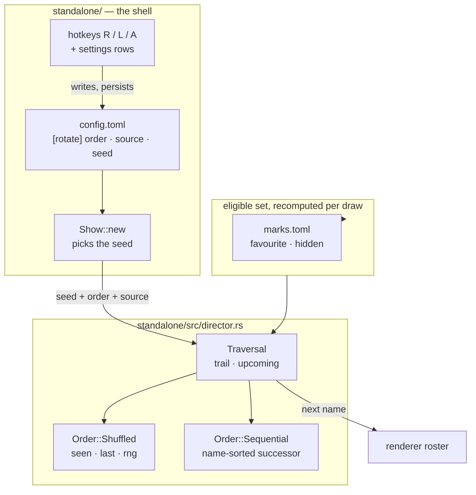

# 0216 — The operator owns the order

> **Status:** done — closed 2026-09-23. Six `dev` phases landed as `14d24213`, `4c50cb3e`,
> `9a40ab42`, `618acd5a`, `a849a8fe`, `fcd7f25c`; the round-1 close review found **no blockers and
> no majors, two minors**, one repaired here as `b3c84fd9`. Verified against the finished tree: the
> full workspace suite (1784 passed, ledger record below), `fmt`, `clippy --workspace
> --all-targets`, `cargo doc --workspace` under `-D warnings`, and the Node gate roster.
> **Created:** 2026-09-20
> **Owner skill(s):** dev
> **Related ADRs:** [0239](../../adrs/0239-rotation-carries-two-orders-and-the-shuffles-seed-varies-per-launch.md) (accepted), [0228](../../adrs/0228-a-preset-mark-is-user-state-keyed-by-name-in-its-own-file.md), [0027](../../adrs/0027-scene-rotation-constant-default-calmer-cadence.md)

## TL;DR

Rotation gains a second order. `Space` and auto-rotate keep drawing from Plan 0205's shuffled
traversal by default, but the operator can switch to a `sequential` walk — alphabetical by preset
name, wrapping — from a settings row, the `R` key, or `[rotate] order` in `config.toml`. The
`[rotate] source` key, which has existed with no in-app control since it shipped, gets the same
three-way treatment on `L`. The shuffle's seed stops being the embedded preset count, so two
launches of one build stop replaying one order. And a favourite is drawn as a warm row in the
browser, because a one-character `*` does not read down a column of forty.

## Context & problem

Watching the running app on 2026-09-20 — the day [Plan
0205](0205-the-library-becomes-navigable.md) closed — the owner reported: *"it feels like
presets are changed by random and there is no setting for that"*, and then: *"I need to have a
setting in app to switch on/off random completely — and to go either by favourites or by all.
Favourite presets should be indicated in preset list (for example by star)."*

Four facts stand behind that, three of them real gaps:

1. **The order has no control at all.** Plan 0205 replaced the roster-successor rule with a shuffled
   traversal; `Space` inherited it. There is no key, no flag and no settings row that changes it.
2. **`[rotate] source` has no in-app control.** The key is read at `standalone/src/config.rs:335`
   and applied at `standalone/src/director.rs:238`, but only a file edit and a restart can set it.
3. **The shuffle does not vary across launches.** Plan 0205's close review, finding 5, left this
   open: `standalone/src/show.rs:173` seeds the traversal from
   `renderer.preset_names().count()` read *before* the reload installs the real library, so the
   number is the embedded count — one per build. The walk is identical every launch.
4. **The star already exists and is not the gap.** `standalone/src/overlay.rs:203` draws `*` for a
   favourite and `-` for a hidden preset, in a one-character column, and
   `standalone/src/console.rs:103` moves those same lines to the operator console — so both lists
   already carry it. What fails is legibility, not presence.

The confusion in the report is itself evidence: auto-rotate was off in the owner's `config.toml`, so
nothing was changing on a timer. Every switch was a `Space` press landing somewhere unpredictable.

## Decision

Take ADR-0239: two orders, `shuffled` by default, both reachable from a settings row, a hotkey and a
config key; the same for `source`; the seed injected by the shell from `[rotate] seed` or varied per
launch. In the director, `Traversal` keeps the shared `trail` and `upcoming` and delegates the draw
to an `Order` whose `Shuffled` variant owns the cycle state and RNG. In the browser, a favourite row
is drawn in a warm colour and the cursor still wins on the highlighted row.

We rejected a mode flag on `Traversal` because `seen` and `rng` would sit dead in sequential mode and
the type's documented no-repeat invariant would stop holding in one of its two modes; we rejected
letting sequential bypass the traversal entirely because `upcoming` (the next-in countdown, the
console's staging line) and `trail` (`Backspace`) would then have two maintainers. For the browser we
rejected tinting only the glyph — it doubles the Lines per row and gives the name-column arithmetic a
second owner — and rejected a bolder 5x7 glyph, which does nothing for scanning a column.

Out of the interview: **standalone only.** The foobar plugin has no rotation, no marks and no
browser, and gains none here.

## Architecture diagram



## Implementation phases

### Phase 1 — `Order` splits out of `Traversal`

- **Owner skill:** dev
- **What:** Move the shuffle's cycle state and RNG into an `Order::Shuffled` variant; `Traversal`
  keeps `trail` and `upcoming` and delegates the draw. `Order::Sequential` returns the successor of
  the last drawn name in the eligible set sorted by name, wrapping at the end. No behaviour change
  yet — nothing constructs `Sequential`.
- **Files touched:** `standalone/src/director.rs`, `standalone/src/director/tests.rs`
- **Done when:** under `Shuffled`, no preset is drawn twice while an unseen eligible preset remains,
  and a cycle never begins on the preset that ended the previous one — the two properties Plan 0205
  argued for, now asserted against the variant rather than the type. Under `Sequential`, repeated
  draws over a fixed eligible set visit every name in ascending name order and wrap to the first.
  `trail` and `upcoming` behave identically under both orders, asserted by a test that runs the same
  sequence through each. **The successor is computed against the eligible set handed to that draw,
  not a list cached at construction** — a test that toggles `hidden` on a preset mid-walk and
  continues shows the walk skipping it without losing its place.

### Phase 2 — the order becomes a config key

- **Owner skill:** dev
- **What:** `[rotate] order`, serialized `"shuffled"` / `"sequential"` in the kebab-case shape
  `RotateSource` already uses, `#[serde(default)]` to `Shuffled`, plus a live setter on the director
  so the value can change without reconstruction.
- **Files touched:** `standalone/src/config.rs`, `standalone/src/director.rs`,
  `standalone/src/show.rs`
- **Done when:** `order = "sequential"` in `config.toml` makes `Space` walk the library
  alphabetically from launch; the key absent leaves the shuffle in place; an unknown value is
  refused the way the neighbouring keys refuse one rather than silently defaulting; and a config
  round-trip preserves the value, asserted beside the existing `source` round-trip test at
  `standalone/src/config.rs:662`.

### Phase 3 — the seed varies per launch, and a key pins it

- **Owner skill:** dev
- **What:** Add `[rotate] seed: Option<u32>`. The shell passes it when set and a launch-varying
  value otherwise, replacing `Traversal::new(renderer.preset_names().count() as u32)` at
  `standalone/src/show.rs:173`. This discharges Plan 0205's close-review finding 5. The seam stays
  injected — `Traversal::new(seed)` does not change, and the headless constructor at
  `standalone/src/show.rs:655` keeps passing an explicit `0`.
- **Files touched:** `standalone/src/config.rs`, `standalone/src/show.rs`
- **Done when:** with no `seed` key, two launches of one build against one library produce different
  first draws under `shuffled`. With `seed = 7`, two launches produce the same first draw. The
  director still reads no clock: every clock read stays in the shell, and a test constructing a
  `Traversal` directly is unaffected. `sequential` ignores the seed entirely.

### Phase 4 — two settings rows and two hotkeys

- **Owner skill:** dev
- **What:** `SettingsRow::Order` and `SettingsRow::Source`, placed immediately after `AutoRotate` and
  before the dwell pair, so the four rotation rows read together. `R` toggles the order and `L`
  cycles the source, both persisting through the one path `toggle_auto_rotate`
  (`standalone/src/app_state.rs:1589`) already uses.
- **Files touched:** `standalone/src/settings.rs`, `standalone/src/settings/tests.rs`,
  `standalone/src/input.rs`, `standalone/src/app_state.rs`, `standalone/src/console.rs`
- **Done when:** the `S` menu shows `Order  shuffled` and `Draw from  all`; left/right changes each
  and the change reaches `config.toml` immediately, as the existing rows do; `R` and `L` do the same
  live and are **inert while the browser is open**, where letters are filter input. `SettingsRow::ALL`
  is 16 entries and `label`, `value` and `edit` are exhaustive over them — the compiler enforces the
  last part, so the test to write is that every row's `value` is non-empty for a default view.
  **The source row names the fallback when it is in it:** with `favourites` selected and nothing
  marked, rotation already draws from the whole eligible set (`standalone/src/director.rs:238`), and
  the row reads as that state rather than printing `favourites` over a library that is all showing.

### Phase 5 — a favourite reads as a warm row

- **Owner skill:** dev
- **What:** A `FAV_COLOR` beside the existing row colours, selected at the browse list's
  `(marker, color)` decision (`standalone/src/hud.rs:288`). The `*` glyph is unchanged.
- **Files touched:** `standalone/src/hud.rs`
- **Done when:** an unhighlighted favourite row draws in `FAV_COLOR` and an unhighlighted plain row
  in `ROW_COLOR`; the highlighted row draws in `ROW_HL_COLOR` whether or not it is a favourite, so
  the cursor is never ambiguous; the settings menu's own rows, which share the pattern twenty lines
  up at `standalone/src/hud.rs:246`, are untouched; and the operator console shows the same colours,
  which it does by construction since `console::route_into` moves these exact lines
  (`standalone/src/console.rs:103`) — assert it rather than assume it.

### Phase 6 — the docs say what the app now does

- **Owner skill:** dev
- **What:** Sweep the operator docs for the two keys, the two rows and the three config keys.
- **Files touched:** `README.md`, `docs/running.md`, `docs/configuration.md`
- **Done when:** both controls tables carry `R` and `L`; `docs/running.md`'s *"Rotation does not
  repeat itself"* paragraph says the shuffle is now a choice and names the default;
  `docs/configuration.md`'s `[rotate]` table carries `order` and `seed` with their defaults, and its
  prose says `seed` is what pins a `--stream` run's walk now that an absent key varies it;
  `node scripts/check-doc-links.mjs`, `node scripts/check-reader-prose.mjs` and
  `node scripts/toc.mjs --check` all exit 0. `docs/running.ru.md` will go stale against its stamp —
  **note it for the close, do not translate it**; correcting the Russian is content work.

## Data shapes

```rust
// illustrative — not the final interface
enum Order {
    /// Owns the cycle state: no repeat while an unseen eligible preset remains.
    Shuffled { seen: Vec<String>, last: Option<String>, rng: u32 },
    /// Stateless: the successor of `last` in the eligible set sorted by name.
    Sequential,
}

struct Traversal {
    order: Order,
    /// Held so the console can name the next preset without the answer moving.
    upcoming: Option<(String, bool)>,
    /// What was actually shown, oldest first — what `Backspace` walks.
    trail: Vec<String>,
}
```

```toml
# config.toml — the [rotate] table after this plan
[rotate]
auto = false
order = "shuffled"     # or "sequential" — alphabetical by preset name
source = "all"         # or "favourites"
# seed = 7             # absent: varies per launch. Set: the walk repeats exactly.
min_dwell_secs = 20
max_dwell_secs = 90
track_change = true
```

## Risks & open questions

- **The `upcoming` announcement under sequential.** `upcoming` exists so the console's staging line
  and the next-in countdown cannot disagree with what the rotation then takes. Sequential makes it
  trivially predictable, which is fine — but the field must still be *taken* rather than recomputed
  at draw time, or a `hidden` toggle between the announcement and the draw makes the two disagree in
  the one order where the operator can see it coming.
- **A varying seed changes the headless `--stream` walk.** Rotation runs on that path even with
  `auto` off (`docs/configuration.md`), so a run someone wants to reproduce needs `[rotate] seed`.
  Phase 6 documents it; nothing enforces it, and a stream run that quietly stops repeating is the
  failure mode to expect if the documentation is thin.
- **Two hotkeys out of a nearly-full keymap.** `A B C D F H S` and every digit are bound. `R` and
  `L` are readable and free today; the next feature has fewer to pick from.
- **`FAV_COLOR` against the hidden mark.** Hidden rows have no colour of their own and keep
  `ROW_COLOR` with a `-` glyph. A preset carrying both marks will draw warm with a `-`, which is the
  glyph's own precedence rule (hidden wins) meeting a colour that says otherwise. Left as-is
  deliberately: a hidden favourite is a rare state, and a third colour to disambiguate it costs more
  than it returns.

## What this plan does NOT do

- **No foobar plugin parity.** Settled in the interview. The plugin keeps remembering the last
  preset by name and gains no marks, no order and no rotation; teaching it to read `marks.toml`
  would make a second reader of a file the standalone owns, which is an ADR of its own.
- **Does not touch the browser's `F4` favourites-only view.** That filters what the *list* shows and
  is a different axis from `[rotate] source`, which filters what rotation *draws from*. Both stay.
- **No dim colour for hidden rows**, and no change to `mark_glyph`.
- **Does not take Plan 0205's open finding 1** (`NAME_CHARS` is 21-vs-18 and
  `star_mandala_bordered` truncates). Same file as Phase 5, different axis; it is a column-budget
  decision and belongs with whoever re-derives the budget.
- **Does not move the director into `core/`.** Rotation stays a shell concern, which is what keeps
  the core source-agnostic.

## Implementation log

> Written by `dev` — one row per phase as that phase's commit lands, and the close block after the
> last one. **The phases above are the contract; everything here is what happened.**

**Lane:** `/home/igor/Work/rlx-plan-0216` on `plan-0216-the-operator-owns-the-order`

| phase | owner | state | commit |
|---|---|---|---|
| 1 — `Order` splits out of `Traversal` | dev | done | `14d24213` |
| 2 — the order becomes a config key | dev | done | `4c50cb3e` |
| 3 — the seed varies per launch, and a key pins it | dev | done | `9a40ab42` |
| 4 — two settings rows and two hotkeys | dev | done | `618acd5a` |
| 5 — a favourite reads as a warm row | dev | done | `a849a8fe` |
| 6 — the docs say what the app now does | dev | done | `fcd7f25c` |

### Notes

- Phase 1: `Order::Sequential` and `Traversal::new_sequential` carry an `#[allow(dead_code)]` while
  nothing but the module's own tests constructs them — `cargo clippy --all-targets` builds the bin
  without `cfg(test)` and rejects both otherwise. Removed in Phase 2, where the config key
  constructs them.
- Phase 2 also edits `docs/configuration.md`, which its file list does not name:
  `standalone/tests/suite/configuration_doc.rs` fails the moment a config key exists that the
  `[rotate]` table and the complete example do not state. Only the table row and the example line
  landed there; the prose is Phase 6's.
- Phase 2: the live setters (`Traversal::set_order`, `Show::set_rotate_order`,
  `Show::set_rotate_source`) carry an `#[allow(dead_code)]` for the same clippy reason as Phase 1 —
  their only callers are Phase 4's rows and hotkeys. `Show::set_rotate_source` is in this phase
  rather than Phase 4 because Phase 4's file list does not name `standalone/src/show.rs`.
- Phase 3's done-when *"two launches of one build produce different first draws"* is asserted over
  `traversal_seed` and the traversal it feeds, not over `launch_seed`: two clock reads in one test
  are not guaranteed to differ where the wall clock is coarse, so the test states that the number
  reaching the traversal moves and that `seed = 7` stops it moving. Nothing asserts that
  `launch_seed` reads the clock.
- Phase 4 also edits `standalone/src/stream.rs`, `standalone/src/console/tests.rs`,
  `standalone/src/show.rs` and `standalone/src/director.rs`, none of which its file list names: the
  first two build a `SettingsView` by literal and stop compiling the moment it gains a field
  (`headless_view` gains a `favourites_marked` argument, computed from the run's marks), and the
  last two lose the `#[allow(dead_code)]` the Phase 2 rows describe now that the hotkeys call them.
  Nothing else in those four files moved.
- Phase 4 adds no control to `standalone/src/console.rs`, which its file list names: the transport
  strip is unchanged and the two rows reach the console through the routing that already moves
  every settings line there.
- Phase 5 puts `FAV_COLOR` in `standalone/src/overlay.rs`, which its file list does not name, rather
  than in `standalone/src/hud.rs`: `overlay` is where `ROW_COLOR` and `ROW_HL_COLOR` live, and
  `hud`'s own module doc states that the browse list's colours live there beside the layout that
  reasons about them. The `(marker, color)` decision moved into `hud::browse_row_style`, which is
  what the tests read.
- Phase 5 also corrects the row count in `hud.rs`'s settings-column comment, which Phase 4's two new
  rows made stale.
- Phase 6 also edits `standalone/src/director.rs` and `standalone/src/director/tests.rs`, which its
  file list does not name: `node scripts/check-comment-hygiene.mjs` found two `no longer` phrases in
  comments Phases 1 and 2 added. Both were reworded to state the property; nothing else moved.
- `docs/running.ru.md` is now staler than its stamp, as the plan's Phase 6 anticipated. Not
  translated. `node scripts/check-translations.mjs` exits 0 and reports it as an advisory row
  alongside `docs/how-it-works.ru.md` and `packaging/foobar/READ-ME-FIRST.ru.md`, both of which were
  already listed before this plan.
- `docs/running.md` also gained a sentence about the warm favourite row, which Phase 6's done-when
  does not ask for; Phase 5 changed what the browser looks like and that page is where the browser
  is described.
- Followup noticed and not acted on: `[rotate] order` and `[rotate] source` are reachable from the
  settings menu and the hotkeys but not from the control protocol, whose `ctl/transport` vocabulary
  carries `next`, `prev`, `auto` and `hold` only. The studio therefore cannot set either.

### Close triggers

- **`presets/` touched:** no
- **Plan header `Closes:`** none — the header carries no `Closes:` line
- **What shipped:** feature
- **Operator docs touched:** `README.md`, `docs/running.md`, `docs/configuration.md`. No generated
  file was regenerated: `presets/README.md`'s params block, `presets/schema/` and `.taplo.toml` are
  untouched, and no preset, param or schema moved.
- **Backlog probes (`node scripts/check-backlog-claims.mjs`):** exit 0 — *46 stated reductions still
  hold across all 21 live entries (4 unprobeable)*. No entry named by this plan.
- **Full suite:** owed to the conductor's pre-review gate (ADR-0207). Per-phase, `cargo nextest run
  --workspace -P fast` was run at Phases 2, 3, 4, 5 and 6 and was green each time — 1705 tests run,
  1705 passed, 86 skipped at the tip. No deferred GPU suite was run under an upward override.
- **Outstanding `human` phases:** none — every phase is `dev`

## Close review

> Round 1, 2026-09-23. Mode 4 in conductor mode (ADR-0205): a separate headless session handed this
> plan and the lane and nothing an implementer wrote. Written to
> `tools/conductor/state/reviews/0216-round-1.md` and reproduced here in full, because a
> conductor-run close has no reader in the room. Lane tip at review `8e7fa1ca`, tree `8f87e8b3`,
> against `main` at `71ba1434`. No earlier round: this plan closed on the first review.

**Verdict: Plan 0216 landed cleanly — no blockers, no majors, two minors.** All six phases are
present, each carries an in-vocabulary `**Owner skill:** dev` tag, every named done-when is met, and
nothing in the diff reaches outside `standalone/` and the operator docs. The two minors are one
root: the sequential walk anchors on the last preset *rotation drew*, not on the preset on screen,
and one doc comment states the stronger claim.

### Evidence

| check | how it was run | result |
|---|---|---|
| Full suite | `node tools/conductor/with-lock.mjs suite -- cargo nextest run --workspace` | `with-lock: skipped cargo nextest run --workspace: tree 8f87e8b is green in the suite ledger, run by gate 0216-pre-review at 2026-09-23T13:18:07.962Z: 1784 tests run: 1784 passed (3 slow), 7 skipped` |
| rustdoc | `RUSTDOCFLAGS="-D warnings" cargo doc --workspace --no-deps` | green |
| fmt | `cargo fmt --all -- --check` | green |
| clippy | `cargo clippy --workspace --all-targets` | green |
| doc links | `node scripts/check-doc-links.mjs` | OK, 553 tracked files |
| index rows | `node scripts/check-index-rows.mjs` | OK, 0 over cap |
| backlog probes | `node scripts/check-backlog-claims.mjs` | OK — 46 reductions across 21 live entries, 4 unprobeable |
| contents blocks | `node scripts/toc.mjs --check` | OK, 7 blocks / 642 rows |
| reader prose | `node scripts/check-reader-prose.mjs` | OK, 16 documents, 0 bare citations |
| comment hygiene | `node scripts/check-comment-hygiene.mjs` | OK, 0 escapes |
| system counts | `node scripts/check-system-counts.mjs` | OK |
| translations | `node scripts/check-translations.mjs` | OK (5 stamped); advisory below |

The `Full suite:` bullet in the log says the run is *"owed to the conductor's pre-review gate
(ADR-0207)"*. In conductor mode that is correct, not a missing run: the wrapper answered from the
ledger record above, written by the process that saw the exit code, against this exact tree.

### Lens 1 — alignment with the plan and ADR-0239

**Phases.** Six phases, six commits, one per phase, in order, plus the log commit:
`14d24213` / `4c50cb3e` / `9a40ab42` / `618acd5a` / `a849a8fe` / `fcd7f25c` / `8e7fa1ca`. Every
phase carries `**Owner skill:** dev`; no phase is missing, added or reordered. The implementation
log is shorter than `## Implementation phases` and records seven out-of-list file edits, each with
its reason — the four that stop compiling when `SettingsView` gains a field, the two
`#[allow(dead_code)]` lifecycles, `FAV_COLOR`'s placement in `overlay.rs` rather than `hud.rs`, and
the two `check-comment-hygiene.mjs` rewordings. Each was checked against the diff and each is
exactly what the note claims; nothing else moved in those files.

**Done-whens, opened and read rather than taken on the log's word.**

- *Phase 1.* `sequential_walks_the_names_in_ascending_order_and_wraps` runs a deliberately
  unsorted eligible set (`echo, alpha, delta, bravo, charlie`) and compares 12 draws against
  `LIBRARY.cycle()` — so a walk that followed the roster fails the sequence rather than only the
  length. `a_sequential_walk_skips_a_preset_hidden_mid_walk_without_losing_its_place` toggles
  `charlie` out between draws and asserts `delta`, then un-hides and asserts the next lap picks
  `charlie` back up in place: that is the plan's *"computed against the eligible set handed to that
  draw"* clause, asserted and not assumed.
  `the_trail_and_the_announcement_behave_the_same_under_both_orders` runs the same seven-call
  sequence through each order, checks peek-twice stability, peek-equals-draw, and that `step_back`
  is the exact reverse of what was drawn — and closes with `assert_ne!(shuffled_drawn, seq_drawn)`,
  a non-vacuity guard that stops the agreement from being one order run twice. That last assertion
  is the difference between this test and a tautology.
- *Phase 2.* `the_rotation_order_defaults_to_the_shuffle_and_round_trips` parses a `[rotate]`
  section written before the key existed and asserts `Shuffled`, then round-trips `Sequential`
  through `to_string_pretty` and asserts the *word* appears. `an_unknown_rotation_order_is_refused`
  asserts the error names the refused value and asserts the neighbouring `source` key refuses the
  same way in the same test, so the two cannot drift into two behaviours. Both sit beside the
  existing `source` round-trip, as the plan asked.
- *Phase 3.* Deviation, declared in the log and correct. The done-when reads *"two launches of one
  build produce different first draws"*; the test states it over `traversal_seed` and the traversal
  it feeds — 64 synthetic launch values must produce more than one distinct first draw — rather
  than over `launch_seed()` itself. Calling the clock twice in one test and demanding two answers
  asserts the host's clock granularity, which is ~15 ms on one of the three platforms this ships
  to; that is ADR-0071's "a frozen number asserted universally" wearing a different hat, and
  refusing to write it is the right call. The consequence, which the log states plainly, is that
  nothing asserts `launch_seed` reads a clock at all. Reading it: it does, under a narrowly scoped
  `#[allow(clippy::disallowed_methods, reason = …)]` in the shell, with a documented
  `unwrap_or(0)` for a pre-epoch clock. `sequential` ignoring the seed is asserted in the same
  test.
- *Phase 4.* `the_rows_are_the_ones_the_menu_promises_in_order` carries `Order` and `Source`
  immediately after `AutoRotate`, which is where the plan placed them;
  `each_row_emits_the_action_its_table_row_names` asserts both directions of both rows are
  *switches* (`SetOrder(Shuffled)` / `SetOrder(Sequential)`), so key repeat settles rather than
  oscillating. `every_row_shows_a_value_for_a_default_view` is the test the plan asked for, over
  all 16 rows. The fallback clause is the strongest part:
  `the_rotation_rows_show_the_config_words_and_the_source_names_its_fallback` drives
  `favourites_marked` false and requires the row to say both `none marked` and `all` — and
  `favourites_marked` is computed as *favourite **and not hidden***, which is exactly the condition
  `eligible_names` falls back on, including the all-hidden early return. The row cannot print
  `favourites` over a library that is all showing.
  Inertness with the browser open: `the_browser_keys_are_function_keys_and_never_letters` now
  asserts `decode_overlay_key(KeyR) == None` and the same for `KeyL`, which routes both into the
  filter branch at `standalone/src/input.rs:197` that returns before the shell's own match. The
  settings modal swallows them separately at `standalone/src/input.rs:99`, and global key repeat is
  dropped at `standalone/src/input.rs:127`, so a held `R` cannot flap the order or rewrite the file.
- *Phase 5.* `a_favourite_row_is_warm_and_the_highlight_outranks_it` asserts the two unhighlighted
  cases by colour and loops both mark states over the highlighted case, so the cursor is
  unambiguous by construction. It opens with `assert_ne!(FAV_COLOR, ROW_COLOR)` — a property, not a
  frozen triple, which is the right shape for a colour constant.
  `the_console_receives_the_row_lines_unchanged` routes a built row through `console::route` in both
  console states and compares the `Line` values, so the plan's *"assert it rather than assume it"*
  is honoured.
- *Phase 6.* Both controls tables carry `R` and `L`; `docs/running.md`'s rotation paragraph is
  rewritten to say the shuffle is a choice and to name the default; `docs/configuration.md`'s
  `[rotate]` table carries `order` and `seed` with their defaults and the prose explains `seed` as
  the `--stream` pin. All three named gates exit 0.

**ADR-0239.** Nothing was silently reversed. `Traversal` keeps `trail` and `upcoming` and delegates
the draw to `Order`; `Shuffled` owns `seen` and `rng`; no field is dead in the other mode. The seed
stays injected — `Traversal::new(seed)` is unchanged, the headless constructor at
`standalone/src/show.rs:701` still passes an explicit `0`, and the choice of *which* number lives in
`traversal_seed`/`launch_seed` in the shell. ADR-0239's Negative bullets are all honoured: the
no-repeat test is restated as a property of the variant with a doc comment saying so; the varying
seed is documented as costing cross-launch reproducibility and `seed` is documented as the pin; the
sequential successor is computed per draw. ADR-0239 is accepted at this close.

### Lens 2 — layering, coupling, real-time safety

- **Source-agnostic core: untouched.** The diff reaches `standalone/` and three markdown files and
  nothing else. No new type crosses into `core/`; `Order`, `RotateOrder` and the seed all sit in the
  shell, which is where rotation has always lived.
- **Audio callback: untouched.** No allocation, lock, log or I/O was added to any capture path.
- **C ABI: untouched.** No `extern "C"` surface moved; spec 0001 needs nothing.
- **Control protocol: untouched, and correctly so.** The log's own followup notes that `order` and
  `source` are not reachable over `ctl/transport`, whose vocabulary is `next` / `prev` / `auto` /
  `hold`. That is the right call: widening spec 0003 is ADR-worthy and a studio-side shim would be
  the same violation from the other lane. `stream.rs::apply_transport` keeps its `_ => {}` arm and
  never sees `SetOrder` / `SetSource`, because `action_for_transport` cannot produce them.
- **Single owner for `source`.** `Director` holds no copy — `standalone/src/director.rs` mentions
  `source` only as `eligible_names`' parameter — so `Show::source` and `config.rotate.source` are
  the only two, kept in step through the one `AppState::set_rotate_source` path, exactly as
  `toggle_auto_rotate` does for `auto`. There is no third reader able to disagree.
- **No god module.** `browse_row_style` extracts the `(marker, colour)` decision into one named
  function with its precedence rule in the doc comment, and the settings rows are deliberately not
  routed through it (they carry no marks); `FAV_COLOR` sits in `overlay.rs` beside `ROW_COLOR` and
  `ROW_HL_COLOR` rather than in `hud.rs`, which is the correct home.

### Lens 3 — doc freshness and release bookkeeping

- **Operator-doc sweep.** `README.md` Controls, `docs/running.md` (prose + Controls + the browser
  section's warm-row sentence + the `S`-row's enumeration of menu rows) and `docs/configuration.md`
  (`[rotate]` table, the order/source prose, the `seed` prose, the complete example) all carry the
  change. `standalone/tests/suite/configuration_doc.rs` is what forced the `order` row and example
  line into Phase 2 rather than Phase 6, which the log records.
- **Checked and correctly *not* swept:** `docs/capturing.md` (no `shot`/`--render` flag moved),
  `docs/testing.md`, `docs/how-it-works.md`, `docs/embedding.md`, `docs/specs/0003`,
  `docs/nfr.md`, `docs/on-device-validation.md`, `docs/presets.md`, `presets/README.md` and
  `presets/schema/` (no `ParamSpec`, structural table or `SystemKind` moved — the log's
  "no generated file was regenerated" bullet checks out), `docs/developing.md`, `docs/releasing.md`.
  The three `packaging/*/READ-ME-FIRST.md` key lists are a **deliberately abridged** tester subset —
  they already omit `C`, `B`, `Backspace`, `F1` and `F2` — so omitting `R` and `L` is consistent
  with what those pages are, not a gap. No new document was created, so the `PUBLISHED` map in
  `site/src/plugins/rewrite-links.mjs` needs nothing.
- **Translation advisory** (`node scripts/check-translations.mjs`, exit 0, the advisory block is the
  reading): three rows, and only one is this plan's —
  `docs/running.ru.md` stamped `b3015078` against a source now at `fcd7f25c4b`.
  `docs/how-it-works.ru.md` (`1ad9c6f8` vs `d3550166de`) and
  `packaging/foobar/READ-ME-FIRST.ru.md` (`f2b0048b` vs `d6e275e6db`) were both already listed
  before this plan. Phase 6 anticipated the `running.ru.md` row and said *"note it for the close, do
  not translate it"*; correcting the Russian is content work and is routed, not done here. This is
  `running.ru.md`'s **first** close stale, so ADR-0185's three-closes-running signal is not yet in
  play.
- **Preset curation (step 3b): not triggered.** `presets/` is untouched, and the plan fixed no
  engine defect a preset could have been written around.
- **Backlog (step 3c): not triggered.** The plan header carries no `Closes:` line; the probes are
  green and no live entry is named. The advisory's 31 moved paths and 4 unprobeable claims are
  unchanged in kind from the last close.
- **Version bump owed.** `What shipped: feature`, and the tree agrees — two new config keys, two
  settings rows, two hotkeys and a new row colour. **Minor**, from `0.143.1`.

### Lens 4 — correctness and determinism

- **Determinism.** The traversal reads no clock: `standalone/src/director.rs` carries no time type,
  and the single `SystemTime::now()` sits in `launch_seed()` in the shell under a scoped allow whose
  `reason` names why. That is exactly where ADR-0239 put the seam. `sequential` is a pure function
  of the eligible set and `last`.
- **No panics on a live path.** Every `expect` added is inside `#[cfg(test)]`. `pool.len().max(1)`
  still guards the modulo; `pool.get(index)` still returns `Option`.
- **Aspect ratio (ADR-0037).** Not in play — `git grep aspect` over the diff is empty. No geometry
  moved.
- **Numeric assertions (ADR-0071).** No frozen measurement was added. `FAV_COLOR` is asserted only
  as *different from* `ROW_COLOR`; the seed test asserts *"more than one distinct first draw"*
  rather than a specific draw; the only literal sequence asserted is an alphabetical one, which is
  a property of the sort. No driver, adapter or platform name was added to a comment.
- **The two-sources-agree habit.** The one place this plan could have been fooled is
  `favourites_marked`: a view flag computed in `app_state.rs` and in `stream.rs` that must agree
  with `eligible_names`' fallback in `director.rs`. They are three expressions of one condition.
  Traced: `eligible_names` falls back when `visible` intersected with the favourites is empty *or*
  when `visible` is empty (all hidden); `favourites_marked` is `any(favourite && !hidden)`, which is
  false in both of those cases and true in neither other. The settings row cannot lie in either
  direction. The two call sites are byte-identical predicates; a future third would be the place
  this drifts, and the flag's doc comment says what it means rather than how it is computed, which
  is the right defence.
- **`Order` state on an order switch.** `set_order` no-ops when the named order is already running,
  so a surface restating it cannot restart a shuffle's cycle; a genuine switch drops the announced
  `upcoming` (which the departing order chose) and `Show::set_rotate_order` refreshes it in the same
  call, so the console cannot be left naming a preset the outgoing order would have taken.
  Re-seeding from the held `rotate_seed` rather than from the mixer's current state means
  `R` pressed twice restarts the same shuffle from its first draw — deliberate, documented on the
  `rotate_seed` field, and the price of keeping a pinned `seed` meaningful across a toggle.

### Lens 5 — design integrity

Dependencies still point inward: the shell reads `core`'s roster and no core type learned about
rotation. The three seams are intact — nothing was added to the C ABI, `Scene` is untouched, and
spec 0003 was deliberately not widened. `Order` is the right shape for OCP here: a third order is a
variant plus two match arms and touches neither `Traversal`'s shared half nor `Show`. No
train-wreck reach appeared; `Show` destructures itself to hand `eligible_names` three borrows rather
than letting a caller walk into its fields. No new hot-path directory was created, so Plan 0002's
`hygiene.rs` scan set needs no extension.

### Findings

#### minor — `standalone/src/director.rs:365` — `set_order`'s doc claims an anchor the field does not hold

`Traversal::set_order`'s doc comment said *"a sequential walk picked up mid-show continues from the
preset on screen rather than from the top of the library."* `self.last` moves only inside `draw`;
`note_shown` records the trail and leaves it alone. So the walk continues from the last preset
**rotation drew**, which is not the preset on screen after a browser pick, a `1`-`9` favourite-slot
press or a `Backspace` — and is `None`, giving the alphabetically first preset, when the order is
switched before rotation has drawn anything this launch.

The behaviour is defensible; the sentence was not. Comment text, so ADR-0209 let this close repair
it: **repaired in `b3c84fd9`**, which states the mechanism instead — the walk continues from the
last preset rotation drew, or from the first name in the library when it has drawn none.

#### minor — `standalone/src/director.rs:474` — under `sequential`, `Space` after a manual pick does not continue from what is on screen

The behavioural half of the finding above, **left open** because the repair is a design call rather
than an edit. `Order::Sequential` takes the successor of `last`, and `last` is the last *drawn*
name. Concretely, with a library `alpha … echo` and `order = "sequential"`: `Space` → `alpha`,
`Space` → `bravo`, open the browser and pick `echo`, `Space` → **`charlie`**, not `alpha`.

Nothing in the plan's done-whens asks for anything else, and the shuffle has carried the same shape
since Plan 0205 — a browser pick never enters `seen` either, so it can be re-drawn immediately.
Sequential order is what makes it *visible*, because it is the one order in which the operator can
predict the answer and notice it is wrong. It also leaves ADR-0239's first Positive bullet — *"the
manual `Space` key can be made to mean the next preset again, which is what it meant before Plan
0205"* — only partly delivered: the pre-0205 rule took the roster successor of the **active index**,
which did follow a manual pick.

The question worth deciding is whether a manual selection should re-anchor the traversal (and, under
the shuffle, count as seen). That is an architect call with a fair case on both sides — re-anchoring
makes `Space` mean "next after this", not re-anchoring keeps rotation's own thread intact across a
detour — so it is filed as a followup rather than repaired.

### Findings from earlier rounds

None. This plan closed on its first review round.
