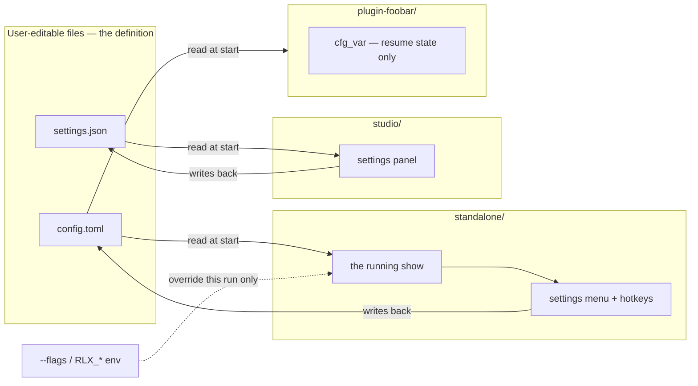

# 0217 — Every setting has a file, and a gate says so

> **Status:** done. Phases 14ae5f69, 776b946f, e3184783, 1eb144fa, and close repairs 80bf58cb. The conductor-run Mode 4 review (round 1) found no blockers and no majors. It raised three minors and one nit, and the two that prose could fix were fixed. Verified: the full suite green in the ledger, plus fmt, clippy, rustdoc and the new gate over its fixtures.
> **Created:** 2026-09-20
> **Owner skill(s):** dev, studio-builder
> **Related ADRs:** [0240](../../adrs/0240-a-setting-lives-in-a-file-and-the-menu-edits-that-file.md)

## TL;DR

[ADR-0240](../../adrs/0240-a-setting-lives-in-a-file-and-the-menu-edits-that-file.md) makes a file the
definition of every setting and the in-app menu an editor of that file. This plan makes that true
and keeps it true: the one live violation — the diagnostics overlay, which the settings menu and
`F3` both toggle and nothing persists — gets a `[hud] diagnostics` key, and two checks make a
future violation fail rather than ship. A user who turns the overlay on finds it on after a
restart, and a user who wants it on from the start writes one line in `config.toml` without
launching anything.

## Context & problem

The standalone already honours the rule fourteen rows out of fifteen. `config.toml` is read at
startup and written back whenever a hotkey or a settings row changes a choice, every other
`SettingsRow` maps to a `[section] key`, and `standalone/tests/suite/configuration_doc.rs` already
holds `docs/configuration.md` to the config schema and to the flag roster.

What is missing is the part that makes it a rule rather than a habit:

- **`SettingsRow::Diagnostics` persists nowhere.** No field in `standalone/src/config.rs`, no row in
  `docs/configuration.md`. `docs/running.md`'s Controls table documents the hole — *"Every change
  applies immediately and (except diagnostics) is written to `config.toml`"* — which is how it
  survived: a hole that is written down reads as a decision.
- **Nothing connects a menu row to a key.** `configuration_doc.rs` checks that every key the config
  serialises is *documented*; no check runs the other way, from the thing the user can change to
  the key that must hold it. A fifteenth menu row with no key would be green everywhere.
- **The other two applications are unguarded.** The studio persists through
  `studio/electron/settings.ts` and uses no browser storage today, which is a fact about the code
  as it stands rather than a property anything holds. The plugin declares one host-side
  `cfg_string`, and whether that is resume state or a setting is currently nobody's claim.

## Decision

Repair the violation, then build the two checks the rule needs, each in the place that can actually
see its half: a **Rust test** for the standalone, because the row-to-key property needs the types;
a **Node gate** on the roster ([ADR-0217](../../adrs/0217-the-node-gate-roster-is-one-manifest-and-a-checker-holds-every-carrier-to-it.md))
for the cross-language halves, because one carrier beats two and that roster already runs in the
hook, in CI and under the conductor; and a **vitest test** inside the studio for its own third
copy. We rejected a single universal gate (it would have to parse Rust types out of source text to
see the property the Rust test gets for free) and rejected leaving the studio and plugin to review
alone (the rule binds all three applications, and a rule with no carrier is what ADR-0240's
Alternative C rejects).

The plugin's one `cfg_string` is **resume state, not a setting**: it records which preset was on
screen, exactly the thing ADR-0240's bound excludes. The repair there is a claim in
`docs/configuration.md` naming it as such, which is also what lets the gate tell resume state from
an unclaimed setting.

## Architecture diagram



## Implementation phases

### Phase 1 — The diagnostics overlay gets a key
- **Owner skill:** `dev`
- **What:** `[hud] diagnostics` joins the config, `F3` and the `Diagnostics` row write it back like
  every sibling row, and the documented exception goes away.
- **Files touched:** `standalone/src/config.rs`, `standalone/src/settings.rs`,
  `standalone/src/run.rs` (or wherever `ToggleDiagnostics` is executed and the overlay's initial
  state is set), `standalone/tests/suite/configuration_doc.rs` (the complete-example round trip),
  `docs/configuration.md` (the `[hud]` table and the complete file),
  `docs/running.md` (the Controls table's `S` row and the settings-menu paragraph),
  `docs/running.ru.md` if its source moved.
- **Done when:** a `config.toml` carrying `diagnostics = true` under `[hud]` starts the app with
  the overlay already painted; toggling it with `F3` or from the menu and restarting comes back to
  what was left; the complete example in `docs/configuration.md` still parses to
  `Config::default()`; and no sentence anywhere still says a settings change is not written to the
  file.

### Phase 2 — Every settings row declares the key it edits
- **Owner skill:** `dev`
- **What:** each `SettingsRow` declares either the `config.toml` path it edits (`"hud.diagnostics"`)
  or that it edits nothing, through an exhaustive match so a new row cannot be added without
  answering; a test asserts every declared path resolves in a serialised `Config::default()`.
- **Files touched:** `standalone/src/settings.rs`, `standalone/src/settings/tests.rs`,
  `standalone/tests/suite/configuration_doc.rs`.
- **Done when:** removing the `[hud] diagnostics` field from `Config` fails the test with a message
  naming the row whose declared path no longer resolves; a row declared read-only states why in one
  line; and the declared leaf key of every row is named in `docs/configuration.md` in backticks —
  the property `configuration_doc.rs` already asserts for the schema, now reached from the menu
  side. The `Presets` row is the one read-only row and stays so.

### Phase 3 — A gate for the two applications a Rust test cannot see
- **Owner skill:** `dev`
- **What:** `scripts/check-settings-have-files.mjs`, joined to the roster in
  `scripts/gates.manifest.mjs`, asserting two properties: no browser-storage persistence
  (`localStorage`, `sessionStorage`, `indexedDB`) anywhere under `studio/` outside its own
  allowlist, and every `cfg_*` declaration under `plugin-foobar/` named in `docs/configuration.md`.
  Plus the short section in `docs/configuration.md` naming what the plugin keeps host-side and why
  it is resume state rather than a setting.
- **Files touched:** `scripts/check-settings-have-files.mjs`, `scripts/gates.manifest.mjs`,
  `scripts/fixtures/` (the seeded bite checks, in the shape the sibling gates use),
  `.githooks/pre-push`, `.github/workflows/ci.yml` (the `links` job),
  `docs/configuration.md`, `docs/developing.md` (the gate roster a reader walks).
- **Done when:** the seeded fixtures bite both halves — a `localStorage.setItem` under `studio/`
  and a `cfg_int` in a plugin source no document names each exit non-zero and print the file and
  line; the real tree is green; and `node scripts/check-gate-carriers.mjs` is green, which is what
  says the hook and the CI job took the new row in the manifest's order. Excluding a studio path
  from the browser-storage check requires a reason in the allowlist beside it.

### Phase 4 — The studio's own third copy
- **Owner skill:** `studio-builder`
- **What:** a vitest test holding `StudioSettings` and `studio/README.md` to each other, so a new
  studio setting cannot reach the panel without both a key in the settings file and a documented
  row — the pattern `configuration_doc.rs` uses on the Rust side.
- **Files touched:** `studio/electron/settings.test.ts` (or a sibling test file),
  `studio/README.md`.
- **Done when:** adding a key to `StudioSettings` with no row in `studio/README.md` fails the test
  naming the key, and the reverse also fails; `npx vitest run` in `studio/` is green on the tree as
  it stands, with both existing keys already satisfying it.

## Data shapes

```rust
// illustrative — not the final interface
impl SettingsRow {
    /// The `config.toml` path this row edits, or `None` for the one read-only row.
    /// Exhaustive on purpose: a new row cannot be added without answering this.
    fn config_path(self) -> Option<&'static str> {
        match self {
            SettingsRow::Quality => Some("quality.tier"),
            SettingsRow::Diagnostics => Some("hud.diagnostics"),
            // The path display: it shows where the presets are and changes nothing.
            SettingsRow::Presets => None,
            // …
        }
    }
}
```

## Risks & open questions

- **The overlay's default is a product call, not a mechanical one.** `false` keeps today's
  behaviour and is the safe answer; anything else changes what a new install looks like. Take
  `false` unless the user says otherwise.
- **A grep-shaped gate produces false positives.** A comment or a string mentioning `localStorage`
  would bite. The allowlist is the escape, and it takes a reason beside each entry — the shape
  `check-comment-hygiene.mjs` already uses with `hygiene-allow:`.
- **`Option`-shaped keys are invisible to a walk of the serialised default** (ADR-0240's Negative
  section, and the workaround already in `configuration_doc.rs` for the two `display_name` keys).
  If Phase 2's path check walks a default serialisation, an optional key declared by a future row
  will report as unresolved; walk a value with the optional keys set, as the existing test does.
- **The plugin half has no test harness behind it.** Nothing compiles `plugin-foobar/` in CI, so
  the Node gate reading its source text is the whole of the enforcement there, and it can only see
  declarations spelled the way it greps for.

## What this plan does NOT do

- **No flag is added.** ADR-0240 puts flags second and only where a run needs to override a rig;
  `[hud] diagnostics` is set once per machine, so it gets no flag and no environment variable.
- **No migration machinery.** The compatibility cost ADR-0240 names is real and stays unaddressed:
  nothing here renames a shipped key, and nothing here builds the migration that a rename would
  need.
- **No change to `marks.toml`, to the preset files, or to the control protocol.** Marks stay user
  state in their own file (ADR-0228), and no OSC address moves.
- **No audit of the studio's React state.** Panel widths, scroll positions and which view is open
  are momentary view state under ADR-0240's bound and owe no key.

## Implementation log

> Written by `dev` — one row per phase as that phase's commit lands, and the close block after the
> last one. **The phases above are the contract; everything here is what happened.**

**Lane:** `plan-0217-every-setting-has-a-file-and-a-gate-says-so` in `/home/igor/Work/rlx-plan-0217`

| phase | owner | state | commit |
|---|---|---|---|
| 1 — The diagnostics overlay gets a key | dev | done | 14ae5f69 |
| 2 — Every settings row declares the key it edits | dev | done | 776b946f |
| 3 — A gate for the two applications a Rust test cannot see | dev | done | committed with this row |
| 4 — The studio's own third copy | studio-builder | done | committed with this row |

### Notes

- **Phase 1's first done-when is asserted by construction rather than by a launched window.**
  Nothing in the suite builds an `AppState` — it needs a winit window — so "a `config.toml`
  carrying `diagnostics = true` starts with the overlay painted" is carried by
  `AppState::new` calling the same `renderer.set_overlay` that `toggle_diagnostics` calls, seeded
  from `config.hud.diagnostics`. The round trip through the file is asserted in
  `config.rs`'s `the_diagnostics_overlay_defaults_off_and_round_trips`.
- **Phase 2's two menu-side tests are unit tests in `standalone/src/settings/tests.rs`, not in
  `standalone/tests/suite/configuration_doc.rs`.** `SettingsRow` lives in the `ritmolux` binary
  rather than in the `standalone` library, so an integration test cannot reach it — the same wall
  that makes `configuration_doc.rs` shell out to `--help` for the flag roster. The listed file gets
  a paragraph in its module doc naming where the fourth property lives and why.
- **Phase 2's first done-when was verified by mutating the declared path, not by removing the
  `Config` field.** Removing `hud.diagnostics` from `Config` is a compile error at the two
  production reads in `app_state.rs` before any test runs. Spelling the path
  `hud.diagnostics_MUTANT` instead fails both new tests with
  `["Diagnostics -> hud.diagnostics_MUTANT"]`, which is the message the criterion asks for.
- `SettingsRow::edit` now returns `None` for any row whose `config_path` is empty, so "read-only"
  is the declaration rather than a second hand-written arm. The `Presets` arm stays for
  exhaustiveness.
- **Phase 3's allowlist is the inline `settings-allow: <reason>` marker, not a list of paths in the
  script.** The plan's Risks section points at `check-comment-hygiene.mjs`'s `hygiene-allow:` for
  the shape, and that shape is a marker on the line; a path list would also have had nothing to
  exclude today (`studio/` has zero browser-storage hits), so its reason-is-required half would
  have been unexercised in both the repository and the fixture. A marker with no reason after the
  colon is itself a finding, and the fixture seeds that.
- Fixture counts: `node scripts/check-settings-have-files.mjs scripts/fixtures/settings-files`
  exits 1 with five breaks across two files, and the real tree is green. The fixtures must stay
  **tracked** — the gate enumerates from `git ls-files`, so an untracked copy of that tree reports
  zero sources scanned and exits 0.
- **Noticed and not acted on:** `README.md`'s `scripts/` block names a selection of the Node gates
  in prose and does not name this one. It is outside Phase 3's `Files touched`, and the block is a
  selection rather than a roster, so nothing was changed there.
- **Phase 4's check is a sibling file, `studio/electron/settings.doc.test.ts`,** rather than an
  addition to `settings.test.ts`. That file holds the *behaviour* of reading and writing the
  settings file; this one holds a declaration to a document, reads no settings and asserts no
  degradation path, and the plan's `Files touched` allows the sibling.
- **It reads `StudioSettings` as source text, because a TypeScript interface is erased before
  anything runs.** There is no `Config::default()` on this side to serialise and walk, so the
  choices were a parse of the declaration or a hand-maintained runtime roster with a type-level
  exhaustiveness guard. The parse was taken: it leaves nothing to keep in sync, so the declaration a
  developer edits is the one the test reads. Both parsers throw on an empty read, and a third test
  asserts a known key from each side, so the two diffs cannot pass by finding nothing.
- **Both done-when mutations were run.** Adding `mutantKey?: string` to `StudioSettings` fails with
  `expected [ 'mutantKey' ] to deeply equal []`; adding a `mutantRow` row to the README table fails
  the reverse test the same way. Both were reverted.
- **The new section names browser storage in `studio/README.md`, which the Phase 3 gate does not
  read** — `.md` is outside its `STUDIO_EXTENSIONS`, so the prose needs no `settings-allow:` marker.
  The new `.ts` file is in scope and deliberately names none of the three APIs.
- **The phase's second done-when is NOT green on this machine, for a reason that predates the phase
  and is outside it.** `npm --prefix studio test` reports `2 failed | 30 passed (32)` test files
  with `280 passed (280)` tests: `electron/window.csp.test.ts` and
  `electron/ipc/presetHandlers.test.ts` fail to **collect** at `import 'electron'` with *"Electron
  failed to install correctly"*. `studio/node_modules/electron/` has no `path.txt` and an almost
  empty `dist/`, because npm's `allowScripts` policy on this machine has never approved
  `electron@32.1.2`'s `postinstall` (`npm --prefix studio install-scripts ls` lists it beside the
  two `esbuild` builds). `npm rebuild electron` does not download it for the same reason. Approving
  an install script and fetching the binary is a supply-chain decision and writes outside the
  phase's `Files touched`, so this session did neither. Everything the phase owns is green:
  typecheck (all four projects), lint, and every test that collects, including the three new ones.

### Close triggers

- **`presets/` touched:**
- **Plan header `Closes:`** none
- **What shipped:**
- **Operator docs touched:**
- **Backlog probes (`node scripts/check-backlog-claims.mjs`):**
- **Full suite:**
- **Outstanding `human` phases:**

## Close review

Conductor-run, round 1 (2026-09-24), in a fresh session. No earlier round, so no findings resolved
by a fix round.

**Verdict:** Plan 0217 landed cleanly. No blockers and no majors. There are three minors and one nit,
and the close fixed the two that prose could fix, in `80bf58cb`.

### Evidence

- **Full suite:** the lock wrapper printed `with-lock: skipped cargo nextest run --workspace: tree
  6dd9cca is green in the suite ledger, run by gate 0217-pre-review at 2026-09-24T05:19:21.481Z:
  1801 tests run: 1801 passed (5 slow), 7 skipped`. That ledger record is this review's full-suite
  evidence (ADR-0207).
- `cargo fmt --check`, `cargo clippy --workspace --all-targets -D warnings` and
  `RUSTDOCFLAGS="-D warnings" cargo doc --workspace --no-deps` all passed.
- `node scripts/check-settings-have-files.mjs` passes on the real tree: 95 studio sources and 5 plugin
  sources, with 1 declaration, and it is claimed. Against `scripts/fixtures/settings-files` it exits 1
  with 5 findings, 4 under `studio/` (including the reasonless marker) and 1 under `plugin-foobar/`.
  Each finding prints its file:line.
- `node scripts/check-gate-carriers.mjs` passed, with hook 17/17 and ci 17/17.
  `npm --prefix studio test -- electron/settings.doc.test.ts` passed 3 of 3.
  `check-backlog-claims.mjs` held 46/46 reductions.

### Lenses

- **Alignment.** Each phase did what its done-when asks.
  - Phase 1: F3 and the menu row both route through `toggle_diagnostics`, which writes
    `config.hud.diagnostics` and saves. `AppState::new` seeds the overlay from the key. The config
    test asserts three things: off by default, an old `[hud]` section still parses, and `true`
    round-trips.
  - Phase 2: `config_path` is an exhaustive match, and `edit` derives read-only from it. The three
    unit tests cover this. The path walk uses a serialisation with every Option key populated, which
    is the plan's Risks item.
  - Phase 3: the gate sits in manifest order in all three carriers. The allowlist is an inline
    `settings-allow:` marker, and the log argues this from the plan's own pointer at `hygiene-allow:`.
    A missing reason is seeded and bites.
  - Phase 4: the vitest test diffs both directions and guards against an empty parse.
  - Every phase is tagged, and no ADR was reversed.
- **Layering and real-time safety.** The change is shell-only. `core/`, the C ABI and the control
  protocol are untouched. The save on F3 runs on the event-loop thread, like every sibling toggle.
- **Docs.** `docs/running.md` and `docs/configuration.md` were swept. The version is owed at
  **minor**, because the plan adds a feature: a new config key and a new gate.
- **Correctness.** There are no new numeric assertions.
- **Design.** Read-only is a property of the declaration, so the declaration and `edit` cannot
  disagree. The gate names its own holes.

### Findings

- **minor, fixed in `80bf58cb`:** `docs/running.ru.md:45` still said that every settings change
  except diagnostics is written to `config.toml` ("(кроме диагностики)"), against Phase 1's "no
  sentence anywhere". The close dropped the parenthetical and left the stamp alone, because the rest
  of the row is stale for other reasons.
- **minor, open:** the `### Close triggers` block above is unfilled. The ledger record stands in for
  `Full suite`. The other answers are: shipped a feature; operator docs touched were running.md and
  configuration.md; backlog probes 46/46 green; no `presets/` changes; no `human` phases.
- **minor, open:** the Implementation log (about 85 lines) is longer than `## Implementation phases`
  (about 58 lines).
- **nit, fixed in `80bf58cb`:** `CLAUDE.md`'s `scripts/` block did not describe
  `check-settings-have-files.mjs`.

### Close notes

- Presets were not touched, so there was no curation. The plan closes no backlog entry.
- Translation advisory: `docs/how-it-works.ru.md`, `docs/running.ru.md` and
  `packaging/foobar/READ-ME-FIRST.ru.md` have moved past their stamps. Only `running.ru.md` was moved
  by this plan, and its one false sentence was removed. The rest of that row is still content work.

## Followups (after this lands)

- The foobar plugin reads no `config.toml` today. ADR-0240 says a plugin *setting* belongs in that
  file; the plugin currently has none, so nothing is owed — the day it grows one, this is where the
  work is.
