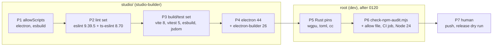

# 0220 — The dependencies catch up, and npm gets its gate

> **Status:** done - Phase 7 owed, ADR-0249. Closed 2026-09-24 by the conductor: Phases 1-6
> landed (`f6852988`, `8f569b1d` + `774b0a43`, `bf97b87f`, `d874e9a9`, `561a2541`, `b3ab5ecf`);
> round 1 review no blockers, no majors, three minors and one nit, two minors fixed at the close.
> Version 0.149.0. Phase 7 (push, CI on the pushed tree, the release dry run) is owed.
> **Created:** 2026-09-22
> **Owner skill(s):** studio-builder, dev, human
> **Related ADRs:** [0244](../../adrs/0244-the-npm-graphs-are-gated-like-the-cargo-graph-and-an-install-script-runs-by-name.md) (accepted, Outcome),
> [0178](../../adrs/0178-the-studio-shell-conventions.md),
> [0033](../../adrs/0033-testing-strategy-coverage-ratchet-and-pre-push-gate.md),
> [0038](../../adrs/0038-tag-driven-release-unsigned-universal-mac-app.md),
> [0156](../../adrs/0156-the-per-phase-gate-is-scoped-and-the-suite-is-owed-once-per-plan.md)
> **Runs after:** [0120](0120-the-standalone-ships-on-ubuntu.md) for Phases 5-6 only. Both edit
> `core/Cargo.toml`'s `wgpu` lines and `.github/workflows/ci.yml`, which 0120 has open on `main`
> today. Phases 1-4 touch only `studio/` and can run now.

## TL;DR

The studio ships Electron 32 inside its release zip, twelve majors behind, and `npm audit` finds 2
critical and 14 high advisories in its graph. The cause is that nothing watches the npm graphs, while
`cargo deny` has watched the Rust one from the start. This plan brings the studio's toolchain and
runtime current: Electron 44, electron-builder 26, vite 8, vitest 5, eslint 10 with a matching
typescript-eslint (eslint stays on 9.39.5 until `eslint-plugin-react` accepts 10; see the log), and
the rest of the build and test tooling. It lets npm 11 install Electron's
binary by naming it. It takes the three Rust pins that trail by a patch or a minor. And it adds the
gate that stops this from accumulating again (ADR-0244), with CI moved to Node 24 LTS. React 18,
zod 3 and TypeScript 5 stay where they are.

## Context & problem

Measured on the Arch box on 2026-09-22:

| Graph | Gate today | State |
|---|---|---|
| `Cargo.lock` | `cargo deny check`, CI `deny` job | **advisories ok**. One reasoned ignore (RUSTSEC-2026-0192, ttf-parser unmaintained). Pins current except `wgpu` =30.0.0 (30.0.1 out), `toml` =1.1.3 (1.1.6), `cc` =1.3.0 (1.4.7, spout build-dep only) |
| `studio/` | none | 20 advisories: 2 critical, 14 high, 2 moderate, 2 low. 33 of the direct dependencies are outdated |
| `site/` | none | `npm audit` clean. Three patch releases behind (astro 7.3.3, starlight 0.42.2, markdown-remark 7.3.1) |

The studio advisories, after `4581c6b5` patch-bumped vitest to 2.1.9 and vite to 5.4.21:

| Package | Pinned | Clears at | Severity | Where it runs |
|---|---|---|---|---|
| `vitest` (+ `@vitest/mocker`, `vite-node`) | 2.1.9 | 3.2.6 for the critical, 4.1.11 for the rest; latest 5.0.1 | critical (GHSA-5xrq-8626-4rwp, needs the UI server, which the studio does not run) | tests |
| `vite` | 5.4.21 | above 6.4.2; latest 8.3.0 | high (`fs.deny` bypass on Windows paths) | dev server |
| `tar` via `electron-builder` → `app-builder-lib` → `@electron/rebuild` / `node-gyp` / `cacache` | 25.1.8 | electron-builder 26.15.3 | critical + 11 high | packaging |
| `electron` (+ `extract-zip`) | 32.1.2 | 44.4.3 | high (ASAR integrity bypass, AppleScript injection) | **shipped in the studio zip** |
| `esbuild` | 0.24.0 | 0.28.2 | moderate (dev server) | main/preload bundling |
| `@vitejs/plugin-react` | 4.3.2 | 4.7.0; latest 6.1.1 | moderate | build |
| `eslint` | 9.11.1 | 9.39.5; latest 10.11.0 | low | lint |

Two facts constrain the order of the work:

- **eslint cannot move alone.** 9.39.5 crashes the pinned `@typescript-eslint` 8.8.0 on
  `no-unused-expressions` (*"Cannot read properties of undefined (reading 'allowShortCircuit')"*),
  which is why `4581c6b5` left it at 9.11.1. The lint stack moves as one set.
- **npm 11 blocks dependency install scripts** unless `package.json`'s `allowScripts` names the
  package. On the box, `npm ci` succeeded and left no Electron binary, so `window.csp.test.ts` and
  `presetHandlers.test.ts` fail with *"Electron failed to install correctly"*. CI does not see this
  because Node 22 ships npm 10. Node 24 ships npm 11, so the allowlist has to land before CI moves.

## Decision

One plan, in three runs:

1. `studio-builder` fixes the install-script allowlist, then brings the studio up to date in three
   phases: lint tooling, build and test tooling, and Electron with its packager. Each is a separate
   commit so that a red gate points at one set.
2. `dev` takes the Rust patch bumps and then builds the ADR-0244 gate and the Node 24 move.
3. `human` pushes and dry-runs the release.

From the interview: the scope is **security plus toolchain**. React 19, zod 4 and TypeScript 7 are
rejected for this plan, because each one changes the studio's own code and its protocol schemas
rather than its build, and each deserves its own review. **Everything to latest** was rejected for
that reason. **Security minimum only** was rejected because it leaves esbuild and jsdom to fail the
new gate's `critical` line on the next advisory. A **scheduled bump bot** was rejected in favour of
the gate (ADR-0244 Alternative A). **Node 22** is kept out of CI's future because 24 is the active
LTS and it closes most of the gap to the box's Node 26 without chasing a release that is not LTS.

## Architecture diagram



## Implementation phases

### Phase 1 — npm 11 installs Electron by name
- **Owner skill:** `studio-builder`
- **What:** `studio/package.json` gains an `allowScripts` field naming exactly the packages whose
  install scripts the studio needs, and nothing else changes.
- **Files touched:** `studio/package.json`, `studio/package-lock.json` only if npm rewrites it,
  `studio/README.md` (one line saying what the field is and that a new entry is a reviewed edit,
  per ADR-0244).
- **Done when:**
  - After `rm -rf studio/node_modules && npm --prefix studio ci` on the Arch box (npm 11.19.1),
    `npm --prefix studio install-scripts ls` reports no unreviewed package.
  - **The Electron binary is NOT this phase's bar, and neither are the two tests that need it.**
    Amended 2026-09-24 after this phase landed as `f6852988` and parked: the field is necessary and
    not sufficient. The postinstall now runs, and Electron 32's `install.js` extracts with
    `extract-zip` 2.0.1 (yauzl 2.10.0), which on Node 26 writes one entry and exits 0 with its
    promise neither resolved nor rejected — reproduced directly against the cached
    `electron-v32.1.2-linux-x64.zip`. No version of this phase can produce a binary, because the
    version that can extract on this Node is the one **Phase 4** installs. So
    `window.csp.test.ts` and `presetHandlers.test.ts` are expected to fail to collect here, and
    both they and the binary check move to Phase 4. `windowless.test.ts` and `templates.test.ts`
    are recorded with their state and are not this phase's bar either; they depend on 0120.
  - The field lists named packages, **pinned** as `pkg@version` — npm's default, per
    [ADR-0244](../../adrs/0244-the-npm-graphs-are-gated-like-the-cargo-graph-and-an-install-script-runs-by-name.md).
    `approve --all` and `--no-allow-scripts-pin` are both unused, and the log records the list.
    Measured on the box 2026-09-24, that list is **three** entries, not two: `electron@32.1.2`,
    `esbuild@0.24.0` and `esbuild@0.21.5`, because two `esbuild` versions are in the graph. Confirm
    against `install-scripts ls` rather than against this line.

### Phase 2 — The lint set moves together
- **Owner skill:** `studio-builder`
- **What:** `eslint` and `@eslint/js` to 10.x, `@typescript-eslint/eslint-plugin` and `parser` to
  8.70.1, `eslint-plugin-react-hooks` to 7.x, `eslint-config-prettier` to 10.x,
  `eslint-plugin-react` 7.37.5, `prettier` 3.9.8. All exact pins.
- **Files touched:** `studio/package.json`, `studio/package-lock.json`, `studio/eslint.config.mjs`,
  and any studio source a new rule flags.
- **Done when:**
  - `npm run typecheck`, `npm run lint` and `npm test` are green, with the same passing set as
    Phase 1.
  - Every finding a new rule raises is either fixed in the source or switched off in the config
    with a one-line comment giving the reason, and the log lists every rule switched off. If
    `eslint-plugin-react` 7.37.5 does not load under eslint 10, the set stays on eslint 9.39.5
    instead. That is reported in the log, not worked around.
  - `npx prettier --check` over the studio reports no file changed by the version move. If the new
    prettier reformats files, the reformat is its own commit inside this phase, with no other change
    in it.

### Phase 3 — The build and test set moves together
- **Owner skill:** `studio-builder`
- **What:** `vite` 8.3.0, `@vitejs/plugin-react` 6.x, `vitest` 5.0.1, `jsdom` 30.x, `esbuild`
  0.28.2, `@testing-library/react` 16.3.3, `@testing-library/jest-dom` 7.x, `concurrently`,
  `cross-env` and `wait-on` to their latest majors, and `@lezer/highlight` plus the `@codemirror/*`
  set to their latest 6.x/1.x. React stays 18.3.1, zod 3.23.8, TypeScript 5.6.2, and `@types/react*`
  stay 18.x.
- **Files touched:** `studio/package.json`, `studio/package-lock.json`, `studio/vite.config.ts`,
  `studio/vitest.config.ts`, `studio/scripts/build-main.mjs` and `build-preload.mjs`,
  test setup files, and any test a new major breaks.
- **Done when:**
  - Typecheck, lint and tests are green with the same passing set as Phase 2.
  - `npm run build` produces `dist/main/index.cjs`, `dist/preload/index.cjs` and `dist/renderer/`
    as ADR-0178 names them, and `npm run dev` on the box reaches the studio window.
  - ADR-0178's double CSP is unchanged. `window.csp.test.ts` passing is the evidence, and the log
    says whether vite 8 changed the dev server's injected headers.
  - `npm audit` in `studio/` no longer lists `vite`, `vitest`, `@vitest/mocker`, `vite-node`,
    `esbuild` or `@vitejs/plugin-react`. The log carries the audit's summary line.
  - **Both `esbuild` `allowScripts` entries follow their versions.** They are pinned, so the bump
    strands them and `npm ci` then leaves no platform binary while still exiting 0. Re-approve by
    name after the bump and confirm with `npm --prefix studio install-scripts ls`, which must report
    no unreviewed package.

### Phase 4 — Electron 44 and electron-builder 26
- **Owner skill:** `studio-builder`
- **What:** `electron` 44.4.3 and `electron-builder` 26.15.3. `@types/node` moves to the major of the
  Node that Electron 44 embeds, read from `process.versions.node` in the running app, not assumed.
- **Files touched:** `studio/package.json`, `studio/package-lock.json`, `studio/electron-builder.yml`,
  `studio/electron/**` where an API changed, `studio/README.md`, and `packaging/studio/bundle-studio.sh`
  and `build-studio.ps1` only if an electron-builder 26 flag changed.
- **Done when:**
  - Typecheck, lint and tests are green with the same passing set as Phase 3.
  - Every ADR-0178 security default is still set on every `BrowserWindow` in the source:
    `contextIsolation: true`, `nodeIntegration: false`, `sandbox: true`, and `show: false` until
    `ready-to-show`. So are the navigation and window-open intercepts. The log names each Electron
    breaking change between 32 and 44 that touched the studio, or says none did.
  - `npm run dev` on the box, with a Linux player built, spawns the player, paints frames and exits
    with no orphan (`pgrep ritmolux` empty). The log names the player binary path. If 0120's Linux
    player is not on `main` yet, this bullet waits for Phase 7 rather than being skipped.
  - `npm audit --omit=dev` in `studio/` reports no `high` or `critical`, and `npm audit` over the
    full graph reports no `critical`. Anything left is listed in the log with its GHSA id, as input
    to Phase 6's allow file.
  - **`electron`'s `allowScripts` entry follows it to 44.4.3.** It is pinned, so the bump strands
    `electron@32.1.2` and a fresh `npm ci` would leave no binary. Re-approve by name.
  - **The binary lands here, which Phase 1 could not make it do.** After
    `rm -rf studio/node_modules && npm --prefix studio ci`,
    `npx --prefix studio electron --version` prints 44.4.3 — spelled through `npx` because the
    conductor's allowlist has `Bash(npx *)` and refuses a bare binary path, which it denied on
    2026-09-24. Electron 44 depends on `@electron-internal/extract-zip` rather than the
    `extract-zip` 2.0.1 that silently truncates on Node 26, so this is where that is proved.
  - **`window.csp.test.ts` and `presetHandlers.test.ts` collect and pass**, carried here from
    Phase 1 for the same reason.
  - The studio's `EXPECTED_PLAYER_VERSION` and `version` are untouched. This is not a release.

### Phase 5 — The Rust pins that trail
- **Owner skill:** `dev`
- **Runs after:** 0120 has landed on `main`.
- **What:** `wgpu` =30.0.1 on every target line of `core/Cargo.toml` (including 0120's Linux arm),
  `toml` =1.1.6 in `core/` and `standalone/`, and `cc` =1.4.7. Then `cargo update --workspace` for the
  lockfile's semver-compatible transitive moves, and a re-check of `deny.toml`'s ttf-parser ignore.
- **Files touched:** `core/Cargo.toml`, `standalone/Cargo.toml`, `Cargo.lock`, `deny.toml` (the
  ignore's comment only, and only if the re-check changes its answer).
- **Done when:**
  - `cargo deny check` is green.
  - The **full** `cargo nextest run --workspace` is green (ADR-0156's upward override: a wgpu patch
    can move a golden). The log carries the `Summary` line. A golden that moves is a finding and is
    reported, not re-blessed.
  - The log says whether `cosmic-text` still pins `ttf-parser` 0.25, per the REVISIT note on
    RUSTSEC-2026-0192.
  - `cc` is a build dependency of the `spout` feature alone, so the local gate cannot compile it off
    Windows. The log says the `spout` CI job is owed at Phase 7.

### Phase 6 — The npm gate, and CI on Node 24
- **Owner skill:** `dev`
- **Runs after:** 0120 has landed on `main`.
- **What:** ADR-0244 built. The gate is `scripts/check-npm-audit.mjs`, zero-dependency Node in the
  shape of the other gates. It runs `npm audit --json` in `studio/` (`--omit=dev` for the shipped
  line, full for the other) and in `site/`, fails the shipped graph at `high` and the full graphs at
  `critical`, reads exceptions from `npm-audit.allow.json`, and has a `--self-test` over fixtures
  in `scripts/fixtures/`. It gets its own CI job. Every `node-version: '22'` in `.github/workflows/`
  moves to `'24'`.
- **Files touched:** `scripts/check-npm-audit.mjs`, `scripts/fixtures/npm-audit/*`,
  `npm-audit.allow.json`, `.github/workflows/ci.yml`, `.github/workflows/release.yml`,
  `.github/workflows/pages.yml`, `site/package.json` (an `allowScripts` field if `site/`'s
  `npm ci` on npm 11 skips a script its build needs, checked on the box), `docs/developing.md`
  (the gate, the Node version, `allowScripts`), and `CLAUDE.md`'s `scripts/` block. The gate is
  CI-only like the two site gates, so it is named there beside them.
- **Done when:**
  - `node scripts/check-npm-audit.mjs --self-test` passes. It proves the gate **fails** on a fixture
    with a `high` in the shipped graph, **fails** on a `critical` in a dev-only package, **passes**
    on a `moderate`, **passes** when the offending id is in the allow file with a reason, **fails** on
    an allow entry without a reason, **reports** an allow entry whose id no longer appears, and
    **fails** when the audit request itself fails, never passing on it.
  - `node scripts/check-npm-audit.mjs` against the live registry exits 0 on the tree after Phase 4.
    Every allow entry it needed is listed in the log with its GHSA id.
  - `scripts/gates.manifest.mjs` and `.githooks/pre-push` are unchanged, and
    `node scripts/check-gate-carriers.mjs` stays green. The gate is not on the roster by design
    (ADR-0244).
  - No workflow names Node 22.
  - `check-doc-links`, `check-reader-prose`, `toc --check` and `check-comment-hygiene` stay green.

### Phase 7 — CI on the pushed tree, and a release dry run
- **Owner skill:** `human`
- **Blocks merge:** no
- **What:** push, then read CI on the new tree and the studio artifacts a release would ship.
  **Marked non-blocking 2026-09-24** under
  [ADR-0249](../../adrs/0249-a-human-phase-may-be-owed-after-the-merge.md), which postdates this plan.
  Every criterion below begins with the push, and a push requires the merge, so a blocking phase
  here asks for something only possible after the thing it prevents. The plan merges and this
  reading is owed after it.
- **Files touched:** this plan's log.
- **Done when:**
  - Every CI job is green on the pushed `main`: the new npm audit job, the `studio` job on Node 24,
    `deny` and `spout`.
  - `release.yml` run by `workflow_dispatch` (its dry-run path) produces both studio zips, built by
    electron-builder 26. The log records each zip's size next to its previous NFR §4 row. The
    Windows zip is unzipped and launched on the Windows boot: the studio opens, spawns its bundled
    player from `resources/player/` and paints frames.
  - If Phase 4's `npm run dev` bullet was waiting for 0120, it is done here.

## Risks & open questions

- **Twelve Electron majors in one step.** Chromium, the Node it embeds, and the defaults of
  `webPreferences` and `session` moved over that span. The studio's surface is small (one window, one
  preload, a `MessagePort`, a child process), which is why one phase is proposed and not a stepped
  climb. If Phase 4 finds a break that needs a design answer, such as the frame `MessagePort`'s
  transfer semantics that ADR-0178's Outcome describes, it stops there and the answer goes to
  `architect`.
- **electron-builder 26 on the two packaging recipes is only witnessed in CI.** The box cannot build
  a macOS or Windows zip. Phase 7 is the first time the recipes run, and a red release dry run
  there is a Phase 4 fix, reported.
- **vitest 2 → 5 and jsdom 25 → 30 can change test behaviour without changing a test.** Fake timers,
  module mocking and jsdom's event dispatch are the usual places. Phase 3's "same passing set" rule
  exists so that a test which silently stops running reads as a finding.
- **The gate can turn `main` red without a commit** (ADR-0244, Negative). The first time it does is
  the first test of the allow file's reason rule.
- **`site/` on npm 11 is unobserved.** Playwright downloads its browsers through an explicit
  `npx playwright install` in `pages.yml`, not a postinstall script, but that is read from the
  workflow, not measured. Phase 6 checks it on the box.
- **Plan 0120 is live on `main`.** Phases 1-4 touch only `studio/` and cannot collide with it.
  Phases 5-6 wait for it. Phase 4's player smoke needs its Linux player.

## What this plan does NOT do

- **It does not move React to 19, zod to 4 or TypeScript to 7.** Each changes the studio's code
  rather than its build, and zod is the protocol's validation layer (`studio/shared/protocol.ts`).
  They are followups, each its own plan.
- **It does not package the studio for Linux.** That remains Plan 0219's followup and needs its own
  ADR-0038 amendment.
- **It does not bump `site/`'s patch releases.** Its audit is clean, and the gate now watches it.
- **It does not add a bump bot** (ADR-0244 Alternative A), and it does not put the npm gate in the
  pre-push hook.
- **It does not release.** No version bump beyond whatever the close decides per ADR-0005.

## Implementation log

> Written by `dev` — one row per phase as that phase's commit lands, and the close block after the
> last one. **The phases above are the contract; everything here is what happened.**
> **Observations, never conclusions:** this says where to look, architect decides how it went.
> No per-criterion pass list, no self-assessment, no narrative — but a deviation from the plan or
> an unmet done-when is always disclosed. Stays shorter than `## Implementation phases` above.

**Lane:** `/home/igor/Work/rlx-plan-0220`, branch `plan-0220-the-dependencies-catch-up-and-npm-gets-its-gate` (conductor)

| phase | owner | state | commit |
|---|---|---|---|
| 1 — npm 11 installs Electron by name | studio-builder | done against the amended bar (binary moved to P4) | f6852988 |
| 2 — The lint set moves together | studio-builder | done, on eslint 9.39.5 not 10 (Notes) | this row's commit + the reformat after it |
| 3 — The build and test set moves together | studio-builder | done; dev-window and CSP-test bullets carried to P4 (Notes) | this row's commit |
| 4 — Electron 44 and electron-builder 26 | studio-builder | done; dev smoke run as the dev pipeline, not the `dev` script (Notes) | this row's commit |
| 5 — The Rust pins that trail | dev | done | 561a2541 |
| 6 — The npm gate, and CI on Node 24 | dev | done | b3ab5ecf |
| 7 — CI on the pushed tree, and a release dry run | human | owed | |

### Notes

- **P1 list** (`npm install-scripts approve electron esbuild`, pinned, no `--all`): `electron@32.1.2`,
  `esbuild@0.24.0`, `esbuild@0.21.5`. After `rm -rf studio/node_modules` and `npm --prefix studio ci`
  (npm 11.19.1, Node 26.8.2), `install-scripts ls` prints *No packages with unreviewed install
  scripts.*
- **P1 unmet: the Electron binary still does not land.** The postinstall now runs, but Electron
  32's `install.js` extracts with `extract-zip` 2.0.1 (yauzl 2.10.0), which on Node 26 writes one
  entry (`dist/locales/hr.pak`, 394 KB) and lets the process exit 0 with the promise neither resolved
  nor rejected - reproduced with a scratch script calling `extract-zip` directly on the cached
  `electron-v32.1.2-linux-x64.zip`. No `path.txt`, no `dist/electron`. So the plan's Context line
  (npm 11 blocking scripts is why the binary is missing) is half the cause on this box; `electron`
  44.4.3 depends on `@electron-internal/extract-zip` instead (`npm view`), so Phase 4 may clear it.
- **P1 tests**: 30 files / 280 tests pass; `window.csp.test.ts` and `presetHandlers.test.ts` fail
  to collect (*Electron failed to install correctly*). `windowless.test.ts` and `templates.test.ts`
  pass by skipping (no built player in the lane's `target/`).
- `npx prettier --check studio/README.md` fails on `main`'s own settings-key table, untouched here.
- **P1 re-checked 2026-09-24** against the amended done-when: `install-scripts ls` still prints *No
  packages with unreviewed install scripts.*
- **P2 stays on eslint 9.39.5** (and `@eslint/js` 9.39.5): `npm install` with eslint 10.11.0 is
  ERESOLVE, because `eslint-plugin-react` 7.37.5, the latest, declares peer `eslint ^9.7` at most.
  The rest moved as named: ts-eslint 8.70.1, react-hooks 7.1.1, config-prettier 10.1.8,
  plugin-react 7.37.5, prettier 3.9.8.
- **P2 rule switched off:** `react-hooks/set-state-in-effect` (new in react-hooks 7), six sites in
  `ParamRow.tsx`, `useActivePreset.ts`, `useHeldRotation.ts`, `useRoster.ts`, `Editor.tsx` (two).
  Each resets local state when a reported fact changes; rewriting them changes render order.
- **P2 prettier:** 3.9.8 re-joins three short union types onto one line (`osc.ts`,
  `testing/player.ts`, `Editor.test.tsx`), which 3.3.3 passes. That reformat is the phase's second
  commit, nothing else in it. `README.md` fails under both versions, so it was left alone.
- **P2 tests:** same set as P1, 30 files / 280 tests, the same two failing to collect.
- **P3 pins:** vite 8.3.0, plugin-react 6.1.1, vitest 5.0.1, jsdom 30.1.1, esbuild 0.28.2,
  testing-library/react 16.3.3, jest-dom 7.0.1, concurrently 10.0.5, cross-env 10.1.0, wait-on 9.1.0,
  `@codemirror/*` commands 6.11.1 / language 6.12.4 / lint 6.9.7 / state 6.7.6 / view 6.43.13,
  `@lezer/highlight` 1.2.4. No config or source file needed a change.
- **P3 deviation: `@types/node` 22.7.4 -> 22.20.4**, same major. vite 8 declares an optional peer
  `@types/node >=22.12.0` that npm enforces against an installed copy. Phase 4 still sets the major.
- **P3 install order:** a one-shot `npm install` is ERESOLVE, because the old vitest 2 subtree and the
  root `esbuild` 0.24.0 hold vite ^5 peers while the new plugin-react is placed. It went through as
  `install esbuild @types/node`, then `uninstall vitest vite @vitejs/plugin-react`, then an install
  of the new set by name. No `--force`, no `--legacy-peer-deps`.
- **P3 allowScripts:** vite 8 bundles with rolldown, so the graph has one `esbuild`, 0.28.2.
  `install-scripts approve esbuild` removed `esbuild@0.24.0` and `esbuild@0.21.5` as stale and
  added `esbuild@0.28.2`. After `rm -rf studio/node_modules` and `npm --prefix studio ci`,
  `install-scripts ls` prints *No packages with unreviewed install scripts.*
- **P3 tests:** same set as P2, 30 files / 280 tests, the same two failing to collect.
- **P3 build:** `dist/main/index.cjs`, `dist/preload/index.cjs` and `dist/renderer/` built. The
  `<meta>` CSP is intact in `dist/renderer/index.html`. vite 8 warns that the 558 kB renderer chunk
  is over 500 kB; it is not an error.
- **P3 unmet, carried to P4:** `npm run dev` reaching the window, `window.csp.test.ts` passing, and
  whether vite 8 changed the dev server's injected headers all need the Electron binary, which the
  amended P1 places at P4. P4 reruns all three.
- **P3 audit:** `14 vulnerabilities (13 high, 1 critical)`. It lists none of vite, vitest,
  `@vitest/mocker`, vite-node, esbuild or plugin-react. What is left is electron, extract-zip,
  electron-builder's tree and tar.
- **P4 pins:** electron 44.4.3 (as the plan names; the audit's fix line offers 44.4.5, and 44.4.3 is
  outside every listed range), electron-builder 26.15.3. `process.versions.node` in the running
  Electron 44 app reads **24.21.0** (Chrome 152), so `@types/node` is 24.13.6.
- **P4 allowScripts: electron 44 has no install script.** Its `index.js` downloads the binary the
  first time it is required. `install-scripts approve electron` still removed `electron@32.1.2` as
  stale and wrote `electron@44.4.3`, which now approves no script. electron-builder 26 brings
  `electron-winstaller@5.4.0` (via the squirrel-windows target), whose `install` copies a Windows
  7-Zip. The `--dir` builds never use it, so it is **denied by name** (`"electron-winstaller":
  false`, unpinned, via `install-scripts deny`). `studio/README.md` says both.
- **P4 binary:** after `rm -rf studio/node_modules` and `npm --prefix studio ci`, `install-scripts ls`
  prints *No packages with unreviewed install scripts.*, and `npx --prefix studio electron
  --version` prints *Downloading Electron binary...* then `v44.4.3`.
- **P4 tests:** 32 files / 297 tests pass. `window.csp.test.ts` and `presetHandlers.test.ts` now
  collect and pass (+17 tests). With the player built in this lane's `target/`, `windowless.test.ts`
  and `templates.test.ts` run rather than skip.
- **P4 security defaults:** `window.ts` holds the one `new BrowserWindow`, with `contextIsolation:
  true`, `nodeIntegration: false`, `sandbox: true`, `show: false` + `ready-to-show`,
  `setWindowOpenHandler` and `will-navigate`. No Electron breaking change between 32 and 44 touched
  the studio: every API it imports (`app`, `BrowserWindow`, `session.webRequest`, `shell`,
  `ipcMain`/`ipcRenderer`, `contextBridge`, `MessageChannelMain`, `webContents.capturePage` and
  `postMessage`) typechecks unchanged against 44's `electron.d.ts`. No `electron/**` edit.
- **P4 dev smoke (deviation):** the `dev` script never exits, and a conductor session cannot
  background it. So the same pipeline ran as `npm --prefix studio exec -- concurrently -k` over
  `vite studio/renderer --config studio/vite.config.ts` and `wait-on ... && cross-env
  ELECTRON_RENDERER_URL=http://localhost:5273 electron studio --user-data-dir=<scratch> --capture
  <png>`, with a scratch `settings.json` whose `playerPath` is
  `/home/igor/Work/rlx-plan-0220/target/debug/ritmolux` (`cargo build -p standalone --bin
  ritmolux`). The player spawned (control on 127.0.0.1, 116 presets). The capture shows *Echo
  Plate* painting, footer `stream 640x360 @ 0 bgra8`, `856 painted · 255 dropped`. Electron exited
  0, and `pgrep -a ritmolux` afterwards is empty. The main and preload watchers were not in the
  run; they are esbuild's `--watch` over the bundles `npm run build` produced.
- **P4 vite 8 dev headers (carried from P3):** `curl -sI` against the dev server returns no
  `Content-Security-Policy` header, only `Vary`, `Content-Type`, `Cache-Control`, `Etag`. The studio's
  `onHeadersReceived` hook writes the only policy, as before.
- **P4 audit:** `npm audit --omit=dev` and `npm audit` both print *found 0 vulnerabilities*.
  Nothing is left for Phase 6's allow file from `studio/`.
- **P4 packaging:** `bundle-studio.sh` and `build-studio.ps1` use `--win`/`--mac --universal`
  `--dir` and `-c.extraMetadata.version`, all unchanged in electron-builder 26, so neither is
  edited, and neither is `electron-builder.yml`. They run for the first time at Phase 7.
- `version` and `EXPECTED_PLAYER_VERSION` are untouched.
- **P5 lock:** `cargo update --workspace` moved, beside the three pins, `find-msvc-tools` 0.1.13,
  `toml_parser` 1.1.3, and the `wasm-bindgen` / `js-sys` / `web-sys` set to 0.2.128 / 0.3.105. It
  reports 45 dependencies still behind latest, which it does not move. `wgpu-core`, `wgpu-hal` and
  `naga` stay 30.0.0; only the `wgpu` facade has a 30.0.1. The glyphon comment in
  `core/Cargo.toml` names the new pin.
- **P5 deny:** `cargo deny --log-level error check` prints *advisories ok, bans ok, licenses ok,
  sources ok*.
- **P5 ttf-parser:** still 0.25.1, through `fontdb` 0.23.0 under `cosmic-text` 0.19.0 (glyphon), and
  through `owned_ttf_parser` 0.25.1 under winit's `sctk-adwaita`. `deny.toml` is unchanged.
- **P5 full suite:** `cargo nextest run --workspace`: *Summary [485.633s] 1805 tests run: 1805
  passed (5 slow), 7 skipped*. No golden moved (`git status` shows only the three manifests/lock).
- **P5 `cc` 1.4.7** compiles on the box as a transitive build dependency (clippy lists it), but the
  `spout` build script that calls it runs only with the feature on Windows. The `spout` CI job is
  owed at Phase 7.
- **P6 self-test:** `node scripts/check-npm-audit.mjs --self-test` prints *26 of 26*. Fixtures are
  JSON stand-ins for npm's output under `scripts/fixtures/npm-audit/`, with their own `README.md`
  there; `scripts/fixtures/README.md` is not in the phase's file list and has no section for them.
- **P6 live run:** `node scripts/check-npm-audit.mjs` exits 0, 0 advisory readings in each of the
  three graphs. `npm-audit.allow.json` ships with an empty `allow` list; no entry was needed.
- **P6 CI job:** `npm-audit` in `ci.yml`, triggered like every other job there (push and pull
  request). ADR-0244's *on a schedule of its own* was read as its own job, not a `schedule:`
  trigger, which would re-run every `ci.yml` job.
- **P6 allow-file shape:** `{ "about": ..., "allow": [{ "id": "GHSA-...", "reason": ... }] }`. An id
  that is not GHSA-shaped is refused as well as one without a reason. A stale entry is printed and
  does not fail; staleness is withheld when any audit failed.
- **P6 site on npm 11:** after `npm --prefix site ci`, npm warns that `esbuild@0.28.2`'s postinstall
  is unreviewed. `npx --prefix site esbuild --version` still prints 0.28.2, and `npm --prefix site
  run build` completes (200 pages), so `site/package.json` is unchanged.
- **P6 Node 22:** the five `node-version: '22'` lines (ci.yml x2, release.yml x2, pages.yml x1)
  read `'24'`, and the new job is on `'24'`. A `ci.yml` comment naming Node 22 was reworded.
- **P6 docs:** `docs/developing.md` loses the Node 26 hand-extraction recipe for Electron 32, which
  Phase 4 made obsolete, in favour of an `allowScripts` paragraph, and gains the gate beside
  `cargo deny`'s paragraph. `CLAUDE.md`'s `scripts/` block names the gate as a third CI-only exception.
- **P6 gates:** `check-gate-carriers` (hook 17/17, ci 17/17), `check-doc-links`, `check-reader-prose`,
  `toc --check`, `check-comment-hygiene` and `check-system-counts` are green. `gates.manifest.mjs`
  and `.githooks/pre-push` are unchanged.

### Close triggers

- **`presets/` touched:** no
- **Plan header `Closes:`** none
- **What shipped:** dependency moves in a shipped artifact (the studio zip carries Electron 44.4.3;
  the player links wgpu 30.0.1 and toml 1.1.6), studio build/test/lint tooling, and a new CI gate
  (`scripts/check-npm-audit.mjs`, job `npm-audit`) with CI on Node 24. No player or studio feature.
- **Operator docs touched:** `docs/developing.md`, `studio/README.md`, `CLAUDE.md` (`scripts/` block)
- **Backlog probes (`node scripts/check-backlog-claims.mjs`):** exit 0, 46 reductions across 21 live
  entries (4 unprobeable), 30 advisory moved-path rows
- **Full suite:** owed to the conductor's pre-review gate (ADR-0207). Phase 5 ran
  `cargo nextest run --workspace` on its own tree: exit 0, 1805 passed, 7 skipped.
- **Outstanding `human` phases:** Phase 7 (push, CI on the pushed tree including `npm-audit`, `studio`
  on Node 24, `deny` and `spout`; the release dry run)

## Close review

Round 1 was the only round, so no earlier finding was resolved by a fix round. At the close, minor 1
was fixed in `4b5c76f3` (ADR-0244's dated Outcome) and minor 3 in `25661afd` (this plan's TL;DR and
diagram). Minor 2 sits under `.claude/` and nit 1 is code, so both stay open for the owner. **Phase 7
is owed** (ADR-0249): nothing has yet checked CI on the pushed tree (`npm-audit`, `studio` on Node
24, `deny`, `spout` with `cc` 1.4.7), electron-builder 26 on either packaging recipe, or the Windows
zip launching its bundled player.

Close-time readings: `check-backlog-claims` OK (46 reductions, 21 entries, 4 unprobeable, 30
moved-path advisory rows, none this plan's). The translation advisory names `how-it-works.ru.md`,
`running.ru.md` and `packaging/foobar/READ-ME-FIRST.ru.md` as behind their sources, none of which
this plan moved. `presets/` was not touched, so there is no curation verdict.

The round 1 review follows in full, with its headings moved down two levels.

### Plan 0220 — close review, round 1

Graded at `f6b8bbb02f142472f2fa15846771c3c088f17de0` on lane `/home/igor/Work/rlx-plan-0220`
(branch `plan-0220-the-dependencies-catch-up-and-npm-gets-its-gate`), `main` already merged in.

**Verdict: Plan 0220 landed cleanly. No blockers, no majors, three minors and one nit.** All six
machine phases did what the plan says, and every deviation is disclosed in the log: eslint stays on
9.39.5 through the fallback Phase 2 allowed, and Phase 4 ran the dev smoke as its pipeline rather than
through the `dev` script. Phase 7 (`human`, `Blocks merge: no`) is owed after the merge, per ADR-0249.
The minors are all documentation truth. ADR-0244 needs a dated Outcome at acceptance, and one
studio-builder skill fact went stale.

#### Evidence run in this session

| Check | Result |
|---|---|
| `node .../with-lock.mjs suite -- cargo nextest run --workspace` | `with-lock: skipped cargo nextest run --workspace: tree 35fd4f2 is green in the suite ledger, run by gate 0220-pre-review at 2026-09-24T11:24:33.193Z: 1805 tests run: 1805 passed (5 slow), 7 skipped`. That ledger record is the full-suite evidence, and it matches the log's Phase 5 figure. |
| `RUSTDOCFLAGS="-D warnings" cargo doc --workspace --no-deps` | green |
| `cargo deny --log-level error check` | `advisories ok, bans ok, licenses ok, sources ok` |
| `Cargo.lock` (via `git grep -a`, because the file is attributed binary) | `wgpu` 30.0.1, `toml` 1.1.6+spec-1.1.0, `cc` 1.4.7 |
| `npm --prefix studio run typecheck` / `run lint` | green / green |
| `npm --prefix studio test` | 32 files, 297 tests passed. `window.csp.test.ts` and `presetHandlers.test.ts` collect and pass |
| `node scripts/check-npm-audit.mjs --self-test` | `26 of 26` |
| `node scripts/check-npm-audit.mjs` (live registry) | exit 0, with 0 readings in each of the three graphs |
| `npm --prefix studio view electron@44.4.3 scripts dependencies` | no scripts. Deps include `@electron-internal/extract-zip`, which confirms the log's P4 claim |
| `check-gate-carriers` | OK (hook 17/17, ci 17/17). `gates.manifest.mjs` and `.githooks/pre-push` are not in the diff |
| `check-doc-links`, `check-comment-hygiene`, `toc --check`, `check-reader-prose`, `check-system-counts` | all OK |
| `check-backlog-claims` | OK: 46 reductions, 21 entries, 4 unprobeable. The advisory lists 30 moved paths, and none is this plan's |
| `git grep -n -e node-version -e "Node 22" -- .github/workflows` | six `'24'` lines, no `22` |

#### Lens 1 — alignment

- The phases landed as planned: P1 `f6852988`, P2 `8f569b1d` + reformat `774b0a43`, P3 `bf97b87f`,
  P4 `d874e9a9`, P5 `561a2541`, P6 `b3ab5ecf`. Every phase carries exactly one in-vocabulary
  `**Owner skill:**`. The only `Blocks merge: no` is on Phase 7, the `human` phase, and nothing reads
  its output.
- **`studio/package.json`**: the pins match the log. React 18.3.1, zod 3.23.8, TypeScript 5.6.2 and
  `@types/react*` 18.x are untouched, as "does NOT do" requires. `allowScripts` holds `esbuild@0.28.2`,
  `electron@44.4.3` (pinned) and `electron-winstaller: false` (denied by name). There is no `--all`.
- **Phase 2 eslint fallback.** eslint 10 is ERESOLVE against `eslint-plugin-react` 7.37.5's peer
  range. The plan pre-authorised staying on 9.39.5 and reporting it, and the log reports it. One rule
  is switched off, `react-hooks/set-state-in-effect`, with a one-line reason in
  `studio/eslint.config.mjs`, and the log lists its six sites.
- **Phase 6 gate** (`scripts/check-npm-audit.mjs`). I read the self-test assertions against each
  done-when clause:
  - fails on a shipped high (`v1`);
  - fails on a dev-only critical through the full graph alone (`v2`);
  - passes a moderate (`v3`);
  - passes a reasoned allow (`v4`);
  - fails a reasonless allow (`v5`);
  - reports a stale allow without failing (`v6`);
  - fails on a failed request, including non-JSON output, empty output, npm not starting and
    non-report JSON (`v7`).
  - It also withholds staleness when any graph failed to answer (`v8`).

  None of these is tautological. Each one names the graph or entry it expects. The exit status of
  `npm audit` is deliberately not an input, which is correct, since npm exits non-zero both on a
  finding and on an outage.
- **Phase 4 security defaults.** The log says `window.ts` holds the one `BrowserWindow` with every
  ADR-0178 default. No `studio/electron/**` source changed in the diff except the prettier reformat
  of a union type in `osc.ts` and `testing/player.ts`, so the defaults are exactly as `main` had them.
- **Phase 5.** The three pins moved on every target line, including the Linux arm. The glyphon
  comment follows the pin. `deny.toml` is untouched, and the log records that `ttf-parser` 0.25.1 is
  still pinned through `cosmic-text`/`fontdb` and `sctk-adwaita`.
- The implementation log (lines 295-459) is shorter than the `## Implementation phases` section
  (lines 94-259), and the close triggers are present. The `Full suite:` bullet correctly defers to the
  conductor's pre-review gate, whose ledger record is cited above.

#### Lens 2 — layering, real-time safety, contracts

No Rust source changed, only the three manifests and the lock. The C ABI, spec 0003 and the `Scene`
seam are untouched. The studio diff is dependency versions, one lint rule and a prettier reformat.
There is no protocol widening.

#### Lens 3 — doc freshness and bookkeeping

- `docs/developing.md` replaces the obsolete Node 26 hand-extraction recipe with an `allowScripts`
  paragraph, and adds the gate beside `cargo deny`'s paragraph. `studio/README.md` explains
  `allowScripts` and the `electron-winstaller` deny. `CLAUDE.md`'s `scripts/` block names the gate as
  a third CI-only exception.
- The close owes these, and the review flags them so they cannot slip:
  - ADR-0244 goes `proposed -> accepted` **with an Outcome** (finding 1).
  - Its `Related plan(s)` link is re-pointed to `done/`.
  - The plans index is refreshed.
  - The version bump: the studio zip now ships Electron 44.4.3 and the player links wgpu 30.0.1, so
    this is a shipped-artifact change and not docs/chore-only. The level is the close's to pick under
    ADR-0005, with the studio's two version copies following it.
  - The `Status:` line reads `done - Phase 7 owed, ADR-0249`.

#### Lens 4 — correctness

- The gate counts advisories at their source, keyed by GHSA id plus package. It skips the bare-name
  `via` entries that only repeat an upstream advisory. An unknown severity ranks -1, so it prints
  under the line rather than blocking. That errs toward passing, but npm only emits the five known
  levels.
- The CI `npm-audit` job runs `npm audit` against the committed lockfiles without an install. That
  works on lockfile v3.

#### Lens 5 — design integrity

The gate stays off the pre-push roster and out of `gates.manifest.mjs`, as ADR-0244 decides, and
`check-gate-carriers` confirms it. Nothing else here bears on the architecture.

#### Findings

##### minor 1 — ADR-0244 must be accepted with a dated Outcome; four of its statements are now false
`docs/adrs/0244-the-npm-graphs-are-gated-like-the-cargo-graph-and-an-install-script-runs-by-name.md`,
lines 36-41, 66-82 and 91.

The implementation falsified the following:
- **(a)** "`electron` fetches its binary in `postinstall`" and "A fresh clone on npm 11 installs a
  working Electron with no local step". Electron 44 has no install script (`npm view` confirms it). It
  downloads its binary the first time it is required, so a fresh clone fetches it on the first
  `npm test` or `npm run dev`, and CI's `studio` job does so at test time.
- **(b)** "The studio's list is three entries". The final list is `esbuild@0.28.2`, `electron@44.4.3`
  (which now approves no script) and a by-name deny of `electron-winstaller`.
- **(c)** "Each npm project's `package.json` carries an `allowScripts` field". `site/` carries none.
  Its one script, esbuild's, is not needed for its build, as checked on the box in Phase 6.
- **(d)** "CI gates both npm graphs on a schedule of its own". This was built as its own CI job,
  triggered on push and pull request, with no `schedule:` trigger. So an advisory published between
  pushes is seen at the next push, not on a timetable. The plan's Phase 6 file list admits no new
  workflow file, so that reading is the plan's too.

**Repair (close, Markdown under `docs/`):** accept the ADR with a dated `## Outcome` section stating
(a)–(d), per the ADR-0054/0074 precedent. Do not edit the body. Whether a `schedule:` trigger in a
separate workflow is wanted is a followup for the owner, not a close edit.

##### minor 2 — the studio-builder skill still sends a reader to a recipe this plan deleted
`.claude/skills/studio-builder/references/project-context.md:80`.

The bullet says *"Under Node 26, `npm ci` can leave Electron half-installed, with only `dist/locales/`
and no `path.txt`. `docs/developing.md`'s Arch block has the hand extraction."* Phase 6 removed that
block from `docs/developing.md`. Phase 4 made the failure impossible: Electron 44 extracts with
`@electron-internal/extract-zip` and has no postinstall. This is a fact the plan made false, and it
sits under `.claude/`, so a headless close cannot apply it (ADR-0210). It is for the owner.

**Replacement text:** replace lines 80-81 with

```
- **Electron has no install script.** It downloads its binary the first time it is required, so a
  fresh `npm --prefix studio ci` is followed by one download on the first `npm test` or `npm run dev`
  (`npx --prefix studio electron --version` triggers it on its own). `allowScripts` in
  `studio/package.json` names every install script that may run, pinned as `pkg@version` (ADR-0244).
```

##### minor 3 — the plan's TL;DR and diagram still promise eslint 10
`docs/plans/0220-the-dependencies-catch-up-and-npm-gets-its-gate.md:20` (TL;DR) and `:82` (diagram
node `P2`) say "eslint 10". The phase landed on eslint 9.39.5 under its own pre-authorised fallback,
and the log says so. A reader of the closed plan who stops at the TL;DR gets the wrong version.

**Repair (close, Markdown):** one parenthetical in the TL;DR, "(eslint stays on 9.39.5 until
`eslint-plugin-react` accepts 10; see the log)", and the diagram label changed to
`eslint 9.39.5 + ts-eslint 8.70`.

##### nit 1 — a non-GHSA advisory could never be excused
`scripts/check-npm-audit.mjs:104` falls back to an id of `npm-<source>` when an advisory's `url`
carries no GHSA id. `readAllow` (line 136) accepts only GHSA-shaped ids, so an advisory of that shape
at or over its line could be cleared only by a bump. npm's bulk advisory endpoint does key everything
by GHSA today, so this is theoretical. It is code, so a close leaves it. If it ever bites, accept the
same `npm-<n>` form in the allow file.

#### Owed after the merge

Phase 7 (`human`) is owed:
- push, then check that CI is green on `npm-audit`, `studio` on Node 24, `deny` and `spout`, the last
  being the first compile of `cc` 1.4.7 under the feature;
- the `workflow_dispatch` release dry run, where electron-builder 26 runs both packaging recipes for
  the first time;
- the Windows zip launched with its bundled player.

None of these has run anywhere yet.

## Followups (after this lands)

- **React 19**, with `@types/react*` 19 and `@testing-library/*` re-checked against it.
- **zod 4**, as a plan that reads every schema in `studio/shared/protocol.ts` against the spec.
- **TypeScript 7** (the native compiler) across the four tsconfigs.
- **Linux studio packaging**, carried over from Plan 0219.
