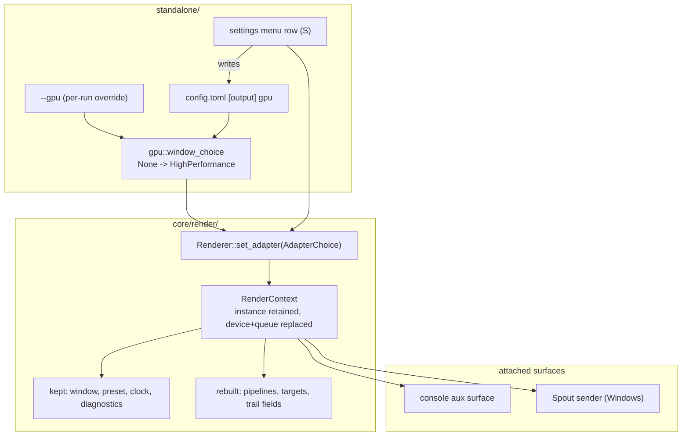

# 0224 — The adapter becomes a setting

> **Status:** done — closed 2026-09-23. Phases 1-6 landed as `82b134fa`, `421bd32e`, `1009340c`,
> `c95ad331`, `854ae8d8`, `596f3f8a`; Phase 7's two hardware halves as `1a8b2258` and `95f5bf0f`.
> Round-1 close review (conductor): **no blockers, no majors, two minors and one nit, all three
> repaired here.** Verified against the tree: the full workspace suite green (1797 passed, 7
> skipped, tree `29a4786`), `fmt`, `clippy --workspace --all-targets` and
> `cargo doc --workspace` clean, every Node gate green. Version **0.146.0**.
> **Created:** 2026-09-22
> **Approved:** 2026-09-22 (user)
> **Owner skill(s):** dev, human
> **Related ADRs:** [0246](../../adrs/0246-the-adapter-is-a-setting-and-the-window-prefers-high-performance.md)
> (the decision), [0155](../../adrs/0155-the-window-takes-the-adapter-and-the-preset-the-operator-names.md)
> (the flag, and the default this amends),
> [0146](../../adrs/0146-one-name-selects-the-gpu-and-each-side-matches-its-own-roster.md) (one name,
> two rosters), [0054](../../adrs/0054-runtime-tier-switching-rebuilds-on-the-live-context.md) (the
> rebuild precedent), [0240](../../adrs/0240-a-setting-lives-in-a-file-and-the-menu-edits-that-file.md)
> (a setting has a file key)

## TL;DR

On a hybrid machine this application runs six times slower than the hardware allows, because an
unflagged window takes the power-saving adapter and the only cure is a flag typed at launch. This
plan gives the choice a `config.toml` key, flips the unflagged default to the high-performance
adapter, and adds `Renderer::set_adapter` so the menu can move the running show onto another GPU
without a restart. First user-visible behavior: a fresh checkout launched with no arguments on the
reference box comes up on the discrete GPU at 165 fps instead of the integrated one at 25.

## Context & problem

Measured on the Arch reference box on 2026-09-22 — one preset, one build, pinned `Rich` tier, the
same 2560x1440 surface — an unflagged window ran at **25 fps with a 79 ms `frame_ms_p99`**, and the
same preset under `--gpu NVIDIA` ran at **164.9 fps, 6.065 ms average, p99 6.3-6.5 ms, zero dropped
frames**. The fullscreen bench rows agree within a frame
(`scripts/bench/results/linux-2026-09-22-live.tsv`). The gap is the adapter, not the build.

Three separate things make that the default rather than an accident:

- **The window asks for `AdapterChoice::Default`**, which on a hybrid laptop is the power-saving
  part. [ADR-0155](../../adrs/0155-the-window-takes-the-adapter-and-the-preset-the-operator-names.md)
  froze it deliberately and said why — changing it would have moved every published frame-time
  number inside a commit that only added a flag. Plan 0147 Phase 6 has since published the matched
  adapter-named pair in [`nfr.md`](../../nfr.md), so that reason is spent.
- **`--gpu` has no file key.** Under
  [ADR-0240](../../adrs/0240-a-setting-lives-in-a-file-and-the-menu-edits-that-file.md) every
  user-visible choice is defined by a key in a user-editable file, with flags as a per-run override.
  This one is reachable only by retyping a flag at every launch.
- **The choice is fixed at renderer construction**, so an operator who is on the wrong adapter has
  no move but to quit — on a codebase where
  [ADR-0054](../../adrs/0054-runtime-tier-switching-rebuilds-on-the-live-context.md) already rebuilds
  the live context for the *tier*.

[ADR-0245](../../adrs/0245-an-internal-grid-is-a-fraction-of-the-target-resolved-per-tier-and-adapter-class.md)
and [Plan 0223](../0223-the-heavy-presets-fit-the-integrated-gpu.md) attack the same complaint from the
other end, by making the heavy presets affordable on the integrated part. **This plan runs first**,
so 0223's tuning is measured against the adapter an operator actually gets.

## Decision

**Make the adapter an ordinary setting: a file key holds it, the unflagged default prefers the
high-performance adapter, and `Renderer::set_adapter` moves a running show between adapters.** The
rebuild is the sibling of ADR-0054's `set_tier` one level down — a new device and queue on the
retained `wgpu::Instance`, the surface re-configured against it, every GPU-owning member rebuilt,
and the window, preset, clock, audio and diagnostics untouched.

We rejected keeping `AdapterChoice::Default` and curing it per machine with the key alone (it leaves
the out-of-the-box experience at a sixth of the hardware, cured only by an operator who already
knows), a battery-aware `auto` (needs a platform power API in three operating systems and re-decides
itself mid-show — a later ADR, on top of this mechanism), a process respawn (the requirement was no
restart), one unified `rebuild(RenderSpec)` replacing `set_tier` (re-opens accepted behaviour and
turns a feature into a refactor), and a shell-owned rebuild carrying an explicit `SessionState`
(anything not named in the carrier is silently lost). ADR-0246 records each with its decisive reason.

## Architecture diagram



## Implementation phases

### Phase 1 — `[output] gpu`, with a fall-back that says so

- **Owner skill:** dev
- **What:** The choice gets its file key, resolved through the same name-or-index rule `--gpu` uses,
  with `--gpu` overriding it and an absent or non-presenting adapter falling back to the default
  rather than refusing to start.
- **Files touched:** `standalone/src/config.rs` (the `Output` table), `standalone/src/gpu.rs`,
  `standalone/src/run.rs` / `app_state.rs` (the startup line), `standalone/src/config/tests.rs`.
- **Done when:**
  - A `config.toml` carrying `[output] gpu = "NVIDIA"` launches the window on the discrete adapter
    with no flag, and the startup line names the adapter and that it came from the file.
  - `--gpu` given alongside the key wins, and the startup line says so — the same precedence
    `--tier` has over `[quality] tier`.
  - A key naming an adapter no roster contains starts anyway, on the default adapter, printing one
    line that names both what was asked for and what was taken. `--gpu` with the same name still
    exits 2 with ADR-0155's refusal, unchanged: the two carriers differ deliberately, and a test
    asserts both behaviours in one place so the difference cannot be read as an inconsistency.
  - No environment variable is added. `--gpu` already serves the one case that needs a per-run
    override (the bench scripts), and ADR-0240 puts an env var third.

### Phase 2 — the unflagged window prefers high performance

- **Owner skill:** dev
- **What:** `window_choice(None)` resolves `AdapterChoice::HighPerformance`, and the guard that held
  the two unflagged arms apart becomes a guard that holds them together.
- **Files touched:** `standalone/src/gpu.rs` (and its tests), `docs/nfr.md` (provenance note only).
- **Done when:**
  - An unflagged launch on the reference box resolves the discrete adapter, and the startup line
    names it as the default preference rather than as a pin.
  - `the_window_and_the_stream_disagree_when_unflagged` is **replaced, not deleted** — by a test
    asserting the two arms now agree, so the relation stays pinned by something rather than becoming
    unasserted. A guard removed in a commit that changes the behaviour it guarded is the one shape
    this phase must not produce.
  - `RendererOptions::default()` is unchanged, verified by a test naming the foobar shim's path: the
    flip is the standalone's, and the plugin's adapter behaviour does not move.
  - Every `nfr.md` row taken on an unflagged window carries a dated note that it was measured under
    the previous default. The numbers are not edited — they name their adapter already — and the
    note says only that a fresh unflagged run no longer reproduces the integrated-part rows.

### Phase 3 — `Renderer::set_adapter` on the live context

- **Owner skill:** dev
- **What:** The core gains the rebuild. A new adapter, device and queue come off the retained
  `wgpu::Instance`; the surface is re-configured against the new device; every GPU-owning member is
  rebuilt; the window, preset roster, active preset, engine clock, text layer and diagnostics
  survive.
- **Files touched:** `core/src/render/context.rs`, `core/src/render/mod.rs`,
  `core/tests/suite/` (a new adapter-switch case).
- **Done when:**
  - `set_adapter` is **transactional**: the new device is requested and validated *before* the old
    one is released, and a choice that cannot produce a device leaves the running picture untouched
    and returns a named error. A switch must never be able to leave the application with no
    renderer.
  - After a switch, `adapter_description()` reports the new adapter and a frame renders.
  - The preset on screen and the engine clock are the same across the switch; any dissolve in flight
    is dropped, as `set_tier` drops one.
  - A context with no surface (the headless capture path) is a no-op or a named error, never a
    partial rebuild — the same by-construction guarantee `set_tier` keeps for the tier.
  - The test **skips with a printed notice in [ADR-0016](../../adrs/0016-gpu-tests-opt-in-ci-scope.md)'s
    shape on any machine whose roster has fewer than two adapters**, and says which adapters it saw.
    A pass on a single-adapter runner would assert nothing.

### Phase 4 — the menu row moves the running show

- **Owner skill:** dev
- **What:** The settings menu (`S`) gains an adapter row listing the roster; changing it calls
  `set_adapter` and writes `[output] gpu`, so the menu is an editor of the file exactly as the tier
  row is.
- **Files touched:** `standalone/src/settings.rs`, `standalone/src/app_state.rs`,
  `standalone/src/input.rs`, `standalone/src/settings/tests.rs`.
- **Done when:**
  - Left/right on the row walks the adapter roster and applies immediately, and the picture comes
    back on the named adapter.
  - The row writes `[output] gpu` with the adapter's **name**, not its index — the roster orders
    differently per operating system, which is the same reason `[output] display_name` is stored
    before `display`.
  - A failed switch (the transactional error from Phase 3) leaves the row on the adapter still
    running and surfaces the reason where the tier's demotion notice appears; the file is not
    written.
  - The row is refused, with a reason, while an offline `--render` take is in flight: a switch
    mid-take would change the rasterizer underneath a deterministic capture.

### Phase 5 — the console and the sender follow the switch

- **Owner skill:** dev
- **What:** The two things attached to the old device are re-attached to the new one: the operator
  console's auxiliary surface, and the Spout sender whose adapter is a correctness constraint rather
  than a frame-rate one.
- **Files touched:** `core/src/render/mod.rs` (`attach_aux` re-entry), `standalone/src/app_state.rs`,
  `standalone/src/stream.rs`, `standalone/src/gpu.rs` (`sender_adapter` re-resolution).
- **Done when:**
  - A console open across a switch keeps presenting, on the new device, with its own surface
    re-created rather than re-used.
  - A console that cannot be attached on the new adapter degrades the way `open_console` already
    degrades — logged, non-fatal, the show untouched. **This is the branch backlog 0165 records as
    never having executed**; whether it fires here is recorded in the log either way.
  - On a live `--stream` run, a switch re-resolves the sender by name and re-announces it; the plan
    states, and `docs/capturing.md` records, that a connected receiver drops and must re-open. On
    Linux `--sink stdout` has no adapter tie and is unaffected.

### Phase 6 — the operator documentation catches up

- **Owner skill:** dev
- **What:** The sweep for a plan that changed a default, added a config key, added a menu row and
  changed what a receiver sees.
- **Files touched:** `docs/configuration.md`, `docs/running.md`, `docs/capturing.md`,
  `docs/nfr.md`, `README.md`, and `docs/running.ru.md` if its English source moved.
- **Done when:**
  - `docs/configuration.md` carries `[output] gpu` with its default, its precedence against `--gpu`,
    and the fall-back behaviour; `--gpu`'s own row says it overrides the key.
  - `docs/running.md` carries the new settings row.
  - `docs/capturing.md` says what a switch does to a connected Spout receiver.
  - `node scripts/check-doc-links.mjs` and `node scripts/check-reader-prose.mjs` both exit 0.
  - Any `.ru.md` whose English source moved is named in the log for the close's advisory; the
    Russian prose itself is not edited here.

### Phase 7 — the machine says whether the default was right

- **Owner skill:** human
- **What:** The readings only the owner's hardware can produce: the new default on both operating
  systems, and the fall-back path on a machine whose stored adapter is gone.
- **Done when:**
  - On the Arch box and on the Windows box, an unflagged windowed run is recorded — adapter, driver,
    fps median, `frame_ms_avg`, `frame_ms_p99`, dropped — and both readings land in
    `scripts/bench/results/` under the existing naming, with the tier named in the header this time.
  - The PRIME question is answered with a number: on Linux the new default renders on the discrete
    adapter and presents through the integrated one, so the recorded p99 is what says whether the
    cross-GPU copy is affordable on that machine. **If a platform loses under the new default, the
    flip is reverted for that platform** and ADR-0246 takes a dated `Outcome` — the mechanism and
    the key stay either way.
  - A stored `[output] gpu` naming an adapter that is not present starts and prints the fall-back
    line on real hardware, not only in a test.

## Data shapes

```rust
// illustrative — not the final interface

// standalone/src/config.rs, the [output] table
pub struct Output {
    pub display: usize,
    pub display_name: Option<String>,
    pub fullscreen: bool,
    /// `[output] gpu` — the adapter to render on, by name (preferred) or roster
    /// index, spelled as `--gpu` spells it. `None` means the default preference.
    pub gpu: Option<String>,
}

// core/src/render/mod.rs
impl Renderer {
    /// Rebuild the GPU state on another adapter, keeping the window, the preset,
    /// the clock and the diagnostics. Transactional: on failure the running
    /// context is untouched.
    pub fn set_adapter(&mut self, choice: AdapterChoice) -> Result<(), RenderError>;
}
```

The startup line keeps the shape the adapter note already has, with one added carrier word:

```
renderer adapter: NVIDIA GeForce RTX 3080 Laptop GPU (Vulkan, DiscreteGpu), driver 610.57.04 (from config.toml [output] gpu)
renderer adapter: AMD Radeon Graphics (RADV RENOIR) ... (default: high performance; "NVIDIA" from config.toml was not found)
```

## Risks & open questions

- **Can a `wgpu::Surface` be re-configured against a device from a different adapter on the same
  instance?** The surface is instance-scoped and `RenderContext` retains the instance
  (`core/src/render/context.rs:348`), so this should hold — but it is **unverified on all three
  backends**, and it is the one thing Phase 3 rests on. Phase 3 probes it first. **If a backend
  refuses**, the fallback is to re-create the surface from the window handle the shell still owns,
  which means `set_adapter` takes the `SurfaceTarget` again; `dev` takes that branch without a round
  trip and records which backend forced it.
- **Two devices are briefly alive**, because the switch is transactional. On a 4 GB integrated part
  under a Rich-tier preset that is a real allocation spike, and the failure mode is an
  out-of-memory on the new device — which the transaction handles (the old one keeps running) but
  which makes a switch *to* the weaker adapter the likelier one to fail. Record it if seen.
- **The PRIME copy on Linux is unmeasured outside this box.** Named as a Phase 7 done-when with an
  explicit revert rule rather than assumed away.
- **Battery.** The new default powers the discrete GPU at every launch. No instrument here measures
  it, and no phase pretends to; the price is recorded in ADR-0246 and the answer is a later ADR.
- **Two teardown paths.** `set_adapter` and `set_tier` overlap without shared proof (ADR-0246
  Alternative D). Watch for a member rebuilt in one and forgotten in the other — it fails at runtime
  as a device-lost, not at compile time.

## What this plan does NOT do

- **No automatic promotion.** Nothing detects that a better adapter appeared (an eGPU plugged, a
  discrete part powered up) and moves to it. Switching is operator-initiated, every time.
- **No battery-aware policy.** ADR-0246 Alternative B, revisitable on top of this mechanism.
- **No control-protocol message.** The studio cannot ask the player to switch adapters; that is an
  OSC vocabulary widening and needs its own ADR
  ([spec 0003](../../specs/0003-studio-control-protocol.md)).
- **No macOS verification.** Apple Silicon exposes one adapter, so the mechanism is inert there and
  Phase 7 does not cover it.
- **It does not close backlog 0165.** The console's dual-GPU degrade branch may finally execute in
  Phase 5, which the log records; the entry's own remaining half is not this plan's deliverable.
- **No preset tuning.** Making the heavy presets affordable on the integrated part is
  [Plan 0223](../0223-the-heavy-presets-fit-the-integrated-gpu.md), which runs after this one.

## Implementation log

**Lane:** `plan-0224-the-adapter-becomes-a-setting` at `/home/igor/Work/rlx-plan-0224`

| phase | owner | state | commit |
|---|---|---|---|
| 1 — `[output] gpu`, with a fall-back that says so | dev | done | 82b134fa |
| 2 — the unflagged window prefers high performance | dev | done | 421bd32e |
| 3 — `Renderer::set_adapter` on the live context | dev | done | 1009340c |
| 4 — the menu row moves the running show | dev | done | c95ad331 |
| 5 — the console and the sender follow the switch | dev | done | 854ae8d8 |
| 6 — the operator documentation catches up | dev | done | 596f3f8a |
| 7 — the machine says whether the default was right | human | done | 1a8b2258, 95f5bf0f |

### Notes

- Phase 1 names `standalone/src/config/tests.rs`; the config tests are inline in `standalone/src/config.rs` and the new one went there (82b134fa).
- Phase 1 says `--gpu`'s refusal "exits 2"; the shell exits 1 on that path and it was left unchanged (82b134fa).
- Phase 3: `set_adapter` takes the window target again — the Risks' fallback branch, taken by construction rather than after a backend refused: re-configuring one surface object against a second device hands that device the first device's swapchain to release. The surfaced rebuild ran nowhere in this session (no window); the suite case pins the headless refusal and the exact-name rule, and ran against this box's two adapters rather than skipping (1009340c).
- Phase 4: `SettingsView` gained three fields, so its construction sites outside the phase's file list — `standalone/src/console/tests.rs`, `standalone/src/stream.rs` — were widened (c95ad331).
- Phase 4, "refused while an offline `--render` take is in flight": no windowed `--render` exists; `--render` is the headless `shot` CLI, whose renderer refuses `set_adapter` with `RenderError::Headless` by construction. Nothing added.
- Phase 5, the `--stream` bullet: a `--stream` run is headless and refuses the switch by Phase 3's own guard, so no switch can reach the sender. `standalone/src/stream.rs` and `standalone/src/gpu.rs` are unchanged, and `docs/capturing.md` records the sender's adapter as fixed for the run rather than a receiver drop (854ae8d8, 596f3f8a). ADR-0246's Negative bullet on a live `--stream` switch describes the same unreachable case.
- Phase 5, backlog 0165's console degrade branch: did not execute here — the session opened no window.
- Phase 6: `standalone/tests/suite/configuration_doc.rs` populates the new key so the page is held to name it (596f3f8a). `README.md` needed no edit; `docs/nfr.md`'s note landed in Phase 2 (421bd32e).
- Followup: a switch whose new adapter negotiates a different surface format changes the preview pipe's pixel order after the `stream` event announced it once (ADR-0187); `set_adapter` re-opens the readback and announces nothing.
- Phase 7, Linux half, 2026-09-23 on the Arch box, lane build 226a71a0, tier `rich` pinned by the file: the unflagged window resolves **NVIDIA GeForce RTX 3080 Laptop GPU (Vulkan, DiscreteGpu), driver NVIDIA 610.57.04**, logged `default: high performance`. Ten-preset fullscreen reading in `scripts/bench/results/linux-2026-09-23-live-default.tsv`: fps median 164.9 on every preset, `frame_ms_avg` 6.06-6.07, `frame_ms_p99` median 6.28-6.69 with a worst sample of 7.03, zero dropped, zero samples under 60.
- Phase 7, the PRIME answer: the cross-GPU copy is affordable on this box. The unflagged rows sit within noise of 2026-09-22's `--gpu NVIDIA` rows (p99 median 6.30-6.75) and beat the old unflagged iGPU default by six times (25.3-102 fps, most presets under 60 in every sample). Linux does not lose under the new default, so nothing is reverted and ADR-0246 takes no `Outcome` on this half.
- Phase 7, the fall-back on real hardware: `[output] gpu = "Intel Arc A770"` in the box's own `config.toml` started and said so twice — on stderr, naming the three adapters present and `starting on the default adapter instead`, and in the log as `# renderer adapter: NVIDIA ... (default: high performance; "Intel Arc A770" from config.toml [output] gpu did not resolve)`.
- Phase 7 made the reading repeatable rather than a one-off: `scripts/bench/live-presets.sh` and `.ps1` take the pseudo-name `default` for an unflagged run, and `scripts/bench/README.md`'s "Common to both" claim that an unflagged window takes the AMD iGPU — falsified by Phase 2, missed by Phase 6 — is corrected there.
- Phase 7, Windows half, 2026-09-23 on the Windows box (Windows 10 Home 22H2, 19045.6466), lane build 5a81d80a, tier `rich` pinned by the file, taken after a background virus scan finished: the unflagged window resolves **NVIDIA GeForce RTX 3080 Laptop GPU (Dx12, DiscreteGpu), driver 32.0.15.8142**, logged `default: high performance` on all ten presets. Ten-preset fullscreen reading in `scripts/bench/results/windows-2026-09-23-live-default.tsv` (95f5bf0f): fps median 165.0 on every preset, `frame_ms_avg` 6.06, `frame_ms_p99` median 6.48-6.88 with a worst sample of 7.49, zero dropped, zero samples under 60.
- Phase 7, the Windows verdict: Windows does not lose under the new default. The unflagged rows sit level with or below this box's 2026-09-22 `--gpu NVIDIA` rows in `results/windows-2026-09-22-live.tsv` (p99 median 6.74-7.54, the same 165.0 fps) and far above that file's AMD rows (26.4-107.1 fps, seven of ten presets with samples under 60). Nothing is reverted on either platform and ADR-0246 takes no `Outcome`.
- Phase 7, the fall-back on the Windows box too: `[output] gpu = "Intel Arc A770"` started the window on the NVIDIA adapter, printed the stderr line naming the three Dx12 adapters present and `starting on the default adapter instead`, and logged `# renderer adapter: NVIDIA GeForce RTX 3080 Laptop GPU (Dx12, DiscreteGpu), driver 32.0.15.8142 (default: high performance; "Intel Arc A770" from config.toml [output] gpu did not resolve)`. The file was restored.
- Followup: two of backlog 0165's probes are broken by Phase 2 — `present: None => AdapterChoice::Default` and `present: fn the_window_and_the_stream_disagree_when_unflagged`, both in `standalone/src/gpu.rs`.

### The Windows half of Phase 7 — the sequence to run there

> Written on the Arch box after its half landed, for whoever runs the other one. **The branch is
> `plan-0224-the-adapter-becomes-a-setting`, not `main`:** the default flip is Phase 2's commit on
> this branch, so a `main` checkout measures the old default and answers nothing.

1. `git fetch origin && git switch plan-0224-the-adapter-becomes-a-setting`, or
   `git worktree add ..\rlx-plan-0224 plan-0224-the-adapter-becomes-a-setting`.
2. `cargo build -p standalone --release --bin ritmolux`.
3. `.\target\release\ritmolux.exe --list-adapters` — confirm an NVIDIA `DiscreteGpu` row and an AMD
   `IntegratedGpu` row, and keep the exact names and drivers for the header.
4. Read `%APPDATA%\Ritmolux\config.toml`: note what `[quality] tier` pins, and confirm `[output]`
   carries **no** `gpu` key — a stored one makes the run flagged in all but name. The Arch reading was
   `rich`; whatever this box pins goes in the header, because that is the column the done-when adds.
5. Start music and leave it playing (the Arch half played one track on loop through the loopback
   capture; a silent run is not comparable).
6. `.\scripts\bench\live-presets.ps1 -Gpus default` — about 6 minutes, it takes the screen, do not
   touch the machine. Keep every `# renderer adapter` line it echoes: each must name the adapter and
   read `(default: high performance)`.
7. Save the table as `scripts\bench\results\windows-<date>-live-default.tsv`, with the same four
   `#` header lines as `results/linux-2026-09-23-live-default.tsv` — OS build, commit, conditions,
   and the adapter, driver and tier the run resolved.
8. Confirm `config.toml` reads `fullscreen = false` again; the script restores it in a `finally`, and
   a killed shell skips that.
9. The fall-back, on real hardware rather than in a test: put `gpu = "Intel Arc A770"` under
   `[output]`, start the app, confirm it **starts** on the default adapter and says so twice — the
   stderr line naming the adapters present and `starting on the default adapter instead`, and the
   log's `# renderer adapter: ... (default: high performance; "Intel Arc A770" from config.toml
   [output] gpu did not resolve)`. Restore the file.
10. The verdict, against this same box's `--gpu NVIDIA` rows in
    `results/windows-2026-09-22-live.tsv`: **if Windows loses under the new default**, the flip is
    reverted for Windows and ADR-0246 takes a dated `Outcome` — that is engine work and an ADR edit,
    so park it and hand both to `architect`/`dev` rather than doing it from this lane.
11. Otherwise: add a Notes row above with the numbers, mark the Phase 7 row `done` with the commit,
    stage by explicit path, commit, and push the branch.
12. Back on the Arch box: `git -C <lane> pull --ff-only`, then
    `node tools/conductor/conductor.mjs resume 0224`, which reads the row and reopens the close.

### Close triggers

- **`presets/` touched:** none.
- **Plan header `Closes:`** none
- **What shipped:** feature — a `config.toml` key, a changed unflagged default, `Renderer::set_adapter`, a settings row — plus the operator docs for them.
- **Operator docs touched:** `docs/configuration.md`, `docs/running.md` (`docs/running.ru.md`'s source moved; `check-translations.mjs` lists it as an advisory), `docs/capturing.md`, `docs/nfr.md`.
- **Backlog probes (`node scripts/check-backlog-claims.mjs`):** exit non-zero — 2 broken, both entry 0165, named in the Notes above.
- **Full suite:** owed to the conductor's pre-review gate (ADR-0207). Narrowed runs per phase, all green: `standalone --lib gpu:: config::`; `standalone --bin ritmolux settings:: console:: input:: app_state:: hud::`; `rlx-core --test suite adapter_switch:: tier_switch::`; `rlx-core --lib render::` (683 passed); `standalone --test suite configuration_doc::`.
- **Outstanding `human` phases:** none — Phase 7's Linux and Windows halves were both taken on 2026-09-23.

## Close review

> Round 1, written 2026-09-23 by a fresh conductor-started session (ADR-0205) handed this plan and
> this lane and nothing an implementer wrote. Reproduced in full; the review file is
> `tools/conductor/state/reviews/0224-round-1.md`, which is gitignored, so this is the record.

**Verdict: Plan 0224 landed cleanly — no blockers, no majors, two minors and one nit, all three
repaired by this close.** The file key, the flipped unflagged default, the transactional
`Renderer::set_adapter`, the settings row and the console re-attach are all present and all
argued in the code; the member sweep `set_adapter` performs is complete against `Renderer`'s
GPU-owning fields; the two places `dev` diverged from the plan's own text (the `--gpu` exit code,
the unreachable `--stream` switch) are both cases where the plan was wrong and the implementation
is right; and both halves of the `human` phase were taken on real hardware, on both operating
systems, with the revert rule not firing on either. The three findings are all text that this
plan's own work made stale — one comment, one index row, one heading the merge resolution left
without its blank line.

- **Lane:** `/home/igor/Work/rlx-plan-0224` on `plan-0224-the-adapter-becomes-a-setting`
- **Range reviewed:** `main..HEAD`, 14 commits, `82b134fa` ... `285ee8af` (the last a merge of `main`
  at `9e6041d0`, already resolved in the lane)
- **Diff against the merge base:** 25 files, +1333 / -106

### Lens 1 — alignment with the plan and the ADR

**Owner tags.** All seven phases carry exactly one in-vocabulary `**Owner skill:**` tag — Phases
1-6 `dev`, Phase 7 `human`. None missing, none malformed, no inline-prose ownership.

**Implementation log.** Present, with the `**Lane:**` line, a phase-to-commit table whose every row
reads `done`, seventeen Notes, the Windows-half sequence block and a `### Close triggers` block. It
is shorter than the plan's own `## Implementation phases` section (~80 lines against ~134), so
ADR-0120's proportion holds.

**The full suite.** The `Full suite:` bullet reads *"owed to the conductor's pre-review gate
(ADR-0207)"*, which is the correct claim in conductor mode. Run here as
`node .../with-lock.mjs suite -- cargo nextest run --workspace`, the wrapper did not re-run it and
printed the ledger record instead:

```
with-lock: skipped cargo nextest run --workspace: tree 29a4786 is green in the suite ledger,
run by gate 0224-pre-review at 2026-09-23T14:25:21.995Z: 1797 tests run: 1797 passed (3 slow), 7 skipped
```

`git rev-parse HEAD^{tree}` is `29a4786eb65fca3464f9dd42e9844ce68f3fb5f6`, so that record is against
**this** tree — the merged one, not the pre-merge branch — and it is this lens's full-suite
evidence, written by the process that saw the exit code. Beside it, run on this tree in this
sitting:

| gate | result |
|---|---|
| `cargo fmt --all --check` | clean |
| `cargo clippy --workspace --all-targets -- -D warnings` | clean |
| `RUSTDOCFLAGS="-D warnings" cargo doc --workspace --no-deps` | clean |
| `check-doc-links.mjs` | OK, 553 files |
| `check-index-rows.mjs` | OK, 0 over cap, 0 misshaped |
| `check-reader-prose.mjs` | OK, 16 documents, 0 bare citations |
| `check-comment-hygiene.mjs` | OK, 297 sources, 0 escapes |
| `check-system-counts.mjs` | OK, 460 files |
| `check-gate-carriers.mjs` | OK, 19 gates, hook 16/16, CI 16/16 |
| `toc.mjs --check` | OK, 7 blocks, 644 rows, current |
| `check-backlog-claims.mjs` | **exit 1 — 2 broken, both entry 0165** (expected; see Bookkeeping) |
| `check-translations.mjs` | OK; advisory names 3 stale translations, one moved by this plan |

**The merge is part of what is reviewed, and it resolves as a union.** `main` reached `9e6041d0`
(v0.145.0, Plan 0207's close, carrying Plan 0216) after this branch was cut, and four files
conflicted. Each resolution keeps both sides: `SettingsRow::ALL` holds the `Adapter` row **and**
0216's `Order`/`Source` rows at 17 entries and
`the_rows_are_the_ones_the_menu_promises_in_order` asserts that exact list; `config.rs` keeps both
plans' round-trip tests; `running.md`'s `S` row names the adapter and the two rotation entries;
`on-device-validation.md` carries 0224's adapter-switch walk and 0207's iGPU-gated Floor reading as
separate sections. Nothing from `main` was dropped — and the 1797-test suite record is against the
merged tree, which is the first moment the two lanes' code met. The one thing the resolution left
wrong is a missing blank line, finding 3.

**The tests the plan named, read rather than trusted.**

- `core/tests/suite/adapter_switch.rs` — three tests, no tautologies.
  `an_adapter_change_is_permitted_only_where_there_is_a_surface` pins **both** directions of the
  guard, which is what stops an empty `set_adapter` from satisfying the refusal alone.
  `a_headless_renderer_refuses_an_adapter_change_and_keeps_rendering` asserts the named
  `RenderError::Headless`, then that the adapter, the active index, the preset name and the whole
  roster are unmoved and a non-blank frame still renders — and it moves the preset off index 0
  first, so "unchanged" cannot be satisfied by an accessor returning a constant. It asks for a
  *real* other adapter, so the refusal is decided by the missing surface rather than by an
  unresolvable choice. `a_full_name_from_the_roster_selects_exactly_that_adapter` builds a renderer
  on each roster entry by its full name and reads the description back, which is the rule the
  settings row's `[output] gpu` write rests on. The ADR-0016 skip is real and two-legged (no
  adapter, and fewer than two adapters) and prints the roster it saw.
- `standalone/src/gpu.rs` tests — `the_window_and_the_stream_agree_when_unflagged` is the
  **replacement** Phase 2 demanded rather than a deletion: it asserts the agreement *and* the
  value, so "agree" cannot be satisfied by both arms drifting back to the plain default.
  `the_engine_default_the_foobar_shim_builds_on_is_unchanged` pins
  `RendererOptions::default().adapter == AdapterChoice::Default` and asserts it differs from
  `window_choice(None)` — the plugin-parity guarantee the phase promised.
  `a_stored_adapter_falls_back_where_a_flagged_one_refuses` asserts both carriers against the same
  three resolution errors in one place, exactly as Phase 1's done-when asked, and adds the negative
  case (`UnsupportedSurface` does not fall back) plus the wording of both notes.
  `the_flag_beats_the_file_and_the_file_beats_the_default` pins all three precedence arms and the
  name-or-index rule on the file carrier.
- `standalone/src/settings/tests.rs` — the roster walk, both wraps, the clamp on a roster that
  shrank under the row, the inert one-adapter and empty-roster cases with their two different
  rendered strings, and a stated non-vacuity arm.
- `standalone/src/config.rs` — an `[output]` section predating the key still parses, the key
  round-trips by name through a real serialize/parse cycle.
- `standalone/tests/suite/configuration_doc.rs` — the key is populated in `every_key_populated`, so
  the documentation page is held to naming it, and the "complete file" exemption comment is
  widened to say why an `Option` key has no spelling at its default.

**Three divergences from the plan's text, all resolved the right way and all in the log.**

- Phase 1 says `--gpu`'s refusal *"exits 2"*. The shell exits 1 on that path, deliberately — the
  flag was recognized and its effect failed, against 2 for an argument list wrong in shape — and
  `dev` left the behaviour and noted it. The plan was wrong.
- Phase 4's *"refused while an offline `--render` take is in flight"* describes a state that does
  not exist: `--render` is the headless `shot` path, whose renderer refuses `set_adapter` with
  `RenderError::Headless` by construction. Nothing was added, correctly.
- Phase 5's `--stream` done-when asked the sender to be re-resolved across a switch and a receiver
  to drop. A `--stream` run is surface-less, so Phase 3's own guard refuses the switch and the
  sender can never be reached; `docs/capturing.md` records both adapters as **fixed for the run**
  instead, which is the honest page. `stream.rs` and `gpu.rs`'s `sender_adapter` are untouched,
  which I verified in the diff.

**Phase 7, the `human` phase, is genuinely discharged.** Both halves were taken: Linux on the Arch
box (`scripts/bench/results/linux-2026-09-23-live-default.tsv`, fps median 164.9, p99 median
6.28-6.69, zero dropped, zero samples under 60) and Windows on the Windows box
(`windows-2026-09-23-live-default.tsv`, fps median 165.0, p99 median 6.48-6.88, worst sample 7.49,
zero dropped). Both `.tsv` files carry `#` header lines naming OS build, commit, conditions,
adapter, driver and tier, which is ADR-0071's shape. The PRIME question the plan singled out is
answered with a number rather than an impression — the unflagged rows sit within noise of the same
box's `--gpu NVIDIA` rows — so the revert rule did not fire on either platform and ADR-0246 owes no
`Outcome`. The fall-back was exercised on real hardware on both boxes, not only in a test.

**ADR-0246.** Still `proposed` at review time; accepting it is this close's step 2. Nothing in the
implementation reverses an ADR decision: ADR-0155's hard flag refusal survives verbatim and is
asserted, ADR-0146's one-name rule is *extended* (exact before containment) rather than replaced,
ADR-0054's rebuild precedent is followed in shape, and ADR-0240's file-key rule is what the plan
discharges.

### Lens 2 — layering, coupling, real-time safety

- **Source-agnostic core.** No platform or audio-source type entered `core/`. `set_adapter` takes
  `impl Into<wgpu::SurfaceTarget<'static>>` — a wgpu type, and the same shape
  `Renderer::new_from_surface_target` already takes, so this is not a new dependency direction.
  `standalone/` continues to reach `core` only through its public API.
- **Audio callback.** Untouched. Nothing added allocates, locks or logs on a capture thread; every
  new path is keypress- or startup-driven.
- **The C ABI is untouched.** `core-cabi/` has no diff and `docs/specs/0001-c-abi.md` needed none —
  `set_adapter` is deliberately not exported, and the plugin's adapter behaviour is pinned by
  `the_engine_default_the_foobar_shim_builds_on_is_unchanged`.
- **The control protocol is untouched.** Spec 0003 and `standalone/src/control.rs` did not move;
  the plan's "does NOT do" says an OSC switch needs its own ADR. The `SettingsView` widening is a
  process-internal struct, not a protocol.
- **Per-frame cost.** `list_adapters` builds a graphics instance, and it is called only from
  `refresh_adapter_roster`, wired to the `S` keypress beside the input roster — correctly off the
  frame path, with the cost of caching (an adapter appearing while the menu is open is unseen until
  it is reopened) stated in the field's own comment. `settings_view()` is rebuilt per frame while
  the modal is up and the three new fields add one short `String` clone to a struct that already
  builds `preset_dir` the same way, so this is the existing cost shape rather than a new one.

### Lens 3 — docs, diagrams and release bookkeeping

The sweep is thorough. `docs/configuration.md` gains the `[output] gpu` row in `[output]`, a
paragraph on why it is stored by name, the precedence-table row, a rewritten `--gpu` paragraph
naming all three startup suffixes and the deliberate difference between the two carriers' failure
modes, and the corrected "complete file" exemption note. `docs/running.md` gains a
`## The graphics adapter` section that states the honest cost — accumulated GPU state does **not**
survive — plus the `S` row listing. `docs/capturing.md` records both the renderer's and the
sender's adapter as fixed for a `--stream` run and says `[output] gpu` is not read there, which I
checked against `stream.rs`'s `renderer_choice(request.gpu)`. `docs/nfr.md` takes a dated
provenance note rather than an edit to any figure, and a grep for `unflagged` finds no windowed row
outside the block that note covers. `docs/on-device-validation.md` takes both a void note on the
falsified 2026-08-30 sentence and a new runnable item for the switch itself.
`scripts/bench/README.md`'s falsified *"an unflagged window takes the AMD iGPU"* claim is corrected
and the `default` pseudo-name is documented in both scripts — but its results roster did not follow
the Windows half, finding 2. Root `README.md` correctly needed no edit: its `S` row names no
individual settings row. The plan's architecture diagram is accurate to what landed. Both anchors
the new prose introduces (`configuration.md#the-ones-that-need-a-paragraph`,
`running.md#the-graphics-adapter`) resolve to real headings, which no gate checks.

**Version bump owed.** The `What shipped` trigger says `feature`, and it is one — a config key, a
changed default, a new public core method and a settings row. **Minor** is the level.

### Lens 4 — correctness and determinism

- **The member sweep is complete.** I enumerated `Renderer`'s fields and checked each GPU-owning
  one against `set_adapter`'s body. Rebuilt on the new device: `scenes`, `side`, `blend`,
  `tonemap`, `ink`, `overlay`, `text_layer`, `preview`, `preview_readback` — which is exactly the
  set `from_context` builds from a device, plus the two optional targets. Dropped:
  `incoming_side`, `aux`, `preview_frame`, and the in-flight `transition` via
  `cancel_transition()`. Survive by design and hold no device handle: `roster`, `time`, `diag`,
  `now_playing`, `budget`, `tier`, `tier_pinned`, `tier_demoted`, `frame_budget_secs`, both
  scratches and the five binding/latch banks. Nothing is forgotten, which is the plan's own fifth
  Risk.
- **The transaction is real.** Every fallible step — resolve, `request_device`,
  `get_default_config`, `create_surface` — lives in `stage_adapter`, which touches nothing the
  context owns, so an `Err` leaves the running picture untouched; `commit` cannot fail. The one
  post-commit fallible step, re-opening the preview readback, is handled by closing the readback
  rather than returning an `Err` that would falsely claim nothing moved, and the comment says so.
  An `Ok(None)` short-circuit stops a switch onto the adapter already in use.
- **The drop order in `commit` is argued and correct.** The old surface goes first — that is what
  releases its swapchain through the device that made it, and what satisfies DXGI's
  one-swapchain-per-window rule — before the new surface is configured. The old device handle is
  replaced while `self.scenes` still holds resources built on it, which is sound because wgpu
  resources hold their own device reference, and the comment states exactly that. The surface is
  **re-created rather than re-configured**: the plan's own Risks-section fallback, taken by
  construction with the reason written down rather than after a backend refused.
- **`resolve_adapter`'s exact-before-containment change is sound.** `RTX 3080` beside
  `RTX 3080 Ti` now resolves to the former; two entries sharing one literal name fall through to
  containment and return `AmbiguousAdapter`, which the roster test skips over rather than asserts
  away. With one backend compiled per target, the one-card-two-backends duplicate is not reachable
  on a shipped build.
- **Two instances, and the seam between them is by name.** The shell's roster comes from
  `list_adapters()`'s own instance; the switch resolves against the renderer's retained one.
  `adapter_index()` matches on the full **description** rather than the name, so a disagreement
  degrades to `adapter_count == 0` and an inert row that names what is running — never to a wrong
  pick. Both the field comment and the method comment say this.
- **The switch-then-persist order is the right one.** `[output] gpu` is written only from a
  renderer that is actually on the named adapter, so a refused switch cannot persist as a
  preference the next launch would fall back from.
- **The two-sources-that-agree question (the ADR-0037 habit, generalized).** The configuration this
  plan turns on is a two-adapter machine and both reference boxes are two-adapter, so the
  development configuration is the discriminating one here rather than the degenerate one — the
  right way round. The degenerate single-adapter machine is covered: the suite skips with a printed
  notice naming what it saw, and the row renders inert rather than inventing a `1 of 1` walk.
- **No new numeric assertion.** `SIZE = 64` in the suite file is a legality, not a threshold; the
  bench `.tsv` rows are data with headers naming machine, build, adapter, driver and tier. No
  driver or adapter name is attributed in a comment as a universal claim.
- **No new hot-path module**, so Plan 0002's `hygiene.rs` scan set needs no extension, and clippy
  is green over `--all-targets`.
- **What is still unexecuted, and where that is now recorded.** The successful rebuild has run
  nowhere: a `Renderer` with a real surface needs a window, CI has none, and the sessions that
  built this opened none; Phase 7 measured the *default* rather than a switch. The suite file says
  so in its own module header and pins what it can. `docs/on-device-validation.md` now carries a
  five-item `Runnable now` entry for exactly that walk — the row, what survives, the file write by
  name, a refused switch, and what an open console does across it — so the gap is registered where
  a reader looks for it rather than being indistinguishable from a verified path six months from
  now. That is the correct disposition of an untestable path and not a finding against this close.

### Lens 5 — design integrity

- **Dependency direction** holds: `standalone/` to `core`, never the reverse.
  `standalone/src/gpu.rs` stays a module of pure functions over rosters passed in, and the two new
  ones — `resolve_window_choice` and `fallback_permitted` — keep that property, which is why the
  precedence rule and the fall-back rule are both testable with no GPU.
- **Seam widening.** None of the three seams moved. `Renderer` gains one public method, and `core`
  one public free function — `adapter_change_permitted`, an identity on `bool`, exported for the
  same reason and in the same shape as the existing `tier_change_permitted`. That is a precedent
  followed, not a new pattern. `RenderError` gains one variant, which the workspace consumes
  exhaustively and the C ABI does not export.
- **SRP / OCP.** The policy split is well placed: *what to ask for* lives in `gpu.rs`, *whether a
  failure may fall back* in one function there, *how to rebuild* in `context.rs`, and *where the
  target index comes from* inside `SettingsRow::edit`, so the shell cannot index off the end of a
  list it did not size. `attach_console` was extracted so the open path and the re-attach path are
  literally one path, which is why the console's degrade behaviour is identical in both.
- **Law of Demeter.** `swap_adapter` reaches `self.renderer.set_adapter(...)` and
  `self.renderer.adapter_description()`, not through either.
- **`build_renderer` is the right extraction.** The fall-back needs a second construction attempt,
  and putting both attempts and the exit in one free function keeps `AppState::new` a sequence of
  assignments rather than a two-level match.

### Findings

#### minor 1 — `standalone/src/hud.rs:262` still does the arithmetic for a sixteen-row menu

**Where:** `standalone/src/hud.rs:262`, inside the comment that justifies the single-column
settings modal.

**What:** The comment reads *"the rows start at `ROWS_TOP` (94 px) with a 30 px pitch, so a
sixteen-row menu ends at 574 px"*. Phase 4's `Adapter` row makes `SettingsRow::ALL` seventeen
entries (verified: the array is `[SettingsRow; 17]` and
`the_rows_are_the_ones_the_menu_promises_in_order` lists all seventeen), so the menu now ends at
**604 px**. The number was right on `main` and is this plan's to update.

**Why it matters:** the sentence is not decoration — it is the evidence for *"one column, always"*,
the decision the rest of the comment defends by saying a reflow would move a row out from under the
operator's hand mid-edit. The console window opens at `CONSOLE_HEIGHT = 640`, so the claim still
holds, but the headroom the reader is being shown is now 36 px rather than 66 — one row, not two.
A reader adding the eighteenth row checks this arithmetic and is handed the wrong figure.

**Fix:** *"so a seventeen-row menu ends at 604 px"*. **Repaired in `2649a32c`.**

#### minor 2 — `scripts/bench/README.md`'s results roster lost the Windows half of Phase 7

**Where:** `scripts/bench/README.md:107`, the end of the `results/` table.

**What:** Phase 7 produced two readings, `linux-2026-09-23-live-default.tsv` and
`windows-2026-09-23-live-default.tsv`. The Linux half added its own row to the table; the Windows
half (`95f5bf0f`, taken on the other box) committed the `.tsv` and did not. The table now lists
seven of the eight files in `results/`, and the one it omits is the newest and the one the plan's
verdict rests on — while the memo above it points a Windows agent at
`results/linux-2026-09-23-live-default.tsv` as the shape to match, with no row naming the file that
already matches it.

**Why it matters:** the section opens by saying `results/` holds every reading and then enumerates
them; the table *is* how a later reader finds a comparison's other end, which is the whole reason
the file says a new reading is a new file and never an edit. An unlisted reading is one nobody
compares against.

**Fix:** a row after the `windows-2026-09-22-live.tsv` one, naming it as the unflagged live
fullscreen reading. **Repaired in `2649a32c`.**

#### nit 1 — `docs/on-device-validation.md:826` has no blank line before its heading

**Where:** `docs/on-device-validation.md:825`-`826`.

**What:** The merge resolution set 0224's *"Runnable now — the adapter switch on a two-adapter
box"* section and `main`'s *"iGPU-gated — the Floor reading NFR section 1 asserts"* section side by
side and dropped the blank line between them: the last checklist line, `which.`, is immediately
followed by `## iGPU-gated ...` at column 0. Every other heading in the file is preceded by one
blank line.

**Why it matters:** it renders as a heading in CommonMark, so nothing is broken today — but it
breaks the file's one consistent convention at the exact seam two plans met, and a heading fused to
a list item is the shape that goes wrong first under a different renderer or a future splitter.

**Fix:** one blank line before line 826. **Repaired in `2649a32c`.**

### Bookkeeping this close owes

1. `Status: done`, `git mv` to `docs/plans/done/`, re-point links both directions, re-run
   `check-doc-links.mjs`.
2. **Backlog 0165** — `check-backlog-claims.mjs` exits 1 on two of its probes, both falsified by
   Phase 2 exactly as the log predicted. Neither convicts the entry's live half: those 2026-08-31
   probes were bookkeeping for halves already discharged (the constructor takes the choice; the two
   unflagged arms were held apart *to keep the published figures comparable*, which Phase 2
   deliberately ends). The entry's remaining ask — the console's dual-GPU degrade branch, still
   unexercised, which the log confirms did not fire here — is untouched. The repair is to rewrite
   the two stale probe bullets against the tree as it is, with a dated update naming Plan 0224 as
   what moved them, and leave the entry live for its one remaining half.
3. ADR-0246 `proposed` to `accepted`, and the `docs/adrs/README.md` row to match. **No `Outcome` is
   owed:** Phase 7 answered the PRIME question in the affirmative on Linux and the equivalent on
   Windows, and the revert rule fired on neither platform.
4. `docs/plans/README.md` — roster row to recently-closed bullet, next-free-number, the parked-lane
   sentences that name 0224's owed Windows reading, and the `## Recommended execution sequence`
   note about 0224 running before 0223, which is now spent and goes to `README-archive.md`'s
   superseded section.
5. `presets/` was not touched — no curation sweep is owed.
6. No `Closes: design-backlog NNNN` in the header — no archive move is owed.
7. `toc.mjs`, then the version bump: **minor**, plus the studio's two version copies and the
   annotated tag on the sync commit.
8. **Translation advisory, for the close notes:** three translations sit behind their source —
   `docs/how-it-works.ru.md` (source at `d3550166de`), `docs/running.ru.md` (source at
   `285ee8af33`, **moved by this plan's Phase 6**) and `packaging/foobar/READ-ME-FIRST.ru.md`
   (source at `d6e275e6db`). Only `running.ru.md` is this plan's doing; correcting the Russian is
   content work and is routed, not done here. This is the second consecutive close at which
   `how-it-works.ru.md` and the foobar READ-ME-FIRST appear — one more and ADR-0185's
   retire-the-page question is live.

### Earlier findings, and what became of them

No fix round ran: this plan reached its close review once. An **earlier attempt at this same round**
reviewed the pre-merge branch, raised three findings of its own and repaired them in `a8f64d36` —
the void note on `docs/on-device-validation.md`'s falsified 2026-08-30 sentence, the new
`Runnable now` checklist item for the never-executed switch, and the ADR-0187 pixel-order bullet in
`## Followups` above — then parked on `merge_conflict` before any bookkeeping. The owner resolved
that merge as `285ee8af`. All three repairs are on the branch and are read above as part of the
tree, not as claims.

## Followups (after this lands)

- A battery-aware or thermally-aware adapter policy, on top of `set_adapter` (ADR-0246 Alternative B).
- Automatic promotion when an adapter appears or disappears (eGPU, dock), which needs a roster-change
  event nothing currently emits.
- Unifying `set_tier` and `set_adapter` into one rebuild path if the two drift (ADR-0246
  Alternative D).
- **The preview pipe's pixel order after a switch that changes the surface format.** A new adapter
  can negotiate a different format, which moves the readback's pixel order after the `stream` event
  announced it once (ADR-0187); `set_adapter` re-opens the readback and announces nothing. Raised in
  the Notes above at Phase 5 and carried here so it is not lost with the log.
