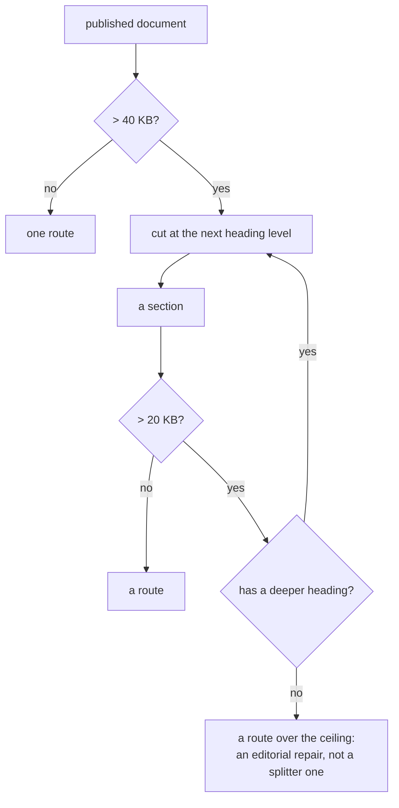

# 0225 — The split goes one level deeper

> **Status:** done (2026-09-24) — phases `b4e63064`, `98ca086d`, `779ba5fe`; close repairs
> `e4fce8ab`. Mode 4 round 1: no blockers, no majors, two minors and one nit, all fixed at the
> close. Verified: the Phase 1 command (191 routes, 0 duplicates, largest 29,528 B), both site gates
> against the built site, the full suite from the ledger. Version 0.147.1.
> **Created:** 2026-09-23
> **Approved:** 2026-09-24 (user) — queued first in lane b. The `Pages` workflow is red and
> the site has not deployed since 2026-09-23, so this one is ahead of the rest of the queue.
> **Owner skill(s):** dev
> **Related ADRs:** [0247](../../adrs/0247-the-split-recurses-and-the-ceiling-is-an-assertion-about-the-corpus.md) (accepted, Outcome),
> [0166](../../adrs/0166-a-published-document-splits-into-routes-by-size.md),
> [0154](../../adrs/0154-the-reader-facing-docs-publish-as-a-site.md),
> [0163](../../adrs/0163-a-long-document-carries-a-generated-contents-block.md)

## TL;DR

The `Pages` workflow is red on every push to `main` and the site has not deployed since
2026-09-23, because one route's source is 32,711 bytes against a 30,000 ceiling. ADR-0247 makes the
split recurse instead of stopping at `###`. Four functions in
`site/src/plugins/split-document.mjs` collaborate to produce routes, and **three of them assume
exactly two levels**, so the change is not one line.

## Context & problem

`### What the report's columns mean` in `docs/capturing.md` grew past the ceiling when
[Plan 0207](0207-the-commitments-get-their-instruments.md) Phase 2 added the report's cost
columns. It is a `###` with nine `####` children, so its content is already structured for a cut the
splitter declines to make.

Measured 2026-09-23 at `dc9e0bc6` by running the site's own splitter over the published set: 173
routes, one over the ceiling at 32,711 B, next largest 29,528 B, p90 10,354 B, p50 2,904 B. Cutting
the offender at `####` yields an index of 2,428 B and nine routes whose largest is 6,487 B.

**What makes this more than a threshold edit** is that the two-level assumption is spread across the
module:

| Function | Today | Under recursion |
|---|---|---|
| `splitDocument` | builds `sections`, each with `children` | needs children at any depth |
| `chunksOf` | `index`, then each section, then its `children` | needs a walk |
| `sidebarGroup` | one nested group per section with children | needs to nest to any depth |
| `fragmentMap` | keys every heading to its route | needs the deeper routes |

`scripts/check-site-routes.mjs`'s first property is that **every route a published source
contributes appears in the sidebar**, so a splitter that recurses while the sidebar does not trades
the size failure for an orphan failure.

## Decision

Implement ADR-0247: a section over `SECTION_SPLIT_BYTES` splits at the next heading level,
repeatedly, until it is under the threshold or has no deeper heading. Thresholds unchanged, entry
condition unchanged, terminal depth removed.



## Implementation phases

**`site/` has no test framework** — no test script, no test file, no runner in `site/package.json`.
This plan does not introduce one: the two site gates already run on every push in
`.github/workflows/pages.yml` and they assert the properties that matter here, so a framework added
for this change would be a second, weaker guard plus a dependency. Phase 1's check is therefore a
single `node` command against the module, and Phase 2's is the real gate.

### Phase 1 — The split recurses, and everything reading it follows

- **Owner skill:** dev
- **What:** `splitDocument` builds children at any depth; `chunksOf` walks them; `sidebarGroup`
  nests to the depth produced; `fragmentMap` keys the deeper headings to the routes that carry them.
  One module, one concept, one commit.
- **Files touched:** `site/src/plugins/split-document.mjs`.
- **Done when:** this command prints `32711` before the change and a number under `30000` after it,
  and prints no route twice:

  ```sh
  node --input-type=module -e "import {readFileSync} from 'node:fs'; import {PUBLISHED} from './site/src/plugins/rewrite-links.mjs'; import {splitDocument, chunksOf} from './site/src/plugins/split-document.mjs'; const R=new URL('file://'+process.cwd()+'/'); let m=0,n=0,seen=new Set(),dup=0; for (const [src,{route,title,wrap}] of Object.entries(PUBLISHED)) { if (wrap!==undefined) continue; const sp=splitDocument(readFileSync(new URL(src,R),'utf8'),route,title); if(!sp) continue; for (const c of chunksOf(sp)) { n++; if(seen.has(c.route)) dup++; seen.add(c.route); m=Math.max(m,Buffer.byteLength(c.body,'utf8')); } } console.log(JSON.stringify({routes:n,duplicates:dup,largest:m}));"
  ```

  It needs `npm --prefix site ci` first, for `github-slugger`. `duplicates` must be `0` in both runs.

### Phase 2 — The built site passes both gates

- **Owner skill:** dev
- **What:** the two gates that need a built site are run, for the first time outside CI, and
  whatever they report is repaired.
- **Files touched:** none expected; any repair the gates demand.
- **Done when:** `node scripts/check-site-routes.mjs` and `node scripts/check-site-links.mjs` each
  exit 0 against a `site/dist/` built by `npm --prefix site run build`, and the routes gate's
  success line reports a largest split route under 30,000.
- **Note:** the build renders mermaid through Playwright, so on a machine that has never run it this
  phase needs `npx --prefix site playwright install chromium` first — no browser is present on the
  Arch box as of 2026-09-24. **Not `--with-deps`**, which resolves system package names for
  Debian and Ubuntu only and fails on Arch; the shared libraries chromium needs are the box's own
  concern, and `playwright install` names what is missing if any is. That download is the only step
  here needing the network beyond `npm ci`.

### Phase 3 — The prose stops arguing a stop that no longer exists

- **Owner skill:** dev
- **What:** the doc comments justifying the stop at `###` justify the recursion instead, and
  `ROUTE_SOURCE_CEILING`'s comment says it asserts something about the corpus rather than about the
  algorithm, naming the instance it cannot repair.
- **Files touched:** `site/src/plugins/split-document.mjs`, `scripts/check-site-routes.mjs`.
- **Done when:** `git grep -n "stops at" -- site scripts` returns no line claiming the split stops at
  `###`, and `git grep -n "on-device-validation" -- site scripts` returns the ceiling's comment.

## Risks & open questions

- **Starlight's sidebar nesting depth is unverified.** Nested groups are supported; three levels
  deep with `collapsed` at each is not something this site does today. If Starlight refuses, the
  fallback is to flatten the third level into its parent group rather than to abandon the split,
  and Phase 2's done-when is what surfaces it.
- **URLs move for the second time in eighteen days.** ADR-0247 accepts this knowingly; it is called
  out here because it is the consequence a reader of the plan would otherwise meet in the diff.
- **`## Checklist` in `docs/on-device-validation.md` is 472 bytes under the ceiling with no internal
  headings.** Nothing in this plan helps it. It is recorded in ADR-0247 as a standing debt whose
  repair is editorial.

## What this plan does NOT do

- **It does not raise the ceiling.** The gate and the constant both refuse that in advance.
- **It does not edit a file under `docs/` or `presets/`** to change how the site cuts it — the
  one-source rule stands.
- **It does not add headings to `## Checklist`.** That is an editorial call about a hand-run
  checklist, and it belongs to whoever owns that document's shape.

## Implementation log

> Written as the phases land. **The phases above are the contract; everything here is what
> happened.**

**Lane:** `/home/igor/Work/rlx-plan-0225` on `plan-0225-the-split-goes-one-level-deeper`

| phase | owner | state | commit |
|---|---|---|---|
| 1 — The split recurses | dev | done | `b4e63064` |
| 2 — The built site passes both gates | dev | done | `98ca086d` |
| 3 — The prose stops arguing a stop | dev | done | `779ba5fe` |

### Notes

- Phase 1 measurement: before `{"routes":173,"duplicates":0,"largest":32711}`, after
  `{"routes":191,"duplicates":0,"largest":29528}`. 18 new routes, not 9: two more `###` sections
  in `presets/README.md` were over 20 KB with `####` children and split too -
  `guide/parameter-roster/systems-and-their-named-parameters/shape_field--the-same-roster-at-frame-scale`
  (5 children) and `.../tuple-picks-a-whole-figure-framing-included` (4 children).
- The recursion searches only `depth + 1` for children; a section over 20 KB with no heading one
  level down stays whole even if it has deeper headings.
- Phase 2 needed no repair; its commit carries only this log. Routes gate: `216 built routes,
  214 from the published set, every one in the menu; largest split route 29528 B`. Links gate ran
  without a `dist/api/` tree, so `/api/` hrefs were not checked locally. Starlight rendered the
  three-deep collapsed groups; the flatten fallback in Risks was not needed.
- Phase 3 gave `ROUTE_SOURCE_CEILING` its own doc comment, split out of the module's header block,
  and also rewrote the oversized-route failure message in `check-site-routes.mjs`, which still
  pointed at new ADR-0166 arithmetic.
- Followup not acted on: `CLAUDE.md`'s `scripts/` entry still says a route over the ceiling means
  *ADR-0166's arithmetic needs redoing*; outside this plan's files.
- Followup not acted on: ADR-0247's *"exactly one qualifies"* is contradicted by the three
  sections that split one level deeper (Notes, Phase 1).

### Close triggers

- **`presets/` touched:** no
- **Plan header `Closes:`** none
- **What shipped:** fix-only (site build; the `Pages` workflow's route-size failure)
- **Operator docs touched:** none
- **Backlog probes (`node scripts/check-backlog-claims.mjs`):** exit 0; 21 live entries, 30
  moved-path advisories, none from this plan's files
- **Full suite:** owed to the conductor's pre-review gate (ADR-0207)
- **Outstanding `human` phases:** none

## Close review

Round 1, conductor-run, reviewed at `f6a476f3`. No earlier round, so no finding was resolved by a
fix round.

**Verdict: Plan 0225 landed cleanly; no blockers, no majors, two minors and one nit, all prose, all
repaired at the close in `e4fce8ab`.**

### Evidence

- **Full suite:** `with-lock: skipped cargo nextest run --workspace: tree 466d572 is green in the
  suite ledger, run by gate 0225-pre-review at 2026-09-24T06:52:33.636Z: 1805 tests run: 1805 passed
  (5 slow), 7 skipped`. The plan touches no Rust, so this is the drift guard's standing reading
  rather than a test of the change.
- **Phase 1 done-when, re-run by the review:** `{"routes":191,"duplicates":0,"largest":29528}` —
  under 30,000, no route twice. Matches the log's after-figure.
- **Phase 2 done-when, re-run against the lane's `site/dist/`:** `check-site-routes.mjs` —
  `216 built routes, 214 from the published set, every one in the menu; largest split route 29528 B,
  under 30000`; `check-site-links.mjs` OK with the local `/api/` NOTE (the Pages workflow passes
  `--require-api`). The `dist/` is Phase 2's build; Phase 3 changed only comments and one failure
  message, neither of which moves output. The nine `####` routes under
  `engine/capturing/the-shot-cli/what-the-reports-columns-mean/` exist in the build.
- **Phase 3 done-when:** `git grep -n "stops at" -- site scripts` returns one line,
  `scripts/check-doc-links.mjs:269`, about a regex, not the split. `git grep -n
  "on-device-validation" -- site scripts` returns the ceiling's comment at
  `site/src/plugins/split-document.mjs:31` and the gate header at `scripts/check-site-routes.mjs:24`.
- **`cargo doc` / fmt / clippy:** run in the close gate on the tagged tip.

### Lens 1 — alignment

All three phases landed as written, each an own commit, each with an in-vocabulary `dev` owner tag.
The four functions the plan named all moved: `sectionsAt` replaces the two hand-unrolled levels in
`splitDocument` with one recursive builder (depth-guarded at 6); `chunksOf` walks the tree;
`sidebarGroup` builds groups recursively with each parent's route as its `Overview` entry, which is
exactly what `check-site-routes.mjs`'s orphan property needs; `fragmentMap` needed no edit because it
iterates `chunksOf`, and the `from`/`to` disjointness `sectionsAt` preserves is what keeps its
per-chunk slugger correct. `content.config.ts` reads only `chunksOf`/`contentsList`/`kind === 'index'`,
so a depth-3 parent gets its `In this section` list without change. The log is shorter than the
phases section and accurate against the tree.

### Lens 2 — layering

`site/` only; no core, ABI or protocol surface touched. One module, one concept.

### Lens 3 — docs and bookkeeping

No operator doc describes the split; the sweep finds nothing to change beyond the two minors below.
Owed at close: ADR-0247 `proposed -> accepted` with an `Outcome`, the `docs/adrs/README.md` row and
ADR-0166's `extended by 0247` forward-reference, plan to `done/`, plans README, a patch bump
(fix-only: a red `Pages` workflow repaired) and the studio sync.

### Lens 4 — correctness

The recursion is conditional on the same 20 KB measurement at every level, measured with the heading
line as before; slugs are unique among siblings with the parent route disambiguating. No numeric
assertion was added.

### Lens 5 — design integrity

The special case is gone rather than moved: one builder, one walk, one sidebar item function.

### Findings

**minor**

1. **`docs/adrs/0247-the-split-recurses-and-the-ceiling-is-an-assertion-about-the-corpus.md:71` —
   the ADR's arithmetic is falsified by its own implementation.** It says *"exactly one qualifies"*,
   *"nine entries and nine routes"* and *"ten pages"*; the recursion also split two `###` sections in
   `presets/README.md` (`shape_field` with 5 children, `tuple` with 4), for 18 new routes (173 ->
   191). The body is append-only once accepted, so the repair is a dated `Outcome` section at
   acceptance. **Fixed in `e4fce8ab`.**
2. **`CLAUDE.md:186` — the `scripts/` entry still said a route over the ceiling means *"ADR-0166's
   arithmetic needs redoing"*,** which Phase 3 retired in both the constant's comment and the gate's
   failure message. **Fixed in `e4fce8ab`.**

**nit**

3. **`docs/adrs/0247-...md:54` — the Decision says *"until it is under the threshold or has no
   deeper heading"*; `sectionsAt` searches only `depth + 1`**, so a section that skips a level stays
   whole. The code's doc comment states this plainly and no instance exists in the corpus. Recorded
   in the same `Outcome`. **Fixed in `e4fce8ab`.**

### Close notes

- Preset curation: not triggered, `presets/` untouched. Backlog: the plan closes no entry.
- Backlog probes: exit 0, 21 live entries. Translation advisory: `how-it-works.ru.md`,
  `running.ru.md` and the foobar `READ-ME-FIRST.ru.md` are stale, none moved by this plan.
- Version: **0.147.1**, patch — the plan repairs the red `Pages` workflow and ships no feature.
