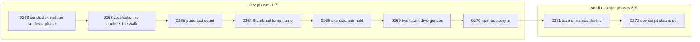

# 0233 — The close reviews' small findings are repaired

> **Status:** done - closed 2026-09-29 by the conductor's close, round 1: phases 4e2085d5, 0c3db3c5,
> 959b4f85, 96b39b12, 6b9c6a45, cae0ca7b, eb1b4274, 1dff2c94, 6ccaa3c1; review clean (no blockers,
> no majors, two minors, one nit); full suite green on the graded tree. Minor 1 repaired at the
> close; minor 2 (`--stream`'s empty-trail Prev) and nit 3 left open. v0.153.0.
> **Created:** 2026-09-29
> **Approved:** 2026-09-29 (owner), selected for the conductor; queued in `tools/conductor/queue.json`
> **Owner skill(s):** dev, studio-builder
> **Related ADRs:** [0239](../../adrs/0239-rotation-carries-two-orders-and-the-shuffles-seed-varies-per-launch.md) (the sequential walk),
> [0230](../../adrs/0230-thumbnails-are-rendered-by-a-subprocess-of-the-player-itself.md) (the thumbnail pass),
> [0159](../../adrs/0159-the-component-gets-its-own-size-cap-and-the-recipe-carries-it.md) and
> [0231](../../adrs/0231-the-standalone-size-cap-is-re-derived-from-what-it-carries-and-the-build-reports-it.md) (the size caps),
> [0244](../../adrs/0244-the-npm-graphs-are-gated-like-the-cargo-graph-and-an-install-script-runs-by-name.md)
> (the npm gate)
> **Closes:** design-backlog 0263, 0264, 0265, 0266, 0268, 0269, 0270, 0271, 0272

## TL;DR

Nine small defects found by close reviews and filed on 2026-09-27 and 2026-09-29 are repaired, one
phase each, with no human phase, so the conductor runs the plan start to finish. The only
user-visible change is the owner's decision on backlog 0268: under `order = "sequential"`, a preset
picked in the browser becomes the point the next Space continues from.

## Context & problem

Each close review since Plan 0206 left minors and nits that were code rather than prose, so the
close could not repair them (ADR-0209). They were filed as backlog 0263-0272 on 2026-09-27/29. None
needs a design beyond what its entry states, except 0268, where the owner chose on 2026-09-29 that
**a browser pick re-anchors the sequential walk**, the reading that delivers ADR-0239's "Space means
the next preset again".

Taken one at a time, each would cost a plan's ceremony for a few lines of code. Taken together, they
are one unattended run.

## Decision

One plan, one phase per entry, ordered so the `dev` phases are contiguous and the two
`studio-builder` phases follow them. Each phase is the repair its backlog entry names, and nothing
else. Backlog 0273 (the conductor's write bound) is **not** here: it edits the settings a conductor
session runs under, so it is its own plan, taken interactively.

## Architecture diagram

## Implementation phases

### Phase 1 — A skipped phase settles in the conductor's log reading (backlog 0263)
- **Owner skill:** dev
- **What:** `rowIsDone` in `tools/conductor/lib/plan.mjs` also accepts a state beginning `not run`,
  so a phase whose done-when was not to run no longer parks its plan as a disagreement. The doc
  comment says so.
- **Files touched:** `tools/conductor/lib/plan.mjs`, `tools/conductor/test/plan.test.mjs`.
- **Done when:** `node --test tools/conductor/test/plan.test.mjs` passes with new cases asserting that
  `not run: Phase 1 falsified the candidate` and `not run` are done, and that `not started` and
  `parked: ...` are not. `node --test tools/conductor/test/` passes.

### Phase 2 — An explicit selection re-anchors the sequential walk (backlog 0268)
- **Owner skill:** dev
- **Amended 2026-09-29 (architect), after the phase parked `plan_wrong`.** The first file list named
  only `director.rs`, which cannot learn what was picked: the browser's selection is in `input.rs`
  and reaches the traversal only through `show.rs`, and the phase never said whether a selection
  over the control protocol re-anchors as well. **Every explicit selection re-anchors**, whether
  it is a browser pick or a preset selected over the control protocol (the studio, OSC). This is the
  reading the owner's 2026-09-29 answer implies: the next Space continues from what is on screen,
  however it got there. Rotation's own advance does not re-anchor, because it is the walk itself.
- **What:** Under `order = "sequential"`, an explicit selection makes the selected preset the anchor
  the next Space steps from. With alpha to echo: Space gives alpha, Space gives bravo, select
  `echo`, and Space gives alpha (the successor of `echo`, wrapping). Shuffle is unchanged.
  `docs/running.md` says what Space does after a selection, under each order.
- **Files touched:** `standalone/src/director.rs`, `standalone/src/director/tests.rs`,
  `standalone/src/show.rs`, `standalone/src/input.rs`, `standalone/src/control.rs`,
  `standalone/src/app_state.rs`, `docs/running.md`. The dev lane touches only those of the last four
  that carry a selection into the traversal.
- **Done when:** a test in `director/tests.rs` walks exactly the sequence above and asserts `alpha`
  after the selection; a second asserts a selection under shuffle leaves the shuffle's behaviour as
  it was; and a test at the `show.rs` seam asserts that a browser selection and a control-protocol
  selection both reach the anchor. `cargo nextest run -p standalone` passes (through the suite lock).

### Phase 3 — The pane-clearance test counts the library it measures (backlog 0265)
- **Owner skill:** dev
- **What:** `standalone/src/overlay/tests.rs` takes the library size from
  `rlx_core::preset::default_presets().len()` instead of the literal `114`.
- **Files touched:** `standalone/src/overlay/tests.rs`.
- **Done when:** `git grep -n "const LIBRARY: usize = 114" -- standalone/src/overlay/tests.rs`
  finds nothing, and the pane-clearance test passes.

### Phase 4 — Two players' thumbnail passes cannot collide (backlog 0264)
- **Owner skill:** dev
- **What:** The in-flight file name carries the writing process's id, so two passes rendering the
  same preset write two different temp files, and `discard_partials` removes only files whose owning
  process is no longer running, or only its own. The dev lane chooses which and states it in the doc
  comment. `docs/running.md` says the studio's player runs the thumbnail pass too.
- **Files touched:** `standalone/src/thumbs.rs`, `docs/running.md`.
- **Done when:** a test in `thumbs.rs` runs two passes into one cache directory for the same
  preset and asserts both finish without a failure note and the cache holds one complete entry.
  `cargo nextest run -p standalone -E 'test(/thumb/)'` passes.

### Phase 5 — The exe's size pair is held equal in all three places (backlog 0266)
- **Owner skill:** dev
- **What:** Beside guard (e) in `core/tests/suite/hygiene.rs`, a guard reads the exe cap and warning
  threshold out of `docs/nfr.md` section 4, `packaging/windows/stage.ps1` and
  `packaging/macos/bundle.sh`, and asserts all three agree and the warning is 90 % of the cap.
  `packaging/linux/stage.sh` gains the same measurement block the other two recipes carry (measure
  the binary, print it against the cap, warn above the threshold, never fail).
- **Files touched:** `core/tests/suite/hygiene.rs`, `packaging/linux/stage.sh`.
- **Done when:** the new guard passes, and fails when one copy is edited, as its own seeded check or
  a documented manual edit; `bash -n packaging/linux/stage.sh` is clean, and
  `git grep -n "16777216" -- packaging/linux/stage.sh` finds the cap.

### Phase 6 — Two latent divergences are closed (backlog 0269)
- **Owner skill:** dev
- **What:** In `standalone/src/capture_linux/rt.rs`, the `bytes.get_mut(carry..filled)` exit records
  `lost` the way the `stream.read` error path does. In `core/src/render/tests.rs`, `Observed<T>`
  forwards `as_feedback_sink` to the observed scene.
- **Files touched:** `standalone/src/capture_linux/rt.rs`, `core/src/render/tests.rs`.
- **Done when:** both ends of the capture loop report through the same path, and a test hands an
  observed attractor preset with a `[feedback]` table over and asserts the table reaches it.
  `cargo nextest run --workspace -P fast` passes.

### Phase 7 — An npm advisory without a GHSA id can be excepted (backlog 0270)
- **Owner skill:** dev
- **What:** `scripts/check-npm-audit.mjs`'s allow reader accepts the `npm-<source>` id its own survey
  assigns to an advisory with no GHSA url, so such an advisory can carry a reasoned exception like
  any other. The script's header says so.
- **Files touched:** `scripts/check-npm-audit.mjs`.
- **Done when:** `node scripts/check-npm-audit.mjs --self-test` passes with a new case accepting an
  `npm-<source>` allow entry and still rejecting a malformed id.

### Phase 8 — The missing-player banner names the settings file (backlog 0271)
- **Owner skill:** studio-builder
- **What:** When no player resolves, the banner states the full path of `settings.json` on this
  machine, which the main process already knows, alongside the key to set.
- **Files touched:** `studio/electron/main.ts`, `studio/renderer/App.tsx`,
  `studio/renderer/App.test.tsx` (and the shared type the renderer's `info` comes through, if it
  lives elsewhere).
- **Done when:** a test renders the missing-player state and asserts the banner text contains the
  settings path it was given. The studio's typecheck, lint and tests pass.

### Phase 9 — `npm run dev` leaves nothing running (backlog 0272)
- **Owner skill:** studio-builder
- **What:** The `dev` script's `concurrently` call ends every process when any one exits.
- **Files touched:** `studio/package.json`.
- **Done when:** `git grep -n -e "--kill-others" -- studio/package.json` finds the dev script.

## Risks & open questions

- **Phase 4's cleanup rule is a real choice.** Removing only its own partials leaves a crashed
  process's file behind until the next run; removing a dead process's needs a liveness check that
  differs per platform. Either is acceptable; the phase says which in the code.
- **Phase 5 reads three file formats with text matching.** A reformatted recipe could make the guard
  read nothing. The guard asserts it found each copy, so a failed parse is red rather than vacuous.
- **Phase 2 changes behaviour an operator may have learned.** It is the owner's decision, and the
  running.md line is where it is said.
- **Phases 8-9 need `studio/node_modules` in the lane.** The conductor installs it for a
  studio-builder phase; a failed install parks as `studio_install` and retries.

## What this plan does NOT do

- **It does not bound the conductor's `Write` tool** (backlog 0273). That is its own plan and ADR.
- **It does not change the shuffle order** or anything about the browser beyond what Space does next.
- **It does not change any size cap.** Phase 5 holds the existing figures equal; it moves none.

## Implementation log

> Written by `dev` — one row per phase as that phase's commit lands, and the close block after the
> last one. **The phases above are the contract; everything here is what happened.**

**Lane:** `plan-0233-the-close-reviews-small-findings-are-repaired` at `/home/igor/Work/rlx-plan-0233`

| phase | owner | state | commit |
|---|---|---|---|
| 1 — a skipped phase settles | dev | done | 4e2085d5 |
| 2 — an explicit selection re-anchors the sequential walk | dev | done | 0c3db3c5 |
| 3 — the pane test counts the library | dev | done | 959b4f85 |
| 4 — thumbnail passes cannot collide | dev | done | 96b39b12 |
| 5 — the exe size pair is held | dev | done | 6b9c6a45 |
| 6 — two latent divergences | dev | done | cae0ca7b |
| 7 — a non-GHSA advisory can be excepted | dev | done | eb1b4274 |
| 8 — the banner names the settings file | studio-builder | done | 1dff2c94 |
| 9 — npm run dev leaves nothing running | studio-builder | done | 6ccaa3c1 |

### Notes

- Phase 2: besides the browser pick and `ctl/preset`, the window's other explicit selections
  re-anchor too (favourite digits, console `random`, A/B, `Backspace` and its roster-predecessor
  fallback), through `AppState::on_preset_selected`. The headless `--stream` path's `prev` fallback
  when the trail is empty (`standalone/src/stream.rs`, not in the phase's file list) does not
  re-anchor; its trail step-back and `ctl/preset` do, through `show.rs`. The anchor is a field of
  its own beside `last`, so the shuffle's cycle-restart exclusion is untouched.
- Phase 3's commit 959b4f85 left a comment `check-comment-hygiene.mjs` rejects (`no longer`); the
  one-line rewording rides in Phase 4's commit, outside Phase 4's file list.
- Phase 4: the cleanup rule chosen is "only its own": a pass removes the partial of each child it
  ran, by that child's pid, once the child ends, and no longer sweeps the directory at start. A
  partial whose child and pass both died hard stays behind, unread. The two-pass test's child is the
  test binary re-run on an `#[ignore]`d case that writes through `write_entry`; with the pid dropped
  from the temp name it fails (`thumbnail failed: Gyre: exit status: 101`), checked by hand.
- Phase 5: the guard reads the Linux recipe too, as a fourth copy, since the phase adds the pair
  there. The seeded check is its own test, `the_exe_size_guard_refuses_an_edited_copy`.
  `bash -n packaging/linux/stage.sh` was not run: the session's allowlist denies `bash -n` and
  `sh -n`; the block mirrors `packaging/macos/bundle.sh`'s. `docs/nfr.md` section 4 still names
  only `stage.ps1` and `bundle.sh` as the recipes that print the length (outside the file list).
- Phase 6: the observed scene in the new test is a recording `FeedbackSink` in the attractor's
  roster slot handed an attractor preset, not the real `AttractorScene`, whose table is private to
  its module. With `Observed`'s forward disabled the test fails (`left: None`), checked by hand.
  The capture loop's two exits are one `lost` store; nothing tests that path.
- Phase 8: `AppInfo` gains `settingsFile`, the path main already reads settings from. The type is
  declared three times (`studio/electron/ipc/appHandlers.ts`, `studio/electron/preload/api/app.ts`,
  `App.tsx`), so the first two ride in the commit as the shared type the phase allows.

### Close triggers

- **`presets/` touched:** none (`git diff --stat main...HEAD`).
- **Plan header `Closes:`** design-backlog 0263, 0264, 0265, 0266, 0268, 0269, 0270, 0271, 0272
- **What shipped:** a behaviour change (Phase 2: an explicit selection re-anchors the sequential
  walk), fixes in `standalone/`, `studio/`, `scripts/`, `tools/conductor/` and
  `packaging/linux/stage.sh`, and test guards in `core/`.
- **Operator docs touched:** `docs/running.md` (Phases 2 and 4).
- **Backlog probes (`node scripts/check-backlog-claims.mjs`):** exit 0, "50 stated reductions still
  hold across all 24 live entries (4 unprobeable)"; 35 moved-path advisories, among them 0165, 0187
  and 0220 on `app_state.rs` / `show.rs` and 0260, 0261 on `thumbs.rs`, which this plan touched.
- **Full suite:** owed to the conductor's pre-review gate (ADR-0207).
- **Outstanding `human` phases:** none.

## Close review

> The conductor's round-1 review, in full, graded at `f79c82b8`. Round 1 was the only round, so no
> earlier finding was resolved by a fix round. At the close, minor 1 was repaired in `d664dbc6`
> (`docs/nfr.md`); minor 2 is code and stays open; nit 3 owes no repair in this lane.

### Plan 0233 — close review, round 1

Graded at `f79c82b8d55a1b627f19ba7f70a66b819207e9a8` (tree `4eaa850e`), lane
`/home/igor/Work/rlx-plan-0233` on `plan-0233-the-close-reviews-small-findings-are-repaired`.

**Verdict: Plan 0233 landed cleanly. No blockers, no majors, two minors and one nit.** All nine
phases are present, each owner-tagged in vocabulary, each with the test or grep its done-when names,
and the full suite is green on the exact tree graded.

#### Evidence run in this session

- **Full suite:** `node .../with-lock.mjs suite -- cargo nextest run --workspace` printed
  `with-lock: skipped cargo nextest run --workspace: tree 4eaa850 is green in the suite ledger, run
  by gate 0233-pre-review at 2026-09-29T19:29:32.936Z: 1867 tests run: 1867 passed (5 slow), 8
  skipped`. `git rev-parse HEAD^{tree}` is `4eaa850e3a53...`, so the record covers the graded tip.
- `RUSTDOCFLAGS="-D warnings" cargo doc --workspace --no-deps`: clean.
- `node --test tools/conductor/test/`: 479 tests, 477 pass, 0 fail, 2 skipped (Windows-only).
- `node scripts/check-npm-audit.mjs --self-test`: 34 of 34.
- `npm --prefix studio run typecheck`, `run lint`, `test`: clean; vitest 299/299 in 32 files.
- `node scripts/check-comment-hygiene.mjs`: OK. `node scripts/check-backlog-claims.mjs`: exit 0,
  50 reductions across 24 live entries; the moved-path advisories on `app_state.rs`, `show.rs` and
  `thumbs.rs` (0165, 0187, 0220, 0260, 0261) are paths this plan touched, and none went red.
- `git status` clean before and after.

#### Lens 1 — alignment

- **Implementation log** present, shorter than the phases section, phase-to-commit table complete.
  Its `Full suite:` bullet defers to the conductor's pre-review gate, which is correct in conductor
  mode and is evidenced above.
- **Phase 1** (`tools/conductor/lib/plan.mjs:126`): `rowIsDone` accepts `^not run\b`; the new test
  asserts both `not run` spellings true, `not started` and `parked: ...` false, and `donePhases` on a
  parsed plan. Matches the done-when.
- **Phase 2**: `Traversal` gains an `anchor` separate from `last`, so the shuffle's
  cycle-restart exclusion is untouched; `reanchor` drops `upcoming` only under sequential.
  `director/tests.rs` walks alpha, bravo, select `echo`, alpha exactly as the plan wrote it, and the
  shuffle test compares a 12-draw walk with and without selections under one seed. The `show.rs`
  test drives `ctl/preset charlie` over a real loopback socket through `apply_control_rest`, and the
  browser leg calls `Show::reanchor`, the seam `AppState::on_preset_selected` calls. The window's
  browser, favourites, console `random`, A/B, Backspace and its fallback all route through
  `on_preset_selected`. `docs/running.md` states the two orders' behaviour after a pick. One path
  was missed: see minor 2.
- **Phase 3**: literal gone (`git grep` finds nothing); the library size is read from
  `default_presets()`.
- **Phase 4**: temp name is `<entry>.<pid>.rlxthumb-part`; cleanup chosen is "only its own child's,
  by pid, after the child ends", stated in `discard_partials`'s doc comment together with its cost.
  The comment's `nice execs the player` claim holds (`nice` execs). The two-pass test re-runs the
  test binary on an ignored case that writes through the shipped `write_entry` 200 times, and asserts
  both passes' last note, one complete entry, and no other file. `docs/running.md` says the studio's
  player runs the pass too.
- **Phase 5**: the guard reads NFR section 4 and all three recipes, refuses a copy it cannot parse,
  and asserts 90 %; the seeded test edits each recipe's warning, renames each assignment away, and
  moves NFR's warning, each refused. Since a `replace` that matched nothing would leave the guard
  green and fail the seeded test, its green run proves the edits landed. `stage.sh` gains the
  measurement block, never fatal. `git grep 16777216` finds the cap. `bash -n` was not run (nit 3).
- **Phase 6**: the capture loop now has one exit that stores `lost` for both an out-of-bounds window
  and a failed read (`capture_linux/rt.rs:54`), with no allocation added on that thread.
  `Observed<T>` forwards `as_feedback_sink` only when the observed scene is a sink, and the new test
  asserts a non-default `[feedback]` table reaches the scene in the attractor slot.
- **Phase 7**: `isAdvisoryId` accepts a whole GHSA id or `npm-<digits>`; self-test covers the
  survey's `npm-1234` naming, acceptance, excusal through `judge`, and five malformed ids refused.
- **Phase 8**: `AppInfo.settingsFile` from `main.ts`'s `file`, the banner interpolates it; the test
  asserts the path and `"playerPath"` in the banner detail, and the banner's absence with a player.
- **Phase 9**: `--kill-others` on the `dev` script.

#### Lens 2 — layering, real-time, contracts

No core layering change (the core diff is test-only). No C ABI change. No control-protocol widening:
Phase 2 reacts to the existing `ctl/preset`. The capture-thread edit adds no allocation, lock or log.

#### Lens 3 — docs and bookkeeping

- Operator docs: `docs/running.md` swept for Phases 2 and 4. `docs/nfr.md` section 4 is now stale
  about which recipes measure (minor 1). No other user-facing doc names the banner text.
- Owed at the close: plan to `done/`, backlog 0263, 0264, 0265, 0266, 0268, 0269, 0270, 0271, 0272
  moved from the archive's `### Promoted` table to `### Closed` with their `CLOSED` markers, the plans
  index, `toc.mjs`, and a **minor** version bump (Phase 2 is a user-visible behaviour change), with
  the studio's two version copies following. `presets/` untouched: no curation owed.

#### Lens 4 — correctness

The integer arithmetic of the 90 % guard (`16777216 * 9 / 10 = 15099494`) matches the committed
figure. The show-seam and render tests skip without an adapter in ADR-0016's shape. The accepted
cost of Phase 4 (a partial from a pass that died hard is never swept) is stated in the code and the
plan's risks.

#### Lens 5 — design integrity

The anchor kept apart from `last` is the right separation: sequential reads one field, the shuffle
the other, and neither can reach the other's state. `on_preset_selected` gives the window one
funnel for explicit selections; the `--stream` shell lacks the equivalent (minor 2).

#### Findings

**minor 1 — `docs/nfr.md:234-239` names two measuring recipes where there are now three.**
Phase 5 added the measurement block to `packaging/linux/stage.sh`, but NFR section 4 still says
"both recipes below measure per executable", names only `stage.ps1` and `bundle.sh` as printing the
length, and says "Neither fails a release". The implementation log notes it as out of the file list.
**Repair (prose, close-repairable):** replace "and both recipes below measure per executable." with
"and every recipe below measures per executable.", replace
"`packaging/windows/stage.ps1` and `packaging/macos/bundle.sh` print the length on every build," with
"`packaging/windows/stage.ps1`, `packaging/macos/bundle.sh` and `packaging/linux/stage.sh` print the
length on every build,", and replace "Neither fails" with "None fails". *Repaired at the close in
`d664dbc6`.*

**minor 2 — `standalone/src/stream.rs:1130` the `--stream` Prev fallback selects without
re-anchoring.** The plan's amended Phase 2 says every explicit selection re-anchors. In the window,
`Backspace`'s roster-predecessor fallback does (`AppState::step_previous` calls
`on_preset_selected`); in the headless `--stream` shell the same fallback (`ConsoleAction::Prev` with
an empty trail) calls `renderer.select_preset(index)` and `note_shown` only, so under sequential the
next `Next` gives the library's first name rather than the successor of what is on screen. Rare (only
before anything has been drawn) and the log discloses it, but it is the two run modes disagreeing.
**Fix (code, not close-repairable):** after the `select_preset` there, call
`show.reanchor(&outgoing, renderer)`. *Open.*

**nit 3 — `docs/plans/0233-...md:118` Phase 5's `bash -n` done-when is not runnable under the
conductor.** Neither the implementing session nor this review could run
`bash -n packaging/linux/stage.sh`: the conductor's allowlist denies it. The block was read by eye
here and is well-formed (`version` is set at line 102 before its use at 133; `set -u` safe). The
first real exercise is the release job at the next tag. Recorded so a plan does not name a check the
conductor cannot run; no repair owed in this lane. *Open.*

## Followups (after this lands)

- Backlog 0273, the conductor's write bound, is planned separately.
- The close review's minor 2 is open: `--stream`'s empty-trail Prev does not re-anchor.
