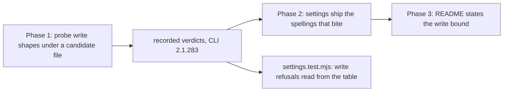

# 0234 — A conductor session writes only where it works

> **Status:** done - closed 2026-09-29 by the conductor's close, round 1. Phases 1-3 in `edfb02a1`,
> `62bf76c6`, `af200b33` + `cf0502e6`. Review: no blockers, no majors, two minors (fixed in
> `79bca2cd`), two nits left open. Full suite 1860 passed on the reviewed tree and re-run on the close
> tip. Version: none (the conductor never ships). ADR-0255 accepted with an Outcome. Closes 0273.
> **Created:** 2026-09-29
> **Approved:** 2026-09-29 (owner). Phases 1-3 taken in an interactive session, because they edit
> `tools/conductor/settings.conductor.json`, which every conductor session runs under; queued
> afterwards for its review and close only, as Plan 0208 was
> **Owner skill(s):** dev
> **Related ADRs:** [0255](../../adrs/0255-a-conductor-session-writes-inside-its-lane-and-the-os-temp-directory.md)
> (accepted, Outcome), [0233](../../adrs/0233-a-session-allowlist-safety-claim-is-asserted-against-a-transcript.md)
> **Closes:** design-backlog 0273

## TL;DR

A conductor session may write anywhere its user can, because the allowlist grants the bare `Write`
and `Edit` tools. This plan scopes both to the session's lane and the OS temp directory, decides the
rule spellings with a probe of the real CLI, and asserts the result against the recorded transcript,
as Plan 0208 did for deletion. The first visible result is a table saying what 2.1.283 did with a
write to the lane's parent directory.

## Context & problem

Backlog 0273: the 2.1.282 probe wrote `~/Work/rlx-probe-0187\probe-control.txt`, beside its
worktree, under `settings.conductor.json`. The file was still there on 2026-09-29. Plan 0208 bounded
deletion to the lane and left writing unbounded. The owner chose the bound: lane plus OS temp
directory (ADR-0255).

## Decision

Per ADR-0255: probe first, then ship the spellings the transcript shows bite, then assert them.
If no permission-rule spelling can express the bound, the plan stops at Phase 1 and records that,
and ADR-0255's Alternative C (a path-checking hook) becomes the next plan.

## Architecture diagram

## Implementation phases

### Phase 1 — Write shapes get a transcript
- **Owner skill:** dev
- **What:** `tools/conductor/spike/matcher-probe.mjs` gains write shapes, each attempted with the
  `Write` tool (and one `Edit`): a relative path in the lane, an absolute path in the lane, a path in
  the OS temp directory, a path in the lane's parent (the box directory), and a path in `$HOME`
  (the sandbox). It runs under a candidate settings file whose `Write`/`Edit` grants are
  path-scoped. The parent reads the disk for each target afterwards.
- **Files touched:** `tools/conductor/spike/matcher-probe.mjs`, `tools/conductor/spike/README.md`.
- **Done when:** the README's verdict table gains a row per write shape on a named CLI version, with
  the candidate spellings named, and says in one line whether a spelling exists that allows the lane
  and temp shapes while the parent and home writes are refused. If none does, the phase says so and
  the plan stops here.

### Phase 2 — The settings ship the spellings that bite
- **Owner skill:** dev
- **What:** `settings.conductor.json` replaces the bare `Write` and `Edit` with the spellings Phase 1
  showed. `settings.test.mjs` gains the write cases: refusals asserted against the recorded table,
  allowances through the model.
- **Files touched:** `tools/conductor/settings.conductor.json`, `tools/conductor/test/settings.test.mjs`.
- **Done when:** `node --test tools/conductor/test/` passes; the write refusals read their verdicts
  from `spike/README.md`, and a verdict edited to RAN turns its case red.

### Phase 3 — The README states the write bound
- **Owner skill:** dev
- **What:** `tools/conductor/README.md`'s lane-bound bullet covers writing, names the temp directory
  exception, and cites the transcript.
- **Files touched:** `tools/conductor/README.md`.
- **Done when:** the bullet names the write bound in terms a reader can check against the rules.

## Risks & open questions

- **The matcher may not honour a working-directory-relative spelling.** On 2.1.273 several
  path-scoped spellings did not reach `.claude/`, though that was a restriction on that directory
  rather than a general one. Phase 1 is where this is found, and ADR-0255 names the fallback.
- **The OS temp directory differs per platform.** Linux is `/tmp`, macOS is a per-user
  `$TMPDIR`, and Windows is `%TEMP%`. A spelling that works here may not work there. The probe runs
  here; the Windows row stays owed, as backlog 0267 records for `Remove-Item`.
- **A narrower bound can refuse correct work.** A refused write parks a plan with the denial in its
  log, which is the recoverable direction.

## What this plan does NOT do

- It does not bound `Read`; reading outside the lane is how a session consults a sibling checkout's
  source.
- It does not run the Windows half of the probe (backlog 0267).
- It does not run under the conductor.

## Implementation log

> Written by `dev` — one row per phase as that phase's commit lands, and the close block after the
> last one. **The phases above are the contract; everything here is what happened.**

**Lane:** `main` directly (an interactive session, as Plan 0208)

| phase | owner | state | commit |
|---|---|---|---|
| 1 — write shapes get a transcript | dev | done | edfb02a1 |
| 2 — the settings ship the spellings | dev | done | 62bf76c6 |
| 3 — the README states the write bound | dev | done | af200b33, cf0502e6 |

### Notes

- **Phase 3 took two commits.** `af200b33` carries only this log's row, because the README edit it
  was meant to hold failed its anchor check (0208's close had reworded the bullet) while the commit
  in the same command went ahead. The README text is in the commit carrying this note.
- **A third grant shipped, beyond Phase 1's lane and temp shapes.** The probe's Candidate A reviews
  row (`spike/README.md`) refused a review session's write to `state/reviews/` even with `--add-dir`,
  so the settings also grant `Write`/`Edit(/state/reviews/**)`; ADR-0255's `Outcome` records it.

### Close triggers

- **`presets/` touched:** no
- **Plan header `Closes:`** design-backlog 0273
- **What shipped:** fix-only, in the conductor, which never ships: path-scoped `Write`/`Edit` grants, a `--writes` probe mode, and tests
- **Operator docs touched:** `tools/conductor/README.md` (the operator guide), `tools/conductor/spike/README.md`
- **Backlog probes (`node scripts/check-backlog-claims.mjs`):** exit 0; 50 stated reductions hold across 24 live entries, 4 unprobeable
- **Full suite:** no Rust changed; `node --test tools/conductor/test/` 476 passed, 0 failed. `cargo nextest run --workspace` owed to the conductor's pre-review gate
- **Outstanding `human` phases:** none

## Close review

> The conductor's round-1 review, verbatim from `tools/conductor/state/reviews/0234-round-1.md`,
> with its headings moved down two levels to sit in this section. There was one round, so no earlier
> finding was resolved by a fix round. Minors 1 and 2 were repaired by this close in `79bca2cd`; nits
> 3 and 4 are left open (test logic and a settings rule), and nit 4's cost is named in ADR-0255's
> `Outcome`. No phase is owed.

### Plan 0234 — close review, round 1

Graded at `bad8923d77e1564118e190844a1e18f74165ddad`, on lane `/home/igor/Work/rlx-plan-0234`
(branch `plan-0234-a-conductor-session-writes-only-where-it-works`).

**Verdict: Plan 0234 landed as written. No blockers, no majors, two minors, two nits.** The shipped
bound is the probe's Candidate B. The one departure from ADR-0255 is a third grant,
`/state/reviews/**`, which is right: without it every review and close session would be refused its
own review file. The ADR's text should record that departure at the close.

#### Evidence run in this session

- **Full suite:** `node "/home/igor/Work/Ritmolux/tools/conductor/with-lock.mjs" suite -- cargo nextest run --workspace`
  ran here in full (no ledger skip). It waited 42.1 s for the lock and held it 540.6 s:
  `Summary [ 540.012s] 1860 tests run: 1860 passed (11 slow), 7 skipped`. No Rust changed in this
  plan, so this is the drift check on the merged tree.
- **rustdoc:** `RUSTDOCFLAGS="-D warnings" cargo doc --workspace --no-deps` is clean.
- **Conductor tests:** `node --test tools/conductor/test/` gave 478 tests: 476 pass, 0 fail,
  2 skipped. The log claimed 476 passed, which matches.
- **`node scripts/check-doc-links.mjs`:** OK, 576 files.
- **`node scripts/check-backlog-claims.mjs`:** OK. 50 reductions hold across 24 live entries, and
  4 are unprobeable. The advisory lists 0267's probed paths (`settings.conductor.json` and
  `spike/README.md`) as moved since it was stamped. That is expected: this plan edited both files and
  left 0267's Windows ask untouched.
- **Live check of the bound:** this session runs under the main checkout's
  `tools/conductor/settings.conductor.json`, with the lane as its working directory. The file you are
  reading was written into the main checkout's `tools/conductor/state/reviews/` by the `Write` tool.
  That is the `/state/reviews/**` grant resolving against the settings file's own directory, as the
  spike table claims, on the real conductor path rather than a candidate file.

#### Lens 1 — alignment

- **Phase 1** (`edfb02a1`). `matcher-probe.mjs --writes` adds the roster the plan names: a relative
  lane path, an absolute lane path, a lane subdirectory, the OS temp directory, the lane's parent,
  `$HOME` and an `Edit` in the lane. It adds two shapes beyond that: an `Edit` in the parent, and the
  reviews directory reached with `--add-dir`. The verdict is read off the disk: a `Write` landed if
  its file exists, and an `Edit` landed if its file holds `beta`. `spike/README.md` gains the table on
  `2.1.283`, with three columns (today, A, B). One line decides it: "Candidate B is the bound ADR-0255
  asks for." The done-when is met.
- **Phase 2** (`62bf76c6`). `settings.conductor.json` replaces the bare grants with the six spellings.
  `settings.test.mjs` reads the write table and holds the grants to exactly the spellings the table's
  paragraph names, and it rejects a bare `Write` or `Edit`. It also asserts DENIED for the parent,
  `$HOME` and parent-`Edit` rows, and WROTE for the rest. I checked the done-when "a verdict edited to
  RAN turns its case red" by reading the code: `assert.equal(verdict(shape), "DENIED" | "WROTE")`
  fails on any other token. The allowed cases go through `decide`, as the plan says.
- **Phase 3** (`af200b33` plus `cf0502e6`). The README bullet names the three spellings, what each
  resolves against, the `--add-dir` finding, the CLI version, and that it is Linux-only. A reader can
  check it against the file. The log's note explains the two-commit split honestly.
- **Owner tags:** all three phases carry `dev`. This is valid.
- **Log:** it is present, shorter than the phases, and names every commit. Its `Full suite:` bullet
  says the suite is owed to the conductor. That is correct in conductor mode, and it was run above.
- **ADR-0255 against the tree:** the Decision's "lane and temp directory, and nothing else" is not
  what shipped, and the Negative bullet "none is known today" is falsified. See minor 1.

#### Lens 2 — layering and real-time

No Rust, no C++, no C ABI or protocol surface was touched. The plan touches only conductor tooling,
so nothing applies.

#### Lens 3 — docs and bookkeeping

- **Operator docs:** the conductor README and `spike/README.md` are swept. None of the reader-facing
  `docs/` pages describes the conductor's allowlist, so nothing else is owed.
- **Backlog 0273** was promoted into the archive on approval (ADR-0206), under `### Promoted` with its
  body at `design-backlog-archive.md:16484`. The close owes the `CLOSED` marker and the move of the row
  to `### Closed` (step 3c). The entry's ask is discharged: the grants are path-scoped, and the
  parent-write shape that produced its stray file is recorded DENIED on 2.1.283.
- **ADR-0255** is `proposed`. The close accepts it with a dated `Outcome` (minor 1).
- **Version:** the plan changed only the conductor, which never ships. Whether to bump is the close's
  call under ADR-0005. The log calls it "fix-only, in the conductor, which never ships".
- **Followup owed:** the Windows and macOS temp-directory rows. The README states this and the plan's
  Followups name it, beside backlog 0267.

#### Lens 4 — correctness

- **How the grants resolve.** `conductor.mjs:94` hands every session
  `join(toolDir, "settings.conductor.json")`, from the checkout the conductor runs in. So
  `/state/reviews/**` names that checkout's `tools/conductor/state/reviews/`, the directory
  `lane.mjs:1078` builds the review path in. `./**` names the session's cwd, which is the lane. The
  probe's candidate files sat in `target/p0234/`, outside the probe box, and the box directory was
  refused while the lane was granted, so `./` is working-directory-relative there. The two anchors do
  not coincide in the probe, so the probe can tell them apart. This is the "two sources agreeing"
  check, and it passes.
- **Platform.** `//tmp/**` is Linux's temp directory only. The README says so. On Windows the lane
  writes are unprobed, and a `%TEMP%` write would be refused and park the plan, which is the
  recoverable direction.

#### Lens 5 — design integrity

The bound lives in data (the settings file) and is held to recorded evidence by a test, in the same
way as ADR-0233's deletion bound. Adding the probe mode reuses the existing harness rather than a
second script. Nothing is eroded.

#### Findings

##### minor

1. **ADR-0255 records a bound that is not the one that shipped**
   (`docs/adrs/0255-a-conductor-session-writes-inside-its-lane-and-the-os-temp-directory.md:34`,
   and `:47`).
   - **What:** the Decision says the spellings that grant "the lane and the temp directory, and
     nothing else" ship. The Negative bullet says no session has a reason to write elsewhere, because
     "the conductor process writes" the state, "not a session". Both are false: a review session
     writes its review into the main checkout's `state/reviews/`, and a third grant,
     `Write/Edit(/state/reviews/**)`, shipped for it.
   - **Why it matters:** an accepted ADR that says "nothing else" invites a later reader to delete
     the reviews grant, which would break every review.
   - **Fix:** accept the ADR with a dated `Outcome` naming the third grant, the Candidate A row
     that forced it (`--add-dir` alone grants nothing), and that the "none is known" bullet was
     falsified. Do not edit the body.
2. **The implementation log does not note that departure**
   (`docs/plans/0234-a-conductor-session-writes-only-where-it-works.md:106`).
   - **What:** the `### Notes` records only the Phase 3 commit split. The third grant, which differs
     from both the plan's Phase 1 wording and the ADR, appears only in commit messages and the spike
     README.
   - **Fix:** a one-line note beside the existing one, citing the Candidate A reviews row.

##### nit

3. **The model's allowed cases can only confirm a spelling**
   (`tools/conductor/test/settings.test.mjs:138`).
   - **What:** the model's allowed write cases are written in the rules' own spellings
     (`./core/src/lib.rs`, `//tmp/rlx-scratch.txt`, `/state/reviews/0233-round-1.md`), because
     `decide` matches the path as a string. The model therefore never sees the absolute lane path a
     session most often writes (for example `/home/.../rlx-plan-NNNN/core/src/lib.rs`), which it
     would call refused while the CLI grants it. It also allows `./../x` while the CLI presumably
     normalizes that path.
   - **Why it is a nit:** the file's header already says the allowed half is a model. The recorded
     table is what actually carries these shapes.
   - **Fix, if wanted:** state in the comment above the cases that the path cases are written in
     rule spelling, and that the absolute-lane row of the table is their evidence.
4. **Every session kind gets the reviews grant**
   (`tools/conductor/settings.conductor.json:11`).
   - **What:** the grant is in the one settings file every session kind shares, so a `dev`
     implement or fix session can create or overwrite any plan's review file under the main
     checkout's `state/reviews/`, including an earlier round's review that the next review reads as
     prior findings.
   - **Why it is a nit:** it is the accepted price of one shared settings file. The directory holds
     only reviews, and the conductor, not a review file, decides a verdict.
   - **Fix:** name the cost in minor 1's `Outcome`. A per-kind settings file is the only structural
     repair, and it is not worth one today.

#### For the close

- Repair minors 1 and 2 (Markdown, ADR-0209).
- Nits 3 and 4 are test logic and a settings rule, so they stay open. Nit 4 is satisfied by a line
  in minor 1's `Outcome`.
- Step 3c for backlog 0273: add the `CLOSED` marker, and move its row from `### Promoted` to
  `### Closed`.
- Accept ADR-0255 in `docs/adrs/README.md`.
- Choose the version level. The only code is conductor code, which never ships.

## Followups (after this lands)

- The Windows row of the write probe, with backlog 0267's `Remove-Item` rows.
