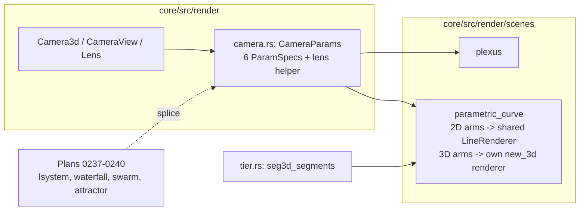

# 0236 — Space curves, and the camera becomes a shared block

> **Status:** done - Phase 6 owed, ADR-0249 (closed 2026-10-02 by a conductor close). Phases 1-5
> landed in `5ad3413c`, `389984de`, `6869feed`, `0e43b736` and `d5f48400`. The round 1 review found
> no blockers, no majors and two minors; the `docs/` one was repaired at the close and the
> `.claude/` one is the owner's. The full suite was green on the merged tree. Version 0.161.0.
> **Created:** 2026-10-01
> **Owner skill(s):** dev, human
> **Related ADRs:** [ADR-0258](../../adrs/0258-a-system-takes-depth-through-one-shared-camera-block-and-its-3d-mode-forgoes-what-seg3d-does-not-draw.md) (accepted), [ADR-0257](../../adrs/0257-a-shared-camera-projects-3d-primitives-and-depth-of-field-is-a-per-endpoint-circle-of-confusion.md), [ADR-0180](../../adrs/0180-a-mathematical-world-joins-a-system-as-a-family-and-a-structural-parameter-is-held.md), [ADR-0059](../../adrs/0059-line-scenes-colour-along-their-generator-axis.md), [ADR-0045](../../adrs/0045-quality-tiers-floor-and-rich.md)

## TL;DR

`parametric_curve` gains two **space-curve families**, `torus_knot` and `lissajous_3d`. They are
drawn through the shared camera and `seg3d`, so a knot turns in perspective and blurs away from its
focal plane along one continuous line. First, the camera's six params and its lens logic move out of
`plexus` into **one shared block** (ADR-0258), which this plan and Plans 0237 to 0240 all splice.
The plan also measures the one tier cap, `seg3d_segments`, that every non-plexus 3D line system
sizes its buffer from. The 14 curve presets and the curve golden do not move.

## Context & problem

The owner asked which systems could reuse the plexus capability, and chose four plus the attractor
(ADR-0258's Context). `parametric_curve` is the cheapest: it already draws through `LineRenderer`,
and its families are "a variant and an arm" (`curves.rs` `arm()`).

Three things stand in the way.

- **The camera surface is private to plexus.** `yaw`, `pitch`, `distance`, `fov`, `focus` and
  `aperture` are declared inline in `scenes/plexus/mod.rs`, with plexus-worded doc strings. The
  lens, cull-margin and blur-announce logic in its `render` is inline too.
- **The family machinery is 2D.** A `FamilyArm` samples into `Vec<[f32; 2]>`, and the `per_family!`
  macro behind `FAMILY_PARAMS` is hard-wired to the five family names.
- **The shared 2D `LineRenderer` has no `seg3d` pipeline.** Only `LineRenderer::new_3d` builds one,
  so the scene needs a renderer of its own, sized by a cap that has never been measured outside the
  plexus.

## Decision

We extract a `CameraParams` block and a lens helper beside `Camera3d`, in the shape of `PanParams`,
and move plexus onto it byte for byte. `parametric_curve` gains a 3D arm type and two 3D families.
They render as dense polylines through a scene-owned `new_3d` renderer, with the biarc fit, the
mirror, `stroke_blend` and `rotation` declared inert on them (ADR-0258). We rejected lifting every
2D family into `z` and widening `seg3d` with joins first (ADR-0258, Alternatives B and A).

## Architecture diagram



## Implementation phases

### Phase 1 — The camera becomes a shared block
- **Owner skill:** dev
- **What:** `CameraParams` (the six `ParamSpec`s with group `Motion` for the orbit four and `Light`
  for `focus` and `aperture`, per ADR-0256, plus the field set, `set_param` and `reset`). Its doc
  strings say "the scene's volume" rather than "network". Add a helper that takes the params, the
  render target, the scene's bounding radius and the tier, and returns the `CameraUniform`, the cull
  margin and whether the blur cap bit. Plexus splices both and deletes its inline copies.
- **Files touched:** `core/src/render/camera.rs`, `core/src/render/camera/tests.rs`,
  `core/src/render/scenes/plexus/mod.rs`, `presets/README.md`, `presets/schema/`,
  `docs/specs/player-schema.json`.
- **Done when:** the plexus goldens are byte-identical. `git grep -c "\"aperture\"" -- core/src/render/scenes/plexus`
  finds no declaration there. The regenerated param reference and schemas differ only in the camera
  params' doc strings.

### Phase 2 — Walking skeleton: a torus knot in perspective
- **Owner skill:** dev
- **What:** a 3D arm type (`sample3d: fn(&CurveParams, &mut Vec<[f32; 3]>) -> bool`) beside the 2D
  `FamilyArm`, and `CurveFamily::TorusKnot`, with integer winding `p` and `q` read from `n` and `d`
  and a tube ratio `tube`. The scene owns a `LineRenderer::new_3d` sized by a provisional
  `seg3d_segments` tier field, created at construction so a frame allocates nothing. A 3D family
  draws a closed polyline of `samples` points. Colour runs along the path as on the 2D families
  (ADR-0059), and `draw_progress` reveals a prefix. The camera block is spliced and declared live on
  3D families only. `mirror_order`, `mirror_reflect`, `stroke_blend` and `rotation` are declared
  inert on them. Near-plane clipping and culling go through the helper from Phase 1.
- **Files touched:** `core/src/render/scenes/lines/mod.rs`, `core/src/render/scenes/lines/curves.rs`,
  `core/src/render/scenes/lines/parametric.rs`, `core/src/render/scenes/mod.rs`,
  `core/src/render/tier.rs`, `core/src/preset/schema/load.rs`, `core/tests/fixtures/`, `core/tests/`.
- **Done when:** a `torus_knot` fixture renders a visible knot through `shot`, and two frames with
  different `yaw` differ. The `parametric_curve` golden and every 2D curve test are unchanged. A
  `(2, 3)` knot's sampled points all lie at distance `1 ± tube` from the torus's core circle, within
  float tolerance. With `aperture > 0`, the projected stroke is wider at the knot's far side than at
  its focal side, measured on one rendered frame.

### Phase 3 — `lissajous_3d`, and the family table
- **Owner skill:** dev
- **What:** `CurveFamily::Lissajous3d`: `x = sin(n t + phase)`, `y = sin(d t)`, `z = sin(m t + phase_z)`,
  with `m` and `phase_z` as new family-scoped levers. Widen `per_family!` to the seven families, so
  `FAMILY_PARAMS` names where each lever reads. The loader rejects a 3D family name it does not know
  with the full list, as it does now.
- **Files touched:** `core/src/render/scenes/lines/mod.rs`, `core/src/render/scenes/lines/curves.rs`,
  `core/src/render/scenes/lines/parametric.rs`, `core/src/preset/schema/load.rs`, `core/tests/`.
- **Done when:** the family table test at `parametric.rs` holds against `CurveFamily::ALL` with
  seven entries. A `lissajous_3d` with `m = 0` and `phase_z = 0` has every point at `z = 0`. Each 3D
  family appears in the generated reference with the levers it reads.

### Phase 4 — The `seg3d_segments` cap, measured, and the goldens
- **Owner skill:** dev
- **What:** set `seg3d_segments` per tier by measurement on `Floor` at the worst-case `aperture` and
  `max_coc_px`, as Plan 0235 Phase 6 did for the plexus. Record the measurement in the log against NFR
  section 1. `samples` over the cap is clamped and announced through the existing overflow context.
  Add one golden per 3D family with a fixed camera and a non-zero `aperture`.
- **Files touched:** `core/src/render/tier.rs`, `core/src/render/scenes/lines/parametric.rs`,
  `core/tests/golden.rs`, `core/tests/golden/`, `core/tests/fixtures/`.
- **Done when:** both new goldens hold on the software adapter. An over-cap `samples` on a 3D family
  is clamped with a notice. The measured frame cost at `Floor`'s cap is in the log, and it is inside
  NFR section 1's budget, or the cap is lowered until it is.

### Phase 5 — Documentation and the references
- **Owner skill:** dev
- **What:**
  - `presets/README.md`'s generated block and `presets/schema/` are regenerated.
  - `docs/presets.md` names the two families and says what is inert on them.
  - `docs/preset-guide.md` gets one picture of a knot.
  - The preset-author reference's `## parametric_curve` section gains working ranges for the 3D
    families and the rule that `aperture` costs fill.
- **Files touched:** `presets/README.md`, `presets/schema/`, `.taplo.toml`, `docs/presets.md`,
  `docs/preset-guide.md`, `docs/images/`, `.claude/skills/preset-author/references/systems.md`.
- **Done when:** the schema and param-reference tests pass on the regenerated files.
  `node scripts/toc.mjs --check`, `node scripts/check-doc-links.mjs`,
  `node scripts/check-reader-prose.mjs` and `node scripts/check-system-counts.mjs` pass.

### Phase 6 — The look, judged
- **Owner skill:** human
- **Blocks merge:** no
- **What:** the owner runs a knot and a 3D Lissajous fixture live with the music track. They check that
  depth reads, that the facets at the polyline's joints are not visible at working widths, and that
  the frame rate holds with `aperture` up. Then they hand a brief to `preset-author`.
- **Files touched:** none.
- **Done when:** the owner records a keep, or a list of what is off, in this plan's log.

## Data shapes

```rust
// illustrative, not the final interface
pub(crate) struct CameraParams {
    pub yaw: f32, pub pitch: f32, pub distance: f32, pub fov: f32,
    pub focus: f32, pub aperture: f32,
}
impl CameraParams {
    pub(crate) const SPECS: [ParamSpec; 6] = [/* the six, worded for any volume */];
}

pub(crate) struct FamilyArm3d {
    pub sample: fn(&CurveParams, &mut Vec<[f32; 3]>) -> bool,
}
```

## Risks & open questions

- **Facets at joints.** `seg3d` has no join extension (ADR-0258, Negative). On a knot sampled at a few
  hundred points the turn per segment is small, and the notch is sub-pixel at working widths. If
  Phase 6 sees it, `samples` is the lever before any engine change is.
- **The cap is shared with Plans 0237 and 0238.** If one of them measures a much higher fill cost per
  segment, that plan lowers the cap and this system draws fewer segments. The cap is a content limit
  (ADR-0045), so that is a notice, not a bug.
- **`rotation` inert on 3D families** surprises an author who sets it. The reference says so. Mapping
  it onto `yaw` was considered and rejected, because a 2D in-plane rotation and a yaw are different
  motions.
- **A `torus_knot` with `gcd(p, q) > 1`** is a link of several loops, not a knot. The loop walk's
  closure check finds the period, and the rendered result is a torus link. That is a legitimate
  shape, and the reference says so.

## What this plan does NOT do

- Move any 2D family onto `seg3d`, or add `z` to an existing family.
- Give `seg3d` joins, arcs or a mirror.
- Ship presets. The 3D curve presets belong to `preset-author` after Phase 6.
- Touch the studio. The new params reach its panel through the generated schema.

## Implementation log

**Lane:** `plan-0236-space-curves-and-the-camera-becomes-a-shared-block`, worktree `/home/igor/Work/rlx-plan-0236`

| phase | owner | state | commit |
|---|---|---|---|
| 1 — The camera becomes a shared block | dev | done | 5ad3413c |
| 2 — Walking skeleton: a torus knot in perspective | dev | done | 389984de |
| 3 — `lissajous_3d`, and the family table | dev | done | 6869feed |
| 4 — The `seg3d_segments` cap, measured, and the goldens | dev | done | 0e43b736 |
| 5 — Documentation and the references | dev | done | committed with this row |
| 6 — The look, judged | human | owed | |

### Notes

- Phase 1 touched two files outside its list. `core/tests/suite/preset.rs`: `declared_params_match_set_param`
  gains a `CAMERA_BLOCK` filter and delegation check, as for `PAN_BLOCK`, because plexus no longer
  matches the six names itself. `presets/preset.schema.json` is regenerated beside `presets/schema/`
  by the same switch, and differs in the same five doc strings.
- Phase 1's goldens were read on llvmpipe, where the plexus baselines were blessed: `plexus` and
  `plexus_sheet` both read mean 0.0000, outlier 0. WARP was not run.
- Phase 2 declares `spin` inert on the space family, since the curve has no `rotation` param and
  `spin` is what drives its in-plane rotation.
- Phase 2: `every_family_row_declaration_belongs_to_one_roster` refuses a family row on a
  `ParamSpec` that another system also declares. So `parametric_curve` re-declares the six camera
  specs, `stroke_blend`, `mirror_order` and `mirror_reflect` with a doc line of its own and the
  shared block's default, range and kind (`..camera::YAW`). The camera's wording on this system
  therefore differs from plexus's.
- Phase 2 widens `per_family!` to six families already, because the family table test requires
  every row to list every family in `CurveFamily::ALL`. It also regenerates `presets/README.md`,
  `presets/schema/`, `presets/preset.schema.json` and `docs/specs/player-schema.json`, because the
  generated-file tests fail otherwise. It does not touch `core/src/preset/schema/load.rs`.
- Phase 2: `curves::arm` gives `torus_knot` an empty flat walk, and the scene branches on `arm3d`
  before reaching it.
- Phase 2's `shot` check was run by hand: `cargo run -p standalone --example shot --
  --preset-file core/tests/fixtures/parametric_torus_knot.toml --frames 30 --size 640x360` drew a
  trefoil. `space_curve::an_open_aperture_strokes_the_far_side_wider_than_the_focal_side` read
  2 px near and 1 px far through a pinhole, and 7 px near and 20 px far at an aperture of 12, on
  llvmpipe. The golden readings, `parametric_curve` included, were identical to Phase 1's on
  llvmpipe.
- Phase 3: before it, the unknown-family error did not list the roster, so "as it does now" did
  not hold. The list was added in `core/src/preset/schema/raw/generator.rs`, where the error is
  raised, not in `load.rs`. Phase 3 also rewords the `n`, `d` and `phase` doc lines to name the
  space families, and regenerates the same generated files as Phase 2.
- Phase 4 measured frame cost with `shot --report family=parametric_curve --tier floor`, release
  profile, 1920x1080, on AMD Radeon Graphics (RADV RENOIR) iGPU with Mesa 26.2.2. The presets were
  scratch files under `target/seg3d-measure/`: `samples 8000` (the cap), `thickness 12`,
  `distance 1.5`, `fov 1.2`, `focus 0`, `aperture 40` (past the 12 px cap), and `n 12, d 11`.
  Results: torus knot (`tube 0.9`) 1.053 ms with 57 % cover, `lissajous_3d` (`m 10`) 1.119 ms
  with 70 % cover, and the same knot at `aperture 0` 0.936 ms. The budget in NFR section 1 is
  16.67 ms. `Floor`'s provisional 8000 stands. `Rich`'s 20000 was not measured.
- Phase 4 announces the over-cap clamp through a new `OverflowContext::Samples`, with its onset
  and recovery sentences and Rich's cap in `top_tier_lifts`. That is an edit to
  `core/src/render/scenes/mod.rs`, outside the phase list. No existing context names the
  `seg3d_segments` cap.
- Phase 4's two goldens, `parametric_torus_knot.png` and `parametric_lissajous_3d.png`, were
  written on llvmpipe, not on WARP. The route was an uncommitted local change to `golden.rs` that
  wrote only a missing baseline, as Plan 0235 did for the plexus. It was reverted before the
  commit, and no existing baseline was rewritten. Both read mean 0.0000, outlier 0 on llvmpipe.
  Windows CI's golden job is the first WARP reading of them. It is also the first WARP reading of
  the baselines captured after `parametric_curve` now that that scene builds a `seg3d` renderer at
  construction.
- Phase 4's `lissajous_3d` fixture, rendered through `shot` at 640x360 on RADV, shows bright dots
  at chord joints along its blurred stretch, where additive chords overlap.

- Phase 5 was done by an interactive session at the owner's request, after the conductor parked the
  plan `claude_dir` on `.claude/skills/preset-author/references/systems.md`. Its regeneration step
  changed nothing: Phases 2 and 3 had already regenerated `presets/README.md`, `presets/schema/` and
  `.taplo.toml`, and both generated-file tests pass on them as committed.
- Phase 5 touched two files outside its list. The knot picture is rendered from a new teaching preset,
  `docs/examples/curves/torus_knot.toml`, as the four flat families' pictures are, and
  `scripts/docs-shots.mjs` gains its manifest entry. The picture was rendered on RADV with that
  entry's exact `shot` command. No `lissajous_3d` picture was added; the plan asks for one knot.
- Phase 5's `systems.md` ranges come from the teaching preset and the golden fixtures, because no
  space-curve preset ships yet. The section says so.

### Close triggers

- **`presets/` touched:** generated files only: `presets/README.md`, `presets/schema/*.schema.json`
  and `presets/preset.schema.json`, regenerated in Phases 1-3. No preset added or removed.
- **Plan header `Closes:`** none
- **What shipped:** feature: two space curve families, `torus_knot` and `lissajous_3d`, and the
  camera as a shared param block.
- **Operator docs touched:** `docs/presets.md`, `docs/preset-guide.md` (one new picture),
  `presets/README.md` (generated), `.claude/skills/preset-author/references/systems.md`.
- **Backlog probes (`node scripts/check-backlog-claims.mjs`):** exit 0, 55 reductions across 27 live
  entries (3 unprobeable).
- **Full suite:** owed to the conductor's pre-review gate (ADR-0207).
- **Outstanding `human` phases:** Phase 6, the look judged.

## Close review

Round 1 is the only round. Its review is reproduced in full below, with its headings moved down one
level. No earlier round raised a finding, so there is no fix-round row. At the close, minor 2 was
repaired in `c8dbfb40`. Minor 1 is under `.claude/` and stays open for the owner, who applies the
replacement text the review gives. The nit asked for no change.

**Phase 6 is owed** (`Blocks merge: no`, ADR-0249). Until it is done, nobody has judged whether
depth reads on a live knot and a live 3D Lissajous, whether the facets at the polyline's joints show
at working widths, or whether the frame rate holds with `aperture` up on real hardware.

**Close notes.** At the close, `node scripts/check-upstream-ci.mjs` read upstream CI **red**: run
36971363264 on `main` at `bff63d5` failed `check (windows-latest)`. The close merged anyway, as
ADR-0251 directs. The Windows golden job after the push gives the first WARP reading of the two new
goldens, and of every baseline captured after `parametric_curve`. `presets/` was touched by
generated files only, so the set has nothing to curate. ADR-0258 is accepted.

### Plan 0236 — close review, round 1

Graded at `8044d72db67bfa4e1fadf5aa6d470af1fefa965d` on lane
`plan-0236-space-curves-and-the-camera-becomes-a-shared-block` (`/home/igor/Work/rlx-plan-0236`),
`main` already merged in (`b47a5a1b`).

**Verdict:** Plan 0236 landed cleanly. There are no blockers and no majors, and two minors: one
stale fact under `.claude/` and one missing on-device checklist row. Phase 6 (`human`,
`Blocks merge: no`) is owed after the merge, per ADR-0249.

#### Evidence

- **Full suite:** `node .../with-lock.mjs suite -- cargo nextest run --workspace` printed
  `with-lock: skipped cargo nextest run --workspace: tree 2131f3f is green in the suite ledger, run
  by gate 0236-pre-review-after-repair-1 at 2026-10-02T07:38:09.951Z: 1944 tests run: 1944 passed
  (5 slow), 8 skipped`. `git rev-parse HEAD^{tree}` is `2131f3ff…`, so that ledger record is for
  the exact tree under review. That record is lens 1's full-suite evidence. The log's
  `Full suite:` bullet defers to the conductor's pre-review gate, which is correct in conductor mode.
- **`RUSTDOCFLAGS="-D warnings" cargo doc --workspace --no-deps`:** green.
- **Gates run by hand:** `node scripts/toc.mjs --check`, `check-doc-links.mjs`,
  `check-reader-prose.mjs`, `check-system-counts.mjs`, `check-comment-hygiene.mjs` all exit 0.
  `check-backlog-claims.mjs` exits 0 (55 reductions, 27 live entries, 3 unprobeable). Its advisory
  names 0278 (plexus layouts), whose path moved. 0278 is about point layouts, which this plan did
  not touch, so it is not falsified.

#### Lens 1 — alignment with the plan

- Every phase carries one in-vocabulary owner tag. Phases 1–5 are `dev`. Phase 6 is `human` with
  `Blocks merge: no`, and no later phase reads its output.
- **Phase 1.** `CameraParams` (`core/src/render/camera.rs`) declares the six specs with groups
  Motion×4 and Light×2, worded "the scene's volume". It provides `set` and `reset`, plus a
  `frame()` helper that returns the view, the uniform, the margin, the extents and the blur clamp.
  Plexus splices both. Its render logic is the inline code moved verbatim: the blur clamp
  is still taken only when `self.clamp` is `None`, and the margin and lens are unchanged. `pitch`'s
  range moved from literal `±1.55` to `±MAX_PITCH`, and `MAX_PITCH` is `1.55`. The done-when
  `git grep -c "\"aperture\"" -- core/src/render/scenes/plexus` returns only
  `plexus/tests.rs:2`, which are test usages. `mod.rs` has no declaration. In the Phase 1 commit
  the generated files differ only in the five reworded doc strings (`presets/README.md` +5/−5).
  `camera/tests.rs` asserts that the block answers exactly six names and that `frame()` equals the
  pieces composed, margin and blur-clamp branches included.
- **Phase 2.** `FamilyArm3d` and `arm3d()` exist, and so does `TorusKnot`, with `p` and `q`
  rounded from `n` and `d` and `tube` clamped. The scene builds its `new_3d` renderer and its
  `points3d` and `instances3d` buffers once, at construction, sized `seg3d_cap + 1` and
  `seg3d_cap`. `periodic_walk_3d` pushes at most `samples + 1 ≤ cap + 1` points, so no frame
  reallocates. Colour runs along the walk with the full walk as divisor, so the gradient draws on
  as `draw_progress` reveals it (ADR-0059). Tests checked:
  - `a_two_three_knot_lies_on_its_torus` asserts `|from_core − tube| < 1e-5` on every sample, the
    ring radius inside `1 ± tube`, and a winding of 2 about the axis. That is the done-when, stated
    more strictly.
  - `a_torus_knot_reaches_the_frame_and_turns_with_yaw` covers the `shot`-visible knot and the yaw
    difference. It compares two captures in the same run, so 0.002 is a "not identical" check and
    is not measured against cross-machine drift.
  - `an_open_aperture_strokes_the_far_side_wider_than_the_focal_side` uses a pinhole control
    (`far ≤ near`) and asserts `far ≥ 2·near` at aperture 12. Both sides are the same kind of
    quantity on one frame, so it is a property.

  The `parametric_curve` golden is unchanged. The plan names `rotation` as inert, but the system
  has no `rotation` param. The log notes this, and `spin`, which drives the in-plane rotation, is
  declared inert instead. That is a correct reading of the plan.
- **Phase 3.** `Lissajous3d` follows the plan's formula, and `m` and `phase_z` are new levers.
  `per_family!` has seven columns, and the table test pins `CurveFamily::ALL` to seven names.
  `a_flat_depth_axis_lays_the_3d_lissajous_on_the_flat_one` asserts `z == 0` exactly and that x
  and y match the flat figure point for point. The plan said the unknown-family error listed the
  roster "as it does now". It did not, and the list was added at the actual raise site
  (`raw/generator.rs`); the test asserts that every family name appears. The generated reference
  carries both space families with the levers they read (`presets/README.md:521–563`).
- **Phase 4.** `seg3d_segments` is Floor 8000, measured, and Rich 20000, not measured; both are
  recorded in the `tier.rs` doc and the log. The measurement is 1.05–1.12 ms at 1080p on RADV
  Renoir, inside NFR §1. `OverflowContext::Samples` adds onset, recovery and `top_tier_lifts`, and
  joins the two existing context tests. `an_over_cap_space_walk_is_clamped_with_a_notice` checks
  the context, the cap, `dropped` and the tier remedy for both families, and checks that the cap
  itself is silent. The two goldens are appended after the roster loop, and their fixtures bind
  every camera param and `spin`.
- **Phase 5.** `docs/presets.md`, `docs/preset-guide.md` (one knot picture plus its teaching
  preset) and `systems.md` are swept, and the four named gates pass.
- **Unlisted files.** The log notes each one (`core/tests/suite/preset.rs`,
  `core/src/render/scenes/mod.rs`, `raw/generator.rs`, `docs/examples/curves/torus_knot.toml`,
  `scripts/docs-shots.mjs`). Each is needed by its phase.

#### Lens 2 — layering, real-time safety, contracts

- No platform or audio type enters `core/`, and no raw GPU call is added.
- The space path in `render_space` / `update_space` uses `.get()` and `let … else`, with no
  `unwrap` and no per-frame allocation (`mem::take` and restore on `instances3d`).
  `space_samples` maps a negative or NaN `samples` to 0. `camera.rs` carries the hot-path pragma.
- The C ABI and the control protocol are unchanged. The `Scene` trait is not widened: the scene
  uses the existing `set_target_size`.

#### Lens 3 — docs and bookkeeping

Two stale facts were found; they are minors 1 and 2 below. The generated files are committed and
held by their tests (the suite is green). The rest is for the close:

- ADR-0258 is `proposed`: accept it.
- Version bump owed: **minor**. This is a feature plan.
- `presets/` touched: generated files only, so the set has nothing to curate.
- Phase 6 is owed: `Status: done - Phase 6 owed, ADR-0249`.
- **Carry into the close notes.** The log records that both new goldens, and every baseline
  captured after `parametric_curve`, have their first WARP reading on Windows CI.
  `parametric_curve` now builds a `seg3d` renderer at construction, and `golden.rs` documents that
  building GPU resources mid-run can move a later capture on WARP. This cannot be checked from
  Linux. Read the Windows golden job after the push.

#### Lens 4 — correctness and determinism

- The aspect comes from the render target, which `render` is handed (ADR-0037). The pixel-scale
  target comes from `set_target_size`, the same mechanism plexus uses.
- `focus` is normalized across the whole figure's bounding radius, not the revealed prefix. A test
  holds this, so a reveal does not move the focal plane.
- There is no randomness and no clock read in the new samplers.
- The numeric assertions are tolerances derived from the mechanism (1e-5 float geometry),
  ratios of like quantities, or exact equalities.

#### Lens 5 — design integrity

The camera block follows `PanParams`' shape, and plexus and `parametric_curve` both delegate to it,
so the open/closed property holds for Plans 0237–0240. `parametric_curve` re-declares the camera
specs with its own doc lines through `..camera::YAW`, so default, range and kind cannot diverge.
The log explains why, and this is sound under the family-row roster test.

#### Findings

##### minor

1. **`.claude/skills/preset-author/references/api-feedback.md:61` still says five curve families.**
   This plan made that fact false, and the preset-author lane reads this file as its vocabulary.
   The CLI refuses a headless edit under `.claude/`, so the owner applies it. Replace lines 61–62:

   ```
   - **Five curve families** since Plan 0162 — `maurer_rose`, `lissajous`, `hypotrochoid`,
     `superformula`, `harmonograph` — with `pen`, `sym`, `sharpness`, `lobe` and `decay` beside them.
   ```

   with:

   ```
   - **Seven curve families**: five flat since Plan 0162 — `maurer_rose`, `lissajous`, `hypotrochoid`,
     `superformula`, `harmonograph` — with `pen`, `sym`, `sharpness`, `lobe` and `decay` beside them,
     and two space families since Plan 0236 — `torus_knot` (`tube`) and `lissajous_3d` (`m`,
     `phase_z`) — drawn through the shared camera (ADR-0258).
   ```

2. **`docs/on-device-validation.md` has no row for the new `seg3d_segments` Floor cap.** The cap
   was measured only on the development box's iGPU, headless, and `Rich`'s 20000 is not measured
   at all. The plexus caps in the same position have a checklist row (lines 247–258); the space
   curves have none, so nothing asks for the low-end-box reading. The repair is Markdown prose
   that a close may make. After the plexus look row (line 264), add:
   `- [ ] **The space curve families at the Floor cap, on the low-end box, 1080p.** Plan 0236 added
   torus_knot and lissajous_3d to parametric_curve, sized by seg3d_segments (Floor 8000, measured
   at about 1.1 ms on the development box's integrated GPU, headless; Rich 20000 unmeasured). Load
   docs/examples/curves/torus_knot.toml with samples = "8000", thickness = "12" and aperture =
   "24"; overlay on (F3); report whether fps holds >= 60 and the p99, and what the standalone
   prints about the clamps.` Format it with links and backticks to match its neighbours.

##### nit

- The implementation log (lines 182–270) is slightly longer than `## Implementation phases`
  (lines 61–141). That is the lens 1 property, but the overrun is marginal and every note is
  load-bearing, so the close should not trim it.

## Followups (after this lands)

- `preset-author`: a launch pair, one per 3D family.
- Plans 0237, 0238, 0239 and 0240 splice `CameraParams`, and 0237 and 0238 size from `seg3d_segments`.
