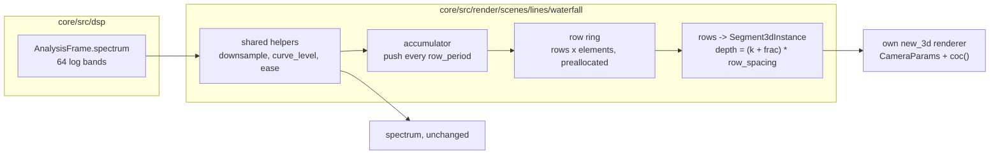

# 0238 — The waterfall system

> **Status:** done (closed 2026-10-02; Phase 4 judged by the owner 2026-10-03: rows show through each other, backlog 0279). Phases 1-3 landed in `76976a1e`,
> `89aa720d` and `6e9b371f`; the round 1 close review found no blockers, no majors and two minors,
> one repaired at the close. Released as 0.163.0.
> **Created:** 2026-10-01
> **Owner skill(s):** dev, human
> **Related ADRs:** [ADR-0258](../../adrs/0258-a-system-takes-depth-through-one-shared-camera-block-and-its-3d-mode-forgoes-what-seg3d-does-not-draw.md) (accepted), [ADR-0180](../../adrs/0180-a-mathematical-world-joins-a-system-as-a-family-and-a-structural-parameter-is-held.md), [ADR-0040](../../adrs/0040-spectrum-level-curve-applies-before-the-easing.md), [ADR-0019](../../adrs/0019-eased-parameters.md)

## TL;DR

A new system, **`waterfall`**, draws the recent spectrum as a **landscape**. Each row is one moment's
spectrum as a polyline across the frequency axis. Rows recede from the camera as they age, so the
music's last few seconds lie on the ground in perspective, the near edge sharp and the far rows
going soft. Rows are pushed on a fixed period rather than once per frame, so the landscape scrolls at
the same speed at any display rate.

## Context & problem

The `spectrum` system (`lines/spectrum.rs`) draws one moment: the 64 log-spaced bands of
`AnalysisFrame::spectrum`, downsampled to `elements`, shaped by `curve` and eased by `[spectrum]
smoothing` (ADR-0040's order). It draws as bars, a polyline or a radial ring, through the shared 2D
`LineRenderer`, and it holds no history beyond the eased envelope.

A landscape of the last few seconds needs three things the spectrum system has none of. Under
ADR-0180 rule 1, each of them makes it a new `SystemKind` rather than a fourth layout:

- **Its own state:** a ring of past rows.
- **Its own pass shape:** `seg3d` through a scene-owned renderer.
- **A param surface that would be inert on the host:** the camera block and the row params, on
  `bars`, `polyline` and `radial_ring`.

The update runs once per displayed frame on the measured `dt` (`evaluate.rs`). One row per frame
would make the row spacing depend on the display rate, which ADR-0019 forbids.

## Decision

`SystemKind::Waterfall`, with a structural `[waterfall]` table: `elements` (up to 64), `rows`
(capped so `rows * (elements - 1)` fits `seg3d_segments`) and `row_period` in seconds.

- **Shared helpers.** `downsample`, `curve_level` and the easing step become `pub(crate)` helpers
  that `spectrum` and `waterfall` both call, so `spectrum`'s bytes do not move.
- **Row cadence.** A time accumulator pushes one eased row per `row_period` into a preallocated
  ring. The fraction of a period since the last push offsets every row's depth, so the scroll is
  continuous and a push moves nothing.
- **Row geometry.** Row `k` lies at depth `k * row_spacing`, with height `height * level`, and is
  drawn as `elements - 1` segments.
- **Colour.** The palette runs along frequency, as on `spectrum` (ADR-0059). Age dims a row by a
  bindable `fade`.
- **Camera.** The camera block is spliced (ADR-0258), and its default pitch looks down the
  landscape.

We rejected a `layout = "waterfall"` on `spectrum` (ADR-0180 rule 1) and one row per frame
(ADR-0019).

## Architecture diagram



## Implementation phases

### Phase 1 — Walking skeleton: a scrolling landscape
- **Owner skill:** dev
- **What:** move `downsample`, `curve_level` and the easing step to `pub(crate)` helpers that
  `spectrum` calls unchanged. Add `SystemKind::Waterfall`, its `TABLE` row, `[waterfall]` (`elements`,
  `rows`, `row_period`) and the scene:
  - a ring preallocated at `configure` and cleared on `configure` and `resize`
  - the accumulator push
  - row geometry at continuous depth through a `new_3d` renderer sized by `seg3d_segments`
  - `CameraParams` spliced, with params `height`, `row_spacing`, `fade`, `line_width`, `brightness`,
    `glow`, `hue`, `hue_spread` and the palette set, each with its `group` and `main` (ADR-0256)

  Add the hot-path pragma and the hygiene scan entry.
- **Files touched:** `core/src/render/scenes/lines/spectrum.rs`, `core/src/render/scenes/lines/waterfall.rs`
  (new), `core/src/render/scenes/lines/mod.rs`, `core/src/render/scenes/mod.rs`,
  `core/src/preset/schema/system.rs`, `core/src/preset/schema/raw/waterfall.rs` (new),
  `core/src/preset/schema/raw/mod.rs`, `core/src/preset/schema/load.rs`, `core/tests/suite/hygiene.rs`,
  `core/tests/fixtures/`, `core/tests/`.
- **Done when:** a fixture renders a visible landscape through `shot` under a varying synthetic
  spectrum. The `spectrum` golden and its fixtures are byte-identical. Stepping the same input
  sequence at `dt = 1/60` for 120 frames and at `dt = 1/144` for 288 frames leaves the same rows in
  the ring, with the same depth offset to within one part in a thousand of `row_spacing`.

### Phase 2 — Caps, the golden and determinism
- **Owner skill:** dev
- **What:** `rows` over `seg3d_segments / (elements - 1)` is clamped and announced (ADR-0045). A golden
  with a fixed camera, a non-zero `aperture` and a ring filled from `fixed_frame_spectrum()` plus a
  deterministic ramp, so the rows differ. Run the `animation` and `reactivity` gates on the fixture,
  and find out which branch the system passes on. A system that is still under constant input is the
  case `spectrum` is already in, so the waterfall follows `spectrum`'s precedent rather than inventing
  autonomous motion.
  - **The cost probe.** The waterfall's segments are not the short segments `seg3d_segments` was
    measured on (Plan 0236 Phase 4), and two shapes of its frame are its own:
    - **long near rows:** at a low `pitch` the nearest rows span the whole frame width, so one blurred
      row fills a band across the screen;
    - **horizon pile-up:** at `pitch` near 0, the far rows converge into a few pixels above the
      horizon, and additive overdraw stacks there.

    Two fixtures pin those shapes, each at `Floor`'s cap (`rows` at the clamp, `elements = 64`),
    `aperture` past the cap, and 1920x1080 in the release profile:
    - `pitch = 0.15` with `focus` at the far edge, so the near rows are the blurred ones;
    - `pitch = 0.02` with `focus` at the near edge, so the pile-up is blurred.

    Each runs at `aperture = 0` and at the worst case in the same run, on the same adapter (ADR-0074).
    The budget is the one Plan 0239 holds the swarm to: the blurred frame at most twice the sharp one,
    and inside NFR section 1.
  - **The fallback ladder,** stopping at the first rung that meets the budget, with each rung's
    measurement in the log:
    1. Skip a row whose `fade` has brought its light below one 8-bit step. A dark additive row still
       costs fill, so it is culled before upload rather than drawn at zero.
    2. A waterfall-only ceiling on `rows`, `waterfall_rows` in `TierConfig`, below what
       `seg3d_segments` allows. This keeps the waterfall's cost from lowering the shared cap that the
       curve and turtle systems size from.
    3. Lower `seg3d_segments` itself, announced, and say in the log which other systems that affects.
- **Files touched:** `core/src/render/scenes/lines/waterfall.rs`, `core/src/render/tier.rs`,
  `core/tests/golden.rs`, `core/tests/golden/`, `core/tests/fixtures/`, `core/tests/`.
- **Done when:**
  - The golden holds on the software adapter. An over-cap `rows` is clamped with a notice.
  - The same seed and analysis frames give the same ring after 600 frames.
  - The `animation`, `reactivity`, `sanity` and `distinctness` suites pass with the system in their
    rosters.
  - The log carries both probes' sharp and blurred frame times on `Floor`, the rung the ladder
    stopped at, and the ratio. Each ratio is at most 2, and each blurred time is inside NFR section 1.

### Phase 3 — Documentation and the references
- **Owner skill:** dev
- **What:**
  - `docs/presets.md` gains the `[waterfall]` table and a system-table row.
  - The generated params block, `presets/schema/` and `.taplo.toml` are regenerated.
  - `docs/preset-guide.md` gets one picture.
  - `docs/on-device-validation.md` gains the system.
  - The preset-author reference gains a `## waterfall` section (ADR-0234), with working ranges for
    `row_period`, `rows` and `aperture`.
- **Files touched:** `docs/presets.md`, `presets/README.md`, `presets/schema/`, `.taplo.toml`,
  `docs/preset-guide.md`, `docs/images/`, `docs/on-device-validation.md`,
  `.claude/skills/preset-author/references/systems.md`.
- **Done when:** the schema and param-reference tests pass on the regenerated files.
  `node scripts/toc.mjs --check`, `node scripts/check-doc-links.mjs`,
  `node scripts/check-reader-prose.mjs` and `node scripts/check-system-counts.mjs` pass.

### Phase 4 — The look, judged
- **Owner skill:** human
- **Blocks merge:** no
- **What:** the owner runs the fixture live with the music track at 60 Hz and at the display's native
  rate. They judge whether the scroll reads as time passing, whether the far rows' softness reads as
  distance, and whether the frame rate holds. Then they hand a brief to `preset-author`.
- **Files touched:** none.
- **Done when:** the owner records a keep, or a list of what is off, in this plan's log.

## Data shapes

```rust
// illustrative, not the final interface
pub struct WaterfallConfig {      // [waterfall], structural
    pub elements: u32,            // 2..=64, bands across a row
    pub rows: u32,                // capped by seg3d_segments / (elements - 1)
    pub row_period: f32,          // seconds between pushes
}
struct Ring {
    levels: Vec<f32>,             // rows * elements, preallocated at configure
    head: usize,
    since_push: f32,              // seconds; frac = since_push / row_period
}
```

## Risks & open questions

- **The name.** `waterfall` is the audio-engineering term for this display. `terrain` and `landscape`
  are the alternatives. Renaming before Phase 1 lands costs nothing, and after it costs a schema
  regeneration.
- **A long `row_period` reads as a stutter.** The continuous offset hides the push. If the eased level
  of the newest row jumps at a push, the near edge pops. The newest row could draw the live eased level
  rather than the pushed one. Phase 1 decides on sight and says which in a comment.
- **Fill cost.** A near row at a low pitch is long on screen, a blurred far field is wide, and the far
  rows pile up above the horizon. The shared cap was measured on curves (Plan 0236), whose segments are
  short. Phase 2 probes both shapes. Its ladder culls dark rows and caps `waterfall_rows` before it
  touches `seg3d_segments`, so the waterfall's cost lands on the waterfall and not on the curve and
  turtle systems.
- **The animation gate.** Constant input fills the ring with identical rows, and the scroll then moves
  nothing visible. Phase 2 checks how `spectrum` passes that gate today and follows it.

## What this plan does NOT do

- Add a waterfall layout to `spectrum`, or change `spectrum` at all beyond extracting helpers.
- Fill the area under a row (a solid terrain). That is a different primitive.
- Ship presets. That belongs to `preset-author` after Phase 4.

## Implementation log

**Lane:** `plan-0238-the-waterfall-system`, worktree `/home/igor/Work/rlx-plan-0238`

| phase | owner | state | commit |
|---|---|---|---|
| 1 — Walking skeleton: a scrolling landscape | dev | done | 76976a1e |
| 2 — Caps, the golden and determinism | dev | done | 89aa720d |
| 3 — Documentation and the references | dev | done | committed with this row |
| 4 — The look, judged | human | done | reads, but rows show through each other, see Notes |

### Notes

- **Files outside the phase lists**, each needed by the build or a gate: Phase 1 touched
  `core/src/preset/schema/raw/preset.rs`, `schema/export.rs`, `schema/tests.rs` and
  `core/src/render/mod.rs`, regenerated `presets/README.md`, `presets/schema/`,
  `presets/preset.schema.json`, `.taplo.toml` and `docs/specs/player-schema.json`, and added the
  teaching preset `docs/examples/waterfall/landscape.toml`, its `scripts/docs-shots.mjs` entry and
  `docs/images/gallery/waterfall.png` (RADV) for `hygiene::every_system_has_a_gallery_image`.
  Phase 2 added `OverflowContext::Rows` in `core/src/render/scenes/mod.rs`.
- Phase 1: the shared step is `shape_and_ease` in `spectrum.rs`; `downsample` and `curve_level`
  were already `pub(crate)`, and `CURVE_MIN`/`CURVE_MAX` became so. Unlisted surface: `curve`,
  `zoom`, `pan_x`, `pan_y` and a `[waterfall] smoothing` key, which the shared helpers and the
  camera block's frame take; the palette set is the plexus's.
- Phase 1, the long-`row_period` risk: the front row is the live eased level at depth 0; a pushed
  row fades in over its first period (`alpha = frac`) and the oldest fades out over its last, so the
  ring holds `rows - 1`. Decided from `shot` renders, not live. A render-target resize does not
  clear the ring; "cleared on `resize`" is read as the scene's buffer-sizing step.
- Phase 1's 60/144 Hz test runs at `row_period = 5/12` s, a whole number of frames at both rates,
  with input held over 1/12 s windows; any other period samples different instants. The compared
  offset is 0.8 of a row. `shot --signal dynamic:110` drew the landscape changing; the `spectrum`
  golden and fixtures are untouched (llvmpipe mean 0.0000).
- Phase 2's cost probe: `shot --report family=waterfall --tier floor --size 1920x1080`, release,
  RADV RENOIR iGPU (Mesa 26.2.2), one run, `rows 126`, `elements 64`, `aperture 0` against `40`.
  Long near rows (`pitch 0.15`): 0.690 ms sharp, 0.821 ms blurred, ratio 1.19. Horizon pile-up
  (`pitch 0.02`): 0.911 ms, 1.407 ms, ratio 1.54. Inside NFR section 1's 16.67 ms; the ladder
  stopped before rung 1.
- Phase 2's branch finding: a full ring under constant input reads silent 0.0000, driven 0.3883,
  `spectrum`'s case; the golden fixture's still-filling 23-row ring passes on the silent branch
  (0.1092). `the_waterfall_passes_on_the_driven_branch_once_its_ring_is_full` pins both. Reactivity
  on the fixture: bass 0.0236, mid 0.0154, treb 0.0081, onset 0.0254.
- Phase 2's goldens `waterfall.png` and `waterfall_ramp.png` were written on llvmpipe through a
  reverted local missing-baseline-only change, as Plans 0235 and 0236 did; Windows CI's golden job
  is their first WARP reading. The four gates ran on the waterfall's entries; the shipped-library
  sweeps hold no waterfall preset and were the pre-review gate's.
- Phase 3 ran in an interactive session after the conductor parked the plan `claude_dir` on
  `systems.md`. Regeneration changed nothing; `toc.mjs` added `presets/README.md`'s `waterfall`
  row. The guide picture is the Phase 1 gallery image. `systems.md`'s ranges come from the teaching
  preset, the fixture and the cost probes, and the section says so.

- **Phase 4, 2026-10-03, the owner's verdict: the landscape reads, but rows show through each
  other.** Judged live on the Arch box from two judging copies outside the repository, the teaching
  preset `docs/examples/waterfall/landscape.toml` and an orbiting variant, with the machine idle.
  Where a peak rises, the rows behind it stay visible through it: a near row's bass hump is drawn
  straight across the flat rows behind it, and treble spikes on the near rows tangle with the rows
  behind them. It is worst where the rows are dense but it appears wherever a peak rises, so fewer
  rows or a lower `height` makes it rarer and does not remove it. The cause is
  [backlog 0279](../../design-backlog-archive.md): the `seg3d` stroke is additive with no depth test, and
  a waterfall is the one system that is a surface, so the missing hidden-line removal shows most
  here. The orbiting variant also needed `brightness` 1.8, `glow` 2, `fade` 0.5 and `aperture` 3
  before it read as bright enough, and `pan_y` -0.2 with `pitch` 0.5 to sit the landscape on the
  bottom of the frame instead of mid-frame with its peaks clipped. No `preset-author` brief was
  handed over until the occlusion is settled.

### Close triggers

- **`presets/` touched:** generated files only: `presets/README.md`, `presets/schema/`,
  `presets/preset.schema.json` and `.taplo.toml`. No preset added or removed.
- **Plan header `Closes:`** none
- **What shipped:** feature: the `waterfall` system.
- **Operator docs touched:** `docs/presets.md`, `docs/preset-guide.md`, `docs/on-device-validation.md`,
  `presets/README.md` (generated), `.claude/skills/preset-author/references/systems.md`.
- **Backlog probes (`node scripts/check-backlog-claims.mjs`):** exit 0, 55 reductions across 27 live
  entries (3 unprobeable), on the lane before it merges `main`.
- **Full suite:** owed to the conductor's pre-review gate (ADR-0207).
- **Outstanding `human` phases:** Phase 4, the look judged.

## Close review

Closed 2026-10-02 by a conductor close, round 1, at version 0.163.0 (minor: a feature). **Phase 4
is owed** (`Blocks merge: no`, ADR-0249): nobody has yet judged live, at 60 Hz and at the display's
native rate, whether the scroll reads as time passing, whether the far rows' softness reads as
distance, or whether the frame rate holds; no `preset-author` brief exists until it is.

Close notes: upstream CI read green (run 36987647540 on `main` at `cf90687`). Backlog probes exit 0,
60 reductions across 30 live entries, 4 unprobeable. The translation advisory names no stale row.
Curation: `presets/` was touched by generated files only and no preset header cites this plan, so
the set needs nothing. ADR-0258 was already accepted by Plan 0236. No earlier round raised a finding.
Minor 2 was repaired in `de7e2f38`; minor 1 is test code and stays open.

The round 1 review, in full:

### Plan 0238 — The waterfall system: close review, round 1

Graded at tip `03d5ea6e6d166a865aadca7a4686b4df215e5e80` on `plan-0238-the-waterfall-system`
(lane `/home/igor/Work/rlx-plan-0238`, `main` already merged in at `74b05ea8`).

**Verdict: Plan 0238 landed cleanly; no blockers, no majors, two minor items.** Phases 1-3 are built
as the plan describes, and Phase 4 (`human`, `Blocks merge: no`) is correctly `owed` (ADR-0249).

#### Evidence run in this session

- **Full suite**: `node .../with-lock.mjs suite -- cargo nextest run --workspace` printed
  `with-lock: skipped cargo nextest run --workspace: tree 84dc2a6 is green in the suite ledger, run by
  gate 0238-pre-review-after-repair-1 at 2026-10-02T09:36:18.170Z: 1955 tests run: 1955 passed
  (8 slow), 8 skipped`. That ledger record is lens 1's full-suite evidence (ADR-0207). The log's
  `Full suite:` bullet defers to that gate, which is correct in conductor mode.
- `RUSTDOCFLAGS="-D warnings" cargo doc --workspace --no-deps`: green.
- `cargo fmt --all -- --check`: clean. `cargo clippy --workspace --all-targets -- -D warnings`: clean.
- Phase 3's done-when checks, each run alone: `node scripts/toc.mjs --check` OK (7 blocks, current);
  `node scripts/check-doc-links.mjs` OK; `node scripts/check-reader-prose.mjs` OK (0 bare citations);
  `node scripts/check-system-counts.mjs` OK. The schema and param-reference tests are in the green
  suite above.
- `node scripts/check-comment-hygiene.mjs` OK. `node scripts/check-backlog-claims.mjs` exit 0,
  60 reductions across 30 live entries, 4 unprobeable.

#### Lens 1 — alignment with the plan

- **Owner tags**: every phase carries one in-vocabulary `**Owner skill:**`; Phase 4's
  `**Blocks merge:** no` sits on a `human` phase whose output no later phase reads.
- **Phase 1.** `shape_and_ease` (`core/src/render/scenes/lines/spectrum.rs:375`) is
  `easing.step(held, curve_level(raw, curve), dt)`, the exact expression `spectrum`'s `update` computed
  before, so `spectrum` is unchanged in arithmetic; no file under `core/tests/golden/spectrum*` or the
  spectrum fixtures appears in `git diff main...HEAD`. `SystemKind::Waterfall`, its `TABLE` row,
  `RawWaterfall` (validation of `elements` 2..=64, `rows` 2..=1024, `row_period` 0.01..=2 s, NaN
  refused by `contains`) and the scene are present. The ring is allocated only in
  `Landscape::resize`, reached from `configure`; `step` and `render` do not allocate (the instance
  `Vec` is taken and returned). The hot-path pragma is on `waterfall.rs:40`, and
  `hygiene.rs` now asserts the scan reaches `lines/waterfall.rs`.
  The 60/144 Hz done-when is `the_same_input_at_60_and_144_hz_leaves_the_same_rows`
  (`waterfall.rs:733`): it asserts four rows pushed at both rates, each band within 1e-4, that the
  rows differ (non-vacuity), that `frac` is 0.8 (so the offset compared is not a trivial zero), and
  that the depth offsets agree within `row_spacing * 1e-3` — the done-when's own tolerance. The
  choice of `row_period = 5/12` s and windowed input is argued in the log and is sound: a period that
  is not a whole number of frames at both rates samples different instants, which no implementation
  can make equal.
- **Phase 2.** `rows_clamp` (`waterfall.rs:446`) holds rows to `cap / (elements - 1)` and returns a
  `CapOverflow` with the new `OverflowContext::Rows(asked, per_row)`; `suite/waterfall.rs` asserts the
  notice reaches the renderer with the asked count, the cap, the dropped segments, the kept rows and
  the `--tier rich` remedy, and that rows at the cap announce nothing. The new context was an
  unlisted edit to `scenes/mod.rs`, recorded in the log. `the_same_frames_give_the_same_ring_after_600_frames`
  compares two runs bit for bit (there is no RNG in the system, so "same seed" reduces to purity).
  The ramped golden (`golden.rs`, `the_waterfall_holds_a_ramped_ring`) scales
  `fixed_frame_spectrum()` by a per-frame ramp, and 60 frames at 1/60 s outlast the fixture's 23
  pushes at 0.04 s, so the ring is full and its rows differ. The animation branch finding is pinned
  by `the_waterfall_passes_on_the_driven_branch_once_its_ring_is_full`, which asserts both readings,
  and follows `spectrum`'s precedent as the plan asked. The cost probe's figures (1.19x and 1.54x,
  0.82 ms and 1.41 ms blurred against NFR section 1's 16.67 ms) are in the log with the adapter named;
  the ladder stopped before rung 1, so `tier.rs` changed in its doc comment only.
- **Phase 3.** `docs/presets.md` carries the `[waterfall]` table and the system-table row;
  `docs/preset-guide.md` the picture (the Phase 1 gallery image, as the log says);
  `docs/on-device-validation.md` the two checks; `systems.md` the `## waterfall` section with
  `row_period`, `rows` and `aperture` ranges; the generated files are current (suite green).
- **Unplanned surface**, all logged: `curve`, `zoom`, `pan_x`, `pan_y`, a `[waterfall] smoothing` key,
  and the teaching preset plus gallery image `hygiene::every_system_has_a_gallery_image` requires.
  Each is the minimum the shared helpers or an existing gate need; none widens a seam.

#### Lens 2 — layering, coupling, real-time safety

No audio-source or platform type in `core/`; no raw GPU call outside the wgpu layer (the scene draws
through `LineRenderer::new_3d`). No C ABI change, no control-protocol change. `kind_info` answers
`shares_line_renderer = false` for the waterfall, with a comment saying why.

#### Lens 3 — docs and bookkeeping owed by the close

- Plan → `Status: done - Phase 4 owed, ADR-0249`, `git mv` to `done/`, link repair, plans index.
- ADR-0258 is `proposed`; the close flips it to `accepted` and refreshes `docs/adrs/README.md`.
- **Version bump owed: minor** (a feature plan: a new system).
- `presets/` touched by generated files only; no preset added, so no curation sweep beyond a one-line
  verdict.
- Operator docs swept as listed in the close triggers; `docs/configuration.md` is untouched
  correctly, since the plan adds no flag, env var or config key.

#### Lens 4 — correctness and determinism

- The aspect is the render target's (`render`'s `aspect` argument, `waterfall.rs:550`), and the
  circle-of-confusion uses `self.target`; no aspect derived from a grid.
- The scroll is continuous at both ends of the ring: at a push, the new row 0 enters at depth 0 with
  `alpha = frac = 0` on top of the live row, the old row 0 becomes row 1 at the same depth, and the
  oldest row of a full ring leaves at `alpha = 1 - frac` → 0. The transition from filling to full is
  also seamless (the row that becomes the oldest keeps `alpha = 1` across the push).
- The segment count is bounded by construction: `rows * (elements - 1) <= seg3d_cap`, and the
  `instances.len() >= seg3d_cap` guard is a second stop.
- Numeric assertions are properties (bit equality, exact counts, tolerances from the plan's own
  wording); the 0.0000 / 0.3883 animation readings are printed, not asserted as frozen numbers.

#### Lens 5 — design integrity

A new `SystemKind` under ADR-0180 rule 1 rather than a `spectrum` layout, as decided. Adding it
touched the registry's match arms and nothing in the engine's core logic. `spectrum` and `waterfall`
share one easing step rather than two copies.

#### Findings

##### Minor

1. **The sanity gate never draws a waterfall frame.** `core/tests/sanity.rs:536` sets the
   waterfall's coverage floor to `0.02`, and the comment says it is a guess. `draws_a_real_shape`
   sweeps only the shipped library, which holds no waterfall preset, so nothing in `sanity.rs`
   renders the system. Phase 2's done-when asks that the sanity suite "pass with the system in [its]
   roster". The suite does pass, but it does so without looking. Reactivity met the same gap with a
   fixture test (`the_waterfall_fixture_reacts_to_at_least_one_band`), and sanity has no
   counterpart. The floor's 2.2x slack check will force a re-derivation when the first preset ships,
   so this is not a latent wrong answer; it is a gate that is idle for now. **Fix:** add a sanity
   reading of `core/tests/fixtures/waterfall.toml` against `coverage_floor(SystemKind::Waterfall)`,
   shaped like the reactivity fixture test, or record the gap in the backlog against the first
   preset. **Open** at the close: test code.
2. **The implementation log outweighs the contract.** Measured from the headings, `## Implementation
   log` is 7,818 bytes and `## Implementation phases` is 5,979. The notes are accurate and useful,
   but the review rule caps the report at the contract's size. **Fix (close-repairable, Markdown
   prose):** tighten the Phase 1 and Phase 2 notes. For example, fold the four "touched files outside
   its list" notes into one list, and drop the parts of the cost-probe and golden-provenance prose
   that restate the plan. **Fixed** in `de7e2f38` (the log is now about 4,400 bytes).

No blockers, no majors, no nits.

Correction at the close: lens 3's "ADR-0258 is `proposed`" was stale; Plan 0236's close had already
accepted it, so this close changed only the plan header's status note and the ADR's link to this plan.

## Followups (after this lands)

- `preset-author`: a launch pair, one calm and one beat-driven.
