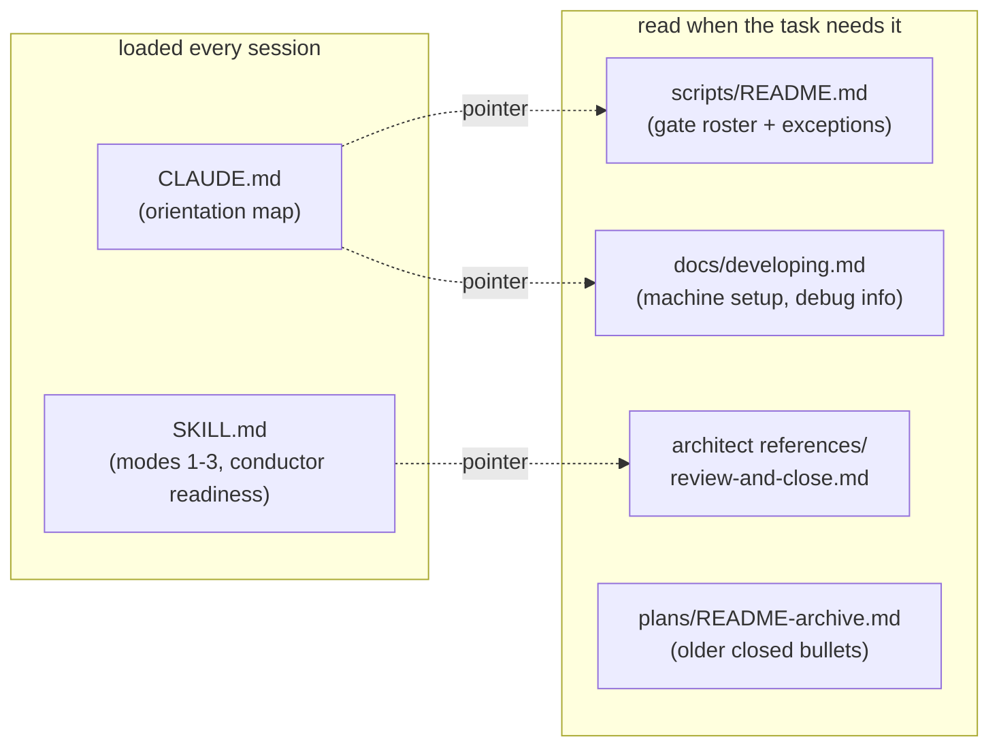

# 0244 — Sessions start lighter: standing context moves to where it is read on demand

> **Status:** done - Phase 3 owed, ADR-0249 (closed 2026-10-02 by a conductor close). Phase 1 `c9205236` + `79c7035a`, Phase 2 `a5d2dd2a`; round 1 review clean, its minor and nit repaired in `23f70bbd`. Version: none (docs/chore-only).
> **Created:** 2026-10-01
> **Owner skill(s):** dev, human
> **Related ADRs:** [ADR-0116](../../adrs/0116-an-index-row-is-a-pointer-and-a-gate-holds-it-to-one.md), [ADR-0210](../../adrs/0210-a-claude-repair-is-the-owners-and-a-session-that-needs-one-parks-with-the-edit.md)

## TL;DR

Every session in this repository starts with about 65k tokens of context before it does anything.
That figure is the median first-turn context across 122 lane sessions from 2026-09-22 to 09-30, and
it includes the 48-second readiness checks. Every later turn re-reads all of it from cache.

Three files carry most of the avoidable part:
- `CLAUDE.md` (41 KB), loaded into every session;
- the architect skill (82 KB), loaded into every architect session, including readiness;
- `docs/plans/README.md` (143 KB), which `CLAUDE.md` tells every session to read first, and which 23
  lane sessions did.

This plan **moves** material out of all three to files read on demand, and deletes nothing. The
first visible effect is a `CLAUDE.md` that fits on a few screens.

## Context & problem

Implement sessions are 66% of the conductor's spend ($329 of $499 in the audited window), at about 120
turns each. A standing context cut by 20 to 30k tokens takes roughly that share off every turn's cache
read. The three files grew for good reasons: each rule landed where its last violation was noticed. But
most of their bytes serve one task, not every session:

- **`CLAUDE.md`'s "Where things live" is 20 KB.** Of that, 8.2 KB is the `scripts/` entry (the gate
  roster and the renderer, maintenance-tool and hook-helper exceptions), and 4.4 KB is a `docs/` map
  that `docs/README.md` "Repository layout" already carries. "Machine setup" and "Dependencies compile
  with no debug info" add another 4.1 KB that only a person setting up a machine or chasing a
  backtrace needs.
- **The architect skill's Mode 4 is 61 KB of its 82 KB**: the review lenses, the close ceremony and
  conductor mode. A planning session or a readiness check reads none of it.
- **`docs/plans/README.md`'s "Recently closed" holds 200 bullets** (51 KB), each a pointer to a plan
  `done/` already holds.

## Decision

**Move, don't delete.** Each moved block keeps its words and gains a one-line pointer where it was.

**Rejected alternatives:**
- **A byte-cap gate on `CLAUDE.md` and every `SKILL.md`:** it would stop regrowth. The owner chose
  moves without a new gate on 2026-10-01, so a regrowth is caught by the next audit instead.
- **Trimming the plans index alone:** it is the largest file, but it is read by fewer sessions than
  `CLAUDE.md`, which every session loads.

## Architecture diagram

## Implementation phases

### Phase 1 — `CLAUDE.md` becomes an orientation map
- **Owner skill:** dev
- **What:** four moves, each leaving a one-line pointer in `CLAUDE.md`:
  1. **The `scripts/` entry's prose** moves verbatim to a new `scripts/README.md`: the gate roster,
     the CI-only gates, the close-ceremony six, the renderers, the maintenance tool and the hook
     helper. The rule "every `.mjs` is wired into pre-push or CI, with named exceptions" moves with
     it.
  2. **The `docs/` entry** keeps the load-bearing set as one line per document and points at
     the root `README.md` "Repository layout" for the rest.
  3. **"Machine setup: the linker override" and "Dependencies compile with no debug info"** move
     verbatim into `docs/developing.md`, under "Building". Where a sentence repeats what that page
     already says, the moved copy keeps the page's existing wording rather than adding a second one.
  4. **The plans-index line** "Read this first each session" becomes "Read this first in a
     human-started session; a conductor session is handed its plan."
  5. **Three directory entries become one-line pointers** (amended 2026-10-02, after the four moves
     above measured 26606 bytes): `site/` points at `site/README.md`, `tools/conductor/` at
     `tools/conductor/README.md`, and `packaging/` at `docs/releasing.md`. Each entry keeps one line
     saying what the directory is and that nothing shipped depends on it where that holds. A
     sentence the target does not already say moves there verbatim; one it already says is dropped.

  Every top-level directory stays named in `CLAUDE.md`, and the cross-cutting non-negotiables, commit
  hygiene and pitfalls stay whole.
- **Files touched:** `CLAUDE.md`, `scripts/README.md` (new), `docs/developing.md`, `README.md`
  (the layout row for `scripts/README.md`), `site/README.md`, `tools/conductor/README.md`,
  `docs/releasing.md`.
- **Done when:**
  - **Size:** `node -e "console.log(require('fs').statSync('CLAUDE.md').size)"` prints a number at or
    below 25000.
  - **Moved, not lost:** `git grep -c "check-gate-carriers" -- scripts/README.md` is at least 1.
  - **Moved setup:** `git grep -c "rust-lld" -- docs/developing.md` is at least 1.
  - **Links:** `node scripts/check-doc-links.mjs` and `node scripts/toc.mjs --check` exit 0.
  - **Prose gates:** `node scripts/check-system-counts.mjs` and `node scripts/check-reader-prose.mjs`
    exit 0.

### Phase 2 — The plans index keeps only the recent closes
- **Owner skill:** dev
- **What:** in `docs/plans/README.md` "Recently closed", the 15 newest bullets stay. Every older bullet
  moves verbatim, in its existing order, to a new `## Closed earlier (index bullets)` section of
  `docs/plans/README-archive.md`, placed directly before its `## Recently closed (full entries)`, together with any reference-link definitions it uses. The section's
  intro gains one sentence: it keeps the 15 newest, and the archive holds the rest. This is a
  mechanical move. No sequencing prose is touched, because judging which notes are superseded is the
  architect's step 3e at a close.
- **Files touched:** `docs/plans/README.md`, `docs/plans/README-archive.md`.
- **Done when:**
  - **Fifteen kept:** a `node -e` one-liner counting lines that start with `- [` between the
    `## Recently closed` heading and the next `## ` heading of `docs/plans/README.md` prints 15.
  - **Size:** `node -e "console.log(require('fs').statSync('docs/plans/README.md').size)"` prints a
    number at or below 100000.
  - **Gates:** `node scripts/check-doc-links.mjs`, `node scripts/check-index-rows.mjs` and
    `node scripts/toc.mjs --check` exit 0.

### Phase 3 — The architect skill loads its review and close on demand
- **Owner skill:** human
- **Blocks merge:** no
- **What:** the owner applies, in an interactive session, the edits under `.claude/` and their two
  conductor prompts. A headless session cannot write `.claude/` (ADR-0210), and nothing in this plan
  reads the result.
  1. **The move:** the whole of `## Mode 4 — Reviewing an implementation` in
     `.claude/skills/architect/SKILL.md` moves verbatim to a new
     `.claude/skills/architect/references/review-and-close.md`. That is everything from its heading
     to the line before `## Commit hygiene (for your own doc commits)`, including both "Closing a
     plan that was built in a worktree" and "Conductor mode".
  2. **The readiness block stays.** The `**readiness**` paragraph of conductor mode and its five
     bullets are copied back into `SKILL.md` under a short `## Conductor mode — readiness` heading,
     because readiness sessions are the most frequent architect sessions and must not need the
     reference.
  3. **The pointer.** In the removed section's place, `SKILL.md` carries:

     > ## Mode 4 — Reviewing an implementation, and the close
     >
     > A review, a close, and a conductor `review` or `close` session start by reading
     > `references/review-and-close.md` in full: the five lenses, the close-ceremony bookkeeping,
     > the worktree close sequence and conductor mode. Nothing in it is optional because it lives in
     > a reference.

  4. **The prompts:** `tools/conductor/prompts/review.md` and `tools/conductor/prompts/close.md` each
     gain, after their `Enter the ## Conductor mode section of your skill` sentence: "That section is
     in `.claude/skills/architect/references/review-and-close.md`; read it first."
  5. **The index:** the `## References` list in `SKILL.md` gains the new file.
- **Files touched:** `.claude/skills/architect/SKILL.md`,
  `.claude/skills/architect/references/review-and-close.md` (new),
  `tools/conductor/prompts/review.md`, `tools/conductor/prompts/close.md`.
- **Done when:**
  - **Size:** `node -e "console.log(require('fs').statSync('.claude/skills/architect/SKILL.md').size)"`
    prints a number at or below 25000.
  - **Links:** `node scripts/check-doc-links.mjs` exits 0.
  - **Conductor tests:** `node --test tools/conductor/test/*.test.mjs` passes.

## Risks & open questions

- **A rule moved out of the always-loaded file can be missed** by a session that never opens the
  file it moved to. The moves are chosen so that each destination is read by exactly the task that
  needs it:
  - `scripts/README.md` by whoever edits a gate;
  - `docs/developing.md` by whoever sets up a machine;
  - the review reference by every review and close, which Phase 3's pointer and prompts make
    explicit.

  The non-negotiables, which bind every session, do not move.
- **The saving is not measured by any gate here.** Byte sizes are the done-whens because they are
  checkable. The token figure that matters is the median first-turn context of a conductor implement
  session, about 65k before this plan, and the next workflow audit should read it from the lane
  transcripts.
- **Phase 2 moves 185 bullets.** A bullet whose reference-link definition stays behind shows up as
  `[label] (no definition in this file)` from `check-doc-links.mjs`, which is the done-when that
  catches it.

## What this plan does NOT do

- **It does not trim the dev, studio-builder or preset-author skills.** The dev skill's largest
  block, the four-step workflow, is read by every dev session.
- **It does not move sequencing prose out of the plans index.** That is the architect's at a close.
- **It does not add a size gate.**

## Implementation log

**Lane:** `plan-0244-sessions-start-lighter`, worktree `/home/igor/Work/rlx-plan-0244`

| phase | owner | state | commit |
|---|---|---|---|
| 1 — `CLAUDE.md` becomes an orientation map | dev | done | c9205236 (moves 1-4), 79c7035a (move 5) |
| 2 — The plans index keeps only the recent closes | dev | done | a5d2dd2a |
| 3 — The architect skill loads its review and close on demand | human | owed | |

### Notes

- **Phase 1 landed in two commits.** Moves 1-4 (c9205236) left `CLAUDE.md` at 26606 bytes and the
  phase parked; move 5, added to the plan after that park, brought it to 24290.
- **Move 5, what moved.** To `site/README.md`: the npm-project sentence, reworded to stand in that
  page. To `docs/releasing.md`: the READ-ME-FIRST / install-pages sentence. The `site/` line in
  `CLAUDE.md` keeps the live URL, which `site/README.md` does not carry. Every other sentence of the
  three entries was judged already said by its target and dropped, including the conductor entry's
  "neither a gate nor a renderer" clause.
- **Phase 2 moved 192 bullets**, not the 185 the Risks section counts: the index gained closes
  between drafting and this run. None used a reference-style link, so no definition moved with them.
  The moved bullets sit outside any `roster:` marker in the archive, so `check-index-rows.mjs` no
  longer caps them.
- **`docs/README.md` does not exist.** The "Repository layout" the plan names is in the root
  `README.md`, which is what the `CLAUDE.md` `docs/` entry already pointed at; the layout row for
  `scripts/README.md` went there.
- **The moved Linux paragraph.** `docs/developing.md` already had *No linker override on Linux*
  with its own `mold` figures, so the moved "Windows-only" paragraph keeps its first sentence and
  refers to that one rather than restating the measurement.

### Close triggers

- **`presets/` touched:** no
- **Plan header `Closes:`** none (the header has no `Closes:` line)
- **What shipped:** docs-chore-only (`CLAUDE.md`, `README.md`, `docs/developing.md`,
  `docs/releasing.md`, `scripts/README.md` new, `site/README.md`, the plans index and its archive)
- **Operator docs touched:** `docs/developing.md` (machine setup and debug info, under "Building"),
  `docs/releasing.md` (one sentence on the install pages), `scripts/README.md` (new: the gate roster)
- **Backlog probes (`node scripts/check-backlog-claims.mjs`):** exit 0, 55 reductions hold across
  27 live entries, 3 unprobeable; no entry named as failing
- **Full suite:** owed to the conductor's pre-review gate (ADR-0207).
- **Outstanding `human` phases:** Phase 3, which is marked `Blocks merge: no`

## Close review

**Phase 3 is owed (ADR-0249).** It has not yet moved Mode 4 out of
`.claude/skills/architect/SKILL.md` into `references/review-and-close.md`, nor added the reference
pointer to `tools/conductor/prompts/review.md` and `close.md`, so the architect skill still loads at
its full size in every architect session, readiness included. Its three done-whens (the skill's size,
the link check, the conductor tests) have not run.

Round 1 is the only round; no earlier finding was resolved by a fix round. Both round 1 findings were
repaired at the close in `23f70bbd`. The review follows in full, its headings demoted one level and
its one relative link re-pointed from this file's directory.

### Plan 0244 — close review, round 1

Graded at tip `bb4afd42b452e644bcbd1cd5b3b60d98a1ac4515` (tree `0bbdddc`), lane
`/home/igor/Work/rlx-plan-0244` on `plan-0244-sessions-start-lighter`, carrying `main`.

**Verdict: Plan 0244 landed cleanly. No blockers, no majors, one minor and one nit, both Markdown
prose a close can repair.** Phase 3 (`human`, `Blocks merge: no`) is owed after the merge, per
ADR-0249.

#### Evidence

- **Full suite:** `node .../with-lock.mjs suite -- cargo nextest run --workspace` printed
  `with-lock: skipped cargo nextest run --workspace: tree 0bbdddc is green in the suite ledger, run
  by gate 0244-pre-review at 2026-10-02T07:15:24.587Z: 1858 tests run: 1858 passed (2 slow), 84
  skipped`. The ledger tree `0bbdddc` is this tip's tree (`git rev-parse HEAD^{tree}`), so this is
  the lens-1 full-suite evidence.
- **`RUSTDOCFLAGS="-D warnings" cargo doc --workspace --no-deps`:** exit 0.
- **Phase 1 done-whens, all re-run:** `CLAUDE.md` is 24290 bytes (cap 25000);
  `git grep -c check-gate-carriers -- scripts/README.md` = 1; `git grep -c rust-lld --
  docs/developing.md` = 5; `check-doc-links.mjs` OK (597 files); `toc.mjs --check` OK (7 blocks);
  `check-system-counts.mjs` OK; `check-reader-prose.mjs` OK (16 documents, 0 bare).
- **Phase 2 done-whens, all re-run:** a `node -e` count of `- [` lines between `## Recently closed`
  and the next `## ` prints 15; `docs/plans/README.md` is 96033 bytes (cap 100000);
  `check-index-rows.mjs`, `check-doc-links.mjs`, `toc.mjs --check` exit 0.
- **Verbatim move, checked by script, not by eye:** a `node -e` comparison of `main`'s
  "Recently closed" bullets against the lane's index and archive: 207 on `main`, the lane keeps the
  first 15 unchanged, 192 moved, and the archive's `## Closed earlier (index bullets)` holds exactly
  those 192 byte-identical in the same order. The section sits directly before
  `## Recently closed (full entries)` as the plan requires. Their `done/...` links resolve from the
  archive's directory.
- **Phase 1 moves read against `main`:** the `scripts/` prose in `scripts/README.md` is the old entry
  re-flowed into paragraphs and bullets with its words intact; the two machine-setup sections in
  `docs/developing.md` are verbatim except the Linux paragraph, which now refers to the page's existing
  *No linker override on Linux* paragraph (line 98, above it) as the plan's "keeps the page's existing
  wording" rule asks, and ADR links rebased from `docs/adrs/` to `adrs/`. The `CLAUDE.md` pointer's
  fragment `#machine-setup-the-linker-override-opt-in-and-inert-if-skipped` matches the new heading at
  `docs/developing.md:102` (the link checker does not validate fragments, so this was checked by hand).
- **Move 5's drops checked against the targets:** every sentence dropped from the conductor, site and
  packaging entries is already said by its target. `tools/conductor/README.md` carries `local.json`
  (27, 65), the verified-CLI refusal with the patch-above warning (67-68, 579-584), `state/live.log`
  and `digest.md` (145, 166); `site/README.md` carries the single-source rule (13-18) and the
  `PUBLISHED` boundary (16, 24); `docs/releasing.md` carries the per-kind count (189), each staging
  recipe (216-233) and the NFR size cap (276-278). The `docs/` lines dropped from `CLAUDE.md` all have
  rows in the root `README.md` layout (177-189), and the translated slice its paragraph at 199.
- **Owner tags:** every phase carries one in-vocabulary `**Owner skill:**`; only the `human` Phase 3
  carries `Blocks merge: no`, and no later phase reads it.
- **Implementation log:** present, shorter than the phases section, and its claims held: 192 not 185
  bullets moved, no reference-style definitions among them, `docs/README.md` does not exist so the
  layout row went to the root `README.md`.

Lenses 2, 4 and 5 have nothing to grade: the diff touches no Rust, C++, TypeScript, C ABI, control
protocol or hot path. Nine files change, all Markdown.

#### Findings

##### minor

1. **`docs/releasing.md:147` — the moved READ-ME-FIRST sentence landed as a fragment.** Move 5 pasted
   the `CLAUDE.md` clause verbatim: *"Plus the READ-ME-FIRST.md a tester finds in each archive; the site
   publishes every one but the studio's as its install pages (ADR-0167), and a new one does not join
   the PUBLISHED map by existing."* It begins with "Plus", has no verb of its own, and directly follows
   a sentence saying each archive carries a `READ-ME-FIRST.txt`, so it reads as if the archives held a
   second, `.md` file. (The staging recipes copy `packaging/*/READ-ME-FIRST.md` to `READ-ME-FIRST.txt`:
   `packaging/linux/stage.sh:157`, `packaging/windows/stage.ps1:195`.) The citation is bare where the
   rest of the page links its ADRs, and `PUBLISHED` is named without saying where it lives. **Fix**,
   prose only: replace the fragment with *"That file is `packaging/*/READ-ME-FIRST.md`, renamed at
   staging; the site publishes every one but the studio's as its install pages
   ([ADR-0167](../../adrs/0167-the-site-owns-its-entrance-and-the-install-page-is-the-testers-own-file.md)),
   and a new one joins the site only when it is added to the `PUBLISHED` map in
   `site/src/plugins/rewrite-links.mjs`."* **Fixed in `23f70bbd`.**

##### nit

1. **`scripts/README.md:3-4` — the intro narrates the file's history.** *"The prose below is the
   `scripts/` entry of the root `CLAUDE.md`, moved here so a session reads it when it edits a gate
   rather than at every start"* describes how the page came to be, and stops being true the first time
   the page is edited on its own. **Fix**: *"Which gate runs where, and the named exceptions to the
   rule that every `.mjs` here is wired into pre-push or CI. The ordered gate roster itself is data..."*
   (keeping the rest of the paragraph). **Fixed in `23f70bbd`.**

#### Bookkeeping the close owes

- **Version bump: none.** The plan is docs/chore-only (the log's `What shipped` agrees with the diff:
  nine Markdown files, no code).
- **Status:** `done - Phase 3 owed, ADR-0249`; the `## Close review` states that Phase 3 has not yet
  moved Mode 4 out of `.claude/skills/architect/SKILL.md` or added the reference pointer to the two
  conductor prompts, so the architect skill still loads at its full size; the plans index's
  recently-closed bullet names the owed phase.
- `git mv` to `docs/plans/done/` and re-point the plan's outbound `../adrs/` links to `../../adrs/`.
- No paired ADR to accept, no `Closes:` header (step 3c does not apply), `presets/` untouched (3b does
  not apply). Steps 1c, 1d, 1e and 3d run as at every close.
- The new recently-closed bullet joins a list now capped at 15 by convention, so the close moves the
  oldest bullet to the archive's `## Closed earlier (index bullets)` to keep the index's own sentence
  true.
