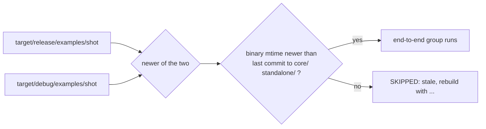

# 0245 — A gate that runs a built binary checks that it is current

> **Status:** done (2026-10-01). Phase 1 `6526f9f8`, fix round `063059af`. Conductor close after
> two review rounds: round 1 one major and two minors (all fixed in `063059af`), round 2 clean with
> one minor repaired at the close. Full suite green per the ledger; version 0.160.1.
> **Created:** 2026-10-01
> **Owner skill(s):** dev
> **Related ADRs:** [ADR-0033](../../adrs/0033-testing-strategy-coverage-ratchet-and-pre-push-gate.md), [ADR-0122](../../adrs/0122-a-sidecar-tool-documents-itself-in-one-place.md)

## TL;DR

The sd-filter suite's end-to-end group runs whatever `shot` binary sits at
`target/release/examples/`, and never rebuilds it. A binary built before the source it is tested
against fails the pre-push hook for no reason in the code. With this plan, the suite picks the newer
of the release and debug `shot`. When the one it picks predates the last commit to the source that
builds it, the suite skips the group with a notice naming the rebuild command, the same way it
already skips when no binary exists.

## Context & problem

Three of the owner's interactive sessions between 2026-09-26 and 09-30 opened on "pre-push failed".
One was this cause, and it was diagnosed by hand: `shot --bar-grid` answered "unknown argument" because
the release binary was built at 19:44 from a tree without Plan 0212's flag, which reached `main` after
it. A second was the same shape in the studio tests: a stale release player. That one was fixed in
`d40297f7` by taking the newer of release and debug (`studio/electron/testing/player.ts`). The third
did not reproduce. The sd-filter suite is the last gate consumer with this shape. It runs at every
push, and in every conductor gate where `python3` is on `PATH`.

## Decision

Skip-on-stale, with a notice. **Rejected alternatives:**
- **Have the hook build the release `shot` first:** the release profile is `lto = "fat"` with one
  codegen unit, which is minutes per push.
- **Fail on stale:** that is the current behaviour, and its failure blames the code for the build
  directory.
- **Compare file modification times against the sources:** a checkout or a `git switch` rewrites
  source mtimes, so they say nothing about what the binary was built from. The last commit time of
  the paths that build it does.

## Architecture diagram

## Implementation phases

### Phase 1 — The sd-filter suite takes a current `shot` or skips
- **Owner skill:** dev
- **What:**
  - **`find_shot(repo)`** in `tools/sd-filter/test_sd_filter.py` replaces the fixed release path. It
    looks at the release and debug `shot` (with `.exe` on Windows) and takes the newest by
    modification time, keeping release on a tie as the studio does.
  - **`shot_is_current(path, repo)`** compares that binary's modification time with the committer
    time of the newest commit touching `core/`, `standalone/`, `Cargo.toml` or `Cargo.lock`, read
    with `git log -1 --format=%ct -- <paths>`.
  - **The end-to-end group** runs only for a current binary. Otherwise it prints
    `SKIPPED: stale shot at <path> (built before <short sha> touched <paths>)` and the rebuild
    command, in the existing no-binary skip's shape. A repository where `git` is unavailable treats
    the binary as current and says so in one line.
  - **The checks:** in-process checks of both functions run in every invocation. They use temporary
    files with set modification times and a stubbed commit time, and need no build.
- **Files touched:** `tools/sd-filter/test_sd_filter.py`, `tools/sd-filter/README.md` (the test's
  binary rule), `docs/developing.md` (the pre-push section's line on the sd-filter step).
- **Done when:**
  - **Suite passes:** `python3 tools/sd-filter/test_sd_filter.py` exits 0 on this machine.
  - **Checks reported:** its output includes the in-process checks for the following cases:
    - the newer of two binaries is chosen;
    - a tie keeps release;
    - a binary older than the stubbed commit time is reported stale;
    - a binary newer than it is reported current.
  - **Real tree:** on a tree where the newest `shot` predates the last commit to `core/` or
    `standalone/`, the end-to-end group prints the stale notice instead of running.

## Risks & open questions

- **A skip hides coverage until someone rebuilds.** The in-process checks above the group already
  carry the same property, as the existing skip's own note says. The stale notice names the command.
  The conductor's gate logs keep the notice, so a skip is visible after the fact.
- **A commit that touches `core/` without changing what `shot` does still marks the binary stale.**
  That is a false skip, never a false pass, which is the intended direction.

## What this plan does NOT do

- **It does not touch the studio's player lookup.** `d40297f7` already fixed it.
- **It does not touch `studio/scripts/ui-shots.mjs`**, which is a renderer that no gate runs.
- **It does not make any gate build a release binary.**

## Implementation log

**Lane:** `plan-0245-a-gate-that-runs-a-built-binary-checks-it-is-current` in `/home/igor/Work/rlx-plan-0245`

| phase | owner | state | commit |
|---|---|---|---|
| 1 — The sd-filter suite takes a current `shot` or skips | dev | done | 6526f9f8 |

### Notes

- **Real tree:** the lane has no built `shot`, so the stale notice was observed against an empty
  placeholder at `target/debug/examples/shot` backdated to 2026-01-01 (removed after), not a real
  build. It printed `SKIPPED: stale shot at target/debug/examples/shot (built before 51c7d433
  touched core/ standalone/ Cargo.toml Cargo.lock)` and the debug rebuild command.
- **numpy absent on this machine:** the colour-table group skipped in every run here.
- **Review round 1, finding 0 (major), 063059af:** sources are dated by the later of the commit
  time and the newest HEAD reflog move that changed them, so the Risks claim of no false pass now
  holds for a fast-forward or merge; findings 1 and 2 (minors) rode in the same commit, same block.

### Close triggers

- **`presets/` touched:** no.
- **Closes:** the plan header names no design-backlog entry.
- **Shipped:** fix-only, in a test script; nothing that builds into an artifact.
- **Operator docs moved:** `docs/developing.md` (pre-push table row), `tools/sd-filter/README.md`.
- **Backlog claims:** `node scripts/check-backlog-claims.mjs` exit 0, no entry named.
- **`human` phases remaining:** none.
- **Full suite:** owed to the conductor's pre-review gate (ADR-0207).

## Close review

The round 2 review, which graded tip `e90ce400` clean, follows in full. Its one minor (m1,
`docs/developing.md`'s sd-filter row) was repaired at the close in `fcbe771b`.

### Plan 0245 — close review, round 2

Graded at tip `e90ce4002f16115622dfa94150e1fd1e01091fd8` on
`plan-0245-a-gate-that-runs-a-built-binary-checks-it-is-current`. The lane already carries `main`.

**Verdict:** Plan 0245 is ready to close. The round 1 major and both minors are resolved in
`063059af`, and every gate is green. There are no blockers and no majors. One minor remains:
`docs/developing.md`'s pre-push row still states the pre-fix staleness rule. A close may repair it,
since it is Markdown prose.

#### Evidence

- **Full suite:** `node .../with-lock.mjs suite -- cargo nextest run --workspace` printed
  `with-lock: skipped cargo nextest run --workspace: tree 8862df3 is green in the suite ledger, run by gate 0245-fix-1 at 2026-10-01T19:13:03.729Z: 1858 tests run: 1858 passed (5 slow), 84 skipped`.
  That ledger record is this round's full-suite evidence (ADR-0207). Round 1's record had 1934 run
  and 8 skipped. The fix round changed no Rust (`063059af` and `e90ce40` touch only
  `tools/sd-filter/` and the plan), so the extra 76 skips are environmental: skips that print a
  notice, most likely GPU tests that found no adapter during that gate. This is noted as an
  observation, not a finding. Round 1's record already shows the Rust tree green with the GPU
  suites running.
- **Rustdoc:** `RUSTDOCFLAGS="-D warnings" cargo doc --workspace --no-deps` passed.
- **Phase done-when, suite passes:** `python3 tools/sd-filter/test_sd_filter.py` printed
  `all checks passed`. The colour-table group skipped because numpy is absent. The lane's built
  `shot` was judged current under the new arrival rule, so the end-to-end group **ran**, and all
  nine of its checks passed.
- **Phase done-when, checks reported:** all four required cases are present and pass, together with
  the five checks the fix round added: no arrival outside a repository, a later arrival dates the
  sources, a binary built between commit and arrival is stale (its mtime is 1000000900, between the
  stubbed 1000000100 and 1000001000), no arrival keeps the commit time, and an earlier arrival does
  not backdate it. Each check asserts the exact tuple or boolean.
- **The reflog read against real git:** `git log -g -n 8 --date=unix "--format=%H %gd %gs" HEAD`
  in the lane returns `HEAD@{<unix>}` selectors, the shape `source_arrival` parses. It has six
  entries, and the oldest, with an empty subject, is the worktree's creation. No move changed the
  sources, so `source_arrival` takes its documented fallback, the oldest entry's time, which is
  later than any commit time. A binary built in the lane after that is current, which matches the
  run above.
- **Links:** `node scripts/check-doc-links.mjs` reports OK, 594 files.
- **Tree:** clean before and after; nothing committed.

#### Round 1 findings

- **M1 (major), fast-forwarded or merged sources judged by commit time:** resolved in `063059af`.
  `last_source_commit` now takes the later of the `%ct` and `source_arrival`, which is the newest
  `HEAD` reflog move whose two trees differ under `SHOT_SOURCES` (`git diff --quiet old new --`).
  The fix covers a merge, because the merge's tree differs from its pre-merge parent, and a
  fast-forward and a branch switch the same way. The walk direction is right: entry *i* is the move
  from entry *i+1*'s sha. A git error falls back to the commit time. An exhausted reflog shorter
  than the depth returns its oldest entry's time, and that errs only toward a false skip. The one
  remaining false-pass path is more than 100 `HEAD` moves in a row without a source change, which
  falls back to `%ct`. The docstring states this, and it is implausible in this workflow, so it is
  not raised. The log records the Risks correction, as round 1 asked.
- **m1 (minor), the notice claimed every path was touched:** resolved in `063059af`. The notice now
  reads `built before <sha>, the last commit to <paths>, reached this checkout`.
- **m2 (minor), the profile was taken from the absolute path:** resolved in `063059af`. It now uses
  `shot_rel.startswith("target/release/")`.

#### Lens 1: alignment

One phase, with a single in-vocabulary `**Owner skill:** dev`. The fix commit stays inside the
phase's Files touched. The implementation log is present, shorter than the phases section, and
accurate. Its `Full suite:` bullet is owed to the conductor's gate, which is correct in conductor
mode, and the ledger record above discharges it.

#### Lenses 2-5

The change is confined to a Python test script and docs. Nothing touches `core/`, the C ABI, the
control protocol, a hot path or a scene. Layering, real-time safety and determinism do not apply,
and the change makes no numeric assertion about a machine. **Version:** the change ships in no
artifact. The log says `fix-only`, and the level is the close's call (docs/chore-only or patch).

#### Findings

##### Minor

**m1. `docs/developing.md:235` still states the pre-fix staleness rule.**

- **What it says:** the sd-filter row reads "its end-to-end group skips when no built `shot` is
  newer than the last commit to `core/` or `standalone/`".
- **What the code does:** it also watches `Cargo.toml` and `Cargo.lock`. It also dates the sources
  by when they reached this checkout, not only by commit time.
- **Why it matters:** a developer whose `shot` is newer than that commit, but older than the
  fast-forward that brought it in, sees a skip that this row says cannot happen.
  `tools/sd-filter/README.md:68-75` states the rule correctly.
- **Fix (prose, close-repairable):** replace the parenthetical with "skips with no `python3`; its
  end-to-end group skips when no built `shot` is newer than the last change to `core/`,
  `standalone/`, `Cargo.toml` or `Cargo.lock` to reach this checkout - see
  `tools/sd-filter/README.md`". Keep the link form the surrounding table uses.

#### Bookkeeping for the close (not done here)

- No `Closes:` entries. No `presets/` touched. No ADR to accept.
- Version level: the close's call. The change ships in no artifact.
- The `## Close review` section should carry this review and one line each for round 1's M1, m1
  and m2, all resolved in `063059af`.

### Earlier rounds

- Round 1, M1 (major): sources dated by commit time missed a fast-forward or merge, so a stale
  binary could pass - resolved in `063059af`.
- Round 1, m1 (minor): the stale notice claimed the commit touched every source path - resolved in
  `063059af`.
- Round 1, m2 (minor): the rebuild profile was read from the absolute path - resolved in `063059af`.

### Close notes

- Version **0.160.1**, patch: a fix in a test script that ships in no artifact.
- Upstream CI (`node scripts/check-upstream-ci.mjs`) read green before the bump.
- No ADR to accept, no backlog entry closed, `presets/` untouched (no curation owed).
