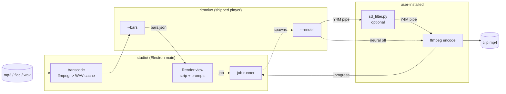

# 0247 — The studio renders a neural clip

> **Status:** done - Phase 6 owed, ADR-0249 (2026-10-02). Phases 1-5 in `30083e5a`, `8d8f2547`,
> `8fcef278`, `30ef08ec`, `e7e7394e`. Conductor close review round 1: no blockers, no majors, two
> minors (one fixed in `4fc5a4f6`), one nit. Version 0.162.0. Phase 6, the owner's packaged-studio
> render of an MP3 and a FLAC on the CUDA machine, has not been done.
> **Created:** 2026-10-01
> **Owner skill(s):** dev, studio-builder, human
> **Related ADRs:** [0262](../../adrs/0262-the-studio-renders-a-clip-by-piping-three-children-and-transcodes-what-the-player-cannot-read.md)
> (accepted; this plan's decision), [0175](../../adrs/0175-the-studio-is-a-separate-application-that-never-draws-a-frame.md)
> (the `render` subcommand it promised), [0236](../../adrs/0236-a-diffused-render-varies-by-prompt-on-bar-boundaries-and-the-seed-stays-fixed.md)
> (the prompt timeline it drives), [0240](../../adrs/0240-a-setting-lives-in-a-file-and-the-menu-edits-that-file.md)
> (every new choice has a `settings.json` key)

## TL;DR

The studio gains a **Render** view. You pick an MP3, FLAC or WAV and any preset from the library. A
strip appears showing the track's waveform with the player's bars over it. You drop one or more prompts
onto bars, switch **neural** on or off, and press Start. The studio transcodes the track with `ffmpeg`
and runs `ritmolux --render | sd_filter.py | ffmpeg` as three piped children. It shows progress and an
ETA, and keeps the machine awake until an MP4 lands beside a job file that can reopen the same render.
The player gains `--render` and `--bars`, promoted from `shot`; nothing in `core/` changes.

## Context & problem

The owner's ask, 2026-10-01: *"start render of neural clip from studio. I will be able to point to mp3
or flac song, choose preset and add some prompt, or several."*

Today that is a hand-composed three-stage shell pipe from a source checkout (`docs/diffusion-filter.md`
"The one command"), with a WAV-only renderer and a timeline JSON written by hand against a bar-grid file
nobody can see before the render. The plans index has carried *"clip rendering … and the diffusion pass
from the studio are each a later plan with its own interview"* since Plan 0159 closed. This is that plan.

The interview settled five things: the studio transcodes with ffmpeg rather than the player decoding;
prompts are placed on a waveform-and-bar strip; one panel does plain and neural renders; any library
preset can be chosen; and the studio pipes three children itself, a render dying with the studio being
the accepted price.

## Decision

The four forks are argued in ADR-0262. In one sentence: the player's two new modes come from `shot`
code, the studio wires child-to-child OS pipes and reads progress from `ffmpeg -progress`, and MP3/FLAC
reach the WAV-only reader through an ffmpeg transcode the studio caches for the session. We rejected a
decoder crate in the player (ffmpeg is already mandatory for the output), a detached job (too much
machinery for a first version; it is the followup), the player spawning the chain (the shipped binary
would learn about Python), and a studio-side beat tracker (prompts would land on bars the render does
not have).

## Architecture diagram



## Implementation phases

### Phase 1 — The player renders and reports bars
- **Owner skill:** dev
- **What:** `ritmolux` gains two answer-and-exit modes, dispatched before the launch path the way
  `--thumb` is. `--render <wav> --preset <name> [--fps] [--size] [--tier]` writes Y4M to stdout through
  `standalone::shot::render`'s own walk. `--bars <wav> [--fps] --out <path>` writes
  `shot::render::bar_grid`'s JSON. Presets resolve against the player's library (embedded set plus the
  user preset directory, as `thumbs::library()` resolves it). Exit 2 means the arguments are wrong in
  shape, including a preset no library holds. Exit 1 means a recognised request failed. `--ffmpeg`
  stays `shot`-only.
- **Files touched:** `standalone/src/cli.rs`, `standalone/src/main.rs`, a new `standalone/src/render_mode.rs`
  (or the name the existing modes suggest), `standalone/src/shot/render.rs` (only to expose what the mode
  calls), tests under `standalone/tests/` or beside the module, `docs/configuration.md`, `docs/capturing.md`.
- **Done when:**
  - A test renders a short WAV it synthesizes (the repo commits none) through `ritmolux --render` and
    through `shot`'s render entry point with the same preset, fps, size and tier, and asserts the two
    streams are **byte-identical**.
  - A test asserts `--bars` writes the same JSON as `shot --render --bar-grid` for the same WAV and fps.
  - `--bars` constructs no `Renderer` and requests no adapter. This is a structural property: the mode's
    code path holds no GPU type. The log states how it was checked.
  - An unknown preset exits 2, a non-PCM WAV exits 1, and each prints one line naming what was wrong.
  - The release binary's size before and after this phase is recorded in the log as two measured
    numbers, and NFR §4's cap still holds.
  - `docs/configuration.md` lists both flags. `docs/capturing.md` says in a short paragraph that the
    player's `--render` is the shipped twin of `shot --render`, and carries no copy of `shot`'s flag
    table.

### Phase 2 — A plain clip from the studio (walking skeleton)
- **Owner skill:** studio-builder
- **What:** A **Render** view beside Library / Editor / Settings with: a file picker for an audio file,
  a picker over the whole library, fps (default 30), size (default 1920x1080), tier (default `rich`), an
  output path, and Start. The main process transcodes the source with `ffmpeg -i <src> -c:a pcm_s16le
  -ac 2 <cache>/<key>.wav`, keeping the sample rate, into `userData/render-cache/`. The key covers the
  source path, size and mtime, and the cache is emptied when the studio quits. It then runs `--bars`
  to learn `frames`, and starts `ritmolux --render … | ffmpeg <canonical encode> -progress pipe:3`, with
  the WAV as the encoder's audio input. The player's stdout is passed as the encoder's stdin stream, so
  frames never reach JavaScript. The view shows a progress bar and ETA from `frame=` against `frames`.
  **Cancel** kills both children and deletes the partial output. While a job runs,
  `powerSaveBlocker.start('prevent-app-suspension')` is held and quitting asks for confirmation. On
  failure the last stderr lines of each stage go to `<output>.render.log` and appear in the view.
  New `settings.json` keys: `render.ffmpegPath` (absent means `ffmpeg` on `PATH`) and
  `render.outputDir` (absent means the user's Videos directory). The Settings view edits both.
- **Files touched:** `studio/electron/render/` (new: transcode, pipeline, progress parser), `studio/electron/settings.ts`,
  `studio/electron/ipc/`, `studio/electron/preload/`, `studio/shared/ipc-channels.ts`, `studio/renderer/views/Render.tsx` (new),
  `studio/renderer/App.tsx`, `studio/renderer/views/Settings.tsx`, tests beside each.
- **Done when:**
  - A vitest test parses a recorded `ffmpeg -progress` transcript into a monotone frame count, and
    reports done only on `progress=end`.
  - A test with stub children asserts that Cancel kills every child and removes the output file, and
    that a non-zero exit from any stage fails the job and names that stage.
  - A test asserts the encoder is spawned with the player's stdout as its stdin stream, not with a
    `'pipe'` that JavaScript forwards.
  - The settings test reads and writes both new keys, and `node scripts/check-settings-have-files.mjs`
    exits 0.
  - The by-hand duration check moved to Phase 6 on 2026-10-02: a headless session cannot drive a
    built studio, and `ffprobe` is not on its allowlist.

### Phase 3 — The strip and the prompts
- **Owner skill:** studio-builder
- **What:** Once a track is chosen, the view draws its **waveform**, using min/max peaks per pixel
  column computed in the main process from the cached WAV, with the **bars** from `--bars` over it.
  Locked bars (`bar_locked`) are drawn distinctly from fallback bars, and the grid's summary line
  (*N bars, M on a downbeat*) appears under the strip. Clicking a bar adds a prompt marker there.
  Markers can be dragged and snap to bar starts, edited in a text field, and deleted. Between two
  markers the strip shades the blend, because ADR-0236's conditioning interpolates across the whole
  span rather than switching at the marker. The first marker is at bar 1 by default. Changing fps
  re-runs `--bars`, and markers keep their **bar numbers**. The view holds the timeline as
  `[{at_bar, prompt}]`, ascending and unique, which is exactly what `sd_filter.py --timeline` accepts.
- **Files touched:** `studio/electron/render/peaks.ts` (new), `studio/renderer/components/BarStrip.tsx` (new),
  `studio/renderer/views/Render.tsx`, `studio/shared/` (the timeline type and its validator), tests beside each.
- **Done when:**
  - The peaks function, fed a synthetic WAV (a 1 s silence then a 1 s full-scale square wave), returns
    zero columns for the first half and ±1 for the second within one column of the boundary.
  - The timeline validator refuses what `sd_filter.py`'s `parse_timeline` refuses: an empty list, a bar
    below 1, a non-ascending or duplicate bar, an empty prompt, and a bar past the grid's last.
    A table-driven test covers each case.
  - A component test drags a marker between bars and asserts it lands on a bar start and keeps its
    prompt text.
  - A component test asserts locked and fallback bars render with different classes.

### Phase 4 — The neural toggle
- **Owner skill:** studio-builder
- **What:** A **neural** switch adds the sidecar to the pipeline as `<python> <script> --profile
  <quality|fast> --timeline <out>.timeline.json --bar-grid <out>.bars.json [--negative] [--seed]`.
  The studio writes both files beside the output before spawning. `--bars` writes the grid file
  directly, so the sidecar reads the same bars the strip showed. New `settings.json` keys:
  `render.diffusion.python` (an interpreter path) and `render.diffusion.script` (a path to
  `tools/sd-filter/sd_filter.py` in a checkout). Both are absent by default. The **readiness probe** runs when the Render view opens:
  it checks the script exists, then runs `<python> -c "import torch; print(torch.cuda.is_available())"`.
  The switch stays disabled with one line naming the key or the failure, for example *"torch reports no
  CUDA - see docs/diffusion-filter.md"*, until the probe passes. The result is cached for the session,
  with a re-check button. Start refuses a neural job with no prompt before spawning anything. The
  progress line also shows the sidecar's own per-frame figure, read from its stderr, beside the
  encoder's count.
- **Files touched:** `studio/electron/render/` (probe, pipeline), `studio/electron/settings.ts`, `studio/renderer/views/Render.tsx`,
  `studio/renderer/views/Settings.tsx`, tests beside each.
- **Done when:**
  - An integration test runs the real three-stage pipeline with `sd_filter.py --passthrough`, a built
    player and `ffmpeg` on a two-second WAV, and asserts the MP4's frame count equals `--bars`'
    `frames`. It skips with a printed notice when any of the three is missing (ADR-0016's shape).
  - A test asserts the probe's three outcomes (no script, no CUDA, ready) produce three distinct
    disabled or enabled states, each carrying its own message.
  - The timeline and bars files written beside the output parse with `sd_filter.py`'s own loader.
    The passthrough run above proves this, because it passes `--timeline`.
  - The two new keys round-trip in the settings test, and `node scripts/check-settings-have-files.mjs`
    exits 0.

### Phase 5 — The job is a file, and the docs say so
- **Owner skill:** studio-builder
- **What:** Start writes `<output>.render.json` (shape below) beside the MP4, and an **Open job**
  action restores the whole view from one: track, preset, fps, size, tier, neural settings and prompts.
  If the source has moved, it asks for it again and keeps the prompts. Docs: `studio/README.md` gains a
  *Rendering a clip* section. `docs/configuration.md` gains the four `render.*` keys.
  `docs/diffusion-filter.md` gains a short *From the studio* section that points at the studio and
  carries **no figure**, because the figures gate holds them to one page. `docs/capturing.md` gets a
  one-line pointer.
- **Files touched:** `studio/electron/render/job.ts` (new), `studio/renderer/views/Render.tsx`, `studio/README.md`,
  `docs/configuration.md`, `docs/diffusion-filter.md`, `docs/capturing.md`.
- **Done when:**
  - A test round-trips a job document through write and open and asserts equality, and asserts a
    document with an unknown `version` is refused with a message.
  - `node scripts/check-filter-figures.mjs`, `node scripts/check-doc-links.mjs` and
    `node scripts/check-reader-prose.mjs` each exit 0.

### Phase 6 — A real neural clip, judged
- **Owner skill:** human
- **Blocks merge:** no
- **What:** On the CUDA machine, from a **packaged** studio (`resources/player/` carrying the new
  player) with `render.diffusion.*` pointed at a checkout's venv, render one MP3 and one FLAC with at
  least three prompts each, one at `fast` and one at `quality`. Watch both.
- **Done when:** The owner records in the log that both files play with audio in sync, that the
  prompt changes land near the bars they were placed on, or that they do not and why, and whether a
  studio quit mid-render asked first. Before the neural renders, a plain clip of each of the two files
  (neural off) has an MP4 duration that `ffprobe` reports within one frame of the source's, and the
  log names the two files.

## Data shapes

```jsonc
// illustrative — <output>.render.json, written by the studio, read only by the studio
{
  "version": 1,
  "audio": "/home/me/Music/track.flac",
  "preset": "Supernova",
  "fps": "30",
  "size": "1920x1080",
  "tier": "rich",
  "output": "/home/me/Videos/track-supernova.mp4",
  "neural": {                      // null when the switch is off
    "profile": "fast",
    "negative": null,              // null = the sidecar's default
    "seed": null,
    "timeline": [{ "at_bar": 1, "prompt": "a vast canyon of luminous rock" },
                 { "at_bar": 33, "prompt": "a cathedral rose window in stained glass" }]
  }
}
```

Beside it at render time: `<output>.bars.json` (the player's `--bars`), `<output>.timeline.json`
(`neural.timeline` verbatim), and `<output>.render.log` (only on failure).

## Risks & open questions

- **The binary size cost of `--render` is unmeasured.** `standalone::shot` is in the lib, but the
  player does not link the render walk today. If Phase 1's measurement breaks NFR §4's cap, stop and
  return to architect. Gating the modes behind a cargo feature would change what the packaged studio
  carries, and that is a decision, not a fix.
- **A crash loses a night.** Accepted in ADR-0262. If it happens even once, ADR-0262's Alternative B
  (detached job) is the followup, and the job file from Phase 5 is already the launcher's input.
- **Prompt placement trusts a mostly-fallback grid.** A marker on "bar 33" may not sit on a musical
  phrase boundary. The strip makes that visible, and fixing the estimator is backlog 0042's question,
  not this plan's.
- **Is the CUDA machine the Arch box or the Windows laptop?** The sidecar was measured on Windows.
  Phase 6 runs wherever CUDA is. The Linux venv recipe is already in `tools/sd-filter/README.md`.
- **Electron child stdio across platforms.** Passing one child's `stdout` stream as another's `stdin` is
  supported by Node on all three platforms, but has not been exercised in this repo. Phase 2's stub
  test pins the wiring. Phase 4's integration test proves it end to end on a machine with a built
  player, ffmpeg and a GPU adapter. It skips on CI's studio job, which builds no player.

## What this plan does NOT do

- **No preset changes across a track** and **no onset-driven denoise.** ADR-0236 declined both, and
  this plan inherits that.
- **No detached or resumable renders.** No render queue: one job at a time.
- **No preview of diffused frames during the run.** Progress is numbers. The MP4 is the picture.
- **No shipped Python.** The diffusion stage still needs a user-built venv and a checkout's script.
  The studio says so; it does not install anything.
- **No player decoding of compressed audio**, and no change under `core/`.

## Implementation log

**Lane:** branch `plan-0247-the-studio-renders-a-neural-clip`, worktree `/home/igor/Work/rlx-plan-0247`

| phase | owner | state | commit |
|---|---|---|---|
| 1 — The player renders and reports bars | dev | done | `30083e5a` |
| 2 — A plain clip from the studio | studio-builder | done | `8d8f2547` |
| 3 — The strip and the prompts | studio-builder | done | `8fcef278` |
| 4 — The neural toggle | studio-builder | done | `30ef08ec` |
| 5 — The job is a file, and the docs say so | studio-builder | done | `e7e7394e` |
| 6 — A real neural clip, judged | human | owed | |

### Notes

- Phase 1, outside the file list: `standalone/src/thumbs.rs` (`library()` made `pub(crate)` so
  `--render` resolves through it) and `standalone/tests/suite/main.rs` (registers the new
  `render_cli` module).
- Phase 1, `cli.rs`: `FlagSpec::requires` became a list read as "any one of", so `--size` reads
  `[requires --stream or --render]` and `--fps` adds `--bars`. A third new flag, `--out`
  (`[requires --bars]`), carries `--bars`' path. `run.rs` is unchanged.
- Phase 1, defaults the plan left open: with no flag, `--render` takes `shot`'s 60 fps, 1280x720
  and tier `floor`, and `--preset` is required.
- Phase 1, the structural `--bars` check is a source-reading unit test,
  `render_mode::tests::the_bars_mode_holds_no_gpu_type`. It asserts that the bodies of `fn bars`
  and `fn read_clip` name none of `Renderer`, `renderer`, `render::run`, `wgpu`, `Tier` or
  `adapter`, and that `fn render_clip` names `render::run`.
- Phase 1, binary size: `target/release/ritmolux` from `cargo build --release -p standalone --bin
  ritmolux`, Linux. 12,854,504 B at `f77a476a`, before the phase. 12,928,352 B after it, which is
  77.1 % of NFR §4's 16,777,216 B cap.
- Phase 2, outside the file list: `studio/shared/render.ts` (request, grid and event shapes),
  `studio/electron/render/service.ts` and `commands.ts`, `ipc/appHandlers.ts` and
  `preload/api/app.ts` (`AppInfo` carries `render`), four CSS modules, `App.test.tsx` (its stub
  gains `render`), and `studio/README.md` (the `render` row `settings.doc.test.ts` requires).
- Phase 2, IPC: eight OS channels under `render:`; no domain channel. Main accepts a path back
  from the renderer only when it produced it (a dialog's answer or its own suggestion).
- Phase 2, `encoderArgs` is `shot::render::ffmpeg_args` at CRF 18 plus `-progress pipe:3`;
  `commands.test.ts` holds it to the Rust function's string literals.
- Phase 2, behaviour the plan left open: the first stage to exit badly is named and the rest are
  stopped; an upstream exit after the encoder finished cleanly is not a failure; an encoder exit
  0 without `progress=end` is one. A failed job also deletes its partial MP4. The transcode cache
  is emptied at start as well as at quit.
- Phase 3, outside the file list: `render/service.ts`, `shared/render.ts` (`Peaks`) and
  `BarStrip.module.css`. The timeline type and validator are `studio/shared/timeline.ts`.
- Phase 3, peaks are a fixed 1,200 columns drawn as one scaling SVG outline, not the strip's
  measured pixel width.
- Phase 3, a marker dropped on an occupied bar stays where it was. A prompt past a re-counted
  grid is drawn dotted at the strip's end and named by the validator line.
- Phase 4, outside the file list: `shared/render.ts`, `shared/ipc-channels.ts` (a ninth channel,
  `render:probe`), `ipc/renderHandlers.ts`, `preload/api/render.ts`, `render/commands.ts`,
  `main.ts`, `Render.module.css`, `studio/README.md`, and `Render.test.tsx`.
- Phase 4, done-when not satisfiable as stated: `sd_filter.py --passthrough` never calls
  `load_timeline`, so the passthrough run does not parse `--timeline`. The integration test runs
  `load_timeline` and `load_bar_grid` on the two files itself.
- Phase 4, the integration test ran here without skipping (newest built player, `python3`,
  `ffmpeg`): `--bars` 60 frames, MP4 decoded at 60.
- Phase 4, the probe's order is script key, script file, interpreter key, torch. Its answer is
  dropped when a `diffusion.*` key is written. `<output>.bars.json` and `.timeline.json` are
  written for neural jobs only.
- Phase 4, the sidecar figure is read from its `sd-filter: N frames` line (every ten frames),
  with seconds per frame paced from the first such line.
- Phase 5, outside the file list: `render/service.ts` (Start writes the job; `openJob`),
  `shared/render.ts` (`OpenedJob`), `shared/ipc-channels.ts` (a tenth channel,
  `render:open-job`), `ipc/renderHandlers.ts`, `preload/api/render.ts`, and `service.test.ts`.
- Phase 5, opening a job grants the output and, when it still exists, the track it names.

### Close triggers

- `presets/`: not touched (`git diff --name-only main...HEAD -- presets` is empty).
- `**Closes:**`: the plan header carries none.
- What shipped: a feature. The player gains `--render`, `--bars` and `--out` (`standalone/`), and
  the studio gains the Render view, ten `render:` OS channels and the `render` settings key.
- Operator docs moved: `docs/configuration.md`, `docs/capturing.md`, `docs/diffusion-filter.md`,
  `studio/README.md`.
- `node scripts/check-backlog-claims.mjs`: exit 0. Its advisory names three entries whose probed
  paths this lane touched: 0260 and 0261 (`standalone/src/thumbs.rs`), and 0262
  (`docs/diffusion-filter.md`).
- Full suite: owed to the conductor's pre-review gate (ADR-0207). At `e7e7394e` the studio's
  `typecheck`, `lint` and `test` (44 files, 396 tests) exit 0, as do `check-filter-figures`,
  `check-doc-links`, `check-reader-prose`, `check-settings-have-files` and
  `check-comment-hygiene`.
- `human` phases remaining: Phase 6 (`Blocks merge: no`).

## Close review

Closed 2026-10-02 by a conductor close at round 1. The review is reproduced in full below, as
written to `tools/conductor/state/reviews/0247-round-1.md`. The close repaired the first minor in
`4fc5a4f6`. The second minor and the nit are code changes, so they stay open. **Phase 6 is owed**
(`Blocks merge: no`, ADR-0249). That leaves three things unchecked. Nobody has judged a real neural
clip from a packaged studio. Nobody has measured a plain clip's duration against its source with
`ffprobe`. And nobody has seen the quit prompt during a render. Upstream CI on `main` read red
(Windows `check`) at the close.

### Plan 0247 — close review, round 1

Graded at tip `abdb59dafe2dd6226328abd08f03cee38eca7f95` (tree `76ac22c5`), lane
`/home/igor/Work/rlx-plan-0247` on `plan-0247-the-studio-renders-a-neural-clip`.

**Verdict: Plan 0247 landed cleanly. No blockers, no majors, two minors and one nit.** Phases 1-5
are built as written, with every deviation recorded in the log. Phase 6 (`human`,
`Blocks merge: no`) is correctly `owed`.

#### Evidence

- **Full suite (lens 1):** `node .../with-lock.mjs suite -- cargo nextest run --workspace` printed
  `with-lock: skipped cargo nextest run --workspace: tree 76ac22c is green in the suite ledger, run by
  gate 0247-pre-review at 2026-10-02T09:07:36.655Z: 1951 tests run: 1951 passed (14 slow), 8 skipped`.
  `git rev-parse HEAD^{tree}` is `76ac22c5097696ba497f0aa7869c0f976be4e220`, so that ledger record
  covers this tip's tree. It is the full-suite evidence (ADR-0207).
- `RUSTDOCFLAGS="-D warnings" cargo doc --workspace --no-deps`: exit 0.
- Studio: `npm --prefix studio run typecheck`, `run lint` and `run test` all exit 0, with 44 files and
  396 tests. No `skipped:` notice was printed, so the three-stage integration test appears to have run
  on this machine rather than skipped.
- `check-settings-have-files`, `check-filter-figures`, `check-doc-links`, `check-reader-prose` and
  `check-comment-hygiene` each exit 0.
- `git status --porcelain` is empty before and after every run.

#### Lens 1 — alignment with the plan

Every phase has a single, in-vocabulary `**Owner skill:**`. Phase 6 carries `**Blocks merge:** no`,
no later phase reads it, and its log row reads `owed`.

**Phase 1 (dev).** `standalone/src/render_mode.rs` is dispatched from `main` after `--thumb` and
before `run::run()`. It calls `shot::render::run` and `render::bar_grid` instead of copying them, and
resolves presets through `thumbs::library()` (made `pub(crate)`, noted in the log). I read each
done-when's test body:
- `the_players_render_is_byte_identical_to_shots` renders the same preset, clip, fps 30, 48x32 and
  tier `rich` (off both defaults) through both binaries. It asserts the header, the exact length for
  30 frames, and `ours.stdout == theirs.stdout`. Where there is no adapter it skips in ADR-0016's
  shape, keyed on the adapter error.
- `the_players_bars_match_shots_bar_grid` asserts string equality of the two JSON files, plus a
  six-second/30-fps prefix so that two empty grids cannot pass.
- `an_unknown_preset_exits_2_and_a_non_pcm_wav_exits_1` asserts exit codes 2 and 1, one stderr line
  each, and an empty stdout. It also checks that a refused `--bars` writes no file.
- The structural `--bars` check is a source-reading unit test with a control arm, as the log
  describes.
- Binary size: 12,854,504 B before and 12,928,352 B after, which is 77.1 % of NFR §4's cap.
- `docs/configuration.md` lists `--render`, `--bars` and `--out`. `docs/capturing.md` has the twin
  paragraph and no flag table.

The `FlagSpec::requires` widening to "any one of" keeps `every_requires_names_a_real_flag` and the
help-text test true. Two older tests were moved from `--fps` to `--sender` so that they still probe a
single-companion flag. The change is sound.

**Phase 2 (studio-builder).**
- `progress.test.ts` parses a recorded transcript in five chunk sizes. It asserts a strictly
  increasing count, rejects any truncated-number reading, and accepts done only on `progress=end`.
- `pipeline.test.ts` covers the spec in four ways:
  - It asserts the encoder's stdio is `[children[0].stdout, 'ignore', 'pipe', 'pipe']`, not `'pipe'`,
    and that the parent destroyed its own copy.
  - Cancel kills every child and removes the output.
  - Each stage's failure names that stage.
  - It covers the two ordering edge cases the log describes.
- The settings test and the Settings view test read and write both keys, and the settings gate
  exits 0.
- The default fps, size and tier are 30 / 1920x1080 / `rich`, as specified.
- The transcode keeps the sample rate (no `-ar`). The cache key covers path, size and mtime. The
  cache is emptied at start and at quit.
- The window's `close` prompt and `powerSaveBlocker` are in `main.ts` and `ipc/renderHandlers.ts`.

**Phase 3.**
- `peaks.test.ts` builds the specified synthetic WAV (with an ffmpeg-style `LIST` chunk) and asserts
  [0,0] then [-1,1], with a tolerance of one column.
- `timeline.test.ts` is table-driven over each refusal `parse_timeline` and `check_timeline_fits`
  make. I compared the TypeScript validator with `sd_filter.py:148-201` and they match.
- `BarStrip.test.tsx` covers four things:
  - a drag that lands on a bar start and keeps its prompt;
  - locked and fallback bars drawn with different classes;
  - the summary line;
  - adding and removing a prompt.

**Phase 4.**
- The probe's outcomes are distinct in `probe.test.ts`. The switch's disabled and enabled states,
  each with its own line, are in `Render.test.tsx`.
- `service.test.ts` holds three refusals:
  - a neural job with no prompt is refused before anything is transcoded or spawned;
  - a job is refused while the probe says no;
  - a prompt past the counted grid is refused.
- The integration test runs player → `sd_filter.py --passthrough` → ffmpeg. It asserts the MP4's
  decoded frame count equals `--bars`' `frames`, and skips in ADR-0016's shape.
- The done-when's "the passthrough run proves the loader parses `--timeline`" was false as written,
  because `--passthrough` never calls `load_timeline`. The log says so, and the test runs
  `load_timeline` and `load_bar_grid` directly. That is a faithful repair, not a drift.
- The sidecar's `sd-filter: N frames` line exists at `sd_filter.py:495`, once every ten frames.

**Phase 5.** `job.test.ts` round-trips a plain job and a neural job. It refuses `version: 2` with a
message naming both versions, and refuses a document with no version. The three doc gates exit 0.
`studio/README.md` has `## Rendering a clip`. `docs/configuration.md` carries the four `render.*`
keys. `docs/diffusion-filter.md`'s *From the studio* carries no figure. `docs/capturing.md` has the
pointer.

The log is shorter than `## Implementation phases`, and its close-trigger bullets are present and
accurate.

#### Lens 2 — layering, real-time safety, contracts

- Nothing under `core/` changes. No audio callback is touched.
- The C ABI is unchanged.
- No OSC address or event is added. The studio reaches the new modes through the player's CLI and
  its standard streams, which ADR-0262 records. Spec 0003 owes nothing.
- On the studio side, Electron is confined to `ipc/renderHandlers.ts` and `main.ts`, so
  `render/service.ts` runs under plain tests.
- Paths from the renderer are accepted only when main produced them.

#### Lens 3 — docs and bookkeeping

- The operator docs this plan moved are swept: configuration, capturing, diffusion-filter and the
  studio README.
- Owed at the close:
  - ADR-0262 is `proposed` and needs flipping to `accepted`.
  - The plan moves to `done/` with `Status: done - Phase 6 owed, ADR-0249`.
  - Both plan indexes need refreshing.
  - **A minor version bump.** The plan is a feature: new player flags and a new studio view. The two
    studio version copies follow the bump.
- `presets/` is not touched, and the plan header has no `Closes:`.

#### Lens 4 — correctness

- `--render` defaults to tier `floor` unpinned, so a render does not depend on the machine.
- The new tests carry no frozen numeric thresholds. Their frame counts are exact, derived from
  `ceil(secs x fps)`, and the binary-size figures are recorded as measurements on Linux.
- Nothing here depends on the render target's aspect.

#### Lens 5 — design integrity

- Dependency direction is preserved: `standalone` calls its own `shot` lib, and the studio spawns
  binaries.
- The `RenderJob` / `RenderService` / handler split is clean.
- No seam is widened without an ADR.

#### Findings

##### minor — the plan says CI proves the three-stage pipe; CI's studio job never can

`docs/plans/0247-the-studio-renders-a-neural-clip.md:247-249`. The Risks bullet says
*"Phase 4's integration test proves it end to end on CI's Linux runner."* The `studio` job in
`.github/workflows/ci.yml:459-474` runs `npm ci` / typecheck / lint / `npm test` and builds no
player. `builtPlayer()` therefore finds none, and the test always takes its `skipped:` branch there.
The runner has no GPU adapter either. The child-to-child stdio wiring is proved end to end only on a
developer machine with a built player: this lane's run, and Phase 6.

**Fix:** a close repair in Markdown. Reword the bullet to: *"Phase 2's stub test pins the wiring.
Phase 4's integration test proves it end to end on a machine with a built player, ffmpeg and a GPU
adapter. It skips on CI's studio job, which builds no player."* State the same in the `## Close
review`.

##### minor — a quit confirmed while a job is still starting stops nothing

`studio/electron/render/service.ts:219-221`, called from `studio/electron/main.ts`'s `will-quit`.
`busy` is true while `starting`, which covers the transcode and `--bars` before `launch`, so the close
prompt correctly asks. But `abandon()` reaches only `this.job`, which is still `undefined` then.
Quitting at that moment leaves the transcode's `ffmpeg` child running as an orphan into a cache
directory that `cache.clear()` just removed.

The cost is small: the transcode is bounded and nothing is spawned after exit. Still, the prompt's
text, *"Quitting stops it"*, is not true in that window.

**Fix:** record in-flight `execFile` children in `TranscodeCache` / `readBars` and kill them in
`abandon()`. Alternatively, let the prompt say a job is still preparing. This is code, so it stays
open for a fix round or a followup.

##### nit — a neural Start refused after `--bars` leaves `<output>.bars.json` behind

`studio/electron/render/service.ts:160-163`. In a neural Start, the grid is written beside the output
before the counted-grid timeline check. When that check refuses, `<output>.bars.json` stays on disk
next to an MP4 that never existed. It is harmless, and the next Start overwrites it.

**Fix:** remove the file on that refusal.

#### Prior rounds

None. This is round 1.

### Findings from earlier rounds

None: round 1 was the only round.

## Followups (after this lands)

- ADR-0262 Alternative B, the detached job, if a render is ever lost to a studio exit.
