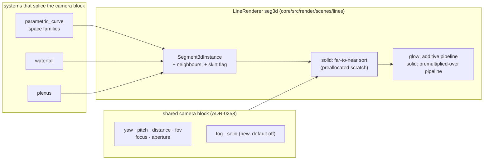

# 0248 — 3D strokes gain joins, depth cues and a solid mode

> **Status:** done - Phases 6, 7, 8 owed, ADR-0249. Closed 2026-10-05 at v0.164.0 by a conductor
> close: Phases 1-5 in `d4e48373`, `cb0b0454`, `9ef1719c`, `19575ade`, `fd1c12ab`; round 1 review
> no blockers, no majors, three minors and one nit, two repaired in `22ab1ccd`.
> **Created:** 2026-10-05
> **Approved:** 2026-10-05 (user)
> **Owner skill(s):** dev, human
> **Related ADRs:** [0263](../../adrs/0263-a-3d-stroke-may-be-solid-by-a-back-to-front-sort-and-depth-cues-ride-the-shared-camera.md)
> (accepted at the close; this plan's decision), [0257](../../adrs/0257-a-shared-camera-projects-3d-primitives-and-depth-of-field-is-a-per-endpoint-circle-of-confusion.md),
> [0258](../../adrs/0258-a-system-takes-depth-through-one-shared-camera-block-and-its-3d-mode-forgoes-what-seg3d-does-not-draw.md),
> [0158](../../adrs/0158-a-joined-end-carries-its-own-miter-length.md),
> [0249](../../adrs/0249-a-human-phase-may-be-owed-after-the-merge.md)
> **Closes:** design-backlog 0279, 0280, 0281
> **Runs before:** Plans [0237](0237-the-l-system-turtle-turns-in-space.md),
> [0239](../0239-the-swarm-moves-into-a-real-camera.md) and
> [0240](../0240-the-attractor-projects-through-the-shared-camera.md), which splice the camera block this
> plan extends.

## TL;DR

The owner judged the knot (Plan 0236) and the waterfall (Plan 0238) live, and both read as depth
only weakly, for three reasons the `seg3d` stroke shares: a heavily blurred stroke breaks into a comb
at its joints, nothing fades or shifts with distance, and nothing occludes, so a knot reads as
glowing wire and a waterfall's rows show through its peaks. This plan fixes all three in the shared
camera layer, cheapest first: 3D joins, then `fog` and a depth colour axis, then a per-preset `solid`
mode that sorts segments far to near and paints near over far, with a black skirt under each
waterfall row. Every new param defaults to off, so the only pixels that move without a preset asking
are the joins'. The first visible behaviour is a blurred knot whose strand is one smooth soft band.

## Context & problem

The three findings are backlog 0279, 0280 and 0281, each with its mechanism read from the code.
The `seg3d` pipeline is additive (`ADDITIVE_LIGHT_SATURATING_COVERAGE`) with no depth attachment; a
`Segment3dInstance` carries no join, so blurred neighbours overlap at every joint; and the colour of a
space curve runs along its path. The engine has no depth buffer anywhere, and the `seg3d` instances
are already uploaded from the CPU each frame, which is what makes a CPU sort the cheap route.

The owner's interview on 2026-10-05 set the scope: all three findings in one plan; occlusion chosen
**per preset**, keeping the additive glow as the default; the mechanism reaching the space curves,
the waterfall, `plexus` and every later camera plan; and "far" reading as fog **plus** an optional
depth colour axis on the space curves.

## Decision

We build ADR-0263's three parts in the order that keeps each phase useful alone: joins (no new
param, fixes the comb), then `fog` and `hue_axis` (default off), then `solid` with the waterfall's
skirts (default off). We rejected a depth buffer (a blurred edge is translucent and would need a
two-pass split), darkening behind (not occlusion), and solid everywhere (the shipped `plexus` look is
additive); ADR-0263 records each.

## Architecture diagram



## Implementation phases

### Phase 1 — A 3D joint is mitred, and the comb goes
- **Owner skill:** dev
- **What:** `Segment3dInstance` gains its neighbours: the point before `a` and the point after `b`,
  each marked absent where there is none. The `seg3d` vertex shader projects both, and mitres each
  joined end in screen space, falling back to the bevel at ADR-0158's limit, so two blurred
  neighbours meet at the mitre line instead of overlapping. An end with no neighbour draws exactly as
  today. The space curves and the waterfall rows fill the neighbours; `plexus` links carry none.
- **Files touched:** `core/src/render/scenes/lines/renderer.rs`,
  `core/src/render/scenes/lines/renderer/tests.rs`, `core/src/render/scenes/lines/parametric.rs`,
  `core/src/render/scenes/lines/waterfall.rs`, `core/src/render/scenes/plexus/mod.rs`, `core/tests/`.
- **Done when:**
  - A straight line drawn as eight collinear joined segments, at an `aperture` that blurs it, renders
    identically to the same line drawn as one segment, on the same adapter in the same run. This is
    the property the comb violates.
  - A joined right-angle bend has no luminance maximum at the joint along the stroke's centre line,
    against the segment interiors either side, with the aperture open. This mirrors the 2D
    `line_joints` property, with ridges in place of holes.
  - A `plexus` frame captured before and after this phase is byte-identical.
  - The log names every golden baseline whose capture now differs. None is re-blessed here (Phase 7).

### Phase 2 — Fog, and a depth colour axis for the space curves
- **Owner skill:** dev
- **What:** The camera block gains `fog` (`0`–`1`, default `0`): each endpoint's light is scaled by
  `1 - fog * d`, where `d` is its depth on `focus`'s 0-nearest, 1-farthest scale, and the scale is
  interpolated along the segment. The space curve families gain `hue_axis` (`0`–`1`, default `0`):
  `0` keeps the colour along the path (ADR-0059), `1` colours by `d`, and between mixes the two
  coordinates. `hue_axis` is inert on the flat families. The generated reference, schemas and
  `.taplo.toml` are regenerated.
- **Files touched:** `core/src/render/camera.rs`, `core/src/render/camera.wgsl`,
  `core/src/render/scenes/lines/renderer.rs`, `core/src/render/scenes/lines/parametric.rs`,
  `core/src/render/scenes/lines/waterfall.rs`, `core/src/render/scenes/plexus/mod.rs`,
  `presets/README.md`, `presets/schema/`, `presets/preset.schema.json`, `.taplo.toml`,
  `docs/specs/player-schema.json`, `core/tests/`.
- **Done when:**
  - At `fog = 0` and `hue_axis = 0`, every frame the golden roster captures is byte-identical to
    the end of Phase 1.
  - At `fog = 1`, a two-point fixture spanning the volume's depth draws its farthest end black and
    its nearest end at full light.
  - At `hue_axis = 1`, two points of a knot at the same depth take the same palette coordinate, and
    two at different depths take different ones.
  - The schema and parameter-reference tests pass on the regenerated files.

### Phase 3 — Solid: far to near, near over far
- **Owner skill:** dev
- **What:** The camera block gains `solid` (`0` or `1`, default `0`, read per frame; at `0.5` and
  above the frame is solid). `seg3d` builds a premultiplied-over pipeline beside the additive one. In
  solid mode the renderer sorts the frame's segments far to near by the camera depth of each
  segment's midpoint, into scratch preallocated at the `seg3d_segments` cap, and draws them over.
  Nothing allocates per frame, and the hot-path pragma covers the new code.
- **Files touched:** `core/src/render/camera.rs`, `core/src/render/scenes/lines/renderer.rs`,
  `core/src/render/scenes/lines/renderer/tests.rs`, `core/tests/suite/hygiene.rs`, `core/tests/`.
- **Done when:**
  - Two segments crossing on screen at different depths: in solid mode the crossing pixel takes the
    near segment's colour; in glow mode it takes the sum, as today.
  - The order a frame is drawn in does not depend on the order the system emitted its segments.
  - At `solid = 0`, every golden capture is byte-identical to the end of Phase 2.
  - The sort's cost is measured on `Floor` at 8,000 segments and on `Rich` at 20,000, release
    profile, at 1920x1080, beside the same frame in glow mode on the same adapter. The log names the
    machine, and each solid frame is inside NFR section 1's budget.

### Phase 4 — The waterfall's rows hide what is behind them
- **Owner skill:** dev
- **What:** In solid mode each waterfall row also emits a skirt: a black filled band from the row's
  line down to the ground, sorted with its row so that nearer rows cover farther ones. A flag on
  `Segment3dInstance`, which the vertex shader extends to the ground plane, is the suggested shape,
  so that skirts and lines share one pipeline and one sort. Glow mode emits no skirt.
- **Files touched:** `core/src/render/scenes/lines/renderer.rs`,
  `core/src/render/scenes/lines/waterfall.rs`, `core/tests/`.
- **Done when:**
  - A two-row fixture whose near row has a tall peak: in solid mode a pixel on the far row's line
    behind the peak shows the near row or black, not the far row's light. In glow mode it shows the
    far row's light, as today.
  - The row clamp still counts what a row costs, skirt included, and announces through the existing
    `OverflowContext::Rows`.

### Phase 5 — Documentation
- **Owner skill:** dev
- **What:** `docs/presets.md` describes `solid`, `fog` and `hue_axis`, what each costs and which
  systems read them. `docs/preset-guide.md` gains one picture of a solid knot with fog. The
  `docs/examples/` teaching presets that show the camera gain a solid variant where it reads better.
  `docs/on-device-validation.md` gains the solid sort's cost check at the Floor cap. The text that
  the preset-author reference needs is written into this plan's `### Notes` for Phase 6, since a
  headless session cannot write `.claude/` (ADR-0210).
- **Files touched:** `docs/presets.md`, `docs/preset-guide.md`, `docs/images/`, `docs/examples/`,
  `scripts/docs-shots.mjs`, `docs/on-device-validation.md`, this plan's `## Implementation log`.
- **Done when:** `node scripts/toc.mjs --check`, `node scripts/check-doc-links.mjs`,
  `node scripts/check-reader-prose.mjs` and `node scripts/check-system-counts.mjs` exit 0.

### Phase 6 — The preset-author reference
- **Owner skill:** human
- **Blocks merge:** no
- **What:** The owner applies, in an interactive session, the text Phase 5 left in the log to
  `.claude/skills/preset-author/references/systems.md`: `solid`, `fog` and `hue_axis` in the
  `parametric_curve`, `waterfall` and `plexus` sections.
- **Files touched:** `.claude/skills/preset-author/references/systems.md`.
- **Done when:** the edit is committed on `main` and `node scripts/check-doc-links.mjs` exits 0.

### Phase 7 — The moved baselines are blessed
- **Owner skill:** human
- **Blocks merge:** no
- **What:** Re-bless, on DX12 WARP, the four baselines the merged tree moved, and nothing else:
  `parametric_lissajous_3d`, `parametric_torus_knot`, `waterfall_ramp` and `waterfall`. Phase 1's
  log names the first three. `waterfall` was byte-identical on the Linux Vulkan adapter Phase 1
  captured on, but moved on WARP (outlier 213 against 48 in CI run 37444996175's `coverage` job).
  If Plan 0218 has moved blessing to lavapipe by then, bless there instead.
- **Files touched:** `core/tests/golden/parametric_lissajous_3d.png`,
  `core/tests/golden/parametric_torus_knot.png`, `core/tests/golden/waterfall_ramp.png`,
  `core/tests/golden/waterfall.png`.
- **Done when:** the Windows CI golden job is green on `main`.

### Phase 8 — The looks, judged
- **Owner skill:** human
- **Blocks merge:** no
- **What:** The owner runs the knot and the waterfall live with music, in glow and in solid, with
  and without fog, and judges whether depth now reads, whether the waterfall reads as terrain, and
  whether the blurred strand is smooth.
- **Files touched:** none.
- **Done when:** the owner records a keep, or a list of what is off, in this plan's log.

## Data shapes

```rust
// illustrative — not the final interface
pub struct Segment3dInstance {
    pub a: [f32; 3],
    pub b: [f32; 3],
    pub color: [f32; 3],
    pub width: f32,
    pub alpha: f32,
    pub prev: [f32; 3], // the point before `a`; equal to `a` when `a` is an open end
    pub next: [f32; 3], // the point after `b`; equal to `b` when `b` is an open end
    pub skirt: f32,     // 1 on a waterfall row's skirt instance, else 0
}
```

Field order is shader-location order, so new fields go at the end.

## Risks & open questions

- **The goldens move, and blessing is WARP-only.** Phase 1's joins change the space curves' and the
  waterfall's captures. On Linux the comparisons skip with a printed notice, so the lane and the
  conductor's gates stay green; the Windows CI golden job reads red on `main` from the merge until
  Phase 7. ADR-0251 makes that red advisory rather than blocking. If that window is unacceptable,
  run Phase 7 before the merge on a Windows box, or land Plan 0218 first.
- **The painter's sort misorders a segment pair that crosses in depth within its own length.**
  ADR-0263 accepts a pixel-scale seam; Phase 8's judgement is where it would show.
- **The sort's cost on Rich.** 20,000 segments sorted every frame on the CPU is unmeasured. If it
  breaks NFR section 1, the lever is a coarser key (a quantized depth bucket sort), not a smaller cap.
- **Fog and the waterfall's `fade`** overlap seen from the front. Both stay; `docs/presets.md` says
  which is which.

## What this plan does NOT do

- No depth buffer, and no change to any 2D line pipeline.
- No change to `plexus`'s look unless a preset sets `solid` or `fog`.
- No new preset in the shipped set. Solid and fogged presets are content work after Phase 8.
- It does not run Plans 0237, 0239 or 0240; it is what they should be built on.

## Implementation log

> Written by `dev` — one row per phase as that phase's commit lands, and the close block after the
> last one. **The phases above are the contract; everything here is what happened.**

**Lane:** branch `plan-0248-3d-strokes-gain-joins-depth-cues-and-a-solid-mode`, worktree
`/home/igor/Work/rlx-plan-0248`

| phase | owner | state | commit |
|---|---|---|---|
| 1 — A 3D joint is mitred, and the comb goes | dev | done | d4e48373 |
| 2 — Fog, and a depth colour axis for the space curves | dev | done | cb0b0454 |
| 3 — Solid: far to near, near over far | dev | done | 9ef1719c |
| 4 — The waterfall's rows hide what is behind them | dev | done | 19575ade |
| 5 — Documentation | dev | done | fd1c12ab |
| 6 — The preset-author reference | human | owed | |
| 7 — The moved baselines are blessed | human | owed | |
| 8 — The looks, judged | human | owed | |

### Notes

- **Phase 1, the moved baselines.** Golden comparisons skip off WARP, so the moved set was read by
  capturing the 3D fixtures with the release `shot` (640x360, 60 frames) before and after the phase
  on this Linux box's Vulkan adapter and comparing the PNGs byte for byte. Differ:
  `parametric_lissajous_3d`, `parametric_torus_knot`. Byte-identical: `plexus`, `plexus_sheet`,
  `waterfall` (its rows are flat under the roster's silent frame, and a collinear joined chain
  renders exactly as before), plus the 2D `parametric_curve`, `spectrum` and `lsystem` controls.
  `waterfall_ramp` (`the_waterfall_holds_a_ramped_ring`) draws ramped, non-collinear rows and is
  expected to move, but was not captured. Phase 7's set: `parametric_lissajous_3d.png`,
  `parametric_torus_knot.png`, `waterfall_ramp.png`.
- **Phase 1, the plexus byte-identity criterion** was checked the same way (`shot` captures of
  `plexus.toml` and `plexus_sheet.toml`, before and after), not by a committed test.
- **Phase 1, the bend probe's tolerance.** The right-angle test allows, at each sampled offset, half
  a pixel of the profile's own cross-stroke slope plus one half-float step: the inside-corner
  sample reads 0.0644 against 0.0568 on the arms at +0.5 half-widths (allowance 0.0168), and the
  centre line reads exactly equal. The unjoined control's centre line rises 0.056 there, over 40
  allowances.
- **Phase 2, outside the file list:** `core/src/render/camera/tests.rs` (camera.rs's own test
  module) gains `fog` in its two `CameraParams` literals and `with_volume` in the lens-helper
  test, and `core/tests/suite/preset.rs`'s `CAMERA_BLOCK` roster gains `fog`. `.taplo.toml` did
  not change on regeneration.
- **Phase 2, interface:** `LineRenderer::draw_3d` takes the whole `CameraFrame` instead of its
  uniform, and is `pub(crate)` because `CameraFrame` is; the fog rides the `seg3d` stroke
  uniform's `z` lane and the volume rides the camera uniform's two unused `w` lanes, so no buffer
  changed size. The WGSL helpers are `volume_depth` and `fog_light`: `depth01` collided with the
  attractor shader's own function of that name, which `CAMERA_WGSL` is prepended to.
- **Phase 2, plexus nodes** fog on the CPU (`CameraFrame::fog_light`) in `plexus/mod.rs`, since
  the node pipeline in `marks.rs` is outside the file list; the links fog in the shader.
- **Phase 2, the byte-identity criterion** was read with `shot` on this box's Vulkan adapter, not on
  WARP: all 76 fixtures in `core/tests/fixtures/` captured by a Phase 1 build and a Phase 2 build
  (640x360, 60 frames) are byte-identical.
- **Phase 3, outside the file list:** `solid` is spliced into the three systems' `PARAMS`
  (`parametric.rs` with its own doc line and a `space_only!` row, `waterfall.rs`,
  `plexus/mod.rs`), and the reference, editor schemas and player schema are regenerated, without
  which no preset could bind it. `core/src/render/camera/tests.rs` gains `solid` in its literals
  and a threshold test. `core/tests/suite/hygiene.rs` is unchanged: the sort lives in
  `renderer.rs`, which already carries the pragma the guard reads.
- **Phase 3, the over pipeline is built with every `seg3d` renderer**, beside the additive one.
  Building a pipeline is the allocation-order change the WARP goldens have moved under before; on
  this box's Vulkan adapter all 76 fixtures are byte-identical between the Phase 2 and Phase 3
  builds at `solid = 0`, and WARP was not read.
- **Phase 3, the sort's cost**, on AMD Radeon Graphics (RADV RENOIR, Vulkan, integrated), Mesa
  26.2.2, release profile, 1920x1080, `shot --report`'s frame-cost block over two scratch torus
  knots identical but for `solid` (samples 20,000, held to the tier's `seg3d_segments`): Floor
  (8,000) glow 1.461 ms, solid 1.718 ms; Rich (20,000) glow 2.603 ms, solid 3.585 ms. Headless,
  so a comparison on one adapter rather than an app frame time; both solid readings are under NFR
  section 1's 16.67 ms.
- **Phase 4, the waterfall's solid order is keyed at each segment's foot**, not at its midpoint as
  Phase 3 states for the general sort: `LineRenderer::draw_3d_terrain` names the ground plane
  (`y = 0`), a solid frame through it sorts by the depth of each midpoint's foot on that plane
  (`sort_painter`), and a skirt sorts before the line it lies under at one key. Keyed at the
  midpoint, a tall peak several rows back sorts nearer than a low row in front of it, because
  raising a point toward a camera that looks down shortens its depth. The ground also rides the
  `seg3d` stroke uniform's `w` lane, which is `0.0` for every glow draw, as before.
- **Phase 4, the row clamp in solid mode is per frame**: the ring is still sized at load at the
  glow cost, and each solid frame holds the drawn rows to `seg3d_segments / (2 * (elements - 1))`,
  nearest first, announcing `OverflowContext::Rows` through the scene's per-frame clamp ahead of
  the blur clamp. A preset's glow rows are not clamped any harder than before.
- **Phase 4, outside the file list:** the new `skirt` field is added as `0.0` to the
  `Segment3dInstance` literals in `parametric.rs`, `plexus/mod.rs` and
  `renderer/tests.rs`. The tests are in `core/tests/suite/waterfall.rs`; the two-row probe uses
  three rows (two pushed flat, a live peak) so the row behind the peak is the newest pushed one at
  0.95 alpha. Glow reads 136 on that row's line, solid 0. All 76 fixtures are byte-identical
  between the Phase 3 and Phase 4 builds on this box's Vulkan adapter.
- **Phase 4, a joint notch to look for in Phase 8:** where a row's next segment sorts farther than
  the one before it (any yaw but 0), the nearer segment's skirt is drawn after the farther line and
  can cover a pixel-scale sliver of that line's lower half beside the shared joint.
- **Phase 5:** the solid variants are `docs/examples/curves/torus_knot_solid.toml` (the guide's
  picture, `docs/images/curves/torus_knot_solid.png`, with a `thickness` of 12 against the plain
  knot's 4 so the crossings read) and `docs/examples/waterfall/landscape_solid.toml`. `plexus`'s
  two teaching presets got no solid variant: their fine links are the glow look the plan keeps.
  The cost figures in `docs/presets.md` and `docs/on-device-validation.md` are Phase 3's readings.
- **Phase 6's text, for `.claude/skills/preset-author/references/systems.md`.** In the
  `parametric_curve` section, after the sentence ending "the six camera params are inert on the
  flat families", append: "So are `fog`, `solid` and the space families' own `hue_axis`
  (ADR-0263)." Then add three rows to its space-family table, after `samples`:

  ```markdown
  | `fog` | `0.4 – 0.8` | **Darkens the far side toward black**, on the same 0-nearest scale as `focus`; at `1` the farthest point is black. Light only, never width, and free. Pairs with an open `aperture`: soft and dim reads as distance. |
  | `solid` | `0` or `1` | **`1` paints near loops over far ones**, so a knot reads as an object instead of glowing wire, and crossings stop brightening. Anything from `0.5` up is `1`. Costs a CPU sort each frame, about a millisecond at the Rich cap on the dev box. Thicken the strand (`thickness` `8 – 12`) or the occlusion is too thin to see. |
  | `hue_axis` | `0` or `1` | Moves the colour from running along the strand (`0`) to running with depth, nearest first (`1`); between mixes the two. At `1` a loop passing in front of another changes colour at the crossing. |
  ```

  In the `plexus` section, after the paragraph "The same `focus` / `aperture` pair blurs the
  attractor's 3D families", add: "`fog` (`0 – 1`) darkens lines and dots toward black with depth,
  and `solid = "1"` paints near links over far ones instead of adding them. The network's look is
  the additive glow, so leave `solid` at `0` unless the brief is an object rather than a web of
  light; `fog` at `0.3 – 0.6` helps either. Only the lines are ordered: the dots stay light and are
  drawn over every line, so a far dot shows through a near line."

  In the `waterfall` section, change "`focus` and `aperture` behave as on `plexus`" to "`focus`,
  `aperture`, `fog` and `solid` behave as on `plexus`", and add two rows after `line_width`:

  ```markdown
  | `solid` | `0` or `1` | **`1` reads as terrain**: each row lays a black band down to the ground, so a near ridge hides the rows behind it. Rows occlude by where they stand, not by height. Doubles every row's segment cost, so the tier holds a solid landscape to half the rows and says so. |
  | `fog` | `0 – 0.5` | Dims by distance from the camera, where `fade` dims by age. Seen from the front the two look alike; with `yaw` turned, fog darkens the far end of every row, new ones included. |
  ```

### Close triggers

- **`presets/` touched:** yes, generated files only: `presets/README.md` (the parameter
  reference, phases 2 and 3), `presets/preset.schema.json` and `presets/schema/`
  (`parametric_curve`, `plexus`, `waterfall`). No preset `.toml` added or changed.
- **Plan header `Closes:`** design-backlog 0279, 0280, 0281
- **What shipped:** feature — `fog` and `solid` on the shared camera block, `hue_axis` on the
  space curves, mitred 3D joins, and the waterfall's skirts.
- **Operator docs touched:** `docs/presets.md`, `docs/preset-guide.md`,
  `docs/on-device-validation.md`, `docs/examples/curves/torus_knot_solid.toml`,
  `docs/examples/waterfall/landscape_solid.toml`, `docs/images/curves/torus_knot_solid.png`,
  `scripts/docs-shots.mjs`; `docs/specs/player-schema.json` regenerated.
- **Backlog probes (`node scripts/check-backlog-claims.mjs`):** exit 0 — 55 stated reductions hold
  across 27 live entries, 3 unprobeable; one of those, 0069 ("nothing in this engine decides what
  is in front of what"), now has a per-preset answer for the `seg3d` stroke and was not edited.
- **Full suite:** owed to the conductor's pre-review gate (ADR-0207).
- **Outstanding `human` phases:** 6 (the preset-author reference, text above), 7 (re-bless
  `parametric_lissajous_3d.png`, `parametric_torus_knot.png`, `waterfall_ramp.png` on WARP),
  8 (the looks, judged) — all three `Blocks merge: no`.

## Close review

Closed 2026-10-05 by a conductor close, round 1. **Three human phases are owed** (ADR-0249) and
none of what they check has been checked: Phase 6, the preset-author reference text above, applied
to `.claude/skills/preset-author/references/systems.md`; Phase 7, the WARP re-bless of
`parametric_lissajous_3d.png`, `parametric_torus_knot.png` and `waterfall_ramp.png`, until which
the Windows golden job reads red on `main`; Phase 8, the owner's live judgement of the knot and the
waterfall in glow and solid, with and without fog. The round 1 review follows in full. Its minor 1
and its nit were repaired at the close in `22ab1ccd`; minors 2 and 3 stay open. No earlier round
raised a finding.

### Plan 0248 — close review, round 1

**Verdict:** Plan 0248 landed cleanly at `1dee7189`: no blockers, no majors, three minors and one
nit. All three are documentation or test-depth gaps. The engine work matches ADR-0263 and the plan's
five `dev` phases. Phases 6, 7 and 8 are `human` with `**Blocks merge:** no`, and the log correctly
carries them as `owed`.

#### Evidence

- **Full suite (lens 1).** `node /home/igor/Work/Ritmolux/tools/conductor/with-lock.mjs suite --
  cargo nextest run --workspace` did not re-run. It printed the ledger record:
  `with-lock: skipped cargo nextest run --workspace: tree 0fa0595 is green in the suite ledger, run by
  gate 0248-pre-review-after-repair-1 at 2026-10-05T19:49:01.168Z: 1972 tests run: 1972 passed (11
  slow), 8 skipped`. `git rev-parse HEAD^{tree}` is `0fa05950960caf0e429d9785757c7f60b60ea19e`, which
  is the graded tip's tree.
- `RUSTDOCFLAGS="-D warnings" cargo doc --workspace --no-deps`: clean.
- `cargo fmt --all -- --check`: clean. `cargo clippy --workspace --all-targets -- -D warnings`:
  clean.
- Phase 5's done-whens all exit 0: `node scripts/toc.mjs --check`,
  `node scripts/check-doc-links.mjs`, `node scripts/check-reader-prose.mjs` and
  `node scripts/check-system-counts.mjs`. So does `node scripts/check-comment-hygiene.mjs`.
- `node scripts/check-backlog-claims.mjs`: exit 0. It reports 55 reductions across 27 live entries
  and 3 unprobeable claims. The log rightly notes that 0069's unprobeable claim ("nothing in this
  engine decides what is in front of what") now has a per-preset answer for `seg3d`. That makes it a
  candidate for correction at the close.

#### Lens 1 — alignment

Every phase carries a single in-vocabulary `**Owner skill:**` tag. Phases 1–5 map to commits
`d4e48373`, `cb0b0454`, `9ef1719c`, `19575ade` and `fd1c12ab`. `1dee7189` is a rustdoc repair after
the merge, made because `draw_3d` became `pub(crate)`.

Test bodies read against the done-whens:

- **Phase 1.** `eight_collinear_joined_segments_render_as_one` asserts that the worst pixel
  difference is exactly `0.0` at aperture 12, which is the property the plan states.
  `a_joined_right_angle_has_no_ridge_at_its_joint` derives its allowance from half a pixel of the
  profile's slope plus one f16 step. It is non-vacuous: the unjoined control has to rise more than
  four allowances. The plexus byte-identity check was run with `shot` captures on Vulkan, as the log
  says, and is not a committed test. The done-when says "captured", so this is acceptable.
- **Phase 2.** `full_fog_blacks_out_the_far_end_and_keeps_the_near_one` compares two renders of one
  geometry, so coverage cancels out of the ratio. That is a property and complies with ADR-0071. The
  `hue_axis` test is weaker; see minor 2. The byte-identity criterion was read on Vulkan across all 76
  fixtures, not on WARP, and the log says so.
- **Phase 3.** `a_solid_crossing_takes_the_near_colour_and_a_glow_one_the_sum` tests both emission
  orders. `the_draw_order_does_not_depend_on_the_emission_order` adds exact duplicates to force ties,
  asserts monotone far-to-near depth, and checks the scratch pointers to show nothing was
  reallocated. The cost is recorded with the machine named (RADV RENOIR, Mesa 26.2.2). Both tiers
  come in under 16.67 ms.
- **Phase 4.** `a_solid_near_peak_hides_the_row_behind_it` uses an in-test geometry check to confirm
  the far row lies between the peak and its foot. It then requires glow's brightest pixel there to be
  the far row, and requires solid to fall to at most 1/8 of that light.
  `a_solid_row_count_is_clamped_at_its_skirted_cost` asserts `OverflowContext::Rows(fits, 126)` at the
  renderer. Phase 4 keys the solid sort at each segment's foot rather than its midpoint. The plan does
  not say this; the log explains it. It is a sound refinement of Phase 3's key for a heightfield, and
  `draw_3d` still keys at the midpoint.
- **Phase 5.** The docs, the two example presets, the guide picture and the on-device row are all
  present. The Phase 6 text is in `### Notes`, as the plan asks.

#### Lens 2 — layering and real-time safety

No platform types are in `core/`, and the C ABI and the control protocol are untouched. Solid mode's
scratch (`keys`, `sorted`) is reserved at the `seg3d` capacity, and `sort_unstable_by` sorts in
place. `waterfall.rs` already reserves `instances` at `seg3d_cap`. Its new emit path checks
`instances.len() + line + skirt > seg3d_cap` before every push, so the doubled solid cost never
grows the Vec. The `deny(unwrap_used, ...)` pragma is present on `renderer.rs`, `waterfall.rs`,
`plexus/mod.rs` and `camera.rs`, and the new code adds no `unwrap`.

#### Lens 3 — docs and bookkeeping owed at the close

- `docs/presets.md`, `docs/preset-guide.md` and `docs/on-device-validation.md` are swept. The
  generated `presets/README.md`, `presets/schema/*` and `docs/specs/player-schema.json` were
  regenerated, and the suite's schema and reference tests are green.
- **Close owes:** ADR-0263 `proposed → accepted`. Design-backlog 0279, 0280 and 0281 to the archive's
  `### Closed`. Re-read 0069's unprobeable line. A **minor** version bump, since this is a feature.
  The studio's two version copies. A `## Close review` section. `Status: done - Phases 6, 7, 8 owed,
  ADR-0249`.
- **The owed Phase 7 matters before the next tag's CI.** The Windows golden job will read red on
  `parametric_lissajous_3d.png`, `parametric_torus_knot.png` and `waterfall_ramp.png` until they are
  re-blessed. The plan's Risks section accepts this, and ADR-0251 makes it advisory.
- **Preset curation (3b):** no `.toml` in `presets/` changed. Only generated files moved, so there is
  nothing to curate.

#### Lens 4 — correctness

- `solid` uses `>= 0.5`, so a NaN binding draws glow. `fog` is clamped to a finite value in `[0, 1]`.
  `hue_axis` is clamped and NaN reads as 0. Sort keys use `total_cmp`, so a NaN depth cannot panic
  the sort.
- `joined_chord` takes a neighbour behind the near plane at that chord's own clip point, using the
  same arguments, so shared corners stay bit-equal. The shader picks values with `select` rather than
  `mix` for the same reason.
- No aspect comes from a grid. The waterfall frame takes the `aspect` that `render` is handed.
- Numeric assertions are properties: exact zero, ratios of one geometry, and slope-derived
  allowances. The cost figures name the machine they were measured on.

#### Lens 5 — design integrity

The depth cues ride `CameraFrame`, so `draw_3d` takes the whole frame. Each system that splices the
camera block therefore gets `fog` and `solid` without naming them, which fits ADR-0258's
one-block shape. `draw_3d_terrain` adds a ground-plane variant without a second pipeline. The
`Scene` trait is not widened.

#### Findings

##### Minor

1. **`docs/presets.md:582` — solid `plexus` still lets far dots light over near links, and the doc
   implies it doesn't.** `plexus` draws its dots after all links through `InstancedQuads3d`, which is
   additive (`core/src/render/scenes/marks.rs:625`) and not sorted with the links. In a solid frame,
   a far node therefore adds its light on top of a near solid link. The section says fog and solid
   "work the same on `plexus`" and that solid makes "the figure read as an object", so an author who
   sets `solid = "1"` on a plexus will see dots through the strands with no warning. Fixing the
   rendering is out of this plan's file list. **Fix (prose, close-repairable):** after the `solid`
   bullet, add "On `plexus` only the lines are ordered: its dots stay light and are drawn over every
   line, so a far dot shows through a near line." Add the same caveat to the owner's Phase 6 text for
   `systems.md`'s `plexus` paragraph.
2. **`core/src/render/scenes/lines/parametric.rs` (`a_full_hue_axis_colours_a_knot_by_depth_alone`)
   — Phase 2's `hue_axis` done-when is tested on the formula, not on the draw.** The test recomputes
   each chord's depth itself and calls `space_coordinate`. Its pairwise loop compares
   `space_coordinate(0, d, 1) == d`, so `di == dj ⇔ ui == uj` holds by construction. Nothing checks
   that `render_space` feeds `space_coordinate` the clipped midpoint's `volume_depth`. If
   `render_space` passed `along` and depth in swapped order, or used the unclipped chord, this test
   would stay green. **Fix (test, stays open):** extract the per-chord colour coordinate
   `render_space` computes into a helper the test calls, or assert on the instances `render_space`
   emits.
3. **The plan's `## Implementation log` is longer than its `## Implementation phases`.** The log runs
   to about 136 lines against about 115 for the phases, and lens 1 caps that. About 25 lines are the
   Phase 6 text, which the plan put there on purpose. The rest is phase notes that would move to the
   archive more cheaply. **Fix (prose, close-repairable):** none is required at this size. If the
   close wants it back under the cap, condense the Phase 3 and Phase 4 notes, or move the Phase 6 text
   into a `### Phase 6 text` subsection outside the log's narrative bullets.

##### Nit

1. **`docs/presets.md:588` — "it costs nothing measurable" for `fog` is not backed by a
   measurement.** The log measures the solid sort and never fog. **Fix (prose, close-repairable):**
   "it adds one multiply per line end and was not measured on its own".

#### Not findings, recorded for the owner

- The byte-identity claims for Phases 1, 2 and 3 at default params were read on the dev box's Vulkan
  adapter, not on WARP. Phase 7's WARP blessing is where any WARP-only drift would show, including a
  pipeline-allocation shift from building the `-over` pipeline.
- The log's Phase 4 note points to a pixel-scale notch at row joints off `yaw = 0`. That is for
  Phase 8 to judge.

## Followups (after this lands)
