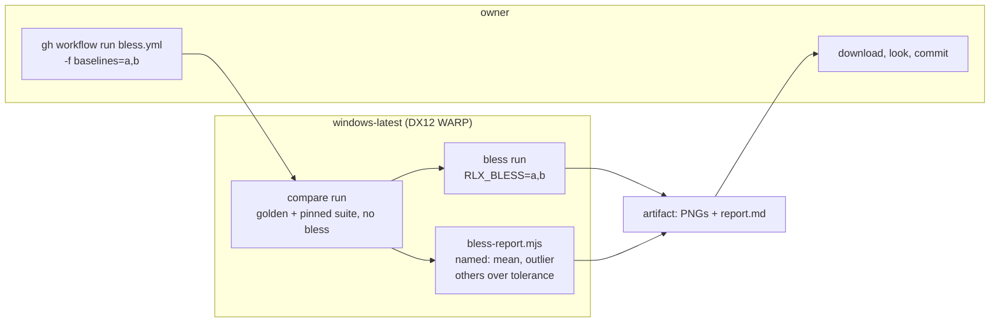

# 0249 — A dispatched CI job blesses the named WARP baselines

> **Status:** done - Phase 3 owed, ADR-0249. Closed 2026-10-06 by a conductor close: Phases 1-2
> landed in `b88d3fc2` and `74fc0b4f`; the round 1 review found no blockers, no majors, two minors
> and a nit (the docs minor and the nit repaired in `c3d62809`). Version: none (test harness, a
> dispatch-only workflow, a script and docs; nothing a release archive carries).
> **Created:** 2026-10-06
> **Owner skill(s):** dev, human
> **Related ADRs:** [ADR-0264](../../adrs/0264-a-warp-baseline-is-blessed-by-a-dispatched-ci-job-until-the-reference-moves-to-lavapipe.md)
> (accepted), [ADR-0242](../../adrs/0242-the-software-reference-rasterizer-is-lavapipe-and-a-warp-claim-is-re-measured.md),
> [ADR-0249](../../adrs/0249-a-human-phase-may-be-owed-after-the-merge.md)
> **Retired by:** [Plan 0218](../0218-the-reference-machine-becomes-arch.md) Phase 2, which moves the
> reference to lavapipe. Phase 2 of this plan says how the job is removed then.

## TL;DR

A `workflow_dispatch` workflow, `bless.yml`, runs on `windows-latest` (DX12 WARP). It takes a list of
baseline names, compares the golden roster against what is committed, blesses only the named
baselines, and uploads the new PNGs with a report as one artifact. The owner downloads it, looks, and
commits. `RLX_BLESS` learns to take that list, and `RLX_BLESS=1` keeps meaning "all". The first use is
0248's four moved baselines, which turns `main`'s `coverage` job green again.

## Context & problem

`main`'s `coverage` job has been red since v0.164.0. It is the one CI job that compares goldens,
because only Windows has WARP, and four baselines 0248 moved are over tolerance there. The bless is
owed as 0248 Phase 7, and only the Windows box can do it today. 0240 and 0239 will owe the same when
they merge, and 0237's new llvmpipe-written golden has never been compared on WARP at all. ADR-0264
argues the bridge; ADR-0242 and Plan 0218 are the destination.

## Decision

Build ADR-0264's job: blessing by name only, compare before bless, and an artifact a person commits.
We rejected blessing whatever fails, because it blesses regressions unnamed, and committing from CI,
because it gives CI write access for a task that needs a person anyway.

## Architecture diagram

## Implementation phases

### Phase 1 — `RLX_BLESS` takes a list of names
- **Owner skill:** dev
- **What:**
  - `bless_requested` in `core/tests/common/mod.rs` gains the baseline's stem and answers per
    baseline. `RLX_BLESS` unset blesses nothing, `RLX_BLESS=1` blesses every baseline as it does
    today, and any other value is a comma-separated list of stems, blessing exactly those. The
    panic off the blessing adapter is unchanged.
  - The parse is a pure function with its own unit test, covering `1`, a list, whitespace around
    names, and an empty value.
  - A named stem that no test in the run reaches fails the run with the unknown names, so a typo is
    an error rather than a silent no-op. Where that check lives (a summary after the roster, or a
    check of the list against `core/tests/golden/` and the pinned modules' stems) is the
    implementer's call. The log says which, and why it cannot miss a stem from a test that did not
    run.
  - Every caller passes its stem: `core/tests/golden.rs` (both tests) and the pinned modules
    `attractor_trails`, `composite`, `layer`, `line_joints` and `warp_mesh_wide` under
    `core/tests/suite/`.
- **Files touched:** `core/tests/common/mod.rs`, `core/tests/golden.rs`,
  `core/tests/suite/attractor_trails.rs`, `core/tests/suite/composite.rs`,
  `core/tests/suite/layer.rs`, `core/tests/suite/line_joints.rs`,
  `core/tests/suite/warp_mesh_wide.rs`, `docs/testing.md`.
- **Done when:**
  - The parse's unit test passes, and the `-P fast` profile is green.
  - `docs/testing.md`'s bless paragraph states the list form and that `1` still means all.
  - On a non-WARP adapter, `RLX_BLESS=<any value>` still panics with the existing message. The log
    quotes it from a run on the session's adapter.

### Phase 2 — `bless.yml` and its report
- **Owner skill:** dev
- **What:**
  - `.github/workflows/bless.yml`, `workflow_dispatch` only, `permissions: contents: read`, one
    required string input `baselines`. It runs on `windows-latest`, and its toolchain and cache setup
    match `ci.yml`'s `coverage` job.
  - It runs three steps. First a compare run of `cargo nextest run -p rlx-core --test golden --test
    suite --no-fail-fast --no-capture`, without `RLX_BLESS`, with its output kept and its failure
    tolerated. Then the bless run, the same command filtered to the golden and pinned tests, with
    `RLX_BLESS` set to the input. Then the upload.
  - `scripts/bless-report.mjs` reads the compare run's output. It writes `report.md` with one row per
    named baseline (its mean and max outlier against the committed baseline, and the tolerances),
    one row per *other* baseline over tolerance marked "not blessed, still failing", and a line for
    each named baseline it found no comparison for. The report is also appended to
    `$GITHUB_STEP_SUMMARY`.
  - The artifact, `blessed-<run id>`, holds the named PNGs at their repository paths, plus
    `report.md`.
  - The script has a `--self-test` over a fixture of real compare output in
    `scripts/fixtures/bless-report/`, in the shape the other gates use, and `scripts/README.md`
    names it among the exceptions to "every `.mjs` is wired into pre-push or CI": it runs only on
    dispatch.
  - `docs/testing.md` gains the owner's three commands: dispatch with `gh workflow run`, download
    with `gh run download`, and copy into place. It also says the job is retired when Plan 0218
    Phase 2 lands: delete `bless.yml` and `bless-report.mjs`, because the baselines then live on
    lavapipe and Windows skips them.
- **Files touched:** `.github/workflows/bless.yml`, `scripts/bless-report.mjs`,
  `scripts/fixtures/bless-report/`, `scripts/README.md`,
  `docs/testing.md`.
- **Done when:**
  - `node scripts/bless-report.mjs --self-test` passes, and the fixture holds both a named baseline
    over tolerance and an unnamed one.
  - `bless.yml` is valid YAML with a `workflow_dispatch` trigger and no other, checked by a `node`
    one-liner the log quotes.
  - `node scripts/check-doc-links.mjs` and `node scripts/check-reader-prose.mjs` pass.
  - A dispatch is not possible from the session, and the log says so. Phase 3 is the first run.

### Phase 3 — First bless: 0248's four
- **Owner skill:** human
- **Blocks merge:** no
- **What:** after the merge and a push, the owner dispatches `bless.yml` with
  `parametric_lissajous_3d,parametric_torus_knot,waterfall_ramp,waterfall`, reads the report, opens
  the four PNGs, and commits them on `main`. This also settles 0248 Phase 7.
- **Files touched:** `core/tests/golden/parametric_lissajous_3d.png`,
  `core/tests/golden/parametric_torus_knot.png`, `core/tests/golden/waterfall_ramp.png`,
  `core/tests/golden/waterfall.png`.
- **Done when:** `main`'s `coverage` job is green, and 0248's log marks Phase 7 `done`, naming the
  bless run's id.

## Risks & open questions

- **The compare run's output shape is the report's input.** `golden.rs` prints
  `stem mean M (tol T) max_outlier O (tol T)`. The pinned modules may print differently or not at all
  on a pass. The report names what it could not read, rather than guessing, and Phase 2 may make the
  pinned modules' line match `golden.rs`'s if that is a one-line change.
- **WARP on the runner is not WARP on the box.** Both are "DX12 WARP", but they are different Windows
  builds. If the first run's report shows drift on baselines nobody named, that is the finding, and
  it is recorded before anything else is blessed. (Unverified: the coverage job's readings so far
  match the box's baselines within tolerance, which suggests they agree.)
- **`--no-capture` runs the tests serially.** The golden and pinned roster is small, so this is
  probably minutes, but it is not measured.

## What this plan does NOT do

- It does not change where baselines are blessed in principle. ADR-0242 and Plan 0218 do.
- It does not bless anything 0240, 0239 or 0237 moves. Each owes its own dispatch after its merge.
- It does not add the job to any push trigger.

## Implementation log

**Lane:** `plan-0249-a-dispatched-ci-job-blesses-the-named-warp-baselines`, worktree
`/home/igor/Work/rlx-plan-0249`

| phase | owner | state | commit |
|---|---|---|---|
| 1 — `RLX_BLESS` takes a list of names | dev | done | b88d3fc2 |
| 2 — `bless.yml` and its report | dev | done | 74fc0b4f |
| 3 — First bless: 0248's four | human | owed | |

### Notes

- Phase 1, the unknown-name check: `bless_requested` checks each listed stem against
  `core/tests/golden/<stem>.png` on every call, after the adapter check. It reads the directory, not
  the set of tests that ran, so a test filtered out of the run cannot hide a stem; the cost is that a
  baseline with no PNG yet cannot be named and is blessed first with `RLX_BLESS=1` under a filter.
- Phase 1, an empty value (or one of only commas and whitespace) panics as naming no baseline,
  rather than blessing nothing.
- Phase 1, the parse's unit test `rlx_bless_parses_all_or_a_list_of_stems` lives in
  `core/tests/golden.rs`, which `-P fast` excludes; it was run by name and passed.
- Phase 1, the non-WARP refusal, quoted from `RLX_BLESS=waterfall_ramp ... --test golden
  the_waterfall_holds_a_ramped_ring` (and the same from `RLX_BLESS=no_such_stem ... --test suite
  line_joints::`, showing the adapter check precedes the name check): `RLX_BLESS refused: baselines
  are blessed on DX12 WARP only, and this run is on llvmpipe (LLVM 22.1.8, 256 bits) (Vulkan, Cpu),
  driver llvmpipe Mesa 26.2.2-arch1.1 (LLVM 22.1.8)`.
- Phase 2, beyond the phase text: the report also reads the bless run's log (`--bless`, its
  `blessed <path>` lines), lists a named baseline the bless run did not write, and exits 1 for it;
  both test steps tolerate failure, so this is the job's only signal that a bless did not happen. A
  `--check-names` step runs before the build and refuses `1`, a non-stem, or a stem with no committed
  PNG. The bless run's filter names the seven tests that call `bless_requested`.
- Phase 2, the fixture: `compare.log` is real compare output of those seven tests, captured on this
  session's llvmpipe rather than on WARP (the cargo warning lines above `Finished` trimmed).
  `bless.log` is written by hand in the tests' `blessed <path>` shape. The pinned modules already
  print `golden.rs`'s line shape, so none was changed.
- Phase 2, the YAML check: the lane has no Node YAML parser, so the node one-liner checks the
  trigger by reading the top-level `on:` block's keys, and validity was checked with PyYAML. Node
  (exit 0, printed `["workflow_dispatch"]`): `node -e "const t=require('fs').readFileSync('.github/workflows/bless.yml','utf8').split(/\r?\n/);const i=t.indexOf('on:');const keys=[];for(const l of t.slice(i+1)){if(/^\S/.test(l))break;const m=l.match(/^  ([A-Za-z_]+):/);if(m)keys.push(m[1]);}console.log(JSON.stringify(keys));process.exit(i>=0&&keys.length===1&&keys[0]==='workflow_dispatch'?0:1)"`.
  Python (parsed; `on` is `{workflow_dispatch: {inputs: {baselines: ...}}}`, permissions
  `{contents: read}`): `python3 -c "import yaml,json; d=yaml.safe_load(open('.github/workflows/bless.yml')); ..."`.
- Phase 2, a dispatch is not possible from the session: `bless.yml` has never run. Phase 3 is its
  first run.
- Phase 2, the fixture's description is its own `scripts/fixtures/bless-report/README.md`;
  `scripts/fixtures/README.md` is not in the phase's files and does not mention it.

### Close triggers

- **`presets/` touched:** no
- **Plan header `Closes:`** none
- **What shipped:** docs-chore-only for the shipped artifacts: test-harness code under
  `core/tests/`, a dispatch-only workflow, a script and docs; nothing a release archive carries.
- **Operator docs touched:** `docs/testing.md` (Golden baselines), `scripts/README.md`.
- **Backlog probes (`node scripts/check-backlog-claims.mjs`):** exit 0, 58 reductions hold across 29
  live entries (4 unprobeable).
- **Full suite:** owed to the conductor's pre-review gate (ADR-0207). `-P fast` at Phase 1: exit 0,
  1920 passed, 94 skipped.
- **Outstanding `human` phases:** Phase 3 (`Blocks merge: no`) — the first dispatch, after the merge
  and a push.

## Close review

Phase 3 is **owed** (`Blocks merge: no`, ADR-0249) and nothing below checks it: `bless.yml` has never
run, so neither the job nor `bless-report.mjs` has met real WARP output, the four baselines 0248
moved are not re-blessed, and `main`'s `coverage` job stays red on them until the owner dispatches,
reads the report and commits the PNGs.

Close repairs: the `gh workflow run` comment (minor 2) and the blockquote wrap (the nit) in
`c3d62809`. Minor 1 stays open: it is the workflow's command, not prose. No earlier round raised a
finding. Upstream CI on `origin/main` read green at the close (run 36297464014).

Close notes: `presets/` untouched, so no curation verdict is owed. Backlog probes exit 0 (58
reductions, 29 entries). No translated source moved. Version: none, as the review allowed: the
plan changed test harness, a dispatch-only workflow, a script and docs, and nothing a release
archive carries.

### Round 1 review, in full

Graded at tip `7a3aebf08a3ed13b623d871a610b87f0013d787a` (tree `f9c31af9`), lane
`plan-0249-a-dispatched-ci-job-blesses-the-named-warp-baselines`.

**Verdict: Plan 0249 landed cleanly. No blockers, no majors, two minors and one nit.** Phases 1 and 2
are built as the plan says. Phase 3 is a `human` phase with `Blocks merge: no` and stays `owed`.

#### Evidence

- **Full suite.** `node .../with-lock.mjs suite -- cargo nextest run --workspace` printed the ledger
  record instead of running: `with-lock: skipped cargo nextest run --workspace: tree f9c31af is green
  in the suite ledger, run by gate 0249-pre-review-after-repair-1 at 2026-10-06T14:06:18.688Z: 2006
  tests run: 2006 passed (17 slow), 8 skipped`. `git rev-parse HEAD^{tree}` is `f9c31af9...`, so the
  record covers this tip.
- `RUSTDOCFLAGS="-D warnings" cargo doc --workspace --no-deps`: clean.
- `cargo fmt --all --check`: clean. `cargo clippy --workspace --all-targets -- -D warnings`: clean.
- `node scripts/bless-report.mjs --self-test`: `33 of 33`.
- `node scripts/check-doc-links.mjs`: OK. `node scripts/check-reader-prose.mjs`: OK.
  `node scripts/check-comment-hygiene.mjs`: OK.
- `node --test tools/conductor/test/settings.test.mjs`: 153 pass. That includes the two new
  `RLX_BLESS` cases and "every rule in settings.conductor.json is exercised".
- `node scripts/bless-report.mjs --check-names parametric_lissajous_3d,parametric_torus_knot,waterfall_ramp,waterfall`:
  accepts all four of Phase 3's names. Each has a committed PNG.

#### Lens 1 — alignment

- **Owner tags.** One per phase, all in the vocabulary (`dev`, `dev`, `human`). Phase 3 carries
  `Blocks merge: no`, no later phase reads its output, and its log row reads `owed`. That is correct
  under ADR-0249.
- **Phase 1.** `bless_requested(renderer, stem)` in `core/tests/common/mod.rs` answers per baseline.
  The parse is the pure `parse_bless`, returning `BlessList::{All, Stems}`. Unset blesses nothing,
  `1` blesses all, and any other value is a trimmed comma list. A value naming nothing is an `Err`,
  and the log records that choice. The adapter panic still comes first, word for word as before.
  The unknown-name check reads `core/tests/golden/<stem>.png`, so a filtered-out test cannot hide a
  stem; the log states that choice and its cost.
  - Every caller passes its stem: both tests in `golden.rs` and all five pinned modules. In
    `golden.rs`, `composite.rs` and `layer.rs` the call moved inside the roster loop.
    `layer.rs`'s local `golden_dir` is the same `CARGO_MANIFEST_DIR/tests/golden` that
    `common::golden_dir()` reads, so the directory check holds for its stems.
  - Unnamed baselines are still compared and still fail the run, which is what lets the compare run
    and the bless run share one roster.
  - `rlx_bless_parses_all_or_a_list_of_stems` asserts what the done-when asks: `1` and ` 1 `, a
    list, whitespace and empty entries, the empty value, whole-stem matching (`waterfall` does not
    cover `waterfall_ramp`), and `1` inside a list read as a stem. No assertion is tautological.
    It ran inside the green full suite.
  - The non-WARP refusal is quoted in the log from a llvmpipe run.
  - `docs/testing.md` states the list form and that `1` still means all.
- **Phase 2.**
  - `bless.yml` has `workflow_dispatch` only, `permissions: contents: read`, and one required
    string input. It runs on `windows-latest` with `coverage`'s setup (rust-cache and nextest, no
    pinned toolchain). The steps are: name check, compare run (failure tolerated), bless run with
    `-E "$PINNED"` naming all seven callers, report, upload `blessed-${{ github.run_id }}`.
  - The input reaches the shell through `env:` and is never spliced into the script, so it cannot
    inject a command.
  - `bless-report.mjs` writes one row per named baseline, one row per unnamed baseline over
    tolerance marked "not blessed, still failing", and one line per named baseline with no
    comparison. It also appends to `$GITHUB_STEP_SUMMARY`.
  - The log records what the script adds beyond the phase text: it reads the bless log and fails
    on a named baseline that was not blessed, and `--check-names` runs before the build.
  - The fixture holds named baselines over tolerance (`waterfall`, `parametric_torus_knot`) and
    unnamed ones over tolerance (six of them), as the done-when requires.
  - `scripts/README.md` lists the script as a fifth kind of exception. `docs/testing.md` carries
    the three owner commands and the retirement once Plan 0218 Phase 2 lands.
  - The YAML done-when is met with the `node` one-liner quoted in the log.
- **Outside the plan's files.** `7a3aebf0` adds two cases to `tools/conductor/test/settings.test.mjs`.
  The `RLX_BLESS=* cargo *` allow rule reached the lane from `main` with the merge. Without a case
  that exercises it, the file's "every rule is exercised" test fails. The change is a repair the
  merge made necessary, not scope creep. Noted, not a finding.
- **Log.** The log is present, shorter than the phases section, and its claims match the tree.

#### Lens 2 — layering and real-time safety

The plan touches no `core/src`, no C ABI, no control protocol and no audio path. Everything is test
harness, CI and scripts, so this lens has nothing to grade.

#### Lens 3 — docs and bookkeeping (owed by the close)

- ADR-0264 is `proposed`; the close accepts it and refreshes `docs/adrs/README.md`.
- The plan moves to `done/` with `Status: done - Phase 3 owed, ADR-0249`, and the plans index
  bullet names Phase 3 as owed.
- **Version.** The close trigger says docs-chore-only for the shipped artifacts. Nothing a release
  archive carries changed (test harness, a dispatch-only workflow, a script, docs), so a `none`
  bump is defensible. The close makes that call.
- `presets/` was not touched. No `Closes:` header.

#### Lens 4 — correctness

- `readCompare`'s regex is `^(\S+)\s+mean`, anchored to the line start. That keeps
  `batch_independence.rs`'s `name primitive mean ... max_outlier` line from being read as a
  baseline in the unfiltered compare run, because a second token sits before `mean`.
- Both test steps rely on `|| true` under the runner's default `bash -eo pipefail`, and the report
  step's exit is the job's one signal. The upload runs `if: always()`, so `report.md` ships even
  when a named baseline was not blessed.

#### Lens 5 — design integrity

Nothing to flag. The parse and the stem check sit in the shared test helper, every caller is
uniform, and the workflow is the bridge ADR-0264 describes, with its retirement written down.

#### Findings

##### minor — the compare run reaches the whole `suite` binary, serially
`.github/workflows/bless.yml:65`.

- **What.** The compare step runs `cargo nextest run -p rlx-core --test golden --test suite
  --no-fail-fast --no-capture` with no filter. Under `--no-capture`, nextest runs tests one at a
  time. So every dispatch runs all ~320 `rlx-core` golden and suite tests serially on WARP, yet the
  report reads only the seven baseline tests.
- **Why it matters.** It is a cost with no reading behind it. The plan's own risk assumes "the
  golden and pinned roster is small". The fixture README says `compare.log` was "captured ... with
  the bless job's test filter", so what the self-test feeds the script is not what the job runs.
- **Plan provenance.** The plan's Phase 2 text gives the unfiltered command word for word, so this
  is the plan's slip, faithfully built.
- **Fix.** Add `-E "$PINNED"` to the compare run, as the bless run already does.

##### minor — "dispatch on the pushed branch" is wrong for `gh workflow run` without `--ref`
`docs/testing.md:344`.

- **What.** Without `--ref`, `gh workflow run` dispatches on the repository's default branch, not
  on the branch just pushed. The workflow file also has to exist on the default branch before it
  can be dispatched at all.
- **Fix.** Change the comment to `# dispatch on main; add --ref <branch> for another`. This is
  Markdown prose, so the close can repair it.

##### nit — an unwrapped line in the blockquote
`docs/testing.md:593`.

- **What.** The inserted sentence `Naming the baselines instead (RLX_BLESS=a,b) scopes it.` leaves
  that blockquote line about 130 columns wide, against roughly 80 in the rest of the paragraph.
- **Fix.** Rewrap the blockquote.
