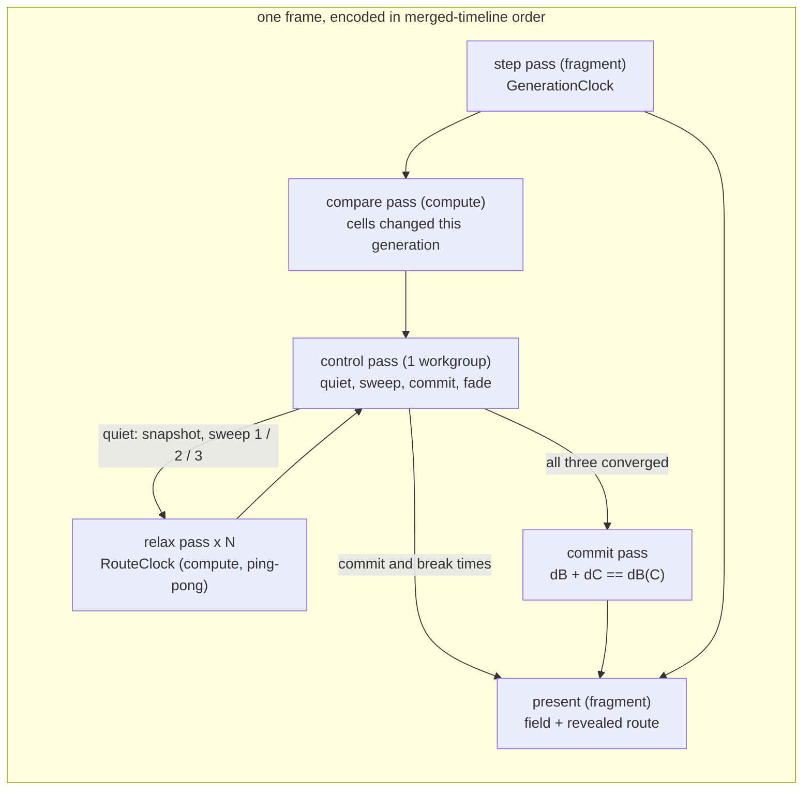

# 0253 — The labyrinth shows its longest path

> **Status:** done - Phase 4 owed, ADR-0249. Phases 1-3 landed in `cca56596`, `1c41e058` and
> `4f466a6a`; conductor close review round 1: no blockers, no majors, two minors and one nit
> repaired in `f371c89b`, one nit under `.claude/` open. ADR-0266 accepted with an Outcome. v0.169.0.
> **Created:** 2026-10-07
> **Owner skill(s):** dev, human
> **Closes:** design-backlog 0274
> **Related ADRs:** [ADR-0266](../../adrs/0266-the-maze-route-is-a-double-sweep-relaxed-on-the-gpu-against-a-frozen-snapshot.md)
> (the route's mechanism and its quiet stretches), ADR-0012 (the ping-pong grid), ADR-0170 (`ParamSpec` declarations),
> ADR-0180 (per-family params), ADR-0058 (unique bind group layouts), ADR-0245 (the per-pass timer),
> ADR-0037 (a grid is a resolution)

## TL;DR

The `cellular` scene learns to find and draw the longest route through the maze it grows, in the
moments the maze stands still. When the open cells stop changing, the GPU freezes a snapshot of
them and three breadth-first sweeps relax against it over many frames. Sweep 1 finds a far end,
sweep 2 the other end, and sweep 3 completes the second field. A commit pass marks every open cell
on a shortest path between the two ends. The route then draws in along its length, end to end,
over `route_reveal` seconds. When a bite or a rule change moves the maze, the route fades out, and
the next quiet stretch finds a new one. It is painted in one palette colour by default, or graded
along the route with `route_grade`. A new `route` param switches it on, and its default of 0 is an
exact identity, so nothing that ships moves. The first visible result is Phase 1's flood: every
reachable corridor shaded by its distance from one cell.

## Context & problem

Backlog 0274: at the Plan 0232 retune the owner asked for `cellular_labyrinth` to print the longest
path through its maze in red. The scene holds a state and an age per cell and colours from those
alone, so the retune could only mark recently changed cells red. At the 2026-10-07 interview the
owner asked for **both** looks, a solid colour by default and an author option to grade it by
distance along the route. On cadence they first chose **every generation**. Shown that a route
chasing a maze that never stops moving trails it by one whole search, they **rethought it the same
day and chose the quiet stretches**: the route builds while the maze stands still, fades when it
moves, and rebuilds, so it reads as discovered.

The labyrinth bites a disc out of its maze on every fourth beat, and loosens its rule for 6 beats in
every 32. Between those events its corridors stand still, or nearly. A one-step-per-pass wavefront
cannot finish in a frame: a tree maze threads up to ~18 000 steps at the labyrinth's 192 grid and
~524 000 at `MAX_GRID`. ADR-0266 works the arithmetic and settles the mechanism. This plan builds it.

## Decision

ADR-0266, built in the order the risk falls. Phase 1 is the walking skeleton: a snapshot and one
relaxed sweep, painted as a graded flood. It proves the relax pass correct against a CPU BFS, and it
takes the two readings the rest of the plan stands on: what a pass costs, and how the labyrinth's
open mask actually changes from one generation to the next. Phase 2 adds quiet detection, the second
and third sweeps, the commit, the reveal and the fade, with the quiet constants set from Phase 1's
change counts. Phase 3 sets the tier budget from Phase 1's pass cost and regenerates the generated
references. Phase 4 is the owner's look, and the content lane binds the route on
`cellular_labyrinth`.

We rejected chasing the moving maze with a stated lag: the owner chose the quiet stretches over it
once it was priced. We rejected a CPU readback, which the owner declined at the interview. We
rejected exact per-generation convergence because its pass count is unbounded at any grid, and a
jump flood because it measures Euclidean distance and a maze is geodesic. ADR-0266 carries all four.

## Architecture diagram



The control pass is the only thing that decides the route's state, and it runs on the GPU. The CPU
encodes passes, hands each one its event's scene time, and never reads the state back.

## Implementation phases

### Phase 1 — A sweep relaxes on the GPU and the flood is visible
- **Owner skill:** dev
- **What:** `[cellular]` gains a route module:
  - a snapshot pass copying the open mask (dead = open, live = wall) into a storage buffer;
  - a compare pass, encoded after every generation's step pass while `route > 0`, counting the cells
    whose open bit differs from the previous generation's into a control buffer;
  - a relax compute pass over a 16x16 tile with a one-cell halo in workgroup memory, ping-ponging two
    `u32` distance buffers, wrapping across the seam when `[cellular] wrap` is on;
  - the one-workgroup control pass that detects a pass with no change;
  - the centre-source rule (the open cell nearest the grid's centre, lowest index on a tie);
  - `RouteClock`, owing relax passes per second over the injected `dt` and merged with
    `GenerationClock` into one time-ordered encode;
  - three params declared the ADR-0170 way: `route` (0..1, default 0), `route_coord` (0..1, default
    0.5) and `route_grade` (-1..1, default 0), wired through `set_param` and `reset_params`.

  For this phase the snapshot is taken whenever the mask differs from the last one, and `route > 0`
  paints every open cell reachable from the source at `route_coord + route_grade * d / d_max`, where
  `d_max` is the field's largest finite distance. The route resources are built lazily on the first
  frame with `route > 0`, rebuilt with the grid, and never per frame. With `route = 0` no route pass
  is encoded and the present's output is unchanged. A test-only CPU BFS joins `mirror.rs`. Every
  relax, compare and control pass is encoded through `gpu::compute_pass`, so the ADR-0245 timer sees
  it, under the labels `cellular-route-relax`, `cellular-route-compare` and
  `cellular-route-control`. In this phase the pass rate is a constant in the route module. Phase 3
  moves it to the tier.
- **Files touched:**
  - `core/src/render/scenes/cellular/mod.rs`, plus a new `core/src/render/scenes/cellular/route.rs`
    (resources, clock, encode)
  - `core/src/render/scenes/cellular/shader.rs` (relax, compare, control and snapshot WGSL, and the
    present's route read)
  - `core/src/render/scenes/cellular/mirror.rs` (the CPU BFS and change count)
  - `core/src/render/scenes/cellular/tests.rs`
  - `docs/plans/0253-the-labyrinth-shows-its-longest-path.md` (the log's readings)
- **Done when:**
  - On a planted maze, the converged GPU distance field equals the CPU BFS's cell for cell, on a
    torus and on a bordered grid.
  - A wall cell and a cell unreachable from the source hold the sentinel.
  - A sweep converges and then stays put: further passes change no cell.
  - The compare pass's count equals the CPU mirror's count of changed open bits for the same pair of
    generations.
  - Driving the same seed and `dt` sequence at 30 and 144 fps reaches the identical distance field
    at the same wall time.
  - With `route = 0`, the rendered frame is byte-identical to the same scene before this phase.
  - `cargo nextest run -p rlx-core --lib cellular` passes.
  - `cargo nextest run -p rlx-core --test suite preset::declared_params_match_set_param` passes.
  - The implementation log records three readings, each naming its adapter:
    - the GPU time of one `cellular-route-relax` pass at grids 192, 512 and 1024, from the ADR-0245
      per-pass timer on the reference laptop's integrated adapter;
    - how many passes sweep 1 took to converge on `cellular_labyrinth`'s grown maze, from its own
      seed, at generation 600;
    - the labyrinth's per-generation changed-cell counts over at least 64 beats of a driven run
      (its own preset, a fixed beat at 120 bpm): the counts between bites and the first counts after
      a bite and after a rule change, and the lengths in seconds of its still stretches. If the
      maze is never exactly still between bites, the log says so and gives the flicker's size.

### Phase 2 — Quiet stretches find, reveal and fade the route
- **Owner skill:** dev
- **What:** Build the route's life as ADR-0266 describes.
  - **Quiet:** `QUIET_TOLERANCE` (a fraction of the open cells) and `QUIET_HOLD` (consecutive still
    generations) become constants in `route.rs`, set from Phase 1's change counts so the
    labyrinth's still stretches read quiet and the first generation after a bite or a rule change
    does not. Their doc comments carry the property and cite this plan's Phase 1 reading.
  - **Epoch:** the first quiet generation takes the snapshot and starts sweep 1. A generation that
    is not still abandons an in-flight epoch without committing it. Phase 1's every-change snapshot
    rule is removed.
  - **Sweeps:** the control pass advances idle, sweep 1, sweep 2, sweep 3, commit, shown, fading.
    The farthest cell is found by two reductions, the largest finite distance and then the lowest
    index at it. Sweep 2's field is kept as `dB`, and sweep 3 writes `dC`.
  - **Commit:** the commit pass writes `t = dB(x) / dB(C)` for each open cell with
    `dB(x) + dC(x) == dB(C)`, and the sentinel elsewhere, into a committed-route buffer the present
    binds. After a commit no relax pass is encoded until the quiet breaks and returns.
  - **Source:** an epoch starts from the previous route's end C if that cell is still open, and from
    the centre rule otherwise.
  - **Times:** each compare and control pass is handed its own event's scene time (the sum of
    injected `dt`, as `u32` milliseconds since configure). The control pass stamps the commit and
    the quiet's break with them.
  - **Reveal:** a fourth param, `route_reveal` (seconds, 0..10), declared the ADR-0170 way. The
    present paints a committed route cell once `(now - commit) / route_reveal` passes its `t`, with
    an eased leading edge; `route_reveal = 0` paints the whole route at once.
  - **Fade:** from the break, the route's strength eases to zero over `route_reveal / 4` by a
    smoothstep in time, and the control pass then clears it.
  - **Present:** paints a shown route cell at `route_coord + route_grade * t`, mixed over the cell's
    own colour by `route` times the reveal and fade, with light at least that product. It paints
    nothing on a route cell that is live now.
  - **Phase 1's flood** is replaced by the route.
  - **Cyclic:** a `cyclic` preset encodes no route pass at any `route`.
  - **Mirror:** the CPU quiet test, double sweep and commit join `mirror.rs`.
- **Files touched:**
  - `core/src/render/scenes/cellular/route.rs`, `mod.rs`, `shader.rs`, `mirror.rs`, `tests.rs`
- **Done when:**
  - On a planted **tree** maze held still, the committed route is exactly the CPU mirror's
    double-sweep path, and its length equals the maze's diameter, which the test computes by brute
    force over all pairs.
  - On a planted maze **with a loop** of two equal-length branches, the committed route equals the
    CPU mirror's commit cell for cell, including both branches.
  - A planted maze whose mask changes on every generation never commits a route.
  - A stamp landing mid-epoch abandons the epoch: nothing commits from the abandoned snapshot, and
    the next quiet stretch commits the route for the new snapshot.
  - After a stamp breaks the quiet over a shown route, no frame paints route colour on a live cell,
    and once `route_reveal / 4` seconds of scene time have passed no frame paints route colour at
    all.
  - With `route_reveal = 2`, a frame one second after the commit paints the route cells with
    `t <= 0.5` outside the leading edge and none with `t` past the edge, and a frame two seconds
    after paints all of them.
  - 30 and 144 fps reach the identical committed route, the same reveal front at the same wall
    time, and the same fade.
  - A standing maze encodes no relax pass after its commit; a test reads a pass counter on the
    scene.
  - `route_grade = 0` paints every route cell the same colour, and a nonzero grade paints the two
    ends at `route_coord` and `route_coord + route_grade`.
  - `cargo nextest run -p rlx-core --lib cellular` passes.
  - `cargo nextest run -p rlx-core --test suite preset::declared_params_match_set_param` passes.

### Phase 3 — The budget belongs to the tier and the references are regenerated
- **Owner skill:** dev
- **What:**
  - **Tier field:** `TierConfig` gains `cellular_route_rate`, in relax passes per second, set for
    Floor and Rich from Phase 1's reading. The rule: at the tier's own `cellular_grid` cap and a
    60 Hz frame, the route's relax passes cost no more GPU time per frame than the
    `MAX_GENERATIONS_PER_FRAME` step passes on the same grid. The scene takes the rate at
    construction, as it takes `cellular_grid`.
  - **Per-family table:** the four params join `FAMILY_PARAMS` as inert on `cyclic`.
  - **Generated files:** the parameter reference block, the per-system schemas and `.taplo.toml`
    are regenerated.
  - **Memory:** the route's memory joins `docs/nfr.md`'s cellular figure: six `u32` per cell, about
    24 MB at 1024, built only when `route > 0`.
- **Files touched:**
  - `core/src/render/tier.rs`, `core/src/render/scenes/cellular/mod.rs`, `route.rs`
  - the renderer site that constructs `CellularScene` with the tier's caps (under
    `core/src/render/`)
  - `core/tests/suite/cellular.rs`
  - `presets/README.md` (the generated block), `presets/schema/*.json`, `.taplo.toml`
  - `docs/nfr.md`
- **Done when:**
  - A test in `core/tests/suite/cellular.rs` shows a Floor and a Rich renderer each handing its own
    `cellular_route_rate` to the scene.
  - The log states the rule's arithmetic for each tier, the measured pass cost against the measured
    step cost, with the reading's adapter named.
  - The log states, from Phase 1's readings and the Floor rate, how long an epoch takes on the
    labyrinth's grown maze against the length of its still stretches, and whether one fits inside
    the other. It is a reading, not a gate: Phase 4 judges what it means.
  - `cargo nextest run -p rlx-core --test suite preset_schema::` passes with no update variable set.
  - `cargo nextest run -p rlx-core --test suite the_parameter_reference_block_is_current` passes
    with no update variable set.
  - `cargo nextest run -p rlx-core --test golden` passes with `RLX_BLESS` unset, so no shipped
    preset moved.
  - `cargo run -q -p standalone --bin ritmolux -- --check presets --strict` exits 0.

### Phase 4 — The owner sees the route on the labyrinth
- **Owner skill:** human
- **Blocks merge:** no
- **What:** The owner, with a `preset-author` session, binds `route` on `cellular_labyrinth`. The
  route is red by default, a red stop at `route_coord`, and the owner judges the solid and graded
  looks and the reveal live, through several bites and a loosening window. The preset change lands
  on `main` through the content lane (ADR-0081). If the route shows too rarely, the forks on loops
  or the component the route settles in read wrong, the verdict files a backlog entry against
  ADR-0266's Notes rather than editing this plan.
- **Files touched:** `presets/cellular_labyrinth.toml`, or a `presets/proposed/` draft and its
  roster row
- **Done when:** the verdict is written in this plan's log as keep, tune or no, with the route mode
  and `route_reveal` the owner chose.

## Data shapes

```rust
// illustrative — not the final interface
/// Owes relax passes per second over injected `dt`, as `GenerationClock` owes
/// generations; merged with it so a frame encodes both in time order.
pub(crate) struct RouteClock { owed: f64 }

/// The GPU-side route state, one small storage buffer the control pass owns.
#[repr(C)]
struct RouteControl {
    state: u32,      // 0 idle, 1-3 sweep, 4 commit, 5 shown, 6 fading
    moved: u32,      // cells whose open bit changed this generation (atomic)
    still_run: u32,  // consecutive still generations
    changed: u32,    // tiles changed by the last relax pass (atomic)
    source: u32,     // this sweep's start cell index
    far_dist: u32,   // reduction: largest finite distance (atomic max)
    far_index: u32,  // reduction: lowest index at it (atomic min)
    end_c: u32,      // the committed route's C, the next epoch's source
    length: u32,     // dB(C), the commit's denominator
    commit_ms: u32,  // scene time of the commit
    break_ms: u32,   // scene time the quiet broke, starting the fade
}
// Per cell, u32 each: previous mask, snapshot, dist_a, dist_b (ping-pong), d_b (kept),
// route (t as unorm or sentinel).
```

## Risks & open questions

- **The quiet stretches may be shorter than an epoch.** If the labyrinth's grown maze needs more
  passes than a still stretch between bites holds at the Floor rate, the route rarely shows. Phase 1
  measures both, and Phase 3's log sets them side by side before the owner judges. The remedies are
  ADR-0266's coarse-to-fine note or a preset that bites less often, each its own change.
- **The maze may flicker.** If `B3/S12345` leaves small oscillators standing between bites, a zero
  tolerance never reads quiet. Phase 1's change counts decide the tolerance; a flicker that cannot
  be told from a bite by count alone is a stop condition for Phase 2, recorded in the log, not a
  constant guessed past.
- **Merged-clock encode on the render path** must not allocate. The frame's events are generated in
  time order by stepping two accumulators, never collected and sorted.
- **Determinism hinges on ping-pong and on event times.** An in-place `atomicMin` relax would
  converge in fewer passes, but on a scheduling-dependent frame, which breaks the 30-against-144
  test. Stamping the commit with the frame's time rather than the event's would make the reveal
  depend on the frame rate. Do not "optimise" into either.
- **WARP's bind group confusion** (`StepParams` docs). The route passes share one storage buffer set
  and select behaviour by compiled constants, as the step passes do. A WARP-only failure is read
  against that note before anything else.
- **Forked routes on loops** are a property of the membership test, not a bug. Phase 4 judges them.
- **Timestamp slots.** Many relax and compare passes a frame share labels and so timer rows, but
  each still claims a slot. If the timer's query set is sized below a frame's pass count, the phase
  widens it or times a representative pass only, and says which in the log.

## What this plan does NOT do

- No true longest simple path (NP-hard); the route is the double sweep's longest shortest path.
- No route that tracks a moving maze: a route exists only inside a quiet stretch.
- No quiet tolerance or hold as a param; both are constants measured on the labyrinth.
- No single-line tie-break on loops (ADR-0266 Notes), and no coarse-to-fine acceleration.
- No route for `cyclic`, and no route in any other scene.
- No new colour type: the route's colour is a palette coordinate.
- No CPU readback of any route state.

## Implementation log

**Lane:** branch `plan-0253-the-labyrinth-shows-its-longest-path`, worktree
`/home/igor/Work/rlx-plan-0253`

| phase | owner | state | commit |
|---|---|---|---|
| 1 — A sweep relaxes on the GPU and the flood is visible | dev | done | cca56596 |
| 2 — Quiet stretches find, reveal and fade the route | dev | done | 1c41e058 |
| 3 — The budget belongs to the tier and the references are regenerated | dev | done | 4f466a6a |
| 4 — The owner sees the route on the labyrinth | human | owed | |

### Notes

- **Phase 1, the readings.** All three come from the ignored probe `route_readings` in
  `core/src/render/scenes/cellular/tests.rs`
  (`cargo nextest run -p rlx-core --lib --run-ignored only --no-capture route_readings`), taken
  2026-10-07 on the reference laptop.
  - **Pass cost**, ADR-0245 per-pass timer, 60 timed frames of 16 relax passes each on a frozen
    seeded field, and of 8 generations each for the step:

    | adapter | grid | relax pass | its control pass | step pass (one generation) |
    |---|---|---|---|---|
    | AMD Radeon Graphics (RADV RENOIR), integrated, Mesa 26.2.2 | 192 | 0.0400 ms | 0.0013 ms | 0.0138 ms |
    | | 512 | 0.2150 ms | 0.0012 ms | 0.1062 ms |
    | | 1024 | 0.8154 ms | 0.0012 ms | 0.3268 ms |
    | NVIDIA GeForce RTX 3080 Laptop GPU, discrete, driver 610.57.04 | 192 | 0.0304 ms | 0.0040 ms | 0.0079 ms |
    | | 512 | 0.0891 ms | 0.0038 ms | 0.0251 ms |
    | | 1024 | 0.2691 ms | 0.0037 ms | 0.0979 ms |
  - **Sweep 1 on the grown maze** (`cellular_labyrinth`'s grid and salt, generation 600, then held
    by a frozen rule), on llvmpipe (Mesa 26.2.2, LLVM 22.1.8): from the centre rule's source it
    converged in **3 passes**, reaching 19 of 17 432 open cells, farthest 10. The open cells of that
    maze are **2 881 four-connected components**: 2 433 of 1-9 cells, 443 of 10-99, 5 of 100-999,
    none of 1 000 or more; the largest holds 142. A sweep started (by writing the control words) on
    that component's cell nearest the centre converged in **6 passes**, farthest 53, and matched
    the CPU BFS.
  - **Change counts**, same adapter: 32 beats of warm-up, then 72 beats at 120 bpm with the counts
    read off the compare pass. The maze is **never exactly still between bites**: from about 0.6 s
    after a bite to the next one, every generation changes 4 to 24 open bits (a steady level per
    bite interval: 4, 8, 12, 16, 20 or 24, held unchanged generation to generation). The first
    generation after a bite changes 2 327 to 3 782; the counts then fall over 7-8 generations
    (e.g. 2 423, 789, 471, 297, 142, 75, 40, 23). The rule's return to S12345 (beats 6 of 32) gives
    a first count of 68 and 123 in the two windows read, then 26, 19, 14 and 69, 38, 23. The
    loosened window itself never falls below 84. So there are **no still stretches at a tolerance of
    zero**; at the flicker's ceiling the standing stretches run from about 0.6 s after a bite to the
    next bite, about 1.4 s, in the 12 of the 18 bite intervals read that a loosened window does
    not touch.
- **Phase 1, the labyrinth's bindings in the probe** were emulated at the scene, not evaluated by
  the preset engine: every band at zero (so `step_rate` 14), beat `k` on the frame holding `k / 2`
  seconds with `beat_index` reading `k` until the next, `reseed` on beats `k % 4 == 0`, and
  `survive` 30 on beats `k % 32 < 6`. The grid, wrap and salt are read from
  `presets/cellular_labyrinth.toml`.
- **Phase 1, the passes.** The snapshot is not a pass of its own: one indirect `work` pass carries
  every grid action the control words name (snapshot, the two-stage index search, relax), and is
  labelled `cellular-route-relax` whatever it does, so that timer row includes the snapshot and
  index passes. Its workgroup count is written by the control pass, so an idle route dispatches
  nothing. In this phase a converged sweep keeps relaxing, each pass changing nothing.
- **Phase 1, `route = 0` byte-identity** is tested inside the phase
  (`route_zero_draws_the_frame_unchanged`: a scene that never turns the route on against one that
  turns it on and off), not against a build from before it; the present's WGSL for `route = 0` is
  the old text split into two constants and concatenated.
- **Phase 2, the constants.** `QUIET_TOLERANCE` is `1/512` of the open cells (34 at the
  labyrinth's ~17 400) and `QUIET_HOLD` is 4 generations. `route_reveal` defaults to 1 s, in the
  Motion group; the plan named its range only. The reveal's leading edge is `REVEAL_EDGE = 0.08`
  of `t`, the front running to `1 + REVEAL_EDGE` so a cell at `t = 1` is wholly in at
  `route_reveal` seconds. The fade's length reaches the control pass in each event's uniform slot.
- **Phase 2, "encodes no relax pass after its commit".** The CPU cannot know the commit without
  reading the state back, so it still encodes a `work` pass for every route pass owed; after a
  commit the control pass has written a zero workgroup count, so the indirect dispatch runs
  nothing. `a_standing_maze_relaxes_nothing_after_its_commit` reads the GPU's own relax-pass
  counter and the dispatch words, not a CPU counter on the scene.
- **Phase 2, the Phase 1 tests** were reworked for the quiet stretches: the BFS test now holds
  the kept `d_B` and the last `d_C` against the CPU after a commit, the 30-against-144 test drives a
  committed, revealed, stamped and fading route, and the `route = 0` test plants a frozen maze.
- **Phase 2, the probe** (`route_readings`) now measures epochs. Its pass-cost section restarts a
  fresh sweep before each timed frame (8 passes a frame, asserted all to relax). Re-run on Phase 2's
  code the integrated adapter read higher than in Phase 1 — relax 0.0629 / 0.2724 / 0.9047 ms and
  step 0.0289 / 0.1666 / 0.4440 ms at 192 / 512 / 1024 — while the discrete adapter repeated
  Phase 1 to within 10 %. The epoch readings, on llvmpipe: at generation 600 the centre rule's epoch
  took **14 work passes** for a route 16 long; forced into the largest component, **24 passes** for
  a route 79 long, matching the CPU. Over 72 driven beats with the route on, at 60, 120 and 240
  passes/s alike: **22 commits, 0 abandoned**, last epoch 18 passes, and a route drawn (not
  fading) in 455, 498 and 517 of 1 080 frames.
- **Phase 3, the rule's arithmetic**, from Phase 1's integrated-adapter reading (AMD Radeon
  Graphics, RADV RENOIR, Mesa 26.2.2):
  - `Floor`, grid 512: 8 step passes cost 8 x 0.1062 = 0.850 ms a frame; a relax pass costs
    0.2150 ms, so 3.95 of them fit, and 3.95 x 60 = **237 passes/s** (0.849 ms a frame).
  - `Rich`, grid 1024: 8 x 0.3268 = 2.614 ms; a relax pass 0.8154 ms, 3.21 a frame, **192
    passes/s** (2.609 ms a frame).
  - The control pass after each relax pass (0.0012-0.0013 ms) is outside the rule and adds about
    0.6 % at `Floor`. Phase 2's re-run of the same probe on the same adapter read higher step and
    relax costs (above), from which the rule would give 293 and 235.
- **Phase 3, an epoch against a still stretch.** At `Floor`'s 237 passes/s the labyrinth's
  measured epochs — 14 work passes from the centre rule at generation 600, 24 forced into the
  largest component, 18 on the driven run — take 0.06 s, 0.10 s and 0.08 s. Phase 1's standing
  stretch runs about 1.4 s from 0.6 s after a bite to the next, of which the 4-generation hold takes
  0.29 s: an epoch fits inside the stretch about ten times over. The route it finds is short (16 to
  79 steps), because the maze's open cells are 2 881 separate four-connected pockets, the largest
  142 cells.
- **Phase 3, the timer's query set** was not widened: at 237 passes/s a 30 fps frame encodes 8
  route passes, 16 timed passes with their control passes, beside at most 16 for generations;
  `MAX_TIMED_PASSES` is 256.
- **Phase 3, outside the file list:** `core/src/render/scenes/cellular/tests.rs`, because
  `CellularScene::new` gained the rate argument (its two call sites, and a test-local
  `ROUTE_RATE` of 240 replacing the route module's constant); and `docs/specs/player-schema.json`
  and `presets/preset.schema.json`, regenerated with the per-system schemas. `.taplo.toml` did not
  change on regeneration.
- **Phase 3, `docs/nfr.md`** had no cellular figure for the route to join; a new bullet in §12
  states the automaton's 16 MB and the route's 24 bytes a cell.
- **Phase 3, the tier test** (`each_tier_hands_the_scene_its_own_route_rate`) is behavioural: it
  times the frame a frozen 256-grid maze's route first draws on each tier and holds the ratio of
  the two searches to the ratio of the rates (read 1.211 against 1.234, tolerance 0.08). It counts
  the search from the fifth generation, which is where `QUIET_HOLD = 4` puts the quiet.
- **Phase 3, the preset check** was run as `cargo run -q -p standalone --bin ritmolux -- --check
  presets --strict` (exit 0, 93 files, 0 errors, 0 warnings): `--check` takes its path as its
  value, so the plan's `--check --strict presets` reads `--strict` as the path and exits 2.

### Close triggers

- **`presets/` touched:** yes, generated files only — `presets/README.md` (the parameter reference
  block), `presets/preset.schema.json`, `presets/schema/cellular.schema.json`. No preset `.toml`.
- **Plan header `Closes:`** design-backlog 0274.
- **What shipped:** feature.
- **Operator docs touched:** `presets/README.md` params block, `presets/schema/cellular.schema.json`
  and `presets/preset.schema.json` (regenerated; `.taplo.toml` unchanged on regeneration),
  `docs/specs/player-schema.json` (regenerated), `docs/nfr.md`.
- **Backlog probes (`node scripts/check-backlog-claims.mjs`):** exit 0; no entry named (31
  advisory moved-path notices).
- **Full suite:** owed to the conductor's pre-review gate (ADR-0207). Run at Phase 3 under its own
  done-when: `cargo nextest run -p rlx-core --test golden` (exit 0, 5 passed, 0 skipped).
- **Outstanding `human` phases:** Phase 4 (`Blocks merge: no`).

## Close review

The conductor's round-1 review, in full (its headings one level down), graded at tip `34e2b006`.
No earlier round raised a finding, so there are no fix-round lines. The close repaired m1, m2 and n1
in `f371c89b`; n2 is under `.claude/` and stays open for the owner, who applies the paragraph it
names. **Phase 4 is owed** (ADR-0249): it has not yet checked whether a 16-79-cell route inside one
pocket of the labyrinth reads as "the longest path" at all, nor how the solid, graded and reveal
looks read live through bites and a loosening window.

### Plan 0253 — close review, round 1

Graded at tip `34e2b00632b477a9107a574efaed0fdcf4cbd923` (tree `22ac0bd`), lane
`/home/igor/Work/rlx-plan-0253` on `plan-0253-the-labyrinth-shows-its-longest-path`.

**Verdict: Plan 0253 landed cleanly. No blockers, no majors, two minors and two nits.** All four are
documentation. The route works as ADR-0266 describes it. The GPU double sweep matches the CPU mirror
on a tree and on a loop. The control state stays on the GPU. The encode allocates nothing.
`route = 0` is an identity, and the goldens confirm it.

#### Evidence

- **Full suite (lens 1).** Run as
  `node "/home/igor/Work/Ritmolux/tools/conductor/with-lock.mjs" suite -- cargo nextest run --workspace`.
  The wrapper printed the ledger record instead of re-running:
  `with-lock: skipped cargo nextest run --workspace: tree 22ac0bd is green in the suite ledger, run by gate 0253-pre-review at 2026-10-07T13:58:40.849Z: 2038 tests run: 2038 passed (11 slow), 9 skipped`.
  `git rev-parse HEAD^{tree}` is `22ac0bd5660f…`, so that record covers this tip.
- **`RUSTDOCFLAGS="-D warnings" cargo doc --workspace --no-deps`**: clean.
- **`node scripts/check-comment-hygiene.mjs`**: OK, with no escapes in use.
- **Owner tags**: four phases, each with a single in-vocabulary tag (`dev`, `dev`, `dev`, `human`).
  `Blocks merge: no` appears only on the `human` Phase 4, and no later phase reads that phase.

#### Lens 1 — alignment

The phase-to-commit table matches the history: Phase 1 `cca56596`, Phase 2 `1c41e058` and
Phase 3 `4f466a6a`. Phase 4 is `owed`. I read the test for each done-when and checked its
assertions:

- Phase 1: `converged_sweeps_are_the_cpu_breadth_first_searches` (torus and bordered, sentinel on
  walls and unreachable cells), `the_compare_count_is_the_cpu_change_count`,
  `thirty_and_one_hundred_forty_four_fps_reach_the_same_route`, `route_zero_draws_the_frame_unchanged`.
  The log reports the three readings, each naming its adapter. Pass cost is from RADV RENOIR and an
  RTX 3080 Laptop GPU; sweep convergence and change counts are from llvmpipe.
- Phase 2: `on_a_tree_maze_the_route_is_the_diameter` (brute-force diameter),
  `on_a_loop_the_route_takes_both_equal_branches`, `a_maze_that_never_stands_still_never_commits`,
  `a_stamp_mid_epoch_abandons_it_and_the_next_quiet_commits_the_new_maze`,
  `a_broken_route_fades_and_never_paints_a_wall`, `the_route_reveals_along_its_length` (the front at
  1 s and the whole route at 2 s with `route_reveal = 2`), `route_grade_paints_the_ends_at_their_coordinates`
  (one colour at grade 0, and the ends at `route_coord` and `route_coord + grade`),
  `cyclic_runs_no_route`, `a_standing_maze_relaxes_nothing_after_its_commit`.
- Phase 3: `each_tier_hands_the_scene_its_own_route_rate` in `core/tests/suite/cellular.rs`. It
  checks behaviour rather than a field: it compares the frame at which the route first commits on
  each tier, and holds the ratio of the two search times to the ratio of the tiers' rates. The pass
  count is deterministic and the clock integrates over `dt`, so the 0.08 tolerance stands for about
  one frame of quantization over an ~18-frame search, not for adapter noise. The log works through
  the rule's arithmetic and reports the epoch against the still stretch.

**Deviations, logged and accepted.**
- Phase 2 promised that a standing maze "encodes no relax pass after its commit" and that a test
  would read "a pass counter on the scene". After a commit the CPU still encodes the work pass, but
  the control pass has written a zero indirect workgroup count, so the pass dispatches nothing. The
  test reads the GPU's own relax counter. This is the only implementation the plan's no-readback
  rule allows, and the plan's wording was wrong to ask for more.
- Phase 1's byte-identity is tested within the phase, not against a build from before it. The
  `route = 0` present shader is the old text, concatenated, and the golden suite passes with
  `RLX_BLESS` unset.

#### Lens 2 — layering and real-time safety

There is nothing source-specific in `core/` and no raw backend call. The C ABI and the control
protocol do not change. On the render path, `Timeline` is an iterator over two `Ticks`, never
collected. The per-frame event slots are written into a staging `Vec` sized at build and uploaded
once. WGSL text is formatted only in `RouteResources::build`. `route.rs` carries the hot-path deny
pragma, and the hygiene guard scans all of `render/scenes/` recursively. The route's passes share
one storage-buffer set and choose their behaviour by entry point or control word, never by a
uniform field, which follows the `StepParams` WARP note.

#### Lens 3 — docs and bookkeeping

The generated parameter block and the schemas were regenerated, and `.taplo.toml` did not change.
`docs/nfr.md` gained a cellular memory bullet; see finding m1. No preset `.toml` changed.

**What the close owes:**
- the plan to `done - Phase 4 owed, ADR-0249` and `git mv` to `done/`, with links re-pointed;
- ADR-0266 `proposed → accepted`, with the dated Outcome in m2;
- backlog 0274: a CLOSED marker and the row moved from Promoted to Closed in the archive;
- the plans index, carrying "Phase 4 owed";
- **a minor version bump** for a feature plan, plus the studio's two version copies.

Curation needs little: the only `presets/` files touched are generated, so there is no new content
to curate. The plan fixed no engine defect, so the grep for stale workarounds owes nothing.

#### Lens 4 — correctness and determinism

- Relaxation is Jacobi: it reads one half of the pair, writes the other, and holds the halo at the
  read values. A pass that changes no tile is a true fixed point, so `changed == 0` really means
  convergence, and the reduction's `far` is the field's maximum. The parity flip before
  `find_index` means `d_B` is copied from the half the last pass wrote.
- The quiet test, `moved * 512 <= open`, stays inside `u32` up to `MAX_GRID`. `C_STILL_RUN` is
  saturated, so a standing maze starts exactly one epoch. A not-still generation abandons the epoch
  and flips `SHOWN_ON` to `FADING`, stamped with the event's own time rather than the frame's.
- The generation clock's `Ticks` are built from the same `applied_step_rate` and `owed` that
  `GenerationClock::advance` integrates, so the merged timeline cannot disagree with the
  generations it orders.
- No aspect ratio is derived from the grid. The present indexes cells exactly as `PRESENT_MAIN`
  does.
- Numeric assertions in the new tests are exact (BFS equality, route equality, colour-set size) or
  have a stated mechanism (0.02 palette tolerance, 0.08 frame quantization). The tier doc comment
  names its adapter.

#### Lens 5 — design integrity

The `Scene` trait does not widen. `CellularScene::new` gains a `route_rate` argument, threaded from
`TierConfig` the same way `cellular_grid` already is. The route sits in its own module, owns its own
resources, and is dropped with the field textures its bind groups read. There is no god-module
growth worth flagging: `mod.rs` gained a dispatch, not the route's logic.

#### Findings

##### minor

**m1 — `docs/nfr.md:613`: the new bullet's lead claim is false.** It says the route "doubles it at
most", where "it" is the grid's allocation. The bullet's own figures say otherwise. The automaton's
pair is 16 MB at 1024 and the route adds 24 bytes a cell, about 25 MB, so the total is about 2.5
times the automaton alone. *Why it matters:* `nfr.md` is the page that quantifies "lightweight",
and its headline claim is the one a reader quotes. *Fix (prose, close-repairable):* change the lead
to "…sized by the preset, and its route adds 24 bytes a cell beside the automaton's 16".
**Fixed in `f371c89b`.**

**m2 — `docs/adrs/0266-…-frozen-snapshot.md:35`: the ADR's sizing premise is falsified for the
labyrinth by Phase 1's reading.** The ADR sizes the search as a tree maze threading "~18 000 steps"
at the labyrinth's 192 grid (lines 35, 141 and 187). Phase 1 measured something else. The
labyrinth's open cells form **2 881 separate four-connected pockets**, the largest only 142 cells.
The centre rule's route is 16 long, and the longest forced route is 79. The ADR's Notes (line 157,
"the route lives in one component") predicted the kind, but not that it would be the common case.
*Why it matters:* Phase 4's owner judgement and any later coarse-to-fine work would be argued from
the 18 000 figure. *Fix (close-repairable, ADR-0054 precedent):* accept ADR-0266 with a dated
`## Outcome (2026-10-07, Plan 0253)` that records the pocket count, the largest component, the
16–79 route lengths, and the measured epochs (14–24 work passes, about 0.1 s at `Floor`). It should
state that the labyrinth draws a short route inside a pocket, not a path across the maze, and that
Phase 4 judges whether that reads. The 18 000 figure stays as the worst case on a connected maze.
**Fixed in `f371c89b`.**

##### nit

**n1 — plan line 227: the Phase 3 done-when spells the preset check wrong.**
`--check --strict presets` reads `--strict` as `--check`'s path and exits 2. The log records that
the session ran `--check presets --strict` (exit 0). *Fix (close-repairable prose):* correct the
done-when to `cargo run -q -p standalone --bin ritmolux -- --check presets --strict`.
**Fixed in `f371c89b`.**

**n2 — `.claude/skills/preset-author/references/systems.md:614`: the `cellular` section says nothing
of the route, and Phase 4 is a `preset-author` session.** The generated `presets/README.md` rows
carry the four params, but this section has no row for them. It also does not warn that `route` is
both the overlay's strength and its on switch. Bound to a band that falls to 0, `route` halts the
search, so the next rise starts from scratch. The close cannot apply this edit (ADR-0210). The owner
should insert this paragraph after line 614, the "…no working range for that lever yet." paragraph,
replacing nothing:

```markdown
**The route (`route`, `route_coord`, `route_grade`, `route_reveal`; ADR-0266) has no shipped
working range yet** — Plan 0253 Phase 4 binds it on Labyrinth. `route` is the overlay's strength
**and its switch**: at exactly 0 no search runs and none is owed, so bind it to a constant or to
something with a floor above 0 (`0.6 + 0.4 * bass`), never to a bare band that rests at 0. The
route is found only while the maze stands still and fades over `route_reveal / 4` when a reseed
bites, so a preset that bites on every beat never shows one. It walks dead cells, so it is inert on
`cyclic`. On Labyrinth's B3/S12345 the open cells are thousands of small pockets (Plan 0253
Phase 1), so the route is a short trace inside one pocket, not a path across the whole maze.
```

**Open** — for the owner to apply.

#### Close notes for the close session

- There is no translation impact from this plan: no reader doc in the `.ru.md` set changed.
- Phase 4 stays `owed`. What it has not yet checked: whether a 16–79-cell route inside one pocket
  of the labyrinth reads as "the longest path" at all (m2), and how the solid, graded and reveal
  looks read live through bites and a loosening window.

## Followups (after this lands)
