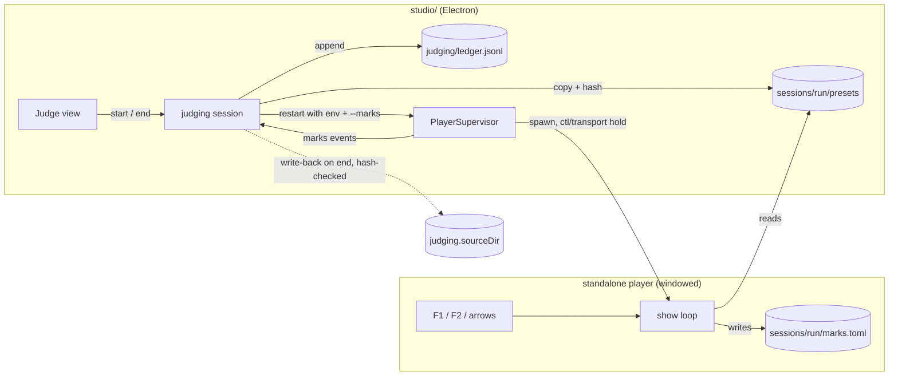

# 0254 — The studio judges a preset set

> **Status:** done - Phase 4 owed, ADR-0249 (closed 2026-10-07). Phases 1-3 in 994c9464,
> 239e6652 and 47e03e41; round 1's fixes in 28dc8172 and 86db9757. Close review round 2: no
> blockers, no majors; both minors repaired at the close in 9070c3d5, two nits open. v0.170.0.
> **Created:** 2026-10-07
> **Owner skill(s):** dev, studio-builder, human
> **Closes:** design-backlog 0277
> **Related ADRs:** [ADR-0267](../../adrs/0267-judging-a-preset-set-is-a-studio-session-over-an-isolated-player.md)
> (this plan's decision), ADR-0229 (marks on the wire, the player the only writer), ADR-0240 (a
> setting has a file), ADR-0183 (one player), ADR-0184 (the studio resolves no directory)

## TL;DR

The owner's hotkey walk and live retune loop, which ran on two scratch scripts in `target/p0232/`,
become a **Judge** view in the studio. The owner picks a set: a family prefix, `proposed/`, or a
list of files. The studio copies it into a session directory and restarts its player there in a
window, on the owner's own config, with marks kept in a session file. The owner presses F1 to
keep, F2 to cut, and leaves the rest as tune. Ending the session appends the verdicts to a
ledger, and if any files were edited, offers to write them back to their sources. The player gains
one flag, `--marks <path>`. Nothing in the control protocol changes.

## Context & problem

Backlog 0277: Plan 0232 Phase 2's walk and Phase 4's retunes ran on `walk.sh`, `apply.py` and
`retune.sh`. All three sit under gitignored `target/` and depend on Hyprland for window placement.
The scratch data root they used isolated the marks, and also discarded the owner's `config.toml`.
The owner chose a studio view over a `scripts/` tool and over a player mode; ADR-0267 records why,
and why the data-root trick is not kept.

What exists today and is reused as is:

- The `marks` event fires on F1 and F2 pressed in the player itself, carrying both sets whole
  (spec 0003, ADR-0229).
- `ctl/transport hold` stops rotation, and hidden presets already drop out of rotation.
- The studio's editor writes into the directory the `roster` event names (ADR-0184). During a
  session that is the session copy, so the editor needs no change for the retune.
- `PlayerSupervisor` takes `args` and a `spawn` function, but `defaultSpawn` passes no environment
  (`studio/electron/player/supervisor.ts`). This plan adds one.

What is missing: a player flag for the marks file's location, since `resolve_marks_path` derives
it from the data root alone (`standalone/src/marks.rs`), and everything studio-side.

## Decision

As in ADR-0267: the run is one `dev` phase, then two `studio-builder` phases, then a non-blocking
`human` phase. The settings key is `judging.sourceDir`. The ledger is
`<userData>/judging/ledger.jsonl`, append-only, one line per preset per session. Sessions live in
`<userData>/judging/sessions/<run>/`, holding the copied `presets/`, `marks.toml` and
`sources.json` (source path and SHA-256 per copied file). A session always spawns the windowed
vector and sends `ctl/transport hold` once `hello` reports a control address. The verdict is fold
of the last `marks` event: favourite means keep, hidden means cut, neither means tune, and
favourite wins over hidden.

## Architecture diagram



## Implementation phases

### Phase 1 — The player takes its marks file from a flag
- **Owner skill:** dev
- **What:** A new launch flag, `--marks <path>`, on both the windowed and the `--stream` paths.
  With the flag set, the run loads its marks from that file and saves them back to it; without it,
  `resolve_marks_path` behaves as it does now. A missing file loads as empty marks, as today. The
  flag needs a value: a bare `--marks` is a usage error naming the flag. It joins the flag table and
  the help text, and gets one row in `docs/configuration.md`'s flags table. The row says it
  overrides the marks file's location for one run and writes nothing to `config.toml`.
- **Files touched:** `standalone/src/cli.rs` (flag table, parser, its tests),
  `standalone/src/marks.rs` (the resolver takes the override), `standalone/src/app_state.rs` and
  `standalone/src/stream.rs` (the two call sites of `resolve_marks_path`),
  `standalone/tests/help_cli.rs` if it enumerates flags, `docs/configuration.md`.
- **Done when:** A unit test resolves the marks path with `--marks /x/m.toml` to that path, and
  without the flag to `<data root>/Ritmolux/marks.toml`. A parser test gets a usage error naming
  `--marks` for a bare `--marks`. A test drives a headless show with `--marks` on a temp file, sends
  `ctl/mark` and finds the mark in that file, with the per-user `marks.toml` untouched; it may live
  in `standalone/tests/stream_show.rs` or as a `show.rs` unit test. `cargo nextest run -p standalone`
  passes. `git grep -n -- "--marks" -- docs/configuration.md` finds the row.

### Phase 2 — The session: copy, isolate, fold, ledger, write-back
- **Owner skill:** studio-builder
- **What:** The main-process half, with no UI.
  - `StudioSettings` gains `judging.sourceDir`, read key by key like `render`. The studio README's
    settings table gains its row; `settings.doc.test.ts` holds the two equal.
  - The set selector lists the families present in `sourceDir` (the prefixes before the first `_`
    of each `*.toml` stem), whether `proposed/` exists, and the files, so an explicit list can be
    picked.
  - Starting a session copies the set into a new session directory and writes `sources.json`. It
    stops the running player and restarts it through `PlayerSupervisor` with
    `RLX_PRESET_DIR=<session>/presets` in the child's environment and `--marks <session>/marks.toml`
    added to the **windowed** vector. It sends `ctl/transport hold` once `hello` carries a control
    address.
  - `defaultSpawn` and `SpawnFn` gain an optional environment, merged over `process.env`.
  - The session reads each copied file's top-level `name = "..."` line, so it can map display names
    back to stems. A file with no readable name is listed as unreadable and gets no verdict.
  - Each `marks` event updates the live keep / cut / tune counts.
  - Ending a session appends one ledger line per readable preset. It returns the files whose copy
    differs from the source hash it recorded. A write-back of a chosen subset re-hashes each source
    and refuses, by name, any source that moved. Last, it restarts the player on its normal vector.
  - The studio crashing mid-session leaves the session directory in place, and nothing is written to
    the ledger for it.
  - The session service lists the session directories with their dates and deletes a chosen set of
    them on request. It refuses the directory of a running session. Only directories under the
    studio's own judging root are eligible; a path that resolves outside it is refused.
  - The new IPC channels are validated in main like every other action (ADR-0178).
- **Files touched:** `studio/electron/settings.ts`, `studio/README.md` (settings table),
  `studio/electron/player/supervisor.ts`, `studio/electron/main.ts`, new
  `studio/electron/judging/session.ts`, `studio/electron/judging/ledger.ts`,
  `studio/electron/judging/sets.ts` and their `*.test.ts`, new `studio/electron/ipc/judgingHandlers.ts`,
  `studio/shared/ipc-channels.ts`, `studio/shared/judging.ts` (the zod schemas and the ledger line
  type), `studio/electron/preload/api/` (the bridge).
- **Done when:**
  - `npm --prefix studio test -- judging` passes. The tests show:
    - a set drawn by prefix copies exactly the matching files;
    - the ledger line for a preset marked both favourite and hidden reads `keep`, an unmarked one
      reads `tune`, and a hidden one reads `cut`;
    - ending a session appends one line per readable preset and rewrites no earlier line;
    - the write-back refuses a file whose source was changed after the copy and writes one that was
      not;
    - a clean-up removes the chosen ended session directories, refuses the running session's, and
      refuses a path outside the judging root.
  - `npm --prefix studio test -- supervisor` shows the spawn receiving `RLX_PRESET_DIR` in its
    environment and `--marks` on a windowed vector.
  - `npm --prefix studio test -- settings` passes with the new key documented.
  - `npm --prefix studio run typecheck` and `npm --prefix studio run lint` exit 0.

### Phase 3 — The Judge view
- **Owner skill:** studio-builder
- **What:** A Judge view, opened from the header like Render and Settings.
  - Before a session it shows the source directory, or a prompt to set it, which writes
    `judging.sourceDir`. It offers the set picker (family, `proposed/`, a ticked file list) and Start.
  - During a session it shows the set's label, a line telling the owner to judge in the show window
    (F1 keep, F2 cut, `F` fullscreen), the live keep / cut / tune counts with each preset's current
    verdict, and End. The existing Library mark buttons stay usable during a session as a second
    route.
  - After End it lists the edited files with checkboxes and a Write back button, and shows any
    refusal by file.
  - A ledger panel shows each stem's latest verdict for the current source directory. Its Copy as
    Markdown button puts a `| preset | verdict | run |` table on the clipboard.
  - Outside a session, a Sessions list shows the old session directories by date with checkboxes
    and a Delete button, the owner's clean-up for directories a crash left behind.
  - The Settings panel gains a row for `judging.sourceDir`.
- **Files touched:** new `studio/renderer/views/Judge.tsx`, `Judge.module.css`, `Judge.test.tsx`,
  `studio/renderer/App.tsx`, `studio/renderer/views/Settings.tsx` and its test, a hook under
  `studio/renderer/hooks/` if the session state wants one.
- **Done when:** `npm --prefix studio test -- Judge` passes, with tests showing:
  - Start is disabled until a source directory and a non-empty set are chosen;
  - a `marks` event moves a row from tune to keep, and to cut;
  - End lists exactly the edited files the session reported;
  - Copy as Markdown produces one row per stem with its latest verdict;
  - Delete is hidden during a session and sends exactly the ticked directories.

  `npm --prefix studio test -- Settings` passes with the new row. `npm --prefix studio run
  typecheck` and `npm --prefix studio run lint` exit 0.

### Phase 4 — The owner walks a real family
- **Owner skill:** human
- **Blocks merge:** no
- **What:** The owner runs one walk over a real family and one retune over two or three presets,
  editing one in the studio's editor and writing it back.
- **Files touched:** none.
- **Done when:** The owner says the walk replaces `walk.sh` and `apply.py`, or names what it lacks
  as a backlog entry. The ledger holds the walk's lines. The written-back preset's diff in
  `presets/` is the edit made, and nothing else.

## Data shapes

```ts
// illustrative: one line of <userData>/judging/ledger.jsonl
type LedgerLine = {
  v: 1
  run: string        // the session's ISO start, also its directory name
  set: string        // "family:attractor" | "proposed" | "list:<n> files"
  stem: string       // "attractor_clifford"
  name: string       // "Clifford", the display name marks are keyed by
  verdict: 'keep' | 'cut' | 'tune'
}
```

```jsonc
// settings.json, the one new key
{ "judging": { "sourceDir": "/home/me/Work/Ritmolux/presets" } }
```

## Risks & open questions

**Settled with the owner 2026-10-07:** a session is exclusive (editing pauses until it ends, the
studio keeps one player); the ledger leaves the studio as a clipboard table, never as a write into
`docs/`; and old session directories get a Delete in the Judge view.

- **A display name shared by two files in one set.** Marks are keyed by name, so the two cannot be
  told apart. The session reports the clash at Start and refuses that set. It does not guess.
- **Hidden presets leave rotation.** A cut preset vanishes from the walk as soon as F2 is pressed.
  That is what the scripts did and what the owner used. To revisit one, the owner un-hides it from
  the Library row.
- **The windowed vector on a `windowless` machine.** A single-screen machine gets a show window
  for the session's length, as ADR-0267 decided. The owner fullscreens it with `F` or with their
  config's `[output] fullscreen`.
- **Leftover session directories.** The studio never deletes a session directory on its own, so one
  can be inspected after a crash. They accumulate under `userData` until the owner deletes them from
  the Judge view's Sessions list (Phase 3), which the owner asked for on 2026-10-07.

## What this plan does NOT do

- No control-protocol row or event field (spec 0003 is unchanged).
- No window-manager placement, Hyprland or otherwise.
- No machine-measured columns (drive, animation, ms/frame, nearest shape) like those in 0232's
  ledger table. Those came from the gates, not from the walk.
- No writing into `docs/`. The ledger's Markdown goes on the clipboard.
- No retirement or `git mv` of a cut preset. A verdict is a record; acting on it stays with
  `preset-author` and `architect`.

## Implementation log

**Lane:** branch `plan-0254-the-studio-judges-a-preset-set`, worktree `/home/igor/Work/rlx-plan-0254`

| phase | owner | state | commit |
|---|---|---|---|
| 1 — The player takes its marks file from a flag | dev | done | 994c9464 |
| 2 — The session: copy, isolate, fold, ledger, write-back | studio-builder | done | 239e6652 |
| 3 — The Judge view | studio-builder | done | 47e03e41 |
| 4 — The owner walks a real family | human | owed | |

### Notes

- Phase 1 touched `standalone/src/run.rs`, outside its file list: the windowed path parses
  `--marks` there, before the window, and carries it on `App` to `app_state.rs`.
  `standalone/tests/help_cli.rs` enumerates no flags and was not touched. The end-to-end test is
  `a_headless_run_keeps_its_marks_in_the_file_the_flag_names` in `standalone/tests/stream_show.rs`.
- Phase 2: the ledger line carries one field beyond the Data shapes sketch, `source` (the source
  directory the set was drawn from), so Phase 3's panel can show "the latest verdict for the
  current source directory" from the ledger alone. A run name is ISO 8601's basic form
  (`20261007T123005Z`), because the extended form's colons are not a Windows file name; a second
  session started in the same second gets a `-2` suffix. The windowed session vector is
  `judgingArgs(marks)` in `supervisor.ts`. `main.ts` gained `spawnPlayer`, which stops the old
  player, forgets its control address and preset scope, drops a late event from it, and reattaches
  the frame port, so a restart keeps the preview. The bridge is `preload/api/judging.ts` plus its
  line in `preload/index.ts`. Ten OS channels, `judging:*`; no domain channel and no protocol row.
- Phase 3 touched `studio/renderer/App.module.css`, outside its file list, for the header's
  `judge` button. The Judge view mounts on first open and then stays mounted while hidden, so an
  ended session's edit list outlives closing the panel. The Settings row is a `JudgingGroup` that
  reads `judging.sourceDir` from `judging:get-state` itself, since `AppInfo` does not carry it.
  No hook was added; the view holds its own state.
- Close review round 1, finding 0 (major), fixed in 28dc8172: `SessionInfo` carries `presetDir`,
  the Judge view reports it to `App`, and `useActivePreset` writes a file under it in place while
  `roster.dir` equals it, so a retune edits the copy End hashes. Tests in `Editor.test.tsx`,
  `Judge.test.tsx`, `session.test.ts`; `npm --prefix studio test` 48 files / 436 tests passed.
- Close review round 1, finding 3 (minor), fixed in 86db9757: the Judge view re-reads
  `judging:get-state` on every reveal. Findings 1, 2 (Markdown, left to the close), 4 and 5 (nits)
  were left.

### Close triggers

- `presets/`: not touched.
- Closes: design-backlog 0277 (plan header).
- Shipped: a feature. The player gains `--marks <path>`; the studio gains the Judge view, ten
  `judging:*` OS channels and the `judging.sourceDir` settings key.
- Operator docs moved: `docs/configuration.md` (the `--marks` row), `studio/README.md` (the
  `judging` settings row).
- `node scripts/check-backlog-claims.mjs`: exit 0, no entry named (advisory list only).
- Full suite: owed to the conductor's pre-review gate (ADR-0207). Studio gate at 47e03e41:
  `npm --prefix studio test` 48 files / 431 tests passed, typecheck and lint exit 0.
- `human` phases remaining: Phase 4 (`Blocks merge: no`).

## Close review

Closed by a conductor close on 2026-10-07, round 2, at v0.170.0. **Phase 4 is owed** (ADR-0249):
nothing yet checks that the walk replaces `walk.sh` and `apply.py` on a real family, that the
ledger holds a real walk's lines, or that a preset written back from the studio's editor differs
from its source by the edit alone. The round 2 review follows in full, then round 1's resolved
findings.

### Plan 0254 — close review, round 2

**Graded tip:** `f6ed73c57ad048796e60df1e1ffbdd9a6bc9c34a` (tree `68fc7f10`), lane
`/home/igor/Work/rlx-plan-0254` on `plan-0254-the-studio-judges-a-preset-set`.

**Verdict:** clean for the close. Round 1's major is fixed: a judging session's copies are now
written in place, so a retune reaches End's edit list and the write-back. Round 1's minor 4 (the
Judge view read `judging.sourceDir` once) is fixed too. The two Markdown minors and the two nits
from round 1 are still open, as the fix log says. The minors are repairs a close may make (ADR-0209).
Phase 4 (human, `Blocks merge: no`) stays `owed`. **0 blockers, 0 majors, 2 minors, 2 nits.**

#### Evidence

- **Full suite.** `node .../with-lock.mjs suite -- cargo nextest run --workspace` printed
  `with-lock: skipped cargo nextest run --workspace: tree 68fc7f1 is green in the suite ledger, run by
  gate 0254-fix-1 at 2026-10-07T16:12:28.372Z: 1955 tests run: 1955 passed (9 slow), 95 skipped`.
  `git rev-parse HEAD^{tree}` is `68fc7f10f6f6…`, the same tree, so that ledger record is lens 1's
  full-suite evidence (ADR-0207).
  - The skip count differs from round 1's record (2041 run, 9 skipped). No Rust, `Cargo.toml` or
    `Cargo.lock` changed between the two tips: `git diff --stat df337824 f6ed73c5` over every crate is
    empty. So the Rust under test is the tree round 1 saw green. This is noted, not a finding.
- `RUSTDOCFLAGS="-D warnings" cargo doc --workspace --no-deps`: clean.
- `npm --prefix studio test`: 48 files, 436 tests passed. That is 5 more than round 1, which matches
  the fix commits. `npm --prefix studio run typecheck` and `npm --prefix studio run lint` both exit 0.
- `node scripts/check-comment-hygiene.mjs`: OK. `node scripts/check-doc-links.mjs`: OK.

#### Round 1 findings, re-graded

1. **Major: the retune forked the session copy. Fixed in `28dc8172`.**
   - **The data path.**
     - `SessionInfo.presetDir` (`studio/shared/judging.ts`) is `join(s.dir, 'presets')`
       (`session.ts:138`).
     - The Judge view reports it through `onSession`, `App` holds it as `judgingDir`, and it reaches
       `Editor` as `own`.
     - `useActivePreset.land` writes in place when `dir === own` and the path is under
       `presetPath(own, '')`.
   - **The strings match in practice.** `dir` is the player's `roster.dir`. For an `RLX_PRESET_DIR`
     override the player reports `std::path::absolute` of it (`standalone/src/preset_dir.rs:40`).
     That call is lexical and adds no `\\?\` prefix. Main's `join` of an absolute `userData` path is
     already absolute, so the two strings are equal and the comparison holds.
   - **The restart window is guarded.** The `dir === own` guard keeps a file under the previous
     directory forking while the player restarts.
   - **Tests.** `Editor.test.tsx` has three:
     - in place, with no prompt, for a session copy;
     - still a fork outside the session directory;
     - still a fork while `dir` lags.

     `Judge.test.tsx` asserts `onSession` goes null, then the directory, then null across Start and
     End. `session.test.ts` asserts `presetDir`.
   - ADR-0189 is honoured: the studio wrote every session copy at Start.
2. **Minor: `judging.sourceDir` has no row in `docs/configuration.md`. Still open**, carried below as
   finding 1.
3. **Minor: `studio/README.md` has no Judge section and an incomplete mode section. Still open**,
   carried below as finding 2.
4. **Minor: the Judge view read the source directory once. Fixed in `86db9757`.**
   - The `getState` effect now runs on every reveal (`[hidden]`), and the listing follows
     `sourceDir`.
   - The family and the file picks are pruned to the new listing, so Start cannot send a stale
     pick.
   - Tested in `Judge.test.tsx` ("a source directory changed while the view is hidden").
5. **Nit: the `hello` hold is untested. Still open**, carried as finding 3.
6. **Nit: if the player restart at End throws, the session is stranded in the view. Still open**,
   carried as finding 4.

#### Lenses

- **Lens 1, alignment.** Round 1's per-phase grading stands. The fix commits change only `studio/`
  and the plan's log. The log records both fixes and the four findings it left, accurately.
- **Lenses 2 and 5, layering and seams.** The fix adds one renderer-only field and one prop. There is
  no new IPC channel and no protocol change. `docs/specs/0003` is untouched. The single-writer rule
  for `marks.toml` (ADR-0229) is unaffected.
- **Lenses 3 and 4, real-time and determinism.** Not applicable: there is no core or audio change.

#### Findings

##### Minor

1. **`judging.sourceDir` has no row in `docs/configuration.md`'s studio settings table.**
   `docs/configuration.md:678`. Add this row after `render.diffusion.script`:
   `| `judging.sourceDir` | a directory | none | The preset directory a judging session draws its sets from, typically a checkout's `presets/`. Read at each session; while it is absent the Judge view asks for one |`.
   This is Markdown, so the close repairs it. **Fixed at the close in `9070c3d5`.**
2. **`studio/README.md` does not describe the Judge view, and its mode section is incomplete.**
   `studio/README.md:34`.
   - Add a short "Judging a set" section after "Rendering a clip". It should cover:
     - the source directory and the three set kinds;
     - F1/F2 in the show window;
     - End and the hash-checked write back;
     - the editor writing a session copy in place;
     - the ledger at `<userData>/judging/ledger.jsonl`;
     - Delete for leftover sessions.
   - In "One player, in one of two modes", add one sentence: a judging session respawns the player
     on the windowed vector whatever `playerMode` says, with `RLX_PRESET_DIR` and `--marks` on the
     session (ADR-0267).

   This is Markdown, so the close repairs it. **Fixed at the close in `9070c3d5`.**

##### Nit

3. **Nothing tests that a judging session sends `ctl/transport hold` on `hello`.**
   `studio/electron/main.ts:119`. The rule lives in untested glue in `spawnPlayer`. Moving it into a
   testable unit beside `judgingArgs` would let a test hold it. This is code, so it stays open.
4. **If End's player restart throws, the renderer keeps showing a session main has already ended.**
   `studio/electron/judging/session.ts:298`.
   - The ledger is written and `running` is cleared, but the result is `ok: false`.
   - The view keeps the session, the edit list is never shown, and a second End answers "no session
     is running".
   - Returning `ok: true` with the edits and a warning would keep the write-back reachable. This is
     unlikely in practice, and it is code, so it stays open.

#### Bookkeeping owed at the close

- Repair findings 1 and 2.
- Plan → `done - Phase 4 owed, ADR-0249`. `git mv` it to `docs/plans/done/`, re-point the links
  (ADR-0267's `Related plan(s)` among them), and run `check-doc-links`. Add a `## Close review`
  section with this review and one line each for round 1's findings 0 (fixed in `28dc8172`) and 3
  (fixed in `86db9757`).
- ADR-0267 `proposed → accepted`, and its row in the ADR index.
- `**Closes:** design-backlog 0277`: add the archive marker, and move the row from Promoted to Closed.
- `presets/` was not touched, so the curation step is not triggered.
- Version bump **minor**: a player flag and a studio view. Both studio version copies follow it.

### Earlier rounds, resolved by a fix round

- Round 1, finding 0 (major, a retune forked the session copy so End never saw the edit): fixed in
  `28dc8172`.
- Round 1, finding 3 (minor, the Judge view read `judging.sourceDir` once): fixed in `86db9757`.

### Close notes

- Upstream CI: OK, run 37631820899 on `main` at `d23d99b`.
- Curation: `presets/` not touched; no verdict owed.
- Translations: `docs/running.ru.md` is stale against `docs/running.md` (stamped `fb237a6c`, source
  at `b25cd8cf10`); this plan did not move it.
- Backlog probes: exit 0, 43 reductions across 20 live entries.

## Followups (after this lands)
