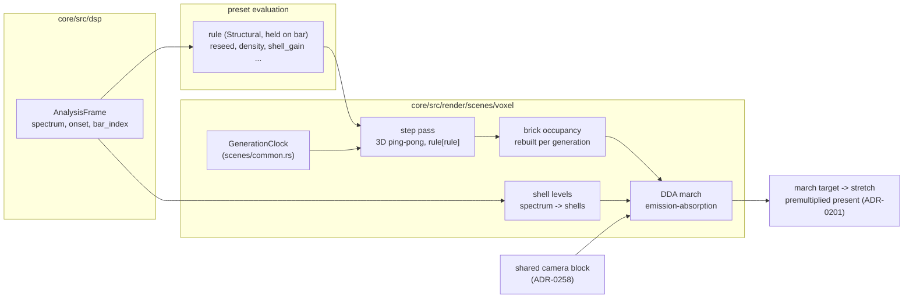

# 0255 — The voxel automaton glows

> **Status:** done 2026-10-09 - Phases 6-7 owed, ADR-0249. Phases 1-5 landed in `9269dd99`,
> `627473a3`, `e39942ab`, `54a9ba57` and `bb991d91`; conductor review round 1: no blockers, no majors,
> three minors (one fixed at the close, two open). Full suite green at the graded tip `79cd4489`
> (the suite ledger, ADR-0207) and re-run on the closed tip. Version 0.172.0.
> **Created:** 2026-10-08
> **Owner skill(s):** dev, human
> **Related ADRs:** [ADR-0268](../../adrs/0268-a-3d-automaton-is-a-voxel-system-marched-as-an-emitting-absorbing-volume.md) (accepted, Outcome), [ADR-0180](../../adrs/0180-a-mathematical-world-joins-a-system-as-a-family-and-a-structural-parameter-is-held.md), [ADR-0258](../../adrs/0258-a-system-takes-depth-through-one-shared-camera-block-and-its-3d-mode-forgoes-what-seg3d-does-not-draw.md), [ADR-0201](../../adrs/0201-a-fullscreen-scene-presents-premultiplied-over-the-backdrop.md), [ADR-0037](../../adrs/0037-internal-grid-is-a-resolution-not-a-shape.md), [ADR-0045](../../adrs/0045-quality-tiers-floor-and-rich.md)
> **Followed by:** [Plan 0256](../0256-the-voxels-turn-solid.md) (the solid, lit present)

## TL;DR

A new system, **`voxel`**, runs a 3D cellular automaton in a cube of up to 128³ cells and draws it
as a glowing, absorbing volume seen through the shared orbit camera. A preset picks its rules from a
list (named roster entries or inline birth/survive counts) and can switch among them on the bar. An
onset injects a ball of fresh cells, and the spectrum lights the volume in radial shells, bass at the
centre. The first visible result is a single rule growing in a turning cube under `shot`.

## Context & problem

The owner asked for 3D cellular automata as voxels: a glowing volume first, then solid lit cubes
(Plan 0256). The 2D `cellular` system (Plan 0164) and the shared camera (ADR-0257, ADR-0258) each
hold half of what that needs. ADR-0268 records why the result is a new system rather than a family
of `cellular`, why it is a raymarch rather than sprites or slices, and why rules are an indexed list
rather than bindable masks.

The interview settled:

- **Rules:** a named roster plus inline rules.
- **Music:** onset injects a ball, the rule shifts on the bar, and bands light radial shells. The
  bands do not drive the step rate.
- **Budget:** tiered, 64³ on `Floor` and 128³ on `Rich`, with the march at a reduced internal
  resolution so the iGPU holds 60 Hz.
- **Accumulation:** emission plus absorption, with `density = 0` meaning pure additive.

## Decision

`SystemKind::Voxel`, as ADR-0268 states:

- **State:** a ping-pong pair of 3D state textures stepped by a compute pass over a Moore or von
  Neumann neighbourhood, with Generations-style decay stages and wrapping faces.
- **Present:** an Amanatides-Woo DDA march through the unit cube from the shared camera, front to
  back under emission-absorption. Bricks skip empty space, and the march target is a capped
  fraction of the render target.
- **Shared code:** `GenerationClock` and the WGSL cell hash move to `scenes/common.rs`, and
  `cellular`'s output is byte-identical.

We rejected families on `cellular`, sprites through `quad3d`, textured slices and bindable rule masks
(ADR-0268, Alternatives).

## Architecture diagram



## Implementation phases

### Phase 1 — Walking skeleton: one rule grows in a turning cube
- **Owner skill:** dev
- **What:**
  - Move `GenerationClock` and the WGSL cell hash from `cellular` into `scenes/common.rs`, unchanged.
  - Add `SystemKind::Voxel`, its `TABLE` row, and a `[voxel]` table with `grid`, `rules` (one entry
    is enough in this phase, from a roster of at least `445` and `clouds`), `seed_radius`,
    `seed_fill` and `wrap`.
  - Add the scene:
    - the 3D state pair preallocated at `configure`;
    - a seeded ball fill at `configure`;
    - one compute step pass;
    - a DDA march at full target resolution, with no brick skipping yet, that accumulates
      emission-absorption from state and age;
    - the camera block spliced (ADR-0258), with `focus` and `aperture` declared inert.
  - Modal params: `step_rate`, `density`, `brightness`, `trail` (how the decay stages fade),
    `age_tint`, `hue`, `hue_spread` and the palette set, each with its `group` and `main`
    (ADR-0256).
  - Add the hot-path pragma, the hygiene scan entry, a teaching preset under `docs/examples/voxel/`,
    its `scripts/docs-shots.mjs` entry, and the gallery image `hygiene` requires of every system.
- **Files touched:** `core/src/render/scenes/common.rs`, `core/src/render/scenes/cellular/mod.rs`,
  `core/src/render/scenes/cellular/shader.rs`, `core/src/render/scenes/voxel/` (new: `mod.rs`,
  `shader.rs`, `rules.rs`, `tests.rs`), `core/src/render/scenes/mod.rs`, `core/src/render/mod.rs`,
  `core/src/preset/schema/system.rs`, `core/src/preset/schema/raw/voxel.rs` (new),
  `core/src/preset/schema/raw/mod.rs`, `core/src/preset/schema/raw/preset.rs`,
  `core/src/preset/schema/load.rs`, `core/src/preset/schema/export.rs`,
  `core/src/preset/schema/tests.rs`, `core/tests/suite/hygiene.rs`, `core/tests/fixtures/`,
  `docs/examples/voxel/` (new), `scripts/docs-shots.mjs`, `docs/images/gallery/voxel.png` (new),
  and the generated `presets/README.md`, `presets/schema/`, `presets/preset.schema.json`,
  `.taplo.toml`, `docs/specs/player-schema.json`.
- **Done when:**
  - A fixture rendered through `shot` with a non-zero `yaw` shows a visible, non-uniform volume.
  - `cargo nextest run -p rlx-core --test golden` passes with `RLX_BLESS` unset, so every `cellular`
    golden is byte-identical after the move.
  - The same input run at `dt = 1/60` for 120 frames and at `dt = 1/144` for 288 frames runs the same
    number of generations and leaves state textures with the same hash.

### Phase 2 — The rules and the music
- **Owner skill:** dev
- **What:**
  - The full `rules` list (1-8 entries), with inline rules: `birth` and `survive` as integer count
    lists, `states`, `neighbourhood`. A count past 26 (6 for von Neumann), `states < 2`, or an
    unknown roster name is a load error naming the entry.
  - The structural `rule` index, quantized, taking effect at the next generation boundary. A cell
    whose decay stage is past the new rule's `states` falls to dead.
  - `reseed`: a rise past 0.5 fills a ball of `reseed_radius` at a centre hashed from the rise count
    and the salt.
  - Shells: `update` downsamples `AnalysisFrame::spectrum` to `shells` radial bands, bass at the
    centre, and emission is scaled by `1 + shell_gain * level`.
  - The roster, with a candidate list to start from. These are transcribed from the published 3D CA
    literature and **unverified**: `445` (4/4/5/M), `clouds` (13-26/13-14,17-19/2/M), `amoeba`
    (9-26/5-7,12-13,15/5/M), `pyroclastic` (4-7/6-8/10/M), `builder` (2,6,9/4,6,8-9/10/M),
    `crystal` (0-6/1,3/2/VN), `coral` (5-8/6-7,9,12/4/M), `slow_decay` (1,4,8,11,13-26/13-26/5/M).
    The notation is survive/birth/states/neighbourhood.
  - Write the survival test, then keep only the rules that pass it. The roster ships at least five.
- **Files touched:** `core/src/render/scenes/voxel/mod.rs`, `core/src/render/scenes/voxel/rules.rs`,
  `core/src/render/scenes/voxel/shader.rs`, `core/src/render/scenes/voxel/tests.rs`,
  `core/src/preset/schema/raw/voxel.rs`, `core/src/preset/schema/load.rs`,
  `core/tests/suite/voxel.rs` (new), `core/tests/suite/main.rs`, `core/tests/fixtures/`.
- **Done when:**
  - Every roster rule, from the standard seed at 32³, keeps its live fraction strictly between 0
    and 0.9 at generations 100 and 400 (a structural statistic, ADR-0180 rule 3). A rule cut from
    the candidate list is named, with its reading, in the log.
  - A preset binding `rule = "mod(bar_index, 3)"` with `[hold] rule = "bar"`, driven by synthetic
    analysis frames whose `bar_index` advances on a fixed period, changes rule only at bar edges. The same run twice leaves the same state
    hash.
  - A `reseed` rise changes cells only inside the ball.
  - `shell_gain = 0` renders byte-identical to the same fixture with shells absent.
  - Each load error above is a test that names the entry.

### Phase 3 — Cost: bricks, the march target and the tier caps
- **Owner skill:** dev
- **What:**
  - A brick occupancy texture (8³ cells a brick) rebuilt after each generation. The march steps
    brick by brick through empty bricks, and cell by cell inside occupied ones.
  - Early termination at `T < 1/255`.
  - The march renders to its own target, `quantize(target * voxel_march_scale)`, capped by
    `voxel_march_cap`, and is presented by a plain stretch. The aspect is the render target's
    (ADR-0037).
  - `TierConfig` gains `voxel_grid` (64 `Floor`, 128 `Rich`, content caps, clamped and announced)
    and the two march fields.
  - The neighbour count in the step pass: the implementer chooses between a workgroup tile with a
    halo and a separated sum, and the log records the choice and its reading.
  - Probe the cost on the reference iGPU (the Arch box's RADV RENOIR), release profile, 1920x1080,
    `shot --report`, with three fixtures:
    1. **Sparse:** `crystal`-like, under 5 % live.
    2. **Cloudy:** `clouds`, about 40 % live, `density = 0.3`.
    3. **Worst case:** `density = 0` with a full decay haze, so no ray terminates early.
    Each runs at the `Floor` cap and at 128³.
  - The ladder, stopping at the first rung that meets the budget, with each rung's reading in the
    log:
    1. Lower `voxel_march_scale` on `Floor`, not below 0.5.
    2. Lower `voxel_march_cap` on `Floor`.
    3. Cap `step_rate` per tier.
- **Files touched:** `core/src/render/scenes/voxel/mod.rs`, `core/src/render/scenes/voxel/shader.rs`,
  `core/src/render/tier.rs`, `core/src/render/scenes/mod.rs`, `core/tests/fixtures/`,
  `core/src/render/scenes/voxel/tests.rs`.
- **Done when:**
  - All three fixtures on `Floor` are inside NFR section 1's 16.67 ms on the reference iGPU. The log
    carries every probe's frame time, the rung the ladder stopped at, and the `Rich` 128³ readings
    as information.
  - A grid past the tier cap is clamped with a notice.
  - Brick skipping changes no pixel: the sparse fixture renders byte-identical with skipping forced
    off.

### Phase 4 — The golden and the gates
- **Owner skill:** dev
- **What:**
  - A golden at 32³ with a fixed camera, a fixed seed, generations run to a fixed count, and shells
    off, blessed on the software adapter as Plans 0235 and 0238 did.
  - Add the teaching preset or a fixture to the `sanity`, `animation`, `reactivity` and
    `distinctness` rosters.
  - Find out which branch of the `animation` gate the system passes on. An automaton evolves under
    constant input, so the silent branch should hold. Record which one does.
- **Files touched:** `core/tests/golden.rs`, `core/tests/golden/`, `core/tests/fixtures/`,
  `core/tests/suite/voxel.rs`, `core/tests/sanity.rs`, `core/tests/animation.rs`,
  `core/tests/reactivity.rs`, `core/tests/distinctness.rs`.
- **Done when:**
  - `cargo nextest run -p rlx-core --test golden` passes with `RLX_BLESS` unset.
  - The same seed and analysis frames give the same state hash after 600 frames.
  - The four gates pass with the system in their rosters, and the log names the `animation` branch
    and the four `reactivity` readings.

### Phase 5 — Documentation and the references
- **Owner skill:** dev
- **What:**
  - `docs/presets.md` gains the `[voxel]` table, the `rules` list syntax, the roster with one line
    per rule, and a system-table row.
  - The generated params block, `presets/schema/` and `.taplo.toml` are regenerated.
  - `docs/preset-guide.md` gets one picture.
  - `docs/configuration.md` names no new key, because no user setting is added.
  - `docs/on-device-validation.md` gains the system.
  - The log carries the text for a new `## voxel` section of the preset-author reference (ADR-0234),
    for the owner to apply in Phase 7: working ranges for `density`, `step_rate`, `shell_gain` and
    `reseed_radius`, and which roster rules suit a rule-shift on the bar. A headless session cannot
    edit `.claude/` (ADR-0210).
- **Files touched:** `docs/presets.md`, `presets/README.md`, `presets/schema/`, `.taplo.toml`,
  `docs/preset-guide.md`, `docs/images/`, `docs/on-device-validation.md`.
- **Done when:**
  - `cargo nextest run -p rlx-core --test suite preset_schema::` passes with no update variable set.
  - `cargo nextest run -p rlx-core --test suite the_parameter_reference_block_is_current` passes.
  - `node scripts/toc.mjs --check`, `node scripts/check-doc-links.mjs`,
    `node scripts/check-reader-prose.mjs` and `node scripts/check-system-counts.mjs` pass.

### Phase 6 — The look, judged
- **Owner skill:** human
- **Blocks merge:** no
- **What:** the owner runs the teaching preset live with the music track, on `Floor` and on `Rich`,
  at 60 Hz and at the display's native rate. They judge:
  - whether the volume reads as a 3D structure rather than a haze;
  - whether `density` gives it a front and a back;
  - whether an onset ball and a rule shift on the bar are visible as the music's doing.
  Then they hand a brief to `preset-author`.
- **Files touched:** none.
- **Done when:** the owner records a keep, or a list of what is off, in this plan's log.

### Phase 7 — The preset-author reference
- **Owner skill:** human
- **Blocks merge:** no
- **What:** the owner applies, in an interactive session, the text Phase 5 left in the log to
  `.claude/skills/preset-author/references/systems.md`'s `## voxel` section.
- **Files touched:** `.claude/skills/preset-author/references/systems.md`.
- **Done when:** the edit is committed on `main` and `node scripts/check-doc-links.mjs` exits 0.

## Data shapes

```rust
// illustrative, not the final interface
pub struct VoxelConfig {           // [voxel], structural
    pub grid: u32,                 // cells a side; capped by voxel_grid, announced
    pub rules: Vec<RuleSpec>,      // 1..=8; validated at load, never passes through f32
    pub seed_radius: f32,          // fraction of the half-side
    pub seed_fill: f32,            // 0..1 live probability inside the seed ball
    pub wrap: bool,                // torus at the faces
}
pub enum RuleSpec {
    Named(RosterRule),
    Inline { birth: u32, survive: u32, states: u8, neighbourhood: Neighbourhood }, // bit k = count k
}
// Uploaded per generation: birth/survive masks as u32 (27 bits used), states, neighbourhood.
// The march uniform: inverse view-projection from CameraView, grid, density, brightness,
// trail, shell levels [f32; MAX_SHELLS].
```

The memory arithmetic: a 4-byte texel at 128³ is 8.4 MB, and the pair is 16.8 MB. The bricks at
16³ are a rounding error. The march target at 1920x1080 in `COMPOSITE_FORMAT` is 16.6 MB at scale 1.

## Risks & open questions

- **The roster is unverified.** The candidate rules come from published 3D CA catalogues, with
  notations that vary (survive/birth vs birth/survive). Phase 2's survival test is the arbiter. A
  transcription error shows up as a dead or saturated rule and gets cut, not shipped.
- **Seed sensitivity.** Many 3D rules grow only from a dense small core, and others only from a
  sparse field. One `seed_radius` and `seed_fill` may not suit every roster rule. If the survival
  test needs per-rule seeds, the roster entry carries its own default seed, and the log says so.
- **The march budget on the iGPU.** This is a rough estimate, not a measurement: 1920x1080 at scale
  1 with ~100 cells crossed per ray is ~200 M texel loads a frame, too much for RENOIR at 60 Hz. So
  Phase 3's march scale is expected well below 1 on `Floor`. If even scale 0.5 misses on the cloudy
  fixture, the ladder's last rung (capping `step_rate`) will not save it, because the march, not the
  step, is the cost. That outcome parks the plan for an owner call rather than lowering the bar.
- **Rule shift on the bar follows the fallback grid** most of the time (backlog 0042). It shifts,
  but not always on the musical bar.
- **A cut through the wrap.** With `wrap = true` a structure crossing a face reappears on the
  opposite face, which can read as a cut-off in an orbit. `wrap = false` (dead outside) is the
  alternative. Phase 1 picks the default on sight and says which in a comment.
- **Rule switch artefacts.** Dropping decay stages past the new `states` can flash the volume dark
  at a bar edge. That may read as a feature. Phase 6 judges it.

## What this plan does NOT do

- Draw solid, lit cubes. That is [Plan 0256](../0256-the-voxels-turn-solid.md) under ADR-0269.
- Drive the step rate from the bands (the owner declined it in the interview), or add depth of
  field to the march.
- Add a shadow, a light or a depth buffer.
- Ship presets. That belongs to `preset-author` after Phase 6.
- Change `cellular` beyond moving two shared helpers.

## Implementation log

**Lane:** branch `plan-0255-the-voxel-automaton-glows`, worktree `/home/igor/Work/rlx-plan-0255`

| phase | owner | state | commit |
|---|---|---|---|
| 1 — Walking skeleton: one rule grows in a turning cube | dev | done | 9269dd99 |
| 2 — The rules and the music | dev | done | 627473a3 |
| 3 — Cost: bricks, the march target and the tier caps | dev | done | e39942ab |
| 4 — The golden and the gates | dev | done | 54a9ba57 |
| 5 — Documentation and the references | dev | done | bb991d91 |
| 6 — The look, judged | human | owed | |
| 7 — The preset-author reference | human | owed | |

### Notes

- Phase 1 touched files outside its list, each forced by the compiler or by a guard that fails
  without it: `core/tests/golden.rs` and `core/tests/golden/voxel.png` (the exhaustive fixture
  roster; the baseline was blessed in this phase, with `RLX_BLESS=1` on
  `scenes_match_golden_baselines` and the two re-encoded backdrop baselines restored),
  `core/tests/{sanity,animation,reactivity,distinctness}.rs` and
  `core/tests/suite/{geometry_extent,preset}.rs` (exhaustive `SystemKind` matches, the param drift
  scan, the `STRUCTURAL` roster), `core/src/render/tonemap/tests.rs` (a `StorageTexture` marker for
  the layout scan) and `core/src/render/palette.rs` (`SCENE_SOURCES`).
- `445` dies from every seed tried on a CPU mirror of the step at 32³ (radius 0.08-2, fill
  0.1-1.0). The default rule is `clouds`, and a roster entry carries its own default seed
  (`RosterRule::seed`), which an absent `seed_radius` / `seed_fill` takes. The fixture and the
  teaching preset run `clouds`.
- The seed ball is scheduled at `configure` and encoded by the next `render`; `configure` has no
  encoder.
- `common::GenerationClock::advance` takes the system's applied rate; `cellular` keeps a wrapper of
  the same name that applies its own clamp, so its tests are unchanged.
- The camera block is spliced without `solid`; `focus` and `aperture` are declared inert in their
  doc lines. `wrap` defaults to `false`.
- Golden run after the move: every baseline mean 0.0000 / outlier 0, `backdrop_ramp` and
  `backdrop_band` 0.0005 / 20-21.
- Phase 2 survival readings, `every_roster_rule_lives_from_its_own_seed` (32³, salt 7, live
  fraction at generation 100 / 400, seed as radius, fill): `445` 0.0002 / 0.0002 (0.35, 0.2),
  `amoeba` 0.7901 / 0.7901 (2.0, 0.5), `builder` 0.0066 / 0.0015 (0.5, 0.5), `clouds` 0.2686 /
  0.2686 (1.0, 0.6), `coral` 0.2745 / 0.2796 (0.5, 0.5), `crystal` 0.7832 / 0.7832 (0.2, 0.3),
  `pyroclastic` 0.0544 / 0.0845 (0.5, 0.3), `slow_decay` 0.2880 / 0.2880 (1.0, 0.5). No candidate
  was cut: all eight pass. `445` and `builder` pass as still residues of a few cells, and
  `445` read 0 from every other seed swept. The CPU mirror's readings matched the GPU's exactly.
- Phase 2 touched files outside its list: `core/src/preset/schema/export.rs` (a
  `KeyKind::RosterOrTable` for a `rules` entry that is a name or an inline table, the
  `voxel_rule` table, two rosters), `core/src/preset/schema/tests.rs`,
  `core/tests/suite/preset_schema.rs`, `core/tests/suite/preset.rs` (`STRUCTURAL` gains
  `rule`), and the regenerated schema files, reference block and `docs/specs/player-schema.json`.
- `shells` is a `[voxel]` key, default 0 (none); "shells absent" in the done-when is read as no
  `shells` key. `reseed_radius` and `shell_gain` are bound parameters.
- The bar-edge test reads frames, not the state textures, which the integration suite cannot
  reach: the camera is fixed and `age_tint = 0`, so a frame moves only when a visible cell does.
- Phase 3 neighbour count: a workgroup tile with a one-cell halo (a 6³ tile per 4³ workgroup).
  Reading, one generation at 128³ with the cube panned off-screen so the march costs nothing
  (`shot --report`, 1920x1080, `step_rate` 60 against 0): 13.0 ms counting from the texture,
  4.9 ms from the tile.
- Phase 3 probes, `shot --report`, release, 1920x1080, AMD Radeon Graphics (RADV RENOIR), ms a
  frame, sparse / cloudy / worst: before the phase (128³ on either tier, full-resolution march,
  no bricks, no early stop, `Floor`) 8.11 / 18.80 / 19.83; `Floor` (64³, march scale 1.0, cap
  1920x1080) 6.23 / 11.68 / 12.70; `Rich` 128³ 13.59 / 24.01 / 24.95. The ladder stopped before
  its first rung: `Floor`'s `voxel_march_scale` stays 1.0.
- The bricks are marked once a frame, after the frame's last state change, rather than after
  every generation; the march reads only the last.
- The sparse fixture's 5 % scatter leaves few empty bricks inside its ball, so the jump saves only
  the rays' path outside it.
- `OverflowContext::Voxels` is new: `Grid`'s top-tier remedy reads `cellular_grid`.
- The march target goes through `grid::grid_size`, whose 256-texel axis floor makes the golden's
  128x128 capture march at 256x256. The `voxel` baseline moved to mean 0.0008 / outlier 41, inside
  tolerance, and was not re-blessed in Phase 3.
- Phase 4 re-blessed `voxel.png` (`RLX_BLESS=voxel`) on the march as it now stands; its fixture
  changed only by writing `shells = 0` out and describing its 8 generations.
- Phase 4 gates: the system ships no preset, the teaching preset binds no band and the golden keeps
  its shells off, so a new gate fixture, `core/tests/fixtures/voxel_gates.toml`, stands in through
  one dedicated test in each of `sanity`, `animation` and `reactivity`. `distinctness_voxel`, in its
  roster since Phase 1, reports that the family ships no preset.
- `animation` passes the gate fixture on the **silent** branch: silent 0.1611, driven 0.1719
  (fixed camera, so the motion is the automaton's). `reactivity`: bass 0.0473, mid 0.0074, treb
  0.0000, onset 0.0127. `sanity`: coverage 0.1557 against the 0.02 guessed floor, 4 quadrants,
  flatness 0.3164, boundary 0.0962.
- The 600-frame determinism test reads every frame, not the state textures, as the cellular suite
  does.
- Phase 5: the generated params block, `presets/schema/` and `.taplo.toml` were already current
  (the two tests pass with no update variable set), so nothing was regenerated; the only generated
  change is `presets/README.md`'s contents block, which `node scripts/toc.mjs --check` found one row
  short (the `voxel` heading Phase 1 added). The guide's picture is the existing
  `docs/images/gallery/voxel.png`; nothing under `docs/images/` changed. `docs/configuration.md` is
  untouched.
- The `rlx-core` lib builds with one `dead_code` warning, `PreviewService::target` in
  `core/src/render/preview.rs`, a file no phase of this plan touched.
- **For Phase 7**, the text for `.claude/skills/preset-author/references/systems.md`'s new
  `## voxel` section. The ranges come from the fixtures and readings in this log, not from a judged
  look; Phase 6 may move them.

  > ## voxel
  >
  > A 3D automaton in a cube of cells, marched as a glowing, absorbing volume through the shared
  > camera. Structure in `[voxel]` (`grid`, `rules`, `seed_radius`, `seed_fill`, `wrap`, `shells`);
  > the rule list and roster are in `docs/presets.md`, "The `[voxel]` table". Author against
  > `grid = 64`, the Floor cap; 128 runs on Rich only.
  >
  > - **`density`** 0.4-1.5 reads as a volume with a front. 0 is pure additive haze with no front or
  >   back, and higher hides more of the inside. The teaching preset uses 0.6, the gate fixture 1.0.
  > - **`step_rate`** 4-12 generations a second. Most rules settle within a few hundred
  >   generations, so a faster rate only reaches the still shape sooner; the cap is 30.
  > - **`shell_gain`** 0.5-2 with `shells = 8`. It multiplies a cell's light by
  >   `1 + shell_gain x level`; the gate fixture uses 1.5. It is inert while `shells` is 0.
  > - **`reseed_radius`** 0.15-0.4 of the half-side. The default 0.25 drops a visible ball without
  >   refilling the cube; bind `reseed` to `onset`, or the cube settles and stays still.
  > - **A rule shift on the bar** (`rule = "mod(bar_index, N)"`, `[hold] rule = "bar"`) reads best
  >   between rules of a similar mass. At 32 cells, `clouds` (0.27 live), `coral` (0.28) and
  >   `slow_decay` (0.29) hold about the same volume, so a shift among them changes the texture, not
  >   the amount. `coral` with `pyroclastic` (0.05-0.08, restless) keeps it moving, which is the gate
  >   fixture's pair. `amoeba` and `crystal` (0.78) fill the cube, and `445` and `builder` burn out to
  >   a few cells, so a shift to either end empties or floods the volume. A shift to a rule with
  >   fewer `states` (`clouds` and `crystal` have 2) drops every decaying cell at the bar line.

### Close triggers

- **`presets/` touched:** yes, generated files only: `presets/README.md` (the params block and its
  contents row), `presets/preset.schema.json` and `presets/schema/*.schema.json` (`voxel.schema.json`
  new). No preset `.toml` added or changed.
- **Plan header `Closes:`** none.
- **What shipped:** feature (a new system, `voxel`).
- **Operator docs touched:** `docs/presets.md`, `docs/preset-guide.md`,
  `docs/on-device-validation.md`; generated: the `presets/README.md` params block, `presets/schema/`,
  `presets/preset.schema.json`, `.taplo.toml`, `docs/specs/player-schema.json`. Also
  `docs/examples/voxel/clouds.toml` and `docs/images/gallery/voxel.png`. `docs/configuration.md`
  untouched.
- **Backlog probes (`node scripts/check-backlog-claims.mjs`):** exit 0; no entry named, 31 advisory
  moved-path lines.
- **Full suite:** owed to the conductor's pre-review gate (ADR-0207).
- **Outstanding `human` phases:** Phase 6 (the look, judged) and Phase 7 (the preset-author
  reference), both `Blocks merge: no`.

## Close review

Closed 2026-10-09 by a conductor close, round 1, in the lane above. **Owed (ADR-0249):** Phase 6 has
not yet judged whether the volume reads as a 3D structure, whether `density` gives it a front and a
back, or whether an onset ball and a bar-edge rule shift read as the music's doing; Phase 7 has not
yet applied the `## voxel` section above to the preset-author reference, so that lane has no working
ranges for the system. Both rows stay `owed`.

Close notes:

- **Repaired at the close:** minor 3, ADR-0268's Outcome section (`b7a8edf6`); ADR-0268 accepted.
  Minors 1 (the near-dead `445` and `builder` roster entries) and 2 (no frame-filling cost probe)
  are code and a measurement, and stay open.
- **Upstream CI** (`check-upstream-ci.mjs`): success, run 37821124090 at `78b7096`.
- **Backlog probes:** exit 0, 43 reductions across 20 live entries; no entry falsified by this plan.
- **Translations:** one stale row, `docs/running.ru.md` (stamped `fb237a6c`, source at `b25cd8cf10`),
  which this plan did not move.
- **Curation:** no preset `.toml` added or changed; only generated files under `presets/`. Nothing to
  curate.
- **Version:** minor, 0.171.0 to 0.172.0, a feature plan that adds a system.

The round-1 review, in full:

### Plan 0255 — The voxel automaton glows: Mode 4 review, round 1

**Graded at:** `79cd4489a7b0c96ec894af300283e8bed1e94301` (tree `a7e78d6d`), lane
`plan-0255-the-voxel-automaton-glows`, which already carries `main` (merge `bce2a139`).

**Verdict: Plan 0255 landed cleanly. There are no blockers and no majors, and three minors.**
Phases 1-5 match the plan. Phases 6 and 7 are `human` phases marked `Blocks merge: no`, so they are
correctly `owed` (ADR-0249). The `cellular` move is byte-identical, and the march is exact under
brick skipping. Every done-when the plan names has a test whose assertion matches its wording.

#### Evidence

- **Full suite:** `node .../with-lock.mjs suite -- cargo nextest run --workspace` printed
  `with-lock: skipped cargo nextest run --workspace: tree a7e78d6 is green in the suite ledger, run
  by gate 0255-pre-review-after-repair-1 at 2026-10-09T19:36:54.717Z: 2076 tests run: 2076 passed
  (12 slow), 9 skipped`. `git rev-parse HEAD^{tree}` is `a7e78d6d…`, so that record is this tip's
  full-suite evidence (ADR-0207). The log's `Full suite:` bullet defers to the pre-review gate, which
  is correct in conductor mode.
- `RUSTDOCFLAGS="-D warnings" cargo doc --workspace --no-deps`: clean.
- `cargo clippy --workspace --all-targets -- -D warnings`: clean. `cargo fmt --all --check`: clean.
- `node scripts/check-system-counts.mjs`, `check-doc-links.mjs`, `check-reader-prose.mjs`,
  `toc.mjs --check` and `check-comment-hygiene.mjs` all exit 0. Each ran as one command, with no
  pipes.

#### Lens 1: alignment with the plan and ADR-0268

- Every phase carries exactly one in-vocabulary `**Owner skill:**` tag. Only the two `human`
  phases carry `Blocks merge: no`, and no machine phase reads their output.
- The log is shorter than the phases section, and it maps each phase to its commit
  (`9269dd99`, `627473a3`, `e39942ab`, `54a9ba57`, `bb991d91`). It also names every file each phase
  touched outside its list. Each of those was forced by an exhaustive match or by a guard.
- I read each done-when against its test body:
  - **P1 clock.** `two_seconds_at_60_and_144_hz_run_the_same_generations_and_volume` runs 120
    frames at 1/60 and 288 at 1/144. It asserts 20 generations both times and an equal FNV hash of
    the read-back state texture, and a `live > 0` control guards against a vacuous hash. This
    matches the done-when exactly.
  - **P1 golden byte-identity.** `cell_hash` reproduces the old inline
    `mix32(u32(c.x) ^ mix32(u32(c.y) ^ mix32(seed)))` verbatim. `GenerationClock::advance` is the
    old body, with the rate clamp left in `cellular`'s wrapper. The golden suite is green in the
    ledger run.
  - **P1 visible volume.** `a_seeded_volume_draws_a_lit_non_uniform_frame` drives the scene
    directly rather than through `shot`. The gallery image is rendered through `shot`
    (`scripts/docs-shots.mjs`), which covers the letter.
  - **P2 survival.** `every_roster_rule_lives_from_its_own_seed` asserts `(0, 0.9)` at generations
    100 and 400, using per-rule seeds, which the plan's Risks section allows. See minor 1.
  - **P2 bar edges.** `a_rule_held_on_the_bar_changes_only_at_bar_edges` asserts motion in every
    frame of each odd bar and stillness after the first frame of each even bar, and it runs twice
    to check determinism. The still rule (`birth=[]`, survive all) makes frame equality stand for
    state equality, which the module doc argues soundly.
  - **P2 reseed.** `a_reseed_rise_changes_cells_only_inside_its_ball` checks every changed cell
    against the hashed ball, with a `changed > 0` control and a held-high no-refire check.
  - **P2 shells.** `zero_shell_gain_draws_the_frame_with_no_shells` asserts byte equality, with a
    gain-2 control that differs.
  - **P2 load errors.** There are four tests, and each asserts that the entry index and the
    offending value appear in the message.
  - **P3.** `a_grid_past_the_cap_is_clamped_with_a_notice` covers the cap.
    `jumping_empty_bricks_moves_no_pixel` checks byte equality across four orbits, with a `lit > 0`
    control. The probe readings are in the log: Floor 6.23 / 11.68 / 12.70 ms, and the ladder
    stopped before its first rung. See minor 2.
  - **P4.** The golden `voxel.png` is 32³, with a fixed camera and seed, 8 generations and
    `shells = 0`. `identical_inputs_yield_an_identical_volume_after_600_frames` uses two controls,
    a different seed and a moved onset. The sanity, animation and reactivity gates each get a
    dedicated test on `voxel_gates.toml`. The animation test asserts the `silent` branch, and the
    log records the readings. `distinctness_voxel` is in the roster but passes vacuously, because
    no preset ships, and the plan's "or a fixture" allows that.
  - **P5.** The generated blocks are current. `docs/presets.md`, `docs/preset-guide.md` and
    `docs/on-device-validation.md` are swept. The log carries the Phase 7 text for the
    preset-author `## voxel` section.
- No ADR is silently reversed. ADR-0268's body is now partly out of date; see minor 3.

#### Lens 2: layering, coupling and real-time safety

- `core/` gains no platform or audio-source type. The march is pure wgpu and WGSL.
- `voxel/mod.rs`, `shader.rs` and `rules.rs` all carry the panic-denial pragma, and `hygiene.rs`
  asserts that the scan reaches `scenes/voxel/mod.rs`.
- No per-frame allocation. Shader text is built only in `Resources::build`. The march target is
  rebuilt only when its size changes. `shell_levels` writes into a fixed array.
- The C ABI and the control protocol are untouched. The `Scene` trait gains nothing.

#### Lens 3: docs and bookkeeping

- The operator docs are swept (the presets reference, the guide, on-device validation), and
  `docs/configuration.md` correctly gains no key, because no user setting was added.
- **Owed at the close:**
  - `Status: done - Phases 6-7 owed, ADR-0249`, the `done/` move and the index refresh.
  - ADR-0268 goes `proposed -> accepted`, with an Outcome section (minor 3).
  - A **minor** version bump, because this is a feature plan that adds a system.
  - The studio's two version copies.
  - The preset-set curation verdict. Only generated files under `presets/` changed, and no `.toml`.

#### Lens 4: correctness and determinism

- The march takes its aspect from the `render` argument (the target's) and never from the march
  target. `march_size` holds both axes to the cap by one factor (ADR-0037), and its test checks
  that 4K held to 1080p keeps 16:9.
- Seeding, reseed balls and the step are integer hashes of the salt and the rise count. No clock
  is read.
- The roster masks match the plan's survive/birth notation entry by entry. I checked all eight.
- A rule change drops stages at or past the new `states` (`select(s + 1u, 0u, s + 1u >= states)`),
  and `a_rule_change_drops_decay_stages_the_new_rule_does_not_have` holds that.

#### Lens 5: design integrity

- `SystemKind::Voxel` joins through the table row, the `create` arm and `GeneratorConfig::Voxel`.
  These are the usual seams, and no engine logic was bent to fit the system.
- The shared clock and hash moved to `common.rs` with `cellular` as a thin wrapper, which is the
  sharing ADR-0268 asked for.

#### Findings

##### Minor

1. **`core/src/render/scenes/voxel/rules.rs:151` — the roster ships `445`, and arguably
   `builder`, as near-dead residues.**
   - **What.** `445` reads 0.0002 live, about 7 cells of 32,768, at both generations. It reaches
     that only from a seed found by sweeping (0.35, 0.2), and the log says it reads 0 from every
     other seed tried. `builder` reads 0.0015.
   - **Why it matters.** Both pass the letter of `(0, 0.9)`. They do not meet the plan's Risks
     section ("a dead or saturated rule gets cut, not shipped") or ADR-0268 ("survive … without
     dying"). A strict `> 0` floor lets a still handful of cells count as living.
   - **Suggested fix.** In a fix or follow-up session, cut `445` (the roster keeps seven, above
     the five the plan requires). Alternatively, raise the survival test's lower bound to a stated
     property, for example a live fraction of at least 0.001, and cut whatever then fails. The
     docs already describe both rules honestly, so this is a roster-quality call rather than a
     defect.

2. **`core/tests/fixtures/voxel_cost_worst.toml:26` — the cost probes hold the default framing.**
   - **What.** All three Phase 3 fixtures sit at `distance = 3.5`, the default, where the cube
     covers only part of a 1920x1080 frame. A frame-filling camera (`distance` 1.5-2, or
     `zoom > 1`) marches roughly twice the pixels.
   - **Why it matters.** Floor's worst case reads 12.70 ms, so "all three fixtures on Floor inside
     16.67 ms" is shown only for the default camera. That is the configuration-coincidence lens:
     the probe and the default agree, and no probe measures the case where they part.
   - **What already covers it.** `docs/on-device-validation.md` already routes a `distance = "2"`
     worst frame to the owner, so this is not unguarded.
   - **Suggested fix.** Add a frame-filling reading to the log, or a fourth cost fixture. If that
     reading misses 16.67 ms, Floor's `voxel_march_scale` takes the ladder's first rung.

3. **`docs/adrs/0268-a-3d-automaton-is-a-voxel-system-marched-as-an-emitting-absorbing-volume.md:46`
   — ADR-0268's body states things the implementation settled otherwise.** Four claims differ:
   - "The volume wraps at its faces, as `cellular`'s torus does": `wrap` is optional and defaults
     to `false`.
   - The roster "survive[s] a fixed seed": each roster rule carries its own seed (`RosterRule::seed`).
   - `T *= exp(-density * occupied(cell) * len)`: absorption is weighted by the cell's glow,
     `trail^(stage-1)` for a decay stage.
   - The bricks are "rebuilt each generation": they are marked once a frame, after the frame's last
     generation, which is equivalent for the march.

   **Fix.** The close accepts ADR-0268 with a dated `## Outcome` section recording those four
   points (the ADR-0054/0074 precedent), not with a plain status flip. This is Markdown under
   `docs/`, so it is close-repairable.

##### Nits

None.

No earlier round raised a finding: round 1 is this plan's only review.

## Followups (after this lands)
